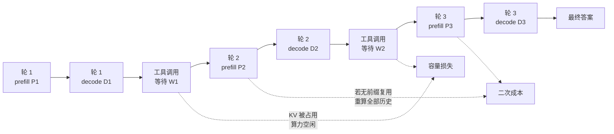
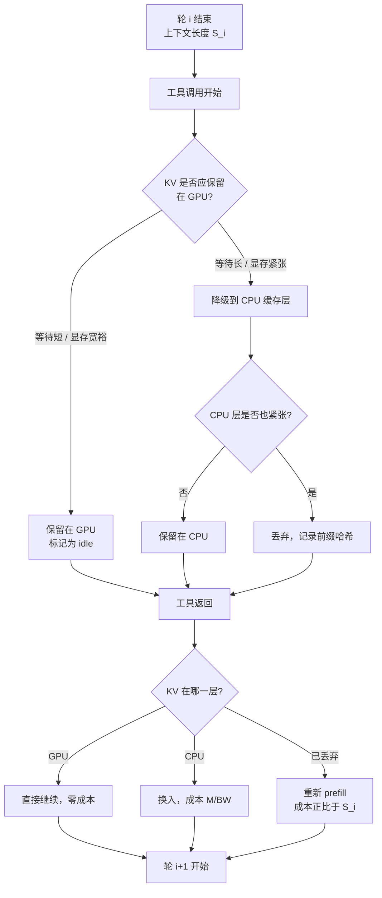
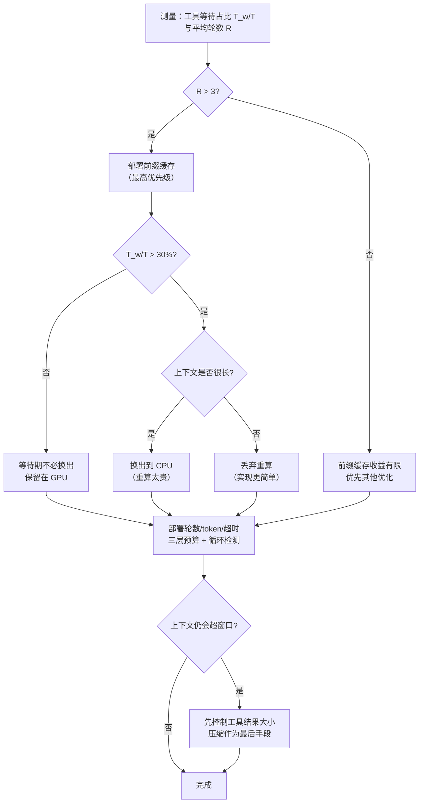

# 工具调用与 agent 循环的推理特征

> 位置：[InferenceAtlas](../../INDEX.md) > [模块 05](README.md) > 当前文档
> 信息截至：2026-07-29 ｜ 最后核验：2026-07-29 ｜ 内容版本：v0.1
> 时效性等级：高
> 相关主题：[reasoning 成本治理](07_reasoning_inference_and_test_time_scaling.md)｜[prompt 缓存与前缀缓存](../03_serving_engines_and_scheduling/08_prompt_caching_and_prefix_caching.md)｜[会话状态](../03_serving_engines_and_scheduling/09_session_memory_and_conversation_state.md)

## 本章导读

agent 工作负载在推理系统看来是一种全新的形状：**一个逻辑任务由多轮生成组成，轮次之间夹着外部调用，且总轮数事先未知**。

这打破了推理服务的两个基本假设。第一，"一个请求 = 一次生成"不再成立——一个 agent 任务可能触发几十次模型调用。第二，"请求在系统中的时间约等于生成时间"不再成立——大量时间花在等待外部工具返回上。

这两点各自带来一个具体的系统问题：

- **上下文单调增长**：每轮把工具结果追加进上下文，prompt 越来越长。若不做前缀复用，第 $n$ 轮的 prefill 成本正比于前 $n-1$ 轮的累积长度，总成本随轮数**二次增长**。
- **等待期间的资源空占**：请求在等工具时占着 KV cache 却不消耗算力。在工具时延显著的场景，这可能吃掉大部分有效容量。

本章分析这两个问题的量化结构，并给出可操作的应对：前缀缓存的正确使用、等待期的 KV 换出决策、以及 agent 任务的调度与预算治理。

## 学习目标

读完本章后，读者应能够：

1. 画出 agent 循环的时间轴，并区分四类时间：prefill、decode、工具等待、调度排队；
2. 推导无前缀复用时上下文累积导致的二次成本增长，并说明前缀缓存如何把它降为线性；
3. 计算工具等待期间的 KV 空占对有效容量的影响，并给出换出决策的判据；
4. 说明为什么 agent 任务的公平调度不能按"请求"计价；
5. 设计 agent 任务的轮数与 token 预算治理机制。

## 核心结论

- **无前缀复用时，agent 的累积 prefill 成本随轮数二次增长**；前缀缓存把它降到线性，这是 agent 服务最重要的单项优化。
- **工具等待期间的 KV 空占是 agent 特有的容量损失**，损失比例约等于等待时间占总驻留时间的比例。
- **换出 KV 是否划算，取决于等待时长与换出/换入成本的比较**，存在明确的阈值。
- **agent 任务必须按"预期总计算量"而非"请求数"计价与准入**，否则容量模型会系统性低估。
- **上下文修改会使前缀缓存失效**：任何在中间插入或改写历史的操作，都会让其后的全部 KV 作废。这一条约束了上下文管理策略的设计空间。

## 1. 问题定义、系统边界与工作负载

### 1.1 agent 循环的时间轴



**图解读**：
1. **本图展示什么**：一个三轮 agent 任务的时间轴，标出了两处系统损失：工具等待期间的 KV 空占，以及每轮 prefill 重算历史带来的二次成本。
2. **核心瓶颈**：两个损失的相对大小取决于工具时延与上下文长度。工具慢（如网络检索、代码执行）时空占主导；上下文长（如长文档分析）时二次 prefill 主导。**必须先测量才能知道优化哪个**。
3. **图中的 trade-off**：消除空占需要换出 KV（引入换出/换入成本）；消除二次成本需要前缀缓存（引入缓存内存占用）。两个优化都是"用另一种资源换取容量"。
4. **面试如何引用**：被问"agent 工作负载有什么特殊之处"时，用这张图给出两条具体的系统损失，而不是泛泛地说"轮数多、上下文长"。

### 1.2 四类时间的分解

一个 agent 任务的端到端时间

$$
T_{\text{total}} = \sum_{i=1}^{R} \left( T_{\text{queue},i} + T_{\text{prefill},i} + T_{\text{decode},i} + T_{\text{wait},i} \right)
$$

- $R$：总轮数（计数，事先未知）；
- $T_{\text{queue},i}$：第 $i$ 轮的排队时间（s）；
- $T_{\text{prefill},i}$、$T_{\text{decode},i}$：生成时间（s）；
- $T_{\text{wait},i}$：工具执行时间（s）。

**关键观察**：$T_{\text{queue}}$ 在 agent 场景中被**放大了 $R$ 倍**。每一轮回到系统都要重新排队。若单轮排队 50 ms、$R = 20$，仅排队就是 1 s。这使得 agent 服务对排队时延的敏感度远高于单轮服务——**同样的 P99 排队时延，在 agent 场景下的用户感知影响是单轮场景的 $R$ 倍**。

**推论**：agent 服务应当考虑**会话粘性**（同一任务的后续轮次优先调度、或保持在同一实例上），以摊薄排队与缓存重建成本。

### 1.3 与传统多轮对话的区别

| 维度 | 多轮对话 | agent 循环 |
|---|---|---|
| 轮间间隔 | 人类思考时间（秒到分钟） | 工具执行时间（毫秒到秒） |
| 轮数 | 用户决定，通常个位数 | 模型决定，可能几十 |
| 轮间是否可释放 KV | 通常释放（间隔长） | 不一定（间隔可能很短） |
| 上下文增长 | 每轮加一问一答 | 每轮加工具调用 + 工具结果（可能很大） |
| 失败处理 | 用户重问 | 需要自动重试/回退逻辑 |

**"工具结果可能很大"值得强调**：一次文件读取、一次搜索、一次数据库查询返回的内容，可能远大于模型自己生成的 token 数。因此 agent 的上下文增长**主要由工具结果驱动，而非模型输出**。这意味着控制 agent 成本的杠杆之一，是控制注入上下文的工具结果大小——截断、摘要、分页。

## 2. 原理、数学与性能模型

### 2.1 上下文累积的二次成本

设第 $i$ 轮结束后上下文总长为 $S_i$，每轮新增 $\Delta_i$（模型输出 + 工具结果）：

$$
S_i = S_0 + \sum_{j=1}^{i} \Delta_j
$$

**无前缀复用时**，第 $i$ 轮必须对全部 $S_{i-1}$ 个 token 做 prefill。总 prefill token 数

$$
N_{\text{prefill}}^{\text{no-cache}} = \sum_{i=1}^{R} S_{i-1}
$$

若 $\Delta_j \equiv \Delta$ 为常数、$S_0$ 可忽略：

$$
N_{\text{prefill}}^{\text{no-cache}} = \sum_{i=1}^{R} (i-1)\Delta = \frac{R(R-1)}{2}\Delta \approx \frac{R^2 \Delta}{2}
$$

- **直觉**：轮数翻倍，prefill 成本变为四倍。这是 agent 成本失控的主要机制。
- **假设**：每轮增量相同；prefill 成本正比于 token 数（忽略注意力的二次项）。
- **局限**：真实的 prefill 成本还含注意力的 $O(S^2)$ 项，在长上下文下会让情况更糟，因此上式是乐观估计。

**有前缀复用时**，第 $i$ 轮只需 prefill 新增的 $\Delta_i$：

$$
N_{\text{prefill}}^{\text{cache}} = \sum_{i=1}^{R} \Delta_i = R\Delta
$$

**节省比例**：

$$
1 - \frac{R\Delta}{R^2\Delta/2} = 1 - \frac{2}{R}
$$

- $R = 5$ 时节省 60%；$R = 10$ 时节省 80%；$R = 20$ 时节省 90%。
- **这是 agent 服务最重要的单项优化**。没有前缀缓存的 agent 服务，在轮数增长时成本会失控。

**下表为按上式计算的模型输出**（非实测数据），设 $\Delta = 2000$ token：

| 轮数 $R$ | 无缓存 prefill token | 有缓存 prefill token | 节省比例 |
|---:|---:|---:|---:|
| 2 | 2,000 | 4,000 | — |
| 5 | 20,000 | 10,000 | 50% |
| 10 | 90,000 | 20,000 | 78% |
| 20 | 380,000 | 40,000 | 89% |
| 50 | 2,450,000 | 100,000 | 96% |

（注意 $R=2$ 时"有缓存"数值更大，因为有缓存列统计的是每轮都要 prefill 的新增量之和 $R\Delta$，而无缓存列为 $R(R-1)\Delta/2$；在 $R \le 3$ 时两者相当或反转。前缀缓存的收益只在轮数足够多时显现。）

### 2.2 工具等待期间的容量损失

设一个 agent 请求的总驻留时间为 $T$，其中工具等待占 $T_w$。若在等待期间保留 KV，则该请求在整个 $T$ 期间都占用 KV 槽位，但只在 $T - T_w$ 期间消耗算力。

**有效容量的损失比例**：

$$
\eta_{\text{loss}} = \frac{T_w}{T}
$$

**含义**：若 KV 是容量瓶颈（通常如此），系统能同时服务的请求数由 KV 决定；而这些槽位中有 $\eta_{\text{loss}}$ 的比例在任意时刻是"空转"的。等价地，**有效吞吐降为无工具时的 $(1 - \eta_{\text{loss}})$ 倍**。

| 工具等待占比 | 有效容量 |
|---|---|
| 10% | 90% |
| 30% | 70% |
| 50% | 50% |
| 70% | 30% |

**这个损失可能非常大**。考虑一个每轮 decode 200 ms、工具执行 500 ms 的 agent：$\eta_{\text{loss}} \approx 500/(200+500) = 71\%$——**近四分之三的 KV 容量在空转**。

### 2.3 KV 换出的决策判据

在等待期间把 KV 换出到 CPU 内存（或直接丢弃后重算），可以释放槽位给其他请求。但换出/换入本身有成本。

设：
- $M$：该请求的 KV 大小（字节）；
- $\text{BW}_{\text{pcie}}$：设备-主机带宽（B/s）；
- $T_w$：预期等待时间（s）；
- $c_{\text{swap}} = 2M / \text{BW}_{\text{pcie}}$：换出+换入的总时间（s）。

**换出划算的条件**（从容量角度）：

$$
T_w > c_{\text{swap}} = \frac{2M}{\text{BW}_{\text{pcie}}}
$$

- **直觉**：只有当等待时间长于搬运时间时，释放出来的槽位才真正可用于服务别的请求。
- **假设**：换出的槽位能被立即利用（系统有排队请求）。若系统空闲，换出纯属浪费。
- **局限**：该式忽略了换入带来的时延增加（用户等待变长）与 PCIe 带宽被占用对其他传输的影响。

**换出 vs 重算**：另一个选择是直接丢弃 KV，等工具返回后重新 prefill。

$$
c_{\text{recompute}} = \frac{S \cdot \text{（每 token prefill 成本）}}{1}
$$

**判据**：$\min(c_{\text{swap}}, c_{\text{recompute}})$ 更小者胜。一般规律：

| 情形 | 更优选择 | 原因 |
|---|---|---|
| 上下文短 | 重算 | prefill 便宜 |
| 上下文长 | 换出 | prefill 的注意力项二次增长 |
| PCIe 带宽紧张 | 重算 | 避免争抢 |
| 算力紧张（高负载） | 换出 | 避免消耗算力 |
| 有前缀缓存命中 | 都不做（保留缓存） | 缓存本身就是"换出到廉价存储" |

**最后一行是关键洞察**：如果系统已有分层的前缀缓存（GPU → CPU → 存储），那么"等待期间怎么办"这个问题已经被缓存层回答了——KV 自然降级到较慢的层，等工具返回时按需提升。**不需要为 agent 单独设计换出逻辑**，只需要确保前缀缓存的驱逐策略认识到"这个请求还会回来"。

### 2.4 agent 任务的资源计价

准入控制若按"请求数"计价，会严重低估 agent 任务的资源需求。正确的计价应基于**预期总计算量**：

$$
n_{\text{eff}} = E[R] \cdot \left( 1 + \frac{E[T_w]}{E[T_{\text{gen}}]} \right)
$$

- $E[R]$：预期轮数；
- $E[T_w]/E[T_{\text{gen}}]$：等待与生成的时间比。
- **直觉**：一个 agent 任务相当于 $E[R]$ 个普通请求，再乘以等待带来的槽位占用放大。
- **局限**：$E[R]$ 在准入时未知，只能用历史统计按任务类型估计。估计偏低会导致过度准入。

**实践做法**：按任务类型维护 $E[R]$ 与等待比的经验分布，准入时按 P75 而非均值计价（保守），并在任务运行中根据实际轮数动态调整剩余预算。

### 2.5 前缀缓存的失效条件

前缀缓存的前提是：**上下文是只追加的**。任何在中间插入、删除或改写的操作，都会使该位置之后的全部 KV 失效。

| 上下文操作 | 缓存影响 |
|---|---|
| 末尾追加工具结果 | 无影响，缓存完全有效 |
| 修改系统提示词 | 全部失效 |
| 在中间插入摘要 | 插入点之后全部失效 |
| 删除早期轮次 | 删除点之后全部失效 |
| 压缩/摘要历史 | 压缩点之后全部失效 |
| 重排工具结果顺序 | 重排点之后全部失效 |

**这一条严重约束了上下文管理策略**。常见的"当上下文太长时，把早期轮次摘要压缩"这个做法，会让**整个后续上下文的 KV 全部作废**——一次压缩的代价是一次全量 prefill。

**设计含义**：
1. 压缩应当**尽量少做且一次做够**，而不是每轮微调；
2. 压缩点应选在**尽可能靠后**的位置（保留更多有效前缀）——但这与"压缩早期内容"的直觉冲突，因为早期内容才是可压缩的。这是一个真实的两难；
3. 更好的做法是**在设计上避免压缩**：控制注入的工具结果大小，使上下文自然不超限。

$$
\text{压缩的净收益} = \underbrace{(\text{节省的后续 prefill 与 attention 成本})}_{\text{持续收益}} - \underbrace{(\text{一次全量 prefill 成本})}_{\text{一次性代价}}
$$

- **推论**：压缩只在"之后还有很多轮"时划算。在任务接近结束时压缩是纯亏损。
- 因此压缩决策应参考**剩余预期轮数**，而不只是当前上下文长度。

## 3. 实现机制与系统设计

### 3.1 前缀缓存与 agent 的配合



**图解读**：
1. **本图展示什么**：把 agent 的等待期 KV 管理统一到分层前缀缓存中——GPU 层、CPU 层、丢弃后重算，三级降级路径。
2. **核心瓶颈**：瓶颈在"等待长/显存紧张"的判断——它需要预测工具耗时，而这在调用发出时通常未知。实用的近似是按工具类型维护历史耗时分布，用 P50 作为预测。
3. **图中的 trade-off**：保留在 GPU 零成本但占容量；降级到 CPU 释放容量但付换入时延；丢弃完全释放但付全量 prefill。三者的相对优劣由等待时长与上下文长度共同决定（见 2.3）。
4. **面试如何引用**：被问"agent 服务如何管理 KV"时，用这张图说明**不需要为 agent 造新机制**，而是把它归约到已有的分层前缀缓存，只需在驱逐策略中加入"该请求预期会回来"这一信号。

**驱逐策略的调整**：普通 LRU 会把等待中的 agent KV 当作"最近未使用"而优先驱逐——这恰好是错的，因为它马上就要被用。驱逐策略应当感知"等待中"状态，给它比真正空闲的缓存更高的保留优先级，但低于活跃请求。

### 3.2 工具结果的注入与截断

上下文增长主要由工具结果驱动，因此这是最直接的成本杠杆。

| 策略 | 机制 | 风险 |
|---|---|---|
| 硬截断 | 超过 $n$ token 直接截断 | 关键信息可能在被截部分 |
| 头尾保留 | 保留前 $a$ 与后 $b$ token | 中间信息丢失 |
| 结构化摘要 | 用小模型摘要后注入 | 增加一次模型调用；摘要可能失真 |
| 分页 | 只注入第一页，模型可请求后续 | 增加轮数（与减少长度冲突） |
| 引用式 | 注入摘要 + 句柄，模型按需取详情 | 需要工具支持按句柄检索 |

**"分页"的两难值得指出**：它减少了单轮的上下文增量，但增加了轮数 $R$。由于 2.1 的成本随 $R$ 二次增长（无缓存时）或线性增长（有缓存时），分页是否划算取决于前缀缓存是否有效：

- **有前缀缓存**：总成本 $\approx R\Delta$，分页把 $\Delta$ 减小而 $R$ 增大，两者大致抵消，但每轮的排队与调度开销增加了。**分页可能是净损失**。
- **无前缀缓存**：总成本 $\approx R^2\Delta/2$，分页对 $R$ 的放大被平方，**分页明确有害**。

**结论**：分页的价值主要不在成本，而在**避免超出上下文窗口**。若不受窗口限制，优先用截断或摘要而非分页。

### 3.3 agent 任务的调度

```
# agent 感知的调度器伪代码
function schedule_agent_aware(pending, running, kv_budget):
    # 1. 等待中的 agent 请求：不占算力但占 KV
    waiting = [r for r in running if r.state == WAITING_TOOL]

    # 2. 计算真实可用的 KV
    kv_used = sum(r.kv_size for r in running)     # 含 waiting
    kv_free = kv_budget - kv_used

    # 3. 若 KV 不足，优先降级等待中的请求（而非抢占活跃请求）
    if kv_free < threshold:
        for r in sorted(waiting, key = lambda r: -r.expected_wait_remaining):
            if r.expected_wait_remaining > swap_cost(r):
                demote_to_cpu(r)                  # 释放 GPU KV
                kv_free += r.kv_size
            if kv_free >= threshold: break

    # 4. 准入新请求：agent 任务按 n_eff 计价
    for r in pending:
        cost = r.n_eff if r.is_agent else 1
        if admit_budget >= cost and kv_free >= r.estimated_kv:
            admit(r)
            admit_budget -= cost

    # 5. 已在进行的 agent 任务的后续轮次优先于新任务
    #    避免长任务饥饿与缓存重建
    return prioritize(continuation_first = True)
```

**三个设计要点**：

1. **等待中的请求应优先被降级，而非抢占活跃请求**。抢占活跃请求会丢失已完成的工作；降级等待中的请求只是把 KV 搬走，工作没有损失。

2. **续轮优先于新任务**。理由有二：一是续轮已经有缓存，调度它的边际成本低；二是让长任务尽快结束能释放它长期持有的 KV。这是"最短剩余处理时间"原则在 agent 场景的体现。但需要防止新任务饥饿——通常配合 aging 机制。

3. **agent 任务按 $n_{\text{eff}}$ 计价准入**。见 2.4。

### 3.4 轮数与预算治理

agent 任务需要三层预算：

| 预算 | 含义 | 强制方式 |
|---|---|---|
| 轮数上限 | 最多调用多少次工具 | 服务端计数，达到即强制收尾 |
| 总 token 上限 | 累积 prompt + 生成 token | 服务端累加，达到即强制收尾 |
| 墙钟超时 | 端到端最长时间 | 定时器，含工具等待 |

**三者都需要**，因为它们防的是不同的失控模式：

- 轮数上限防**循环**（模型反复调用同一工具）；
- token 上限防**上下文爆炸**（工具返回巨量内容）；
- 墙钟超时防**外部依赖挂起**（工具不返回）。

**强制收尾同样适用**（见 [reasoning 成本治理](07_reasoning_inference_and_test_time_scaling.md) 3.5）：达到任一上限时，不应直接截断，而应注入"基于已有信息给出最佳答案"的指令并给一小段收尾预算。

**循环检测**：一个廉价且有效的启发式是检测**重复的工具调用**（相同工具 + 相同参数）。连续或高频的重复调用几乎总是循环的信号，可以在轮数上限之前就触发干预。

```
function detect_loop(call_history, window, threshold):
    recent = call_history[-window:]
    signatures = [hash(c.tool_name, c.arguments) for c in recent]
    most_common_count = max(count(s) for s in set(signatures))
    return most_common_count >= threshold
```

### 3.5 并发工具调用

若模型在一轮中提出多个互相独立的工具调用，可以并发执行：

$$
T_{\text{wait}} = \max_j T_{\text{wait},j} \quad \text{（并发）} \qquad \text{vs.} \qquad \sum_j T_{\text{wait},j} \quad \text{（串行）}
$$

**收益**：等待时间从求和降为取最大值。若 $m$ 个调用耗时相近，等待时间降为 $1/m$。

**代价与约束**：
1. 需要模型支持一次输出多个工具调用（并非所有模型/接口都支持）；
2. 工具之间必须真正独立（无顺序依赖）——这个判断由模型做出，可能出错；
3. 并发调用的失败处理更复杂（部分成功怎么办）；
4. 结果注入顺序需要确定性，否则前缀缓存在重试时无法命中。

**第 4 点容易被忽略**：如果 $m$ 个并发调用的结果按**完成顺序**注入上下文，那么同一组调用在两次运行中可能产生不同的上下文，导致缓存无法复用，也破坏了可复现性。**结果必须按固定顺序（如调用顺序）注入**。

## 4. 性能、成本、能耗与可靠性 trade-off

### 4.1 优化手段的收益排序

| 手段 | 收益量级 | 实施成本 | 前提 |
|---|---|---|---|
| 前缀缓存 | 高（$1 - 2/R$） | 中（引擎支持） | 上下文只追加 |
| 控制工具结果大小 | 高（直接减小 $\Delta$） | 低（工具侧改造） | 可接受信息损失 |
| 等待期 KV 降级 | 中（恢复 $\eta_{\text{loss}}$ 的一部分） | 中 | 分层缓存存在 |
| 并发工具调用 | 中（等待时间 $1/m$） | 中 | 模型与工具支持 |
| 续轮优先调度 | 低到中 | 低 | 调度器可改 |
| 循环检测 | 高（防失控） | 低 | — |

**优先级建议**：先做前缀缓存与工具结果大小控制（收益最高），再做循环检测（防灾），最后才是调度与换出的精细优化。

**为什么循环检测排在"防灾"位置**：它平时不产生收益，但一次未被检测的循环可能消耗掉正常任务几十倍的资源。它的价值在于**削减最坏情况**，这在成本治理中往往比优化平均情况更重要。

### 4.2 时延与成本的取舍

| 决策 | 时延影响 | 成本影响 |
|---|---|---|
| 保留 KV 在 GPU | 无换入延迟 | 占用容量，降低整体吞吐 |
| 换出到 CPU | 换入延迟 | 释放容量 |
| 丢弃重算 | 重新 prefill 延迟 | 释放容量但消耗算力 |
| 并发工具调用 | 等待时间大幅下降 | 工具侧成本可能上升（更多并发调用） |
| 摘要压缩上下文 | 一次额外调用 + 全量 prefill | 后续每轮成本下降 |
| 分页工具结果 | 轮数增加，时延上升 | 见 3.2，可能是净损失 |

### 4.3 可靠性

agent 工作负载的可靠性问题比单轮生成复杂得多，因为**失败可能发生在任何一轮**，且部分完成的状态需要处理。

| 失败模式 | 后果 | 应对 |
|---|---|---|
| 工具超时/失败 | 任务卡住或结果不完整 | 工具级超时 + 把失败作为结果注入，让模型处理 |
| 无限循环 | 资源耗尽 | 轮数上限 + 循环检测（3.4） |
| 上下文超窗口 | 请求失败 | token 上限 + 结果截断 |
| 实例故障 | 整个任务丢失 | 任务状态外部持久化，可在别的实例恢复 |
| 缓存失效导致成本尖峰 | 突发的全量 prefill | 监控缓存命中率；压缩操作要节流 |
| 工具返回恶意/超大内容 | 上下文污染或爆炸 | 工具结果必须校验与限长 |

**"把工具失败作为结果注入"是重要的设计原则**：与其让服务层处理工具失败，不如把错误信息作为工具结果交给模型，让它决定重试、换工具还是放弃。这既简化了服务层，也让失败处理更灵活。但它要求错误信息**结构化且有限长**——不能把一段几万字的堆栈直接注入。

**任务状态的外部持久化**：agent 任务可能运行数分钟，跨越实例重启。若状态只在实例内存中，一次故障就丢失全部进度。持久化的最小状态是**消息历史**（含工具调用与结果）——有了它，任务可以在任何实例上重建（代价是一次全量 prefill）。

### 4.4 能耗

agent 的能耗放大来自两个乘数：

$$
\frac{E_{\text{agent}}}{E_{\text{single}}} \approx R \cdot \left( 1 + \frac{\text{累积 prefill}}{\text{单轮生成}} \right)
$$

在有前缀缓存时，累积 prefill 项被大幅压缩，能耗放大接近 $R$。在无缓存时，它接近 $R^2/2$。

**这再次说明前缀缓存不只是性能优化，也是能耗优化**。在电力受限的部署中，agent 服务若没有前缀缓存，其能耗曲线会随任务复杂度失控。

## 5. benchmark、真实案例或公开部署案例

当前环境的网络出口策略阻断了 `arxiv.org`、`huggingface.co` 等一手来源（详见 [AGENTS.md 第 11 节](../../AGENTS.md)）。因此本节**不引用任何具体的 agent 轮数分布、工具时延或成本数字**。第 2.1 节的表格是按该节公式计算得出的**模型输出**，已明确标注。

| 陈述 | 披露标签 | 状态 |
|---|---|---|
| 主流推理引擎支持前缀缓存 | `开源代码/配置披露` | `待核实`（需补源码/文档链接） |
| 多个商用 API 支持并发工具调用 | `官方披露` | `待核实` |
| 部分 API 提供显式的 prompt 缓存计费档 | `官方披露` | `待核实` |
| agent 任务的典型轮数分布 | — | **不引用**（无一手来源） |

**可自行复现的实验**（`独立可复现实验`）：

1. **二次成本验证**：构造固定增量的多轮 agent 任务，在开关前缀缓存两种配置下测量累积 prefill token 数与耗时。对比 2.1 的公式预测。
2. **等待占比测量**：对真实 agent 流量，统计每个任务的 $T_w/T$ 分布。这个数字直接给出 2.2 的容量损失，是决定是否投入换出优化的依据。
3. **换出阈值验证**：测量本系统的 $\text{BW}_{\text{pcie}}$ 与典型 $M$，算出 2.3 的阈值 $T_w^*$；与实测等待时长分布比较，判断有多少比例的等待值得换出。
4. **压缩净收益**：在不同剩余轮数下执行上下文压缩，测量一次性代价与后续节省，验证 2.5 的"压缩只在后续轮数多时划算"。
5. **分页 vs 截断**：对同一任务集分别用分页与截断策略，测量总 token 数、总轮数与端到端时延。验证 3.2 的判断。
6. **循环检测的有效性**：在流量中统计重复工具调用的频率分布，确定 3.4 的 `threshold` 使误报率可接受。
7. **并发工具调用的收益**：对支持并发的任务，比较串行与并发的 $T_w$，验证 $\max$ vs $\sum$ 的差距。

> 实验方法论要求见 [如何读推理 benchmark](../00_start_here/03_how_to_read_inference_benchmarks.md)。

## 6. 设计决策框架



**图解读**：
1. **本图展示什么**：agent 服务的优化决策路径，从测量开始，按收益优先级依次决定前缀缓存、等待期策略、预算治理与上下文控制。
2. **核心瓶颈**：瓶颈是最上游的两项测量（$T_w/T$ 与 $R$）——没有它们，后续所有决策都是猜测。这两个数字很容易测但常被跳过。
3. **图中的 trade-off**：换出 vs 重算的分叉（右侧）是用 PCIe 带宽换算力还是相反；压缩 vs 控制结果大小的分叉（底部）是用一次全量 prefill 换后续节省，还是用信息损失换成本。
4. **面试如何引用**：被问"如何优化 agent 服务"时，按这张图从"先测两个数"讲起——这展示了"优化前先量化"的工程纪律，比直接罗列优化手段更有说服力。

### 决策清单

| 问题 | 若答案为"是" | 若答案为"否" |
|---|---|---|
| 平均轮数 > 3？ | 前缀缓存是最高优先级 | 收益有限 |
| 上下文只追加？ | 前缀缓存可完全生效 | 需重新设计上下文管理 |
| 工具等待占比 > 30%？ | 值得做等待期 KV 管理 | 保留在 GPU 即可 |
| 有分层前缀缓存？ | 复用它，不必造新机制 | 需实现换出逻辑 |
| 工具结果可截断？ | 优先控制大小 | 考虑摘要或分页 |
| 存在重复调用风险？ | 必须部署循环检测 | 轮数上限即可 |
| 任务可能跨实例？ | 状态需外部持久化 | 内存状态可接受 |

## 7. 常见失败模式与排查路径

| 症状 | 可能原因 | 排查步骤 |
|---|---|---|
| 成本随任务复杂度爆炸 | 前缀缓存未生效，二次成本（2.1） | 统计每轮实际 prefill token 数；应约等于增量而非累积 |
| 前缀缓存命中率低 | 上下文被中途修改（2.5） | 逐轮比对上下文前缀哈希，定位首个变化点 |
| 每次压缩后出现成本尖峰 | 压缩使全部后续 KV 失效（2.5） | 减少压缩频率；把压缩点尽量后移 |
| 系统吞吐远低于预期 | 等待期 KV 空占（2.2） | 统计 $T_w/T$；对比"活跃请求数"与"占用 KV 的请求数" |
| 换出后反而更慢 | 换出成本超过等待时长（2.3） | 比较实测 $T_w$ 与 $2M/\text{BW}$ |
| 长任务饥饿 | 新任务持续插队 | 检查调度是否续轮优先；加 aging |
| 新任务饥饿 | 续轮优先过度 | 给续轮优先级设上限；保留新任务配额 |
| 单个任务耗尽资源 | 循环未被检测（3.4） | 检查工具调用签名的重复率 |
| 上下文超窗口失败 | 工具结果未限长 | 对所有工具结果强制上限 |
| 重试时缓存不命中 | 并发结果按完成顺序注入（3.5） | 改为按调用顺序注入 |
| 实例重启后任务丢失 | 状态未持久化（4.3） | 持久化消息历史 |
| 准入控制反复过载 | 按请求数而非 $n_{\text{eff}}$ 计价（2.4） | 改用预期总计算量计价 |

**排查原则**：agent 的问题分两类——**成本类**几乎总是前缀缓存失效或工具结果过大；**容量类**几乎总是等待期空占或计价错误。先按这两条主线排查，再看细节。

## 8. 关联面试主题

1. **agent 上下文累积的二次成本，以及前缀缓存如何降为线性**——见本章 2.1，这是最核心的量化结论。
2. **工具等待期间的 KV 空占如何量化**——见本章 2.2，$\eta_{\text{loss}} = T_w/T$。
3. **换出 vs 重算的决策判据**——见本章 2.3。
4. **为什么上下文压缩会使前缀缓存全部失效**——见本章 2.5，以及由此产生的两难。
5. **agent 任务为什么不能按请求数计价**——见本章 2.4。
6. **等待中的请求为什么应优先降级而非抢占活跃请求**——见本章 3.3。
7. **分页工具结果为什么可能是净损失**——见本章 3.2。
8. **并发工具调用为什么必须按固定顺序注入结果**——见本章 3.5。
9. **agent 需要哪三层预算，各防什么**——见本章 3.4。
10. **为什么"把工具失败作为结果注入模型"是更好的设计**——见本章 4.3。

## 9. 小结

agent 工作负载对推理系统的两个核心冲击是**上下文单调增长**与**等待期资源空占**，它们分别对应一个可量化的损失与一个明确的应对：

**上下文增长**导致无前缀复用时累积 prefill 成本随轮数二次增长。前缀缓存把它降为线性，节省比例为 $1 - 2/R$——十轮任务节省约 80%。这使前缀缓存成为 agent 服务收益最高的单项优化，且它同时是能耗优化。但它有一个硬前提：**上下文必须只追加**。任何中途修改（尤其是"上下文太长就压缩"这个常见做法）会使其后全部 KV 作废，代价是一次全量 prefill。因此压缩只在剩余轮数足够多时划算，更好的做法是从源头控制工具结果的大小。

**等待期空占**导致有效容量降为 $(1 - T_w/T)$ 倍，这个损失可能达到一半以上。应对手段是把等待中的 KV 降级到分层缓存的下一层，是否值得由 $T_w$ 与 $2M/\text{BW}$ 的比较决定。关键的实现洞察是：**不需要为 agent 单独设计换出机制**，只需让已有的分层前缀缓存的驱逐策略知道"这个请求还会回来"。

除这两点之外，还有三条独立但重要的结论：

- **计价必须按预期总计算量**（$E[R]$ 与等待比的乘积），而非请求数；按请求数计价的准入控制会系统性低估 agent 的资源需求。
- **调度上应续轮优先、等待中的请求优先降级**——前者让长任务尽快释放资源，后者避免丢失已完成的工作。
- **三层预算（轮数、token、墙钟）加循环检测**是防止单个任务失控的必需品。循环检测平时不产生收益，但它削减的是最坏情况，这在成本治理中通常比优化平均情况更重要。

## 关键术语

| 中文术语 | 英文 | 定义 | 单位/口径 | 关联文档 |
|---|---|---|---|---|
| agent 循环 | agent loop | 模型与工具交替执行、轮数由模型决定的推理过程 | 轮数为计数 | 本章 1.1 |
| 工具等待时间 | tool wait time | 请求等待外部工具返回的时长 | s | 本章 2.2 |
| KV 空占 | idle KV occupancy | 请求占用 KV 但不消耗算力的状态 | 比例 | 本章 2.2 |
| 二次 prefill 成本 | quadratic prefill cost | 无前缀复用时累积 prefill 随轮数的二次增长 | token | 本章 2.1 |
| 前缀缓存失效 | prefix cache invalidation | 上下文中途修改导致其后 KV 全部作废 | — | 本章 2.5 |
| KV 换出 | KV swap-out | 把 KV 从显存搬到主机内存以释放容量 | 字节、s | 本章 2.3 |
| 续轮优先 | continuation-first scheduling | 优先调度已在进行的任务的后续轮次 | — | 本章 3.3 |
| 循环检测 | loop detection | 通过重复工具调用签名识别失控循环 | — | 本章 3.4 |
| 等效请求数 | effective request count | agent 任务折算的资源占用当量 | 计数 | 本章 2.4 |

## 延伸阅读

- [reasoning 推理与 test-time scaling 的成本治理](07_reasoning_inference_and_test_time_scaling.md) — 预算治理与强制收尾的通用机制
- [prompt 缓存与前缀缓存](../03_serving_engines_and_scheduling/08_prompt_caching_and_prefix_caching.md) — 前缀缓存的实现基础
- [会话记忆与对话状态](../03_serving_engines_and_scheduling/09_session_memory_and_conversation_state.md) — 多轮状态管理
- [请求调度与准入控制](../03_serving_engines_and_scheduling/04_request_scheduling_and_admission_control.md) — $n_{\text{eff}}$ 计价的调度背景
- [长上下文推理](../02_transformer_and_kv_cache/07_long_context_inference.md) — 上下文增长的注意力成本
- [prefill vs decode](../02_transformer_and_kv_cache/02_prefill_vs_decode.md) — 两阶段的成本差异
- [容量规划](../01_foundations_and_metrics/08_capacity_planning.md) — 把 agent 纳入容量模型

## 主要来源

本章的成本模型与判据为本库自洽推导。第 2.1 节的表格为公式计算结果（非实测），已在正文标注。涉及具体产品与框架的陈述已在第 5 节标注为 `待核实`；agent 轮数分布、工具时延与成本的具体数字**未引用**，原因是当前环境无法访问相应的一手来源（详见 [AGENTS.md 第 11 节](../../AGENTS.md)）。

| 类别 | 说明 | 披露标签 |
|---|---|---|
| 二次成本推导与节省比例 | 本库推导，已标注假设与局限 | — |
| KV 空占与换出阈值模型 | 本库推导 | — |
| 第 2.1 节数值表 | 由本章公式计算，非实测 | — |
| 各框架与产品的具体能力 | 需一手核验 | `待核实` |
| agent 流量的经验分布 | 无一手来源，**未给出** | — |

## 更新记录

| 日期 | 版本 | 变更 | 核验人 |
|---|---|---|---|
| 2026-07-29 | v0.1 | 初稿：agent 的二次 prefill 成本与前缀缓存收益、等待期 KV 空占与换出判据、调度与三层预算治理 | — |
