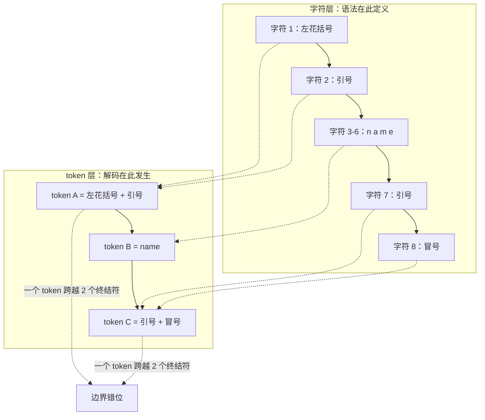
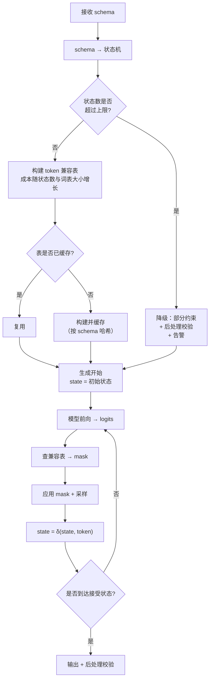
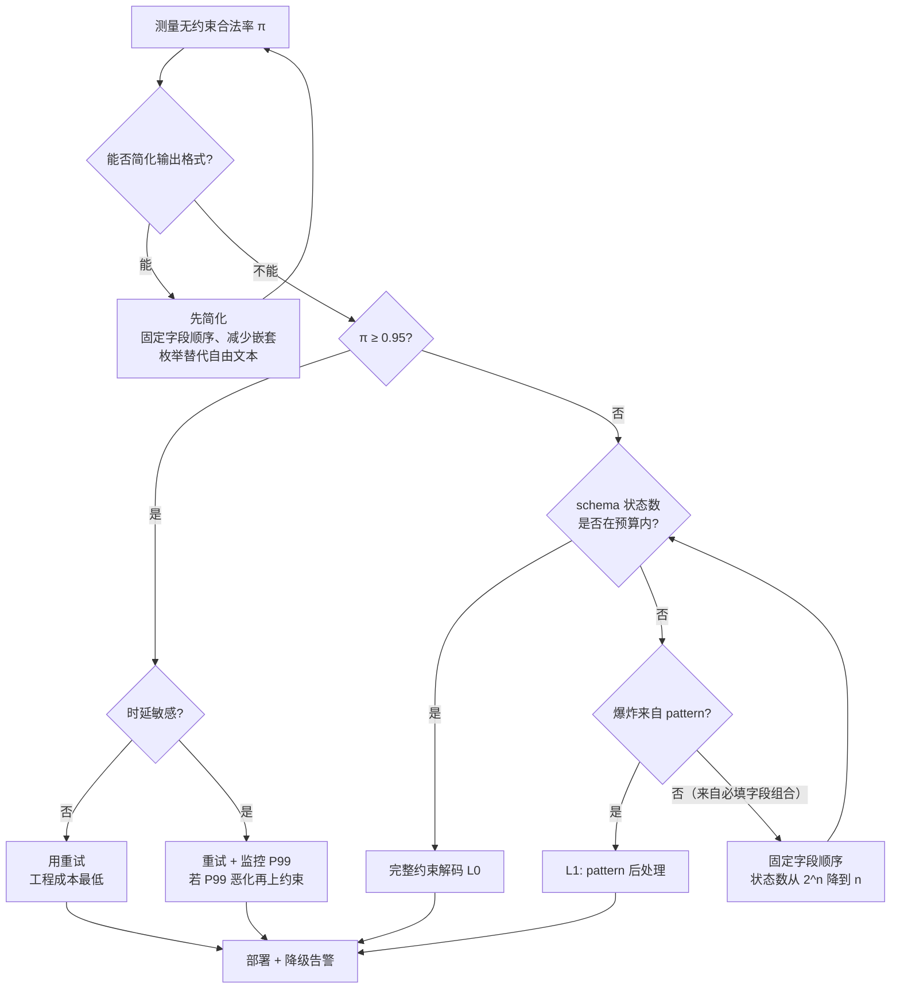

# 结构化输出与语法约束解码

> 位置：[InferenceAtlas](../../INDEX.md) > [模块 05](README.md) > 当前文档
> 信息截至：2026-07-29 ｜ 最后核验：2026-07-29 ｜ 内容版本：v0.1
> 时效性等级：中
> 相关主题：[束搜索与约束解码](03_beam_search_and_constrained_decoding.md)｜[工具调用与 agent 循环](08_tool_use_and_agent_inference.md)｜[采样参数](02_greedy_sampling_topk_topp_temperature.md)

## 本章导读

当模型输出要被程序解析——JSON、函数调用参数、SQL、配置文件——"大概率格式正确"是不够的。一个 99% 合法率的服务，在每天百万次调用下意味着每天一万次解析失败。

[束搜索与约束解码](03_beam_search_and_constrained_decoding.md) 第 2.5 节已给出约束解码的数学形式与成本模型。**本章展开工程实现**，聚焦于三个在实践中真正困难的问题：

1. **token 与语法的边界错位**——语法定义在字符上，解码发生在 token 上，两者不对齐。这是约束解码最深的实现难点。
2. **状态机的构建与状态爆炸**——从 JSON schema 或正则表达式到可用的状态机，中间有大量工程；某些语法会导致状态数爆炸。
3. **约束不保证语义**——格式合法的输出可能内容为空、类型对但值荒谬。约束解码解决的是解析问题，不是正确性问题。

本章还讨论一个常被忽略的选项：**很多时候不需要约束解码**。如果合法率已经很高、或者可以用更简单的输出格式，重试或格式简化的工程成本远低于约束解码。

## 学习目标

读完本章后，读者应能够：

1. 解释 token-语法边界错位问题，并说明 token 兼容表如何解决它；
2. 从一个 JSON schema 推导出对应的状态机结构，并识别可能导致状态爆炸的构造；
3. 计算约束解码的每步开销，并设计缓存策略把它摊薄；
4. 判断某个场景应该用约束解码、重试、还是简化输出格式；
5. 列出约束解码不能解决的问题，避免过度承诺。

## 核心结论

- **token 与语法的边界错位是核心难点**：必须预计算"每个状态下哪些 token 合法"的兼容表，且这个表的构建可能很昂贵。
- **状态爆炸的主要来源是正则与枚举的组合**，而非 JSON 结构本身；识别并简化这些构造比优化实现更有效。
- **mask 缓存的命中率决定约束解码是几乎免费还是每步都贵**，而命中率取决于状态空间大小与访问局部性。
- **约束解码保证语法，不保证语义**：它能让输出一定是合法 JSON，不能让字段值正确。
- **在合法率已高的场景，重试比约束解码更划算**——约束解码的工程与运行成本不是零。

## 1. 问题定义、系统边界与工作负载

### 1.1 结构化输出的三个层次

| 层次 | 要求 | 保证方式 |
|---|---|---|
| **语法合法** | 输出是合法 JSON / 可解析 | 约束解码可硬保证 |
| **schema 符合** | 字段名、类型、必填项正确 | 约束解码可硬保证（若 schema 编码进状态机） |
| **语义正确** | 字段值是正确答案 | **约束解码不能保证** |

**这三层的区分至关重要**。约束解码常被误解为"让模型输出正确的结构化数据"，实际上它只覆盖前两层。一个被约束的模型可以输出 `{"age": 999, "name": ""}`——完全符合 schema，完全没有用。

**推论**：约束解码消除的是**解析失败**这一类故障，不消除**内容错误**。后者需要业务层校验，两者不可互相替代。

### 1.2 三条技术路线的对比

| 方案 | 保证强度 | 每步开销 | 预处理成本 | 实现复杂度 |
|---|---|---|---|---|
| 提示词要求格式 | 无 | 零 | 零 | 极低 |
| 生成后校验 + 重试 | 概率（多次重试后很高） | 零 | 零 | 低 |
| 语法约束解码 | 硬保证 | $O(V)$ mask | 状态机 + 兼容表构建 | 高 |
| 简化输出格式 | 提高合法率 | 零 | 零 | 低（但需改协议） |

**第四行"简化输出格式"常被忽略**：很多结构化输出的困难，来自输出格式本身过于复杂。把深层嵌套的 JSON 改为扁平的键值对、把自由字符串改为枚举、把可选字段改为必填并允许空值——这些改动能显著提高模型的自然合法率，成本远低于实现约束解码。

> **工程建议**：在实现约束解码之前，先花时间简化输出格式并测量合法率。很多情况下，格式简化就足够了。

### 1.3 系统边界

约束解码位于采样管线中，在温度与截断之后、抽样之前（见 [采样参数](02_greedy_sampling_topk_topp_temperature.md) 1.1）。它的输入是当前状态机状态与 logits，输出是掩码后的 logits。

它**不改变**：模型权重、KV cache、批处理逻辑、调度。
它**引入**：每请求的状态机状态（需在抢占时保存）、每步的 mask 计算、预处理阶段的表构建。

## 2. 原理、数学与性能模型

### 2.1 token-语法边界错位

这是约束解码最深的问题，值得从头讲清楚。

**语法定义在字符上**。一个 JSON 语法说的是："对象以 `{` 开始，然后是字符串键，然后是 `:`，……"。这些都是**字符**层面的规则。

**解码发生在 token 上**。模型的词表中，一个 token 可能是 `{"`（左括号+引号）、`":` （引号+冒号）、`", "`（引号逗号空格引号）。这些 token **横跨了语法的多个终结符边界**。



**图解读**：
1. **本图展示什么**：同一段 JSON 前缀 `{"name":` 在字符层与 token 层的两种切分方式，以及它们如何不对齐——单个 token 可以跨越多个语法终结符。
2. **核心瓶颈**：瓶颈是**不能简单地"按语法下一个终结符"来判断 token 是否合法**。必须判断"这个 token 展开成的字符串，是否能被当前状态的语法接受（可能推进多步）"。这个判断对每个 (状态, token) 对都要做一次。
3. **图中的 trade-off**：预计算全部 (状态, token) 组合能让运行时 $O(1)$ 查表，但表的大小是 $|S| \times V$；按需计算省内存但运行时贵。这是典型的时空权衡，且在 $V$ 很大时表可能装不下。
4. **面试如何引用**：被问"约束解码难在哪"时，用这张图说明难点不在语法解析（那是成熟技术）而在**词表与语法的粒度不匹配**，这是 LLM 特有的问题。

**形式化**：设状态机状态集为 $S$，token $t$ 的字符展开为 $\sigma(t)$。token $t$ 在状态 $s$ 下合法，当且仅当从 $s$ 出发，逐字符消费 $\sigma(t)$ 后不进入死状态：

$$
\text{legal}(s, t) \iff \hat{\delta}(s, \sigma(t)) \ne \bot
$$

其中 $\hat{\delta}$ 是字符级转移函数的扩展（对字符串逐字符应用），$\bot$ 表示拒绝状态。

**新状态**：$\delta_{\text{token}}(s, t) = \hat{\delta}(s, \sigma(t))$。

**兼容表**：预计算矩阵 $L \in \{0,1\}^{|S| \times V}$，其中 $L[s][t] = \text{legal}(s, t)$。

- **构建成本**：$O(|S| \cdot V \cdot \bar{\ell})$，其中 $\bar{\ell}$ 是 token 的平均字符长度。
- **存储成本**：$|S| \cdot V / 8$ 字节（位图）。
- **直觉**：$V$ 为十万量级、$|S|$ 为一千量级时，位图约 12.5 MB——可接受。但 $|S|$ 到十万时就是 1.25 GB——不可接受。**状态数是关键约束**。

### 2.2 部分 token 的问题

上式假设 $\sigma(t)$ 能被完整消费。但存在一种情形：token 的前缀合法，后缀不合法。例如状态要求接下来是 `}` 结束对象，而 token 是 `}}`——第一个 `}` 合法，第二个不合法（对象已结束，外层可能不是对象）。

**处理方式有两种**：

| 方式 | 做法 | 后果 |
|---|---|---|
| 严格 | 只允许完整合法的 token | 简单正确，但可能过度限制（合法输出被排除） |
| 宽松（回填） | 允许部分匹配，记录"未消费的后缀" | 更灵活，但状态需要携带缓冲区，状态空间扩大 |

**实践倾向于严格方式**：它简单、正确、可预测。宽松方式的状态需要携带一个字符缓冲，使状态不再有限，兼容表无法预计算。

**严格方式的代价**：某些语法上合法的输出无法被生成，因为达到它需要一个"跨界"的 token。这在实践中通常可接受——模型总能用其他 token 组合表达同样的字符串。但它确实**改变了输出分布**（相对于无约束时在合法输出上的条件分布），这一点应被知晓。

### 2.3 从 JSON schema 到状态机

JSON 语法本身是**上下文无关**的（嵌套需要栈），但对固定的 schema，嵌套深度是有界的，因此可以展开为**有限状态机**。

一个 schema 的状态机结构：

```
schema: {"type":"object", "properties": {"name": {"type":"string"},
                                         "age": {"type":"integer"}},
         "required": ["name","age"]}
```

对应的状态序列（简化）：

```
S0  期待 {
S1  期待 " （开始键名）
S2  在键名中，期待 name 或 age 的字符
S3  键名结束，期待 :
S4  期待值的开始（类型由键决定）
S5a 在字符串值中（若键为 name）
S5b 在整数值中（若键为 age）
S6  值结束，期待 , 或 }
S7  接受
```

**关键设计点**：

| 特性 | 状态机处理 | 状态数影响 |
|---|---|---|
| 固定字段名 | 键名的字符前缀树 | 与字段名总字符数成正比 |
| required 字段 | 需跟踪已出现字段的集合 | **乘以 $2^{n_{\text{fields}}}$** |
| 字段顺序自由 | 同上 | 同上 |
| 类型约束 | 值部分的子状态机 | 加法 |
| enum 值 | 枚举值的前缀树 | 与枚举总字符数成正比 |
| 嵌套对象 | 子状态机 + 返回点 | 乘法 |
| 数组 | 循环结构 | 加法 |
| pattern（正则） | 该正则的 DFA | **可能爆炸** |

**"required 字段乘以 $2^{n}$"是状态爆炸的主要来源之一**：如果 schema 有 $n$ 个必填字段且顺序自由，状态机必须记住"哪些字段已经出现"，这是一个 $2^n$ 的子集状态。$n = 10$ 时是 1024 倍，$n = 20$ 时是一百万倍。

**缓解手段**：

1. **固定字段顺序**。如果 schema 要求字段按固定顺序出现，状态机只需一个计数器而非子集，状态数从 $2^n$ 降到 $n$。这是**最有效的单项简化**，代价是输出格式的约束更严（但对程序解析而言毫无影响）。
2. **放宽为"至少出现"**。不检查必填，生成后校验。把 required 的检查从解码期移到后处理，代价是可能需要重试。
3. **分层生成**。把大 schema 拆成多次调用，每次生成一部分。

> **实践判据**：如果 schema 的必填字段超过约 8 个且顺序自由，**先考虑固定字段顺序**，再考虑优化实现。

### 2.4 正则与状态爆炸

`pattern` 约束（正则表达式）是另一个爆炸源。正则到 DFA 的转换在最坏情况下是指数的：

$$
|S_{\text{DFA}}| \le 2^{|S_{\text{NFA}}|}
$$

**典型的爆炸构造**：

| 正则模式 | 问题 | 替代 |
|---|---|---|
| `.*foo.*bar.*` | 多个通配 + 子串，NFA 需子集构造 | 改为后处理校验 |
| `(a\|b\|c){10,20}` | 计数约束展开 | 改为长度校验 |
| 复杂的回溯引用 | 不是正则语言，无法 DFA 化 | 必须后处理 |
| 简单枚举 `^(red\|green\|blue)$` | 前缀树，状态少 | 无需改 |
| 固定格式如日期 `^\d{4}-\d{2}-\d{2}$` | 线性状态链，状态少 | 无需改 |

**规律**：**锚定的、无通配的、长度固定的正则是安全的；含 `.*` 与不定次重复的正则是危险的**。

**工程建议**：对 schema 中的每个 `pattern`，在构建阶段计算其 DFA 状态数并设置上限。超过上限的 pattern 降级为"后处理校验"而非解码期约束，并记录告警。这比在运行时才发现内存爆炸要好得多。

### 2.5 开销模型与缓存

每步的约束开销（见 [束搜索与约束解码](03_beam_search_and_constrained_decoding.md) 2.5）：

$$
c_{\text{constrain}} = c_{\delta} + c_{\text{mask}}
$$

有兼容表时，$c_{\text{mask}}$ 是从表中取一行（$V/8$ 字节）并应用到 logits：

$$
c_{\text{mask}} \approx \frac{V/8 + V \cdot b}{\text{BW}}
$$

- $V$：词表大小；$b$：logit 字节数；$\text{BW}$：内存带宽（B/s）。
- **直觉**：读一行位图 + 读写一行 logits。
- **对比基准**：普通采样管线本身就要多次遍历 $[B,V]$（见 [采样参数](02_greedy_sampling_topk_topp_temperature.md) 2.5）。因此**约束的增量开销与采样管线同量级**，通常不是主导项。

**批处理的困难**：每个请求的状态不同，因此每个请求要取兼容表的不同行。这是一次 gather 操作，形状 $[B, V]$。它无法像权重那样被共享。

**mask 缓存的作用**：如果同一状态被多个请求或多个步骤命中，可以缓存已构造的 mask 张量。命中率取决于：

| 因素 | 对命中率的影响 |
|---|---|
| 状态数少 | 命中率高 |
| 请求间 schema 相同 | 命中率高（同一 schema 的状态复用） |
| 结构化部分占比高 | 命中率高（键名、括号等状态重复） |
| 自由文本字段多 | 命中率低（字符串内部状态可能各异） |

**关键观察**：JSON 输出中，**结构部分（括号、键名、冒号、逗号）的状态高度重复，而自由文本值的状态较少变化**（在字符串内部，通常只有一个"在字符串中"的状态）。因此实际命中率往往很高——这是约束解码在实践中开销可接受的原因。

## 3. 实现机制与系统设计

### 3.1 完整的处理流程



**图解读**：
1. **本图展示什么**：从 schema 到输出的完整流程，含状态数上限检查、兼容表构建与缓存、逐步 mask 与转移。
2. **核心瓶颈**：瓶颈是"构建 token 兼容表"这一步，其成本 $O(|S| \cdot V \cdot \bar{\ell})$ 在首次遇到某个 schema 时全额支付。若每个请求都用不同的 schema，这个成本无法摊销，约束解码会变得非常昂贵。
3. **图中的 trade-off**：状态数上限的设置——设得低会频繁降级（失去硬保证），设得高会有内存与构建时间风险。这个阈值应按可用内存与可接受的首次时延来定。
4. **面试如何引用**：被问"约束解码在生产中怎么部署"时，用这张图强调**按 schema 缓存兼容表**是关键——这把一次性的重成本变成了可摊销的成本，前提是 schema 集合有限。

**schema 缓存的前提**：生产中 schema 的数量通常是有限的（每个 API 端点一个），因此按 schema 哈希缓存兼容表非常有效。但如果允许用户传入任意 schema，缓存命中率会崩塌——此时应对**用户提供的 schema 施加更严的状态数上限**，并考虑限流。

### 3.2 状态机的运行时表示

```
struct ConstraintState:
    machine_id: int          # 指向共享的状态机（按 schema 缓存）
    node: int                # 当前状态编号
    stack: [int]             # 嵌套返回点（对象/数组的层级）
    seen_fields: bitset      # 已出现的必填字段（若顺序自由）

function advance(state, token) -> ConstraintState:
    machine = machine_table[state.machine_id]
    new_node = machine.token_transition[state.node][token]
    if new_node == REJECT:
        raise ConstraintViolation      # 不应发生：mask 已排除该 token

    new_state = copy(state)
    new_state.node = new_node
    apply_stack_ops(new_state, machine.stack_action[state.node][token])
    apply_field_ops(new_state, machine.field_action[state.node][token])
    return new_state

function get_mask(state) -> BitVector:
    key = (state.machine_id, state.node, state.stack_top, state.seen_fields)
    if key in mask_cache:
        return mask_cache[key]
    mask = compute_mask(state)
    mask_cache.put(key, mask)
    return mask
```

**设计要点**：

1. **状态机本身是共享的**（按 schema），只有"当前位置"是每请求的。这使得每请求的状态很小（几十字节），可以廉价地保存与恢复。
2. **栈的存在意味着状态不是纯有限的**——嵌套深度理论上无界。实践中必须设深度上限（如 32），超过即拒绝。这个上限也是安全边界，防止恶意 schema 或恶意生成导致栈爆炸。
3. **缓存键必须包含全部影响 mask 的分量**（节点、栈顶、已见字段）。只用 `node` 做键是一个常见 bug，会导致在不同嵌套层级返回错误的 mask。

**抢占时的状态保存**：`ConstraintState` 必须与请求的其他状态一起持久化。若抢占后重算而不恢复约束状态，生成会从错误的语法位置继续——产生格式错误的输出，且难以定位。

### 3.3 与其他解码技术的组合

| 组合 | 要点 |
|---|---|
| **温度与截断** | 约束 mask 应在温度之后、截断之前应用；否则截断可能只保留非法 token，导致归一化时分母为零 |
| **投机解码** | draft 与 target 必须应用**同一** mask；否则 draft 提议大量非法 token，接受率崩塌（见 [束搜索与约束解码](03_beam_search_and_constrained_decoding.md) 4.4） |
| **前缀缓存** | 无冲突——约束状态与 KV 独立 |
| **束搜索** | 每条 beam 需要独立的约束状态；fork 时复制状态 |
| **停止条件** | 到达接受状态即可停止，无需等 EOS；这实际上**缩短了输出** |

**"约束在温度之后、截断之前"值得展开**：

```
logits → 温度缩放 → 约束 mask（非法置 -inf） → top-k/top-p 截断 → 归一化 → 采样
```

如果顺序反过来（先截断后 mask），可能出现截断保留的 $k$ 个 token 全部非法，mask 后全部为 $-\infty$，归一化时 $0/0$ 产生 NaN。**这是约束解码最常见的崩溃原因**。

正确顺序下也需要防御：mask 后应断言至少有一个 token 合法。若状态机设计正确，可达状态的允许集永不为空，但实现 bug 会打破这一点，断言能让问题立刻暴露而非静默产生 NaN。

**"到达接受状态即停止"是一个额外收益**：约束解码不仅保证格式，还消除了"模型在合法 JSON 之后继续输出解释文字"这一常见问题。输出会在结构完成的那一刻精确终止。

### 3.4 降级策略

不是所有 schema 都能被完整约束。需要一个明确的降级阶梯：

| 级别 | 约束范围 | 何时使用 |
|---|---|---|
| L0 完整约束 | 语法 + schema + 所有 pattern | 状态数在预算内 |
| L1 结构约束 | 语法 + 字段名与类型，pattern 后处理 | pattern 导致爆炸 |
| L2 语法约束 | 只保证是合法 JSON | schema 过于复杂 |
| L3 无约束 | 提示词 + 后处理重试 | 状态机构建失败 |

**降级必须被记录与告警**：静默降级会让运维方以为有硬保证，而实际上没有。每次降级应记录 schema 标识、降级原因（状态数、pattern 复杂度）与降级级别。

**降级的用户可见性**：如果 API 承诺"结构化输出保证"，降级到 L2/L3 意味着这个承诺打折。是否向调用方暴露这一点是产品决策，但**服务内部必须知道**。

### 3.5 预处理的成本管理

兼容表构建是 $O(|S| \cdot V \cdot \bar{\ell})$，对大 $|S|$ 可能耗时可观。管理手段：

| 手段 | 说明 |
|---|---|
| 按 schema 哈希缓存 | 最重要，见 3.1 |
| 离线预构建 | 对已知的固定 schema 集合，在服务启动时构建 |
| 惰性构建 | 只在实际到达某状态时构建该行，而非全表 |
| 行级缓存 | 与惰性构建配合，缓存已构建的行 |
| 构建超时 | 超时即降级到 L2 |

**惰性 + 行级缓存通常是最优组合**：实际生成过程只会访问状态空间的一小部分（大多数状态在典型输出中不可达）。全表构建是浪费。惰性构建把成本从 $O(|S| \cdot V \cdot \bar{\ell})$ 降到 $O(|S_{\text{visited}}| \cdot V \cdot \bar{\ell})$，而 $|S_{\text{visited}}|$ 通常远小于 $|S|$。

**代价**：首次访问某状态时有一次 $O(V \cdot \bar{\ell})$ 的构建，会造成时延毛刺。对时延敏感的服务，应对热点 schema 做离线预构建。

## 4. 性能、成本、能耗与可靠性 trade-off

### 4.1 约束 vs 重试的量化对比

（基础判据见 [束搜索与约束解码](03_beam_search_and_constrained_decoding.md) 4.3。这里补充更完整的考量。）

设无约束下格式合法率 $\pi$，最多重试 $m$ 次：

$$
E[\text{生成次数}] = \frac{1 - (1-\pi)^{m+1}}{\pi}, \qquad \Pr[\text{最终失败}] = (1-\pi)^{m+1}
$$

| $\pi$ | $m=0$ 失败率 | $m=2$ 失败率 | $m=2$ 期望生成次数 |
|---|---|---|---|
| 0.80 | 20% | 0.80% | 1.24 |
| 0.90 | 10% | 0.10% | 1.11 |
| 0.95 | 5% | 0.0125% | 1.05 |
| 0.99 | 1% | 0.0001% | 1.01 |

（上表为按上式计算的**模型输出**，非实测数据。）

**从表中读出**：

1. **在 $\pi \ge 0.95$ 时，两次重试就把失败率压到万分之一量级，期望成本只增加 5%**。此时约束解码的工程投入很难回本。
2. **在 $\pi \le 0.8$ 时，重试的成本明显（+24%）且失败率仍不可忽略**，约束解码有价值。
3. 但重试还有一个隐藏代价：**时延方差**。重试请求的时延是正常的 2–3 倍，会显著恶化 P99。对时延敏感的服务，这可能比成本更重要。

**综合判据**：

| $\pi$ | 时延敏感 | 建议 |
|---|---|---|
| ≥ 0.95 | 否 | 重试即可 |
| ≥ 0.95 | 是 | 重试仍可，但监控 P99 |
| 0.8–0.95 | 否 | 二者皆可，看工程成本 |
| 0.8–0.95 | 是 | 倾向约束解码 |
| < 0.8 | — | 先简化格式；仍不足则约束解码 |

### 4.2 约束解码的完整成本

| 成本项 | 量级 | 何时支付 |
|---|---|---|
| 状态机构建 | 与 schema 复杂度相关 | 首次遇到该 schema |
| 兼容表构建 | $O(|S| \cdot V \cdot \bar{\ell})$ | 首次（或惰性分摊） |
| 兼容表存储 | $|S| \cdot V / 8$ 字节 | 持续 |
| 每步 mask | 与采样管线同量级 | 每步 |
| 状态转移 | $O(1)$ | 每步 |
| 状态存储 | 每请求几十字节 | 持续 |
| 工程实现与维护 | 高 | 一次性 + 持续 |

**最后一行常被低估**：约束解码的实现涉及语法解析、自动机构造、token 边界处理、缓存管理、降级逻辑。它是一个需要持续维护的子系统，不是一个可以"加个开关"的特性。这个成本应被计入决策。

### 4.3 可靠性

| 风险 | 后果 | 缓解 |
|---|---|---|
| 允许集为空 | NaN 或崩溃 | 顺序正确（3.3）+ 断言 |
| 缓存键不完整 | 错误 mask，输出格式错误 | 键包含全部状态分量（3.2） |
| 抢占后状态丢失 | 从错误语法位置继续 | 约束状态纳入持久化（3.2） |
| 状态爆炸导致 OOM | 服务不可用 | 构建前检查状态数上限（3.1） |
| 恶意 schema | 资源耗尽 | 对用户 schema 施加严格上限 + 限流 |
| 静默降级 | 承诺与实际不符 | 降级必须告警（3.4） |
| 嵌套深度无界 | 栈溢出 | 深度上限 |
| 格式合法但内容无意义 | 下游逻辑错误 | 业务层语义校验（1.1） |

**"恶意 schema"是一个真实的攻击面**：如果 API 允许调用方传入任意 JSON schema，攻击者可以构造一个状态数指数爆炸的 schema（例如深度嵌套 + 大量自由顺序必填字段 + 复杂 pattern），使服务在构建阶段耗尽内存。防御必须在构建**之前**——先估算状态数上界，超限直接拒绝，而不是构建到一半才发现。

### 4.4 能耗

约束解码的能耗增量很小——它增加的是每步一次 $[B,V]$ 的读写，与采样管线同量级，相对模型前向可以忽略。

但它有一个**间接的能耗收益**：通过"到达接受状态即停止"，它消除了模型在结构完成后继续生成的 token；同时它消除了重试，而重试是完整的一次生成。在合法率不高的场景，约束解码的净能耗可能**低于**重试方案。

## 5. benchmark、真实案例或公开部署案例

当前环境的网络出口策略阻断了 `arxiv.org`、`huggingface.co` 等一手来源（详见 [AGENTS.md 第 11 节](../../AGENTS.md)）。因此本节**不引用任何具体的合法率、约束解码开销占比或框架性能数字**。第 4.1 节的表格是按该节公式计算得出的**模型输出**，已明确标注。

| 陈述 | 披露标签 | 状态 |
|---|---|---|
| 多个开源库实现了基于 DFA/CFG 的约束解码 | `开源代码/配置披露` | `待核实`（需补仓库链接与版本） |
| 主流推理引擎可集成外部约束解码库 | `开源代码/配置披露` | `待核实` |
| 多个商用 API 提供 JSON mode 或 schema 约束 | `官方披露` | `待核实` |
| 各模型的无约束 JSON 合法率 | — | **不引用**（无一手来源） |
| 约束解码的实测开销占比 | — | **不引用**（无一手来源） |

**可自行复现的实验**（`独立可复现实验`）：

1. **合法率基线**：在自己的 schema 与任务集上测量无约束时的格式合法率 $\pi$。这是 4.1 决策的唯一必需输入，且必须自测——它高度依赖模型与 schema。
2. **格式简化的收益**：把 schema 简化（固定字段顺序、减少嵌套、枚举替代自由字符串），重测 $\pi$。验证 1.2 的建议。
3. **状态数测量**：对自己的 schema 集合，统计构建出的状态机状态数分布。定位是否有 2.3/2.4 描述的爆炸构造。
4. **字段顺序固定的效果**：对一个多必填字段的 schema，比较自由顺序与固定顺序的状态数。验证 $2^n$ vs $n$ 的差距。
5. **mask 缓存命中率**：在生成过程中统计缓存命中率随位置的变化。预期结构部分高、自由文本部分低。
6. **每步开销占比**：测量开关约束的单步耗时差异，计算占比。与采样管线开销对比。
7. **约束 vs 重试的端到端对比**：在同一任务上分别测两种方案的总成本、P50/P99 时延与最终失败率。代入 4.1 的判据验证。
8. **兼容表构建成本**：测量首次遇到新 schema 时的构建耗时，评估惰性构建的收益。

> 实验方法论要求见 [如何读推理 benchmark](../00_start_here/03_how_to_read_inference_benchmarks.md)。

## 6. 设计决策框架



**图解读**：
1. **本图展示什么**：从测量合法率出发，优先尝试格式简化，再按合法率与时延敏感性在重试与约束解码之间选择，最后处理状态爆炸。
2. **核心瓶颈**：瓶颈是最上游的"能否简化输出格式"——这个问题往往不是技术问题而是接口协议问题，需要与调用方协商。但它的收益（同时提高 $\pi$ 和降低状态数）远大于任何下游优化。
3. **图中的 trade-off**：重试路径（左）工程成本低但时延方差大；约束路径（右）保证强但引入一个需持续维护的子系统。中间的"固定字段顺序"是一个几乎无代价的强优化，应优先采用。
4. **面试如何引用**：被问"如何保证模型输出合法 JSON"时，按这张图从"先测再简化"讲起，而不是直接跳到约束解码——这展示了对工程成本的判断力。

### 决策清单

| 问题 | 若答案为"是" | 若答案为"否" |
|---|---|---|
| 已测量无约束合法率？ | 可以决策 | 先测，这是唯一必需输入 |
| 输出格式可简化？ | 先简化，收益最大 | 进入方案选择 |
| 合法率 ≥ 0.95？ | 重试通常够用 | 考虑约束解码 |
| 时延敏感？ | 重试的方差是问题 | 重试更划算 |
| 必填字段顺序可固定？ | 固定，状态数从 $2^n$ 降到 $n$ | 需接受大状态空间 |
| schema 由用户提供？ | 必须设状态数上限 + 限流 | 可离线预构建 |
| 需要语义正确性？ | 约束解码不够，需业务校验 | 约束解码足够 |

## 7. 常见失败模式与排查路径

| 症状 | 可能原因 | 排查步骤 |
|---|---|---|
| 采样时出现 NaN | 截断在 mask 之前，允许集为空（3.3） | 检查管线顺序；加"mask 后至少一个合法 token"断言 |
| 输出格式错误但启用了约束 | 缓存键不完整（3.2） | 检查键是否含栈顶与已见字段；构造嵌套用例 |
| 抢占后输出格式错乱 | 约束状态未持久化（3.2） | 把 `ConstraintState` 纳入请求持久状态 |
| 构建阶段 OOM | 状态爆炸（2.3/2.4） | 打印状态数；定位是必填组合还是 pattern |
| 首次请求延迟很高 | 兼容表全量构建（3.5） | 改惰性构建 + 行级缓存；对热点 schema 预构建 |
| 时延毛刺 | 惰性构建的首次访问 | 预热常用路径；或对热点 schema 全量预构建 |
| 某些合法输出无法生成 | 严格 token 匹配的限制（2.2） | 确认是否可接受；一般可接受 |
| 约束 + 投机后接受率崩塌 | draft 未应用同一 mask（3.3） | 在 draft 侧也应用 mask |
| 输出格式对但内容为空 | 约束不保证语义（1.1） | 加业务层语义校验，不要指望约束解决 |
| 服务被特定请求打挂 | 恶意 schema（4.3） | 构建前估算状态数上界；对用户 schema 限流 |
| 有降级但无人知晓 | 静默降级（3.4） | 降级必须记录与告警 |
| 嵌套很深时崩溃 | 栈无上限（3.2） | 设深度上限并在超限时拒绝 |

**排查原则**：约束解码的问题分两类——**崩溃类**几乎总是"允许集为空"或"状态爆炸"；**静默错误类**几乎总是"缓存键不完整"或"状态未持久化"。先按这两条主线排查。

## 8. 关联面试主题

1. **token 与语法的边界错位问题及其解法**——见本章 2.1，这是约束解码最能体现深度的问题。
2. **JSON schema 的状态爆炸来源与缓解**——见本章 2.3，$2^n$ 的必填字段组合是关键。
3. **为什么约束 mask 必须在截断之前应用**——见本章 3.3，否则 NaN。
4. **约束解码保证什么、不保证什么**——见本章 1.1，语法/schema vs 语义。
5. **约束 vs 重试的量化判据**——见本章 4.1，含时延方差这一常被忽略的维度。
6. **mask 缓存的命中率为什么在 JSON 上通常很高**——见本章 2.5。
7. **兼容表的惰性构建为什么优于全量构建**——见本章 3.5。
8. **约束解码的降级阶梯设计**——见本章 3.4。
9. **恶意 schema 作为攻击面**——见本章 4.3。
10. **为什么"先简化输出格式"优先于实现约束解码**——见本章 1.2 与第 6 节。

## 9. 小结

结构化输出的工程实践有三条主线。

**第一，先简化再约束**。很多结构化输出的困难来自格式本身：深层嵌套、自由顺序的必填字段、复杂的 pattern。固定字段顺序能把状态数从 $2^n$ 降到 $n$；用枚举替代自由字符串能同时提高合法率与降低状态数。这些改动的工程成本远低于实现约束解码，且收益更大。在测量合法率并尝试简化之前就投入约束解码，通常是过早优化。

**第二，约束解码的核心难点是粒度不匹配**。语法定义在字符上，解码发生在 token 上，单个 token 可能跨越多个语法终结符。解法是预计算 (状态, token) 兼容表，代价是 $O(|S| \cdot V \cdot \bar{\ell})$ 的构建与 $|S| \cdot V / 8$ 字节的存储。这使**状态数成为整个方案的核心约束**——它决定了方案是否可行。爆炸的两个主要来源是自由顺序的必填字段组合与复杂正则，两者都有对应的缓解手段。

**第三，约束保证语法而非语义**。它消除的是解析失败这一类故障。格式完全合法但内容空洞的输出，约束解码无能为力。把它当作"结构化输出的完整解决方案"会导致下游缺少必要的业务校验。

实现上有几个高频陷阱值得记住：mask 必须在截断之前应用（否则 NaN）；缓存键必须包含栈顶与已见字段（否则静默的格式错误）；约束状态必须随请求持久化（否则抢占后错乱）；用户提供的 schema 必须在构建前做状态数上界估算（否则是攻击面）。这四条覆盖了绝大多数生产事故。

## 关键术语

| 中文术语 | 英文 | 定义 | 单位/口径 | 关联文档 |
|---|---|---|---|---|
| 语法约束解码 | grammar-constrained decoding | 按形式语法限制每步允许 token 集合 | — | 本章 1.2 |
| token 兼容表 | token compatibility table | 预计算的 (状态, token) 合法性矩阵 | 状态数 × 词表大小（位） | 本章 2.1 |
| 边界错位 | tokenization-grammar misalignment | token 边界与语法终结符边界不对齐 | — | 本章 2.1 |
| 状态爆炸 | state explosion | 状态机状态数随 schema 特征指数增长 | 计数 | 本章 2.3 |
| mask 缓存 | mask cache | 按状态缓存已构造的 logit 掩码 | — | 本章 2.5 |
| 惰性构建 | lazy construction | 只在实际到达时构建兼容表的对应行 | — | 本章 3.5 |
| 降级阶梯 | degradation ladder | 从完整约束到无约束的分级回退策略 | — | 本章 3.4 |
| 接受状态 | accepting state | 语法完成、可以合法终止的状态 | — | 本章 3.3 |

## 延伸阅读

- [束搜索与约束解码](03_beam_search_and_constrained_decoding.md) — 约束解码的数学形式与基础成本模型
- [采样参数](02_greedy_sampling_topk_topp_temperature.md) — 管线顺序与 mask 的位置
- [工具调用与 agent 循环](08_tool_use_and_agent_inference.md) — 函数调用参数的结构化输出场景
- [投机解码](04_speculative_decoding.md) — 约束与投机的组合要求
- [请求调度与准入控制](../03_serving_engines_and_scheduling/04_request_scheduling_and_admission_control.md) — 抢占时的状态保存
- [推理软件栈](../04_compilers_runtimes_and_kernels/01_inference_software_stack.md) — 约束解码在栈中的位置

## 主要来源

本章的模型与判据为本库自洽推导。第 4.1 节的表格为公式计算结果（非实测），已在正文标注。涉及具体库与产品的陈述已在第 5 节标注为 `待核实`；合法率与开销的具体数字**未引用**，原因是当前环境无法访问相应的一手来源（详见 [AGENTS.md 第 11 节](../../AGENTS.md)）。

| 类别 | 说明 | 披露标签 |
|---|---|---|
| 边界错位的形式化 | 标准自动机理论，本库给出自洽形式 | — |
| 兼容表的成本与存储估算 | 本库推导 | — |
| 状态爆炸的来源分析 | 本库分析，基于标准自动机构造 | — |
| 重试失败率与期望次数公式 | 标准概率计算 | — |
| 各库与产品的具体能力与性能 | 需一手核验 | `待核实` |

## 更新记录

| 日期 | 版本 | 变更 | 核验人 |
|---|---|---|---|
| 2026-07-29 | v0.1 | 初稿：token-语法边界错位与兼容表、状态爆炸来源与缓解、缓存与降级设计、约束 vs 重试的量化判据 | — |
