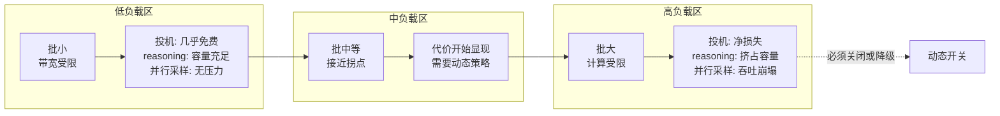
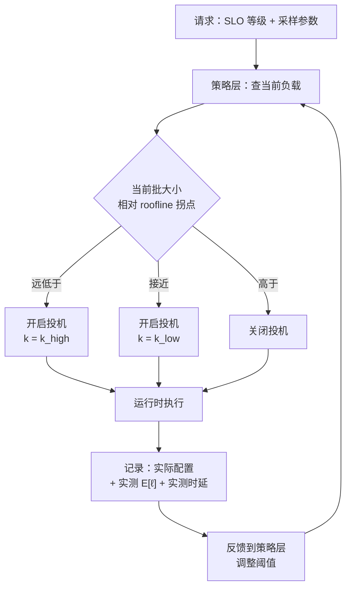
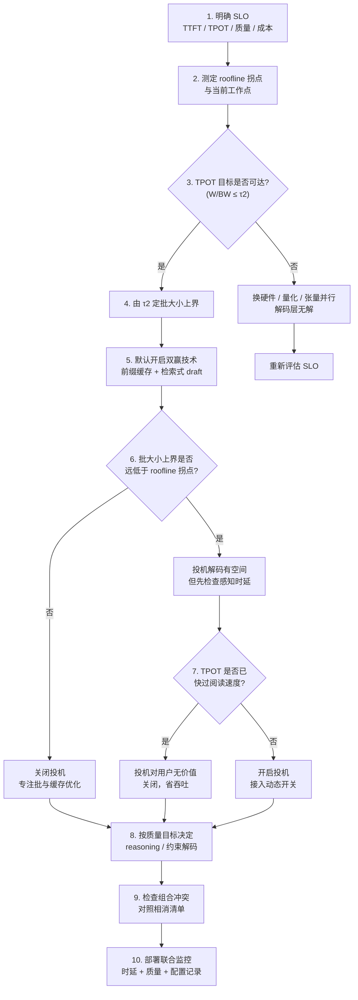

# 生成质量与时延的系统级权衡

> 位置：[InferenceAtlas](../../INDEX.md) > [模块 05](README.md) > 当前文档
> 信息截至：2026-07-29 ｜ 最后核验：2026-07-29 ｜ 内容版本：v0.1
> 时效性等级：中
> 相关主题：[采样参数](02_greedy_sampling_topk_topp_temperature.md)｜[reasoning 成本治理](07_reasoning_inference_and_test_time_scaling.md)｜[时延、吞吐与 SLO](../01_foundations_and_metrics/02_latency_throughput_and_slo.md)

## 本章导读

本章是模块 05 的收束。前九章分别讨论了解码的各个维度：采样参数、束搜索、约束、投机、reasoning、agent、结构化输出。每一项都在质量、时延、吞吐、成本、能耗之间做了取舍，但它们是**分别**讨论的。

生产系统面临的问题不是"某项技术是否值得"，而是"**这些技术组合起来，落在哪个点上，以及这个点是不是我要的**"。这需要一个统一的框架。

本章提供三样东西：

1. **一张把所有解码技术放在同一坐标系里的对照表**——按它们对质量、时延、吞吐、能耗的影响方向分类；
2. **技术之间交互效应的清单**——哪些组合是相加的、哪些是相乘的、哪些是相消的；
3. **从 SLO 反推配置的方法**——给定时延与质量目标，如何系统地缩小配置空间。

一个反复出现的主题是：**很多"质量 vs 时延"的取舍，实际上是"质量 vs 吞吐"的取舍被误读了**。投机解码降低时延但降低吞吐；reasoning 提高质量但降低吞吐。在容量充裕时它们看起来免费，在容量紧张时代价立刻显现。区分这两种取舍，是本章最重要的实践价值。

## 学习目标

读完本章后，读者应能够：

1. 把任一解码技术放进"质量-时延-吞吐-能耗"四维坐标，并说明它的主要代价维度；
2. 识别技术组合中的相乘效应与相消效应，避免错误的叠加预期；
3. 从 SLO 出发反推可行的配置空间，而不是从技术出发试配置；
4. 区分"质量换时延"与"质量换吞吐"，并说明为什么后者在低负载时不可见；
5. 设计一套覆盖质量与时延的联合监控与回归机制。

## 核心结论

- **解码技术的代价维度各不相同**：有的花时延、有的花吞吐、有的花能耗、有的花工程。混为一谈会导致错误的组合决策。
- **"低负载时免费"是最危险的误判**：投机、reasoning、并行采样在低负载下几乎不显现代价，在高负载下代价陡增。所有评估必须在目标负载下进行。
- **技术组合的效应不是简单相加**：投机 × 大批量是相消的，前缀缓存 × agent 是相乘的，约束 × 投机需要联合设计。
- **应从 SLO 反推配置，而非从技术正推**：先固定时延与质量目标，再看哪些配置落在可行域内。
- **质量必须与时延一起监控**：只监控时延的服务会在某次配置变更后悄然损失质量，反之亦然。

## 1. 问题定义、系统边界与工作负载

### 1.1 四个维度而非两个

"质量 vs 时延"这个说法本身是简化的。真实的取舍空间至少有四维：

| 维度 | 度量 | 谁关心 |
|---|---|---|
| **质量** | 任务指标（正确率、人类偏好、格式合法率） | 用户、产品 |
| **时延** | TTFT、TPOT、端到端 P50/P99 | 用户 |
| **吞吐** | tokens/s、请求/s、每卡 QPS | 运营、成本 |
| **能耗** | J/token、kW | 运营、可持续性 |

**关键结构**：时延与吞吐**不是同一个东西的两面**。它们在系统中通过批大小耦合：增大批提升吞吐、恶化时延。但很多解码技术是**同时**影响两者的，且方向不同。

| 技术 | 时延 | 吞吐 |
|---|---|---|
| 增大批 | ↓（恶化） | ↑ |
| 投机解码 | ↑（改善） | ↓ |
| reasoning | ↓↓ | ↓↓ |
| 前缀缓存 | ↑ | ↑ |
| 约束解码 | ≈ | ≈ |

**只有前缀缓存是双赢的**——它同时改善时延与吞吐，因为它减少的是真实的工作量而非重新分配工作量。这是一个有用的判据：**双赢的技术减少工作量，取舍型的技术重新分配工作量**。

### 1.2 负载依赖性是核心

大多数解码技术的代价是**负载依赖的**：



**图解读**：
1. **本图展示什么**：同一组解码技术在低、中、高三个负载区的代价差异，以及它们在高负载区需要被关闭或降级。
2. **核心瓶颈**：瓶颈是从带宽受限区到计算受限区的转变（roofline 拐点，见 [模块 01 第 4 章](../01_foundations_and_metrics/04_roofline_and_performance_modeling.md)）。在拐点之前，"多算一点"几乎不花时间；越过拐点后，每一份额外计算都是实打实的时间。
3. **图中的 trade-off**：在低负载区享受这些技术的收益，就意味着在高负载区必须有关闭机制。永久开启会把峰值时段的系统推向更差的状态。
4. **面试如何引用**：被问"某项优化值不值得"时，先反问"在什么负载下"——用这张图说明答案完全依赖工作点，这比给出一个绝对结论更专业。

**这解释了一类常见的生产事故**：某项优化在测试环境（低负载）测出正向收益，上线后在峰值时段导致时延恶化。原因不是实现有问题，而是**评估的工作点不对**。

> **方法论要求**：任何解码技术的评估，必须在**目标生产负载**下进行。单请求基准测试对这类技术几乎没有参考价值。

### 1.3 系统边界

本章讨论的是**解码层的配置决策**，不涉及模型选择、硬件选型或部署架构。但它需要以下输入：

| 输入 | 来源 |
|---|---|
| SLO（时延与质量目标） | 业务定义 |
| 当前负载分布 | 生产监控 |
| roofline 拐点位置 | 硬件与模型（[模块 01 第 4 章](../01_foundations_and_metrics/04_roofline_and_performance_modeling.md)） |
| 各技术在本系统上的实测效应 | 自测（本库不提供） |

## 2. 原理、数学与性能模型

### 2.1 统一的效应坐标

把模块 05 讨论的技术放进同一张表。**方向符号的含义**：↑ 改善，↓ 恶化，≈ 基本不变，⇅ 依负载而定。

| 技术 | 质量 | 时延 | 吞吐 | 能耗/token | 主要代价维度 |
|---|---|---|---|---|---|
| 降低温度 | ⇅（任务依赖） | ≈ | ≈ | ≈ | 多样性 |
| 收紧 top-p/top-k | ⇅ | ≈ | ≈ | ≈ | 多样性、可能拉长输出 |
| 束搜索 | ⇅（任务依赖） | ≈（低负载） | ↓↓ | ↓ | **吞吐** |
| 约束解码 | ↑（格式） | ≈ | ≈ | ↑（省重试） | **工程复杂度** |
| 投机解码 | ≈（分布不变） | ↑↑ | ⇅ | ↓ | **吞吐 + 能耗** |
| 自投机（Medusa/EAGLE） | ≈ | ↑↑ | ⇅ | ↓ | **训练成本 + 吞吐** |
| 检索式 draft | ≈ | ↑（场景依赖） | ≈ | ≈ | 几乎无 |
| reasoning（串行加长） | ↑↑ | ↓↓ | ↓↓ | ↓↓ | **时延 + 吞吐 + 能耗** |
| 并行采样 | ↑↑（有验证器） | ≈ | ↓↓ | ↓↓ | **吞吐 + 能耗** |
| 前缀缓存 | ≈ | ↑↑ | ↑↑ | ↑↑ | 内存 |
| 增大批 | ≈ | ↓ | ↑↑ | ↑ | **时延** |
| 分块 prefill | ≈ | ↑（TPOT）↓（TTFT） | ≈ | ≈ | 调度复杂度 |

**从这张表能读出的三条规律**：

1. **"主要代价维度"分为四类**：吞吐型（束搜索、投机、并行采样）、时延型（reasoning、增大批）、能耗型（投机、reasoning）、工程型（约束解码、自投机）。**同类代价的技术不应叠加**——两项都吃吞吐的技术组合，吞吐损失是相乘的。

2. **只有前缀缓存与检索式 draft 接近"免费"**。前者减少重复工作，后者在无匹配时零成本。**这两项应当默认开启**，其余都需要按场景决策。

3. **质量列大量是 ⇅ 或 ≈**。这提示了一个重要事实：**解码层能提升的质量是有限的**。约束解码提升格式质量，reasoning 提升推理质量，其余大多只是在多样性与保守性之间移动。**真正的质量提升来自模型本身，不是解码配置**。

### 2.2 组合效应的分类

技术组合的效应有三类，必须分开处理：

**（a）相加（独立）**：两项技术作用于不同资源，效应可近似相加。

- 前缀缓存 + 约束解码：一个省 prefill，一个加 mask，互不干扰。
- 量化 + 分块 prefill：一个减权重带宽，一个改调度粒度。

**（b）相乘（放大）**：一项技术放大另一项的收益或代价。

$$
\text{效应}_{AB} \approx \text{效应}_A \times \text{效应}_B
$$

- **前缀缓存 × agent 轮数**：轮数越多，缓存收益越大（$1 - 2/R$，见 [工具调用与 agent 循环](08_tool_use_and_agent_inference.md) 2.1）。
- **束搜索 × 并行采样**：KV 占用是 $k \times n$ 倍，吞吐损失相乘。
- **reasoning × 并行采样**：计算量是 $L_{\text{think}} \times n$，能耗放大相乘。

**（c）相消（冲突）**：一项技术使另一项失效或有害。

| 组合 | 冲突机制 |
|---|---|
| 投机 × 大批量 | 大批量已越过 roofline 拐点，验证不再免费，投机变净损失 |
| 约束 × 投机（未联合） | draft 未应用 mask，提议大量非法 token，接受率崩塌 |
| 前缀缓存 × 上下文压缩 | 压缩使缓存全部失效 |
| 高温度 × 投机 | 分布展平，接受率下降 |
| 束搜索 × 大批量 | KV 挤压，有效并发骤降 |
| CUDA Graph × 动态树形投机 | 形状变化破坏图捕获 |
| 分页 KV 共享 × beam 写入 | 需写时复制，引入不可预测的分配 |

**（c）类是最危险的**，因为它们的失效往往是**静默的**：系统仍在运行，指标略微变差，但没有报错。团队可能长期运行在一个"两项优化互相抵消"的配置上而不自知。

> **工程实践**：每引入一项新的解码技术，都应对照上表检查它与现有技术的冲突，并在**开启与关闭两种状态下**分别测量，而不是只测开启后的绝对值。

### 2.3 从 SLO 反推可行域

正确的方法是从约束出发缩小配置空间，而非从技术出发试配置。

设 SLO 为：
- $T_{\text{TTFT}} \le \tau_1$（首 token 时延）
- $T_{\text{TPOT}} \le \tau_2$（每 token 时延）
- $Q \ge q_0$（质量下限）
- 成本 $\le c_0$

**步骤 1：由 TPOT 约束推批大小上界**

decode 阶段的单步时间近似（见 [模块 01 第 4 章](../01_foundations_and_metrics/04_roofline_and_performance_modeling.md)）：

$$
T_{\text{step}}(B) \approx \max\left( \frac{W}{\text{BW}}, \frac{2 P B}{\text{FLOPS}} \right)
$$

要求 $T_{\text{step}} \le \tau_2$，得

$$
B \le \frac{\tau_2 \cdot \text{FLOPS}}{2P}
$$

同时必须有 $W/\text{BW} \le \tau_2$，否则**任何批大小都无法满足 TPOT**——这时只能换硬件、量化权重或做张量并行。

- **这一步的价值**：它立刻告诉你 TPOT 目标是否可达，以及可达时批大小的天花板。很多"时延优化"项目在这一步就能发现方向错了。

**步骤 2：由批大小上界判断投机是否有收益**

投机的收益要求系统在带宽受限区，即

$$
B \cdot (k+1) < N^* = \frac{W \cdot \text{FLOPS}}{2P \cdot \text{BW}}
$$

代入步骤 1 的 $B$ 上界，可以直接判断在 SLO 允许的批大小下，投机是否还有空间。

**步骤 3：由吞吐需求推所需实例数**

$$
n_{\text{instances}} = \left\lceil \frac{\lambda \cdot E[L_{\text{out}}]}{B_{\max} / T_{\text{step}}} \right\rceil
$$

- $\lambda$：请求到达率（请求/s）；$E[L_{\text{out}}]$：期望输出长度（token）。
- 若 reasoning 或并行采样被启用，$E[L_{\text{out}}]$ 要乘以相应倍数。

**步骤 4：由成本约束反查是否可行**

若 $n_{\text{instances}} \times$ 单实例成本超过 $c_0$，则必须放松某项：降低质量目标（关闭 reasoning）、放松时延目标（增大批）、或接受更高成本。

**这四步给出一个封闭的决策流程**。它的价值在于，当目标不可达时，它明确指出**必须放松哪一项**，而不是让团队在配置空间里盲目搜索。

### 2.4 质量的度量困难

上述框架有一个薄弱环节：**质量比时延难度量得多**。

| 性质 | 时延 | 质量 |
|---|---|---|
| 可自动测量 | 是 | 部分 |
| 单次测量的方差 | 小 | 大 |
| 需要的样本量 | 小 | 大 |
| 度量本身的成本 | 接近零 | 可能很高（人工评估） |
| 跨版本可比性 | 高 | 中（评估集会漂移） |
| 回归检测的灵敏度 | 高 | 低 |

**后果**：配置变更的**时延影响会被立即发现，质量影响可能几周后才被发现**。这是一个系统性的偏差——它导致团队倾向于做那些改善时延的变更，而低估它们的质量代价。

**缓解手段**：

1. **建立自动化的质量回归集**。哪怕不完美，一个每次变更都跑的固定评估集，比偶尔的人工评估更有用——它至少能捕获大幅回退。
2. **把可自动测量的质量代理指标纳入常规监控**：格式合法率、输出长度分布、重复率、停止原因分布（正常结束 vs 达到上限）。这些不等于质量，但它们的异常变化往往是质量问题的先兆。
3. **配置变更要记录**，且质量指标的时间序列要能与配置变更事件对齐。没有这个对齐，几周后的质量回退无法归因。

### 2.5 感知时延与实际时延

对流式输出的应用，用户感知的不是端到端时延，而是：

$$
T_{\text{perceived}} \approx T_{\text{TTFT}} + \max\left(0, (T_{\text{TPOT}} - T_{\text{read}}) \cdot L\right)
$$

- $T_{\text{read}}$：用户阅读一个 token 的时间（s/token）；
- $L$：输出长度。
- **直觉**：只要生成速度快过阅读速度，后续 token 的时延对用户不可见——用户在"追赶"输出。此时唯一重要的是 TTFT。
- **假设**：用户从头开始阅读且不跳读。
- **局限**：这个模型不适用于非流式输出、不适用于用户只关心最终结果的场景（如 agent 任务、批处理），也不适用于输出会被程序消费的场景。

**这个观察有重要的配置含义**：

| 场景 | 优化重点 |
|---|---|
| 流式对话，TPOT 已快过阅读 | **只优化 TTFT**，TPOT 的进一步优化对用户无价值 |
| 流式对话，TPOT 慢过阅读 | 优化 TPOT（用户在等） |
| 非流式（一次性返回） | 优化端到端，TTFT 与 TPOT 同等重要 |
| 输出被程序消费 | 优化端到端 |
| reasoning（思考不展示） | 思考阶段的 TPOT 直接影响用户等待 |

**推论**：在 TPOT 已经快过阅读速度的对话场景，**投机解码带来的 TPOT 改善对用户是不可见的**，而它的吞吐代价是实打实的。此时投机解码是净损失。这是一个具体的、常被忽略的判断。

## 3. 实现机制与系统设计

### 3.1 分层的配置结构

配置不应是全局单一的，而应分层：

| 层 | 决定什么 | 变更频率 |
|---|---|---|
| **部署层** | 模型、量化、并行策略、是否加载 draft | 天到周 |
| **策略层** | 投机开关阈值、预算档位、路由规则 | 小时到天 |
| **请求层** | 温度、top-p、max_tokens、schema | 每请求 |
| **运行时层** | 实际批大小、是否投机、实际 $k$ | 每步 |

**关键设计**：**运行时层的决策应由系统自动做出，而非由用户或运维配置**。用户指定"我要低时延"，系统决定在当前负载下如何达成——这可能意味着开投机、也可能意味着关投机（如果批已经很大）。



**图解读**：
1. **本图展示什么**：请求携带 SLO 意图而非具体技术开关，策略层按当前负载把意图翻译为运行时配置，并通过实测反馈闭环调整阈值。
2. **核心瓶颈**：瓶颈在反馈回路的时间常数——太快会震荡（见 [draft 选型](06_draft_model_selection_and_acceptance_rate.md) 3.2 的滞回设计），太慢会在负载切换后长时间运行在错误配置上。
3. **图中的 trade-off**：自动决策减少了运维负担并能适应负载变化，但降低了可预测性——同一请求在不同时刻可能走不同路径，使问题复现变难。缓解办法是完整记录每次请求的实际配置。
4. **面试如何引用**：被问"这些优化怎么在生产中管理"时，用这张图说明**请求应表达意图而非指定技术**，这是把解码优化从静态配置变成动态策略的关键设计。

**"记录实际配置"是必需的**：当同一个请求在不同负载下走不同路径时，事后排查必须能知道它当时走的是哪条。这个记录也是质量归因的基础（见 2.4）。

### 3.2 SLO 分级

把用户请求映射到少数几个 SLO 等级，而非让每个请求自定义：

| 等级 | TTFT 目标 | TPOT 目标 | 典型配置倾向 |
|---|---|---|---|
| 交互式 | 严格 | 快过阅读速度即可 | 小批、优先 TTFT、投机视负载 |
| 标准 | 中 | 中 | 平衡 |
| 批量 | 宽松 | 宽松 | 大批、关投机、最大化吞吐 |

**分级的价值**：
1. 它使调度器可以做**差异化的批组装**（把同级请求放一批，避免快慢混批导致的相互拖累）；
2. 它使容量规划可以按等级分别核算；
3. 它把"每请求任意配置"这个不可管理的空间压缩到少数几个可测试的组合。

**混批的问题值得展开**：如果一个批里同时有交互式请求与批量请求，批大小必须迁就交互式请求的 TPOT 约束，导致批量请求的吞吐潜力被浪费。分池或分级批组装能避免这一点，代价是资源碎片化（见 [模块 03 第 6 章](../03_serving_engines_and_scheduling/06_multi_tenant_isolation_and_qos.md)）。

### 3.3 联合监控

时延与质量必须一起监控，且要能对齐到配置变更。最小监控集：

| 类别 | 指标 | 为什么 |
|---|---|---|
| 时延 | TTFT / TPOT 的 P50/P95/P99 | 基础 |
| 吞吐 | tokens/s、请求/s、每卡 QPS | 容量 |
| 批 | 实际批大小分布 | 判断工作点在 roofline 何处 |
| 投机 | $E[\ell]$、开启比例 | 判断投机是否仍有收益 |
| 质量代理 | 格式合法率、输出长度分布、停止原因分布 | 质量回退的先兆 |
| 质量 | 固定评估集的定期跑分 | 真正的质量 |
| 配置 | 每请求的实际运行时配置 | 归因基础 |

**"停止原因分布"是一个高价值的低成本指标**：正常结束（EOS）、达到 max_tokens、停止词命中、被截断——这四类的比例变化往往先于质量指标反映出问题。例如"达到 max_tokens"的比例上升，通常意味着某个采样参数变更让输出变长或让模型停不下来。

**告警设计**：

| 条件 | 含义 | 动作 |
|---|---|---|
| $E[\ell] < 1 + kr$ | 投机变净损失 | 自动关闭投机 |
| 批大小分布右移越过拐点 | 进入计算受限区 | 关闭投机、检查 reasoning 预算 |
| 格式合法率下降 | 可能是模型或配置变更 | 告警，检查最近变更 |
| "达到 max_tokens"比例上升 | 输出行为变化 | 告警，比对采样参数 |
| P99/P50 比值上升 | 长尾恶化 | 检查是否有慢请求类型混入 |

### 3.4 变更流程

解码配置的变更需要一个纪律化的流程，因为它同时影响质量与时延，而两者的检测灵敏度差异很大（2.4）：

```
1. 变更前：记录基线（时延分布 + 质量评估集跑分 + 质量代理指标）
2. 在目标负载下评估（不是单请求基准）
3. 检查与现有技术的冲突（对照 2.2 的相消清单）
4. 灰度：小比例流量，同时观察时延与质量代理
5. 质量评估集跑分：变更前后对比
6. 全量后持续观察至少一个完整流量周期（含峰谷）
7. 记录变更事件，使其可与后续的指标时间序列对齐
```

**第 2 步与第 6 步是最容易被跳过的**，也是最重要的。第 2 步防止"低负载评估"的误判（1.2）；第 6 步防止"只在低谷时段验证"的误判。

## 4. 性能、成本、能耗与可靠性 trade-off

### 4.1 典型工作点的配置模式

下表给出四类典型场景的配置倾向。**这是定性指引，不是可直接套用的配置**——具体数值必须在自己的系统上测定。

| 场景 | 主要约束 | 采样 | 投机 | reasoning | 批策略 | 前缀缓存 |
|---|---|---|---|---|---|---|
| **交互式对话** | TTFT + TPOT | 中温 + top-p | 视负载动态 | 按难度路由 | 小批、优先 TTFT | 必开 |
| **代码补全** | TTFT 极严格 | 低温或 greedy | 检索式优先 | 关闭 | 极小批 | 必开 |
| **批量抽取** | 吞吐 + 成本 | 低温 + 约束解码 | 关闭 | 关闭 | 大批 | 视重复度 |
| **agent 任务** | 端到端 + 成本 | 低温 + 约束解码 | 视负载 | 按需 | 中批 + 续轮优先 | **最高优先级** |

**四个场景的共同点**：前缀缓存在三个场景是"必开"或"最高优先级"，这再次印证 2.1 的"双赢技术应默认开启"。

**四个场景的关键差异**：
- 代码补全的 TTFT 约束极严，这压制了批大小，进而使投机的空间较大（低批 = 带宽受限区）；同时代码任务的输出常复制上下文，检索式 draft 效果好。
- 批量抽取没有时延约束，因此所有"用吞吐换时延"的技术都应关闭。
- agent 任务的主导成本是累积 prefill，因此前缀缓存的优先级高于一切。

### 4.2 能耗视角的排序

若以 J/token 为目标（见 [模块 01 第 7 章](../01_foundations_and_metrics/07_energy_efficiency_and_joules_per_token.md)），技术的排序与时延视角**几乎相反**：

| 技术 | 对 J/token 的影响 |
|---|---|
| 前缀缓存 | **降低**（减少真实工作量） |
| 增大批 | **降低**（权重读取被更多 token 摊薄） |
| 量化 | **降低** |
| 约束解码 | 略降（省重试）或略升 |
| 投机解码 | **升高**（$N/E[\ell]$ 倍） |
| 束搜索 | 升高 |
| 并行采样 | **大幅升高**（$n$ 倍） |
| reasoning | **大幅升高** |

**核心矛盾**：**降低时延的手段几乎都提高能耗，降低能耗的手段几乎都提高时延**。唯二的例外是前缀缓存与量化——它们减少真实工作量，因此在所有维度上都是正向的。

**这个矛盾在电力受限的数据中心变得尖锐**（见 [模块 09](../09_datacenter_power_thermal_and_operations/)，规划中）：当电力而非算力成为瓶颈时，投机解码与 reasoning 的能耗代价直接转化为容量损失。此时"用能量换时延"的交易可能不再划算。

### 4.3 可靠性维度

配置的复杂度本身是一个可靠性风险：

| 复杂度来源 | 风险 |
|---|---|
| 多项技术组合 | 相消效应难以发现（2.2c） |
| 动态策略 | 问题难复现 |
| 逐请求参数 | 参数空间无法穷尽测试 |
| 分级 SLO | 分级逻辑本身可能出错 |

**缓解原则**：

1. **能关的就关**。每一项开启的技术都需要持续的监控与维护成本。收益不明确的技术应当关闭而非"先开着看看"。
2. **配置组合要收敛到少数几个**。逐请求任意组合是不可测试的；把它压缩到 SLO 等级 × 少数策略档位，使全部组合可以被覆盖测试。
3. **每个动态决策都要可观测**。运行时选了什么必须被记录，否则问题不可复现。
4. **降级路径必须存在且被测试过**。每项技术都应有一个明确的"关闭它"的路径，且这个路径应在演练中被验证。

## 5. benchmark、真实案例或公开部署案例

当前环境的网络出口策略阻断了 `arxiv.org`、`mlcommons.org`、`huggingface.co` 等一手来源（详见 [AGENTS.md 第 11 节](../../AGENTS.md)）。因此本节**不引用任何具体的时延、吞吐、质量或能耗数字**。本章第 2.1、4.1、4.2 节的表格全部是**方向性的定性判断**，不含数值，其依据是前九章的推导。

| 陈述 | 披露标签 | 状态 |
|---|---|---|
| 主流推理框架支持动态开关投机解码 | `开源代码/配置披露` | `待核实` |
| 主流框架支持逐请求采样参数 | `开源代码/配置披露` | `待核实` |
| 各技术在具体模型/硬件上的实测效应 | — | **不引用**（必须自测） |

**必做的自测清单**（`独立可复现实验`）——本章的框架需要以下输入才能使用：

1. **定位 roofline 拐点**：扫描批大小，测量单步耗时，找到从平坦转向线性的位置。这是 2.3 全部推导的基础输入。
2. **画负载-收益曲线**：对每项启用的技术，在低/中/高三档负载下测量其净效应。验证 1.2 的负载依赖性。
3. **测量组合效应**：对每一对同时启用的技术，测量"两项都开""只开 A""只开 B""都关"四种配置。检查是否有 2.2c 的相消。
4. **SLO 可行性检查**：按 2.3 的四步，代入自己的 $W$、$\text{BW}$、$P$、$\text{FLOPS}$，判断 SLO 是否可达。
5. **感知时延基线**：测量本产品用户的实际阅读速度（或用一个保守估计），判断当前 TPOT 是否已快过阅读速度。这决定了 TPOT 优化是否还有价值（2.5）。
6. **质量代理指标基线**：记录格式合法率、输出长度分布、停止原因分布的当前值。这是后续变更的对照基准。
7. **能耗基线**：测量当前配置的 J/token，作为 4.2 决策的输入。
8. **降级演练**：逐项关闭已启用的技术，确认服务仍正常且指标变化符合预期。

> 实验方法论要求见 [如何读推理 benchmark](../00_start_here/03_how_to_read_inference_benchmarks.md)。

## 6. 设计决策框架



**图解读**：
1. **本图展示什么**：从 SLO 出发的十步决策流程，把解码配置从"试各种技术"变成"逐步缩小可行域"。
2. **核心瓶颈**：第 3 步（TPOT 是否可达）是硬门槛——若 $W/\text{BW} > \tau_2$，任何解码层优化都无法达成目标，必须回到硬件或模型层。这一步能挡住很多方向性错误的项目。
3. **图中的 trade-off**：第 7 步（感知时延检查）是最反直觉的分支——它可能得出"投机解码虽然有效但不值得开"的结论，因为它改善的是用户看不见的东西，而代价（吞吐）是实打实的。
4. **面试如何引用**：被问"如何优化推理服务的时延"时，按这张图从 SLO 与 roofline 讲起，并在第 7 步主动指出"更快不一定更好"——这展示了超出技术层面的产品判断。

### 决策清单

| 问题 | 若答案为"是" | 若答案为"否" |
|---|---|---|
| 已测定 roofline 拐点？ | 可以决策 | 先测，这是所有推导的基础 |
| $W/\text{BW} \le \tau_2$？ | TPOT 目标可达 | 解码层无解，需换硬件/量化/并行 |
| 前缀缓存已开启？ | — | 立即开启，双赢技术 |
| 工作点远低于拐点？ | 投机有空间 | 关闭投机 |
| TPOT 已快过阅读速度？ | 投机对用户无价值 | 投机有价值 |
| 已检查组合冲突？ | 可以部署 | 先对照相消清单 |
| 质量与时延一起监控？ | — | 补上质量代理指标 |
| 每项技术都有降级路径？ | — | 补上并演练 |

## 7. 常见失败模式与排查路径

| 症状 | 可能原因 | 排查步骤 |
|---|---|---|
| 测试环境有收益，上线后无收益或变差 | 评估工作点不对（1.2） | 在目标负载下重测；对比批大小分布 |
| 两项优化都开但收益不叠加 | 相消效应（2.2c） | 做四种配置的对照测试 |
| 时延达标但成本超预算 | 用吞吐换了时延而未核算 | 检查吞吐指标；核算每卡 QPS 变化 |
| 质量在几周后才被发现回退 | 质量监控灵敏度低（2.4） | 建立自动化回归集；加质量代理指标 |
| 质量回退无法归因 | 配置变更未记录 | 补上变更事件记录与时间序列对齐 |
| 峰值时段时延恶化 | 技术在高负载下代价陡增（1.2） | 接入按负载的动态开关 |
| 同一请求两次表现不同 | 动态策略导致（3.1） | 检查是否记录了运行时实际配置 |
| 优化了 TPOT 但用户无感 | TPOT 已快过阅读速度（2.5） | 测量实际感知时延；考虑改优化 TTFT |
| 批量请求吞吐远低于预期 | 与交互式请求混批（3.2） | 分池或分级批组装 |
| 关闭某项技术后服务异常 | 降级路径未被测试 | 演练每项技术的关闭路径 |
| 配置空间无法测试覆盖 | 逐请求任意组合（4.3） | 收敛到 SLO 等级 × 少数档位 |
| "达到 max_tokens"比例上升 | 采样参数或模型变更 | 比对最近的配置变更；看输出长度分布 |

**排查原则**：解码层的问题分三类——**评估类**（工作点不对）、**组合类**（相消效应）、**归因类**（缺记录）。前两类靠正确的实验设计避免，第三类靠完整的配置记录避免。三者都不是靠"更好的优化"能解决的。

## 8. 关联面试主题

1. **为什么"质量 vs 时延"是不完整的框架**——见本章 1.1，至少需要四维，且时延与吞吐常被混淆。
2. **为什么所有解码技术的评估必须在目标负载下进行**——见本章 1.2，这是最常见的评估错误。
3. **哪些技术是双赢的，为什么**——见本章 2.1，减少工作量 vs 重新分配工作量。
4. **技术组合的三类效应，以及相消为什么最危险**——见本章 2.2。
5. **如何从 SLO 反推可行配置空间**——见本章 2.3 的四步法。
6. **为什么质量回退比时延回退更难发现**——见本章 2.4。
7. **感知时延与实际时延的差异，及其对投机解码的含义**——见本章 2.5，这是一个反直觉但重要的判断。
8. **请求为什么应表达 SLO 意图而非指定技术开关**——见本章 3.1。
9. **快慢请求混批为什么有害**——见本章 3.2。
10. **降低时延与降低能耗为什么方向相反**——见本章 4.2。

## 9. 小结

模块 05 讨论的每一项解码技术都在多个维度上做取舍。把它们放在一起看，有五条贯穿性的结论：

**第一，代价维度必须被区分**。有的技术花时延、有的花吞吐、有的花能耗、有的花工程复杂度。**同类代价的技术不应叠加**——两项都吃吞吐的技术组合，损失是相乘的。而"质量 vs 时延"这个流行的说法掩盖了一个事实：很多取舍实际上是"质量 vs 吞吐"，它在低负载时不可见。

**第二，负载依赖性是核心**。投机、reasoning、并行采样在低负载下几乎免费，在高负载下代价陡增。这直接导出两条实践要求：所有评估必须在目标负载下进行；所有这类技术都必须有按负载的动态开关。永久开启是在峰值时段主动损害系统。

**第三，只有减少真实工作量的技术是双赢的**。前缀缓存与量化在时延、吞吐、能耗上都是正向的；其余技术都在重新分配工作量。这给出一个清晰的优先级：**先把双赢的做透，再考虑取舍型的**。

**第四，应从 SLO 反推而非从技术正推**。2.3 的四步法给出一个封闭流程，它的价值不只在于找到可行配置，更在于当目标不可达时明确指出必须放松哪一项。第一步（检查 $W/\text{BW} \le \tau_2$）就能挡住很多方向性错误的优化项目。

**第五，质量必须与时延一起监控**。质量的检测灵敏度远低于时延，这造成一个系统性偏差：改善时延的变更会被立即认可，它们的质量代价可能几周后才浮现，且难以归因。对抗这个偏差需要三样东西——自动化的质量回归集、可自动测量的质量代理指标、以及能与指标时间序列对齐的配置变更记录。

最后一个值得记住的反直觉判断：**在 TPOT 已经快过用户阅读速度的场景，进一步降低 TPOT 对用户是不可见的**。此时投机解码改善的是没人看见的东西，而它的吞吐代价是实打实的。"更快"不总是"更好"——这需要在优化开始之前就想清楚。

## 关键术语

| 中文术语 | 英文 | 定义 | 单位/口径 | 关联文档 |
|---|---|---|---|---|
| 感知时延 | perceived latency | 用户实际体验到的等待时间，流式下受阅读速度影响 | s | 本章 2.5 |
| 双赢技术 | Pareto-improving technique | 在所有关心的维度上都不劣化的技术 | — | 本章 2.1 |
| 相消效应 | conflicting interaction | 一项技术使另一项失效或有害的组合 | — | 本章 2.2 |
| 负载依赖性 | load dependence | 技术的净效应随系统负载改变方向 | — | 本章 1.2 |
| 可行域 | feasible region | 满足全部 SLO 约束的配置集合 | — | 本章 2.3 |
| 质量代理指标 | quality proxy metric | 可自动测量、与质量相关的低成本指标 | 依指标 | 本章 2.4 |
| 停止原因分布 | stop-reason distribution | 请求按结束方式（EOS/上限/停止词/截断）的比例 | 比例 | 本章 3.3 |
| SLO 分级 | SLO tiering | 把请求映射到少数几个服务等级 | — | 本章 3.2 |

## 延伸阅读

- [解码基础](01_decoding_basics.md) — 本模块的起点
- [采样参数](02_greedy_sampling_topk_topp_temperature.md) — 采样配置的系统效应
- [投机解码](04_speculative_decoding.md) 与 [draft 选型](06_draft_model_selection_and_acceptance_rate.md) — 投机的完整代价结构
- [reasoning 成本治理](07_reasoning_inference_and_test_time_scaling.md) — 质量-成本曲线
- [时延、吞吐与 SLO](../01_foundations_and_metrics/02_latency_throughput_and_slo.md) — SLO 定义与口径
- [Roofline 与性能建模](../01_foundations_and_metrics/04_roofline_and_performance_modeling.md) — 拐点的理论基础
- [能效与每 token 焦耳](../01_foundations_and_metrics/07_energy_efficiency_and_joules_per_token.md) — 能耗维度
- [多租户隔离与 QoS](../03_serving_engines_and_scheduling/06_multi_tenant_isolation_and_qos.md) — 分级与混批
- [服务事故排查手册](../03_serving_engines_and_scheduling/12_serving_incident_playbook.md) — 变更引发事故的处理

## 主要来源

本章为模块 05 的综合与收束，其结论全部由前九章的推导导出，不引入新的外部事实。第 2.1、4.1、4.2 节的表格是**方向性判断**，不含数值。涉及框架能力的陈述已在第 5 节标注为 `待核实`；具体的性能与质量数字**未引用**，且本章明确要求读者自测——因为这类数字高度依赖具体模型与硬件，任何外部数字都不可直接套用。

| 类别 | 说明 | 披露标签 |
|---|---|---|
| 效应方向表 | 由前九章推导导出的定性判断 | — |
| SLO 反推四步法 | 本库推导，基于模块 01 的 roofline 模型 | — |
| 感知时延模型 | 本库给出的简化模型，已标注假设与局限 | — |
| 组合效应分类 | 由前九章的分析归纳 | — |
| 各框架的具体能力 | 需一手核验 | `待核实` |
| 任何具体性能数字 | 必须自测，**未引用外部数字** | — |

## 更新记录

| 日期 | 版本 | 变更 | 核验人 |
|---|---|---|---|
| 2026-07-29 | v0.1 | 初稿：解码技术的统一效应坐标、组合效应分类、SLO 反推四步法、感知时延与联合监控 | — |
