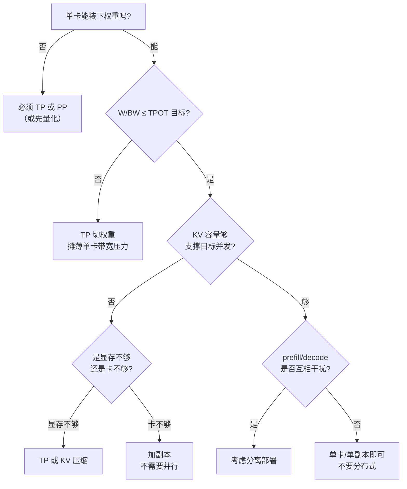
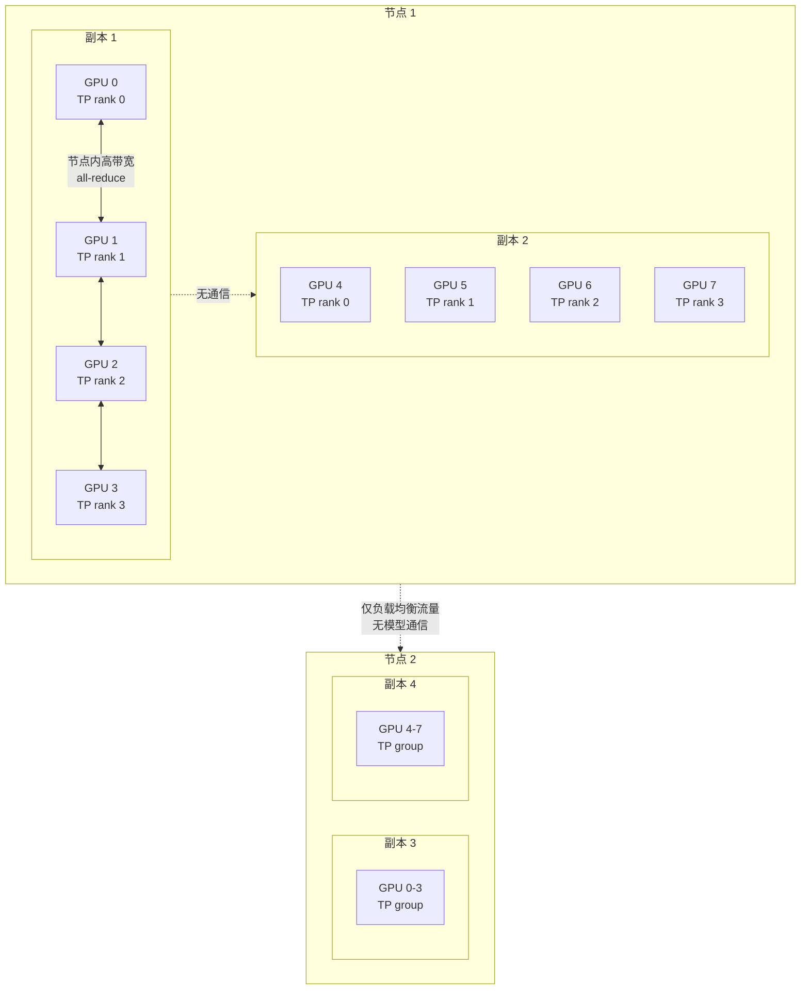
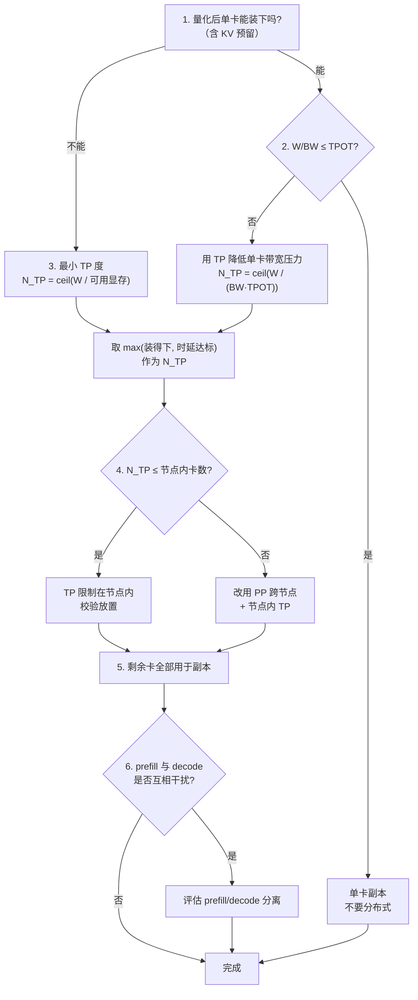

# 分布式推理总览：何时需要，代价是什么

> 位置：[InferenceAtlas](../../INDEX.md) > [模块 06](README.md) > 当前文档
> 信息截至：2026-07-29 ｜ 最后核验：2026-07-29 ｜ 内容版本：v0.1
> 时效性等级：低
> 相关主题：`02_tensor_parallel_inference.md`｜`07_prefill_decode_disaggregation.md`｜[Roofline 与性能建模](../01_foundations_and_metrics/04_roofline_and_performance_modeling.md)

## 本章导读

分布式推理常被当作"模型太大放不下"的应急手段，但这只是四个动因之一，而且往往不是最重要的那个。同样重要的是**时延**（单卡算得太慢）、**吞吐/容量**（KV cache 装不下足够的并发），以及**资源画像不匹配**（prefill 与 decode 想要的硬件不一样）。

四个动因指向不同的并行方式，代价结构也完全不同。把它们混为一谈，会导致一个常见的错误：为了解决容量问题而上张量并行，结果发现每一步 decode 都多了一次 all-reduce，时延不降反升。

本章的核心论点是：**推理的分布式设计被"每个 token 都要付一次通信代价"这一事实主导**。训练可以用梯度累积与流水线把通信摊薄到几百个微批上，推理的 decode 阶段则是每生成一个 token 就要走一遍完整的通信。这个差异决定了训练的并行经验不能直接搬到推理上。

本章建立分布式推理的整体框架：四个动因、五种并行方式、通信在关键路径上的位置，以及"什么时候不要分布式"的判据。后续各章展开每一种方式。

## 学习目标

读完本章后，读者应能够：

1. 列举分布式推理的四个动因，并说明每个动因对应哪种并行方式；
2. 解释为什么训练的并行策略不能直接迁移到推理，关键在通信摊薄比；
3. 写出各并行方式在 prefill 与 decode 两阶段的通信量表达式；
4. 判断某个部署是应该 scale-up（更大的单节点）还是 scale-out（更多节点）；
5. 给出"不应该分布式"的具体判据。

## 核心结论

- **四个动因对应不同的并行方式**：显存不足 → TP/PP；时延不足 → TP；容量不足 → 副本或 TP；画像不匹配 → prefill/decode 分离。用错方式会引入不必要的通信。
- **推理的通信摊薄比远低于训练**：decode 每 token 一次通信，而训练每次通信摊到整个微批。这是推理并行设计的第一性约束。
- **TP 的通信在 decode 的关键路径上，且通信量与批大小成正比而与模型大小无关**——这使它在小批量长解码时代价尤其突出。
- **PP 在推理中的气泡问题比训练严重得多**，因为推理无法用大量微批填充流水线。
- **scale-up 优先于 scale-out**：节点内互联带宽通常远高于节点间，能放进单节点就不要跨节点。

## 1. 问题定义、系统边界与工作负载

### 1.1 四个动因

| 动因 | 触发条件 | 对应手段 | 主要代价 |
|---|---|---|---|
| **显存放不下权重** | 权重字节数 > 单卡显存 | TP、PP、量化 | 通信 |
| **单卡时延不够** | $W/\text{BW} > \tau_{\text{TPOT}}$ | TP（切权重，摊带宽） | all-reduce 时延 |
| **KV 容量不足** | 并发需求 × 每请求 KV > 可用显存 | TP、更多副本 | 通信或成本 |
| **资源画像不匹配** | prefill 算力受限，decode 带宽受限 | prefill/decode 分离 | KV 迁移 |

**四个动因的诊断顺序**：



**图解读**：
1. **本图展示什么**：从最硬的约束（显存）到最软的优化（画像匹配），逐级判断是否需要分布式以及需要哪一种。
2. **核心瓶颈**：瓶颈判断点是第二个分叉 $W/\text{BW} \le \tau_{\text{TPOT}}$——它决定了"能装下但算不够快"这种情况，是 TP 最正当的使用理由。很多团队跳过这一步，直接因为"模型大"就上 TP，而没有确认时延是否真的是约束。
3. **图中的 trade-off**：每向右下走一步，代价从"通信"变成"成本"再变成"复杂度"。最右下的"不要分布式"是被低估的答案——它省掉的运维复杂度往往比任何性能收益都值钱。
4. **面试如何引用**：被问"什么时候需要分布式推理"时，用这张图给出四个动因的诊断顺序，并主动指出"加副本"（数据并行）常常是比模型并行更好的答案。

**"加副本"值得强调**：如果单卡能装下模型且时延达标，只是卡不够服务足够多的用户，那么正确的做法是**部署更多独立副本**，而不是把一个模型切到多卡上。副本之间零通信，扩展性是线性的；模型并行则每一步都要通信。**数据并行是分布式推理的默认答案，模型并行是被迫的选择**。

### 1.2 推理与训练的根本差异

这是本模块最重要的一条背景知识。

| 维度 | 训练 | 推理（decode） |
|---|---|---|
| 一次通信摊到多少 token | 一个微批（数百到数千） | 一个批（数到数百）× 1 步 |
| 通信是否在关键路径 | 可与反向计算重叠 | 大部分在关键路径上 |
| 是否可以延迟通信 | 可以（梯度累积） | 不可以（下一层依赖本层输出） |
| 批大小是否可自由增大 | 可以 | 受 TPOT SLO 限制 |
| 失败的代价 | 回滚到 checkpoint | 单个请求失败 |

**通信摊薄比**：定义为"一次通信服务了多少有效计算"。

$$
\text{摊薄比} \approx \frac{\text{两次通信之间的计算量}}{\text{一次通信的数据量}}
$$

- 训练中，一次 all-reduce 摊到整个微批的前向+反向，摊薄比很高；
- 推理 decode 中，一次 all-reduce 只摊到当前批的一层计算，摊薄比低得多。

**推论**：**训练里"通信开销可忽略"的并行配置，在推理 decode 中可能让通信成为主导项**。任何从训练直接移植的并行策略都必须重新评估。

### 1.3 五种并行方式概览

| 方式 | 切什么 | 通信模式 | 主要适用 |
|---|---|---|---|
| **数据并行（副本）** | 不切，复制整个模型 | 无 | 容量扩展 |
| **张量并行 TP** | 单层内的权重矩阵 | 每层 all-reduce / all-gather | 显存、时延 |
| **流水线并行 PP** | 按层切分 | 层间点对点 | 显存 |
| **专家并行 EP** | MoE 的专家 | all-to-all | MoE 显存 |
| **序列/上下文并行 SP/CP** | 序列维度 | 注意力相关的集合通信 | 长上下文 |

**组合使用**：实践中常见 TP × PP × 副本的三维组合。设总卡数 $N$：

$$
N = N_{\text{TP}} \times N_{\text{PP}} \times N_{\text{replica}}
$$

- 每个副本占用 $N_{\text{TP}} \times N_{\text{PP}}$ 张卡；
- 副本数决定容量，TP × PP 决定单副本能否装下模型与达到时延目标。

**一般原则**：**先用最小的 $N_{\text{TP}} \times N_{\text{PP}}$ 满足"装得下 + 时延达标"，剩下的卡全部用于增加副本**。因为副本是零通信的线性扩展，而 TP/PP 是有通信代价的。

## 2. 原理、数学与性能模型

### 2.1 单卡的两个硬约束

**约束 A：权重装得下**

$$
W = P \cdot b_w \le M_{\text{device}} - M_{\text{KV,min}} - M_{\text{overhead}}
$$

- $P$：参数量；$b_w$：每参数字节数（fp16 为 2，int8 为 1，int4 为 0.5）；
- $M_{\text{device}}$：单卡显存（B）；$M_{\text{KV,min}}$：至少要留给 KV 的空间；$M_{\text{overhead}}$：激活、框架、碎片。
- **直觉**：权重不是唯一占用者。留给 KV 的空间直接决定并发能力，因此"刚好装下权重"等于"无法服务"。
- **局限**：$M_{\text{overhead}}$ 难以先验估计，需实测。

**约束 B：TPOT 可达**

decode 阶段每层都要把权重从 HBM 读一遍，因此单步时间下界

$$
T_{\text{step}} \ge \frac{W}{\text{BW}_{\text{eff}}}
$$

- $\text{BW}_{\text{eff}}$：有效内存带宽（B/s），通常低于标称峰值；
- **这是一个与批大小无关的下界**——即使批为 1，也要把全部权重读一遍。

若 $W/\text{BW}_{\text{eff}} > \tau_{\text{TPOT}}$，**单卡无论如何都达不到时延目标**。这是 TP 最正当的使用理由：TP 把权重切成 $N_{\text{TP}}$ 份，每卡只读 $W/N_{\text{TP}}$。

$$
T_{\text{step}}^{\text{TP}} \gtrsim \frac{W}{N_{\text{TP}} \cdot \text{BW}_{\text{eff}}} + T_{\text{comm}}
$$

**关键结构**：TP 把一个随 $N_{\text{TP}}$ 递减的项换成了一个随 $N_{\text{TP}}$ 递增（或至少不减）的通信项。因此**存在一个最优 $N_{\text{TP}}$**，超过它继续切分反而更慢。

### 2.2 TP 的通信量

以标准 Transformer 层为例，TP 在每层需要两次 all-reduce（注意力后一次、FFN 后一次）。单次 all-reduce 的数据量

$$
D_{\text{ar}} = B \cdot S_{\text{new}} \cdot d \cdot b_a
$$

- $B$：批大小；$S_{\text{new}}$：本步处理的 token 数（decode 时为 1，prefill 时为序列长度）；
- $d$：隐藏维度；$b_a$：激活字节数。

每步总通信量（$L$ 层，每层 2 次）：

$$
D_{\text{total}} = 2 L \cdot B \cdot S_{\text{new}} \cdot d \cdot b_a
$$

**极其重要的观察**：**通信量与模型参数量无关，只与 $L$、$d$、$B$ 有关**。而计算量正比于 $P$。因此：

$$
\frac{\text{通信}}{\text{计算}} \propto \frac{2 L B S_{\text{new}} d b_a}{2 P B S_{\text{new}}} = \frac{L d b_a}{P}
$$

对标准 Transformer，$P \approx 12 L d^2$（忽略嵌入层与偏置），代入：

$$
\frac{\text{通信}}{\text{计算}} \approx \frac{L d b_a}{12 L d^2} = \frac{b_a}{12 d}
$$

- **直觉**：**隐藏维度 $d$ 越大，通信占比越低**。这解释了为什么 TP 在大模型上比在小模型上更划算——大模型的 $d$ 更大。
- **假设**：标准 dense Transformer；忽略注意力的 KV 部分。
- **局限**：该比值是"字节/FLOP"，要转成时间还需除以各自的带宽与算力。真实的时间占比是

$$
\frac{T_{\text{comm}}}{T_{\text{compute}}} \approx \frac{b_a}{12 d} \cdot \frac{\text{FLOPS}}{\text{BW}_{\text{link}}}
$$

其中 $\text{BW}_{\text{link}}$ 是互联带宽（B/s）。**$\text{FLOPS}/\text{BW}_{\text{link}}$ 这个比值通常很大**（算力增长快过互联带宽），这是通信成为瓶颈的根本原因。

### 2.3 all-reduce 的时延模型

all-reduce 的时间不只由带宽决定，还有固定延迟：

$$
T_{\text{ar}}(D, N) \approx \alpha \cdot f(N) + \frac{2(N-1)}{N} \cdot \frac{D}{\text{BW}_{\text{link}}}
$$

- $\alpha$：单次通信的固定延迟（s），含内核启动、同步；
- $f(N)$：随参与设备数增长的因子（ring 算法下约为 $2(N-1)$ 步）；
- $\frac{2(N-1)}{N}$：ring all-reduce 的带宽系数，$N$ 大时趋于 2。
- **直觉**：小消息时 $\alpha$ 主导，大消息时带宽项主导。
- **局限**：不同算法（ring、tree、双二叉树）的系数不同；实际实现会按消息大小自动选择算法。

**decode 阶段的关键问题**：$S_{\text{new}} = 1$，因此 $D = B \cdot d \cdot b_a$。对典型的 $B = 32$、$d = 8192$、$b_a = 2$，$D = 512$ KB——这是一个**小消息**，$\alpha$ 项占比高。

$$
\text{decode 每步通信时间} \approx 2L \cdot \left( \alpha f(N_{\text{TP}}) + \frac{2(N_{\text{TP}}-1)}{N_{\text{TP}}} \cdot \frac{B d b_a}{\text{BW}_{\text{link}}} \right)
$$

- **$2L$ 这个因子是关键**：一个 80 层的模型每步要做 160 次 all-reduce。即使每次只有几微秒的固定延迟，累积起来也不可忽略。
- **推论**：**decode 阶段 TP 的代价主要是"次数多"而非"数据大"**。这与 prefill 相反——prefill 的 $S_{\text{new}}$ 很大，是带宽受限的大消息。

**这个 prefill/decode 的通信画像差异，是 prefill/decode 分离的动因之一**（见 `07_prefill_decode_disaggregation.md`）。

### 2.4 最优 TP 度

综合 2.1 与 2.3：

$$
T_{\text{step}}(N_{\text{TP}}) \approx \frac{W}{N_{\text{TP}} \cdot \text{BW}_{\text{eff}}} + 2L \left( \alpha f(N_{\text{TP}}) + \frac{2(N_{\text{TP}}-1)}{N_{\text{TP}}} \cdot \frac{B d b_a}{\text{BW}_{\text{link}}} \right)
$$

第一项随 $N_{\text{TP}}$ 递减，第二项递增。**存在最优 $N_{\text{TP}}^*$**。

**定性规律**：

| 条件 | $N_{\text{TP}}^*$ 的方向 | 原因 |
|---|---|---|
| 模型更大（$W$ ↑） | ↑ | 第一项更重要 |
| 互联带宽更高 | ↑ | 第二项更便宜 |
| 层数更多（$L$ ↑） | ↓ | 固定延迟累积更多 |
| 批更大（$B$ ↑） | ↓ | 通信数据量更大 |
| $\alpha$ 更大（跨节点） | ↓↓ | 固定延迟主导 |

**最后一行是实践中最重要的**：**跨节点的 $\alpha$ 比节点内高一个量级以上**。因此 TP 度通常不应超过单节点内的设备数——这就是"scale-up 优先"的技术依据。

### 2.5 PP 在推理中的气泡问题

流水线并行把 $L$ 层切成 $N_{\text{PP}}$ 段，每段在一个设备上。设有 $m$ 个微批，气泡比例

$$
\text{bubble} = \frac{N_{\text{PP}} - 1}{m + N_{\text{PP}} - 1}
$$

- **直觉**：需要 $N_{\text{PP}}-1$ 个时间片填充流水线，之后才满载。
- $m$ 越大，气泡越小。训练中 $m$ 可以是几十到上百，气泡可忽略。

**推理的问题**：decode 阶段，一"步"只产生 1 个 token。要形成 $m$ 个微批，必须把当前批拆成 $m$ 份——但这会让每份的批更小，进一步恶化 decode 的带宽利用率。

$$
m = \frac{B}{B_{\text{micro}}}, \qquad \text{bubble} = \frac{N_{\text{PP}}-1}{B/B_{\text{micro}} + N_{\text{PP}} - 1}
$$

**两难**：
- $B_{\text{micro}}$ 小 → $m$ 大 → 气泡小，但每个微批的计算效率低（decode 本就带宽受限，批更小更浪费）；
- $B_{\text{micro}}$ 大 → $m$ 小 → 气泡大。

**结论**：**PP 在推理 decode 中的效率远低于训练**。它的主要价值是"让模型装得下"，而非提升时延或吞吐。若显存允许，TP 通常优于 PP。

**PP 的一个真实优势**：它的通信量远小于 TP。层间只需传递激活 $B \cdot S_{\text{new}} \cdot d \cdot b_a$，且是点对点而非集合通信，且只在段边界发生（$N_{\text{PP}}-1$ 次而非 $2L$ 次）。**这使 PP 成为跨节点切分的更好选择**——跨节点用 PP，节点内用 TP，是一个常见且合理的组合。

### 2.6 scale-up vs scale-out

| 维度 | scale-up（更大单节点） | scale-out（更多节点） |
|---|---|---|
| 互联带宽 | 高（节点内专用互联） | 低（网络） |
| 互联延迟 $\alpha$ | 低 | 高 |
| 可用 TP 度 | 受节点内卡数限制 | 理论无限但代价高 |
| 单节点成本 | 高 | 低 |
| 故障域 | 大（一节点失效影响多卡） | 小 |
| 采购灵活性 | 低 | 高 |

**决策规律**：

$$
\text{优先 scale-up 直到}\ N_{\text{TP}} = \text{（节点内卡数）}
$$

**理由**：跨节点 TP 的 $\alpha$ 惩罚是非线性的——一旦 all-reduce 需要走网络，2.3 中的固定延迟项会显著增大，而 decode 每步要做 $2L$ 次。

**超出单节点后的正确做法**：
1. 优先增加**副本**（零通信）；
2. 若单副本仍装不下，用 **PP 跨节点**（通信量小、次数少）；
3. 只在万不得已时用**跨节点 TP**。

## 3. 实现机制与系统设计

### 3.1 并行维度的映射



**图解读**：
1. **本图展示什么**：一个 TP=4、每节点 2 副本、共 2 节点的部署。TP 组严格限制在节点内，副本之间与节点之间没有模型级通信。
2. **核心瓶颈**：瓶颈是 TP 组内的 all-reduce，它发生在每层每步。图中把 TP 组画在节点内，正是为了让这个高频通信走最快的链路。
3. **图中的 trade-off**：TP=4 而非 8，意味着每卡要装下模型的 1/4 而非 1/8——用显存压力换取更少的通信参与方（更小的 $f(N)$）。若显存吃紧，可增至 TP=8（整节点一个副本），代价是副本数减半、通信参与方翻倍。
4. **面试如何引用**：被问"如何在 16 卡上部署一个模型"时，用这张图说明答案不是"TP=16"，而是先确定最小可行的 TP 度，再把剩余的卡用于副本。

**放置的硬性要求**：**TP 组内的设备必须在同一个高带宽域内**（同一节点、同一互联域）。如果 rank 映射错误，导致 TP 组跨节点，性能会断崖式下降而不报错。这是分布式部署最常见的静默故障。

**验证方法**：启动时打印每个 TP 组的设备拓扑，并做一次小消息 all-reduce 的延迟测量。若某个组的延迟显著高于其他组，说明放置有问题。

### 3.2 通信与计算的重叠

推理中可重叠的机会比训练少，但并非没有：

| 机会 | 说明 | 可行性 |
|---|---|---|
| all-reduce 与下一层部分计算 | 依赖关系阻止大部分重叠 | 低 |
| all-gather 权重与计算 | 若权重按需 gather（如 ZeRO 风格） | 中 |
| PP 的段间传输与本段计算 | 传输下一微批时算当前微批 | 高 |
| KV 传输与计算 | prefill/decode 分离时 | 高 |
| 多流并发 | 通信用独立 stream | 中 |

**为什么 TP 的重叠困难**：TP 的 all-reduce 是**规约操作**，下一步计算需要完整的规约结果。除非把计算切成更细的块做流水（增加复杂度与固定开销），否则无法重叠。

**一个可行的细粒度重叠**：把 all-reduce 拆成若干块，每块规约完成后立即开始对应部分的下游计算。这需要下游算子支持部分输入的增量计算，实现复杂，收益取决于块数与固定开销的平衡。

### 3.3 集合通信的实现要点

```
# TP 组的初始化伪代码
function setup_tp_group(world_size, tp_size, local_rank):
    assert world_size % tp_size == 0

    # 关键：TP 组内的 rank 必须是连续的本地设备
    tp_group_id  = global_rank // tp_size
    tp_rank      = global_rank %  tp_size

    # 校验：同一 TP 组的所有 rank 必须在同一节点
    node_ids = allgather(get_node_id())
    my_group_nodes = node_ids[tp_group_id*tp_size : (tp_group_id+1)*tp_size]
    if len(set(my_group_nodes)) > 1:
        warn("TP 组跨节点，性能将严重下降")   # 必须告警，不能静默

    comm = create_communicator(ranks = my_group_ranks)

    # 启动时基准：测量小消息 all-reduce 延迟
    latency = benchmark_allreduce(comm, size = 512*1024)
    log(f"TP group {tp_group_id} all-reduce latency: {latency}")

    return comm
```

**三个必须做的事**：
1. **校验 TP 组的拓扑**并在跨节点时告警；
2. **启动时基准测量**，把延迟记录下来，作为后续排查的基线；
3. **rank 映射要显式**，不要依赖框架的默认行为——不同框架的默认映射不同，迁移时是一个高频坑。

### 3.4 故障域

分布式推理的故障域大于单卡部署：

| 配置 | 一张卡失效的影响 |
|---|---|
| 单卡副本 | 该副本不可用，其他副本不受影响 |
| TP=4 | 整个 4 卡副本不可用 |
| TP=8（整节点） | 整节点不可用 |
| PP 跨节点 | 整条流水线不可用 |

**推论**：**并行度越高，故障域越大，可用性越低**。设单卡故障率为 $p$，一个 $n$ 卡副本的可用率约 $(1-p)^n$。

$$
\text{副本可用率} = (1-p)^n
$$

- $p = 0.001$、$n = 8$ 时可用率约 0.992；
- 若有 $R$ 个副本且需要至少 $k$ 个可用，整体可用率由二项分布给出。

**设计含义**：**副本数应有冗余**，不能刚好等于满足容量所需的数量。冗余度的确定需要结合单卡故障率与恢复时间——这属于 `10_fault_tolerance_and_graceful_degradation.md` 的范围。

## 4. 性能、成本、能耗与可靠性 trade-off

### 4.1 并行方式的代价对照

| 方式 | 每步通信次数 | 单次通信量 | 在关键路径 | 扩展性 | 主要代价 |
|---|---|---|---|---|---|
| 副本 | 0 | 0 | 否 | 线性 | 显存（每副本一份权重） |
| TP | $2L$ | $B S_{\text{new}} d b_a$ | 是 | 次线性，有最优点 | 通信延迟 |
| PP | $N_{\text{PP}}-1$ | $B_{\text{micro}} S_{\text{new}} d b_a$ | 部分 | 受气泡限制 | 气泡 |
| EP | $2$ per MoE 层 | 依 token 分布 | 是 | 依负载均衡 | 倾斜与 all-to-all |
| SP/CP | 依实现 | 依序列切分 | 是 | 依上下文长度 | 注意力通信 |

**"每步通信次数"这一列最能说明推理与训练的差异**：TP 的 $2L$ 在训练中被摊到整个微批，在 decode 中却是每 token 都要付一遍。

### 4.2 成本模型

分布式推理的单位成本

$$
c_{\text{token}} = \frac{n_{\text{gpu}} \cdot c_{\text{gpu-hour}}}{3600 \cdot \text{throughput}_{\text{tokens/s}}}
$$

- $n_{\text{gpu}}$：一个副本占用的卡数；$c_{\text{gpu-hour}}$：单卡小时成本。
- **关键**：增加 $N_{\text{TP}}$ 会同时增加 $n_{\text{gpu}}$ 和（可能）提升吞吐。**只有当吞吐的提升快过卡数的增长时，成本才下降**。

**TP 的成本效率**：设 $N_{\text{TP}}$ 从 1 增到 $n$，吞吐提升 $\eta(n) \le n$（因通信开销，$\eta$ 是次线性的），则

$$
\frac{c_{\text{token}}(n)}{c_{\text{token}}(1)} = \frac{n}{\eta(n)} \ge 1
$$

- **这个不等式说明 TP 在成本上永远不如单卡**（若单卡可行）。
- **TP 的价值不在成本，而在"单卡不可行"时提供可行性，以及在时延维度上买到单卡买不到的东西**。

**推论**：如果单卡能装下且时延达标，**用 TP 是纯粹的成本损失**。这是"不要分布式"最有力的论证。

### 4.3 能耗

分布式引入的额外能耗：

| 来源 | 说明 |
|---|---|
| 通信本身 | 互联链路的功耗 |
| 等待期空转 | 同步点前的设备空闲但仍在耗电 |
| 气泡（PP） | 流水线填充/排空期间的空闲 |
| 更多设备 | $n$ 张卡的静态功耗 |

$$
\frac{E_{\text{dist}}}{E_{\text{single}}} \approx \frac{n}{\eta(n)}
$$

与成本比值相同——因为能耗与卡时数近似成正比。**分布式的能效永远不优于可行的单卡方案**。

### 4.4 可靠性与运维复杂度

| 维度 | 单卡 | 分布式 |
|---|---|---|
| 故障域 | 1 卡 | $n$ 卡 |
| 启动时间 | 短 | 长（需建立通信组） |
| 调试难度 | 低 | 高（需跨设备关联） |
| 版本一致性要求 | 无 | 严格（通信库、驱动） |
| 部署配置项 | 少 | 多（rank 映射、拓扑） |
| 静默故障风险 | 低 | 高（如 TP 跨节点） |

**运维复杂度是被系统性低估的成本**。分布式部署引入的配置项、版本约束与调试难度，往往在若干个月后以"某次升级导致性能莫名下降"的形式显现。这个成本应在决策时被计入，而不是事后才发现。

## 5. benchmark、真实案例或公开部署案例

当前环境的网络出口策略阻断了 `arxiv.org`、`docs.nvidia.com`、`mlcommons.org` 等一手来源（详见 [AGENTS.md 第 11 节](../../AGENTS.md)）。因此本节**不引用任何具体的互联带宽、延迟、GPU 规格或实测吞吐数字**——这类数字必须来自官方文档或可复现实验。

| 陈述 | 披露标签 | 状态 |
|---|---|---|
| 主流推理框架支持 TP、PP 与副本组合 | `开源代码/配置披露` | `待核实` |
| 节点内互联带宽通常高于节点间网络 | `技术文档披露` | `待核实`（需补具体规格来源） |
| 具体的互联带宽与延迟数字 | — | **不引用**（无一手来源） |
| 具体的 GPU 显存与算力数字 | — | **不引用**（无一手来源） |

**可自行复现的实验**（`独立可复现实验`）——本章的模型需要以下实测输入：

1. **单卡下界测量**：测量批为 1 时的 decode 单步耗时，与 $W/\text{BW}_{\text{标称}}$ 比较，反推 $\text{BW}_{\text{eff}}$ 与标称的比值。
2. **all-reduce 延迟-大小曲线**：对 TP 组测量不同消息大小的 all-reduce 耗时，拟合 2.3 的 $\alpha$ 与带宽项。这是判断"decode 是否被固定延迟主导"的直接依据。
3. **TP 度扫描**：在 $N_{\text{TP}} \in \{1,2,4,8\}$ 下测量 TPOT 与吞吐，定位 $N_{\text{TP}}^*$，与 2.4 的定性规律对照。
4. **跨节点惩罚测量**：故意配置一个跨节点的 TP 组，测量 all-reduce 延迟相对节点内的倍数。这个数字决定了 scale-up 的优先级有多强。
5. **PP 气泡测量**：在不同 $B_{\text{micro}}$ 下测量 PP 的设备利用率，验证 2.5 的两难。
6. **副本 vs TP 的成本对比**：在相同总卡数下，比较"多副本小 TP"与"少副本大 TP"的总吞吐。验证 4.2 的 $n/\eta(n) \ge 1$。
7. **拓扑校验**：按 3.3 的方法打印并校验 TP 组的设备放置，确认没有跨节点组。

> 实验方法论要求见 [如何读推理 benchmark](../00_start_here/03_how_to_read_inference_benchmarks.md)。

## 6. 设计决策框架



**图解读**：
1. **本图展示什么**：从"能否避免分布式"开始，逐步确定最小 TP 度、限制其在节点内、把剩余资源用于副本，最后才考虑分离部署的六步决策流程。
2. **核心瓶颈**：瓶颈是第 4 步（$N_{\text{TP}}$ 是否超出节点内卡数）。跨过这条线，通信的固定延迟会显著上升，而 decode 每步要付 $2L$ 次。这是整个流程中代价跃变最剧烈的一步。
3. **图中的 trade-off**：第 5 步"剩余卡全部用于副本"体现了核心权衡——副本是零通信的线性扩展，TP 是有通信代价的次线性扩展，因此应把 TP 压到最小可行值。
4. **面试如何引用**：被问"给你 N 张卡如何部署"时，按这张图回答，重点强调"先算最小 TP 度，剩下全做副本"，而不是把所有卡都放进一个 TP 组。

### 决策清单

| 问题 | 若答案为"是" | 若答案为"否" |
|---|---|---|
| 量化后单卡装得下（含 KV 预留）？ | 检查时延 | 必须 TP 或 PP |
| $W/\text{BW} \le \tau_{\text{TPOT}}$？ | 单卡即可，不要分布式 | 需要 TP |
| $N_{\text{TP}}$ 在节点内卡数以内？ | TP 限制在节点内 | 跨节点改用 PP |
| 还有剩余卡？ | 全部用于副本 | — |
| 已校验 TP 组放置？ | 可以上线 | 先校验，静默故障风险高 |
| prefill 与 decode 互相干扰？ | 评估分离 | 不必分离 |
| 可用性有冗余要求？ | 副本数需加冗余 | — |

## 7. 常见失败模式与排查路径

| 症状 | 可能原因 | 排查步骤 |
|---|---|---|
| TP 后时延不降反升 | 通信开销超过带宽收益（2.4） | 测 all-reduce 耗时占单步的比例；扫描 $N_{\text{TP}}$ |
| 某些副本明显慢 | TP 组跨节点（3.1） | 打印各 TP 组的设备拓扑；对比各组 all-reduce 延迟 |
| 扩大 TP 度后吞吐反降 | 越过 $N_{\text{TP}}^*$ | 扫描定位最优点 |
| PP 设备利用率低 | 气泡（2.5） | 测各段的空闲时间；减小 $B_{\text{micro}}$ 或改用 TP |
| 成本高于预期 | 用 TP 解决了本可用副本解决的问题（4.2） | 检查单卡是否真的不可行 |
| 启动很慢 | 通信组建立与预热 | 正常现象；可预建通信组 |
| 升级后性能下降 | 通信库/驱动版本变化 | 对比升级前后的 all-reduce 基线 |
| 一卡故障导致大面积不可用 | 故障域过大（3.4） | 降低并行度或增加副本冗余 |
| 迁移框架后性能变差 | rank 映射默认行为不同（3.3） | 显式指定 rank 映射并校验 |
| decode 慢但 prefill 正常 | 小消息通信被 $\alpha$ 主导（2.3） | 测小消息 all-reduce 延迟；考虑降低 $N_{\text{TP}}$ |

**排查原则**：分布式推理的性能问题，**第一步永远是校验拓扑**。TP 组跨节点是最常见、影响最大、且完全静默的故障。确认拓扑正确后，再去看通信量与算法。

## 8. 关联面试主题

1. **分布式推理的四个动因及其对应手段**——见本章 1.1，能区分它们是基本功。
2. **为什么训练的并行经验不能直接迁移到推理**——见本章 1.2，关键是通信摊薄比。
3. **TP 的通信量为什么与模型大小无关**——见本章 2.2，这是一个能体现深度的问题。
4. **为什么 decode 的 TP 代价主要是"次数多"而非"数据大"**——见本章 2.3。
5. **最优 TP 度存在的原因，以及影响它的因素**——见本章 2.4。
6. **PP 在推理中为什么比训练更难用**——见本章 2.5，气泡与微批的两难。
7. **为什么 scale-up 优先于 scale-out**——见本章 2.6，跨节点 $\alpha$ 的非线性惩罚。
8. **为什么"数据并行（副本）"是分布式推理的默认答案**——见本章 1.1 与 4.2。
9. **TP 在成本上永远不优于可行的单卡方案**——见本章 4.2 的 $n/\eta(n) \ge 1$。
10. **并行度与可用性的关系**——见本章 3.4。

## 9. 小结

分布式推理有四个动因——显存、时延、容量、画像不匹配——它们指向不同的并行方式。把它们混淆，最常见的后果是**为了容量问题而上张量并行**，结果引入了每步 $2L$ 次的 all-reduce 而收益却本可以由增加副本获得。

**推理并行的第一性约束是通信摊薄比低**。训练中一次 all-reduce 摊到整个微批的前向与反向，推理 decode 中它只摊到当前批的一层计算。这个差异使得训练里"通信可忽略"的配置，在推理中可能让通信成为主导项。

三条具体的量化结论值得记住：

1. **TP 的通信量正比于 $B \cdot d$ 而与参数量无关**，因此通信/计算比约为 $b_a/(12d)$——**隐藏维度越大，TP 越划算**。
2. **decode 的 TP 代价主要来自固定延迟 $\alpha$ 乘以 $2L$ 次**，而非数据量。这使层数多的模型对 TP 更敏感，也使跨节点 TP 的惩罚格外严重。
3. **TP 在成本上永远不优于可行的单卡方案**（$n/\eta(n) \ge 1$）。它的价值在于提供单卡做不到的可行性与时延，而不是效率。

由此得出的部署原则很简洁：**先用最小的 $N_{\text{TP}} \times N_{\text{PP}}$ 满足"装得下 + 时延达标"，把 TP 严格限制在节点内，剩余的卡全部用于增加副本**。跨节点时用通信量小、次数少的 PP，而不是 TP。

最后一条实践提醒：**分布式部署最常见的故障是静默的**——TP 组被错误地放置到跨节点，性能断崖式下降但不报错。启动时校验拓扑并记录 all-reduce 延迟基线，是成本最低、收益最高的一项工程投入。

## 关键术语

| 中文术语 | 英文 | 定义 | 单位/口径 | 关联文档 |
|---|---|---|---|---|
| 张量并行 | tensor parallel (TP) | 把单层内的权重矩阵切到多设备 | 并行度为计数 | 本章 2.2 |
| 流水线并行 | pipeline parallel (PP) | 按层把模型切成多段 | 段数为计数 | 本章 2.5 |
| 数据并行/副本 | data parallel / replica | 复制整个模型，各自独立服务 | 副本数为计数 | 本章 1.1 |
| 专家并行 | expert parallel (EP) | 把 MoE 的专家分布到多设备 | — | `05_moe_inference_and_expert_parallelism.md` |
| 通信摊薄比 | communication amortization | 一次通信服务的有效计算量 | 无量纲 | 本章 1.2 |
| 流水线气泡 | pipeline bubble | 流水线填充与排空期间的设备空闲 | 比例 | 本章 2.5 |
| 故障域 | failure domain | 单点故障影响的设备范围 | 设备数 | 本章 3.4 |
| 纵向扩展 | scale-up | 用更大的单节点 | — | 本章 2.6 |
| 横向扩展 | scale-out | 用更多节点 | — | 本章 2.6 |
| 集合通信 | collective communication | all-reduce、all-gather、all-to-all 等多方通信原语 | — | 本章 2.3 |

## 延伸阅读

- `02_tensor_parallel_inference.md` — TP 的通信模式详解
- `03_pipeline_parallel_inference.md` — PP 的气泡与推理适配
- `07_prefill_decode_disaggregation.md` — 画像不匹配的解法
- [Roofline 与性能建模](../01_foundations_and_metrics/04_roofline_and_performance_modeling.md) — $W/\text{BW}$ 下界的理论基础
- [内存带宽与算术强度](../01_foundations_and_metrics/05_memory_bandwidth_and_arithmetic_intensity.md) — 带宽受限的判据
- [KV cache 容量与内存模型](../02_transformer_and_kv_cache/05_kv_cache_capacity_and_memory_models.md) — 显存预算的另一半
- [成本建模与单位经济学](../01_foundations_and_metrics/06_cost_modeling_and_unit_economics.md) — $c_{\text{token}}$ 的完整口径
- [模块 08 网络与互联](../08_networking_and_interconnect/) — 互联带宽与延迟的物理基础（规划中）

## 主要来源

本章的模型与判据为本库自洽推导，基于模块 01 的 roofline 框架与标准的集合通信复杂度。涉及具体硬件规格与框架能力的陈述已在第 5 节标注为 `待核实`；互联带宽、延迟与 GPU 规格的具体数字**未引用**，原因是当前环境无法访问相应的一手来源（详见 [AGENTS.md 第 11 节](../../AGENTS.md)）。

| 类别 | 说明 | 披露标签 |
|---|---|---|
| 单卡时延下界 $W/\text{BW}$ | 由模块 01 的 roofline 模型导出 | — |
| TP 通信量与通信/计算比 | 本库推导，已标注假设（标准 dense Transformer） | — |
| ring all-reduce 的复杂度系数 | 标准集合通信结果 | — |
| PP 气泡公式 | 标准流水线分析 | — |
| 成本比 $n/\eta(n)$ | 本库推导 | — |
| 具体硬件规格与实测数字 | 需一手核验，**未引用** | `待核实` |

## 更新记录

| 日期 | 版本 | 变更 | 核验人 |
|---|---|---|---|
| 2026-07-29 | v0.1 | 初稿：四个动因与诊断顺序、推理与训练的通信摊薄比差异、TP/PP 的通信模型与最优并行度、scale-up 优先原则 | — |
