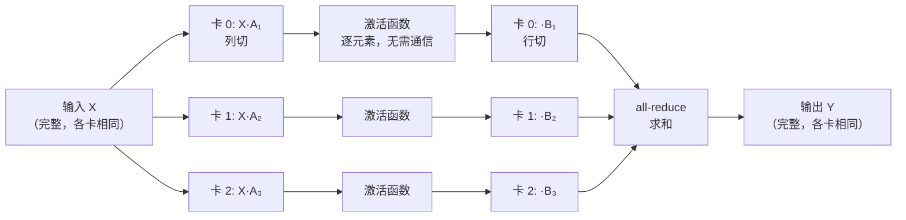
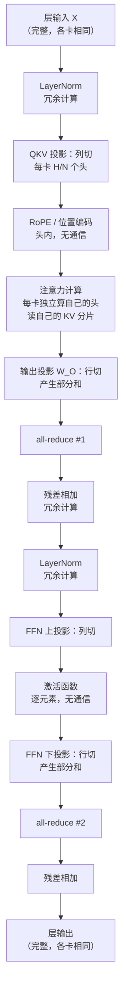
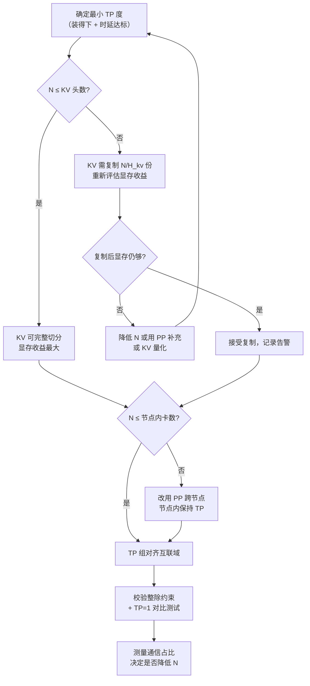

# 张量并行推理：切法、通信与放置

> 位置：[InferenceAtlas](../../INDEX.md) > [模块 06](README.md) > 当前文档
> 信息截至：2026-07-29 ｜ 最后核验：2026-07-29 ｜ 内容版本：v0.1
> 时效性等级：低
> 相关主题：[分布式推理总览](01_distributed_inference_overview.md)｜`03_pipeline_parallel_inference.md`｜[GQA/MQA/MLA](../02_transformer_and_kv_cache/06_gqa_mqa_mla_and_kv_reduction.md)

## 本章导读

张量并行是推理中最常用的模型并行方式，因为它同时解决两个问题：**权重装不下**与**单卡带宽不够**。但它的代价——每层两次 all-reduce，且落在 decode 的关键路径上——也是所有并行方式中最直接的。

[分布式推理总览](01_distributed_inference_overview.md) 已给出 TP 的宏观代价模型与最优并行度的存在性。**本章深入切分的具体方式**：为什么 FFN 的两个矩阵要按不同维度切、为什么这样切能把两次通信减到一次、注意力头怎么切、以及 GQA 与 MLA 如何改变切分的约束。

一个贯穿全章的观察是：**TP 的切法不是随意的**。切分维度的选择直接决定了通信次数——切对了每层两次 all-reduce，切错了可能是四次甚至更多。这个"列切-行切配对"的模式是 TP 设计中最优雅也最重要的部分。

另一个实践重点是**约束**：TP 度必须能整除注意力头数（或 KV 头数）、必须整除 FFN 中间维度、词表要能切分。这些整除关系在 GQA 模型上会成为真实的限制——KV 头数往往只有 8 个，这直接给 TP 度设了上限。

## 学习目标

读完本章后，读者应能够：

1. 画出 FFN 与注意力的 TP 切分方式，并说明为什么这样切能最小化通信；
2. 推导单层 TP 的通信次数与数据量，并解释为什么是 2 次而非 4 次；
3. 列出 TP 度必须满足的全部整除约束，并判断某个模型的 TP 度上限；
4. 说明 GQA/MQA 如何限制 TP 度，以及两种应对方案的取舍；
5. 分析 TP 对 KV cache、嵌入层与采样的影响。

## 核心结论

- **"列切 + 行切"的配对是 TP 的核心设计**：第一个矩阵按输出维切（列切），第二个按输入维切（行切），使中间激活无需通信，只在最后规约一次。
- **单层 TP 需要 2 次 all-reduce**（注意力块一次、FFN 块一次），这是配对切法的结果；朴素切法需要更多。
- **TP 度受多重整除约束**：注意力头数、KV 头数、FFN 中间维度、词表大小。**GQA 模型的 KV 头数常常是最紧的那个约束**。
- **TP 天然切分 KV cache**：每卡只存自己那部分头的 KV，这是 TP 缓解显存压力的重要一环，常被忽略。
- **通信量与批大小成正比而与模型大小无关**，因此 TP 在大 $d$、小 $B$ 的场景下代价最低。

## 1. 问题定义、系统边界与工作负载

### 1.1 TP 要切什么

一个 Transformer 层的主要参数：

| 组件 | 权重形状 | 参数量占比（典型 dense） |
|---|---|---|
| Q/K/V 投影 | $d \times d$（各一个，GQA 下 K/V 更小） | 约 1/4 |
| 注意力输出投影 | $d \times d$ | 约 1/12 |
| FFN 上投影 | $d \times d_{ff}$ | 约 1/3 |
| FFN 下投影 | $d_{ff} \times d$ | 约 1/3 |
| LayerNorm | $d$ | 可忽略 |

（比例基于 $d_{ff} = 4d$ 的标准配置；使用 SwiGLU 等门控 FFN 时上投影有两个矩阵，比例会变。）

**TP 的目标**：把这些矩阵切到 $N$ 个设备上，使每个设备只存 $1/N$ 的参数、只做 $1/N$ 的计算，同时把通信压到最少。

### 1.2 两种基本切法

设一个线性层 $Y = XA$，其中 $X \in \mathbb{R}^{m \times k}$、$A \in \mathbb{R}^{k \times n}$。

**列切（column-wise / output-dim split）**：把 $A$ 按列切成 $[A_1, A_2, \dots, A_N]$。

$$
Y = X[A_1, \dots, A_N] = [XA_1, \dots, XA_N]
$$

- 每个设备需要**完整的 $X$**，产出 $Y$ 的一部分列；
- 输出是**按列分片**的，若要完整的 $Y$ 需要 all-gather。

**行切（row-wise / input-dim split）**：把 $A$ 按行切成 $[A_1; A_2; \dots; A_N]$，同时 $X$ 按列切。

$$
Y = [X_1, \dots, X_N] \begin{bmatrix} A_1 \\ \vdots \\ A_N \end{bmatrix} = \sum_{i=1}^{N} X_i A_i
$$

- 每个设备只需要 $X$ 的一部分列，产出**部分和**；
- 得到完整的 $Y$ 需要 all-reduce（求和）。

| 切法 | 输入要求 | 输出形态 | 需要的通信 |
|---|---|---|---|
| 列切 | 完整 $X$ | 按列分片 | 无（若下游能接受分片）或 all-gather |
| 行切 | 按列分片的 $X$ | 部分和 | all-reduce |

### 1.3 配对的妙处

关键洞察：**列切的输出形态（按列分片）恰好是行切的输入要求**。

因此把连续的两个线性层配对——第一个列切、第二个行切——中间**完全不需要通信**，只在第二个之后做一次 all-reduce。



**图解读**：
1. **本图展示什么**：FFN 的两个矩阵按"列切 + 行切"配对，中间的激活函数逐元素作用于分片而无需通信，整个 FFN 块只在最后做一次 all-reduce。
2. **核心瓶颈**：瓶颈是最后那一次 all-reduce——它是同步点，所有卡必须等最慢的一个。在 decode 阶段这次通信落在关键路径上，且每层都要付一次。
3. **图中的 trade-off**：这个设计用"输入必须完整复制到各卡"换取"中间不通信"。复制输入意味着每卡都要存一份 $X$，但 $X$ 是激活（小）而非权重（大），代价可接受。
4. **面试如何引用**：被问"张量并行怎么切"时，用这张图讲清列切-行切的配对，并指出关键在于**激活函数是逐元素的**，因此可以作用在分片上——这是配对成立的前提。

**为什么激活函数是关键前提**：如果中间的非线性操作需要跨列的信息（例如 softmax 沿输出维），分片就无法独立计算，必须先 all-gather。FFN 的 GELU/SiLU 是逐元素的，所以没问题。

**门控 FFN（SwiGLU 等）的处理**：$\text{FFN}(x) = (\text{SiLU}(xW_{\text{gate}}) \odot xW_{\text{up}}) W_{\text{down}}$。$W_{\text{gate}}$ 与 $W_{\text{up}}$ 都列切，逐元素乘也是逐元素的，$W_{\text{down}}$ 行切——配对模式完全适用，仍是一次 all-reduce。

## 2. 原理、数学与性能模型

### 2.1 注意力块的切分

注意力的自然切分维度是**头**。设总头数 $H$、每头维度 $d_h$、TP 度 $N$：

- $W_Q, W_K, W_V$：**列切**，每卡分到 $H/N$ 个头；
- 注意力计算：每卡独立算自己那些头（头之间本来就无交互）；
- $W_O$（输出投影）：**行切**，因为输入是按头分片的。

$$
\text{Attn}(X) = \text{Concat}(\text{head}_1, \dots, \text{head}_H) W_O = \sum_{i=1}^{N} \text{Concat}(\text{head}_{(i)}) W_O^{(i)}
$$

**这同样是列切-行切的配对**：$W_{QKV}$ 列切、$W_O$ 行切，中间的注意力计算（softmax、加权求和）都在头内部进行，不跨头，因此无需通信。

**softmax 不是问题**：softmax 沿的是序列维（key 位置），而切分沿的是头维。两个维度正交，因此每卡可以对自己的头独立做完整的 softmax。**这一点是注意力可以按头切分的根本原因**。

### 2.2 每层 2 次 all-reduce

综合 1.3 与 2.1：

| 块 | 切法 | 通信 |
|---|---|---|
| 注意力：$W_{QKV}$ 列切 + $W_O$ 行切 | 配对 | 1 次 all-reduce |
| FFN：上投影列切 + 下投影行切 | 配对 | 1 次 all-reduce |

$$
\text{每层通信次数} = 2, \qquad \text{每步总次数} = 2L
$$

**朴素切法的对比**：如果每个矩阵都独立地"切了再合"，每个线性层后都要一次 all-gather 或 all-reduce，一层就是 4 次（QKV 算一次、$W_O$、上投影、下投影），是配对切法的 2 倍。**配对切法把通信减半**——这是它的核心价值。

**LayerNorm 的位置**：LayerNorm 需要沿 $d$ 维求均值方差，因此需要完整的激活。在配对切法下，all-reduce 之后的激活是完整的，LayerNorm 可以在各卡上冗余计算（每卡算相同的结果）。**冗余计算比再通信一次便宜**，这是标准做法。

### 2.3 通信量与时间

单次 all-reduce 的数据量（见 [总览](01_distributed_inference_overview.md) 2.2）：

$$
D_{\text{ar}} = B \cdot S_{\text{new}} \cdot d \cdot b_a
$$

**prefill 与 decode 的画像差异**：

| 阶段 | $S_{\text{new}}$ | $D_{\text{ar}}$ | 通信性质 |
|---|---|---|---|
| prefill | 序列长度（大） | 大 | 带宽受限，大消息 |
| decode | 1 | 小 | 延迟受限，小消息 |

设 $B=32$、$d=8192$、$b_a=2$（fp16）：
- decode：$D_{\text{ar}} = 32 \times 1 \times 8192 \times 2 = 512$ KiB；
- prefill（$S=2048$）：$D_{\text{ar}} = 32 \times 2048 \times 8192 \times 2 = 1$ GiB。

（以上为按公式代入的**算例**，非实测数据。）

**推论**：
- **decode 的 TP 开销由固定延迟 $\alpha$ 与次数 $2L$ 主导**；
- **prefill 的 TP 开销由链路带宽主导**。

这两种画像需要不同的优化：decode 需要低延迟互联与更少的层间同步；prefill 需要高带宽。**同一套硬件很难同时最优**——这是 prefill/decode 分离的动因之一。

### 2.4 TP 度的整除约束

TP 度 $N$ 必须同时满足：

| 约束 | 要求 | 典型上限 |
|---|---|---|
| 注意力头 | $N \mid H$ | $H$（常为 32–128） |
| **KV 头（GQA）** | $N \mid H_{kv}$ | $H_{kv}$（**常为 4–8**） |
| FFN 中间维 | $N \mid d_{ff}$ | 通常很大，不是约束 |
| 词表（若切分） | $N \mid V$（或需 padding） | 通常可 padding |

**GQA 的 KV 头数是最紧的约束**。在 GQA 中，多个 query 头共享一组 KV 头（见 [模块 02 第 6 章](../02_transformer_and_kv_cache/06_gqa_mqa_mla_and_kv_reduction.md)）。如果 $H_{kv} = 8$，那么：

- $N \le 8$ 时可以整除，每卡分到 $H_{kv}/N$ 组 KV；
- $N > 8$ 时无法整除，必须用变通方案。

**两种变通方案**：

| 方案 | 做法 | 代价 |
|---|---|---|
| **KV 复制** | 每 $N/H_{kv}$ 张卡持有同一组 KV 的副本 | KV 显存占用 × $(N/H_{kv})$，抵消了 GQA 的节省 |
| **KV 不切分** | 所有卡各存完整 KV | KV 显存 × $N$，更糟 |

**KV 复制的定量代价**：GQA 相对 MHA 的 KV 节省比例是 $H_{kv}/H$。若 $N > H_{kv}$ 需要复制 $N/H_{kv}$ 份，则实际节省变为

$$
\frac{H_{kv}}{H} \cdot \frac{N}{H_{kv}} = \frac{N}{H}
$$

- **直觉**：当 $N > H_{kv}$ 时，GQA 带来的 KV 节省被 TP 复制部分抵消；$N = H$ 时完全抵消（退化为 MHA 的 KV 占用）。
- **推论**：**GQA 模型的 TP 度不宜超过 KV 头数**。这是一个真实且常被忽略的部署约束。

**MQA 更极端**：$H_{kv} = 1$，任何 $N > 1$ 都需要复制。但由于 MQA 的 KV 本来就极小，复制的绝对代价可能可接受。

**MLA 的情况**：MLA 用一个低秩压缩的潜在向量替代显式的 K/V，切分方式与 GQA 不同，具体约束取决于实现——本库不臆测具体模型的实现细节，标记为 `待核实`。

### 2.5 TP 对 KV cache 的影响

这是 TP 一个常被低估的好处：**TP 天然切分 KV cache**。

每卡只持有自己那部分头的 KV：

$$
M_{\text{KV}}^{\text{per-device}} = \frac{M_{\text{KV}}^{\text{total}}}{N} \quad (\text{当 } N \le H_{kv})
$$

**这意味着 TP 不只是"让权重装得下"，也"让 KV 装得下"**。在长上下文或高并发场景，KV 才是显存的主要占用者，TP 对 KV 的切分可能比对权重的切分更有价值。

**完整的显存模型**：

$$
M_{\text{per-device}} = \frac{W}{N} + \frac{M_{\text{KV}}}{\min(N, H_{kv})} + M_{\text{act}} + M_{\text{overhead}}
$$

- 注意 KV 项的分母是 $\min(N, H_{kv})$——超过 KV 头数后不再继续切分（因为要复制）；
- $M_{\text{act}}$：激活显存，在 TP 下部分切分部分复制；
- **局限**：该式忽略了通信缓冲区与碎片。

**这个 $\min$ 是 2.4 结论的另一种表述**：$N$ 超过 $H_{kv}$ 后，增加 TP 度对 KV 显存不再有帮助，只对权重有帮助。

### 2.6 嵌入层与输出头

**输入嵌入**：可以按词表维切分（每卡持有部分词的嵌入），查表后 all-reduce（未命中的位置贡献 0）。也可以不切分（每卡一份完整嵌入）——若词表不大，冗余存储更简单。

**输出头（LM head）**：形状 $d \times V$，在大词表模型上参数量可观。

| 切法 | 通信 | 后续影响 |
|---|---|---|
| 列切（按词表维） | 输出是分片的 logits | 采样需要跨卡协作 |
| 不切分 | 无 | 每卡存一份 $d \times V$ |

**列切输出头的采样问题**：logits 按词表维分片后，softmax 需要全局的最大值与求和。可以用两次小规模 all-reduce（先 all-reduce max，再 all-reduce sum of exp）完成，通信量是 $O(B)$ 而非 $O(BV)$——**很便宜**。

$$
\text{分布式 softmax 通信量} = 2 \cdot B \cdot b_a \quad (\text{两个标量/请求})
$$

这比 all-gather 完整 logits（$B \cdot V \cdot b_a$）便宜几个数量级。**采样也可以分布式做**：各卡在自己的分片内采样候选，再用一次小规模通信选出全局结果。

**实践取舍**：若 $V$ 很大（十万量级）且 $d$ 也大，输出头的参数量不可忽略，值得切分；若 $V$ 较小，冗余存储换取实现简单更划算。

## 3. 实现机制与系统设计

### 3.1 完整的单层数据流



**图解读**：
1. **本图展示什么**：一个 Transformer 层在 TP 下的完整数据流，标明每个算子的切分方式与两次 all-reduce 的确切位置。
2. **核心瓶颈**：两次 all-reduce 是仅有的两个同步点。它们之间的所有计算（注意力、激活函数、逐元素操作）都是各卡独立的。整层的时间下界是"计算时间 + 2 次 all-reduce 时间"。
3. **图中的 trade-off**：LayerNorm 与残差在各卡冗余计算——用一点重复计算换取不再多一次通信。这是正确的取舍，因为这些操作是 $O(Bd)$ 的逐元素运算，远比一次 all-reduce 便宜。
4. **面试如何引用**：被问"TP 下一层要通信几次"时，用这张图指出确切的两个位置，并说明为什么 LayerNorm 不需要额外通信（因为 all-reduce 后激活已完整）。

**关键实现细节**：
- **RoPE 在头内应用**，因此与切分正交，无需通信；
- **KV cache 的读写也在头内**，每卡只管自己的分片；
- **残差连接需要完整的激活**，因此必须在 all-reduce 之后。

### 3.2 权重切分的伪代码

```
function shard_layer_weights(layer, tp_rank, tp_size):
    H     = layer.num_heads
    H_kv  = layer.num_kv_heads
    d_h   = layer.head_dim
    d_ff  = layer.ffn_hidden

    assert H    % tp_size == 0, "头数必须被 TP 度整除"
    assert d_ff % tp_size == 0, "FFN 中间维必须被 TP 度整除"

    # --- QKV：列切（按头）---
    heads_per_rank = H // tp_size
    q_slice = slice(tp_rank * heads_per_rank * d_h,
                    (tp_rank+1) * heads_per_rank * d_h)
    layer.W_q = layer.W_q[:, q_slice]

    # --- KV：受 H_kv 约束 ---
    if tp_size <= H_kv:
        assert H_kv % tp_size == 0, "KV 头数必须被 TP 度整除"
        kv_per_rank = H_kv // tp_size
        kv_slice = slice(tp_rank * kv_per_rank * d_h,
                         (tp_rank+1) * kv_per_rank * d_h)
        layer.W_k = layer.W_k[:, kv_slice]
        layer.W_v = layer.W_v[:, kv_slice]
        layer.kv_replication = 1
    else:
        # TP 度超过 KV 头数：复制
        assert tp_size % H_kv == 0
        replicas_per_kv_head = tp_size // H_kv
        kv_head_id = tp_rank // replicas_per_kv_head
        kv_slice = slice(kv_head_id * d_h, (kv_head_id+1) * d_h)
        layer.W_k = layer.W_k[:, kv_slice]
        layer.W_v = layer.W_v[:, kv_slice]
        layer.kv_replication = replicas_per_kv_head
        warn(f"TP={tp_size} > KV heads={H_kv}，KV 将被复制 {replicas_per_kv_head} 份")

    # --- 输出投影：行切 ---
    layer.W_o = layer.W_o[q_slice, :]

    # --- FFN：上投影列切，下投影行切 ---
    ff_per_rank = d_ff // tp_size
    ff_slice = slice(tp_rank * ff_per_rank, (tp_rank+1) * ff_per_rank)
    layer.W_gate = layer.W_gate[:, ff_slice]     # 列切
    layer.W_up   = layer.W_up[:,   ff_slice]     # 列切
    layer.W_down = layer.W_down[ff_slice, :]     # 行切

    # --- LayerNorm：不切，各卡冗余持有 ---
    # layer.ln_weight 保持完整

    return layer
```

**三个必须校验的点**：
1. **整除关系**——不满足时应在加载阶段报错，而不是运行时崩溃；
2. **KV 复制的告警**——它会静默地抵消 GQA 的收益，必须显式提示；
3. **切片方向**——列切是 `[:, slice]`，行切是 `[slice, :]`。**搞反是最常见的实现错误**，且症状是输出数值错误而非崩溃。

**验证切分正确性的方法**：用小规模配置（TP=2）跑一次前向，与 TP=1 的结果逐元素比较。在 fp32 下应在浮点误差内一致。这个测试能捕获所有切分方向错误。

### 3.3 通信的实现要点

| 要点 | 说明 |
|---|---|
| 通信数据类型 | 可用低于计算精度的类型（如 bf16）以减半通信量，需评估精度影响 |
| 通信缓冲区 | 预分配并复用，避免每步分配 |
| 与 CUDA Graph | all-reduce 可被捕获，前提是缓冲区地址固定 |
| 异步与同步 | decode 阶段基本无重叠机会，同步实现即可 |
| 融合 | 残差加法可融合进 all-reduce 的后处理，省一次读写 |

**通信精度的取舍**：把 all-reduce 的数据类型从 fp32 降到 bf16 可以把通信量减半。代价是规约过程中的精度损失——$N$ 个部分和相加时，低精度的累积误差更大。实践中通常可接受，但在深层模型上应验证输出一致性。

**与 CUDA Graph 的配合**：TP 的 all-reduce 可以被 CUDA Graph 捕获（见 [模块 04 第 10 章](../04_compilers_runtimes_and_kernels/10_cuda_graphs_and_execution_overhead.md)），这对 decode 阶段尤其有价值——它消除了 $2L$ 次通信的启动开销。前提是通信缓冲区的地址在各次执行间保持不变。

### 3.4 放置与 rank 映射

（总体原则见 [总览](01_distributed_inference_overview.md) 3.1。这里补充 TP 特有的细节。）

**TP 组内的通信模式是全连接的**（all-reduce 涉及所有成员），因此 TP 组内的任意两卡之间都应有高带宽路径。这比 PP（只需相邻段之间通信）的拓扑要求更严。

| 拓扑 | 对 TP 的适配 |
|---|---|
| 全互联（每卡直连每卡） | 最优 |
| 环形 | 适合 ring all-reduce |
| 树形/交换机 | 依交换机带宽 |
| 跨 PCIe 根桥 | 显著降速 |
| 跨节点 | 严重降速 |

**实践建议**：TP 组应对齐到硬件的自然分组边界（如一个互联域、一个 PCIe 根复合体）。跨边界的 TP 组会出现**组内成员间带宽不均**，导致 all-reduce 被最慢的链路拖累。

### 3.5 与其他技术的交互

| 技术 | 交互 |
|---|---|
| 量化 | 正交，可组合；但要注意量化的分组边界不能跨切分边界 |
| 分页 KV | 正交，每卡独立管理自己的 KV 页 |
| 投机解码 | draft 模型也需要 TP（或用更小的 TP 度） |
| 前缀缓存 | 正交，但缓存的 KV 也是分片的，跨副本共享困难 |
| CUDA Graph | 可配合，见 3.3 |
| MoE | EP 与 TP 可组合，见 `05_moe_inference_and_expert_parallelism.md` |

**"量化的分组边界不能跨切分边界"值得展开**：分组量化（per-group）把权重按 $g$ 个元素一组共享一个 scale。如果切分把一个组切开，两个分片会需要同一个 scale，实现变复杂。**正确做法是让切分边界对齐到量化组边界**——由于 $g$ 通常是 64 或 128，而切分粒度是头（$d_h$ 通常 128）或 FFN 分块，通常自然对齐，但需要校验。

**"前缀缓存跨副本共享困难"**：TP 组内的 KV 是分片的，一个副本的 KV 分片对另一个副本没有意义（分片方式相同但内容属于不同请求）。因此前缀缓存的共享只能在**同一个副本内**进行，或者需要一个统一的、非分片的缓存层。这限制了多副本部署下的缓存命中率——一个请求路由到不同副本会命中不同的缓存。**这是缓存感知路由（cache-aware routing）的动因**（见 [模块 03 第 8 章](../03_serving_engines_and_scheduling/08_prompt_caching_and_prefix_caching.md)）。

## 4. 性能、成本、能耗与可靠性 trade-off

### 4.1 TP 度的多维影响

| $N$ 增大 | 权重/卡 | KV/卡 | 计算/卡 | 通信次数 | 通信量/次 | 净时延 |
|---|---|---|---|---|---|---|
| 效应 | $\div N$ | $\div \min(N, H_{kv})$ | $\div N$ | 不变（$2L$） | 不变 | 先降后升 |

**三个关键观察**：

1. **通信次数不随 $N$ 变化**——始终是 $2L$。变的是每次 all-reduce 的参与方数量，进而影响 $f(N)$ 与固定延迟。
2. **通信量/次也不随 $N$ 变化**——all-reduce 的输出是完整的激活，大小固定为 $B S_{\text{new}} d b_a$。变的是 ring 算法中每卡传输的字节数（$\frac{2(N-1)}{N} D$，$N$ 大时趋于 $2D$）。
3. **KV 的分母有上限 $H_{kv}$**——这是 2.4/2.5 的结论。

**综合**：$N$ 增大时，计算与显存收益是 $1/N$（递减的边际），通信代价是 $f(N)$（递增）。最优点由两者相交决定。

### 4.2 何时 TP 是净损失

| 情形 | 机制 | 判据 |
|---|---|---|
| 单卡本可行 | 引入了不必要的通信（[总览](01_distributed_inference_overview.md) 4.2） | $W \le M_{\text{avail}}$ 且 $W/\text{BW} \le \tau$ |
| $N > H_{kv}$ | KV 被复制，显存收益打折（2.4） | 检查 KV 复制倍数 |
| 跨节点 TP | $\alpha$ 惩罚（[总览](01_distributed_inference_overview.md) 2.6） | 测跨节点 all-reduce 延迟 |
| 层数很多 | $2L$ 次固定延迟累积 | 测通信占单步的比例 |
| **decode 小批** | 通信被固定延迟主导，而计算量也小 | 测通信占单步的比例 |

**"decode 小批"这一行是 TP 相对代价最高的场景，值得单独说明**。通信量 $B \cdot d \cdot b_a$ 与计算量都正比于 $B$，因此单看比值，批大小似乎不影响通信占比。但固定延迟 $\alpha \cdot 2L$ **与 $B$ 无关**：

$$
\frac{T_{\text{comm}}}{T_{\text{compute}}} \approx \frac{2L\alpha f(N)}{T_{\text{compute}}(B)} + \frac{\text{（带宽项）}}{\text{（计算项）}}
$$

第一项随 $B$ 减小而增大（分母变小、分子不变），第二项与 $B$ 无关。因此**小批时固定延迟被摊薄得最少，TP 的相对代价最高**——而 decode 恰恰是批受 TPOT 约束、无法任意增大的阶段。这与"大批更划算"的直觉一致，但原因是固定延迟的摊薄，而非通信/计算比的变化。

### 4.3 可靠性

| 风险 | 后果 | 缓解 |
|---|---|---|
| 切分方向搞反 | 输出数值错误（静默） | TP=2 与 TP=1 的逐元素对比测试 |
| 整除约束不满足 | 加载失败或静默 padding | 加载阶段显式断言 |
| KV 复制未察觉 | 显存超预期，GQA 收益消失 | 显式告警（3.2） |
| TP 组跨节点 | 性能断崖 | 启动时拓扑校验 |
| 通信精度降级 | 深层模型精度漂移 | 与 fp32 通信的输出对比 |
| 一卡故障 | 整个副本不可用 | 副本冗余 |
| 通信库版本不一致 | 挂起或错误结果 | 版本锁定与启动校验 |

**最危险的是"切分方向搞反"**：它不会崩溃，只会产生数值上错误的输出。模型仍然生成流畅的文本，但质量下降——这可能几周都不被发现。**TP=2 vs TP=1 的逐元素对比测试是必需的上线门禁**。

## 5. benchmark、真实案例或公开部署案例

当前环境的网络出口策略阻断了 `arxiv.org`、`docs.nvidia.com`、`huggingface.co` 等一手来源（详见 [AGENTS.md 第 11 节](../../AGENTS.md)）。因此本节**不引用任何具体模型的头数、隐藏维度、互联带宽或实测吞吐**。第 2.3 节的数据量计算是**按公式代入的算例**，其输入参数为假设值，非任何真实模型的规格。

| 陈述 | 披露标签 | 状态 |
|---|---|---|
| 列切-行切配对是主流框架的标准做法 | `开源代码/配置披露` | `待核实` |
| 主流框架在 TP > KV 头数时复制 KV | `开源代码/配置披露` | `待核实` |
| MLA 在 TP 下的切分方式 | — | `待核实`（不臆测实现细节） |
| 具体模型的 $H$、$H_{kv}$、$d$ | — | **不引用**（无一手来源） |

**可自行复现的实验**（`独立可复现实验`）：

1. **切分正确性验证**：TP=1 与 TP=2 在 fp32 下对同一输入做前向，逐元素比较。这是必需的正确性门禁。
2. **通信占比测量**：在 decode 与 prefill 两个阶段分别测量 all-reduce 耗时占单步的比例。验证 2.3 的画像差异。
3. **TP 度扫描**：$N \in \{1,2,4,8\}$ 下测 TPOT、吞吐与每卡显存。定位最优点，并观察 $N > H_{kv}$ 时显存是否停止下降（验证 2.5 的 $\min$）。
4. **KV 复制的显存代价**：在 $N = H_{kv}$ 与 $N = 2H_{kv}$ 下测量每卡 KV 显存。验证 2.4 的复制倍数。
5. **通信精度实验**：分别用 fp32 与 bf16 做 all-reduce，比较输出与通信耗时。评估精度-带宽取舍。
6. **CUDA Graph 收益**：开关图捕获，测 decode 单步耗时差异。量化 $2L$ 次通信启动开销的大小。
7. **拓扑敏感性**：把 TP 组分别放在同一互联域内与跨域，测 all-reduce 延迟差异。

> 实验方法论要求见 [如何读推理 benchmark](../00_start_here/03_how_to_read_inference_benchmarks.md)。

## 6. 设计决策框架



**图解读**：
1. **本图展示什么**：确定 TP 度的完整流程，特别标出 KV 头数这个常被忽略的约束点，以及它触发的重新评估回路。
2. **核心瓶颈**：瓶颈是 $N \le H_{kv}$ 这个判断——GQA 模型上 $H_{kv}$ 常常只有 4–8，这直接给 TP 度设了一个远低于"卡数"的实际上限。跨过它，KV 的显存收益就打折了。
3. **图中的 trade-off**：右侧分支（接受 KV 复制）用显存换更高的并行度；左下的"降低 N"用时延换显存。哪条更好取决于当前是显存紧张还是时延紧张。
4. **面试如何引用**：被问"TP 度怎么定"时，用这张图指出 KV 头数是一个硬约束——这个细节能明显区分"配置过 TP"与"理解 TP"。

### 决策清单

| 问题 | 若答案为"是" | 若答案为"否" |
|---|---|---|
| 单卡可行？ | 不要 TP | 需要 TP |
| $N$ 能整除 $H$ 与 $H_{kv}$？ | 可用 | 调整 $N$ 或接受复制 |
| $N \le H_{kv}$？ | KV 完整切分 | KV 复制，收益打折 |
| $N \le$ 节点内卡数？ | TP 在节点内 | 改 PP 跨节点 |
| 已做 TP=1 对比测试？ | 可上线 | 先做，静默错误风险高 |
| 通信占单步 < 20%？ | $N$ 合理 | 考虑降低 $N$ |
| 使用分组量化？ | 校验切分边界对齐 | 无此约束 |

## 7. 常见失败模式与排查路径

| 症状 | 可能原因 | 排查步骤 |
|---|---|---|
| 输出流畅但质量差 | 切分方向搞反（4.3） | TP=1 vs TP=2 逐元素对比，定位首个不一致的算子 |
| 加载时报形状不匹配 | 整除约束不满足 | 检查 $H$、$H_{kv}$、$d_{ff}$ 与 $N$ 的整除关系 |
| 显存超出预期 | KV 被复制（2.4） | 检查 $N$ 与 $H_{kv}$ 的关系；看是否有复制告警 |
| 增大 TP 后显存不再下降 | $N$ 已超 $H_{kv}$（2.5） | 这是预期行为；权重仍在切分，KV 已不再切 |
| decode 慢但 prefill 正常 | 小消息通信被 $\alpha$ 主导（2.3） | 测小消息 all-reduce 延迟；考虑降 $N$ 或用 CUDA Graph |
| prefill 慢但 decode 正常 | 大消息通信被带宽限制 | 测链路带宽；考虑通信精度降级 |
| 各卡耗时不均 | 拓扑不对称（3.4） | 逐对测量卡间带宽 |
| 启用量化后数值异常 | 量化组跨切分边界（3.5） | 检查 $g$ 与切分粒度的对齐 |
| CUDA Graph 捕获失败 | 通信缓冲区地址变化（3.3） | 预分配并复用缓冲区 |
| 多副本下缓存命中率低 | KV 分片不能跨副本共享（3.5） | 部署缓存感知路由 |
| 挂起无输出 | 通信库版本不一致或死锁 | 检查各 rank 的库版本；看是否有 rank 未参与集合操作 |

**排查顺序**：正确性问题（数值错误）先做 TP=1 对比；性能问题先校验拓扑，再区分 decode（延迟主导）与 prefill（带宽主导），最后才调 $N$。

## 8. 关联面试主题

1. **列切-行切配对为什么能把通信减半**——见本章 1.3 与 2.2，这是 TP 最核心的设计。
2. **为什么激活函数逐元素是配对成立的前提**——见本章 1.3。
3. **注意力为什么可以按头切分，softmax 为什么不是问题**——见本章 2.1，关键是切分维与 softmax 维正交。
4. **TP 度受哪些整除约束，哪个最紧**——见本章 2.4，GQA 的 KV 头数。
5. **$N > H_{kv}$ 时 GQA 的 KV 节省如何被抵消**——见本章 2.4 的 $N/H$ 推导。
6. **TP 对 KV cache 的切分作用**——见本章 2.5，常被忽略的收益。
7. **decode 与 prefill 的 TP 通信画像差异**——见本章 2.3。
8. **LayerNorm 为什么冗余计算而不是再通信一次**——见本章 2.2/3.1。
9. **分布式 softmax 为什么很便宜**——见本章 2.6，只需两个标量的 all-reduce。
10. **为什么 TP 的 KV 分片不能跨副本共享前缀缓存**——见本章 3.5。

## 9. 小结

张量并行的核心设计是**列切-行切的配对**：第一个矩阵按输出维切、第二个按输入维切，使中间激活无需通信，只在块末做一次 all-reduce。这把每层的通信从朴素切法的 4 次减到 2 次。配对成立的前提是**中间的非线性是逐元素的**——FFN 的激活函数与注意力的头内计算都满足这一点。

TP 的收益有两个方向，第二个常被忽略：
- **权重切分**：每卡只存 $W/N$，同时把 decode 的带宽下界降到 $W/(N \cdot \text{BW})$；
- **KV 切分**：每卡只存自己那些头的 KV。在长上下文或高并发下，这可能比权重的切分更有价值。

但 KV 的切分有一个硬上限：**KV 头数**。GQA 模型的 $H_{kv}$ 常常只有 4–8，一旦 $N > H_{kv}$，KV 必须被复制 $N/H_{kv}$ 份，GQA 的节省被部分抵消（实际节省从 $H_{kv}/H$ 退化为 $N/H$）。**这是 TP 度在 GQA 模型上的真实上限**，也是一个在决策时最容易被漏掉的约束。

通信画像上，prefill 与 decode 截然不同：prefill 是大消息、带宽受限；decode 是小消息、被固定延迟乘以 $2L$ 主导。这意味着两个阶段想要的互联特性不同，同一套硬件难以同时最优——这是 prefill/decode 分离的动因之一。

工程上有两条必须做的事。第一，**TP=1 与 TP=2 的逐元素对比测试**：切分方向搞反不会崩溃，只会静默地让输出数值错误，模型仍生成流畅文本但质量下降。第二，**KV 复制的显式告警**：它会静默地抵消 GQA 的显存收益，不告警就没人会发现。

## 关键术语

| 中文术语 | 英文 | 定义 | 单位/口径 | 关联文档 |
|---|---|---|---|---|
| 列切 | column-wise sharding | 按输出维度切分权重矩阵 | — | 本章 1.2 |
| 行切 | row-wise sharding | 按输入维度切分权重矩阵 | — | 本章 1.2 |
| 切分配对 | sharding pairing | 列切后接行切，使中间无需通信 | — | 本章 1.3 |
| KV 头数 | KV head count | GQA 中共享的 key/value 头数量 | 计数 | 本章 2.4 |
| KV 复制 | KV replication | TP 度超过 KV 头数时的必要复制 | 倍数 | 本章 2.4 |
| 冗余计算 | redundant computation | 各卡重复计算同一结果以避免通信 | — | 本章 2.2 |
| 分布式 softmax | distributed softmax | 在分片 logits 上用两次标量规约完成 softmax | — | 本章 2.6 |
| 互联域 | interconnect domain | 具有高带宽全互联的设备集合 | — | 本章 3.4 |

## 延伸阅读

- [分布式推理总览](01_distributed_inference_overview.md) — TP 的宏观代价模型与最优并行度
- `03_pipeline_parallel_inference.md` — 跨节点的替代方案
- `05_moe_inference_and_expert_parallelism.md` — EP 与 TP 的组合
- [GQA、MQA 与 MLA](../02_transformer_and_kv_cache/06_gqa_mqa_mla_and_kv_reduction.md) — KV 头数约束的来源
- [KV cache 容量与内存模型](../02_transformer_and_kv_cache/05_kv_cache_capacity_and_memory_models.md) — 显存预算
- [CUDA Graphs 与执行开销](../04_compilers_runtimes_and_kernels/10_cuda_graphs_and_execution_overhead.md) — 消除 $2L$ 次通信的启动开销
- [prompt 缓存与前缀缓存](../03_serving_engines_and_scheduling/08_prompt_caching_and_prefix_caching.md) — 跨副本共享的困难
- [量化内核](../04_compilers_runtimes_and_kernels/09_quantization_kernels.md) — 量化组与切分边界的对齐

## 主要来源

本章的切分方案与通信分析为本库自洽推导，基于标准 Transformer 结构与线性代数的分块乘法性质。第 2.3 节的数据量为**按公式代入假设参数的算例**，非任何真实模型的规格。涉及框架实现的陈述已在第 5 节标注为 `待核实`；具体模型规格与硬件数字**未引用**（详见 [AGENTS.md 第 11 节](../../AGENTS.md)）。

| 类别 | 说明 | 披露标签 |
|---|---|---|
| 列切/行切的数学性质 | 分块矩阵乘法的标准结果 | — |
| 配对切法的通信次数 | 本库推导 | — |
| KV 复制的节省退化 $N/H$ | 本库推导 | — |
| 分布式 softmax 的通信量 | 本库推导 | — |
| 第 2.3 节数据量算例 | 按假设参数代入，非实测 | — |
| 框架实现与真实模型规格 | 需一手核验 | `待核实` / 未引用 |

## 更新记录

| 日期 | 版本 | 变更 | 核验人 |
|---|---|---|---|
| 2026-07-29 | v0.1 | 初稿：列切-行切配对、注意力按头切分、TP 度的整除约束与 GQA 上限、KV 切分收益、放置与实现要点 | — |
