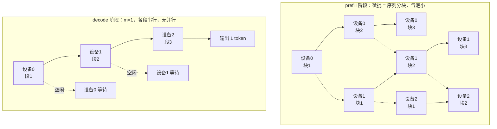
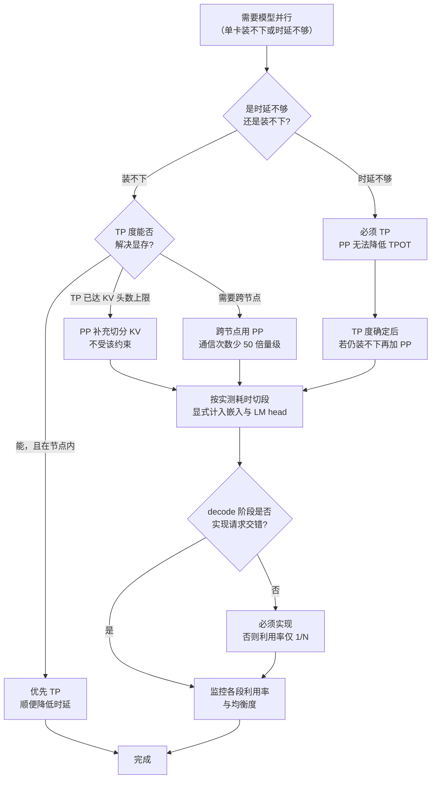

# 流水线并行推理：气泡、微批与跨节点定位

> 位置：[InferenceAtlas](../../INDEX.md) > [模块 06](README.md) > 当前文档
> 信息截至：2026-07-29 ｜ 最后核验：2026-07-29 ｜ 内容版本：v0.1
> 时效性等级：低
> 相关主题：[分布式推理总览](01_distributed_inference_overview.md)｜[张量并行推理](02_tensor_parallel_inference.md)｜`09_multi_node_serving_topologies.md`

## 本章导读

流水线并行在训练中是成熟且高效的手段：把模型按层切成若干段，用几十个微批填满流水线，气泡可以压到百分之几。**这个成功经验不能直接迁移到推理**——推理的 decode 阶段一步只产出一个 token，可用于填充流水线的"微批"来自把当前批拆小，而拆小批本身就恶化了 decode 的效率。

因此 PP 在推理中的定位与训练完全不同：**它不是提升吞吐或时延的手段，而是"让模型装得下"以及"跨节点切分"的手段**。它的真正优势不在计算，而在通信——层间只需点对点传一次激活，次数是 $N_{\text{PP}}-1$ 而非 TP 的 $2L$，数据量也小得多。这使 PP 成为跨节点切分远优于 TP 的选择。

本章量化这两面：气泡为什么在推理中难以消除、以及 PP 的通信优势有多大。最后给出 TP × PP 的组合原则——**节点内 TP、节点间 PP**——及其背后的理由。

## 学习目标

读完本章后，读者应能够：

1. 推导流水线气泡公式，并说明为什么推理 decode 无法像训练那样把它压小；
2. 量化 PP 相对 TP 的通信优势（次数与数据量两个维度）；
3. 解释为什么 prefill 阶段的 PP 效率远高于 decode 阶段；
4. 设计 TP × PP 的组合配置，并说明"节点内 TP、节点间 PP"的理由；
5. 识别 PP 特有的失败模式（段间负载不均、KV 分布不均）。

## 核心结论

- **PP 在推理中不提升吞吐或时延，只解决"装得下"与"跨节点"**。把它当作性能优化手段是常见的误解。
- **decode 的气泡难以消除**：微批只能从当前批拆分，而 decode 的批本身受 TPOT 约束不能太大，拆小又降低带宽利用率。
- **PP 的通信优势极大**：$N_{\text{PP}}-1$ 次点对点 vs TP 的 $2L$ 次集合通信，且单次数据量小于 TP。这是它适合跨节点的根本原因。
- **prefill 的 PP 效率远高于 decode**，因为 prefill 天然可以按序列切分成多个微批，且每个微批的计算量都很大。
- **段的切分应按计算量而非层数均分**，否则最慢的段成为整条流水线的节拍。

## 1. 问题定义、系统边界与工作负载

### 1.1 PP 的基本结构

把 $L$ 层切成 $N_{\text{PP}}$ 段，第 $i$ 段放在设备 $i$ 上。一次前向：

```
设备 0: 层 1..L/N        →  激活传给设备 1
设备 1: 层 L/N+1..2L/N   →  激活传给设备 2
...
设备 N-1: 最后一段        →  产出 logits
```

**通信**：只在段边界发生，是**点对点**（send/recv）而非集合通信，数据是激活张量 $[B_{\text{micro}}, S_{\text{new}}, d]$。

**与 TP 的结构差异**：

| 维度 | TP | PP |
|---|---|---|
| 切什么 | 层内的矩阵 | 层的集合 |
| 通信类型 | all-reduce（集合） | send/recv（点对点） |
| 通信次数/步 | $2L$ | $N_{\text{PP}} - 1$ |
| 单次数据量 | $B S_{\text{new}} d b_a$ | $B_{\text{micro}} S_{\text{new}} d b_a$ |
| 参与方 | $N_{\text{TP}}$ 个设备同时 | 2 个设备 |
| 设备是否同时忙 | 是 | 否（有气泡） |
| 显存切分 | 权重 + KV 都切 | 权重 + KV 按层切 |

**最后一行值得注意**：PP 也切分 KV cache——每段只持有自己那些层的 KV。这一点与 TP 相同，但切分维度不同（PP 按层，TP 按头）。**因此 PP 不受 KV 头数的整除约束**——这是 PP 相对 TP 的一个隐性优势，在 GQA 模型上尤其重要。

### 1.2 为什么推理的气泡难消除

训练中，一次迭代处理一个大批，可以拆成 $m$ 个微批依次送入流水线。$m$ 可以是几十上百，气泡比例 $\frac{N-1}{m+N-1}$ 很小。

推理 decode 中，一"步"要为批中每个请求生成一个 token。可用的微批只能来自**把当前批拆分**：

$$
m = \frac{B}{B_{\text{micro}}}
$$

而 $B$ 本身受两个约束：
- **上界**：TPOT SLO 限制批不能太大（见 [模块 01 第 2 章](../01_foundations_and_metrics/02_latency_throughput_and_slo.md)）；
- **下界**：decode 是带宽受限的，批太小则权重读取的成本无法摊薄。

**两难**：拆得越细气泡越小，但每个微批的算术强度越低，浪费越多。

### 1.3 prefill 与 decode 的差异

| 维度 | prefill | decode |
|---|---|---|
| 天然可切分的单位 | 序列分块（chunked prefill） | 只能拆批 |
| 单个微批的计算量 | 大（$S_{\text{chunk}}$ 个 token） | 小（1 个 token/请求） |
| 算术强度 | 高，计算受限 | 低，带宽受限 |
| 拆分的代价 | 小 | 大 |
| 气泡的相对影响 | 小 | 大 |

**结论**：**PP 在 prefill 阶段是高效的，在 decode 阶段是低效的**。这与 prefill/decode 的其他画像差异一致，也强化了分离部署的动因——若 prefill 池用 PP、decode 池用 TP，两边都能用上最适合的并行方式。

## 2. 原理、数学与性能模型

### 2.1 气泡公式

设有 $m$ 个微批、$N$ 段，每段处理一个微批耗时 $t$（假设各段均衡）：

- 总时间：$(m + N - 1) \cdot t$；
- 若无气泡（理想并行）：$m \cdot t$；
- 气泡比例：

$$
\text{bubble} = \frac{(m+N-1)t - mt}{(m+N-1)t} = \frac{N-1}{m+N-1}
$$

- **直觉**：需要 $N-1$ 个时间片填充流水线，之后才满载；总共 $m+N-1$ 个时间片。
- **假设**：各段耗时相同；忽略通信时间。
- **局限**：段不均衡时，节拍由最慢的段决定，实际气泡更大（见 2.3）。

**数值表**（按上式计算的**模型输出**，非实测）：

| $N \backslash m$ | 2 | 4 | 8 | 16 | 32 | 64 |
|---|---|---|---|---|---|---|
| 2 | 33% | 20% | 11% | 5.9% | 3.0% | 1.5% |
| 4 | 60% | 43% | 27% | 16% | 8.6% | 4.5% |
| 8 | 78% | 64% | 47% | 30% | 18% | 10% |
| 16 | 88% | 79% | 65% | 48% | 32% | 19% |

**从表中可读出**：

1. **训练的典型工作点在右下角**（$m$ 几十以上），气泡个位数百分比，可忽略；
2. **推理 decode 的典型工作点在左上到中间**（$m$ 只有几个），气泡可能达到 30%–60%；
3. **要把 $N=4$ 的气泡压到 10% 以下需要 $m \ge 27$**——这意味着批要拆成 27 份以上，对 decode 而言每份都极小。

### 2.2 decode 的完整效率模型

把气泡与算术强度损失合并。设：
- $T_{\text{step}}(B)$：批大小 $B$ 时单段的处理时间；
- decode 带宽受限，因此 $T_{\text{step}}(B) \approx \max(W_{\text{seg}}/\text{BW}, \text{计算时间}(B))$，在小 $B$ 时约等于常数 $W_{\text{seg}}/\text{BW}$。

**关键**：**$T_{\text{step}}$ 在小批时几乎与 $B$ 无关**（权重读取主导）。因此把批拆成 $m$ 份，每份的处理时间**不会**变成 $1/m$，而是几乎不变。

总时间：

$$
T_{\text{total}} \approx (m + N - 1) \cdot T_{\text{step}}(B/m) \approx (m+N-1) \cdot \frac{W_{\text{seg}}}{\text{BW}}
$$

而不拆分（$m=1$）时：

$$
T_{\text{total}}^{m=1} = N \cdot \frac{W_{\text{seg}}}{\text{BW}}
$$

**对比**：

$$
\frac{T_{\text{total}}(m)}{T_{\text{total}}(1)} \approx \frac{m+N-1}{N}
$$

- **$m > 1$ 时这个比值大于 1**——拆分微批让 decode **变慢**了！
- **原因**：在带宽受限区，拆分不减少每个微批的处理时间（权重还是要全读一遍），却增加了流水线的时间片数。

**这是推理 PP 最反直觉也最重要的结论**：

> **在 decode 阶段的带宽受限区，增加微批数不但不能消除气泡，反而会增加总时间。**

**正确的做法**：decode 阶段**不拆微批**（$m=1$），接受 $N$ 个时间片的串行执行。此时：

$$
T_{\text{decode-step}} = N \cdot \frac{W_{\text{seg}}}{\text{BW}} = \frac{W}{\text{BW}}
$$

——**与单卡完全相同**。也就是说，**PP 在 decode 阶段不改善时延，只是把权重分散到多卡以解决显存问题**。这与 TP 形成鲜明对比：TP 能把 $W/\text{BW}$ 降到 $W/(N \cdot \text{BW})$。

**这个结论成立的条件**：如果批足够大，使各段进入计算受限区，$T_{\text{step}}(B/m)$ 才真正随 $m$ 下降，拆微批才有意义。这在 prefill 阶段成立，在 decode 阶段通常不成立。

### 2.3 段不均衡的代价

若各段耗时不同，流水线的节拍由最慢的段决定：

$$
T_{\text{total}} \approx (m + N - 1) \cdot \max_i t_i
$$

**效率损失**：

$$
\eta_{\text{balance}} = \frac{\bar{t}}{\max_i t_i} = \frac{\frac{1}{N}\sum_i t_i}{\max_i t_i}
$$

- **直觉**：最慢的段决定一切，其他段的空闲是纯浪费。
- $\eta = 1$ 表示完全均衡。

**不均衡的来源**：

| 来源 | 说明 | 缓解 |
|---|---|---|
| 层数不能整除 $N$ | 某些段多一层 | 按计算量而非层数均分 |
| 嵌入层在第一段 | 第一段额外承担嵌入查表 | 把嵌入单独计入平衡 |
| LM head 在最后一段 | 最后一段额外承担 $d \times V$ 的投影 | **常见的严重不均衡源** |
| 层结构不同 | 某些层有额外模块 | 按实测耗时切分 |
| KV 长度不同 | 各段的注意力成本随 KV 长度变化，但各段 KV 长度相同 | 通常不是问题 |

**LM head 值得单独说明**：输出投影矩阵 $d \times V$ 在大词表模型上参数量可观，且它只在最后一段。这使最后一段的权重读取量显著高于其他段，成为流水线的瓶颈。

**缓解方案**：
1. **把 LM head 单独切分**（用 TP 切它，或放到独立设备）；
2. **让最后一段少放几层**，用层数补偿 LM head 的额外开销；
3. **按实测耗时而非参数量切分**——这是最稳妥的做法。

### 2.4 PP 的通信优势

**次数对比**：

| 方式 | 每步通信次数 |
|---|---|
| TP | $2L$ |
| PP | $N_{\text{PP}} - 1$ |

对 $L=80$、$N_{\text{PP}}=4$：TP 是 160 次，PP 是 3 次。**相差约 50 倍**。

**数据量对比**（单次）：

| 方式 | 单次数据量 |
|---|---|
| TP all-reduce | $B S_{\text{new}} d b_a$（且 ring 下每卡收发约 $2\times$ 此量） |
| PP send/recv | $B_{\text{micro}} S_{\text{new}} d b_a$（单向一次） |

**总数据量对比**（decode，$m=1$，$S_{\text{new}}=1$）：

$$
D_{\text{TP}} \approx 2L \cdot 2 B d b_a, \qquad D_{\text{PP}} = (N_{\text{PP}}-1) \cdot B d b_a
$$

$$
\frac{D_{\text{PP}}}{D_{\text{TP}}} \approx \frac{N_{\text{PP}}-1}{4L}
$$

对 $L=80$、$N_{\text{PP}}=4$：比值约 $3/320 \approx 0.9\%$。**PP 的通信量不到 TP 的百分之一**。

- **假设**：ring all-reduce 每卡收发约 $2D$；PP 单向传输。
- **局限**：这是数据量对比，转成时间还需考虑延迟项与链路差异。但次数少 50 倍意味着固定延迟的累积也少 50 倍。

**这个巨大的差距就是"跨节点用 PP"的全部理由**。跨节点链路的固定延迟 $\alpha$ 高、带宽低，而 PP 恰好对两者都不敏感（次数少、数据量小）。

### 2.5 TP × PP 组合

设总卡数 $N = N_{\text{TP}} \times N_{\text{PP}} \times N_{\text{replica}}$。

**每卡显存**：

$$
M_{\text{per-device}} \approx \frac{W}{N_{\text{TP}} \cdot N_{\text{PP}}} + \frac{M_{\text{KV}}}{\min(N_{\text{TP}}, H_{kv}) \cdot N_{\text{PP}}} + M_{\text{overhead}}
$$

- **注意 KV 项**：PP 按层切 KV，TP 按头切 KV，两者**相乘**。这是组合的一个重要收益。
- **PP 不受 $H_{kv}$ 约束**，因此当 $N_{\text{TP}}$ 已达到 $H_{kv}$ 上限时，PP 可以继续切分 KV。

**decode 单步时间**（$m=1$）：

$$
T_{\text{step}} \approx \underbrace{\frac{W}{N_{\text{TP}} \cdot \text{BW}}}_{\text{PP 不改善这一项}} + \underbrace{2L\left(\alpha_{\text{intra}} f(N_{\text{TP}}) + \dots\right)}_{\text{TP 通信}} + \underbrace{(N_{\text{PP}}-1)\left(\alpha_{\text{inter}} + \frac{B d b_a}{\text{BW}_{\text{inter}}}\right)}_{\text{PP 通信}}
$$

**这个式子把组合的取舍讲清楚了**：
- 第一项：只有 $N_{\text{TP}}$ 能降低它。**PP 对 decode 时延无帮助**（因为总权重读取量不变，只是分散到多卡串行执行）。

  更精确地说：PP 下每段读 $W/N_{\text{PP}}$，但 $N_{\text{PP}}$ 段串行，总时间仍是 $W/\text{BW}$。TP 下每卡读 $W/N_{\text{TP}}$ 且**并行**，总时间是 $W/(N_{\text{TP}} \text{BW})$。**并行 vs 串行是 TP 与 PP 在时延上的根本差异**。
- 第二项：TP 通信，次数 $2L$，用节点内的低 $\alpha$；
- 第三项：PP 通信，次数少，可以承受跨节点的高 $\alpha$。

**组合原则由此导出**：

> **节点内用 TP（降低时延、次数多但延迟低），节点间用 PP（只解决显存、次数少能容忍高延迟）。**

## 3. 实现机制与系统设计

### 3.1 PP 的执行时序



**图解读**：
1. **本图展示什么**：PP 在 prefill（上）与 decode（下）两个阶段的执行时序对比。prefill 有多个块可以填充流水线，decode 只有一个"微批"，各段严格串行。
2. **核心瓶颈**：decode 阶段的瓶颈是**串行执行**——任意时刻只有一个设备在工作，其余 $N-1$ 个空闲。设备利用率是 $1/N$。这不是可以优化掉的低效，而是 PP 在 decode 上的固有结构。
3. **图中的 trade-off**：decode 阶段用"$N$ 倍的设备闲置"换取"权重分散到 $N$ 张卡"。只有当显存确实装不下时，这个交易才值得。
4. **面试如何引用**：被问"PP 在推理中效果如何"时，用这张图区分两个阶段，并指出 decode 的设备利用率只有 $1/N$——这个数字比笼统说"有气泡"更有说服力。

**decode 阶段设备利用率的准确表述**：在 $m=1$ 时，每个设备只在自己那一段的时间片内工作，利用率为 $1/N_{\text{PP}}$。这看起来非常糟，但要注意：**这些设备也在同时服务其他副本或其他阶段的请求**。在实际部署中，PP 的各段设备通常会被安排处理不同请求的不同阶段，从而填满时间——这需要调度器的显式支持。

### 3.2 用请求交错填充流水线

上述观察给出了 decode 阶段 PP 的正确用法：**不拆当前批，而是让不同的批在流水线中交错**。

```
时间片 1: 设备0 处理批A段1
时间片 2: 设备0 处理批B段1 | 设备1 处理批A段2
时间片 3: 设备0 处理批C段1 | 设备1 处理批B段2 | 设备2 处理批A段3
时间片 4: 设备0 处理批D段1 | 设备1 处理批C段2 | 设备2 处理批B段3
...稳态：所有设备都忙
```

**这是 PP 在 decode 中唯一有效的用法**：把 $N_{\text{PP}}$ 个**独立的批**同时放进流水线。

**收益**：设备利用率从 $1/N$ 提升到接近 1，吞吐提升约 $N$ 倍。

**代价**：
1. **每个批的时延仍是 $N$ 个时间片**（走完全部段），不改善；
2. **需要 $N$ 倍的 KV 空间**（$N$ 个批同时在飞）——但 PP 本来就把 KV 按层切了，每段只存自己那层的 KV，因此总 KV 需求不变。这一点是巧合般的契合；
3. **调度器必须支持"多批同时在不同段"**，这比单批流水线复杂。

**关键澄清**：这种用法下 PP 提升的是**吞吐**而非时延。单请求的 TPOT 仍是 $W/\text{BW}$（走完所有段），与单卡相同。

### 3.3 段切分的实现

```
function split_layers_balanced(layers, num_stages, measured_costs=None):
    # 优先用实测耗时；否则用参数量估计
    if measured_costs is None:
        costs = [estimate_cost(l) for l in layers]
    else:
        costs = measured_costs

    # 嵌入层与 LM head 的额外成本必须计入
    costs[0]  += embedding_cost
    costs[-1] += lm_head_cost

    total = sum(costs)
    target = total / num_stages

    # 贪心切分：累积到接近 target 就断开
    stages, current, acc = [], [], 0.0
    for i, c in enumerate(costs):
        current.append(i)
        acc += c
        remaining_stages = num_stages - len(stages)
        if acc >= target and remaining_stages > 1:
            stages.append(current)
            current, acc = [], 0.0
            target = (total - sum(costs[:i+1])) / (remaining_stages - 1)
    stages.append(current)

    # 校验均衡度
    stage_costs = [sum(costs[j] for j in s) for s in stages]
    balance = (sum(stage_costs)/len(stage_costs)) / max(stage_costs)
    if balance < 0.9:
        warn(f"段不均衡，效率上限约 {balance:.2f}；最重的段: {argmax(stage_costs)}")

    return stages
```

**三个要点**：
1. **优先用实测耗时**。参数量估计忽略了注意力的序列长度依赖与各种非线性开销。
2. **嵌入层与 LM head 必须显式计入**，否则首尾段会系统性偏重。
3. **均衡度必须校验并告警**。$\eta_{\text{balance}} < 0.9$ 意味着至少 10% 的效率被浪费，且这个损失完全静默。

### 3.4 通信实现

PP 的通信是点对点的 send/recv，比 TP 的集合通信简单，但有几个要点：

| 要点 | 说明 |
|---|---|
| 异步收发 | 用非阻塞 send/recv，让本段计算与向下游传输重叠 |
| 缓冲区复用 | 预分配收发缓冲，避免每步分配 |
| 通信精度 | 可用 bf16 传激活，减半数据量 |
| 与计算重叠 | 传输当前微批的输出时，可以开始算下一微批 |
| 死锁避免 | 收发顺序必须一致，否则环形依赖会死锁 |

**重叠是 PP 相对 TP 的一个优势**：PP 的通信是"把结果交给下游"，本段不需要等待结果回来，因此可以异步发出后立即处理下一个微批。TP 的 all-reduce 则必须等结果才能继续。

**死锁的典型场景**：如果段 $i$ 先 send 再 recv，而段 $i+1$ 也先 send 再 recv，在阻塞式实现下会互相等待。正确做法是用非阻塞原语，或者按"偶数段先发后收、奇数段先收后发"的顺序。

### 3.5 与其他技术的交互

| 技术 | 交互 |
|---|---|
| TP | 正交，可组合（2.5） |
| 分页 KV | 每段独立管理自己那些层的 KV 页 |
| 前缀缓存 | 每段独立缓存自己那层的 KV；命中判断需跨段一致 |
| 投机解码 | 树形验证的 $N$ 个 token 一起过流水线，效率优于逐个 |
| chunked prefill | 天然契合——每个 chunk 就是一个微批 |
| CUDA Graph | 单段的计算可捕获；跨段的收发需要在图外或用图内通信节点 |

**"前缀缓存的命中判断需跨段一致"**：每段独立持有自己那些层的 KV，但"某个前缀是否已缓存"这个判断必须全局一致——不能出现段 1 认为命中而段 2 认为未命中的情况。实现上应由一个中心（通常是第一段或调度器）做出判断并广播，而不是各段独立判断。

**"投机解码与 PP 契合"**：树形投机的 $N_{\text{nodes}}$ 个候选 token 一起送入流水线，相当于一个更大的微批，算术强度更高。这部分抵消了 decode 阶段的带宽受限问题——**PP + 投机解码的组合比单独 PP 更合理**。

## 4. 性能、成本、能耗与可靠性 trade-off

### 4.1 PP 能与不能

| 目标 | PP 能否达成 | 说明 |
|---|---|---|
| 让模型装得下 | **能** | 权重按层切分 |
| 切分 KV cache | **能** | 按层切，且不受 $H_{kv}$ 约束 |
| 降低 TPOT | **不能** | 各段串行，总权重读取量不变 |
| 提升吞吐 | **能，但需请求交错**（3.2） | 稳态下利用率接近 1 |
| 跨节点扩展 | **能，且优于 TP** | 通信次数少 50 倍量级 |
| 降低成本 | **不能** | 与 TP 相同，$n/\eta(n) \ge 1$ |

**"降低 TPOT 不能"这一行是本章最重要的结论**，也是与 TP 最本质的差异。很多人把 PP 与 TP 都当作"加速手段"，实际上只有 TP 能降低单请求的 decode 时延。

### 4.2 何时选 PP 而非 TP

| 情形 | 选择 | 理由 |
|---|---|---|
| 需要跨节点 | **PP** | 通信次数少，容忍高 $\alpha$ |
| $N_{\text{TP}}$ 已达 $H_{kv}$ 上限 | **PP 补充** | PP 不受该约束 |
| 只需解决显存，时延已达标 | **PP** | 通信开销远小于 TP |
| 需要降低 TPOT | **TP** | PP 做不到 |
| 层数很少 | **TP** | PP 的段数受层数限制，且不均衡风险高 |
| 单请求时延敏感 | **TP** | PP 不改善单请求时延 |
| 吞吐优先且可交错请求 | **PP 可行** | 稳态利用率高 |

### 4.3 成本与能耗

与 TP 相同的基本结论（见 [总览](01_distributed_inference_overview.md) 4.2）：

$$
\frac{c_{\text{token}}(n)}{c_{\text{token}}(1)} = \frac{n}{\eta(n)} \ge 1
$$

**PP 的 $\eta$ 特殊之处**：
- 若不做请求交错，decode 的 $\eta \approx 1/N$——**极其低效**；
- 若做请求交错，$\eta$ 可接近 $1 - \text{bubble}$；
- prefill 的 $\eta$ 天然较高。

**推论**：**部署 PP 而不实现请求交错，是一个严重的资源浪费**。这应该是 PP 部署的检查项之一：测量各段设备的实际利用率，若明显低于 1，说明交错未生效。

### 4.4 可靠性

| 风险 | 后果 | 缓解 |
|---|---|---|
| 段不均衡 | 效率静默损失（2.3） | 均衡度校验与告警 |
| 未实现请求交错 | 利用率仅 $1/N$ | 监控各段利用率 |
| 收发死锁 | 服务挂起 | 非阻塞原语或固定顺序 |
| 中间段故障 | 整条流水线不可用 | 故障域等于整个 PP 组 |
| LM head 未计入平衡 | 最后一段成瓶颈（2.3） | 显式计入 |
| 前缀缓存判断不一致 | KV 状态错乱 | 中心化判断并广播 |
| 段间版本不一致 | 数值错误或挂起 | 启动时校验 |

**PP 的故障域是整条流水线**：任意一段的设备失效，整个副本不可用。这与 TP 相同（TP 组内任一卡失效整组不可用），但 PP 组常常跨节点，因此**PP 的故障域可能跨越多个节点**——可用性低于同规模的节点内 TP。

## 5. benchmark、真实案例或公开部署案例

当前环境的网络出口策略阻断了 `arxiv.org`、`docs.nvidia.com` 等一手来源（详见 [AGENTS.md 第 11 节](../../AGENTS.md)）。因此本节**不引用任何具体的层数、互联带宽或实测利用率**。第 2.1 节的气泡表是按公式计算的**模型输出**，第 2.4 节的比值是按假设参数（$L=80$、$N_{\text{PP}}=4$）代入的**算例**。

| 陈述 | 披露标签 | 状态 |
|---|---|---|
| 主流推理框架支持 PP 与 TP 组合 | `开源代码/配置披露` | `待核实` |
| 主流框架在 decode 阶段支持请求交错填充流水线 | `开源代码/配置披露` | `待核实` |
| 具体模型的层数与 LM head 参数占比 | — | **不引用**（无一手来源） |
| 跨节点与节点内延迟的具体倍数 | — | **不引用**（需自测） |

**可自行复现的实验**（`独立可复现实验`）：

1. **段利用率测量**：为每段设备记录忙/闲时间，计算利用率。若 decode 阶段接近 $1/N$，说明请求交错未生效（4.3）。
2. **气泡验证**：在 prefill 阶段扫描微批数 $m$，测量总耗时，与 2.1 的公式对比。
3. **decode 拆微批的负收益**：在 decode 阶段分别用 $m=1$ 与 $m=4$，测量单步耗时。验证 2.2 的"拆分反而更慢"。
4. **段均衡度测量**：逐段测量实际耗时，计算 $\eta_{\text{balance}}$。定位最重的段，检查是否为首段（嵌入）或末段（LM head）。
5. **PP vs TP 的通信量对比**：分别测量两种配置下每步的通信字节数与通信耗时。验证 2.4 的量级差异。
6. **跨节点 PP 的可行性**：把 PP 组跨节点部署，测量通信耗时占比。与跨节点 TP 对比，量化 PP 的优势。
7. **TPOT 对比**：单卡（若可行）、TP=$N$、PP=$N$ 三种配置下的 TPOT。验证 4.1 的"PP 不降低 TPOT"。
8. **PP + 投机解码**：开关投机，测量 PP 各段的算术强度变化。验证 3.5 的契合判断。

> 实验方法论要求见 [如何读推理 benchmark](../00_start_here/03_how_to_read_inference_benchmarks.md)。

## 6. 设计决策框架



**图解读**：
1. **本图展示什么**：PP 的选用决策，起点是区分"时延不够"与"装不下"这两个不同的问题——它们指向不同的答案。
2. **核心瓶颈**：瓶颈是最上面的分叉。如果动因是时延，PP 完全无效，再多的配置调优也没用。这一步判断错，后面全错。
3. **图中的 trade-off**：右侧的 PP 分支用"设备串行、时延不改善"换取"通信极少、可跨节点、不受 KV 头数约束"。它是显存问题的解，不是性能问题的解。
4. **面试如何引用**：被问"TP 和 PP 怎么选"时，用这张图给出判据：**TP 解决时延与显存，PP 只解决显存但通信便宜**。这比罗列两者特性更有结构。

### 决策清单

| 问题 | 若答案为"是" | 若答案为"否" |
|---|---|---|
| 动因是时延不够？ | 必须 TP，PP 无效 | PP 可考虑 |
| 需要跨节点？ | 跨节点用 PP | 节点内优先 TP |
| TP 度已达 $H_{kv}$ 上限？ | PP 可继续切 KV | TP 还有空间 |
| 层数足够多（≥ 4×段数）？ | PP 切分可均衡 | 段不均衡风险高 |
| 已实现 decode 请求交错？ | 利用率可接受 | 必须实现，否则浪费 $N-1$ 倍资源 |
| 已按实测耗时切段？ | 均衡度有保障 | 首末段可能偏重 |
| 已计入 LM head 成本？ | — | 最后一段会成瓶颈 |

## 7. 常见失败模式与排查路径

| 症状 | 可能原因 | 排查步骤 |
|---|---|---|
| PP 后 TPOT 没有改善 | **这是预期行为**（4.1） | 若需降 TPOT 改用 TP |
| 设备利用率约 $1/N$ | 未实现请求交错（3.2） | 检查调度器是否支持多批在不同段 |
| 最后一段明显慢 | LM head 未计入平衡（2.3） | 逐段测耗时；把 LM head 单独切分或减少末段层数 |
| 第一段明显慢 | 嵌入层未计入平衡 | 同上 |
| decode 拆微批后更慢 | **这是预期行为**（2.2） | decode 应用 $m=1$ + 请求交错 |
| 服务挂起无输出 | 收发死锁（3.4） | 检查各段的 send/recv 顺序；改用非阻塞 |
| prefill 快但 decode 慢 | PP 在 decode 上固有低效 | 考虑 prefill/decode 分离，decode 池用 TP |
| 某段 OOM 其他段富余 | 段不均衡（按层数而非成本切） | 按实测耗时重新切分 |
| 前缀缓存行为异常 | 各段独立判断命中（3.5） | 改为中心化判断并广播 |
| 跨节点 PP 反而比跨节点 TP 慢 | 段不均衡或未重叠通信 | 检查 $\eta_{\text{balance}}$；启用异步收发 |
| 中间段故障导致大面积不可用 | 故障域等于整条流水线（4.4） | 副本冗余；或降低 $N_{\text{PP}}$ |

**排查原则**：PP 的问题分两类——**"这是预期行为"**（TPOT 不改善、拆微批更慢）与**真实故障**（不均衡、未交错、死锁）。先确认症状属于哪一类，避免把固有特性当成 bug 去优化。

## 8. 关联面试主题

1. **PP 在推理中为什么不能降低 TPOT**——见本章 2.5 与 4.1，串行 vs 并行是与 TP 的根本差异。
2. **为什么 decode 拆微批反而更慢**——见本章 2.2，这是最反直觉也最能体现理解的点。
3. **气泡公式，以及为什么推理无法像训练那样压小它**——见本章 2.1 与 1.2。
4. **decode 阶段 PP 的正确用法是什么**——见本章 3.2，请求交错而非拆微批。
5. **PP 相对 TP 的通信优势有多大**——见本章 2.4，次数少约 50 倍、数据量不到 1%。
6. **为什么"节点内 TP、节点间 PP"**——见本章 2.5。
7. **PP 为什么不受 KV 头数约束**——见本章 1.1 与 2.5，切分维度不同。
8. **段不均衡的主要来源**——见本章 2.3，LM head 与嵌入层。
9. **PP 与投机解码为什么契合**——见本章 3.5，树形候选提升算术强度。
10. **PP 的故障域为什么可能比 TP 更大**——见本章 4.4，PP 组常跨节点。

## 9. 小结

流水线并行在推理中的定位与训练截然不同，这是本章的核心。

**PP 不能降低 TPOT**。TP 把权重切成 $N$ 份**并行**读取，单步时间降到 $W/(N\cdot\text{BW})$；PP 把权重切成 $N$ 段**串行**执行，总时间仍是 $W/\text{BW}$。并行与串行的差异，决定了只有 TP 能改善单请求的 decode 时延。

**decode 阶段拆微批不但不能消除气泡，反而更慢**。原因是 decode 处于带宽受限区，把批拆成 $m$ 份并不会让每份的处理时间变成 $1/m$（权重还是要全读一遍），却增加了 $m-1$ 个时间片。正确的做法是 $m=1$ 配合**请求交错**——让 $N_{\text{PP}}$ 个独立的批同时在流水线的不同段中，把设备利用率从 $1/N$ 提到接近 1。**部署 PP 而不实现请求交错，是在浪费 $N-1$ 倍的资源**，且这个浪费完全静默。

那么 PP 的价值在哪里？在**通信**。$N_{\text{PP}}-1$ 次点对点 vs TP 的 $2L$ 次集合通信——对 80 层模型的 4 段流水线，次数相差约 50 倍，数据量不到 1%。这使 PP 对链路的延迟与带宽都不敏感，成为**跨节点切分的正确选择**。由此得出组合原则：**节点内用 TP，节点间用 PP**。

PP 还有一个隐性优势：它按层切分 KV cache，**不受 GQA 的 KV 头数约束**。当 TP 度已经顶到 $H_{kv}$ 上限而 KV 仍装不下时，PP 可以继续切分。

实现上最容易出问题的是**段的均衡**。嵌入层在第一段、LM head 在最后一段，两者都会造成首末段偏重。切分应按**实测耗时**而非层数或参数量，并显式计入这两项。均衡度低于 0.9 意味着至少 10% 的效率静默损失，必须校验并告警。

## 关键术语

| 中文术语 | 英文 | 定义 | 单位/口径 | 关联文档 |
|---|---|---|---|---|
| 流水线并行 | pipeline parallel (PP) | 按层把模型切成多段，各段在不同设备 | 段数为计数 | 本章 1.1 |
| 流水线气泡 | pipeline bubble | 填充与排空期间的设备空闲比例 | 比例 | 本章 2.1 |
| 微批 | micro-batch | 送入流水线的最小执行单位 | 请求数或 token 数 | 本章 1.2 |
| 请求交错 | request interleaving | 让多个独立批同时占据流水线不同段 | — | 本章 3.2 |
| 段均衡度 | stage balance | 平均段耗时与最慢段耗时之比 | 无量纲，≤1 | 本章 2.3 |
| 段边界通信 | inter-stage communication | 段之间传递激活的点对点通信 | 字节 | 本章 2.4 |
| 分块 prefill | chunked prefill | 把长 prompt 切成块分批处理 | token | 本章 1.3 |

## 延伸阅读

- [分布式推理总览](01_distributed_inference_overview.md) — 四个动因与并行方式的整体框架
- [张量并行推理](02_tensor_parallel_inference.md) — TP 的切法与通信，与本章形成对照
- `07_prefill_decode_disaggregation.md` — 让 prefill 用 PP、decode 用 TP 的架构
- `09_multi_node_serving_topologies.md` — 跨节点放置的完整讨论
- [prefill vs decode](../02_transformer_and_kv_cache/02_prefill_vs_decode.md) — 两阶段画像差异的根源
- [prefill/decode 调度](../03_serving_engines_and_scheduling/05_prefill_decode_scheduling.md) — 请求交错的调度基础
- [Roofline 与性能建模](../01_foundations_and_metrics/04_roofline_and_performance_modeling.md) — 带宽受限区的判据
- [Medusa、EAGLE 与多 token 预测](../05_decoding_and_generation_algorithms/05_medusa_eagle_and_multi_token_prediction.md) — 与 PP 契合的投机方案

## 主要来源

本章的气泡模型与通信对比为本库自洽推导，基于标准流水线分析与模块 01 的 roofline 框架。第 2.1 节的表格为公式计算结果，第 2.4 节的比值为按假设参数代入的算例，均已在正文标注为非实测。涉及框架实现的陈述已在第 5 节标注为 `待核实`；具体模型规格与硬件数字**未引用**（详见 [AGENTS.md 第 11 节](../../AGENTS.md)）。

| 类别 | 说明 | 披露标签 |
|---|---|---|
| 气泡公式 | 标准流水线分析 | — |
| decode 拆微批的负收益推导 | 本库推导，基于带宽受限假设 | — |
| PP vs TP 的通信量比 | 本库推导，已标注假设 | — |
| 段均衡度定义 | 本库给出的自洽定义 | — |
| 第 2.1、2.4 节数值 | 公式计算/算例，非实测 | — |
| 框架实现与真实模型规格 | 需一手核验 | `待核实` / 未引用 |

## 更新记录

| 日期 | 版本 | 变更 | 核验人 |
|---|---|---|---|
| 2026-07-29 | v0.1 | 初稿：气泡公式与推理的特殊性、decode 拆微批的负收益、请求交错的正确用法、PP 的通信优势与 TP×PP 组合原则 | — |
