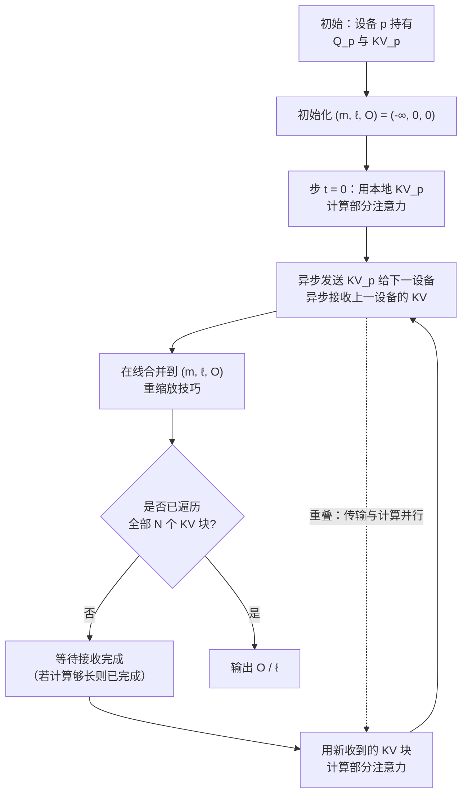
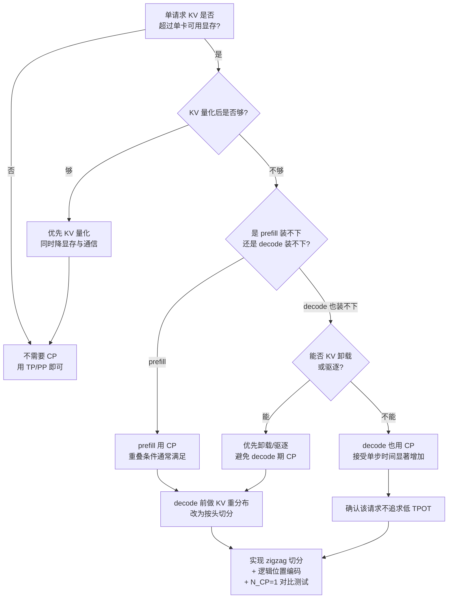

# 序列并行与上下文并行：长上下文的第三个维度

> 位置：[InferenceAtlas](../../INDEX.md) > [模块 06](README.md) > 当前文档
> 信息截至：2026-07-29 ｜ 最后核验：2026-07-29 ｜ 内容版本：v0.1
> 时效性等级：中
> 相关主题：[张量并行推理](02_tensor_parallel_inference.md)｜[长上下文推理](../02_transformer_and_kv_cache/07_long_context_inference.md)｜[FlashAttention](../04_compilers_runtimes_and_kernels/08_flashattention_and_memory_efficient_attention.md)

## 本章导读

TP 按头切、PP 按层切，两者都切不动一个东西：**单个序列的长度**。当上下文达到几十万甚至上百万 token 时，出现一个新问题——**单个请求的 KV cache 就超过了单卡显存**。此时无论多少张卡做 TP 或 PP，只要 KV 头数与层数已经切完，就再也切不下去了。

序列并行（SP）与上下文并行（CP）是沿**序列维**切分的第三个维度。它们的核心难点在于：注意力**本质上是跨序列位置的全局操作**——每个 query 要看到所有 key。因此沿序列切分后，注意力必须通过通信重建这个全局视图。

本章的核心内容是两种重建方式的对比：**Ring Attention**（让 KV 分块在设备间环形流转）与 **all-gather 式**（先把 KV 收齐再算）。前者通信量与序列长度成正比但可与计算重叠，后者实现简单但显存占用回到未切分状态。

一个必须讲清楚的差异是：**prefill 与 decode 的 CP 画像截然不同**。prefill 阶段每个设备持有一段 query 与一段 KV，计算量大、可以充分重叠；decode 阶段只有 1 个 query token，但要访问全部 KV——通信/计算比极差。这决定了 CP 在两个阶段需要不同的策略。

## 学习目标

读完本章后，读者应能够：

1. 说明什么情况下 TP 与 PP 都无法解决问题，必须引入序列维切分；
2. 区分序列并行（SP）与上下文并行（CP）的常见用法差异；
3. 描述 Ring Attention 的执行流程，并推导其通信量与重叠条件；
4. 解释为什么 decode 阶段的 CP 效率远低于 prefill 阶段；
5. 判断某个长上下文部署应选择 CP、KV 压缩、还是分块处理。

## 核心结论

- **CP 解决的是 TP/PP 解决不了的问题**：单请求 KV 超过单卡显存。这是长上下文特有的约束。
- **注意力的全局性是 CP 的核心难点**：切分后必须通过通信重建每个 query 对全部 key 的可见性。
- **Ring Attention 的通信可与计算重叠**，重叠成功的条件是"单块计算时间 ≥ 单块传输时间"，这给出了一个明确的可行性判据。
- **decode 阶段的 CP 通信/计算比极差**：1 个 query token 却要访问全部 KV，几乎无法重叠。
- **CP 应优先用于 prefill**；decode 阶段若 KV 仍装不下，KV 压缩或卸载通常优于 CP。

## 1. 问题定义、系统边界与工作负载

### 1.1 TP 与 PP 的共同盲区

回顾两者的切分维度与上限：

| 方式 | 切 KV 的维度 | 上限 |
|---|---|---|
| TP | 头（$H_{kv}$） | $\min(N_{\text{TP}}, H_{kv})$，GQA 下常为 4–8 |
| PP | 层（$L$） | $N_{\text{PP}} \le L$，但受气泡与时延约束 |
| **序列长度 $S$** | **两者都不切** | — |

单请求的 KV 大小

$$
M_{\text{KV}}^{\text{req}} = 2 L S H_{kv} d_h b_{kv}
$$

（符号见 [模块 02 第 5 章](../02_transformer_and_kv_cache/05_kv_cache_capacity_and_memory_models.md)。）

在 TP × PP 下，每卡承担

$$
M_{\text{KV}}^{\text{per-device}} = \frac{2 L S H_{kv} d_h b_{kv}}{\min(N_{\text{TP}}, H_{kv}) \cdot N_{\text{PP}}}
$$

**$S$ 始终在分子上**。当 $S$ 增长到某个点，即使 $N_{\text{TP}} = H_{kv}$、$N_{\text{PP}}$ 已达实用上限，单卡仍装不下。此时**必须切分序列维**。

### 1.2 SP 与 CP 的术语区分

这两个术语在文献与实践中用法不完全统一。本库采用如下区分：

| 术语 | 本库定义 | 主要目的 |
|---|---|---|
| **序列并行（SP）** | 在 TP 的基础上，把**非注意力部分**（LayerNorm、dropout、残差）也沿序列维切分 | 降低激活显存，通常与 TP 配套 |
| **上下文并行（CP）** | 把**序列本身**（含 KV cache）沿序列维切分到多设备 | 让超长上下文装得下 |

**SP 的定位**：它是 TP 的补充优化。在纯 TP 下，LayerNorm 等操作需要完整激活，各卡冗余持有（见 [张量并行推理](02_tensor_parallel_inference.md) 2.2）。SP 把这些操作也切开，用 all-gather/reduce-scatter 替代 all-reduce，激活显存降低但通信模式变化。**SP 不解决 KV 容量问题**。

**CP 的定位**：它切分 KV cache 本身。这是本章的主要内容。

> **术语提醒**：不同框架对这两个词的用法可能不同。阅读具体文档时应确认它指的是哪一种，标记为 `待核实`。

### 1.3 注意力的全局性

沿序列维切分的根本困难：

$$
\text{Attn}(q_i) = \sum_{j \le i} \text{softmax}_j\left(\frac{q_i \cdot k_j}{\sqrt{d_h}}\right) v_j
$$

query $q_i$ 需要**所有** $j \le i$ 的 key/value。如果 KV 被切到多个设备，$q_i$ 所在的设备只持有一部分 KV，必须通过通信获得其余部分。

**对比其他并行方式**：
- TP 按头切：头之间**没有交互**，所以不需要通信（除了最后的输出投影）；
- PP 按层切：层之间是**顺序依赖**，一次点对点传递即可；
- **CP 按序列切：位置之间是全连接依赖**，这是最难切的维度。

**FFN 不是问题**：FFN 是逐位置（position-wise）的，沿序列切分后各设备独立计算即可，零通信。**CP 的全部困难都在注意力上**。

## 2. 原理、数学与性能模型

### 2.1 两种重建全局注意力的方式

**方式 A：all-gather KV**

每个设备先把自己的 KV 分片广播给所有设备，收齐后各自计算完整注意力。

- 通信量：每设备接收 $(N-1)/N$ 的全部 KV，总量 $O(N \cdot M_{\text{KV}})$；
- **致命问题**：收齐后每设备都持有完整 KV，**显存回到未切分状态**——这完全违背了 CP 的初衷。
- 除非只是临时持有（用完即释放），但那样峰值显存仍然是完整 KV。

**结论**：all-gather 式只在"显存够但想加速"时有意义，不能解决容量问题。

**方式 B：Ring Attention（KV 环形流转）**

不收齐 KV，而是让 KV 分块在设备间**环形传递**，每个设备用当前手上的 KV 块与自己的 query 做部分注意力，最后合并。

- 每一步只额外持有 **1 个 KV 块**，显存约为 $M_{\text{KV}}/N + $ 一个块的大小；
- 通信量：每设备发送/接收 $N-1$ 次，每次一个块；
- **关键**：合并部分注意力结果需要在线 softmax 的重缩放技巧（与 FlashAttention 相同，见 [模块 04 第 8 章](../04_compilers_runtimes_and_kernels/08_flashattention_and_memory_efficient_attention.md)）。

### 2.2 Ring Attention 的在线合并

设设备 $p$ 持有 query 块 $Q_p$，依次接收 KV 块 $(K_0,V_0), (K_1,V_1), \dots$。

对第 $t$ 个 KV 块，计算部分结果：

$$
S_t = \frac{Q_p K_t^\top}{\sqrt{d_h}}, \quad m_t = \max(S_t), \quad P_t = \exp(S_t - m_t), \quad \ell_t = \sum P_t, \quad O_t = P_t V_t
$$

合并到累积状态 $(m, \ell, O)$：

$$
m^{\text{new}} = \max(m, m_t)
$$
$$
\ell^{\text{new}} = \ell \cdot e^{m - m^{\text{new}}} + \ell_t \cdot e^{m_t - m^{\text{new}}}
$$
$$
O^{\text{new}} = O \cdot e^{m - m^{\text{new}}} + O_t \cdot e^{m_t - m^{\text{new}}}
$$

最终输出 $O / \ell$。

- $m$：running max，用于数值稳定；$\ell$：running sum of exp；$O$：未归一化的加权和。
- **直觉**：与 FlashAttention 的在线 softmax 完全相同，只是分块的来源从"同一设备的内存分块"变成了"不同设备传来的块"。
- **精确性**：这个合并是**数学上精确的**，不是近似。输出与完整注意力逐元素相同（浮点误差内）。
- **局限**：需要维护 $(m, \ell, O)$ 三个状态，其中 $O$ 的规模是「每设备 query token 数 × $d_h$ × $H$」，不可忽略但远小于 KV。

**这是 CP 可行的数学基础**：正因为 softmax 可以在线合并，才能不收齐 KV 就算出精确的注意力。

### 2.3 因果掩码带来的负载不均

自回归模型有因果掩码：位置 $i$ 只能看到 $j \le i$。若把序列**连续切分**（设备 0 拿前 $S/N$ 个位置，设备 1 拿接下来 $S/N$ 个……），则：

| 设备 | 持有的 query 位置 | 需要的 KV 范围 | 计算量 |
|---|---|---|---|
| 0 | $[0, S/N)$ | $[0, S/N)$ | 最少 |
| 1 | $[S/N, 2S/N)$ | $[0, 2S/N)$ | 中 |
| $N-1$ | $[(N-1)S/N, S)$ | $[0, S)$ | 最多 |

**计算量比例**：设备 $p$ 的计算量正比于 $(p+1)$，因此

$$
\frac{\text{最大}}{\text{平均}} = \frac{N}{(N+1)/2} = \frac{2N}{N+1} \xrightarrow{N \to \infty} 2
$$

- **最慢的设备计算量约为平均的 2 倍**，效率上限约 50%。

**缓解：Z 字形（zigzag）切分**。把序列切成 $2N$ 块，设备 $p$ 拿第 $p$ 块与第 $(2N-1-p)$ 块。这样每个设备同时持有一个"早"块（计算少）与一个"晚"块（计算多），负载接近均衡。

$$
\text{设备 } p \text{ 的计算量} \propto (p+1) + (2N-p) = 2N+1 \quad \text{（与 } p \text{ 无关）}
$$

- **直觉**：早块与晚块的计算量互补，和为常数。
- **效率**：从约 50% 提升到接近 100%。
- **代价**：切分方式更复杂；KV 的逻辑位置与物理位置不再连续，索引逻辑复杂化。

**这是 CP 实现中一个必须处理的细节**——用朴素连续切分会白白损失一半效率。

### 2.4 通信与计算的重叠条件

Ring Attention 的核心优化是**在计算当前块时预取下一块**。重叠成功的条件：

$$
T_{\text{compute}}(\text{一块}) \ge T_{\text{transfer}}(\text{一块})
$$

记每设备持有的 query token 数为 $n_q$、单个 KV 块的 token 数为 $n_k$，注意力头数 $H$、KV 头数 $H_{kv}$。

**计算时间**（$n_q$ 个 query token × $n_k$ 个 KV token，全部 $H$ 个头）：

$$
T_{\text{compute}} \approx \frac{4 \, n_q \, n_k \, d_h \, H}{\text{FLOPS}}
$$

- 因子 4 = 2（$QK^\top$ 与 $PV$ 两次矩阵乘）× 2（每次乘加算 2 FLOP）。

**传输时间**（一个 KV 块，只含 $H_{kv}$ 个 KV 头）：

$$
T_{\text{transfer}} \approx \frac{2 \, n_k \, H_{kv} \, d_h \, b_{kv}}{\text{BW}_{\text{link}}}
$$

- 因子 2 为 K 与 V 各一份。

**重叠条件**：令 $T_{\text{compute}} \ge T_{\text{transfer}}$，约去公共的 $n_k d_h$：

$$
\frac{4 \, n_q \, H}{\text{FLOPS}} \ge \frac{2 \, H_{kv} \, b_{kv}}{\text{BW}_{\text{link}}}
\quad\Longleftrightarrow\quad
n_q \ge \frac{H_{kv}}{H} \cdot \frac{b_{kv}}{2} \cdot \frac{\text{FLOPS}}{\text{BW}_{\text{link}}}
$$

- **这是本章最重要的公式**。它说明重叠是否可行，取决于**每设备持有的 query token 数 $n_q$** 是否足够大。
- $\text{FLOPS}/\text{BW}_{\text{link}}$ 是硬件的"算力-互联比"，通常是一个很大的数（算力增长快过互联带宽），这是临界 $n_q$ 不小的原因；
- $b_{kv}$ 越小（KV 量化），临界 $n_q$ 越低——**KV 量化让重叠更容易**；
- $H_{kv}/H$ 正是 GQA 的压缩比。**GQA 直接按这个比例降低临界 $n_q$**：MHA 下该比为 1，$H_{kv}=8$、$H=64$ 的 GQA 下降到 1/8。
- **假设**：块内计算能达到 $\text{FLOPS}$ 的有效值；忽略在线合并的开销与固定通信延迟。实际临界值会高于此估计。

**prefill 与 decode 的判定**：

| 阶段 | 每设备 query token 数 | 重叠可行性 |
|---|---|---|
| prefill | $n_q = S/N$，通常成千上万 | **通常满足**，可充分重叠 |
| decode | $n_q = 1$（或投机的树节点数） | **几乎必然不满足** |

**这是本章的核心结论之一**：**CP 在 prefill 阶段可以做到近乎免费（通信被计算掩盖），在 decode 阶段则通信完全暴露**。

### 2.5 decode 阶段的 CP 代价

decode 时 $n_q = 1$（每请求），设备必须遍历全部 KV 才能算出一个 token 的注意力。

**通信量**（每设备每步）：

$$
D_{\text{decode}} \approx \frac{N-1}{N} \cdot M_{\text{KV}}^{\text{req}} \cdot B
$$

——**每步都要把几乎全部 KV 在设备间流转一遍**。

**对比 decode 的权重读取量** $W$：若 $M_{\text{KV}} \gg W$（长上下文下常见），则 CP 的通信量超过权重读取量。而互联带宽通常远低于 HBM 带宽：

$$
\frac{T_{\text{comm}}}{T_{\text{weight-read}}} \approx \frac{M_{\text{KV}} B / \text{BW}_{\text{link}}}{W / \text{BW}_{\text{HBM}}} = \frac{M_{\text{KV}} B}{W} \cdot \frac{\text{BW}_{\text{HBM}}}{\text{BW}_{\text{link}}}
$$

**两个因子都可能远大于 1**。这意味着 **decode 阶段的 CP 可能让单步时间增加数倍**。

**替代方案**：

| 方案 | 做法 | 适用 |
|---|---|---|
| **KV 不切，只切 prefill** | prefill 用 CP，之后把 KV 汇聚到一组设备做 decode | KV 汇聚后装得下 |
| **KV 量化** | 降低 $b_{kv}$（见 [模块 02 第 8 章](../02_transformer_and_kv_cache/08_kv_cache_compression_quantization_and_eviction.md)） | 精度可接受 |
| **KV 卸载** | 把远端 KV 放 CPU 内存，按需取回 | 有 PCIe 带宽富余 |
| **稀疏注意力/驱逐** | 只保留部分 KV | 质量可接受 |
| **CP 但接受慢 decode** | 保持 CP | 该请求本就不追求低 TPOT |

**判据**：**如果 decode 阶段 KV 仍装不下，优先考虑 KV 压缩或卸载，而非把 CP 延续到 decode**。

## 3. 实现机制与系统设计

### 3.1 Ring Attention 的执行流程



**图解读**：
1. **本图展示什么**：Ring Attention 的主循环——本地计算、异步收发 KV 块、在线合并，直到遍历完所有块。
2. **核心瓶颈**：瓶颈是"等待接收完成"这一步。若单块的计算时间长于传输时间（2.4 的条件成立），这一步为零等待，通信完全被掩盖；否则通信暴露，成为主导项。
3. **图中的 trade-off**：块切得越细，流水越平滑但通信次数越多（固定延迟累积）；块越粗，重叠越容易但显存中的临时块越大。块大小是需要按 2.4 的条件与显存预算共同确定的关键参数。
4. **面试如何引用**：被问"超长上下文怎么做"时，用这张图说明 Ring Attention 的精髓是"KV 流转而非收齐"，并指出在线 softmax 合并使结果**数学上精确**而非近似。

### 3.2 zigzag 切分的实现

```
function zigzag_partition(seq_len, num_devices):
    # 切成 2N 块
    num_chunks = 2 * num_devices
    chunk_size = ceil(seq_len / num_chunks)

    assignment = {}   # device -> [chunk indices]
    for p in range(num_devices):
        early = p                       # 第 p 块（计算量少）
        late  = num_chunks - 1 - p      # 第 (2N-1-p) 块（计算量多）
        assignment[p] = [early, late]

    # 校验负载均衡：设备 p 的计算量 ∝ (early+1) + (late+1)
    loads = [(a[0]+1) + (a[1]+1) for a in assignment.values()]
    assert max(loads) == min(loads), "zigzag 应产生完全均衡的负载"

    return assignment, chunk_size


function logical_to_physical(logical_pos, assignment, chunk_size):
    # zigzag 下逻辑位置与物理设备/偏移的映射不再连续
    chunk_id = logical_pos // chunk_size
    for dev, chunks in assignment.items():
        if chunk_id in chunks:
            local_idx = chunks.index(chunk_id)
            offset = local_idx * chunk_size + (logical_pos % chunk_size)
            return dev, offset
    raise IndexError
```

**实现要点**：
1. **位置编码必须用逻辑位置**，不是物理偏移。zigzag 下两者不同，用错会让 RoPE 编码错误——这是一个静默的正确性 bug。
2. **因果掩码也必须按逻辑位置判断**。设备 $p$ 持有的"晚"块要看到很多"早"块的 KV，而"早"块只看到更早的。
3. **负载均衡应在切分时断言**，而不是运行时才发现不均。

### 3.3 CP 与 TP 的组合

CP 与 TP 正交（一个切序列、一个切头），可以组合：

$$
N = N_{\text{CP}} \times N_{\text{TP}} \times N_{\text{PP}} \times N_{\text{replica}}
$$

**每卡 KV**：

$$
M_{\text{KV}}^{\text{per-device}} = \frac{2 L S H_{kv} d_h b_{kv}}{N_{\text{CP}} \cdot \min(N_{\text{TP}}, H_{kv}) \cdot N_{\text{PP}}}
$$

**三个维度相乘**——这是 CP 的价值：它提供了一个不受 $H_{kv}$ 与 $L$ 约束的新维度。

**通信的叠加**：
- TP：每层 2 次 all-reduce，在 TP 组内；
- CP：每层 1 轮 ring（$N_{\text{CP}}-1$ 次点对点），在 CP 组内；
- PP：段边界点对点。

**放置原则**：CP 组内的通信量大（整个 KV 流转），因此 **CP 组也应尽量在高带宽域内**。当 TP 与 CP 都要求节点内时，两者的乘积受节点内卡数限制——这是一个真实的资源竞争。

| 优先级 | 理由 |
|---|---|
| TP 在节点内 | 通信次数最多（$2L$），对延迟最敏感 |
| CP 在节点内 | 通信数据量最大 |
| PP 跨节点 | 次数少、数据量小 |

**当节点内卡数不足以同时容纳 TP × CP 时**，需要权衡：优先保证哪一个在节点内？一般规律是**看哪个的通信更重**——若 KV 很大（超长上下文），CP 的数据量可能超过 TP，此时 CP 优先；否则 TP 优先（因为次数多）。

### 3.4 序列并行（SP）的实现

SP 是 TP 的补充：把 all-reduce 拆成 reduce-scatter + all-gather，在两者之间的区域（LayerNorm 等）沿序列维保持切分状态。

```
# 纯 TP：
attn_out = row_sharded_matmul(...)      # 部分和
x = all_reduce(attn_out)                # [B, S, d] 完整，各卡相同
x = layernorm(x)                        # 冗余计算
...

# TP + SP：
attn_out = row_sharded_matmul(...)      # 部分和
x = reduce_scatter(attn_out)            # [B, S/N, d] 各卡持有不同序列段
x = layernorm(x)                        # 各卡只算自己那段，不冗余
x = all_gather(x)                       # [B, S, d] 恢复完整，供列切层使用
```

**收益与代价**：

| 维度 | 纯 TP | TP + SP |
|---|---|---|
| LayerNorm 激活显存 | $B S d$（每卡） | $B S d / N$（每卡） |
| LayerNorm 计算 | 冗余 $N$ 份 | 各算 $1/N$ |
| 通信量 | 1 次 all-reduce | reduce-scatter + all-gather |
| 通信总字节 | 约 $2D$（ring） | 约 $D + D = 2D$ |

- **通信总量基本不变**（all-reduce = reduce-scatter + all-gather）；
- **显存与冗余计算下降**。

**因此 SP 基本是纯收益**——只要实现正确。它的价值在长序列的 prefill 阶段最明显（激活显存正比于 $S$）；在 decode 阶段 $S_{\text{new}}=1$，激活很小，SP 收益可忽略。

**SP 不解决 KV 问题**：它切的是**激活**，不是 KV cache。这是与 CP 最本质的区别。

## 4. 性能、成本、能耗与可靠性 trade-off

### 4.1 三个维度的能力对照

| 需求 | TP | PP | CP | SP |
|---|---|---|---|---|
| 切分权重 | ✔ | ✔ | ✘ | ✘ |
| 切分 KV（按头） | ✔（≤ $H_{kv}$） | ✘ | ✘ | ✘ |
| 切分 KV（按层） | ✘ | ✔ | ✘ | ✘ |
| **切分 KV（按序列）** | ✘ | ✘ | **✔** | ✘ |
| 切分激活 | 部分 | 按层 | 按序列 | **✔** |
| 降低 TPOT | ✔ | ✘ | ✘（可能恶化） | ✘ |
| 通信次数/层 | 2 | 0（段内） | $N_{\text{CP}}-1$ | 2 |

**这张表是本模块前四章的总结**。CP 独占"按序列切 KV"这一格，这就是它存在的理由。

### 4.2 CP 的阶段性代价

| 阶段 | 每设备 query token 数 | 重叠 | 净效应 |
|---|---|---|---|
| prefill | $n_q$ 大 | 通常可行 | 接近免费，显存大幅下降 |
| decode | $n_q = 1$ | 几乎不可行 | 通信暴露，单步时间显著增加 |

**推荐架构**：

```
prefill 阶段：CP × TP，充分利用重叠，处理超长上下文
      ↓ KV 汇聚/重分布
decode 阶段：TP（× PP），不用 CP
```

这需要在两个阶段之间做一次 **KV 重分布**——把按序列切分的 KV 重新组织为按头切分。这是一次 all-to-all 性质的通信，代价是一次性的（每请求一次），相比 decode 每步都付 CP 通信要划算得多。

**这个架构与 prefill/decode 分离天然契合**（见 `07_prefill_decode_disaggregation.md`）：既然已经要把 KV 从 prefill 池传到 decode 池，顺便改变切分方式的边际成本很小。

### 4.3 何时不要用 CP

| 情形 | 更好的选择 |
|---|---|
| 单请求 KV 装得下 | 不需要 CP，TP/PP 足够 |
| decode 阶段 KV 装不下 | KV 量化、驱逐或卸载 |
| 上下文长但 batch 小 | 考虑 KV 卸载到 CPU |
| 互联带宽低 | CP 的重叠条件难满足 |
| 质量可容忍近似 | 稀疏注意力可能更划算 |

**一条实用判据**：CP 的通信量正比于 KV 大小，而 KV 量化直接把 $b_{kv}$ 减半或更多。**KV 量化同时降低显存与 CP 通信量，是应当先尝试的手段**。

### 4.4 可靠性

| 风险 | 后果 | 缓解 |
|---|---|---|
| 位置编码用了物理偏移 | 静默的数值错误（3.2） | 用逻辑位置；与 $N_{\text{CP}}=1$ 对比测试 |
| 因果掩码按物理位置判断 | 信息泄漏或遗漏 | 同上 |
| 未用 zigzag | 效率损失约 50%（2.3） | 测各设备计算时间是否均衡 |
| 在线合并的数值稳定性 | NaN 或精度损失 | 用 running max；与非 CP 结果对比 |
| 重叠条件不满足 | 通信暴露，性能远低于预期 | 按 2.4 的公式预估；调整块大小 |
| CP 组跨节点 | 通信带宽不足 | 拓扑校验 |
| KV 重分布出错 | decode 读到错误 KV | 重分布后校验 KV 内容哈希 |

**最重要的正确性测试**：$N_{\text{CP}}=1$ 与 $N_{\text{CP}}=2$ 在同一输入下的输出应逐元素一致（浮点误差内）。这能捕获位置编码、因果掩码与在线合并的全部实现错误。

## 5. benchmark、真实案例或公开部署案例

当前环境的网络出口策略阻断了 `arxiv.org`、`docs.nvidia.com` 等一手来源（详见 [AGENTS.md 第 11 节](../../AGENTS.md)）。因此本节**不引用 Ring Attention 等方法的原始论文数据，也不引用任何互联带宽、算力或实测吞吐数字**。

| 陈述 | 披露标签 | 状态 |
|---|---|---|
| Ring Attention 提出用 KV 环形流转实现序列并行注意力 | `技术文档披露` | `待核实`（需补原始论文链接） |
| zigzag 切分用于缓解因果掩码的负载不均 | `技术文档披露` | `待核实` |
| 主流框架对 SP/CP 的术语用法 | `开源代码/配置披露` | `待核实` |
| 具体的算力-互联比数值 | — | **不引用**（需自测） |
| 具体的长上下文实测吞吐 | — | **不引用**（无一手来源） |

**可自行复现的实验**（`独立可复现实验`）：

1. **正确性验证**：$N_{\text{CP}}=1$ vs $N_{\text{CP}}=2$ 在 fp32 下的逐元素对比。必需的上线门禁。
2. **重叠条件验证**：测量本系统的 $\text{FLOPS}/\text{BW}_{\text{link}}$，代入 2.4 的公式算出临界 $n_q$。再实测在临界值上下的重叠效果。
3. **zigzag 收益**：分别用连续切分与 zigzag，测量各设备的计算时间分布与总耗时。验证 2.3 的约 2 倍不均。
4. **prefill vs decode 的 CP 代价**：分别测量两个阶段启用 CP 的单步耗时增量。验证 4.2 的阶段性差异。
5. **块大小扫描**：扫描 KV 块大小，测量总耗时。定位重叠与固定延迟的平衡点。
6. **KV 量化对 CP 的双重收益**：把 $b_{kv}$ 减半，测量显存与 CP 通信耗时的同步下降。
7. **KV 重分布成本**：测量从"按序列切"到"按头切"的一次 all-to-all 耗时，与 decode 每步 CP 通信的累积对比。验证 4.2 的架构建议。

> 实验方法论要求见 [如何读推理 benchmark](../00_start_here/03_how_to_read_inference_benchmarks.md)。

## 6. 设计决策框架



**图解读**：
1. **本图展示什么**：长上下文场景下的决策路径，把 CP 定位为"KV 量化与卸载都不够时"的手段，并区分 prefill 与 decode 两种不同的处理。
2. **核心瓶颈**：瓶颈判断是"prefill 装不下还是 decode 也装不下"。前者用 CP 几乎免费，后者用 CP 代价很高。混淆这两种情况会导致把 CP 无差别地用到 decode 上，性能大幅劣化。
3. **图中的 trade-off**：左侧（量化/卸载）用精度或 PCIe 带宽换显存；右侧（CP）用互联带宽与实现复杂度换显存。前者通常更便宜，应优先尝试。
4. **面试如何引用**：被问"百万 token 上下文怎么支持"时，用这张图给出分层答案——先量化、再卸载、最后才是 CP，并强调 prefill 与 decode 要分开设计。

### 决策清单

| 问题 | 若答案为"是" | 若答案为"否" |
|---|---|---|
| 单请求 KV 超过单卡？ | 需要序列维切分 | TP/PP 足够 |
| KV 量化后能装下？ | 优先量化，双重收益 | 继续评估 |
| 每设备 query token 数满足重叠条件（2.4）？ | CP 接近免费 | 通信会暴露 |
| 只是 prefill 装不下？ | CP 用于 prefill，decode 重分布 | decode 需另想办法 |
| 已实现 zigzag？ | 负载均衡 | 白白损失约一半效率 |
| 位置编码用逻辑位置？ | 正确 | 静默数值错误 |
| 已做 $N_{\text{CP}}=1$ 对比？ | 可上线 | 先做 |

## 7. 常见失败模式与排查路径

| 症状 | 可能原因 | 排查步骤 |
|---|---|---|
| 启用 CP 后输出错误 | 位置编码用了物理偏移（3.2） | $N_{\text{CP}}=1$ vs 2 对比；打印各位置的 RoPE 索引 |
| 各设备计算时间差近 2 倍 | 未用 zigzag（2.3） | 逐设备计时；改用 zigzag 切分 |
| CP 通信没有被掩盖 | 重叠条件不满足（2.4） | 代入公式检查每设备 query token 数；增大块或减小 $N_{\text{CP}}$ |
| decode 单步时间暴增 | **预期行为**（2.5） | decode 不应用 CP；做 KV 重分布 |
| 出现 NaN | 在线合并未用 running max | 检查 $m$ 的更新；与非 CP 结果对比 |
| 显存没有按预期下降 | 用了 all-gather 式而非 ring（2.1） | 确认实现是 ring；检查峰值显存 |
| 长上下文下互联饱和 | CP 通信量正比于 KV | 先做 KV 量化；或降低 $N_{\text{CP}}$ |
| CP 与 TP 争抢节点内卡位 | 两者都要求高带宽域（3.3） | 按通信重量决定谁优先 |
| KV 重分布后 decode 结果错 | 重分布索引错误 | 重分布前后校验 KV 内容哈希 |
| 因果掩码泄漏未来信息 | 按物理位置判断掩码（3.2） | 构造"后段能看到前段"的测试用例 |

**排查原则**：CP 的问题分两类——**正确性**（位置编码、因果掩码、在线合并）与**性能**（重叠、负载均衡）。正确性问题一律用 $N_{\text{CP}}=1$ 对比定位；性能问题先看设备间计时是否均衡（zigzag），再看重叠条件。

## 8. 关联面试主题

1. **什么情况下 TP 与 PP 都不够，必须用 CP**——见本章 1.1，$S$ 始终在分子上。
2. **注意力为什么是最难沿序列切的部分**——见本章 1.3，位置间是全连接依赖。
3. **Ring Attention 的在线合并为什么是精确而非近似**——见本章 2.2，与 FlashAttention 同源。
4. **因果掩码导致的负载不均，以及 zigzag 如何解决**——见本章 2.3，约 2 倍不均。
5. **CP 重叠的可行性判据**——见本章 2.4 的 $n_q \ge \frac{H_{kv}}{H}\cdot\frac{b_{kv}}{2}\cdot\frac{\text{FLOPS}}{\text{BW}_{\text{link}}}$。
6. **为什么 decode 阶段的 CP 代价远高于 prefill**——见本章 2.5，$n_q = 1$。
7. **SP 与 CP 的区别**——见本章 1.2，一个切激活一个切 KV。
8. **prefill 用 CP、decode 用 TP 的架构与 KV 重分布**——见本章 4.2。
9. **为什么 KV 量化应优先于 CP**——见本章 4.3，同时降显存与通信。
10. **GQA 与 KV 量化为什么让 CP 更容易重叠**——见本章 2.4，$H_{kv}/H$ 与 $b_{kv}$ 都在临界 $n_q$ 的表达式中。

## 9. 小结

序列/上下文并行是切分维度中的第三个方向，它填补了 TP 与 PP 的共同盲区：**单请求的 KV cache 超过单卡显存**。TP 受限于 KV 头数、PP 受限于层数与时延，只有 CP 能沿序列维继续切分，且三者的效果**相乘**。

CP 的技术核心是 **Ring Attention**：不把 KV 收齐（那样显存就白切了），而是让 KV 分块在设备间环形流转，用与 FlashAttention 同源的在线 softmax 重缩放把部分结果精确合并。这个合并在数学上是精确的，不是近似——这是 CP 能被接受的前提。

两个实现细节决定成败：

**zigzag 切分**。因果掩码使得持有"晚"位置的设备计算量远大于持有"早"位置的设备，朴素连续切分下最慢设备的负载约为平均的 2 倍，效率上限约 50%。把序列切成 $2N$ 块、每设备各拿一个早块与一个晚块，负载就完全均衡了。不做这一步等于白白损失一半效率。

**逻辑位置编码**。zigzag 下 KV 的逻辑位置与物理偏移不再连续，位置编码与因果掩码都必须按逻辑位置计算。用错是一个静默的数值错误——模型仍然输出流畅文本，但注意力关系是错的。$N_{\text{CP}}=1$ 与 $N_{\text{CP}}=2$ 的逐元素对比测试能捕获这类问题，是必需的上线门禁。

性能上最重要的判据是**重叠条件**：每设备的 query token 数需满足 $n_q \ge \frac{H_{kv}}{H} \cdot \frac{b_{kv}}{2} \cdot \frac{\text{FLOPS}}{\text{BW}_{\text{link}}}$。prefill 阶段 $n_q$ 成千上万，条件轻松满足，CP 接近免费；decode 阶段 $n_q = 1$，条件必然不满足，通信完全暴露，单步时间可能增加数倍。GQA 的 $H_{kv}/H$ 与 KV 量化的 $b_{kv}$ 都直接按比例降低这个门槛。

由此得出推荐架构：**prefill 用 CP，decode 前做一次 KV 重分布改为按头切分，decode 用 TP**。这次重分布是每请求一次的一次性成本，远小于 decode 每步都付 CP 通信。它也与 prefill/decode 分离部署天然契合。

最后一条实践优先级：**在上 CP 之前先试 KV 量化**。量化同时降低显存占用与 CP 的通信量，是双重收益，且实现复杂度远低于 CP。

## 关键术语

| 中文术语 | 英文 | 定义 | 单位/口径 | 关联文档 |
|---|---|---|---|---|
| 上下文并行 | context parallel (CP) | 把序列（含 KV cache）沿序列维切到多设备 | 并行度为计数 | 本章 1.2 |
| 序列并行 | sequence parallel (SP) | 把 TP 中冗余的逐位置操作也沿序列维切分 | — | 本章 1.2、3.4 |
| Ring Attention | Ring Attention | KV 分块在设备间环形流转、在线合并的注意力实现 | — | 本章 2.2 |
| 在线合并 | online merging | 用 running max/sum 精确合并部分 softmax 结果 | — | 本章 2.2 |
| zigzag 切分 | zigzag partitioning | 每设备各取一早一晚块以均衡因果掩码负载 | — | 本章 2.3 |
| 重叠条件 | overlap condition | 单块计算时间不小于单块传输时间的判据，给出临界 $n_q$ | token | 本章 2.4 |
| KV 重分布 | KV redistribution | 把 KV 从按序列切分改为按头切分 | — | 本章 4.2 |
| 逻辑位置 | logical position | token 在原始序列中的位置，与物理存储偏移可能不同 | 计数 | 本章 3.2 |

## 延伸阅读

- [张量并行推理](02_tensor_parallel_inference.md) — 按头切分及其 $H_{kv}$ 上限
- [流水线并行推理](03_pipeline_parallel_inference.md) — 按层切分
- `07_prefill_decode_disaggregation.md` — 与 KV 重分布契合的架构
- `08_kv_cache_transfer_and_remote_memory.md` — KV 迁移的实现
- [长上下文推理](../02_transformer_and_kv_cache/07_long_context_inference.md) — 长上下文的整体挑战
- [KV cache 压缩、量化与驱逐](../02_transformer_and_kv_cache/08_kv_cache_compression_quantization_and_eviction.md) — 应优先于 CP 的手段
- [FlashAttention 与内存高效注意力](../04_compilers_runtimes_and_kernels/08_flashattention_and_memory_efficient_attention.md) — 在线 softmax 的同源技术
- [注意力在推理中的复杂度](../02_transformer_and_kv_cache/03_attention_complexity_during_inference.md) — 全局依赖的来源

## 主要来源

本章的重叠条件、负载均衡分析与在线合并公式为本库自洽推导，基于标准注意力定义与在线 softmax 的数学性质。方法归属（Ring Attention、zigzag）已在第 5 节标注为 `待核实`；硬件参数与实测数字**未引用**（详见 [AGENTS.md 第 11 节](../../AGENTS.md)）。

| 类别 | 说明 | 披露标签 |
|---|---|---|
| 在线 softmax 合并公式 | 标准数学结果，与模块 04 第 8 章一致 | — |
| 因果掩码负载不均的 $2N/(N+1)$ | 本库推导 | — |
| zigzag 的均衡性证明 | 本库推导 | — |
| 重叠条件公式 | 本库推导，已标注假设 | — |
| 方法归属与原始设计 | 需一手论文核验 | `待核实` |
| 硬件参数与实测数字 | 需自测，**未引用** | — |

## 更新记录

| 日期 | 版本 | 变更 | 核验人 |
|---|---|---|---|
| 2026-07-29 | v0.1 | 初稿：CP 填补的盲区、Ring Attention 与在线合并、因果掩码负载不均与 zigzag、重叠条件判据、prefill/decode 的阶段性差异与推荐架构 | — |
