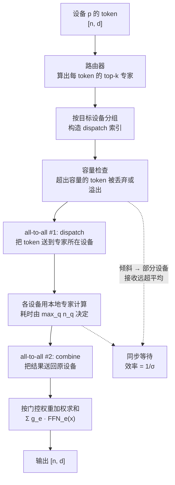
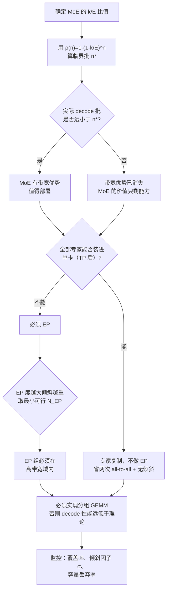

# MoE 推理与专家并行

> 位置：[InferenceAtlas](../../INDEX.md) > [模块 06](README.md) > 当前文档
> 信息截至：2026-07-29 ｜ 最后核验：2026-07-29 ｜ 内容版本：v0.1
> 时效性等级：中
> 相关主题：[张量并行推理](02_tensor_parallel_inference.md)｜`06_moe_routing_all_to_all_and_load_balancing.md`｜[Roofline 与性能建模](../01_foundations_and_metrics/04_roofline_and_performance_modeling.md)

## 本章导读

混合专家（MoE）模型在训练视角下是一个诱人的交易：**用更多的参数换更强的能力，而每个 token 的计算量几乎不变**。但在推理视角下，这个交易的账要重新算——因为**decode 阶段的瓶颈是内存带宽，而不是算力**。

这就是 MoE 推理的核心矛盾：

- **算力**上，MoE 只激活一小部分专家，FLOPs 与同等激活参数量的 dense 模型相当；
- **显存**上，MoE 要装下**全部**专家的权重，总参数量可能是激活量的十倍以上；
- **带宽**上，情况取决于批大小——小批时只需读取被激活的专家（省带宽），大批时几乎所有专家都会被至少一个 token 激活（读取量接近全部权重）。

**第三条是 MoE 推理最容易被误判的一点**。"MoE 只激活 1/8 的参数所以快 8 倍"这个说法只在极小批下近似成立；批一大，被激活的专家集合迅速覆盖全部专家，带宽优势消失，而显存代价却始终存在。

本章建立 MoE 推理的定量框架：专家激活的覆盖率模型、专家并行（EP）的通信结构、以及 EP × TP 的组合。路由倾斜与负载均衡是一个足够大的话题，单独放在 `06_moe_routing_all_to_all_and_load_balancing.md`。

## 学习目标

读完本章后，读者应能够：

1. 写出 MoE 层的前向计算，并区分总参数量、激活参数量与实际读取量三个不同的量；
2. 推导批大小与"被激活专家覆盖率"的关系，并说明带宽优势何时消失；
3. 描述专家并行（EP）的 dispatch/combine 两次 all-to-all 结构与通信量；
4. 分析 EP 与 TP 的组合方式及其显存与通信取舍；
5. 判断某个部署应该用 EP、还是把专家复制到每卡（不做 EP）。

## 核心结论

- **MoE 的三个参数量必须分开谈**：总参数（决定显存）、激活参数（决定 FLOPs）、**实际读取参数**（决定 decode 带宽）。第三个随批大小变化，是最容易被误判的。
- **批一大，专家覆盖率迅速趋于 1**，MoE 的带宽优势消失而显存代价保持——**MoE 在大批 decode 下相对 dense 没有带宽优势**。
- **EP 的通信是两次 all-to-all**（dispatch + combine），通信量正比于 $B \cdot k \cdot d$，其中 $k$ 是每 token 激活的专家数。
- **all-to-all 的代价对倾斜极其敏感**：它是同步操作，最慢的一对收发决定整体，因此负载不均直接转化为时延。
- **专家复制（不做 EP）在专家不太大时常常更优**：省掉了两次 all-to-all，代价是每卡都要装下全部专家。

## 1. 问题定义、系统边界与工作负载

### 1.1 MoE 层的结构

标准 dense 层的 FFN 被替换为：一个路由器 + $E$ 个专家（每个专家是一个独立的 FFN）。

$$
\text{MoE}(x) = \sum_{e \in \mathcal{T}_k(x)} g_e(x) \cdot \text{FFN}_e(x)
$$

- $\mathcal{T}_k(x)$：路由器为 token $x$ 选出的 top-$k$ 专家集合；
- $g_e(x)$：门控权重（通常是路由 logits 的 softmax，仅在 top-$k$ 上归一化）；
- $E$：专家总数；$k$：每 token 激活的专家数（常见 $k=1$ 或 $2$）。

**路由器**：一个小的线性层 $x \mapsto \text{softmax}(x W_r) \in \mathbb{R}^E$，参数量 $d \times E$，可忽略。

**共享专家**：部分设计中有一个所有 token 都会经过的"共享专家"，它相当于一个 dense 分支。它的存在改变了激活参数量的计算，需要单独计入。

### 1.2 三个参数量

这是 MoE 推理讨论中最容易混淆的地方。

| 量 | 定义 | 决定什么 |
|---|---|---|
| **总参数量 $P_{\text{total}}$** | 全部专家 + 非 MoE 部分 | **显存占用** |
| **激活参数量 $P_{\text{act}}$** | 单个 token 经过的参数 | **单 token FLOPs** |
| **实际读取量 $P_{\text{read}}(B)$** | 一个批中被至少一个 token 激活的专家参数之和 | **decode 的带宽需求** |

对一个 MoE 层：

$$
P_{\text{total}}^{\text{layer}} = E \cdot P_{\text{expert}}, \qquad P_{\text{act}}^{\text{layer}} = k \cdot P_{\text{expert}}
$$

$$
P_{\text{act}} / P_{\text{total}} = k / E
$$

- $k=2$、$E=64$ 时，激活比例为 1/32。这是 MoE 宣传中常见的"稀疏度"。

**但 $P_{\text{read}}(B)$ 是第三个量，它介于两者之间且随 $B$ 变化**——这正是 2.1 要推导的。

### 1.3 系统边界与工作负载

| 阶段 | MoE 的画像 |
|---|---|
| prefill | 大量 token 同时路由，专家覆盖率接近 1；计算受限，MoE 的 FLOPs 优势体现 |
| decode（小批） | 少量 token，覆盖率低；带宽受限，MoE 有带宽优势 |
| decode（大批） | 覆盖率接近 1；带宽需求接近 dense 全量 |

**这张表已经把本章的核心结论浓缩了**：MoE 的收益在 prefill（省算力）与小批 decode（省带宽），在大批 decode 下收益消失。

## 2. 原理、数学与性能模型

### 2.1 专家覆盖率模型

设一个批中有 $n$ 个 token 参与路由（decode 时 $n = B$，prefill 时 $n = B \cdot S$），每个 token 独立均匀地选 $k$ 个专家（理想均衡假设）。

某个特定专家**不被任何 token 选中**的概率：

$$
\Pr[\text{专家 } e \text{ 未被选中}] = \left(1 - \frac{k}{E}\right)^{n}
$$

因此**期望覆盖率**（被激活的专家比例）：

$$
\rho(n) = 1 - \left(1 - \frac{k}{E}\right)^{n}
$$

- $n$：批中的 token 数；$k$：每 token 激活专家数；$E$：专家总数。
- **直觉**：每多一个 token，就多一次"点名"的机会；token 足够多时几乎所有专家都会被点到。
- **假设**：路由均匀且独立。**真实路由既不均匀也不独立**（相似 token 倾向选同样的专家），因此实际覆盖率**低于**此式——这是一个乐观还是悲观的偏差要看用途：对"覆盖率会很快到 1"这个结论而言，实际情况会稍好一些（覆盖率上升略慢）。
- **局限**：忽略了容量限制与负载均衡机制的影响。

**实际读取量**：

$$
P_{\text{read}}(n) \approx \rho(n) \cdot P_{\text{total}}^{\text{MoE}} + P_{\text{dense}}
$$

**数值表**（按 $\rho(n) = 1-(1-k/E)^n$ 计算的**模型输出**，非实测）：

| $n \backslash (k,E)$ | (1, 8) | (2, 8) | (2, 64) | (8, 256) |
|---:|---:|---:|---:|---:|
| 1 | 12.5% | 25.0% | 3.1% | 3.1% |
| 4 | 41.4% | 68.4% | 11.9% | 11.9% |
| 8 | 65.6% | 90.0% | 22.4% | 22.4% |
| 16 | 88.2% | 99.0% | 39.8% | 39.8% |
| 32 | 98.6% | 100.0% | 63.8% | 63.8% |
| 64 | 100.0% | 100.0% | 86.9% | 86.9% |
| 128 | 100.0% | 100.0% | 98.3% | 98.3% |
| 256 | 100.0% | 100.0% | 100.0% | 100.0% |

**从表中可读出的三条结论**：

1. **覆盖率上升得非常快**。$(k,E)=(2,8)$ 时，批到 16 就已覆盖 99%——**这类 MoE 在任何实用批大小下都没有带宽优势**。
2. **专家越多、$k/E$ 越小，优势保持得越久**。$(2,64)$ 要到批 128 才接近满覆盖；$(8,256)$ 的 $k/E$ 相同，曲线也相同。
3. **决定曲线形状的只有 $k/E$ 这一个比值**，与 $E$ 的绝对值无关。这是一个有用的简化：**比较不同 MoE 的带宽画像，只需看 $k/E$**。

**临界批大小**：令 $\rho(n^*) = 0.9$：

$$
n^* = \frac{\ln 0.1}{\ln(1 - k/E)} \approx \frac{2.303}{k/E} \quad (\text{当 } k/E \ll 1)
$$

- $k/E = 1/32$：精确值 $n^* \approx 73$（近似式给出 74）；
- $k/E = 1/8$：精确值 $n^* \approx 17$；
- $k/E = 1/4$：精确值 $n^* \approx 8$。
- **含义**：批超过 $n^*$ 后，MoE 的带宽读取量已达 dense 全量的 90%，**带宽优势基本消失**。

### 2.2 decode 单步时间

$$
T_{\text{decode}}(B) \approx \max\left( \frac{P_{\text{read}}(B) \cdot b_w}{\text{BW}}, \; \frac{2 \cdot P_{\text{act}} \cdot B}{\text{FLOPS}} \right) + T_{\text{comm}}
$$

**与 dense 的对比**（同等 $P_{\text{act}}$）：

| 批 | MoE 带宽项 | dense 带宽项 | MoE 优势 |
|---|---|---|---|
| 极小 | $\approx P_{\text{act}} b_w$ | $\approx P_{\text{act}} b_w$ | 无（两者相同） |
| 小 | $\rho \cdot P_{\text{total}} b_w$，$\rho$ 小 | $P_{\text{act}} b_w$ | **可能更差**（见下） |
| 大 | $\approx P_{\text{total}} b_w$ | $P_{\text{act}} b_w$ | **明显更差** |

**一个必须澄清的误区**：MoE 常被拿来与"总参数量相同的 dense 模型"对比，这时 MoE 当然更快。但正确的对比对象是**激活参数量相同的 dense 模型**——因为那才是能力大致相当（在推理成本意义上）的比较基准。在这个对比下：

$$
\frac{P_{\text{read}}^{\text{MoE}}(B)}{P_{\text{read}}^{\text{dense}}} = \frac{\rho(B) \cdot E}{k} \ge 1
$$

- $\rho(B) \ge k/E$ 恒成立（$B \ge 1$ 时），因此这个比值**恒不小于 1**；
- $B = 1$ 且 $k$ 个专家互不重复时，比值恰为 1；
- $B$ 大时比值趋于 $E/k$（可能是几十倍）。

> **结论**：**相对同等激活参数量的 dense 模型，MoE 在 decode 阶段的带宽需求恒不更低，且随批增大而显著更高。**

**那 MoE 的价值在哪？** 在于**同等推理成本下的模型能力**。MoE 用更多的总参数（更多显存）换取更强的表达能力，而 FLOPs 保持不变。这是一个**显存换能力**的交易，不是"更快"的交易。把 MoE 理解为"加速手段"是根本性的误解。

### 2.3 专家并行的通信结构

当 $E \cdot P_{\text{expert}}$ 装不下单卡时，把专家分布到 $N_{\text{EP}}$ 个设备，每设备持有 $E/N_{\text{EP}}$ 个专家。

**问题**：token 在设备 $p$ 上，但它选中的专家可能在设备 $q$ 上。因此需要：

1. **dispatch**：把每个 token 送到它选中的专家所在的设备；
2. 各设备用本地专家计算；
3. **combine**：把结果送回 token 原来所在的设备。

这两步都是 **all-to-all** 通信。

**通信量**：

$$
D_{\text{dispatch}} = n \cdot k \cdot d \cdot b_a, \qquad D_{\text{combine}} = n \cdot k \cdot d \cdot b_a
$$

- $n$：本设备的 token 数；$k$：每 token 的专家数；$d$：隐藏维度。
- 每个 token 要被发送 $k$ 份（每个选中的专家一份），结果也要回来 $k$ 份。
- **总计每 MoE 层 $2nkd \cdot b_a$ 字节**。

**与 TP 的对比**：

| 方式 | 每 MoE 层通信量 | 通信类型 |
|---|---|---|
| TP（FFN 部分） | $n \cdot d \cdot b_a$（一次 all-reduce） | all-reduce |
| EP | $2 n k d \cdot b_a$（两次 all-to-all） | all-to-all |

- **EP 的通信量是 TP 的约 $2k$ 倍**。$k=2$ 时是 4 倍。
- 但要注意 all-to-all 与 all-reduce 的算法效率不同：ring all-reduce 每卡收发约 $2D$，all-to-all 每卡收发约 $\frac{N-1}{N} D$。按每卡实际收发量算，差距略小于 $2k$ 倍。

### 2.4 all-to-all 对倾斜的敏感性

**这是 EP 最重要的性能特性**。all-to-all 是一个同步的集合操作：所有设备必须完成收发才能继续。

设设备 $q$ 接收到 $n_q$ 个 token（来自所有设备的 dispatch）。**整体耗时由 $\max_q n_q$ 决定**：

$$
T_{\text{a2a}} \approx \alpha + \frac{\max_q n_q \cdot d \cdot b_a}{\text{BW}_{\text{link}}}, \qquad T_{\text{expert-compute}} \approx \frac{2 \max_q n_q \cdot P_{\text{expert}}}{\text{FLOPS}}
$$

**倾斜因子**：

$$
\sigma = \frac{\max_q n_q}{\overline{n_q}} = \frac{\max_q n_q}{n k / N_{\text{EP}}}
$$

- $\sigma = 1$ 表示完全均衡；$\sigma > 1$ 表示有热专家。
- **效率上限 $= 1/\sigma$**。

**为什么倾斜在推理中比训练更严重**：训练有辅助的负载均衡损失（load balancing loss）来鼓励均匀路由，但那只是**统计意义上的均匀**——在一个大批上均匀，不保证在推理的小批上均匀。**批越小，倾斜的方差越大**。

$$
\text{相对标准差} \propto \frac{1}{\sqrt{n k / E}}
$$

- **直觉**：每个专家收到的 token 数近似泊松分布，均值 $\lambda = nk/E$，标准差 $\sqrt{\lambda}$，相对标准差 $1/\sqrt{\lambda}$。
- **推论**：**decode 的小批下，倾斜的相对波动很大**。$\lambda = 4$ 时相对标准差 50%，$\lambda = 100$ 时才降到 10%。

倾斜的治理是一个大话题，详见 `06_moe_routing_all_to_all_and_load_balancing.md`。

### 2.5 EP × TP 的组合

两者可以组合：先把专家分到 $N_{\text{EP}}$ 组，每组内再用 $N_{\text{TP}}$ 切分单个专家的权重。

$$
N = N_{\text{EP}} \times N_{\text{TP}} \times N_{\text{PP}} \times N_{\text{replica}}
$$

**每卡的 MoE 权重**：

$$
M_{\text{MoE}}^{\text{per-device}} = \frac{E \cdot P_{\text{expert}} \cdot b_w}{N_{\text{EP}} \cdot N_{\text{TP}}}
$$

**取舍**：

| 增大 | 显存 | 通信 | 倾斜敏感度 |
|---|---|---|---|
| $N_{\text{EP}}$ | ↓ | all-to-all 参与方增多 | **↑（专家更少，更易倾斜）** |
| $N_{\text{TP}}$ | ↓ | 每专家多一次 all-reduce | 不变 |

**关键观察**：**增大 $N_{\text{EP}}$ 会加剧倾斜**。因为每设备持有的专家数 $E/N_{\text{EP}}$ 变少，单个热专家对该设备负载的影响变大。极端情况 $N_{\text{EP}} = E$（每设备一个专家）时，倾斜完全暴露。

**因此存在一个 EP 度的实用上限**，由可接受的倾斜决定，而非仅由显存决定。

**非 MoE 部分怎么办**：注意力块不受 EP 影响，它按 TP 切分。因此一个 MoE 模型的完整配置是：

- 注意力块：TP（$N_{\text{TP}}$）；
- MoE 块：EP × TP（$N_{\text{EP}} \times N_{\text{TP}}$）。

这意味着 **MoE 块的并行度可以高于注意力块**，两者在同一组设备上但切分方式不同。实现上需要在 MoE 层前后做一次数据重排。

### 2.6 不做 EP：专家复制

一个常被低估的选项：**每张卡都持有全部专家**，不做 EP，只做 TP。

| 维度 | EP | 专家复制（仅 TP） |
|---|---|---|
| 每卡 MoE 权重 | $\frac{E P_{\text{expert}}}{N_{\text{EP}} N_{\text{TP}}}$ | $\frac{E P_{\text{expert}}}{N_{\text{TP}}}$ |
| 通信 | 2 次 all-to-all | 1 次 all-reduce |
| 倾斜敏感度 | 高 | **无**（每卡处理自己的 token，各自选本地专家） |
| 实现复杂度 | 高 | 低 |
| 适用 | 专家总量大，装不下 | 专家总量适中 |

**专家复制的巨大优势是完全消除了倾斜问题**：每张卡处理自己那部分 token，需要哪个专家就用本地的哪个，没有跨设备的 token 搬运，也就没有 all-to-all 的同步等待。

**代价**：每卡必须装下 $E \cdot P_{\text{expert}} / N_{\text{TP}}$ 的权重。当专家总量不太大（例如 $E$ 较小或每个专家较小）时，这是可以承受的。

> **判据**：**如果 $\frac{E \cdot P_{\text{expert}} \cdot b_w}{N_{\text{TP}}}$ 能装进单卡（留足 KV 空间），就不要做 EP**。省掉的两次 all-to-all 与倾斜问题，价值通常超过显存的节省。

## 3. 实现机制与系统设计

### 3.1 EP 的完整数据流



**图解读**：
1. **本图展示什么**：EP 的完整执行链路——路由、容量检查、dispatch、本地专家计算、combine、加权合并。
2. **核心瓶颈**：瓶颈是"各设备用本地专家计算"这一步的 $\max_q n_q$。两次 all-to-all 都是同步屏障，所有设备必须等最忙的那个完成。倾斜因子 $\sigma$ 直接给出效率上限 $1/\sigma$。
3. **图中的 trade-off**：容量检查（第四步）是一个真实的取舍——设容量上限可以防止某个设备被打爆，但超出容量的 token 会被丢弃（该 token 跳过这个专家），**这直接影响输出质量**。容量设得松则倾斜暴露，设得紧则质量受损。
4. **面试如何引用**：被问"MoE 推理的难点"时，用这张图指出两个：**两次 all-to-all 的通信开销**与**倾斜导致的同步等待**，并强调容量上限是一个质量与性能的显式取舍点。

### 3.2 dispatch 的实现

```
function moe_forward_ep(x, router, local_experts, ep_group):
    # x: [n, d]，本设备的 token
    n, d = x.shape

    # --- 1. 路由 ---
    logits = router(x)                      # [n, E]
    topk_val, topk_idx = topk(logits, k)    # [n, k]
    gates = softmax(topk_val, dim=-1)       # [n, k]，仅在 top-k 上归一化

    # --- 2. 计算每个 (token, 专家) 对的目标设备 ---
    experts_per_device = E // ep_size
    target_device = topk_idx // experts_per_device      # [n, k]

    # --- 3. 容量检查 ---
    # capacity = ceil(capacity_factor * n * k / E)  每专家可接收的上限
    counts = bincount(topk_idx.flatten(), minlength=E)
    overflow = counts > capacity
    if any(overflow):
        # 丢弃超出部分（按到达顺序或按门控值排序保留高分的）
        mask = build_capacity_mask(topk_idx, capacity)
        gates = gates * mask
        record_metric("moe_dropped_tokens", (~mask).sum())   # 必须监控

    # --- 4. all-to-all dispatch ---
    send_buf, send_counts = pack_by_device(x, target_device, gates)
    recv_buf, recv_counts = all_to_all(send_buf, send_counts, ep_group)

    # --- 5. 本地专家计算 ---
    out_local = empty_like(recv_buf)
    for local_e in range(experts_per_device):
        idx = (recv_expert_id == local_e)
        out_local[idx] = local_experts[local_e](recv_buf[idx])

    # --- 6. all-to-all combine ---
    back_buf = all_to_all(out_local, recv_counts, ep_group)   # 反向的 counts

    # --- 7. 按门控加权求和 ---
    y = weighted_scatter_add(back_buf, gates, n, d)
    return y
```

**四个实现要点**：

1. **`send_counts` 是不规则的**（每个目标设备的 token 数不同），因此必须用变长 all-to-all（all-to-all-v）。这比等长版本复杂，且需要先交换 counts 才能分配接收缓冲。**这次 counts 交换本身是一次小的 all-to-all，增加了一次同步**。

2. **容量丢弃必须被监控**。丢弃的 token 会跳过该专家（门控置零），这是一个**静默的质量损失**。生产中必须有 `moe_dropped_tokens` 指标与告警。

3. **本地专家计算是一个循环**，每个专家处理不同数量的 token。朴素实现会启动 $E/N_{\text{EP}}$ 个小 GEMM，效率低。优化做法是用**分组 GEMM**（grouped GEMM）一次性处理所有专家的不同形状矩阵乘。

4. **combine 的 counts 是 dispatch 的转置**——不需要重新交换，可以直接复用。

### 3.3 分组 GEMM 的重要性

MoE 的本地计算是若干个形状不同的矩阵乘：

$$
\text{专家 } e: \quad [n_e, d] \times [d, d_{ff}] \to [n_e, d_{ff}]
$$

其中 $n_e$ 各不相同且很小（decode 时可能只有个位数）。

**朴素实现的问题**：$E/N_{\text{EP}}$ 次独立的小 GEMM，每次都有内核启动开销，且每次都要重新读取该专家的权重。GPU 在这种形状下利用率极低。

**分组 GEMM**：一个内核处理所有专家，内部按 token 分段。收益：
- 一次内核启动而非 $E/N_{\text{EP}}$ 次；
- 更好的并行度与 SM 利用率。

**这在 decode 阶段尤其关键**：decode 的 $n_e$ 极小，朴素实现下内核启动开销可能超过计算本身。**没有分组 GEMM 的 MoE decode 实现，性能会远低于理论值**。

**与 CUDA Graph 的配合困难**：$n_e$ 每步都在变（路由结果不同），因此形状不固定，难以被 CUDA Graph 捕获。变通做法是**按容量 padding 到固定形状**——用一点浪费的计算换取形状稳定。这是 MoE 推理中一个典型的取舍。

### 3.4 专家的放置

| 策略 | 做法 | 特点 |
|---|---|---|
| 均匀分配 | 专家 $e$ → 设备 $e \bmod N_{\text{EP}}$ | 简单，但热专家可能聚集 |
| 按历史负载分配 | 热专家分散到不同设备 | 需要负载统计；路由分布会漂移 |
| 热专家复制 | 热专家在多设备各存一份 | 显存换均衡；需要路由感知 |
| 分层放置 | 高频专家放高带宽设备 | 需要异构硬件 |

**"按历史负载分配"的可行性**：路由分布在同一类流量上是相对稳定的，因此按历史统计重排专家有实际收益。但它需要一次权重搬移（重排），不能太频繁。实践上可以在流量特征明显变化时（如换了业务）做一次重排。

**热专家复制**是最直接的缓解手段：把最热的若干专家在多个设备各存一份，路由时随机选一个副本。这把一个热点分散成多个，代价是显存。详见 `06_moe_routing_all_to_all_and_load_balancing.md`。

### 3.5 与其他技术的交互

| 技术 | 交互 |
|---|---|
| TP | 可组合（2.5），注意力与 MoE 块的并行度可不同 |
| PP | 可组合，按层切分，MoE 层与 dense 层混合 |
| CP | 可组合，MoE 是逐 token 的，序列切分不影响路由 |
| 量化 | 专家权重可量化；不同专家可用不同精度（冷专家更激进） |
| CUDA Graph | 需要形状固定，即需要容量 padding（3.3） |
| 投机解码 | draft 模型通常用 dense；树形候选增大 $n$，提高覆盖率 |
| 前缀缓存 | 正交，MoE 不影响 KV |

**"冷专家更激进量化"是一个有价值的想法**：路由分布长尾，少数专家承担大部分流量。对低频专家用更低的比特数，可以显著降低总显存而对质量影响小。这需要按实测的专家使用频率来决定量化配置，属于部署期的优化。

**"投机解码提高覆盖率"值得注意**：树形投机一次验证 $N_{\text{nodes}}$ 个 token，相当于把 $n$ 放大了 $N_{\text{nodes}}$ 倍。按 2.1 的模型，这会提高专家覆盖率，从而**削弱 MoE 在小批下的带宽优势**。这是一个 MoE 与投机解码组合时需要重新评估的点。

## 4. 性能、成本、能耗与可靠性 trade-off

### 4.1 MoE vs dense 的完整对照

对比基准：**激活参数量相同**的两个模型。

| 维度 | MoE | dense | 说明 |
|---|---|---|---|
| 单 token FLOPs | 相同 | 相同 | 按定义 |
| 显存（权重） | $E/k$ 倍 | 1 | MoE 的主要代价 |
| decode 带宽（小批） | $\rho(B) E/k$ 倍 | 1 | 见 2.2，恒 ≥ 1 |
| decode 带宽（大批） | $\approx E/k$ 倍 | 1 | 优势完全消失 |
| prefill | 相近 | 相近 | 都计算受限 |
| 通信 | +2 次 all-to-all/层 | — | EP 的代价 |
| 模型能力 | **更强** | 基准 | MoE 的价值所在 |
| 实现复杂度 | 高 | 低 | 路由、容量、倾斜、分组 GEMM |

**这张表的正确读法**：MoE 用**显存、带宽、通信与复杂度**换取**同等 FLOPs 下更强的能力**。它不是加速技术。

### 4.2 何时 MoE 在推理上划算

| 情形 | MoE 是否划算 |
|---|---|
| 显存充裕、追求能力 | **划算** |
| 计算受限（prefill 为主） | **划算**（FLOPs 优势体现） |
| 小批、时延敏感 | 中性偏正（覆盖率低时有带宽优势） |
| 大批、吞吐优先 | **不划算**（带宽劣势明显，通信开销叠加） |
| 显存紧张 | **不划算** |
| KV 是显存瓶颈 | **不划算**（专家权重挤占 KV 空间） |

**"KV 是显存瓶颈"这一行值得强调**：MoE 的权重占用大量显存，直接压缩了 KV cache 的可用空间，从而降低并发数。在长上下文或高并发场景，这个二阶效应可能比带宽劣势更严重。

### 4.3 成本

$$
c_{\text{token}}^{\text{MoE}} = \frac{n_{\text{gpu}} \cdot c_{\text{gpu-hour}}}{3600 \cdot \text{throughput}}
$$

MoE 需要更多的卡来装下权重（$n_{\text{gpu}}$ 更大），而吞吐在大批下不优于 dense。**因此按每 token 成本算，MoE 相对同等激活量的 dense 更贵**。

**但这个比较是不完整的**：MoE 的能力更强，正确的比较应该是"达到同等质量所需的成本"。若 MoE 用 $2\times$ 的成本达到了 dense 需要 $4\times$ 激活参数才能达到的质量，MoE 仍然划算。**这个判断需要质量评估，不能只看系统指标**。

### 4.4 可靠性

| 风险 | 后果 | 缓解 |
|---|---|---|
| 容量丢弃未监控 | 静默质量损失（3.2） | `moe_dropped_tokens` 指标 + 告警 |
| 倾斜导致时延尖峰 | P99 恶化 | 倾斜因子监控；见下一章 |
| 未用分组 GEMM | decode 性能远低于理论（3.3） | 检查内核启动次数 |
| 路由分布漂移 | 专家放置失效 | 定期重估负载分布 |
| all-to-all-v 的 counts 交换失败 | 挂起 | 超时与重试；校验 counts 一致性 |
| 专家权重加载不一致 | 静默数值错误 | 加载后校验各设备的专家 id 与权重哈希 |
| EP 组跨节点 | all-to-all 带宽不足 | 拓扑校验 |

**容量丢弃是 MoE 特有的、最容易被忽略的质量风险**。它不报错、不崩溃，只是让某些 token 少经过一个专家。在容量因子设置偏紧时，丢弃比例可能达到百分之几——足以影响质量但不足以引起注意。

## 5. benchmark、真实案例或公开部署案例

当前环境的网络出口策略阻断了 `arxiv.org`、`huggingface.co` 等一手来源（详见 [AGENTS.md 第 11 节](../../AGENTS.md)）。因此本节**不引用任何具体 MoE 模型的专家数、激活专家数、参数量或实测吞吐**。第 2.1 节的覆盖率表是按该节公式计算的**模型输出**，其 $(k, E)$ 组合是为说明规律而选的示例值，不对应任何特定模型。

| 陈述 | 披露标签 | 状态 |
|---|---|---|
| 主流推理框架支持专家并行 | `开源代码/配置披露` | `待核实` |
| 分组 GEMM 已被用于 MoE 推理实现 | `开源代码/配置披露` | `待核实` |
| 部分 MoE 设计包含共享专家 | `技术文档披露` | `待核实` |
| 具体模型的 $E$、$k$、参数量 | — | **不引用**（无一手来源） |
| MoE 与 dense 的质量对比数据 | — | **不引用**（无一手来源） |

**可自行复现的实验**（`独立可复现实验`）：

1. **覆盖率实测**：在真实流量上统计不同批大小下被激活的专家比例，与 2.1 的 $\rho(n)$ 曲线对比。实测通常低于理论（路由不独立），差距本身是有信息量的。
2. **临界批大小定位**：找到覆盖率达 90% 的批大小 $n^*$，与 $2.303/(k/E)$ 的估计对比。
3. **带宽读取量测量**：直接测量 decode 单步的 HBM 读取字节数（用性能计数器），与 $\rho(B) P_{\text{total}} b_w$ 对比。
4. **倾斜因子测量**：统计各设备接收的 token 数，计算 $\sigma = \max/\text{平均}$。这是 EP 效率的直接上限。
5. **容量丢弃率**：在不同容量因子下测量丢弃比例与质量指标。定位质量-性能的平衡点。
6. **分组 GEMM 收益**：开关分组 GEMM，测 decode 单步耗时。量化内核启动开销。
7. **EP vs 专家复制**：在同等卡数下比较两种配置的吞吐与时延。验证 2.6 的判据。
8. **EP 度与倾斜的关系**：扫描 $N_{\text{EP}}$，测量 $\sigma$ 的变化。验证 2.5 的"EP 度越大倾斜越严重"。
9. **MoE vs dense 的公平对比**：与激活参数量相同的 dense 模型比较 decode 带宽与吞吐。验证 2.2 的比值恒 ≥ 1。

> 实验方法论要求见 [如何读推理 benchmark](../00_start_here/03_how_to_read_inference_benchmarks.md)。

## 6. 设计决策框架



**图解读**：
1. **本图展示什么**：MoE 部署的决策路径，从 $k/E$ 算出临界批开始，判断带宽优势是否存在，再决定 EP 还是专家复制。
2. **核心瓶颈**：瓶颈是"全部专家能否装进单卡"这个分叉。能装下就不做 EP——这条路径省掉了两次 all-to-all 与全部倾斜问题，是被严重低估的选项。
3. **图中的 trade-off**：EP 分支用"通信与倾斜"换"显存"；专家复制分支用"显存"换"简单与稳定"。当专家总量不算太大时，后者几乎总是更好。
4. **面试如何引用**：被问"MoE 怎么部署"时，先用 $\rho(n)$ 说明带宽优势的适用范围，再指出"能不做 EP 就不做 EP"——这两点都比直接讲 all-to-all 机制更能体现判断力。

### 决策清单

| 问题 | 若答案为"是" | 若答案为"否" |
|---|---|---|
| decode 批远小于 $n^* = 2.303 E/k$？ | 有带宽优势 | 优势已消失，只剩能力价值 |
| 专家总量（TP 后）能装进单卡？ | **不要做 EP** | 必须 EP |
| KV 是显存瓶颈？ | MoE 可能不划算 | 可考虑 |
| 已实现分组 GEMM？ | decode 性能可接受 | 必须实现 |
| EP 度取到最小可行值？ | 倾斜可控 | 降低 $N_{\text{EP}}$ |
| 已监控容量丢弃率？ | — | 补上，静默质量风险 |
| 已监控倾斜因子 $\sigma$？ | — | 补上，它是效率上限 |
| 同时启用投机解码？ | 重估覆盖率（3.5） | — |

## 7. 常见失败模式与排查路径

| 症状 | 可能原因 | 排查步骤 |
|---|---|---|
| MoE 没有比 dense 快 | **预期行为**（2.2） | 确认对比基准是激活参数量相同的 dense |
| 大批下 MoE 明显更慢 | 覆盖率接近 1 + all-to-all 开销 | 测覆盖率；对比 $\rho(B) E/k$ |
| decode 性能远低于理论 | 未用分组 GEMM（3.3） | 检查每步的内核启动次数 |
| 时延方差大 | 倾斜（2.4） | 统计 $\sigma$ 随时间的分布 |
| 质量比预期差 | 容量丢弃（3.2） | 查 `moe_dropped_tokens`；放宽容量因子 |
| 增大 EP 度后更慢 | 倾斜加剧（2.5） | 测 $\sigma$ 与 $N_{\text{EP}}$ 的关系；回退 |
| CUDA Graph 无法捕获 | 形状随路由变化（3.3） | 按容量 padding 到固定形状 |
| 并发数远低于同规模 dense | 专家权重挤占 KV 空间（4.2） | 核算显存分配；考虑专家量化 |
| all-to-all 挂起 | counts 交换不一致 | 校验各设备的 send/recv counts 之和 |
| 某设备持续过载 | 热专家聚集（3.4） | 统计各专家负载；重排或复制热专家 |
| 启用投机后 MoE 变慢 | 覆盖率上升（3.5） | 测投机开关下的覆盖率差异 |

**排查原则**：MoE 的问题分三类——**认知类**（拿错对比基准，把 MoE 当加速手段）、**实现类**（分组 GEMM、容量、形状）、**分布类**（倾斜、热专家）。第一类最常见，先确认对比基准再谈优化。

## 8. 关联面试主题

1. **MoE 的三个参数量及其分别决定什么**——见本章 1.2，这是区分深浅的第一个问题。
2. **专家覆盖率模型与临界批大小**——见本章 2.1，$\rho(n) = 1-(1-k/E)^n$。
3. **为什么 MoE 相对同等激活量的 dense 在 decode 上带宽恒不更低**——见本章 2.2，$\rho(B)E/k \ge 1$。
4. **MoE 是"显存换能力"而非"加速手段"**——见本章 2.2 与 4.1。
5. **EP 的两次 all-to-all 结构与通信量**——见本章 2.3。
6. **all-to-all 为什么对倾斜极其敏感**——见本章 2.4，同步操作 + $\max_q n_q$。
7. **为什么 decode 小批下倾斜的相对波动更大**——见本章 2.4，泊松的 $1/\sqrt{\lambda}$。
8. **增大 EP 度为什么会加剧倾斜**——见本章 2.5。
9. **什么时候不应该做 EP**——见本章 2.6，专家复制的优势。
10. **分组 GEMM 为什么对 MoE decode 是必需的**——见本章 3.3。
11. **容量丢弃为什么是静默的质量风险**——见本章 3.2 与 4.4。
12. **投机解码为什么会削弱 MoE 的带宽优势**——见本章 3.5。

## 9. 小结

MoE 推理最重要的一件事是**把三个参数量分开**：总参数量决定显存，激活参数量决定 FLOPs，而**实际读取量决定 decode 带宽**。第三个量随批大小变化，遵循覆盖率模型 $\rho(n) = 1 - (1-k/E)^n$，而这条曲线上升得比直觉快得多——$k/E = 1/4$ 时批到 16 就已接近满覆盖。

由此得出本章最重要的结论：**相对同等激活参数量的 dense 模型，MoE 在 decode 阶段的带宽需求恒不更低**（比值 $\rho(B) \cdot E/k \ge 1$），且随批增大趋于 $E/k$ 倍。**MoE 不是加速技术，而是"用显存换能力"的技术**。把它当作加速手段，会在容量规划与选型对比时得出错误结论。

在并行方式上，专家并行（EP）引入两次 all-to-all，通信量约为 TP 的 $2k$ 倍。更麻烦的是 all-to-all 是同步操作，耗时由接收最多 token 的设备决定，因此**倾斜直接转化为效率损失，上限是 $1/\sigma$**。而 decode 的小批使倾斜的相对波动很大（泊松的 $1/\sqrt{\lambda}$），这是 MoE 推理时延方差大的根源。

一个被严重低估的选项是**不做 EP**：每卡持有全部专家，只做 TP。这完全消除了 all-to-all 与倾斜问题，代价只是显存。判据很简单——**如果 $E \cdot P_{\text{expert}} \cdot b_w / N_{\text{TP}}$ 能装进单卡并留足 KV 空间，就不要做 EP**。

实现上有一个必需项与一个必需的监控项：

- **分组 GEMM 是必需的**。decode 阶段每个专家只处理个位数的 token，朴素实现下 $E/N_{\text{EP}}$ 次小 GEMM 的内核启动开销可能超过计算本身。
- **容量丢弃必须被监控**。超出容量的 token 会跳过该专家，这是一个不报错、不崩溃的静默质量损失，容量因子偏紧时丢弃率可能达到百分之几。

最后一个二阶效应值得记住：MoE 的专家权重占用大量显存，**直接挤压 KV cache 的可用空间**，降低并发数。在长上下文或高并发场景，这个影响可能比带宽劣势更严重。

## 关键术语

| 中文术语 | 英文 | 定义 | 单位/口径 | 关联文档 |
|---|---|---|---|---|
| 混合专家 | mixture of experts (MoE) | 用路由器为每 token 选择部分专家的稀疏层 | — | 本章 1.1 |
| 专家 | expert | MoE 层中的一个独立 FFN | — | 本章 1.1 |
| 激活专家数 | active experts (k) | 每个 token 经过的专家数量 | 计数 | 本章 1.1 |
| 总参数量 | total parameters | 全部专家 + 非 MoE 部分的参数 | 计数 | 本章 1.2 |
| 激活参数量 | active parameters | 单 token 经过的参数量 | 计数 | 本章 1.2 |
| 实际读取量 | read parameters | 一批中被至少一个 token 激活的参数之和 | 计数 | 本章 1.2 |
| 专家覆盖率 | expert coverage | 一批中被激活的专家比例 | 比例 | 本章 2.1 |
| 专家并行 | expert parallel (EP) | 把专家分布到多设备 | 并行度为计数 | 本章 2.3 |
| dispatch | dispatch | 把 token 送到目标专家所在设备的 all-to-all | — | 本章 2.3 |
| combine | combine | 把专家输出送回原设备的 all-to-all | — | 本章 2.3 |
| 倾斜因子 | skew factor | 最大设备负载与平均负载之比 | 无量纲，≥1 | 本章 2.4 |
| 容量因子 | capacity factor | 每专家可接收 token 数相对平均值的倍数 | 无量纲 | 本章 3.2 |
| 分组 GEMM | grouped GEMM | 一个内核处理多个不同形状矩阵乘 | — | 本章 3.3 |

## 延伸阅读

- `06_moe_routing_all_to_all_and_load_balancing.md` — 倾斜治理与热专家的完整讨论
- [张量并行推理](02_tensor_parallel_inference.md) — 与 EP 组合的 TP
- [分布式推理总览](01_distributed_inference_overview.md) — 并行方式的整体框架
- [Roofline 与性能建模](../01_foundations_and_metrics/04_roofline_and_performance_modeling.md) — 带宽受限的判据
- [内存带宽与算术强度](../01_foundations_and_metrics/05_memory_bandwidth_and_arithmetic_intensity.md) — 读取量与时间的换算
- [量化内核](../04_compilers_runtimes_and_kernels/09_quantization_kernels.md) — 冷专家的激进量化
- [CUDA Graphs 与执行开销](../04_compilers_runtimes_and_kernels/10_cuda_graphs_and_execution_overhead.md) — 形状固定的必要性
- [KV cache 容量与内存模型](../02_transformer_and_kv_cache/05_kv_cache_capacity_and_memory_models.md) — 专家权重对 KV 空间的挤压

## 主要来源

本章的覆盖率模型、带宽对比与倾斜分析为本库自洽推导，基于标准 MoE 定义与概率论。第 2.1 节的表格为公式计算结果，其 $(k,E)$ 组合为说明性示例，非任何真实模型的规格。涉及框架实现与具体模型的陈述已在第 5 节标注为 `待核实` 或明确不引用（详见 [AGENTS.md 第 11 节](../../AGENTS.md)）。

| 类别 | 说明 | 披露标签 |
|---|---|---|
| 覆盖率公式 $\rho(n)$ | 本库推导，已标注独立均匀假设 | — |
| 带宽比 $\rho(B)E/k \ge 1$ | 本库推导 | — |
| EP 通信量 $2nkd b_a$ | 本库推导 | — |
| 倾斜的泊松波动 $1/\sqrt{\lambda}$ | 标准概率结果 | — |
| 第 2.1 节数值表 | 由公式计算，$(k,E)$ 为示例值 | — |
| 框架实现与真实模型规格 | 需一手核验 | `待核实` / 未引用 |

## 更新记录

| 日期 | 版本 | 变更 | 核验人 |
|---|---|---|---|
| 2026-07-29 | v0.1 | 初稿：三个参数量的区分、专家覆盖率模型与临界批、MoE 相对 dense 的带宽劣势、EP 的 all-to-all 结构与倾斜敏感性、专家复制作为 EP 的替代 | — |
