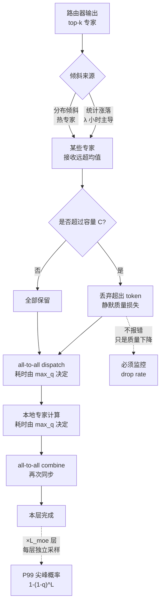
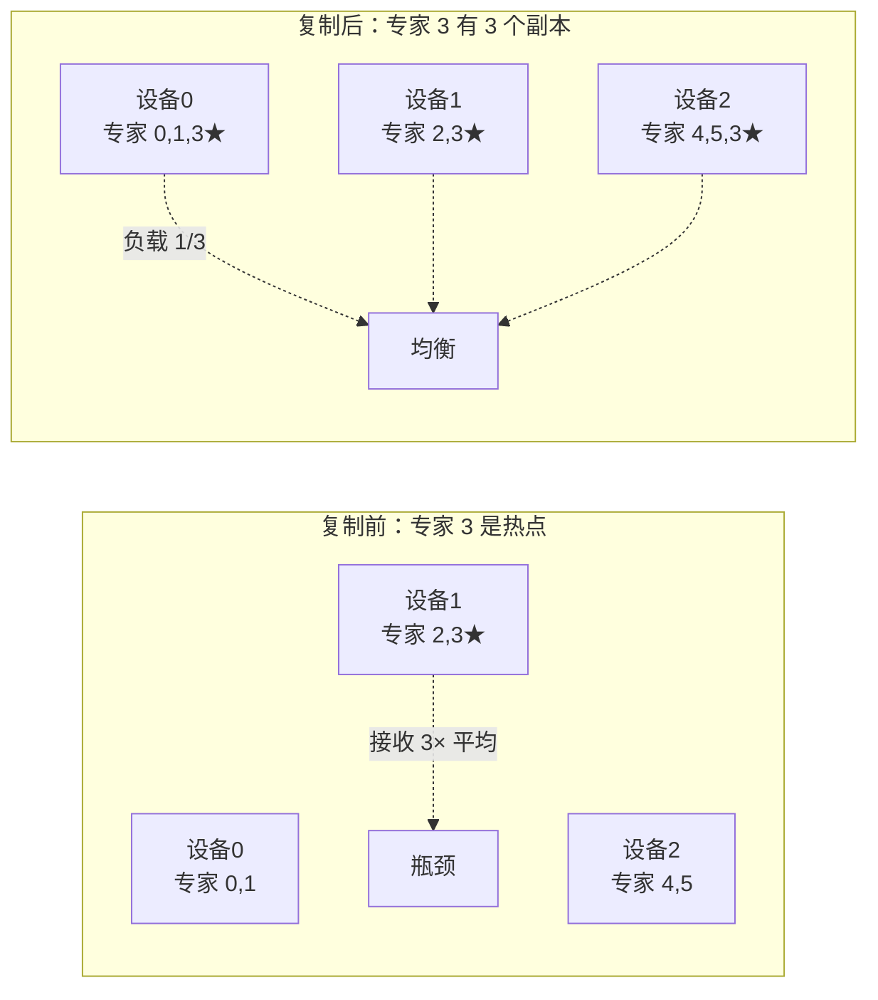
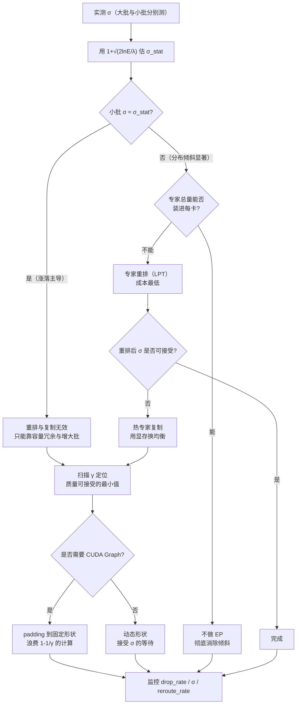

# MoE 路由、all-to-all 与负载均衡

> 位置：[InferenceAtlas](../../INDEX.md) > [模块 06](README.md) > 当前文档
> 信息截至：2026-07-29 ｜ 最后核验：2026-07-29 ｜ 内容版本：v0.1
> 时效性等级：中
> 相关主题：[MoE 推理与专家并行](05_moe_inference_and_expert_parallelism.md)｜`08_kv_cache_transfer_and_remote_memory.md`｜[多租户隔离与 QoS](../03_serving_engines_and_scheduling/06_multi_tenant_isolation_and_qos.md)

## 本章导读

[MoE 推理与专家并行](05_moe_inference_and_expert_parallelism.md) 已经指出：EP 的效率上限是 $1/\sigma$，其中 $\sigma$ 是倾斜因子。本章要回答的问题是——**$\sigma$ 从哪里来，能压到多低，代价是什么**。

倾斜有两个来源，性质完全不同：

1. **统计涨落**：即使路由分布完全均匀，有限的 token 数也会让各专家的接收量围绕均值波动。这个涨落遵循泊松规律，**批越小越剧烈**，且**无法通过任何路由改进消除**——它是采样噪声。
2. **分布倾斜**：路由本身就偏向某些专家（热专家）。这是可以通过训练时的均衡损失、推理时的专家重排与复制来缓解的。

**区分这两者至关重要**：第一种是 decode 小批下的主导因素且无法根治，只能通过容量冗余来吸收；第二种可以治理但需要负载统计与运维介入。把统计涨落误当成路由问题去"优化路由"，是徒劳的。

本章还要讲清 all-to-all 为什么把倾斜**放大**成时延：它是同步操作，且在 EP 中出现两次，每次都要等最慢的设备。这使得 MoE 的 P99 时延对倾斜极其敏感——一个偶发的热点就会形成一个尖峰。

## 学习目标

读完本章后，读者应能够：

1. 区分统计涨落与分布倾斜，并说明各自的量级与可治理性；
2. 推导小批 decode 下倾斜因子的期望量级，并说明为什么它无法通过路由优化消除；
3. 描述 all-to-all 的执行结构，解释它为什么把倾斜放大为同步等待；
4. 列出容量因子、专家重排、热专家复制三类治理手段及其代价；
5. 设计 MoE 服务的倾斜监控与告警方案。

## 核心结论

- **倾斜有两个来源**：统计涨落（无法根治，小批下主导）与分布倾斜（可治理）。混淆两者会导致徒劳的优化。
- **小批 decode 下的倾斜主要是统计涨落**：每专家期望 token 数 $\lambda = nk/E$ 很小时，相对波动约 $1/\sqrt{\lambda}$，$\lambda=4$ 时就有 50%。
- **all-to-all 把倾斜放大为时延**：它是同步屏障，每层出现两次，耗时由最忙设备决定，因此 $\sigma$ 直接进入关键路径。
- **容量因子是吸收涨落的缓冲，但它同时是质量开关**：容量紧则丢 token 损质量，容量松则倾斜暴露为等待。
- **热专家复制是最直接的治理手段**，用显存换均衡；专家重排更省显存但需要负载统计与周期性重排。

## 1. 问题定义、系统边界与工作负载

### 1.1 倾斜的两个来源

| 来源 | 机制 | 随批大小 | 可治理性 |
|---|---|---|---|
| **统计涨落** | 有限采样的随机波动 | 批越小越剧烈 | **不可消除**，只能用容量冗余吸收 |
| **分布倾斜** | 路由器本身偏好某些专家 | 与批大小无关 | 可通过重排、复制、训练均衡缓解 |

**为什么必须区分**：

- 在 prefill 阶段，$n = B \cdot S$ 很大，统计涨落被平均掉，剩下的倾斜主要是分布倾斜——**这时治理路由分布是有效的**；
- 在 decode 阶段，$n = B$ 可能只有几十，统计涨落主导——**这时再怎么优化路由分布也无济于事**，只能靠容量冗余。

一个常见的错误是在 decode 阶段观察到严重倾斜，然后去调整训练的均衡损失或做专家重排——这些手段对统计涨落无效。

### 1.2 系统边界

本章讨论的手段分布在三个层次：

| 层次 | 手段 | 何时生效 |
|---|---|---|
| 训练期 | 负载均衡辅助损失 | 影响路由分布（不影响涨落） |
| 部署期 | 专家放置、热专家复制、EP 度选择 | 静态配置 |
| 运行期 | 容量因子、溢出策略、动态路由调整 | 每步 |

**本章重点在部署期与运行期**——训练期的均衡损失属于模型训练范畴，本库只说明它的作用边界。

### 1.3 工作负载的影响

路由分布**依赖输入分布**。同一个 MoE 模型在不同业务流量上，热专家可能完全不同：

| 流量特征 | 路由表现 |
|---|---|
| 单一领域（如只有代码） | 分布倾斜可能很强（少数专家承担大部分） |
| 混合领域 | 分布相对均匀 |
| 长文本 | prefill 阶段 token 多，涨落小 |
| 短对话 | decode 占比高，涨落大 |
| 突发同质请求 | 短时间内路由高度集中，倾斜尖峰 |

**"突发同质请求"是一个真实的运维风险**：如果某一时刻大量相似请求同时到达（例如一次批量任务），它们会集中路由到同一批专家，造成短时的严重倾斜。这类尖峰在平均指标上看不出来，只在 P99 上体现。

## 2. 原理、数学与性能模型

### 2.1 统计涨落的量级

设 $n$ 个 token、每 token 选 $k$ 个专家、共 $E$ 个专家，路由完全均匀。专家 $e$ 接收的 token 数 $X_e$ 近似服从二项分布 $\text{Binomial}(nk, 1/E)$，在 $E$ 较大时近似泊松：

$$
X_e \sim \text{Poisson}(\lambda), \qquad \lambda = \frac{nk}{E}
$$

- $\lambda$：每专家期望接收的 token 数；
- 标准差 $\sqrt{\lambda}$，**相对标准差** $1/\sqrt{\lambda}$。

**最大值的期望**：$E$ 个独立泊松变量的最大值，其期望近似

$$
E[\max_e X_e] \approx \lambda + \sqrt{2\lambda \ln E}
$$

（这是极值理论的常用近似，对中等 $\lambda$ 与 $E$ 适用。）

因此**统计涨落导致的倾斜因子**：

$$
\sigma_{\text{stat}} \approx 1 + \sqrt{\frac{2 \ln E}{\lambda}}
$$

- **直觉**：$\lambda$ 越大（批越大或专家越少），涨落的相对影响越小；$E$ 越多，最大值越极端（更多次抽样）。
- **假设**：路由完全均匀且独立；泊松近似成立。
- **局限**：真实路由不独立（相似 token 聚集），实际 $\sigma$ 会**高于**此估计。因此这是一个**乐观下界**。

**数值表**（按 $\sigma_{\text{stat}} \approx 1 + \sqrt{2\ln E/\lambda}$ 计算的**模型输出**，非实测）：

| $\lambda \backslash E$ | 8 | 32 | 64 | 256 |
|---:|---:|---:|---:|---:|
| 1 | 3.04 | 3.63 | 3.88 | 4.33 |
| 2 | 2.44 | 2.86 | 3.04 | 3.35 |
| 4 | 2.02 | 2.32 | 2.44 | 2.67 |
| 8 | 1.72 | 1.93 | 2.02 | 2.18 |
| 16 | 1.51 | 1.66 | 1.72 | 1.83 |
| 64 | 1.25 | 1.33 | 1.36 | 1.42 |
| 256 | 1.13 | 1.16 | 1.18 | 1.21 |
| 1024 | 1.06 | 1.08 | 1.09 | 1.10 |

**从表中可读出的三条结论**：

1. **小 $\lambda$ 下倾斜极其严重**。$\lambda = 4$、$E = 64$ 时 $\sigma \approx 2.44$——**效率上限只有 41%，而且路由是完全均匀的**。这个损失纯粹来自采样噪声。
2. **要把 $\sigma$ 压到 1.2 以下，需要 $\lambda \gtrsim 200$**（$E=64$ 时精确为 208，$E=256$ 时为 277）。对 $E = 64$、$k = 2$ 的模型，$\lambda = 208$ 意味着 $n = \lambda E/k \approx 6700$ 个 token——**decode 阶段几乎不可能达到**（除非批极大）。
3. **$E$ 的影响是对数的**，相对温和。真正决定倾斜的是 $\lambda$。

> **核心推论**：**decode 阶段的 MoE 天然存在显著的统计倾斜，这是结构性的，不是实现缺陷。** 任何"优化路由让它更均匀"的尝试都无法改变这一点——路由已经是均匀的了。

### 2.2 分布倾斜的度量

在统计涨落之外，路由器本身的偏好造成分布倾斜。度量方式：

设专家 $e$ 的长期路由概率为 $p_e$（$\sum_e p_e = 1$，均匀时 $p_e = 1/E$）。

**最大偏好比**：

$$
\sigma_{\text{dist}} = E \cdot \max_e p_e
$$

- $\sigma_{\text{dist}} = 1$ 表示完全均匀；$\sigma_{\text{dist}} = 3$ 表示最热的专家承担了 3 倍于平均的流量。

**熵度量**（更全面，反映整体分布形状）：

$$
H = -\sum_e p_e \log p_e, \qquad \text{归一化熵} = \frac{H}{\log E}
$$

- 归一化熵为 1 表示完全均匀，接近 0 表示高度集中。

**两个度量的分工**：$\sigma_{\text{dist}}$ 直接对应性能影响（最忙设备决定耗时），归一化熵反映治理的空间（熵低说明重排/复制有较大改善余地）。

### 2.3 两个来源的合成

总倾斜近似为两者的复合。粗略地：

$$
\sigma_{\text{total}} \approx \sigma_{\text{dist}} \cdot \left(1 + \sqrt{\frac{2\ln E}{\lambda \cdot \sigma_{\text{dist}}^{-1}}}\right)
$$

这个式子过于繁琐且假设很强。**更实用的做法是直接实测**：

$$
\sigma_{\text{measured}} = \frac{\max_q n_q}{\overline{n_q}}
$$

并**分别估计两个分量**：

1. 在**大批**（prefill）上测 $\sigma$：此时涨落小，测到的主要是 $\sigma_{\text{dist}}$；
2. 在**小批**（decode）上测 $\sigma$：此时是两者的合成；
3. 用 2.1 的公式估算该 $\lambda$ 下的 $\sigma_{\text{stat}}$，与实测比较，差额归因于分布倾斜。

**这个分解是治理决策的前提**：如果小批倾斜主要是统计涨落，治理手段只有容量冗余；如果大批倾斜也很高，说明分布倾斜严重，重排与复制才有用武之地。

### 2.4 all-to-all 如何放大倾斜

all-to-all 的执行结构：每个设备向其他所有设备发送不同大小的数据，同时接收。它是**同步的**——所有设备完成收发才能返回。

$$
T_{\text{a2a}} \approx \alpha \cdot g(N_{\text{EP}}) + \frac{\max_q \left(\sum_p D_{p \to q}\right)}{\text{BW}_{\text{link}}}
$$

- $D_{p \to q}$：设备 $p$ 发往 $q$ 的字节数；
- 分子是**接收量最大的设备**的总接收量。

**倾斜进入了两个地方**：

| 位置 | 影响 |
|---|---|
| all-to-all 的传输时间 | 由 $\max_q$ 接收量决定 |
| 本地专家计算时间 | 由 $\max_q$ token 数决定 |

**且这个模式在每个 MoE 层出现两次**（dispatch 与 combine）。设模型有 $L_{\text{moe}}$ 个 MoE 层：

$$
T_{\text{moe-overhead}} \approx 2 L_{\text{moe}} \cdot \left( T_{\text{a2a}} + T_{\text{sync-wait}} \right)
$$

**为什么这对 P99 特别糟**：单层的一次倾斜尖峰只影响一层，但一个请求要过 $L_{\text{moe}}$ 层，每层都有独立的路由结果。若每层出现严重倾斜的概率是 $q$，则**至少一层出现的概率是 $1-(1-q)^{L_{\text{moe}}}$**——层数放大了尖峰概率。

- $q = 0.05$、$L_{\text{moe}} = 32$：至少一层出现严重倾斜的概率约 81%。
- **这解释了 MoE 服务 P99 时延通常显著差于 P50**。

### 2.5 容量因子的双面性

容量因子 $\gamma$ 定义每个专家可接收的 token 上限：

$$
C = \left\lceil \gamma \cdot \frac{nk}{E} \right\rceil = \lceil \gamma \lambda \rceil
$$

**两个作用方向**：

| $\gamma$ | 效果 | 代价 |
|---|---|---|
| 小（如 1.0） | 缓冲区小，形状可预测 | **大量 token 被丢弃**，质量受损 |
| 中（如 1.25–2.0） | 吸收部分涨落 | 少量丢弃 + 部分 padding 浪费 |
| 大（如 4.0） | 几乎不丢弃 | padding 浪费大；倾斜暴露为等待 |

**丢弃率的估算**：token 被丢弃当且仅当它所选专家已满。用泊松近似：

$$
\Pr[\text{专家溢出}] = \Pr[X_e > C] = 1 - \sum_{j=0}^{C} \frac{e^{-\lambda}\lambda^j}{j!}
$$

**期望丢弃比例**：

$$
\text{drop rate} \approx \frac{E \cdot E[\max(0, X_e - C)]}{nk} = \frac{E \cdot \sum_{j>C}(j-C)\frac{e^{-\lambda}\lambda^j}{j!}}{nk}
$$

**数值表**（按上式计算的**模型输出**，非实测，路由均匀假设）：

| $\lambda \backslash \gamma$ | 1.0 | 1.25 | 1.5 | 2.0 | 3.0 |
|---:|---:|---:|---:|---:|---:|
| 2 | 27.1% | 10.9% | 10.9% | 3.8% | 0.30% |
| 4 | 19.5% | 10.3% | 4.9% | 0.84% | 0.01% |
| 8 | 14.0% | 5.3% | 1.6% | 0.08% | ~0% |
| 16 | 9.9% | 2.3% | 0.32% | ~0% | ~0% |
| 64 | 5.0% | 0.13% | ~0% | ~0% | ~0% |

（容量 $C = \lceil \gamma\lambda \rceil$ 取整，因此小 $\lambda$ 时不同 $\gamma$ 可能得到相同的 $C$——例如 $\lambda=2$ 时 $\gamma=1.25$ 与 $1.5$ 都给出 $C=3$，故两列数值相同。）

**从表中可读出**：

1. **容量因子为 1.0（不留冗余）时丢弃率相当高**——因为涨落必然让约一半的专家超过均值。$\lambda = 4$ 时丢弃近 20%，$\lambda = 2$ 时超过四分之一。**"容量等于平均值"是一个明显错误的配置**。
2. **小 $\lambda$ 需要更大的 $\gamma$ 才能压低丢弃**。这与 decode 的现实直接冲突：decode 的 $\lambda$ 小，需要大 $\gamma$，而大 $\gamma$ 意味着更多 padding 浪费。
3. **$\gamma = 2.0$ 在 $\lambda \ge 8$ 时把丢弃压到千分之一以下**，是一个合理的默认值；但在 $\lambda = 2$ 这样的极小批下，即使 $\gamma = 2.0$ 仍有约 4% 丢弃，需要 $\gamma = 3$ 才够。

**"padding 浪费"的量化**：若为 CUDA Graph 而把形状固定为容量上限，则实际计算的 token 数是 $E \cdot C = E\gamma\lambda = \gamma n k$，而有效 token 数是 $nk$。

$$
\text{计算浪费比例} = 1 - \frac{1}{\gamma}
$$

- $\gamma = 2$ 浪费 50%，$\gamma = 4$ 浪费 75%。
- **这是一个非常大的代价**，因此固定形状的 padding 只在确实需要 CUDA Graph 时才值得。

**取舍的本质**：$\gamma$ 是一个**质量与效率的显式旋钮**。丢弃损害质量（静默），padding 损害效率（可见）。

## 3. 实现机制与系统设计

### 3.1 倾斜的传播路径



**图解读**：
1. **本图展示什么**：倾斜从路由器产生，经过容量检查（可能丢弃），再通过两次 all-to-all 与本地计算放大为时延，最后被层数放大为 P99 尖峰。
2. **核心瓶颈**：瓶颈是"耗时由 $\max_q$ 决定"这两个环节。它们是同步屏障，把单个热点的影响传导给所有设备——**一个设备慢，所有设备都在等**。
3. **图中的 trade-off**：容量检查这个分叉是质量与性能的交换点。走"丢弃"分支保住了时延但损失质量且不报错；走"全部保留"分支保住了质量但让倾斜完全暴露为等待。
4. **面试如何引用**：被问"MoE 的 P99 为什么差"时，用这张图给出完整链路——统计涨落 → 同步屏障 → 层数放大，三个环节缺一不可，比笼统说"负载不均"更有说服力。

### 3.2 三类治理手段

| 手段 | 针对 | 代价 | 生效时机 |
|---|---|---|---|
| **容量因子调优** | 统计涨落 | 质量（丢弃）或效率（padding） | 运行期，可动态 |
| **专家重排** | 分布倾斜 | 一次权重搬移；需要负载统计 | 部署期，周期性 |
| **热专家复制** | 分布倾斜 | 显存 | 部署期 |
| **降低 EP 度** | 两者 | 显存（每卡装更多专家） | 部署期 |
| **不做 EP（专家复制到每卡）** | **两者，彻底消除** | 显存 | 部署期 |

**最后一行是最彻底的答案**（见 [MoE 推理与专家并行](05_moe_inference_and_expert_parallelism.md) 2.6）：如果每卡都有全部专家，就不需要跨设备搬运 token，也就没有 all-to-all，倾斜问题完全消失。**这值得在做任何倾斜治理之前先评估一次**。

### 3.3 专家重排

**原理**：把热专家分散到不同设备，避免它们聚集在同一设备上。

```
function rebalance_expert_placement(expert_loads, ep_size):
    # expert_loads: [E]，各专家的历史负载（token 计数或比例）
    # 目标：最小化 max(设备负载)  —— 这是一个多路数划分问题

    # 贪心：负载降序，依次放入当前最轻的设备（LPT 算法）
    order = argsort(expert_loads, descending=True)
    device_loads = [0.0] * ep_size
    placement = {}

    for e in order:
        d = argmin(device_loads)
        placement[e] = d
        device_loads[d] += expert_loads[e]

    sigma_before = max(sum_by_naive_placement) / mean(...)
    sigma_after  = max(device_loads) / mean(device_loads)
    log(f"重排前 σ={sigma_before:.2f}，重排后 σ={sigma_after:.2f}")

    return placement
```

**LPT（longest processing time first）贪心的性质**：它对最大负载的近似比不超过 $4/3 - 1/(3m)$（$m$ 为设备数），这是一个经典结果。对于本场景足够好——**不需要求最优解**。

**重排的限制**：

1. **只能缓解分布倾斜，对统计涨落无效**。若某设备上的专家总期望负载已经均衡，涨落仍会造成瞬时不均。
2. **需要一次权重搬移**，不能频繁做。
3. **路由分布会漂移**：业务流量变化后，原来的热专家可能不再热。需要周期性重估。

**何时重排**：
- 首次部署后，用一段真实流量统计负载并重排一次；
- 业务流量特征明显变化时（如新增了一类请求）；
- 监控到 $\sigma_{\text{dist}}$（大批上测得的倾斜）显著上升时。

### 3.4 热专家复制

**原理**：把最热的 $r$ 个专家在多个设备上各存一份，路由时在副本间随机或按负载选择。



**图解读**：
1. **本图展示什么**：把热专家（★标记）在多个设备各存一份，路由时把发往它的 token 分摊到各副本，从而消除单点热瓶颈。
2. **核心瓶颈**：瓶颈从"设备 1 过载"转移到"显存"——每增加一个副本就多占一份专家权重。当热专家很大或副本很多时，显存成为新的限制。
3. **图中的 trade-off**：复制份数越多越均衡，但显存占用线性增长，且挤压 KV cache 空间（进而降低并发）。这是一个"用并发换时延稳定性"的交换。
4. **面试如何引用**：被问"热专家怎么处理"时，用这张图说明复制是最直接的手段，并主动指出它的二阶代价是挤占 KV 空间——这体现了对全局资源的意识。

**复制份数的选择**：设专家 $e$ 的负载比例为 $p_e$，复制 $r_e$ 份后每份承担 $p_e/r_e$。目标是让所有 (专家, 副本) 的负载接近均值：

$$
r_e \approx \left\lceil \frac{p_e}{1/E} \right\rceil = \lceil E p_e \rceil
$$

- 即"热多少倍就复制多少份"。
- **显存代价**：$\sum_e r_e \cdot P_{\text{expert}}$ 而非 $E \cdot P_{\text{expert}}$。

**路由到副本的策略**：

| 策略 | 说明 | 特点 |
|---|---|---|
| 随机 | 均匀随机选一个副本 | 简单；仍有涨落 |
| 轮询 | 依次轮转 | 更均匀；需要状态 |
| 就近 | 优先选本设备的副本 | 减少通信；可能不均衡 |
| 负载感知 | 选当前最轻的副本 | 最均衡；需要负载信息 |

**"就近"值得单独说明**：如果一个 token 所在设备恰好有它需要的专家的副本，就不需要跨设备搬运——**这直接减少了 all-to-all 的数据量**。因此"就近优先、否则负载感知"是一个实用的组合策略。

### 3.5 动态容量与溢出策略

当专家超出容量时，有几种处理方式：

| 策略 | 做法 | 影响 |
|---|---|---|
| **丢弃（drop）** | 该 token 跳过此专家，门控置零 | 质量损失；等价于该 token 少一个专家 |
| **重路由** | 送到第 $k+1$ 个候选专家 | 质量损失较小；需要额外路由逻辑 |
| **溢出到下一层** | 该 token 在本层不过 MoE，只走残差 | 质量损失较大 |
| **不设容量** | 完全不限制 | 无质量损失；倾斜完全暴露为时延 |

**推荐**：**重路由优于丢弃**。当 top-1 专家满了，送到 top-2（或 top-$(k+1)$）通常质量损失小得多——因为路由器给出的第二选择往往也是合理的。实现代价是需要保留 top-$(k+m)$ 的候选而非仅 top-$k$。

**监控要求**（三个指标缺一不可）：

| 指标 | 含义 | 告警条件 |
|---|---|---|
| `moe_drop_rate` | 被丢弃的 (token, 专家) 对占比 | > 1%（按业务定） |
| `moe_reroute_rate` | 被重路由的比例 | 用于理解容量压力 |
| `moe_skew_factor` | $\max_q n_q / \overline{n_q}$ | > 2.0 |

**`moe_drop_rate` 是三者中最重要的**，因为它直接对应质量损失且完全静默。

### 3.6 与调度的交互

倾斜与调度器有两个交互点：

**（a）批组装可以影响倾斜**。如果调度器把"路由相似"的请求放进同一批，倾斜会加剧；反之把异质请求混批，路由更分散，倾斜减轻。

- **但这需要预知路由结果**，而路由要等到前向才知道。可行的近似是用**请求的领域标签**做代理——不同领域的请求倾向激活不同专家。
- 实用价值有限，但在有明显领域标签的场景（如多租户，每租户流量特征不同）值得考虑。

**（b）倾斜影响批大小的选择**。$\lambda = nk/E$ 随批增大而增大，倾斜随之减小。因此 **MoE 服务倾向于更大的批**——这与 dense 模型的取舍不同（dense 只有吞吐-时延的常规取舍，MoE 还多了一个"大批降低倾斜"的动机）。

$$
\text{增大批的额外收益（MoE 特有）} = \frac{\sigma(\lambda)}{\sigma(\lambda')} \quad \text{其中 } \lambda' > \lambda
$$

- 从 $\lambda=4$ 增到 $\lambda=16$（批增 4 倍），$E=64$ 时 $\sigma$ 从 2.44 降到 1.72，**有效效率从约 41% 升到约 58%**（相对提升约 42%）。这是在常规的批增益之外的额外收益。

## 4. 性能、成本、能耗与可靠性 trade-off

### 4.1 治理手段的代价对照

| 手段 | 效果 | 显存代价 | 质量代价 | 运维代价 |
|---|---|---|---|---|
| 增大容量因子 | 减少丢弃 | padding 计算浪费 | 无（反而改善） | 低 |
| 减小容量因子 | 减少 padding | 无 | **丢弃增加** | 低 |
| 重路由代替丢弃 | 减少质量损失 | 无 | 小 | 中（实现） |
| 专家重排 | 缓解分布倾斜 | 无 | 无 | 中（需统计与周期重排） |
| 热专家复制 | 缓解分布倾斜 | **高** | 无 | 中 |
| 降低 EP 度 | 缓解两者 | 高 | 无 | 低 |
| 不做 EP | **彻底消除** | **最高** | 无 | **最低** |
| 增大批 | 缓解统计涨落 | KV 压力 | 无 | 低（但受 TPOT 约束） |

**读表要点**：**几乎所有有效的治理手段都以显存为代价**。这与 MoE 本身已经很吃显存的事实叠加，形成了 MoE 部署的核心张力——**倾斜治理与 KV cache 争抢同一份显存**。

### 4.2 倾斜对成本的影响

效率上限 $1/\sigma$ 直接转化为成本：

$$
c_{\text{token}}^{\text{effective}} = c_{\text{token}}^{\text{ideal}} \cdot \sigma
$$

- $\sigma = 2$ 意味着**成本翻倍**。
- 结合 2.1 的表，decode 小批下 $\sigma$ 轻易达到 2–3，**这是 MoE 推理成本高于纸面估算的主要原因之一**。

**这个数字应该进入选型决策**：比较 MoE 与 dense 时，MoE 的有效成本要乘以 $\sigma$。若 $\sigma = 2.4$，MoE 的实际成本优势（如果有的话）会被大幅侵蚀。

### 4.3 可靠性

| 风险 | 后果 | 缓解 |
|---|---|---|
| 丢弃率未监控 | 静默质量损失 | `moe_drop_rate` + 告警 |
| 突发同质流量 | 短时严重倾斜，P99 尖峰 | 容量冗余；限流 |
| 路由分布漂移 | 重排失效，倾斜回升 | 周期性重估 $\sigma_{\text{dist}}$ |
| 副本间不一致 | 数值差异 | 复制时校验权重哈希 |
| 容量因子设置错误 | 质量或效率大幅损失 | 上线前扫描 $\gamma$ 与丢弃率 |
| 把涨落当分布问题治理 | 徒劳的优化投入 | 先做 2.3 的分解 |
| all-to-all 超时 | 服务挂起 | 超时与降级路径 |

**"把涨落当分布问题治理"是本章反复强调的一点**。在投入专家重排或复制之前，必须先做 2.3 的分解——如果小批倾斜主要来自统计涨落，这些手段的收益接近零。

### 4.4 能耗

倾斜的能耗代价来自**等待期间的空转**：$N_{\text{EP}}-1$ 个设备在等最忙的那个，期间仍在耗电。

$$
\frac{E_{\text{skewed}}}{E_{\text{ideal}}} \approx \sigma
$$

- 与成本比值相同。$\sigma = 2$ 意味着每 token 能耗翻倍。

**padding 的能耗**：若为固定形状而 padding 到容量，浪费的计算也消耗能量：

$$
\frac{E_{\text{padded}}}{E_{\text{ideal}}} \approx \gamma
$$

**两者不叠加**（padding 让形状固定，反而消除了等待），而是取代关系——这是一个有趣的性质：**padding 用确定的浪费 $\gamma$ 换取不确定的等待 $\sigma$**。若 $\gamma < E[\sigma]$，padding 反而更省。

## 5. benchmark、真实案例或公开部署案例

当前环境的网络出口策略阻断了 `arxiv.org`、`huggingface.co` 等一手来源（详见 [AGENTS.md 第 11 节](../../AGENTS.md)）。因此本节**不引用任何具体 MoE 模型的路由分布、实测倾斜因子或丢弃率**。第 2.1 与 2.5 节的表格是按各自公式计算的**模型输出**，其参数组合为说明性示例。

| 陈述 | 披露标签 | 状态 |
|---|---|---|
| 训练时的负载均衡辅助损失是常见做法 | `技术文档披露` | `待核实` |
| 主流框架提供容量因子配置 | `开源代码/配置披露` | `待核实` |
| 部分实现支持热专家复制 | `开源代码/配置披露` | `待核实` |
| 具体模型的路由分布与热专家 | — | **不引用**（无一手来源，且高度依赖流量） |
| 具体的实测倾斜因子 | — | **不引用**（必须自测） |

**可自行复现的实验**（`独立可复现实验`）：

1. **倾斜分解**（最重要）：按 2.3 的方法，分别在大批与小批上测 $\sigma$，用 2.1 的公式估算 $\sigma_{\text{stat}}$，得出分布倾斜的分量。**这是所有治理决策的前提**。
2. **$\sigma$ vs $\lambda$ 曲线**：扫描批大小，测量 $\sigma$，与 $1 + \sqrt{2\ln E/\lambda}$ 对比。实测通常高于理论（路由不独立），差额即分布倾斜与相关性的贡献。
3. **丢弃率 vs 容量因子**：扫描 $\gamma$，测量实际丢弃率与质量指标。与 2.5 的表对比，定位质量可接受的最小 $\gamma$。
4. **专家负载分布**：统计各专家的长期路由比例，计算 $\sigma_{\text{dist}}$ 与归一化熵。判断重排的空间。
5. **重排收益**：按 3.3 的 LPT 算法重排，测量重排前后的 $\sigma$。
6. **热专家复制收益**：对最热的若干专家复制，测量 $\sigma$ 与显存变化，以及 KV 空间被挤压后的并发下降。
7. **padding vs 等待**：分别用固定形状（padding 到容量）与动态形状，测量总耗时与能耗。验证 4.4 的取代关系。
8. **重路由 vs 丢弃**：两种溢出策略下的质量对比。验证 3.5 的"重路由更优"。
9. **层数放大效应**：统计单层出现严重倾斜的概率 $q$，与整体 P99 对比，验证 2.4 的 $1-(1-q)^{L}$。

> 实验方法论要求见 [如何读推理 benchmark](../00_start_here/03_how_to_read_inference_benchmarks.md)。

## 6. 设计决策框架



**图解读**：
1. **本图展示什么**：MoE 倾斜治理的决策流程，起点是**分解倾斜来源**——这一步决定了后续手段是否有效。
2. **核心瓶颈**：瓶颈是第一个分叉"小批 $\sigma$ 是否约等于 $\sigma_{\text{stat}}$"。若是，说明倾斜是采样噪声，任何路由层面的治理都无效；跳过这一步直接做重排或复制，是常见的无效投入。
3. **图中的 trade-off**：底部的 padding vs 动态形状分叉是"确定的浪费 $\gamma$"与"不确定的等待 $\sigma$"之间的交换。当 $\gamma < E[\sigma]$ 时 padding 反而更省——这是一个反直觉但可计算的判断。
4. **面试如何引用**：被问"MoE 负载不均怎么办"时，先讲分解（统计 vs 分布），再讲对应手段——这个结构比直接罗列"容量因子、重排、复制"更能体现分析能力。

### 决策清单

| 问题 | 若答案为"是" | 若答案为"否" |
|---|---|---|
| 已分解统计涨落与分布倾斜？ | 可以决策 | **先分解**，否则可能徒劳 |
| 小批倾斜主要是统计涨落？ | 只能靠容量与批大小 | 重排/复制有效 |
| 专家总量能装进每卡？ | **不做 EP**，彻底消除 | 继续治理 |
| 重排后 $\sigma$ 可接受？ | 到此为止 | 考虑热专家复制 |
| 显存还有余量？ | 复制可行 | 复制会挤压 KV |
| 需要 CUDA Graph？ | padding 到固定形状 | 动态形状 |
| 已监控 `moe_drop_rate`？ | — | **必须补上**，静默质量风险 |
| 增大批是否受 TPOT 约束？ | 无法用大批降倾斜 | 大批是额外收益 |

## 7. 常见失败模式与排查路径

| 症状 | 可能原因 | 排查步骤 |
|---|---|---|
| decode 倾斜严重，重排无效 | **统计涨落，非分布问题**（1.1） | 做 2.3 的分解；对比 $\sigma_{\text{stat}}$ |
| P99 远差于 P50 | 层数放大尖峰概率（2.4） | 统计单层严重倾斜概率 $q$；核对 $1-(1-q)^L$ |
| 质量比预期差但无报错 | 容量丢弃（2.5） | 查 `moe_drop_rate`；提高 $\gamma$ 或改重路由 |
| 提高容量因子后变慢 | padding 浪费（2.5） | 核算 $1-1/\gamma$；考虑动态形状 |
| 偶发时延尖峰 | 突发同质流量（1.3） | 关联请求特征与倾斜时间序列 |
| 重排一段时间后倾斜回升 | 路由分布漂移（3.3） | 周期性重估并重排 |
| 增大 EP 度后倾斜恶化 | 每设备专家变少（[第 5 章](05_moe_inference_and_expert_parallelism.md) 2.5） | 降低 $N_{\text{EP}}$ |
| 热专家复制后并发下降 | 复制挤占 KV 空间（3.4） | 核算显存分配；权衡复制份数 |
| all-to-all 偶发超时 | 极端倾斜导致某设备严重滞后 | 设置超时；检查是否有单点热专家 |
| 副本间输出不一致 | 权重加载不一致 | 校验各副本的权重哈希 |
| 大批上倾斜也很高 | 分布倾斜严重 | 统计 $\sigma_{\text{dist}}$ 与归一化熵；重排/复制 |

**排查原则**：**先分解，再治理**。$\sigma$ 高不等于"路由有问题"——在小批下它更可能是采样噪声。分解的方法（2.3）只需要两次测量，成本极低，却能避免大量无效投入。

## 8. 关联面试主题

1. **倾斜的两个来源及其可治理性差异**——见本章 1.1，这是最能体现分析能力的区分。
2. **统计涨落的量级公式与 decode 的困境**——见本章 2.1，$\sigma \approx 1+\sqrt{2\ln E/\lambda}$。
3. **为什么"优化路由"无法解决 decode 的倾斜**——见本章 2.1 的核心推论。
4. **all-to-all 如何把倾斜放大为时延**——见本章 2.4，同步屏障 + $\max_q$。
5. **层数如何放大 P99 尖峰概率**——见本章 2.4 的 $1-(1-q)^{L}$。
6. **容量因子的双面性**——见本章 2.5，质量与效率的显式旋钮。
7. **为什么重路由优于丢弃**——见本章 3.5。
8. **热专家复制的原理与二阶代价**——见本章 3.4，挤占 KV 空间。
9. **专家重排为什么用 LPT 贪心就够**——见本章 3.3，近似比 4/3 的经典结果。
10. **padding 与等待的取代关系**——见本章 4.4，$\gamma$ vs $E[\sigma]$ 的比较。
11. **MoE 为什么倾向更大的批**——见本章 3.6，降低倾斜是常规批收益之外的额外动机。
12. **倾斜如何进入成本模型**——见本章 4.2，$c_{\text{effective}} = c_{\text{ideal}} \cdot \sigma$。

## 9. 小结

MoE 负载不均的治理，第一步不是选手段而是**做分解**：把观察到的倾斜因子 $\sigma$ 拆成统计涨落与分布倾斜两个分量。方法很简单——在大批上测得的主要是分布倾斜，在小批上测得的是两者合成，用 $\sigma_{\text{stat}} \approx 1 + \sqrt{2\ln E/\lambda}$ 估算涨落分量，差额归于分布。

这一步之所以关键，是因为两个分量的可治理性完全不同：

**统计涨落无法根治**。它是有限采样的必然结果，即使路由完全均匀也存在。decode 阶段每专家的期望 token 数 $\lambda = nk/E$ 往往只有个位数，此时倾斜因子轻易达到 2–3——**效率上限只有 30%–50%，而路由已经是完美均匀的了**。要把 $\sigma$ 压到 1.2 需要 $\lambda \gtrsim 200$，这在 decode 的批大小下几乎不可能。这个损失是结构性的，只能通过容量冗余吸收，或通过增大批来提高 $\lambda$。

**分布倾斜可以治理**，手段按代价递增是：专家重排（LPT 贪心即可，无显存代价）、热专家复制（用显存换均衡）、降低 EP 度、以及最彻底的——**不做 EP**。最后一项值得在所有治理之前先评估：如果每卡都能装下全部专家，all-to-all 与倾斜问题就完全消失了。

all-to-all 是倾斜转化为时延的放大器。它是同步屏障，每个 MoE 层出现两次，耗时由接收最多 token 的设备决定。更麻烦的是层数的放大：每层独立采样，若单层出现严重倾斜的概率是 $q$，则至少一层出现的概率是 $1-(1-q)^{L_{\text{moe}}}$——这解释了 MoE 服务的 P99 为什么通常显著差于 P50。

容量因子 $\gamma$ 是一个必须被显式决策的旋钮，因为它同时是**质量开关**与**效率开关**：$\gamma$ 小则 token 被丢弃（静默的质量损失），$\gamma$ 大则 padding 浪费 $1-1/\gamma$ 的计算。一个有价值的观察是，padding 与等待是**取代关系**而非叠加——固定形状消除了等待，因此当 $\gamma < E[\sigma]$ 时，padding 反而更省。

最后，两个必须做的运维项：**`moe_drop_rate` 必须被监控**（它是完全静默的质量损失），**溢出策略应优先用重路由而非丢弃**（送到第二选择的质量损失远小于跳过专家）。而在成本核算上，倾斜要以乘数形式进入：$c_{\text{effective}} = c_{\text{ideal}} \cdot \sigma$。$\sigma = 2.4$ 意味着实际成本是纸面估算的 2.4 倍——这个数字应当出现在 MoE 与 dense 的选型对比里。

## 关键术语

| 中文术语 | 英文 | 定义 | 单位/口径 | 关联文档 |
|---|---|---|---|---|
| 倾斜因子 | skew factor | 最大设备负载与平均负载之比 | 无量纲，≥1 | 本章 2.3 |
| 统计涨落 | statistical fluctuation | 有限采样导致的负载随机波动 | — | 本章 1.1、2.1 |
| 分布倾斜 | distributional skew | 路由器本身对某些专家的偏好 | — | 本章 1.1、2.2 |
| 热专家 | hot expert | 长期路由概率显著高于平均的专家 | — | 本章 2.2 |
| 容量因子 | capacity factor | 每专家容量相对平均负载的倍数 | 无量纲 | 本章 2.5 |
| 丢弃率 | drop rate | 因容量溢出而跳过专家的 token 占比 | 比例 | 本章 2.5 |
| 重路由 | rerouting | 首选专家满时改送次选专家 | — | 本章 3.5 |
| 专家重排 | expert replacement / rebalancing | 调整专家到设备的映射以均衡负载 | — | 本章 3.3 |
| 热专家复制 | hot expert replication | 把热专家在多设备各存一份 | 份数为计数 | 本章 3.4 |
| 归一化熵 | normalized entropy | 路由分布熵除以 $\log E$ | 无量纲，∈[0,1] | 本章 2.2 |

## 延伸阅读

- [MoE 推理与专家并行](05_moe_inference_and_expert_parallelism.md) — EP 结构与"不做 EP"的判据
- [张量并行推理](02_tensor_parallel_inference.md) — 与 EP 组合的 TP
- [分布式推理总览](01_distributed_inference_overview.md) — 并行方式的整体框架
- [多租户隔离与 QoS](../03_serving_engines_and_scheduling/06_multi_tenant_isolation_and_qos.md) — 批组装与流量隔离
- [请求调度与准入控制](../03_serving_engines_and_scheduling/04_request_scheduling_and_admission_control.md) — 批大小与倾斜的交互
- [时延、吞吐与 SLO](../01_foundations_and_metrics/02_latency_throughput_and_slo.md) — P99 尖峰的口径
- [CUDA Graphs 与执行开销](../04_compilers_runtimes_and_kernels/10_cuda_graphs_and_execution_overhead.md) — 固定形状 padding 的动机
- [成本建模与单位经济学](../01_foundations_and_metrics/06_cost_modeling_and_unit_economics.md) — $\sigma$ 进入成本的方式

## 主要来源

本章的涨落模型、容量-丢弃关系与治理分析为本库自洽推导，基于泊松近似、极值理论的常用估计与经典的多机调度结果（LPT 近似比）。第 2.1 与 2.5 节的表格为公式计算结果，参数组合为说明性示例，非任何真实模型的规格。涉及框架实现的陈述已在第 5 节标注为 `待核实`；具体模型的路由分布与实测倾斜**未引用**（详见 [AGENTS.md 第 11 节](../../AGENTS.md)）。

| 类别 | 说明 | 披露标签 |
|---|---|---|
| 泊松涨落与相对标准差 | 标准概率结果 | — |
| $E[\max]$ 的极值近似 | 常用近似，已标注适用范围 | — |
| 丢弃率的泊松尾部计算 | 标准概率计算 | — |
| LPT 的 $4/3-1/(3m)$ 近似比 | 经典调度理论结果 | — |
| 第 2.1、2.5 节数值表 | 由公式计算，参数为示例值 | — |
| 框架实现与真实路由分布 | 需一手核验/自测 | `待核实` / 未引用 |

## 更新记录

| 日期 | 版本 | 变更 | 核验人 |
|---|---|---|---|
| 2026-07-29 | v0.1 | 初稿：倾斜的两个来源与分解方法、统计涨落的量级模型、all-to-all 与层数的双重放大、容量因子的质量-效率双面性、重排与热专家复制的治理手段 | — |
