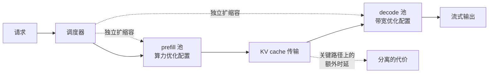
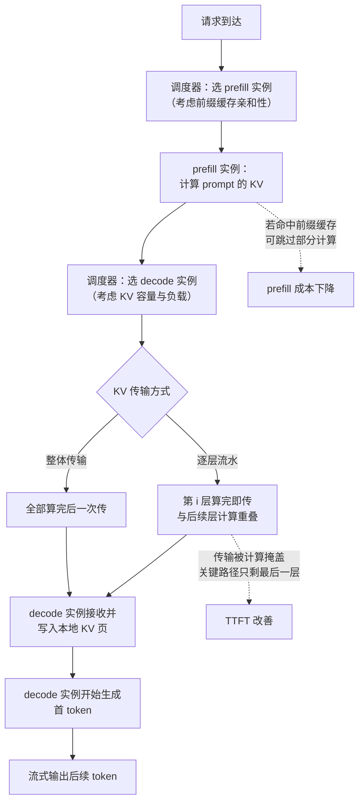
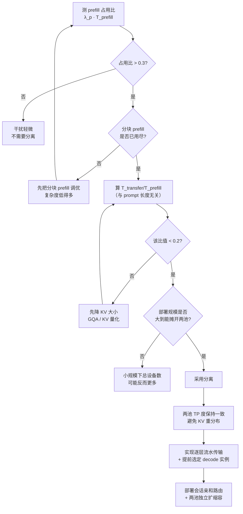

# prefill/decode 分离：收益、边界与何时不该用

> 位置：[InferenceAtlas](../../INDEX.md) > [模块 06](README.md) > 当前文档
> 信息截至：2026-07-29 ｜ 最后核验：2026-07-29 ｜ 内容版本：v0.1
> 时效性等级：高
> 相关主题：[prefill vs decode](../02_transformer_and_kv_cache/02_prefill_vs_decode.md)｜`08_kv_cache_transfer_and_remote_memory.md`｜[prefill/decode 调度](../03_serving_engines_and_scheduling/05_prefill_decode_scheduling.md)

## 本章导读

prefill 与 decode 是两种画像完全不同的计算：一个计算受限、一个带宽受限；一个批内 token 多、一个批内 token 少；一个偏好大批、一个受 TPOT 约束。把它们放在同一组设备上，意味着**任何配置都是对两者的折中，而不是对任一者的最优**。

分离部署（disaggregation）把它们拆成两个独立的池：prefill 池专门做 prompt 处理，decode 池专门做 token 生成，中间通过 **KV cache 传输**衔接。这带来三个具体收益：

1. **消除干扰**：prefill 不再打断 decode，TPOT 的抖动大幅下降；
2. **各自最优配置**：两池可以用不同的并行度、批策略，甚至不同的硬件；
3. **独立扩缩容**：prefill 与 decode 的负载比例随流量变化，分离后可以各自调整。

代价只有一个，但它很实在：**每个请求都要把 KV cache 从 prefill 池传到 decode 池**。这个传输量正比于 prompt 长度，且落在请求的关键路径上。

因此本章的核心是一个判据：**KV 传输时间与它换来的收益相比，是否划算**。本章会给出这个判据的定量形式，以及"什么时候不该用分离"的明确清单——这一点比讨论收益更重要，因为分离引入的运维复杂度是持续的。

## 学习目标

读完本章后，读者应能够：

1. 列举 prefill 与 decode 的画像差异，并说明它们为什么导致混合部署的折中；
2. 推导 KV 传输时间的表达式，并给出分离是否划算的定量判据；
3. 说明分离如何改善 TTFT 与 TPOT 的尾部，以及改善的机制；
4. 设计两池的比例与独立扩缩容策略；
5. 给出"不应该用分离"的具体条件。

## 核心结论

- **分离的本质是消除两种画像的相互妥协**，收益主要体现在**尾部时延**而非平均值。
- **KV 传输量正比于 prompt 长度**，因此**长 prompt 场景的分离代价更高**——这与"长 prompt 更需要分离"的直觉相反。
- **分离划算的判据**：KV 传输时间应显著小于它避免的 prefill 干扰时间。这给出一个明确的 prompt 长度区间。
- **分离让两池可用不同并行策略**：prefill 池可用 PP/CP（计算受限、可切序列），decode 池用 TP（降低 TPOT）——这是分离的一个常被低估的收益。
- **短 prompt、低负载、KV 大而互联窄的场景不应该用分离**。

## 1. 问题定义、系统边界与工作负载

### 1.1 两种画像的差异

| 维度 | prefill | decode |
|---|---|---|
| 批内 token 数 | $B \cdot S$，很大 | $B$，很小 |
| 算术强度 | 高 | 低 |
| 瓶颈 | 算力（FLOPS） | 内存带宽 |
| 偏好的批大小 | 中等即可饱和算力 | 越大越好（摊薄权重读取） |
| 时延指标 | TTFT | TPOT |
| 对并行方式的偏好 | PP/CP 可行（微批多） | 只有 TP 能降时延 |
| KV 行为 | 写入 | 读取 + 追加 |
| 通信画像（TP 下） | 大消息，带宽受限 | 小消息，延迟受限 |
| 单请求持续时间 | 短（一次） | 长（$L_{\text{out}}$ 步） |

**这张表的每一行都指向一个不同的最优配置**。混合部署必须在每一行上做折中。

### 1.2 混合部署的三个具体损失

**（a）prefill 打断 decode**

一个长 prompt 的 prefill 可能占用数十毫秒，期间 decode 请求全部停滞。这直接表现为 **TPOT 的尖峰**。

分块 prefill（chunked prefill，见 [模块 03 第 5 章](../03_serving_engines_and_scheduling/05_prefill_decode_scheduling.md)）能缓解这一点——把长 prefill 切成小块，穿插在 decode 之间。但它是缓解不是消除：每个块仍然占用时间，且分块本身降低了 prefill 的效率（更小的块算术强度更低）。

**（b）批大小的折中**

decode 想要大批（摊薄权重读取），prefill 不需要大批（本就计算受限）。混合批中，prefill 的 token 挤占了 decode 可用的批槽位。

**（c）并行度的折中**

decode 想要更高的 TP 度（降低 $W/(N\cdot\text{BW})$）；prefill 在计算受限区，TP 度高反而增加通信占比。混合部署只能选一个 TP 度。

### 1.3 分离的结构

**图解读**：
1. **本图展示什么**：分离部署的基本结构——请求先进 prefill 池，KV 传到 decode 池，由后者完成生成并流式输出。两池独立扩缩容。
2. **核心瓶颈**：瓶颈是中间的 KV 传输环节。它在请求的关键路径上（首 token 必须等 KV 到位），且传输量正比于 prompt 长度。它是分离的唯一代价，也是判据的核心。
3. **图中的 trade-off**：分离用一次 KV 传输，换取两池各自最优的配置与互不干扰。当 prompt 短时传输便宜、干扰收益大，分离划算；prompt 极长时传输昂贵，收益可能被抵消。
4. **面试如何引用**：被问"什么是 PD 分离"时，用这张图先讲结构，再立刻指出"唯一代价是 KV 传输且它在关键路径上"——把讨论直接引向判据，而不是停留在架构描述。

## 2. 原理、数学与性能模型

### 2.1 KV 传输量与时间

一个请求 prefill 后产生的 KV：

$$
M_{\text{KV}}^{\text{req}} = 2 L S_{\text{prompt}} H_{kv} d_h b_{kv}
$$

**传输时间**：

$$
T_{\text{transfer}} = \frac{M_{\text{KV}}^{\text{req}}}{\text{BW}_{\text{link}}} + \alpha_{\text{setup}}
$$

- $\text{BW}_{\text{link}}$：prefill 池到 decode 池的有效带宽（B/s）；
- $\alpha_{\text{setup}}$：建连与调度开销。

**关键性质**：$T_{\text{transfer}} \propto S_{\text{prompt}}$。**prompt 越长，分离的代价越高**。

**与 prefill 时间的比值**：prefill 时间

$$
T_{\text{prefill}} \approx \frac{2 P S_{\text{prompt}}}{\text{FLOPS}_{\text{eff}}}
$$

（忽略注意力的二次项。）

$$
\frac{T_{\text{transfer}}}{T_{\text{prefill}}} \approx \frac{2 L H_{kv} d_h b_{kv}}{\text{BW}_{\text{link}}} \cdot \frac{\text{FLOPS}_{\text{eff}}}{2P} = \frac{L H_{kv} d_h b_{kv}}{P} \cdot \frac{\text{FLOPS}_{\text{eff}}}{\text{BW}_{\text{link}}}
$$

- **$S_{\text{prompt}}$ 约掉了**——这个比值与 prompt 长度无关！
- **直觉**：传输量与 prefill 计算量都正比于 prompt 长度，因此比值恒定。这是一个有用的简化：**"KV 传输相对 prefill 的开销占比"是一个由模型与硬件决定的常数**。
- **假设**：prefill 的计算主导项是线性项（忽略注意力的 $O(S^2)$）。在极长 prompt 下注意力项不可忽略，此时 $T_{\text{prefill}}$ 增长更快，比值下降——**长 prompt 下传输的相对占比反而更低**。
- **局限**：忽略了流水化传输（见 3.2），实际可低于此估计。

**这个比值的实用意义**：它可以在部署前用模型参数与硬件规格直接算出。若它远小于 1（例如 0.1），说明 KV 传输只增加约 10% 的 prefill 时间，代价可接受。

**GQA 的影响**：$H_{kv}$ 在分子上。**GQA 直接按 $H_{kv}/H$ 的比例降低 KV 传输量**，使分离更划算。MLA 等更激进的 KV 压缩同理。**KV 量化（降低 $b_{kv}$）也直接按比例降低传输量**——这是一个双重收益（既省显存又省传输）。

### 2.2 分离的收益：干扰的消除

**混合部署下 decode 受到的干扰**：设 prefill 请求到达率 $\lambda_p$，每次 prefill 占用时间 $T_{\text{prefill}}$，则 decode 的有效可用时间比例

$$
u_{\text{decode}} = 1 - \lambda_p \cdot T_{\text{prefill}}
$$

decode 的实际 TPOT

$$
\text{TPOT}_{\text{mixed}} \approx \frac{T_{\text{step}}}{u_{\text{decode}}} = \frac{T_{\text{step}}}{1 - \lambda_p T_{\text{prefill}}}
$$

- **这是一个 $1/(1-\rho)$ 形式的表达式**——与排队论的利用率公式同构（见 [模块 01 第 3 章](../01_foundations_and_metrics/03_queueing_theory_for_inference.md)）。
- **当 $\lambda_p T_{\text{prefill}} \to 1$ 时 TPOT 发散**。这解释了为什么 prefill 密集的负载会让 decode 时延失控。

**分离后**：$u_{\text{decode}} = 1$（decode 池不做 prefill），因此

$$
\text{TPOT}_{\text{disagg}} \approx T_{\text{step}}
$$

**改善倍数**：

$$
\frac{\text{TPOT}_{\text{mixed}}}{\text{TPOT}_{\text{disagg}}} = \frac{1}{1 - \lambda_p T_{\text{prefill}}}
$$

**数值表**（按上式计算的**模型输出**，非实测）：

| prefill 占用比 $\lambda_p T_{\text{prefill}}$ | TPOT 改善倍数 |
|---:|---:|
| 0.1 | 1.11× |
| 0.2 | 1.25× |
| 0.3 | 1.43× |
| 0.5 | 2.00× |
| 0.7 | 3.33× |
| 0.8 | 5.00× |
| 0.9 | 10.0× |

**从表中可读出**：

1. **收益是高度非线性的**。prefill 占用比在 0.3 以下时收益有限（<1.5×），超过 0.7 后急剧上升。
2. **因此分离的价值取决于工作负载的 prefill 密度**。长 prompt + 短输出的负载（如 RAG、文档问答）prefill 占用比高，分离收益大；短 prompt + 长输出（如创作、reasoning）占用比低，收益小。
3. 上式是平均值的改善；**尾部的改善更大**，因为干扰是突发的，P99 受单次长 prefill 的影响远大于均值。

### 2.3 分离划算的判据

**代价**：每请求增加 $T_{\text{transfer}}$（在 TTFT 路径上）。
**收益**：每个输出 token 的 TPOT 从 $T_{\text{step}}/u$ 降到 $T_{\text{step}}$。

**端到端时间对比**：

$$
T_{\text{mixed}} = T_{\text{queue}} + T_{\text{prefill}} + L_{\text{out}} \cdot \frac{T_{\text{step}}}{u}
$$

$$
T_{\text{disagg}} = T_{\text{queue}}' + T_{\text{prefill}} + T_{\text{transfer}} + L_{\text{out}} \cdot T_{\text{step}}
$$

**分离更优的条件**（忽略排队差异）：

$$
T_{\text{transfer}} < L_{\text{out}} \cdot T_{\text{step}} \left( \frac{1}{u} - 1 \right)
$$

代入 $T_{\text{transfer}} = M_{\text{KV}}/\text{BW}_{\text{link}} \propto S_{\text{prompt}}$：

$$
\frac{2 L H_{kv} d_h b_{kv}}{\text{BW}_{\text{link}}} \cdot S_{\text{prompt}} < L_{\text{out}} \cdot T_{\text{step}} \cdot \frac{1-u}{u}
$$

**整理为一个关于输入输出长度比的判据**：

$$
\boxed{\ \frac{S_{\text{prompt}}}{L_{\text{out}}} < \frac{T_{\text{step}} \cdot \text{BW}_{\text{link}}}{2 L H_{kv} d_h b_{kv}} \cdot \frac{1-u}{u}\ }
$$

- **左边是工作负载特征**（输入输出长度比）；
- **右边第一项是系统能力**（每 token 的 decode 时间 × 互联带宽 ÷ 每 token 的 KV 大小），第二项是**干扰程度**。
- **直觉**：输出越长，分离的收益摊得越薄（每个 token 都受益）；输入越长，传输代价越高。因此**分离偏好"短输入、长输出"**。

> **这个结论与直觉相反**：人们常认为"长 prompt 场景更需要分离"（因为 prefill 重），但公式说的是长 prompt 让传输代价上升。**真正决定的是输入输出的比值，不是输入的绝对长度**。

**修正**：上式忽略了一个重要因素——**长 prompt 恰恰是让 $u$ 变小（干扰变严重）的原因**。$u = 1 - \lambda_p T_{\text{prefill}}$ 中 $T_{\text{prefill}} \propto S_{\text{prompt}}$。所以 $S_{\text{prompt}}$ 增大时，左边线性增长，而右边的 $(1-u)/u$ 也增长。两者的竞争决定了最终方向，需要代入具体数值判断。

**结论的正确表述**：**分离的划算与否，取决于 KV 传输时间与它所消除的干扰时间的比较**。二者都随 prompt 长度增长，因此不存在"prompt 越长越该分离"或"越短越该分离"的普适结论，必须按 2.1 与 2.2 的公式代入本系统的参数计算。

### 2.4 分离的第二类收益：并行策略解耦

这是一个常被低估的收益。分离后两池可以用**完全不同的并行配置**：

| 池 | 最优并行 | 理由 |
|---|---|---|
| prefill | PP 或 CP，TP 度可低 | 计算受限；PP 有足够微批（序列分块）；CP 可处理超长上下文 |
| decode | TP，度尽量高（至 $H_{kv}$） | 只有 TP 能降 $W/(N\cdot\text{BW})$ |

**混合部署下必须选一个**，通常是 TP（因为 decode 的时延约束更硬）。这意味着 prefill 被迫用了一个对它不最优的配置。

**量化这个收益**：prefill 在高 TP 度下的效率损失来自通信占比上升。若 prefill 改用 PP，通信次数从 $2L$ 降到 $N_{\text{PP}}-1$（见 [流水线并行推理](03_pipeline_parallel_inference.md) 2.4），且 prefill 有充足的微批填充流水线。

**更进一步：异构硬件**。prefill 需要算力，decode 需要带宽。理论上两池可以用不同型号的加速器——prefill 池用算力强的，decode 池用带宽大/显存大的。这在采购与运维上有额外复杂度，但在大规模部署下可能有实质收益。（具体硬件对比见 [模块 07](../07_hardware_and_server_architecture/)，规划中。）

### 2.5 两池的比例

设 prefill 池与 decode 池的设备数分别为 $n_p$ 与 $n_d$。稳态下两池的吞吐必须匹配：

$$
\text{prefill 吞吐（请求/s）} = \text{decode 吞吐（请求/s）}
$$

$$
\frac{n_p}{T_{\text{prefill}}^{\text{per-device}}} = \frac{n_d}{L_{\text{out}} \cdot T_{\text{step}}^{\text{per-request}}}
$$

**比例**：

$$
\frac{n_p}{n_d} = \frac{T_{\text{prefill}}}{L_{\text{out}} \cdot T_{\text{step}}} \cdot \frac{1}{\text{（各自的并发度）}}
$$

**定性规律**：

| 工作负载 | $n_p : n_d$ |
|---|---|
| 长输入、短输出（RAG、摘要） | prefill 池占比高 |
| 短输入、长输出（创作、reasoning） | decode 池占比高 |
| 均衡 | 依系统参数 |

**这个比例会随流量变化而漂移**——这正是分离的第三个收益：**两池可以独立扩缩容**。混合部署无法做到这一点，因为同一组设备同时承担两种工作。

**动态调整的实现**：把一部分设备设为"可切换"，按当前的队列深度在两池之间迁移。迁移的代价是模型权重的重新加载（若两池用不同并行配置，还需重新切分），因此不能太频繁。实用做法是**按分钟级的粒度调整**，并设置滞回避免震荡。

## 3. 实现机制与系统设计

### 3.1 请求的完整生命周期

**图解读**：
1. **本图展示什么**：一个请求在分离架构下的完整路径，包含两次调度决策（选 prefill 实例、选 decode 实例）与两种 KV 传输方式。
2. **核心瓶颈**：瓶颈是 KV 传输。图中给出了关键优化——**逐层流水传输**：第 $i$ 层的 KV 算完就开始传，与第 $i+1$ 层的计算重叠。这样关键路径上只剩最后一层的传输时间，而非全部 $L$ 层。
3. **图中的 trade-off**：逐层流水把传输时间从 $L$ 层降到约 1 层，代价是 $L$ 次小传输而非 1 次大传输——固定延迟累积 $L$ 次。当单层 KV 较小而 $\alpha$ 较大时，流水反而更慢。需要按层分组（例如每 4 层传一次）来平衡。
4. **面试如何引用**：被问"PD 分离的 KV 传输开销怎么办"时，用这张图讲逐层流水与重叠，并主动指出它引入的固定延迟累积问题——这比只说"用 RDMA"更有深度。

### 3.2 逐层流水传输

**朴素方式**：prefill 全部完成后，一次性传输 $M_{\text{KV}}$ 字节。关键路径上的传输时间

$$
T_{\text{naive}} = \frac{M_{\text{KV}}}{\text{BW}_{\text{link}}} + \alpha
$$

**流水方式**：第 $i$ 层算完即传第 $i$ 层的 KV，与第 $i+1$ 层的计算重叠。若单层计算时间 $\ge$ 单层传输时间，则除最后一层外全部被掩盖：

$$
T_{\text{pipelined}} \approx \frac{M_{\text{KV}}}{L \cdot \text{BW}_{\text{link}}} + L \cdot \alpha
$$

**重叠条件**（与 [序列/上下文并行](04_sequence_context_parallel_inference.md) 2.4 同构）：

$$
\underbrace{\frac{2 P S_{\text{prompt}}}{L \cdot \text{FLOPS}}}_{\text{单层计算}} \ge \underbrace{\frac{2 S_{\text{prompt}} H_{kv} d_h b_{kv}}{\text{BW}_{\text{link}}}}_{\text{单层 KV 传输}}
$$

约去 $S_{\text{prompt}}$：

$$
\frac{P}{L \cdot H_{kv} d_h b_{kv}} \ge \frac{\text{FLOPS}}{\text{BW}_{\text{link}}}
$$

- **$S_{\text{prompt}}$ 再次约掉**——重叠条件与 prompt 长度无关，只由模型结构与硬件比值决定。
- **左边可以理解为"每字节 KV 对应多少参数量"**，右边是硬件的算力-互联比。
- **GQA 与 KV 量化让左边变大**（$H_{kv}$、$b_{kv}$ 在分母），因此**更容易满足重叠条件**。

**分组传输**：若 $L \cdot \alpha$ 的固定延迟累积过大，可以按 $g$ 层一组传输：

$$
T_{\text{grouped}} \approx \frac{g \cdot M_{\text{KV}}}{L \cdot \text{BW}_{\text{link}}} + \frac{L}{g} \cdot \alpha
$$

对 $g$ 求最优：

$$
g^* = \sqrt{\frac{L^2 \alpha \cdot \text{BW}_{\text{link}}}{M_{\text{KV}}}}
$$

- **直觉**：固定延迟大就多合并几层，传输量大就分细一点。
- **局限**：该式假设完全不重叠时的总时间；实际有重叠，最优 $g$ 会更小。

### 3.3 KV 传输的实现要点

（传输机制的完整讨论见 `08_kv_cache_transfer_and_remote_memory.md`。这里只列与分离架构直接相关的要点。）

| 要点 | 说明 |
|---|---|
| **零拷贝** | 直接从 prefill 的 KV 页读、写入 decode 的 KV 页，避免中转缓冲 |
| **页对齐** | 两池的 KV 页大小与布局应一致，否则需要重排 |
| **并行度不一致** | 若两池 TP 度不同，KV 的切分方式不同，传输时需要重分布 |
| **背压** | decode 池 KV 满时必须能拒绝接收，否则 OOM |
| **失败处理** | 传输失败应能重传或回退到本地 decode |

**"并行度不一致"是分离的一个真实复杂度**。2.4 说两池可以用不同并行配置，但这直接导致 KV 的切分方式不同：

- prefill 池 TP=2：KV 按 2 份切；
- decode 池 TP=8：KV 需要按 8 份切。

传输时必须做一次**重分布**（本质是 all-to-all）。这增加了实现复杂度与传输开销。

**简化方案**：让两池的 **KV 相关并行度保持一致**（即 TP 度相同），而在其他维度上分化（prefill 额外用 PP 或 CP，decode 用更多副本）。这样 KV 的切分方式一致，传输是直接的点对点拷贝。**这是一个用少量灵活性换取大量实现简单性的好交易**。

### 3.4 调度的两次决策

分离引入了两次调度决策，各有不同的目标：

**（a）选 prefill 实例**：主要考虑**前缀缓存亲和性**。若某个 prefill 实例已经缓存了该请求的前缀，路由到它可以大幅降低 prefill 成本（见 [模块 03 第 8 章](../03_serving_engines_and_scheduling/08_prompt_caching_and_prefix_caching.md)）。

**（b）选 decode 实例**：主要考虑 **KV 容量与当前负载**。decode 实例会长期持有该请求的 KV（直到生成结束），因此必须确认它有足够空间，且不会因为这个请求而超载。

**两次决策的耦合**：理想情况下应联合优化——选择"前缀缓存命中好 且 对应的 decode 实例负载低"的组合。但这是一个组合优化问题，实践中通常解耦：先按缓存亲和选 prefill，再按负载选 decode。

**一个重要的约束**：**decode 实例的选择应尽早做出**，最好在 prefill 开始前——这样才能启用 3.2 的逐层流水传输（传输目标必须已知）。如果等 prefill 结束才选，就只能用朴素的整体传输。

### 3.5 与前缀缓存的交互

分离架构下前缀缓存的位置需要重新考虑：

| 缓存位置 | 效果 | 问题 |
|---|---|---|
| prefill 池 | 加速 prefill | decode 池的续轮请求无法直接利用 |
| decode 池 | 多轮对话的续轮可直接复用 | 首轮无帮助 |
| 独立的 KV 存储层 | 两池都能用 | 增加一层，访问延迟高 |

**多轮对话的特殊性**：第二轮请求的前缀就是第一轮的完整上下文，而那份 KV **正在 decode 池里**。理想做法是让第二轮直接在同一个 decode 实例上继续，跳过 prefill 池——这需要**会话亲和性**（session affinity）的路由。

$$
\text{续轮的 prefill 量} = \begin{cases} \Delta_{\text{new}} & \text{命中会话亲和} \\ S_{\text{full}} & \text{未命中} \end{cases}
$$

**这个差异巨大**：命中时只需 prefill 新增的部分，未命中则要重算整个上下文并再传一次 KV。**分离架构下的会话亲和路由，价值比混合部署下更高**——因为未命中不仅要重算，还要重传。

## 4. 性能、成本、能耗与可靠性 trade-off

### 4.1 收益与代价总表

| 项目 | 方向 | 量级 |
|---|---|---|
| TPOT 尾部 | **改善** | $1/(1-u')$ 倍，见 2.2 |
| TTFT | 恶化 | +$T_{\text{transfer}}$（流水后约 $1/L$） |
| prefill 效率 | **改善** | 可用最优并行配置 |
| decode 批大小 | **改善** | 不被 prefill 挤占 |
| 扩缩容灵活性 | **改善** | 两池独立 |
| 互联带宽消耗 | 增加 | 每请求 $M_{\text{KV}}$ |
| 实现复杂度 | 增加 | 两次调度、传输、重分布、失败处理 |
| 故障模式 | 增加 | 传输失败、池间不一致 |
| 总设备数 | 可能增加 | 两池各需最小规模 |

**"总设备数可能增加"值得说明**：分离要求两个池各自有最小可行规模（至少能装下模型）。在小规模部署下，这可能意味着比混合部署需要更多设备。**分离在大规模下才摊得开**。

### 4.2 不应该用分离的条件

这一节比收益更重要，因为分离的运维复杂度是持续的。

| 条件 | 理由 |
|---|---|
| **部署规模小** | 两池各需最小规模，总设备数可能反而更多 |
| **prefill 占用比低（< 0.2）** | 干扰本就轻微，收益 < 1.25×（2.2 表），不值得复杂度 |
| **互联带宽窄** | $T_{\text{transfer}}$ 大，可能抵消收益 |
| **KV 很大（长上下文、MHA、fp16 KV）** | 同上；应先做 GQA/量化 |
| **输入输出比很高** | 传输代价摊到很少的输出 token 上 |
| **分块 prefill 已足够** | 它是更简单的缓解手段，先试它 |
| **运维能力有限** | 两池、传输、重分布都是新的故障面 |

**"分块 prefill 已足够"值得强调**：它与分离解决同一个问题（prefill 干扰 decode），但实现简单得多——不需要两个池、不需要 KV 传输、不需要两次调度。**应该先把分块 prefill 用好，确认它不足以满足 SLO，再考虑分离**。

| 手段 | 解决 prefill 干扰 | 解决批大小折中 | 解决并行度折中 | 复杂度 |
|---|---|---|---|---|
| 分块 prefill | 部分 | 部分 | 否 | 低 |
| 优先级调度 | 部分 | 否 | 否 | 低 |
| **分离部署** | **完全** | **完全** | **完全** | **高** |

### 4.3 成本

分离本身不降低成本——它降低的是时延。成本影响：

$$
c_{\text{token}}^{\text{disagg}} = \frac{(n_p + n_d) \cdot c_{\text{gpu-hour}}}{3600 \cdot \text{throughput}}
$$

**可能的成本收益**：
- 两池各自配置更优 → 单池效率提升 → 相同吞吐需要更少设备；
- 独立扩缩容 → 减少为峰值预留的冗余；
- 异构硬件 → 各用最合适的（若成本差异大）。

**可能的成本损失**：
- 最小规模约束（4.1）；
- 互联带宽的额外消耗（若按流量计费）；
- 运维人力。

**净效应依部署规模而定**：小规模通常是净损失，大规模可能是净收益。

### 4.4 可靠性

| 风险 | 后果 | 缓解 |
|---|---|---|
| KV 传输失败 | 请求失败 | 重传；或回退到本地 decode |
| decode 池 KV 满 | 传输被拒，请求卡住 | 背压 + 准入控制（在 prefill 前就判断） |
| 两池版本不一致 | 静默数值错误 | 启动时校验模型哈希 |
| KV 布局不一致 | 数据损坏 | 传输前校验页大小与切分方式 |
| 会话亲和失效 | 续轮全量重算 + 重传 | 监控亲和命中率 |
| 两池比例失衡 | 一池排队一池空闲 | 监控两池队列深度；动态调整 |
| 传输占满互联 | 影响 TP 通信 | 隔离链路或限流 |

**"在 prefill 前就判断 decode 容量"是一个重要的设计原则**：如果等 prefill 做完才发现 decode 池装不下，那次 prefill 的计算就白费了。准入控制应在请求进入 prefill 池之前，就预留 decode 池的 KV 空间。

## 5. benchmark、真实案例或公开部署案例

当前环境的网络出口策略阻断了 `arxiv.org`、`docs.nvidia.com`、`usenix.org` 等一手来源（详见 [AGENTS.md 第 11 节](../../AGENTS.md)）。因此本节**不引用任何具体的互联带宽、实测 TTFT/TPOT 改善幅度或部署规模数字**。第 2.2 节的表格是按该节公式计算的**模型输出**。

| 陈述 | 披露标签 | 状态 |
|---|---|---|
| 多个开源推理框架支持 prefill/decode 分离 | `开源代码/配置披露` | `待核实` |
| 分离架构已在公开的系统论文中被讨论 | `技术文档披露` | `待核实` |
| 具体的 TTFT/TPOT 改善幅度 | — | **不引用**（必须自测） |
| 具体的两池比例配置 | — | **不引用**（完全依赖工作负载） |

**可自行复现的实验**（`独立可复现实验`）：

1. **prefill 占用比测量**（最关键）：在混合部署下统计 prefill 占用的时间比例 $\lambda_p T_{\text{prefill}}$。代入 2.2 的表即可估算分离的 TPOT 收益上限。**若这个值低于 0.2，基本可以不用考虑分离**。
2. **KV 传输占比**：按 2.1 的公式算出 $T_{\text{transfer}}/T_{\text{prefill}}$ 的理论值，再实测验证。这个比值与 prompt 长度无关，是一个部署前就能算的常数。
3. **重叠条件验证**：按 3.2 的公式判断逐层流水是否可行，再实测单层计算时间与单层传输时间。
4. **分组传输的最优 $g$**：扫描 $g$，测量端到端传输时间。与 $g^*$ 的估计对比。
5. **分块 prefill 的上限**：在混合部署下把分块 prefill 调到最优，测量残余的 TPOT 抖动。这是分离能带来的额外改善的基线。
6. **两池比例扫描**：在分离部署下扫描 $n_p:n_d$，找到两池队列都不积压的比例。与 2.5 的估算对比。
7. **会话亲和收益**：测量续轮请求在命中/未命中会话亲和时的端到端时延与计算量差异。
8. **GQA/量化对传输的影响**：改变 $H_{kv}$ 或 $b_{kv}$，测量 KV 传输时间的变化。验证线性关系。

> 实验方法论要求见 [如何读推理 benchmark](../00_start_here/03_how_to_read_inference_benchmarks.md)。

## 6. 设计决策框架

**图解读**：
1. **本图展示什么**：分离部署的决策流程，前三步都是"能不能不分离"的检查，只有全部通过才进入实现细节。
2. **核心瓶颈**：瓶颈是第一步的 prefill 占用比测量。它一个数字就决定了分离收益的上限（2.2 的表），且测量成本极低。**跳过这一步直接上分离，是最常见的过度工程**。
3. **图中的 trade-off**：图中有两个"先做更简单的事"的回路——先调分块 prefill、先降 KV 大小。两者都比分离简单得多，且降 KV 大小还会让分离本身更划算（若最终仍要分离）。
4. **面试如何引用**：被问"要不要做 PD 分离"时，按这张图从"先测占用比"讲起，并强调分块 prefill 是更便宜的替代——这展示了对工程成本的判断，比直接讲分离架构更有说服力。

### 决策清单

| 问题 | 若答案为"是" | 若答案为"否" |
|---|---|---|
| prefill 占用比 > 0.3？ | 分离有实质收益 | 收益 < 1.43×，不值得 |
| 分块 prefill 已调优？ | 可以评估分离 | **先调它** |
| $T_{\text{transfer}}/T_{\text{prefill}} < 0.2$？ | 传输代价可接受 | 先做 GQA/KV 量化 |
| 部署规模足够大？ | 两池能摊开 | 设备数可能反增 |
| 两池 TP 度可保持一致？ | 传输是直接拷贝 | 需要 KV 重分布 |
| decode 实例能提前选定？ | 可做逐层流水 | 只能整体传输 |
| 有会话亲和路由？ | 续轮成本低 | 续轮要全量重算+重传 |
| 准入控制在 prefill 前预留 decode KV？ | 不会白算 | prefill 可能白费 |

## 7. 常见失败模式与排查路径

| 症状 | 可能原因 | 排查步骤 |
|---|---|---|
| 分离后 TTFT 明显变差 | KV 传输未流水化（3.2） | 检查是否逐层传输；测单层重叠条件 |
| 分离后收益不明显 | prefill 占用比本就低（2.2） | 回测占用比；考虑回退到混合部署 |
| 传输时间远超预期 | 两池 TP 度不同导致重分布（3.3） | 统一 KV 相关并行度 |
| decode 池频繁拒绝接收 | 准入控制未预留 KV（4.4） | 把 KV 预留提前到 prefill 之前 |
| prefill 算完却被丢弃 | 同上 | 同上 |
| 多轮对话成本高 | 会话亲和失效（3.5） | 监控亲和命中率；修复路由 |
| 一池排队一池空闲 | 两池比例失衡（2.5） | 监控两池队列；启用动态调整 |
| 两池比例频繁震荡 | 调整无滞回 | 加滞回带；延长统计窗口 |
| 输出数值异常 | 两池版本/布局不一致（4.4） | 校验模型哈希与 KV 页布局 |
| TP 通信变慢 | KV 传输占满互联（4.4） | 隔离链路；对传输限流 |
| 逐层传输反而更慢 | 固定延迟累积 $L$ 次（3.2） | 改为分组传输；按 $g^*$ 调优 |
| 小规模部署成本上升 | 两池最小规模约束（4.1） | 回退到混合 + 分块 prefill |

**排查原则**：分离的问题分两类——**决策类**（本就不该分离）与**实现类**（传输未流水、并行度不一致、准入时机错）。先用 prefill 占用比确认决策是否正确，再查实现。

## 8. 关联面试主题

1. **prefill 与 decode 的画像差异，以及混合部署的三个具体折中**——见本章 1.1、1.2。
2. **KV 传输时间与 prefill 时间的比值为什么与 prompt 长度无关**——见本章 2.1，这是一个能体现推导能力的点。
3. **prefill 干扰导致的 $1/(1-u)$ 形式，以及收益的非线性**——见本章 2.2。
4. **分离划算的判据，以及为什么不存在"prompt 越长越该分离"的普适结论**——见本章 2.3。
5. **分离让两池用不同并行策略的收益**——见本章 2.4，常被低估。
6. **逐层流水传输的重叠条件**——见本章 3.2，与 CP 的重叠条件同构。
7. **为什么 decode 实例应在 prefill 开始前就选定**——见本章 3.4。
8. **分离架构下会话亲和为什么比混合部署更重要**——见本章 3.5。
9. **什么时候不该用分离**——见本章 4.2，比收益更重要。
10. **为什么应该先把分块 prefill 用好**——见本章 4.2。
11. **两池 TP 度保持一致的价值**——见本章 3.3，避免 KV 重分布。
12. **准入控制为什么要在 prefill 前预留 decode 的 KV**——见本章 4.4。

## 9. 小结

prefill/decode 分离解决的是一个具体问题：两种画像完全不同的计算被迫共用一套配置，任何选择都是折中。分离后，prefill 池可以按算力优化（用 PP 或 CP、较低 TP 度），decode 池可以按带宽优化（TP 度尽量高），两者互不干扰且能独立扩缩容。

它的唯一代价是**每请求一次 KV 传输**，落在关键路径上。关于这个代价，有两个值得记住的推导结果：

**第一，$T_{\text{transfer}}/T_{\text{prefill}}$ 与 prompt 长度无关**。传输量与 prefill 计算量都正比于 prompt 长度，比值约掉后只剩 $\frac{L H_{kv} d_h b_{kv}}{P} \cdot \frac{\text{FLOPS}}{\text{BW}_{\text{link}}}$——一个由模型结构与硬件决定的常数。这意味着**部署前就能算出传输的相对开销**，不需要实测。GQA 与 KV 量化直接按比例降低它。

**第二，逐层流水传输的重叠条件同样与 prompt 长度无关**。第 $i$ 层的 KV 算完就传，与第 $i+1$ 层的计算重叠，条件是 $\frac{P}{L H_{kv} d_h b_{kv}} \ge \frac{\text{FLOPS}}{\text{BW}_{\text{link}}}$。满足时，关键路径上只剩最后一层的传输时间，代价降到约 $1/L$。但要注意 $L$ 次小传输会累积 $L$ 次固定延迟，必要时按 $g$ 层一组传输。

收益方面，最重要的一个数字是 **prefill 占用比 $\lambda_p T_{\text{prefill}}$**。TPOT 的改善倍数是 $1/(1-u)$，高度非线性：占用比 0.3 时只有 1.43×，0.8 时达到 5×。**这个数字测量成本极低，却决定了分离收益的上限**。

由此得出本章最重要的实践建议：**在考虑分离之前，先测 prefill 占用比，再把分块 prefill 调优**。分块 prefill 解决同一个问题（prefill 干扰 decode）而复杂度低得多——不需要两个池、不需要 KV 传输、不需要两次调度与失败处理。只有当占用比高且分块 prefill 已用尽时，分离才值得那份持续的运维成本。

实现上有三个能显著降低复杂度的选择：**两池的 TP 度保持一致**（避免 KV 重分布，把传输变成直接拷贝）、**decode 实例在 prefill 开始前就选定**（才能启用逐层流水）、**准入控制在 prefill 之前就预留 decode 的 KV 空间**（避免算完才发现放不下）。最后，分离架构下的**会话亲和路由**价值比混合部署更高——续轮未命中时不仅要重算整个上下文，还要重传一次 KV。

## 关键术语

| 中文术语 | 英文 | 定义 | 单位/口径 | 关联文档 |
|---|---|---|---|---|
| 分离部署 | prefill/decode disaggregation | 把 prefill 与 decode 拆成独立的设备池 | — | 本章 1.3 |
| prefill 池 | prefill pool | 专门处理 prompt 的设备组 | 设备数 | 本章 1.3 |
| decode 池 | decode pool | 专门生成 token 的设备组 | 设备数 | 本章 1.3 |
| prefill 占用比 | prefill occupancy | prefill 占用设备时间的比例 | 比例 ∈[0,1) | 本章 2.2 |
| 逐层流水传输 | layer-wise pipelined transfer | 每层 KV 算完即传，与后续层计算重叠 | — | 本章 3.2 |
| KV 重分布 | KV redistribution | 两池并行度不同时的 KV 切分转换 | — | 本章 3.3 |
| 会话亲和 | session affinity | 把同一会话的续轮路由到持有其 KV 的实例 | — | 本章 3.5 |
| 分块 prefill | chunked prefill | 把长 prompt 切块穿插进 decode 批 | token | 本章 1.2、4.2 |

## 延伸阅读

- [prefill vs decode](../02_transformer_and_kv_cache/02_prefill_vs_decode.md) — 两阶段画像差异的根源
- [prefill/decode 调度](../03_serving_engines_and_scheduling/05_prefill_decode_scheduling.md) — 分块 prefill 与混合部署的调度
- `08_kv_cache_transfer_and_remote_memory.md` — KV 传输机制的完整讨论
- [序列并行与上下文并行](04_sequence_context_parallel_inference.md) — prefill 池可用的 CP 与 KV 重分布
- [流水线并行推理](03_pipeline_parallel_inference.md) — prefill 池可用的 PP
- [张量并行推理](02_tensor_parallel_inference.md) — decode 池的首选并行方式
- [prompt 缓存与前缀缓存](../03_serving_engines_and_scheduling/08_prompt_caching_and_prefix_caching.md) — prefill 实例选择的依据
- [自动扩缩容与负载均衡](../03_serving_engines_and_scheduling/10_autoscaling_and_load_balancing.md) — 两池独立扩缩容
- [排队论](../01_foundations_and_metrics/03_queueing_theory_for_inference.md) — $1/(1-u)$ 形式的背景

## 主要来源

本章的传输模型、干扰模型与划算判据为本库自洽推导，基于模块 01 的 roofline 与排队论框架、模块 02 的 KV 内存模型。第 2.2 节的表格为公式计算结果，非实测。涉及框架实现的陈述已在第 5 节标注为 `待核实`；具体的性能改善幅度与硬件参数**未引用**（详见 [AGENTS.md 第 11 节](../../AGENTS.md)）。

| 类别 | 说明 | 披露标签 |
|---|---|---|
| KV 传输量与时间模型 | 由模块 02 的 KV 内存公式导出 | — |
| $T_{\text{transfer}}/T_{\text{prefill}}$ 与 $S$ 无关的推导 | 本库推导，已标注忽略注意力二次项 | — |
| 干扰模型 $1/(1-u)$ | 由排队论的利用率关系导出 | — |
| 逐层流水的重叠条件与最优分组 $g^*$ | 本库推导 | — |
| 第 2.2 节数值表 | 由公式计算，非实测 | — |
| 框架实现与实测改善幅度 | 需一手核验/自测 | `待核实` / 未引用 |

## 更新记录

| 日期 | 版本 | 变更 | 核验人 |
|---|---|---|---|
| 2026-07-29 | v0.1 | 初稿：两种画像的折中、KV 传输相对开销与 prompt 长度无关的推导、干扰模型与收益的非线性、逐层流水传输与重叠条件、不应使用分离的条件清单 | — |
