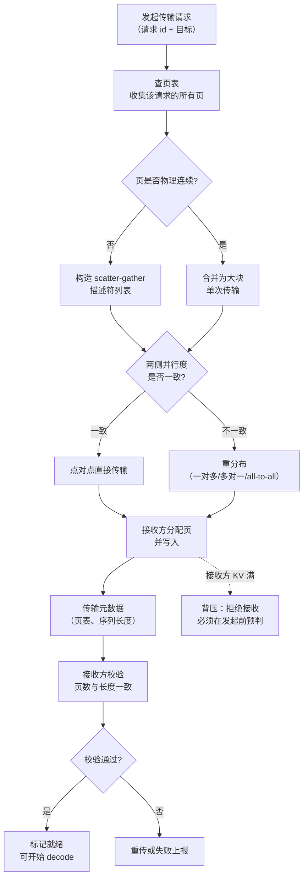
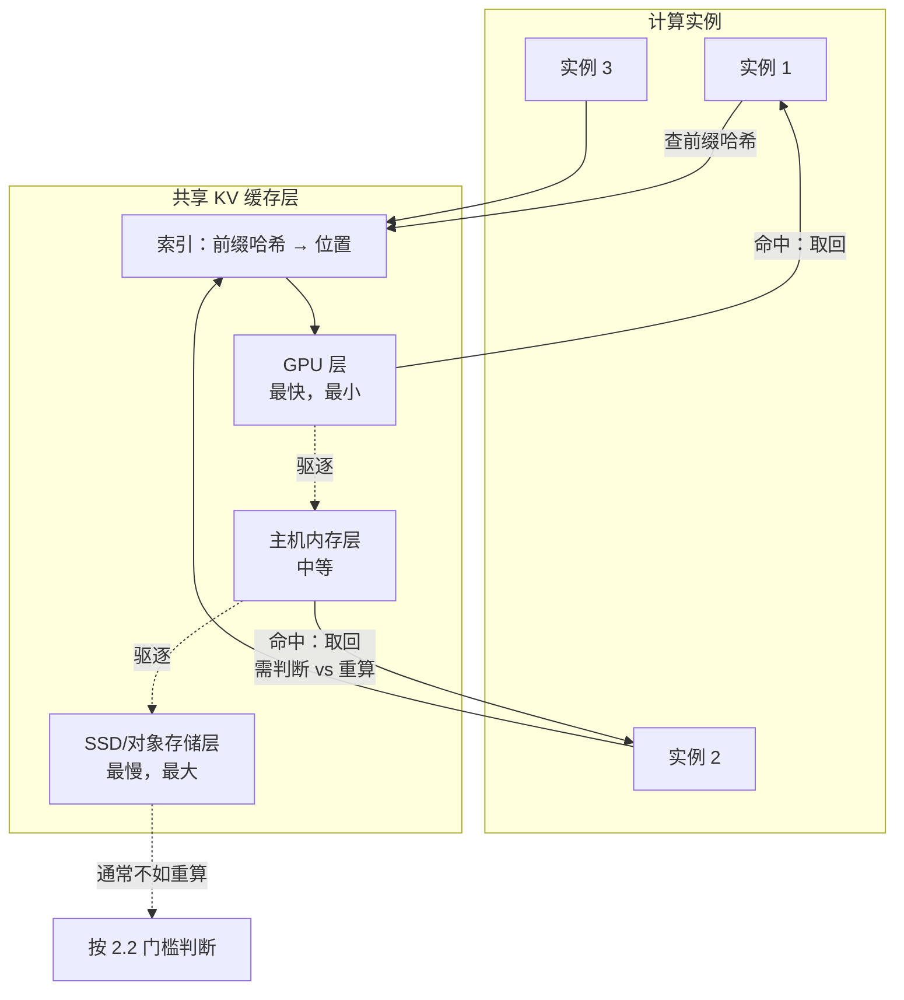
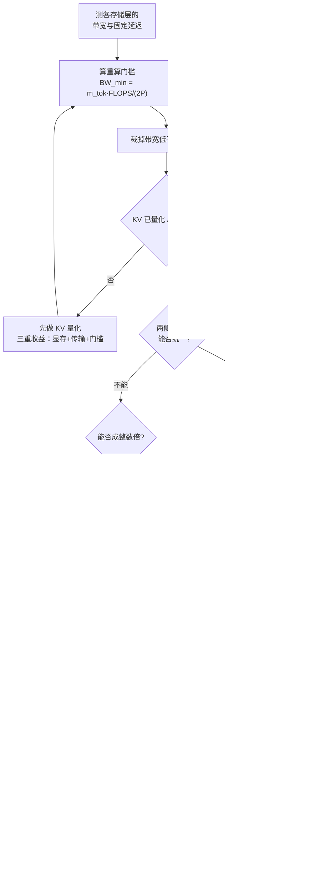

# KV 传输、RDMA 与远端内存

> 位置：[InferenceAtlas](../../INDEX.md) > [模块 06](README.md) > 当前文档
> 信息截至：2026-07-29 ｜ 最后核验：2026-07-29 ｜ 内容版本：v0.1
> 时效性等级：中
> 相关主题：[prefill/decode 分离](07_prefill_decode_disaggregation.md)｜[PagedAttention 与 KV 内存管理](../03_serving_engines_and_scheduling/03_pagedattention_and_kv_memory_management.md)｜[KV cache 压缩与量化](../02_transformer_and_kv_cache/08_kv_cache_compression_quantization_and_eviction.md)

## 本章导读

一旦 KV cache 需要离开产生它的那张卡——传给另一个池、换出到主机内存、写进共享缓存层——就进入了本章的主题。这在三种场景下发生：

1. **prefill/decode 分离**：每请求一次，从 prefill 池传到 decode 池；
2. **KV 卸载**：显存不够时换出到 CPU 内存或更远的存储；
3. **共享缓存层**：让多个实例复用同一份前缀 KV。

三种场景的访问模式差异很大——第一种是一次性的大块单向传输，第二种是可能反复换入换出，第三种是多读少写。但它们共享同一套底层约束：**KV 是分页的、分片的、且带有元数据**，不是一段连续内存。这使得"传 KV"远比"传一个张量"复杂。

本章建立 KV 传输的完整框架：**存储层次与各层的可行性判据**、**分页布局对传输的影响**、**并行度不一致时的重分布**，以及**传输与计算重叠的条件**。

一个贯穿全章的量化工具是**"传输 vs 重算"的比较**：KV 既可以搬运，也可以从原始 token 重新计算。哪个更便宜取决于上下文长度、互联带宽与算力的比值——这个判据在卸载、缓存驱逐、故障恢复等多个场景下反复出现。

## 学习目标

读完本章后，读者应能够：

1. 列出 KV 存储层次的各层，并推导每层的"值得使用"判据；
2. 写出"传输 vs 重算"的比较判据，并说明它在什么长度上翻转；
3. 说明分页 KV 的布局如何影响传输效率，以及如何优化；
4. 描述两侧并行度不一致时的 KV 重分布过程与代价；
5. 设计 KV 传输的失败处理与背压机制。

## 核心结论

- **KV 传输的相对代价与序列长度无关**（传输量与产生它的计算量都正比于长度），因此"值不值得传"是一个由模型与硬件决定的常数判据。
- **"传输 vs 重算"的翻转点由 $\frac{P}{L H_{kv} d_h b_{kv}}$ 与 $\frac{\text{FLOPS}}{\text{BW}}$ 的比较决定**——同样与长度无关。
- **分页 KV 的非连续布局是传输效率的主要损失来源**：小块散列传输的有效带宽远低于大块连续传输。
- **GQA 与 KV 量化直接按比例降低传输量**，是让所有 KV 传输场景都更可行的基础手段。
- **传输必须有背压与失败回退**，否则接收端 KV 满时会造成请求卡死或 OOM。

## 1. 问题定义、系统边界与工作负载

### 1.1 三种传输场景

| 场景 | 方向 | 频率 | 大小 | 时延敏感 |
|---|---|---|---|---|
| **PD 分离传输** | prefill 池 → decode 池 | 每请求一次 | 整个 prompt 的 KV | 高（在 TTFT 路径） |
| **KV 卸载/换入** | 显存 ↔ 主机内存/存储 | 按需，可能反复 | 单请求或部分页 | 中（换入在关键路径） |
| **共享前缀缓存** | 缓存层 → 计算实例 | 命中时 | 前缀部分的 KV | 高（在 TTFT 路径） |

**共同点**：都是把 KV 从一处搬到另一处，都受分页布局与并行切分方式约束。
**差异点**：卸载可能反复发生（换出再换入），因此对带宽的持续消耗更大；分离传输是一次性的。

### 1.2 KV 的结构复杂性

KV cache 不是一个简单的连续张量。它有三重结构：

| 维度 | 说明 | 对传输的影响 |
|---|---|---|
| **分页** | 按固定大小的页组织，物理上不连续 | 需要 scatter-gather，小块传输 |
| **分片** | 按 TP 度切到多设备（按头），按 PP 切到多设备（按层） | 传输需要多方参与 |
| **元数据** | 页表、引用计数、序列长度 | 必须与数据一致地传输 |

**一个请求的 KV 在物理上是"若干个分散的页 × 若干个设备"**。传输它意味着：

$$
\text{传输操作数} \approx N_{\text{pages}} \times N_{\text{devices}}
$$

而不是一次大传输。这是传输效率损失的主要来源（见 2.3）。

### 1.3 存储层次

| 层 | 典型带宽量级 | 典型容量量级 | 访问方式 |
|---|---|---|---|
| 本卡 HBM | 最高 | 最小 | 直接访问 |
| 同节点其他卡 | 高（节点内互联） | 中 | 设备间拷贝 |
| 主机 DRAM | 中（PCIe/CXL） | 大 | DMA |
| 跨节点显存 | 中（RDMA） | 大 | RDMA |
| 本地 SSD | 低 | 很大 | 块 IO |
| 远端对象存储 | 最低 | 极大 | 网络 IO |

**本库不给出具体带宽数字**——它们高度依赖硬件代次与配置，且当前环境无法核验一手规格（见 [AGENTS.md 第 11 节](../../AGENTS.md)）。**读者必须自测本系统各层的实际带宽与延迟**，这是本章所有判据的必需输入。

## 2. 原理、数学与性能模型

### 2.1 传输 vs 重算

这是本章最重要的判据，在多个场景下反复出现。

**给定一段长度为 $S$ 的 KV，两种获得方式**：

**（a）传输**：从某处搬过来。

$$
T_{\text{transfer}} = \frac{2 L S H_{kv} d_h b_{kv}}{\text{BW}_{\text{link}}} + \alpha
$$

**（b）重算**：从原始 token 重新 prefill。

$$
T_{\text{recompute}} \approx \frac{2 P S}{\text{FLOPS}_{\text{eff}}} + \frac{c_{\text{attn}} L S^2 d}{\text{FLOPS}_{\text{eff}}}
$$

第二项是注意力的二次项（$c_{\text{attn}}$ 为常数因子）。**先忽略它**（短序列下可忽略）：

$$
\frac{T_{\text{transfer}}}{T_{\text{recompute}}} \approx \frac{2 L H_{kv} d_h b_{kv}}{\text{BW}_{\text{link}}} \cdot \frac{\text{FLOPS}_{\text{eff}}}{2P} = \underbrace{\frac{L H_{kv} d_h b_{kv}}{P}}_{\text{模型结构}} \cdot \underbrace{\frac{\text{FLOPS}_{\text{eff}}}{\text{BW}_{\text{link}}}}_{\text{硬件}}
$$

- **$S$ 约掉了**——比值与序列长度无关（在忽略注意力二次项时）。
- **左因子的含义**：$L H_{kv} d_h b_{kv}$ 是每 token 的 KV 字节数（$m_{\text{tok}}$），$P$ 是参数量。所以左因子就是 $m_{\text{tok}}/P$——**"每字节 KV 背后有多少参数"的倒数**。
- **右因子**：硬件的算力-互联比。

**判据**：

$$
\boxed{\ \text{传输更优} \iff \frac{m_{\text{tok}}}{P} \cdot \frac{\text{FLOPS}_{\text{eff}}}{\text{BW}_{\text{link}}} < 1\ }
$$

**读法**：
- **模型参数量越大**（$P$ 大）→ 重算越贵 → 传输越划算；
- **KV 越小**（GQA、MQA、MLA、量化让 $m_{\text{tok}}$ 小）→ 传输越便宜 → 传输越划算；
- **互联带宽越高** → 传输越划算；
- **算力越强** → 重算越便宜 → 重算越划算。

**注意力二次项的修正**：在长序列下，$T_{\text{recompute}}$ 的二次项不可忽略，重算变得更贵。因此：

> **序列越长，传输相对越划算**。上述"与长度无关"的结论只在忽略二次项时成立；计入后，长序列偏向传输。

**这个判据在四个场景下都适用**：

| 场景 | 应用 |
|---|---|
| 卸载后取回 | 换入 vs 重新 prefill |
| PD 分离 | 传 KV vs 在 decode 池重算 prompt |
| 抢占恢复 | 换出保留 vs 丢弃重算 |
| 前缀缓存 | 从缓存层取 vs 重算前缀 |

### 2.2 存储层次的可行性判据

对存储层次中的每一层，它"值得使用"的条件是：**从该层取回的时间，小于重算的时间**。

$$
\frac{m_{\text{tok}} \cdot S}{\text{BW}_{\text{layer}}} < \frac{2PS}{\text{FLOPS}_{\text{eff}}} \quad\Longleftrightarrow\quad \text{BW}_{\text{layer}} > \frac{m_{\text{tok}} \cdot \text{FLOPS}_{\text{eff}}}{2P}
$$

**这给出了每一层的"最低带宽门槛"**：

$$
\text{BW}_{\min} = \frac{m_{\text{tok}}}{2P} \cdot \text{FLOPS}_{\text{eff}}
$$

- 带宽低于 $\text{BW}_{\min}$ 的存储层，**从它取回还不如重算**——除非重算不可行（例如原始 token 已丢失，或重算会占用宝贵的算力）。
- **GQA 与量化降低 $m_{\text{tok}}$，从而降低门槛，使更慢的存储层变得可用**。这是一个重要的连锁效应：KV 压缩不只省显存，还**扩大了可用的存储层次**。

**但"重算更快"不等于"应该重算"**：重算消耗算力，而算力可能正被其他请求使用。在算力紧张而互联空闲时，即使传输慢一些也可能是更好的全局选择。**这个判据给出的是单请求时延的比较，不是资源全局最优的比较**。

### 2.3 分页布局对传输效率的影响

KV 按页组织，一个请求的页在物理上分散。传输时需要 scatter-gather，实际有效带宽低于连续传输。

**有效带宽模型**：

$$
\text{BW}_{\text{eff}} = \frac{\text{BW}_{\text{peak}}}{1 + \frac{\alpha_{\text{op}} \cdot \text{BW}_{\text{peak}}}{S_{\text{page}}}}
$$

- $S_{\text{page}}$：单次传输操作的字节数（一个页或若干合并的页）；
- $\alpha_{\text{op}}$：单次传输操作的固定开销（s）。
- **直觉**：块越大，固定开销被摊得越薄，有效带宽越接近峰值。
- **临界块大小**：当 $S_{\text{page}} = \alpha_{\text{op}} \cdot \text{BW}_{\text{peak}}$ 时，有效带宽为峰值的一半。这个乘积是一个有用的经验量——**它给出了"块要多大才不亏"的下界**。

**单页的 KV 大小**：

$$
S_{\text{page}}^{\text{KV}} = \text{（页内 token 数）} \times m_{\text{tok}} / (\text{TP 度}) \times \text{（该设备持有的层数）}
$$

**优化手段**：

| 手段 | 做法 | 效果 |
|---|---|---|
| **页合并** | 把物理相邻的页合并为一次传输 | 提高单次块大小 |
| **批量描述符** | 一次提交多个 scatter-gather 描述符 | 摊薄提交开销 |
| **增大页大小** | 用更大的 KV 页 | 块更大，但内部碎片增加 |
| **连续分配** | 为要传输的请求优先分配连续页 | 需要分配器支持 |
| **异步流水** | 传输与后续计算重叠 | 隐藏而非减少 |

**"增大页大小"的取舍**：大页让传输高效，但增加内部碎片（一个序列的最后一页平均浪费半页）。碎片浪费

$$
\text{碎片比例} \approx \frac{\text{页内 token 数}/2}{S_{\text{avg}}}
$$

- 短序列多的负载下，大页的碎片代价高。
- **这是一个传输效率与显存效率的直接冲突**，需要按负载的序列长度分布来定。

### 2.4 并行度不一致时的重分布

若发送方与接收方的 TP 度不同，KV 的切分方式不同，需要重分布。

**发送方 TP=$N_s$**：设备 $i$ 持有头 $[i \cdot H_{kv}/N_s, (i+1) \cdot H_{kv}/N_s)$。
**接收方 TP=$N_r$**：设备 $j$ 需要头 $[j \cdot H_{kv}/N_r, (j+1) \cdot H_{kv}/N_r)$。

**三种情况**：

| 关系 | 通信模式 | 代价 |
|---|---|---|
| $N_s = N_r$ | 一对一直接拷贝 | 最低 |
| $N_r = c \cdot N_s$（接收方更细） | 一对多广播/切分 | 中，每个发送方发给 $c$ 个接收方 |
| $N_s = c \cdot N_r$（发送方更细） | 多对一汇聚 | 中，每个接收方从 $c$ 个发送方收 |
| 互不整除 | 一般的 all-to-all | **最高**，需要完整的重排 |

**总传输量不变**（都是 $M_{\text{KV}}$），但**操作数与固定开销显著不同**：

$$
N_{\text{ops}} \approx N_{\text{pages}} \times \max(N_s, N_r) / \gcd(N_s, N_r)
$$

**结论**：**尽量让两侧的 KV 相关并行度相同或成整数倍关系**。互不整除是最差的情况，应当避免。

**PP 维度的重分布**：若两侧 PP 度不同，KV 按层的分布不同。这同样需要重分布，但结构更简单——层是一维的，重分布就是按层区间重新分配。

**层与头的组合**：若两侧 TP 与 PP 都不同，重分布是二维的。**实践中应当避免这种配置**——把复杂度控制在只有一个维度不同。

### 2.5 传输与计算的重叠

（与 [prefill/decode 分离](07_prefill_decode_disaggregation.md) 3.2 的逐层流水同源，这里给出更一般的形式。）

**重叠的一般条件**：

$$
T_{\text{compute}}(\text{单位工作}) \ge T_{\text{transfer}}(\text{对应的 KV})
$$

**三个场景的具体形式**：

| 场景 | 计算单位 | 条件 |
|---|---|---|
| PD 分离（逐层） | 一层的 prefill | $\frac{P}{L \cdot m_{\text{tok}}} \ge \frac{\text{FLOPS}}{\text{BW}}$ |
| 卸载换入 | 后续层的计算 | 取决于换入的粒度 |
| 前缀缓存取回 | 未命中部分的 prefill | 命中率越低越容易重叠 |

**"前缀缓存取回"这一行有一个有趣的性质**：命中的前缀越长，要取回的 KV 越多（传输时间长），但要重算的部分越少（计算时间短）——**两者反向变化，重叠越难**。

$$
\text{命中率} \uparrow \;\Rightarrow\; T_{\text{transfer}} \uparrow,\ T_{\text{compute}} \downarrow \;\Rightarrow\; \text{重叠更难}
$$

**极端情况：100% 命中**。此时没有任何计算可以用来掩盖传输，取回时间完全暴露在 TTFT 上。

$$
\text{TTFT}_{\text{full-hit}} \approx \frac{m_{\text{tok}} \cdot S}{\text{BW}_{\text{layer}}} + T_{\text{first-step}}
$$

**这是一个反直觉的结论**：**缓存命中率越高，取回的传输时间越暴露**。若缓存层的带宽不够，高命中率的收益会被传输时间部分抵消。这解释了为什么前缀缓存通常优先放在最快的层（本卡显存 → 同节点 → 主机内存），而不是简单地"放得下就行"。

## 3. 实现机制与系统设计

### 3.1 KV 传输的完整路径



**图解读**：
1. **本图展示什么**：KV 传输的完整链路——收集页、判断连续性、处理并行度不一致、传输数据与元数据、校验、就绪。
2. **核心瓶颈**：瓶颈是"页是否物理连续"这个分叉。非连续路径产生大量小块传输，有效带宽可能只有峰值的一小部分（2.3）。这是实践中 KV 传输达不到理论带宽的首要原因。
3. **图中的 trade-off**：右下的背压环节是可用性与效率的交换点。严格的背压会拒绝一些请求（可用性下降），宽松则可能 OOM。正确做法是**在发起传输前就预判接收方容量**，而不是传到一半才发现放不下。
4. **面试如何引用**：被问"KV 怎么传"时，用这张图指出两个非平凡点——**分页导致的散列传输**与**元数据必须与数据一致地传输**，这比只讲"用 RDMA 传张量"深入得多。

**元数据的重要性**：数据传完不等于可用。接收方必须知道：这些页属于哪个请求、逻辑顺序是什么、序列有多长、用的是什么量化 scale（若 KV 量化）。**元数据与数据的不一致会导致静默的数值错误**——模型仍然输出，但注意力读到的是错位的 KV。

### 3.2 传输的实现

```
function transfer_kv(request_id, src_engine, dst_engine):
    # --- 1. 预判接收方容量（必须在传输前）---
    needed_pages = src_engine.page_count(request_id)
    if not dst_engine.reserve(request_id, needed_pages):
        return REJECT_INSUFFICIENT_KV      # 不要传到一半才发现

    # --- 2. 收集页并尝试合并 ---
    pages = src_engine.page_table[request_id]         # 物理页号列表
    segments = merge_contiguous(pages)                # [(start, count), ...]
    log_metric("kv_transfer_segments", len(segments)) # 段数越少越好

    # --- 3. 并行度检查 ---
    if src_engine.tp_size != dst_engine.tp_size:
        plan = build_redistribution_plan(src_engine.tp_size, dst_engine.tp_size)
        warn_if(gcd(src_engine.tp_size, dst_engine.tp_size) == 1,
                "TP 度互质，重分布代价最高")
    else:
        plan = direct_plan()

    # --- 4. 逐层流水传输（若可重叠）---
    for layer_group in layer_groups(group_size=g):
        post_async_transfer(segments, layer_group, plan)
        # 与该层组之后的计算重叠

    wait_all_transfers()

    # --- 5. 传输元数据并校验 ---
    meta = {
        "request_id":  request_id,
        "seq_len":     src_engine.seq_len(request_id),
        "page_order":  logical_page_order(request_id),
        "kv_dtype":    src_engine.kv_dtype,
        "kv_scales":   src_engine.kv_scales(request_id),   # 若量化
        "model_hash":  src_engine.model_hash,
    }
    dst_engine.receive_meta(meta)

    if dst_engine.model_hash != meta["model_hash"]:
        return FAIL_MODEL_MISMATCH          # 必须校验，否则静默错误
    if dst_engine.received_pages(request_id) != needed_pages:
        return FAIL_INCOMPLETE

    dst_engine.mark_ready(request_id)
    return OK
```

**五个实现要点**：

1. **容量预判必须在传输前**。传到一半发现放不下，前面的传输与之前的 prefill 全部白费。
2. **段数是一个必须监控的指标**。段数远大于页数下界，说明页高度分散，有效带宽会很差。
3. **模型哈希校验**。两侧模型版本不一致会导致静默的数值错误——KV 是有效的字节，但对应的是另一个模型的表示。
4. **量化 scale 必须随数据传输**。若 KV 被量化，scale 是解读数据的必需信息，漏传会导致完全错误的结果。
5. **完整性校验**。页数不符时必须失败而非继续，否则会读到未初始化的页。

### 3.3 卸载的特殊考虑

卸载（换出到主机内存或存储）与 PD 分离传输有一个关键差异：**它可能反复发生**。

**换出-换入的往返成本**：

$$
c_{\text{roundtrip}} = \frac{2 M_{\text{KV}}}{\text{BW}_{\text{link}}}
$$

**何时值得换出**（见 [工具调用与 agent 循环](../05_decoding_and_generation_algorithms/08_tool_use_and_agent_inference.md) 2.3）：

$$
T_{\text{idle}} > c_{\text{roundtrip}}
$$

- 只有当该请求会闲置足够久，释放出来的显存才真正有价值。

**抖动风险**：如果换出判断过于激进，会出现"刚换出就要换入"的抖动，往返成本白付。缓解：
- 设置最小闲置时间阈值（滞回）；
- 优先换出预期闲置最久的请求（如等待慢工具的 agent 请求）。

**分层卸载**：可以有多级——GPU → 主机内存 → SSD。每级的判据是 2.2 的带宽门槛。**低于门槛的层只在"重算不可行"时才有意义**（例如原始 token 已经不在，或算力已饱和）。

### 3.4 共享 KV 缓存层

让多个实例共享一份前缀 KV，需要一个独立的缓存层。



**图解读**：
1. **本图展示什么**：一个分层的共享 KV 缓存，多个计算实例通过前缀哈希查询，命中后从对应层取回；未命中或该层太慢则重算。
2. **核心瓶颈**：瓶颈是每一层的带宽是否超过 2.2 的门槛 $\text{BW}_{\min} = \frac{m_{\text{tok}}}{2P}\text{FLOPS}$。低于门槛的层（图中的 SSD/对象存储）通常不如重算——**它们存了也白存**，除非算力紧张。
3. **图中的 trade-off**：层数越多容量越大、命中率越高，但慢层的命中可能是负收益（取回比重算慢）。因此缓存层的设计不是"越大越好"，而是要按门槛裁剪。
4. **面试如何引用**：被问"共享 KV 缓存怎么设计"时，用这张图指出关键判据是**每层带宽 vs 重算门槛**，并说明低于门槛的层是伪收益——这个视角比讨论缓存算法更本质。

**索引的一致性要求**：前缀哈希必须包含所有影响 KV 的因素：

| 必须计入哈希 | 理由 |
|---|---|
| token 序列 | 显然 |
| 模型标识与版本 | 不同模型的 KV 不通用 |
| KV 量化配置 | 不同精度的 KV 不通用 |
| 位置编码配置 | 若 RoPE 基频等参数不同 |
| TP 切分方式 | 分片方式不同则布局不同 |

**漏掉任何一项都会导致静默的错误命中**——取回的 KV 是"有效的字节但错误的语义"。

### 3.5 背压与失败处理

| 情形 | 处理 |
|---|---|
| 接收方 KV 不足 | **传输前拒绝**，请求排队或降级 |
| 传输中断 | 重传（若源仍持有）或回退到重算 |
| 源已释放 KV | 只能重算；因此源应在确认接收前保留 |
| 元数据校验失败 | 丢弃已传数据，重传或失败上报 |
| 传输超时 | 超时后回退到重算，并记录 |

**"源应在确认接收前保留"是一个关键的资源管理约束**：这意味着传输期间 KV 在两侧各占一份。在紧张的显存下，这个双占用本身可能成为问题。

$$
M_{\text{peak}} = M_{\text{src}} + M_{\text{dst}} \quad \text{（传输期间）}
$$

**缓解**：逐层传输时，可以在确认第 $i$ 层送达后就释放源侧第 $i$ 层——把双占用从"整个 KV"降到"一层的 KV"。代价是需要逐层确认（更多往返）。

### 3.6 与其他技术的交互

| 技术 | 交互 |
|---|---|
| KV 量化 | **直接按比例降低传输量**，是最有效的基础优化 |
| GQA/MLA | 同上，降低 $m_{\text{tok}}$ |
| 分页 KV | 提供了传输的基本单位，但非连续性是效率损失来源 |
| 前缀缓存 | 传输的主要消费者之一 |
| CP | prefill 用 CP 时，KV 按序列切分，传给 decode 需重分布为按头切分 |
| 投机解码 | 被拒绝的候选 KV 不应传输；需在传输前压缩 |
| 抢占 | 换出是抢占的一种实现，判据同 2.1 |

**"投机解码的候选 KV 不应传输"**：树形投机会临时产生 $N_{\text{nodes}}$ 个候选位置的 KV，其中大部分会被拒绝。传输前必须先做 KV 压缩（保留接受路径），否则会传输大量无用数据。

## 4. 性能、成本、能耗与可靠性 trade-off

### 4.1 优化手段的收益排序

| 手段 | 对传输量的影响 | 实施成本 | 副作用 |
|---|---|---|---|
| **KV 量化** | 按 $b_{kv}$ 比例下降 | 低 | 精度损失（通常可接受） |
| **GQA/MQA** | 按 $H_{kv}/H$ 下降 | 模型侧决定 | 需要模型支持 |
| **页合并/大页** | 提高有效带宽 | 中 | 内部碎片增加 |
| **逐层流水重叠** | 隐藏而非减少 | 中 | 固定延迟累积 |
| **统一两侧并行度** | 减少操作数 | 低 | 牺牲配置灵活性 |
| **更快的互联** | 提高 $\text{BW}$ | 高（硬件） | 成本 |

**优先级建议**：**先做 KV 量化**。它同时降低显存占用、传输量、以及 2.2 的存储层门槛（使更慢的层变可用），是三重收益，且实施成本低。

### 4.2 传输 vs 重算的资源视角

2.1 的判据是**时延视角**。从**资源视角**看，两者消耗不同的资源：

| 方式 | 消耗 | 何时更优 |
|---|---|---|
| 传输 | 互联带宽 | 算力紧张、互联空闲 |
| 重算 | 算力 | 互联紧张、算力空闲 |

**因此最优选择依赖当前的资源状态**，而非固定的判据。一个自适应的策略：

$$
\text{选择传输} \iff \frac{T_{\text{transfer}}}{T_{\text{recompute}}} < \frac{u_{\text{compute}}}{u_{\text{link}}}
$$

- $u_{\text{compute}}$、$u_{\text{link}}$：当前的算力与互联利用率。
- **直觉**：算力越忙（$u_{\text{compute}}$ 大），越应该用传输；互联越忙，越应该重算。
- **局限**：这是一个启发式，不是最优解；且利用率的测量有滞后。

**这个视角在混合负载下有实际价值**：例如 prefill 密集时段算力紧张，应倾向传输；decode 密集时段算力有余，可以倾向重算。

### 4.3 能耗

| 方式 | 能耗来源 |
|---|---|
| 传输 | 互联链路 + DMA 引擎 |
| 重算 | 计算单元 + 权重读取 |

一般而言，**数据搬运的每字节能耗低于计算的每 FLOP 能耗对应的搬运量**——即传输通常更省能。但这依赖具体硬件，且传输期间设备可能空转（若不重叠）。

**准确的比较需要实测**：分别测量两种方式下的功耗积分。本库不给出数字。

### 4.4 可靠性

| 风险 | 后果 | 缓解 |
|---|---|---|
| 元数据与数据不一致 | 静默数值错误 | 完整性校验（3.2） |
| 模型版本不一致 | 静默数值错误 | 模型哈希校验 |
| 量化 scale 漏传 | 完全错误的输出 | scale 纳入元数据 |
| 前缀哈希漏因子 | 错误命中（3.4） | 哈希包含全部影响因子 |
| 接收方容量不足 | 请求卡死或 OOM | 传输前预留 |
| 源过早释放 | 传输失败无法重试 | 确认接收后再释放 |
| 传输双占用 | 显存峰值翻倍（3.5） | 逐层确认与释放 |
| 换出抖动 | 往返成本白付 | 滞回阈值 |
| 慢存储层的伪命中 | 取回比重算还慢 | 按 2.2 门槛裁剪层次 |

**静默错误是本章的主要可靠性风险**。KV 传输的失败模式大多不是崩溃，而是"传了有效的字节但语义错误"——模型照样输出流畅文本，质量却在下降。**元数据校验（模型哈希、页数、序列长度、量化 scale）是唯一的防线**。

## 5. benchmark、真实案例或公开部署案例

当前环境的网络出口策略阻断了 `arxiv.org`、`docs.nvidia.com` 等一手来源（详见 [AGENTS.md 第 11 节](../../AGENTS.md)）。因此本节**不引用任何具体的互联带宽、RDMA 延迟、存储层性能或实测传输吞吐**。本章的所有判据都以硬件参数为输入，**读者必须自测**。

| 陈述 | 披露标签 | 状态 |
|---|---|---|
| 多个开源框架支持 KV 卸载到主机内存 | `开源代码/配置披露` | `待核实` |
| 部分实现使用 RDMA 做跨节点 KV 传输 | `开源代码/配置披露` | `待核实` |
| 分层前缀缓存已在开源项目中实现 | `开源代码/配置披露` | `待核实` |
| 各存储层的具体带宽与延迟 | — | **不引用**（必须自测） |

**必做的自测清单**（`独立可复现实验`）——本章判据的必需输入：

1. **各层带宽与延迟测量**（最基础）：逐层测量本卡 HBM、同节点卡间、主机内存、跨节点、SSD 的有效带宽与固定延迟 $\alpha_{\text{op}}$。**这是本章所有判据的输入**。
2. **重算门槛计算**：代入 $\text{BW}_{\min} = \frac{m_{\text{tok}}}{2P}\text{FLOPS}_{\text{eff}}$，判断哪些存储层在门槛之上。低于门槛的层应从缓存设计中裁掉。
3. **传输 vs 重算实测**：对同一段 KV，分别测传输与重算的耗时，与 2.1 的比值对比。
4. **分页损失测量**：对比"连续大块传输"与"实际分页 scatter-gather"的有效带宽。这个比值直接反映分页布局的损失。
5. **段数分布**：统计实际传输时的段数与页数之比。接近 1 说明页高度分散，需要合并优化。
6. **临界块大小**：扫描传输块大小，找到有效带宽达峰值一半的点，即 $\alpha_{\text{op}} \cdot \text{BW}_{\text{peak}}$。
7. **重分布代价**：在两侧 TP 度相同/整数倍/互质三种配置下测量传输耗时。验证 2.4 的排序。
8. **KV 量化的传输收益**：改变 $b_{kv}$，测量传输时间的线性变化。
9. **换出抖动率**：统计"换出后多久被换入"的分布，据此设定滞回阈值。
10. **高命中率下的 TTFT**：在前缀缓存命中率接近 1 时测 TTFT，验证 2.5 的"命中率越高传输越暴露"。

> 实验方法论要求见 [如何读推理 benchmark](../00_start_here/03_how_to_read_inference_benchmarks.md)。

## 6. 设计决策框架



**图解读**：
1. **本图展示什么**：KV 传输设计的完整流程——先测硬件、算门槛、裁层次，再优化 KV 大小、统一并行度、改善分页布局，最后加可靠性机制。
2. **核心瓶颈**：瓶颈是最上面的"算重算门槛"。它决定了哪些存储层根本不该被使用——低于门槛的层存了也白存，取回还不如重算。跳过这一步会建出一个看起来命中率高、实际是负收益的缓存。
3. **图中的 trade-off**：中间的"增大页"分支是传输效率与显存碎片的直接冲突，需要按序列长度分布定；"统一并行度"是实现简单性与配置灵活性的交换。
4. **面试如何引用**：被问"KV 传输怎么优化"时，按这张图从"先算门槛"讲起，并强调 KV 量化的三重收益——这展示了从判据出发而非从技术出发的思路。

### 决策清单

| 问题 | 若答案为"是" | 若答案为"否" |
|---|---|---|
| 已测各存储层带宽？ | 可以算门槛 | **先测**，判据无输入 |
| 该层带宽 > $\text{BW}_{\min}$？ | 值得使用 | 取回不如重算，裁掉 |
| KV 已量化/用 GQA？ | 传输量已压低 | **先做**，三重收益 |
| 两侧并行度一致？ | 直接拷贝 | 避免互质配置 |
| 段数/页数接近 1？ | 页高度分散 | 页合并或增大页 |
| 有元数据完整性校验？ | — | **必须加**，静默错误风险 |
| 传输前预留接收方容量？ | 不会白传 | prefill + 传输可能全废 |
| 源在确认接收后才释放？ | 可重试 | 失败无法恢复 |

## 7. 常见失败模式与排查路径

| 症状 | 可能原因 | 排查步骤 |
|---|---|---|
| 传输带宽远低于峰值 | 分页散列，块太小（2.3） | 统计段数/页数比；测临界块大小 |
| 输出流畅但质量下降 | 元数据不一致（4.4） | 校验模型哈希、页数、序列长度 |
| 输出完全错乱 | 量化 scale 漏传（3.2） | 检查元数据是否含 scale |
| 缓存命中却更慢 | 该层带宽低于门槛（2.2） | 算 $\text{BW}_{\min}$；裁掉慢层 |
| 命中率高时 TTFT 反而差 | 传输无法被计算掩盖（2.5） | 把热前缀提升到更快的层 |
| 传输后请求卡住 | 接收方 KV 不足（3.5） | 传输前预留；加背压 |
| prefill 白算 | 未预判接收容量 | 把预留提前到 prefill 之前 |
| 换出后立即换入 | 抖动（3.3） | 加最小闲置时间阈值 |
| 显存峰值超预期 | 传输期间双占用（3.5） | 逐层确认并释放源侧 |
| 重分布耗时异常高 | 两侧 TP 度互质（2.4） | 调整为相同或整数倍 |
| 前缀缓存错误命中 | 哈希漏了影响因子（3.4） | 检查哈希是否含模型、量化、位置编码配置 |
| 投机解码后传输量异常大 | 未压缩被拒候选的 KV（3.6） | 传输前先做 KV 压缩 |

**排查原则**：KV 传输的问题分两类——**性能类**（分页散列、块太小、重分布）与**正确性类**（元数据、哈希、scale）。正确性类的症状是静默的质量下降，必须靠主动校验发现；性能类先看段数/页数比这一个指标。

## 8. 关联面试主题

1. **"传输 vs 重算"的判据及其与序列长度的关系**——见本章 2.1，核心公式 $\frac{m_{\text{tok}}}{P}\cdot\frac{\text{FLOPS}}{\text{BW}}$。
2. **存储层的最低带宽门槛，以及低于门槛的层为什么是伪收益**——见本章 2.2。
3. **KV 量化为什么是三重收益**——见本章 2.2、4.1：显存、传输量、门槛。
4. **分页布局如何损害传输带宽**——见本章 2.3，散列小块与有效带宽模型。
5. **两侧并行度不一致时的重分布代价，为什么要避免互质**——见本章 2.4。
6. **为什么缓存命中率越高，传输时间越暴露**——见本章 2.5，反直觉但重要。
7. **元数据必须包含哪些内容，漏掉的后果**——见本章 3.2、3.4。
8. **为什么容量预留必须在传输发起之前**——见本章 3.2、4.4。
9. **传输期间的双占用问题及其缓解**——见本章 3.5。
10. **从资源视角看传输 vs 重算的自适应选择**——见本章 4.2。
11. **换出抖动及其滞回缓解**——见本章 3.3。
12. **投机解码的候选 KV 为什么不应传输**——见本章 3.6。

## 9. 小结

KV 传输的核心判据只有一个，但它在很多场景下反复出现：**传输还是重算**。

$$
\text{传输更优} \iff \frac{m_{\text{tok}}}{P} \cdot \frac{\text{FLOPS}_{\text{eff}}}{\text{BW}_{\text{link}}} < 1
$$

左因子是"每字节 KV 背后有多少参数"的倒数，右因子是硬件的算力-互联比。**这个比值与序列长度无关**（忽略注意力二次项时），因此可以在部署前算出。计入注意力的二次项后，**长序列偏向传输**。

由这个判据直接导出**存储层的最低带宽门槛** $\text{BW}_{\min} = \frac{m_{\text{tok}}}{2P}\text{FLOPS}_{\text{eff}}$。带宽低于门槛的存储层，从它取回还不如重算——**存了也白存**。缓存层次的设计应当按这个门槛裁剪，而不是"放得下就存"。

三条实践结论：

**第一，KV 量化是三重收益**。它同时降低显存占用、传输量，以及上述门槛（使更慢的存储层变得可用）。在做任何传输优化之前，先确认 KV 已经量化、模型已经用了 GQA 或更激进的 KV 压缩。

**第二，分页布局是传输效率的主要损失来源**。一个请求的 KV 在物理上是分散的页，传输是 scatter-gather 而非一次大块拷贝。有效带宽随块大小饱和，临界块大小约为 $\alpha_{\text{op}} \cdot \text{BW}_{\text{peak}}$。**"段数/页数比"是一个应当监控的指标**——它直接反映页的分散程度。

**第三，静默错误是主要的可靠性风险**。KV 传输的失败大多不是崩溃，而是"传了有效的字节但语义错误"：模型版本不一致、量化 scale 漏传、前缀哈希漏了影响因子——这些都会让模型照常输出流畅文本，质量却在下降。**元数据的完整性校验是唯一的防线**，必须包含模型哈希、页数、序列长度与量化配置。

还有两个容易被忽略的细节。一是**容量预留必须在传输发起之前**——传到一半发现接收方放不下，之前的 prefill 与传输全部白费。二是一个反直觉的性质：**前缀缓存的命中率越高，取回的传输时间越暴露在 TTFT 上**——因为可用来掩盖传输的计算越少。这解释了为什么热前缀应该优先放在最快的存储层，而不只是"放得下就行"。

## 关键术语

| 中文术语 | 英文 | 定义 | 单位/口径 | 关联文档 |
|---|---|---|---|---|
| 传输 vs 重算 | transfer vs recompute | 获取 KV 的两种方式的比较判据 | — | 本章 2.1 |
| 重算门槛 | recompute threshold | 存储层值得使用的最低带宽 | B/s | 本章 2.2 |
| 每 token KV 字节数 | per-token KV footprint ($m_{\text{tok}}$) | 单个 token 在全部层上的 KV 字节数 | B/token | 本章 2.1 |
| 散列传输 | scatter-gather transfer | 从分散的物理页收集数据的传输方式 | — | 本章 2.3 |
| 临界块大小 | critical block size | 有效带宽达峰值一半时的块大小 | B | 本章 2.3 |
| KV 重分布 | KV redistribution | 两侧并行度不同时的切分方式转换 | — | 本章 2.4 |
| 传输双占用 | dual occupancy | 传输期间源与目标各持一份 KV | B | 本章 3.5 |
| 换出抖动 | swap thrashing | 换出后很快又需换入的反复 | — | 本章 3.3 |
| 前缀哈希 | prefix hash | 用于缓存索引的前缀标识 | — | 本章 3.4 |

## 延伸阅读

- [prefill/decode 分离](07_prefill_decode_disaggregation.md) — KV 传输的主要场景之一
- [PagedAttention 与 KV 内存管理](../03_serving_engines_and_scheduling/03_pagedattention_and_kv_memory_management.md) — 分页布局的来源
- [prompt 缓存与前缀缓存](../03_serving_engines_and_scheduling/08_prompt_caching_and_prefix_caching.md) — 共享缓存层的上层逻辑
- [KV cache 压缩、量化与驱逐](../02_transformer_and_kv_cache/08_kv_cache_compression_quantization_and_eviction.md) — 降低 $m_{\text{tok}}$ 的手段
- [KV cache 容量与内存模型](../02_transformer_and_kv_cache/05_kv_cache_capacity_and_memory_models.md) — $m_{\text{tok}}$ 的推导
- [序列并行与上下文并行](04_sequence_context_parallel_inference.md) — CP 与按头切分之间的重分布
- [工具调用与 agent 循环](../05_decoding_and_generation_algorithms/08_tool_use_and_agent_inference.md) — 等待期换出的判据
- [模块 08 网络与互联](../08_networking_and_interconnect/) — 各层链路的物理基础（规划中）

## 主要来源

本章的判据与模型为本库自洽推导，基于模块 02 的 KV 内存公式与模块 01 的 roofline 框架。**本章不含任何具体的硬件性能数字**——所有判据都以实测的带宽、延迟、算力为输入，读者必须自测（详见第 5 节）。涉及框架实现的陈述已标注为 `待核实`（原因见 [AGENTS.md 第 11 节](../../AGENTS.md)）。

| 类别 | 说明 | 披露标签 |
|---|---|---|
| 传输 vs 重算判据 | 本库推导，已标注忽略注意力二次项 | — |
| 存储层门槛 $\text{BW}_{\min}$ | 由上式导出 | — |
| 有效带宽随块大小的模型 | 标准的固定开销摊薄模型 | — |
| 重分布的操作数估计 | 本库推导 | — |
| 各层带宽与延迟数值 | **本章不给出**，须自测 | — |
| 框架实现能力 | 需一手核验 | `待核实` |

## 更新记录

| 日期 | 版本 | 变更 | 核验人 |
|---|---|---|---|
| 2026-07-29 | v0.1 | 初稿：传输 vs 重算判据与存储层门槛、分页布局对带宽的损害、并行度不一致的重分布、命中率与传输暴露的反直觉关系、元数据校验与背压 | — |
