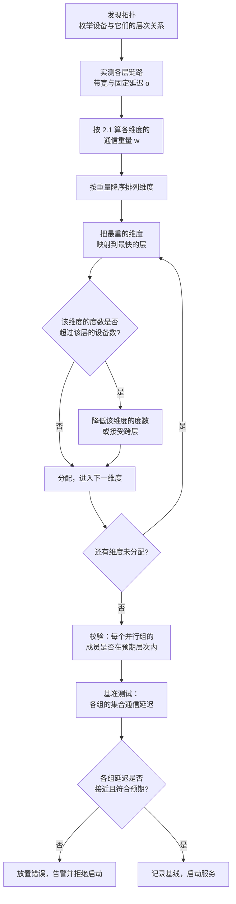
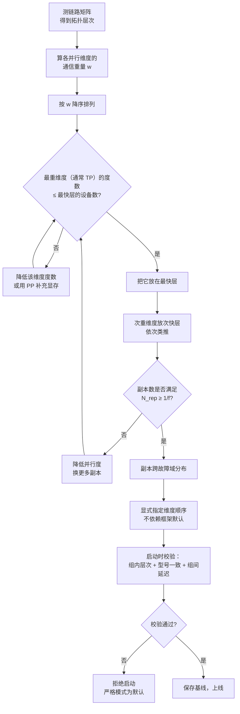

# 多节点服务拓扑与放置策略

> 位置：[InferenceAtlas](../../INDEX.md) > [模块 06](README.md) > 当前文档
> 信息截至：2026-07-29 ｜ 最后核验：2026-07-29 ｜ 内容版本：v0.1
> 时效性等级：中
> 相关主题：[分布式推理总览](01_distributed_inference_overview.md)｜`10_fault_tolerance_and_graceful_degradation.md`｜[自动扩缩容与负载均衡](../03_serving_engines_and_scheduling/10_autoscaling_and_load_balancing.md)

## 本章导读

前八章讨论了各种并行方式的原理与代价。本章回答一个更具体的工程问题：**给定一批设备和一个模型，具体把哪个并行组放在哪些设备上**。

这个问题之所以重要，是因为**放置错误的代价是静默且巨大的**。一个 TP 组被无意中跨越了互联域边界，性能可能下降数倍，但服务照常运行、日志毫无异常。这类问题在生产中可能存在数月而无人察觉——直到有人做了一次对照测试。

本章建立放置的系统框架：

1. **通信亲和性的优先级**：不同并行维度对链路的要求差异极大（TP 每步 $2L$ 次、PP 只有 $N_{\text{PP}}-1$ 次），因此放置必须按"通信重量"排序；
2. **拓扑的层次结构**：从卡内、同互联域、同节点、同机架到跨机架，每一层的带宽与延迟差异是数量级的；
3. **放置的校验方法**：如何在启动时自动发现放置错误，而不是靠事后的性能对比。

本章还讨论**故障域的形状**——放置不仅决定性能，也决定"一个部件失效会影响多少服务能力"。这两个目标经常冲突：把 TP 组集中在一个节点内性能最好，但也让整节点成为一个故障域。

## 学习目标

读完本章后，读者应能够：

1. 按通信重量对并行维度排序，并据此确定放置优先级；
2. 描述典型的拓扑层次，并说明每层跨越的代价量级；
3. 写出 rank 到设备的映射规则，并设计启动时的自动校验；
4. 分析放置对故障域形状的影响，并权衡性能与可用性；
5. 识别并诊断常见的放置错误。

## 核心结论

- **放置优先级由通信频率决定**：TP（$2L$ 次/步）> CP（数据量大）> EP（all-to-all）> PP（次数少）> 副本（零通信）。
- **放置错误是静默的**：服务正常运行、无报错，只是慢数倍。**启动时的自动校验是唯一可靠的防线**。
- **rank 映射不能依赖框架默认值**：不同框架的默认映射不同，迁移时是高频故障源。必须显式指定并校验。
- **性能与故障域直接冲突**：并行组越集中性能越好，故障域也越大。这个权衡必须显式做出而非默认。
- **副本应跨故障域分布**，并行组应在故障域内集中——这是两个方向相反但同时成立的原则。

## 1. 问题定义、系统边界与工作负载

### 1.1 放置问题的形式

给定：
- $N$ 个设备，组织在某种拓扑中（卡 → 互联域 → 节点 → 机架）；
- 一个并行配置 $(N_{\text{TP}}, N_{\text{PP}}, N_{\text{EP}}, N_{\text{CP}}, N_{\text{replica}})$，满足 $\prod = N$；

求：一个映射 $\text{rank} \to \text{device}$，使得**通信最重的维度落在最快的链路上**。

**这不是一个自由的优化问题**——大多数框架只允许指定并行维度的顺序（哪个维度变化最快），而不是任意映射。因此实际问题是：**选择正确的维度顺序**。

### 1.2 拓扑的层次

| 层次 | 跨越的代价 | 典型的组织单位 |
|---|---|---|
| 同卡 | 无 | — |
| 同互联域 | 低（专用高速互联） | 若干张卡的全互联或环形组 |
| 同节点跨互联域 | 中（可能走 PCIe/主机） | 一台服务器内的多个互联组 |
| 同机架跨节点 | 高（网络，但通常同交换机） | 一个机架 |
| 跨机架 | 最高（多跳网络） | 数据中心 |

**本库不给出具体的带宽与延迟数字**——它们高度依赖硬件代次与网络配置，且当前环境无法核验一手规格（见 [AGENTS.md 第 11 节](../../AGENTS.md)）。**读者必须实测本系统各层的带宽与延迟**，这是所有放置决策的输入。

**关键的定性事实**：**相邻两层之间的差异通常是数量级的**，而不是百分比。这就是为什么跨越一层边界会造成断崖式的性能下降，而不是渐进的劣化。

### 1.3 各并行维度的通信画像

| 维度 | 每步通信次数 | 单次数据量 | 通信类型 | 对延迟敏感 | 对带宽敏感 |
|---|---|---|---|---|---|
| TP | $2L$ | $B S_{\text{new}} d b_a$ | all-reduce | **极高** | 中 |
| CP | $N_{\text{CP}}-1$（每层） | KV 块 | ring | 中 | **极高** |
| EP | 2（每 MoE 层） | $n k d b_a$ | all-to-all | 高 | 高 |
| PP | $N_{\text{PP}}-1$ | $B_{\text{micro}} S_{\text{new}} d b_a$ | send/recv | 低 | 低 |
| 副本 | 0 | 0 | — | — | — |

**"对延迟敏感"与"对带宽敏感"要分开看**：

- **TP 对延迟极敏感**：decode 阶段每步 $2L$ 次小消息，固定延迟 $\alpha$ 累积 $2L$ 遍（见 [张量并行推理](02_tensor_parallel_inference.md) 2.3）；
- **CP 对带宽极敏感**：要流转整个 KV，数据量大但次数少；
- **PP 两者都不敏感**：次数少、数据量小。

**这个区分直接影响放置**：如果某条链路延迟低但带宽一般，它适合放 TP；带宽高但延迟一般，适合放 CP。

## 2. 原理、数学与性能模型

### 2.1 通信重量与放置优先级

定义一个维度的**通信重量**为它每步在链路上产生的时间开销：

$$
w_{\text{dim}} = n_{\text{ops}} \cdot \alpha + \frac{D_{\text{total}}}{\text{BW}}
$$

- $n_{\text{ops}}$：每步的通信操作次数；
- $D_{\text{total}}$：每步的总传输字节数。

**放置原则**：**通信重量大的维度，放在 $\alpha$ 小、$\text{BW}$ 大的链路上**。

**decode 阶段的重量排序**（代入各维度的参数）：

| 维度 | $n_{\text{ops}}$ | $D_{\text{total}}$（decode） |
|---|---|---|
| TP | $2L$ | $2L \cdot 2 B d b_a$ |
| EP | $2 L_{\text{moe}}$ | $2 L_{\text{moe}} B k d b_a$ |
| CP | $L(N_{\text{CP}}-1)$ | $L \cdot M_{\text{KV}} \cdot \frac{N_{\text{CP}}-1}{N_{\text{CP}}}$ |
| PP | $N_{\text{PP}}-1$ | $(N_{\text{PP}}-1) B d b_a$ |

**注意 CP 那一行**：decode 时 CP 需要流转整个 KV，而 $M_{\text{KV}}$ 在长上下文下可能远大于其他项。这就是为什么 [序列并行与上下文并行](04_sequence_context_parallel_inference.md) 建议 decode 不用 CP。

**通用的优先级**（decode 场景）：

$$
\text{TP} \succ \text{EP} \succ \text{CP（若用）} \succ \text{PP} \succ \text{副本}
$$

- **TP 排第一**是因为 $2L$ 这个因子——它把每次通信的固定延迟放大了几十到上百倍。

**prefill 场景的排序不同**：prefill 的 $S_{\text{new}}$ 很大，所有维度的数据量都上升，带宽成为主导。此时 CP 的重量可能超过 TP。

> **推论**：**如果 prefill 与 decode 分离部署，两池的放置策略可以不同**——这是分离的又一个收益。

### 2.2 跨层边界的代价放大

设某维度的通信在第 $i$ 层链路上，跨到第 $i+1$ 层（更慢）后：

$$
\frac{w^{(i+1)}}{w^{(i)}} = \frac{n_{\text{ops}} \alpha_{i+1} + D/\text{BW}_{i+1}}{n_{\text{ops}} \alpha_i + D/\text{BW}_i}
$$

**两种极端情况**：

**（a）延迟主导**（小消息，如 decode 的 TP）：

$$
\frac{w^{(i+1)}}{w^{(i)}} \approx \frac{\alpha_{i+1}}{\alpha_i}
$$

**（b）带宽主导**（大消息，如 prefill 或 CP）：

$$
\frac{w^{(i+1)}}{w^{(i)}} \approx \frac{\text{BW}_i}{\text{BW}_{i+1}}
$$

**关键观察**：由于层间差异通常是数量级的，**跨越一层边界的惩罚就是一个数量级**。这解释了放置错误的严重性——它不是"慢 20%"，而是"慢几倍"。

**对整体的影响**：设某维度的通信占单步时间的比例为 $f$，跨层后放大 $\kappa$ 倍：

$$
\frac{T_{\text{after}}}{T_{\text{before}}} = (1-f) + f\kappa
$$

- $f = 0.2$、$\kappa = 10$ 时，整体变慢 2.8 倍。
- **即使通信只占 20%，一个数量级的放大也会让整体慢近 3 倍**。

### 2.3 维度顺序与设备编号

大多数框架用"维度顺序"来隐式指定放置。设全局 rank 为 $r$，维度顺序为（从变化最快到最慢）$d_1, d_2, \dots$：

$$
r = i_1 + n_1 \cdot (i_2 + n_2 \cdot (i_3 + \dots))
$$

- $i_j$：第 $j$ 个维度内的索引；$n_j$：该维度的大小。

**变化最快的维度，其组内成员的 rank 是连续的**。而**连续的 rank 通常映射到同一节点内的连续设备**——因此：

> **把通信最重的维度放在"变化最快"的位置**。

**示例配置**：$N_{\text{TP}}=4$、$N_{\text{PP}}=2$、$N_{\text{replica}}=2$，共 16 卡，每节点 8 卡。

**正确顺序**（TP 最快）：

| rank | TP idx | PP idx | replica idx | 节点 |
|---|---|---|---|---|
| 0–3 | 0–3 | 0 | 0 | 节点 0 |
| 4–7 | 0–3 | 1 | 0 | 节点 0 |
| 8–11 | 0–3 | 0 | 1 | 节点 1 |
| 12–15 | 0–3 | 1 | 1 | 节点 1 |

- 每个 TP 组的 4 张卡 rank 连续，落在同一节点内 ✔
- PP 组跨越节点内的两个 TP 组（rank 0–3 与 4–7），仍在节点内 ✔

**错误顺序**（replica 最快）：

| rank | replica idx | TP idx | PP idx | 节点 |
|---|---|---|---|---|
| 0,1 | 0,1 | 0 | 0 | 节点 0 |
| 2,3 | 0,1 | 1 | 0 | 节点 0 |
| ... | | | | |
| 8,9 | 0,1 | 0 | 1 | 节点 1 |

- TP 组的成员是 rank 0, 2, 4, 6——**分散但仍在节点内**；
- 但若规模再大，TP 组会跨节点 ✘

**结论**：**维度顺序必须显式指定，且必须校验实际的设备分组**。不同框架的默认顺序不同，这是迁移时的高频坑。

### 2.4 故障域的形状

**故障域**：一个部件失效所影响的设备集合。

| 部件 | 故障域 |
|---|---|
| 单卡 | 该卡 |
| 互联交换芯片 | 该互联域内所有卡 |
| 节点电源/主板 | 整节点 |
| 机架 PDU/交换机 | 整机架 |

**服务能力的损失**：一个并行组内任一设备失效，整组不可用。因此：

$$
\text{损失的服务能力} = \frac{\text{受影响的并行组数}}{\text{总并行组数}}
$$

**两种放置的对比**（8 卡节点、TP=4、共 2 节点 16 卡 = 4 个副本）：

**放置 A：TP 组在节点内**（每节点 2 个副本）

| 失效部件 | 受影响副本数 | 损失比例 |
|---|---|---|
| 单卡 | 1 | 25% |
| 整节点 | 2 | 50% |

**放置 B：TP 组跨节点**（每个 TP 组的 4 卡分布在 2 个节点）

| 失效部件 | 受影响副本数 | 损失比例 |
|---|---|---|
| 单卡 | 1 | 25% |
| 整节点 | **4（全部）** | **100%** |

**放置 B 在性能上更差（TP 跨节点），在可用性上也更差**——它是纯粹的劣化。

**但存在真正的权衡场景**：如果只有一个副本，把 TP 组集中在一个节点意味着该节点失效则服务完全中断。分散则……也完全中断（因为组内任一失效就不可用）。**所以对单个并行组，集中总是更好**——分散不提供任何可用性收益，只损失性能。

> **原则一：并行组应尽量集中在最小的故障域内。**

**副本则相反**：

$$
\text{可用率} = 1 - \Pr[\text{所有副本同时失效}]
$$

若所有副本在同一节点，一次节点故障就全灭。分散到多节点则单节点故障只损失一部分。

> **原则二：副本应跨故障域分布。**

**两个原则同时成立且不冲突**：并行组内集中、副本间分散。这给出了明确的放置结构：

$$
\text{每个故障域内放置整数个完整副本}
$$

### 2.5 异构与不均匀拓扑

真实集群往往不是均匀的：节点内的卡可能分成两个互联域、某些节点的网卡更多、机架间的带宽不同。

**处理原则**：

| 情形 | 处理 |
|---|---|
| 节点内分两个互联域（如每域 4 卡） | TP 度不应超过 4，否则跨域 |
| 部分节点网络更好 | 优先放需要跨节点通信的组（PP、EP） |
| 卡型号不同 | 同一并行组内应使用相同型号（否则最慢的决定节拍） |
| 机架间带宽不均 | 副本尽量不跨慢链路做同步（副本本来就零通信，只影响管理流量） |

**"同一并行组内应使用相同型号"是一个硬约束**：并行组内的设备是同步执行的，最慢的一个决定整组的节拍。混用不同型号会让快卡的算力被浪费。

$$
\text{组效率} = \frac{\overline{\text{单卡能力}}}{\max \text{单卡能力}} \times \frac{\min \text{单卡能力}}{\overline{\text{单卡能力}}} = \frac{\min}{\max}
$$

- 混用能力比 2:1 的两种卡，组效率只有 50%。

## 3. 实现机制与系统设计

### 3.1 放置的完整流程



**图解读**：
1. **本图展示什么**：从拓扑发现到启动前校验的完整放置流程，核心是"按通信重量降序，依次分配到从快到慢的层次"这个贪心策略。
2. **核心瓶颈**：瓶颈是"该维度的度数是否超过该层的设备数"这个约束。例如节点内只有 8 卡而需要 TP=16，就必然跨节点——此时应当**重新审视并行配置**（能否降低 TP 度、用 PP 补充），而不是接受跨层。
3. **图中的 trade-off**：右下的"基准测试"环节是启动时间与可靠性的交换。它增加了几秒到几十秒的启动延迟，换来的是**在服务上线前发现放置错误**——这个交换几乎总是值得的。
4. **面试如何引用**：被问"多机部署怎么规划"时，用这张图强调两点：**按通信重量排序**（而非按习惯）与**启动时必须基准校验**（因为错误是静默的）。

### 3.2 拓扑发现与校验

```
function discover_and_validate_placement(config):
    # --- 1. 发现拓扑 ---
    topo = {}
    for dev in local_devices():
        topo[global_rank(dev)] = {
            "node_id":        get_node_id(),
            "interconnect_domain": get_interconnect_domain(dev),
            "device_model":   get_device_model(dev),
        }
    topo = allgather(topo)          # 汇总全局视图

    # --- 2. 校验每个并行组的层次 ---
    issues = []
    for group_name, group_ranks in config.parallel_groups.items():
        node_ids = {topo[r]["node_id"] for r in group_ranks}
        domains  = {topo[r]["interconnect_domain"] for r in group_ranks}
        models   = {topo[r]["device_model"] for r in group_ranks}

        expected_scope = config.expected_scope[group_name]   # "domain"/"node"/"cluster"

        if expected_scope == "domain" and len(domains) > 1:
            issues.append(f"{group_name} 跨互联域：{domains}")
        if expected_scope in ("domain","node") and len(node_ids) > 1:
            issues.append(f"{group_name} 跨节点：{node_ids}")
        if len(models) > 1:
            issues.append(f"{group_name} 设备型号不一致：{models}，组效率受限于最慢者")

    # --- 3. 基准测试各组的通信延迟 ---
    latencies = {}
    for group_name, comm in config.communicators.items():
        lat_small = benchmark_allreduce(comm, size=256*1024)   # 小消息，测 α
        lat_large = benchmark_allreduce(comm, size=64*1024*1024) # 大消息，测带宽
        latencies[group_name] = (lat_small, lat_large)

    # --- 4. 跨组一致性检查：同类组的延迟应接近 ---
    for gtype in group_types():
        vals = [latencies[g][0] for g in groups_of_type(gtype)]
        if max(vals) / min(vals) > 1.5:
            issues.append(f"{gtype} 各组延迟差异 {max(vals)/min(vals):.1f}×，可能放置不均")

    # --- 5. 处理 ---
    if issues:
        for i in issues: log_error(i)
        if config.strict_placement:
            raise PlacementError("放置校验失败，拒绝启动")
        else:
            log_warning("放置存在问题但以非严格模式启动")

    save_baseline(latencies)     # 供后续排查对比
    return topo, latencies
```

**四个要点**：

1. **`expected_scope` 必须显式声明**。不声明就无法校验——框架不知道 TP 组"应该"在节点内。
2. **同类组之间的延迟对比是最敏感的检测手段**。如果 4 个 TP 组中有 1 个延迟高 5 倍，几乎必然是放置问题。这个检测不需要知道"正确的延迟是多少"，只需要组间一致性。
3. **严格模式应当是默认**。放置错误的代价（数倍性能损失，且静默）远高于启动失败的代价。
4. **保存基线**。后续任何"性能莫名下降"的排查，第一步就是对比当前延迟与启动基线。

### 3.3 典型配置模式

**模式 A：单节点多副本**（模型能装进少数几卡）

```
节点内 8 卡，TP=2，副本=4
- TP 组：(0,1) (2,3) (4,5) (6,7)  —— 都在互联域内
- 副本间零通信
- 故障域：单卡失效损失 25%
```

**适用**：中等规模模型、追求高吞吐与简单运维。

**模式 B：整节点一副本**（模型需要整节点）

```
节点内 8 卡，TP=8，副本=1/节点
- TP 组：(0..7) —— 整个节点
- 多节点 = 多副本，跨节点零通信
- 故障域：节点失效损失 1/节点数
```

**适用**：大模型、时延敏感（高 TP 度降低 TPOT）。

**模式 C：跨节点 PP**（模型装不进单节点）

```
2 节点 × 8 卡，TP=8，PP=2
- TP 组：节点 0 的 8 卡、节点 1 的 8 卡 —— 各在节点内
- PP 组：跨节点，但通信次数少
- 故障域：任一节点失效则整个副本不可用
```

**适用**：超大模型。**注意故障域是两个节点**——可用性显著低于模式 B。

**模式 D：PD 分离**

```
prefill 池：节点 0-1，配置按算力优化（可用 PP/CP）
decode 池：节点 2-5，配置按带宽优化（高 TP 度）
- 两池间只有 KV 传输
```

**适用**：prefill 占用比高的负载。**两池的放置策略可以完全不同**（见 2.1 的推论）。

### 3.4 与调度和路由的交互

放置决定了**哪些实例持有哪些缓存**，这直接影响路由：

| 交互点 | 说明 |
|---|---|
| 前缀缓存亲和 | 同一前缀应路由到缓存它的实例（见 [模块 03 第 8 章](../03_serving_engines_and_scheduling/08_prompt_caching_and_prefix_caching.md)） |
| 会话亲和 | 多轮对话应回到持有其 KV 的实例 |
| PD 分离的配对 | prefill 实例与 decode 实例的选择应考虑它们之间的链路 |
| 负载均衡 | 需要知道每个实例的当前负载与容量 |

**"PD 分离的配对应考虑链路"**：如果 prefill 池与 decode 池分布在多个机架，配对时应优先选择同机架的组合——KV 传输走机架内链路远快于跨机架。这是一个**拓扑感知的路由**问题。

$$
\text{配对代价} = T_{\text{transfer}}(\text{链路层次}) + \text{负载不均衡代价}
$$

- 严格按拓扑配对可能导致负载不均；完全按负载配对可能选到慢链路。需要联合优化。

### 3.5 弹性与重配置

集群规模变化（扩容、缩容、故障替换）时需要重新放置：

| 变化 | 处理 |
|---|---|
| 增加节点 | 新节点上启动新副本；不影响现有 |
| 减少节点 | 排空该节点上的副本，等请求结束后下线 |
| 单卡故障 | 该副本下线；若有备件则替换后重建 |
| 并行配置变更 | 需要完全重启（权重重新切分） |

**"并行配置变更需要完全重启"是一个重要约束**：TP 度、PP 度的改变意味着权重的切分方式改变，无法在线完成。因此**并行配置应当在部署时就定好，而不是作为一个可动态调整的旋钮**。可动态调整的只有副本数。

**滚动更新**：更新模型或框架版本时，应逐副本进行——先排空一个副本、更新、验证、再下一个。这要求副本之间完全独立（零通信），这正是副本的性质。**副本是弹性与滚动更新的基本单位**。

## 4. 性能、成本、能耗与可靠性 trade-off

### 4.1 放置对各指标的影响

| 放置选择 | 性能 | 可用性 | 成本 | 运维复杂度 |
|---|---|---|---|---|
| 并行组集中在互联域内 | **最优** | 故障域小 | — | 低 |
| 并行组跨互联域 | 下降数倍 | 略大 | — | 低 |
| 并行组跨节点 | 下降更多 | 故障域跨节点 | — | 中 |
| 副本集中在一节点 | 无影响 | **差**（节点故障全灭） | — | 低 |
| 副本跨节点分布 | 无影响 | **好** | — | 低 |
| 副本跨机架分布 | 无影响 | **最好** | 可能增加管理流量 | 中 |

**"副本跨节点分布"是纯收益**——副本之间零通信，分散不带来任何性能代价，只改善可用性。**这应当是默认做法**。

### 4.2 性能与可用性的真实权衡点

2.4 已说明"并行组集中"在性能与可用性上都更优。那么真正的权衡在哪里？

**在于并行度的选择**：

| 配置 | TP 度 | 每副本卡数 | 副本数（16 卡） | 单卡故障损失 |
|---|---|---|---|---|
| A | 2 | 2 | 8 | 12.5% |
| B | 4 | 4 | 4 | 25% |
| C | 8 | 8 | 2 | 50% |
| D | 16 | 16 | 1 | **100%** |

- **TP 度越高，单卡故障的影响越大**——因为副本数越少。
- 而高 TP 度带来的是更低的 TPOT。

$$
\text{单卡故障损失比例} = \frac{1}{N_{\text{replica}}} = \frac{N_{\text{TP}} \cdot N_{\text{PP}}}{N_{\text{total}}}
$$

> **这是真正的权衡**：**并行度换时延，副本数换可用性，而两者争抢同一批设备**。

**冗余的必要性**：若需要容忍 $f$ 比例的容量损失，副本数应满足

$$
N_{\text{replica}} \ge \frac{1}{f}
$$

- 容忍 25% 损失需要至少 4 个副本 → $N_{\text{TP}} \cdot N_{\text{PP}} \le N_{\text{total}}/4$。
- **这给并行度设了一个上界，与显存和时延的约束一起决定最终配置**。

### 4.3 成本

放置本身不改变设备数，因此不直接影响成本。但它通过性能影响单位成本：

$$
c_{\text{token}} = \frac{n_{\text{gpu}} \cdot c_{\text{gpu-hour}}}{3600 \cdot \text{throughput}}
$$

**一个跨层的 TP 组会让 throughput 下降数倍，成本相应上升数倍**——而设备数没变。**放置错误是最"纯粹"的浪费**：付了同样的钱，得到几分之一的能力。

**冗余的成本**：为容忍故障而保留的副本，在无故障时也在服务（不是闲置），因此冗余的成本不是"白付"，而是"峰值容量的降低"。

$$
\text{可用峰值容量} = N_{\text{replica}} \cdot (1 - f_{\text{reserve}})
$$

### 4.4 可靠性

| 风险 | 后果 | 缓解 |
|---|---|---|
| 并行组跨层（静默） | 性能下降数倍 | **启动时校验 + 基准**（3.2） |
| rank 映射依赖默认值 | 迁移后放置改变 | 显式指定维度顺序 |
| 副本集中在单节点 | 节点故障全灭 | 副本跨故障域分布 |
| 组内设备型号不一 | 效率降到最慢者 | 校验型号一致性 |
| 无启动基线 | 后续性能问题无法归因 | 保存基线延迟 |
| 并行配置误以为可动态调 | 变更需完全重启 | 明确文档化 |
| 拓扑感知路由缺失 | KV 传输走慢链路 | 配对时考虑拓扑 |

**最重要的一条**：**放置错误是静默的**。它不报错、不崩溃、日志正常，只是慢。唯一可靠的发现方式是**启动时的自动基准测试与组间一致性检查**——这个检查成本只有几秒，却能防住一类最昂贵的错误。

## 5. benchmark、真实案例或公开部署案例

当前环境的网络出口策略阻断了 `docs.nvidia.com`、`arxiv.org` 等一手来源（详见 [AGENTS.md 第 11 节](../../AGENTS.md)）。因此本节**不引用任何具体的互联带宽、延迟、节点规格或拓扑配置**。本章的所有放置决策都以实测数据为输入。

| 陈述 | 披露标签 | 状态 |
|---|---|---|
| 主流框架通过维度顺序隐式指定放置 | `开源代码/配置披露` | `待核实` |
| 不同框架的默认维度顺序不同 | `开源代码/配置披露` | `待核实` |
| 各层链路的具体带宽与延迟 | — | **不引用**（必须自测） |
| 典型集群的拓扑规格 | — | **不引用**（无一手来源） |

**必做的自测清单**（`独立可复现实验`）：

1. **拓扑与链路矩阵测量**（最基础）：对每一对设备测量点对点带宽与延迟，形成矩阵。这个矩阵直接暴露拓扑的层次结构。
2. **各层 $\alpha$ 与 BW**：分别在互联域内、跨域、跨节点做小消息与大消息的集合通信基准，得到每层的 $(\alpha, \text{BW})$。
3. **通信重量计算**：代入 2.1 的公式，算出本模型各并行维度的通信重量，据此确定放置优先级。
4. **跨层惩罚测量**：故意把一个 TP 组配置为跨层，测量单步耗时的变化。这个倍数 $\kappa$ 决定了放置校验的重要性。
5. **组间一致性检查**：测量所有同类并行组的通信延迟，检查最大/最小比。应接近 1。
6. **维度顺序验证**：打印每个并行组的实际设备列表，确认与预期的层次一致。
7. **混合型号的效率损失**：若集群异构，测量混合组的效率，验证 2.5 的 $\min/\max$ 关系。
8. **故障演练**：模拟单卡与整节点失效，测量实际的容量损失比例，验证 4.2 的计算。
9. **启动基线保存与回归**：每次部署保存基线，升级后对比，检测通信库或驱动变化带来的退化。

> 实验方法论要求见 [如何读推理 benchmark](../00_start_here/03_how_to_read_inference_benchmarks.md)。

## 6. 设计决策框架



**图解读**：
1. **本图展示什么**：从链路测量到启动校验的完整决策链，包含两个回路——并行度受最快层设备数约束、副本数受可用性要求约束。
2. **核心瓶颈**：瓶颈是两个约束的交汇：**最重维度的度数不能超过最快层的设备数**（否则跨层，性能断崖），而**副本数不能低于 $1/f$**（否则可用性不达标）。两者都限制并行度，从上下两个方向夹住配置空间。
3. **图中的 trade-off**：中间的"降低并行度换更多副本"是本章的核心权衡——**并行度换时延，副本数换可用性，两者争抢同一批设备**。
4. **面试如何引用**：被问"16 卡怎么部署"时，按这张图给出结构化答案：先测拓扑、按通信重量排序、检查两个约束、最后强调启动校验。这比直接说"TP=8, 2 副本"更完整。

### 决策清单

| 问题 | 若答案为"是" | 若答案为"否" |
|---|---|---|
| 已测链路矩阵？ | 可以决策 | **先测**，无输入 |
| TP 度 ≤ 最快层设备数？ | TP 可在最快层 | 降 TP 度或用 PP |
| 副本数 ≥ $1/f$？ | 可用性达标 | 降并行度换副本 |
| 副本跨故障域分布？ | 可用性好 | **改为分散**，纯收益 |
| 维度顺序显式指定？ | 可控 | 迁移时会踩坑 |
| 组内设备型号一致？ | 效率正常 | 效率降到最慢者 |
| 启动时有校验与基准？ | 静默错误可发现 | **必须加** |
| PD 分离时配对考虑拓扑？ | KV 传输走快链路 | 可能走慢链路 |

## 7. 常见失败模式与排查路径

| 症状 | 可能原因 | 排查步骤 |
|---|---|---|
| 整体慢数倍但无报错 | 并行组跨层（2.2） | 打印各组设备列表；对比组间通信延迟 |
| 某几个副本明显慢 | 部分组放置错误 | 组间延迟一致性检查（3.2） |
| 迁移框架后变慢 | 默认维度顺序不同（2.3） | 显式指定顺序；对比迁移前后的组成员 |
| 单卡故障损失过大 | 并行度过高、副本太少（4.2） | 算 $N_{\text{TP}} N_{\text{PP}}/N_{\text{total}}$ |
| 节点故障服务全灭 | 副本集中在单节点（4.1） | 副本跨节点分布 |
| 组内有卡利用率低 | 型号混用，最慢者决定节拍（2.5） | 校验型号一致性 |
| 升级后性能退化 | 通信库/驱动变化 | 对比启动基线（3.2） |
| KV 传输慢 | PD 配对跨机架（3.4） | 拓扑感知配对 |
| 想调 TP 度但改不了 | 并行配置需完全重启（3.5） | 这是预期行为；只有副本数可动态调 |
| 扩容后新副本慢 | 新节点拓扑不同 | 对新节点单独测链路矩阵 |
| 性能问题无法归因 | 无启动基线 | 补上基线保存 |

**排查原则**：多节点部署的性能问题，**第一步永远是打印各并行组的实际设备列表并对比组间通信延迟**。这两个动作能定位绝大多数放置问题，且成本极低。只有排除放置后，才去看算法与配置。

## 8. 关联面试主题

1. **各并行维度的通信重量排序及其依据**——见本章 1.3、2.1，TP 的 $2L$ 因子是关键。
2. **为什么跨层边界的惩罚是数量级而非百分比**——见本章 2.2。
3. **通信只占 20% 时，10 倍放大为什么让整体慢 3 倍**——见本章 2.2 的 $(1-f)+f\kappa$。
4. **维度顺序如何隐式决定放置**——见本章 2.3。
5. **为什么"并行组集中、副本分散"两个原则同时成立**——见本章 2.4。
6. **单卡故障损失比例与并行度的关系**——见本章 4.2，$N_{\text{TP}}N_{\text{PP}}/N_{\text{total}}$。
7. **并行度与副本数争抢同一批设备的权衡**——见本章 4.2。
8. **为什么放置错误是静默的，如何发现**——见本章 4.4、3.2。
9. **组间延迟一致性检查为什么是最敏感的检测手段**——见本章 3.2。
10. **为什么并行配置不能动态调整而副本数可以**——见本章 3.5。
11. **组内设备型号必须一致的原因**——见本章 2.5。
12. **PD 分离时的拓扑感知配对**——见本章 3.4。

## 9. 小结

多节点放置的核心是一条简单的原则：**按通信重量排序，把最重的维度放在最快的链路上**。

各维度的通信重量差异极大。TP 每步 $2L$ 次集合通信，对延迟极其敏感；CP 要流转整个 KV，对带宽极其敏感；PP 只有 $N_{\text{PP}}-1$ 次点对点，两者都不敏感；副本零通信。因此优先级是 **TP ≻ EP ≻ CP ≻ PP ≻ 副本**——而 prefill 与 decode 的排序还不相同，这是 PD 分离的又一个收益（两池可用不同放置策略）。

放置错误的严重性来自拓扑层次间的**数量级差异**。跨越一层边界，通信开销放大一个数量级；即使通信只占单步的 20%，10 倍放大也会让整体慢近 3 倍。**而这个损失是完全静默的**——服务照常运行、日志正常、没有任何报错。

因此本章最重要的工程结论是：**启动时必须做自动校验**。三项检查缺一不可——并行组的成员是否在预期的拓扑层次内、组内设备型号是否一致、以及**同类并行组之间的通信延迟是否接近**。第三项最敏感，因为它不需要知道"正确的延迟应该是多少"，只需要组间一致性。这个检查只花几秒，却能防住一类最昂贵的错误。校验应当默认为严格模式：放置错误的代价远高于启动失败的代价。

在故障域上，两个方向相反的原则同时成立：**并行组应集中在最小的故障域内**（分散不带来任何可用性收益，只损失性能），而**副本应跨故障域分布**（这是纯收益，因为副本间零通信）。合起来就是：每个故障域内放置整数个完整副本。

真正的权衡不在放置本身，而在**并行度的选择**：单卡故障的损失比例是 $N_{\text{TP}} N_{\text{PP}} / N_{\text{total}}$，因此高并行度（低 TPOT）必然意味着少副本（低可用性）。要容忍 $f$ 比例的容量损失，需要 $N_{\text{replica}} \ge 1/f$，这给并行度设了一个上界——与显存约束、时延约束一起，三者共同确定最终配置。

最后一条实践提醒：**维度顺序必须显式指定**。不同框架的默认顺序不同，依赖默认值是迁移时的高频故障源。而**并行配置本身不能动态调整**（权重切分方式改变需要完全重启），能动态调的只有副本数——这也使副本成为弹性伸缩与滚动更新的基本单位。

## 关键术语

| 中文术语 | 英文 | 定义 | 单位/口径 | 关联文档 |
|---|---|---|---|---|
| 放置 | placement | 并行组的 rank 到物理设备的映射 | — | 本章 1.1 |
| 通信重量 | communication weight | 一个并行维度每步在链路上的时间开销 | s | 本章 2.1 |
| 互联域 | interconnect domain | 具有高带宽全互联的设备集合 | — | 本章 1.2 |
| 维度顺序 | dimension order | 决定 rank 映射的并行维度排列 | — | 本章 2.3 |
| 故障域 | failure domain | 单个部件失效所影响的设备集合 | 设备数 | 本章 2.4 |
| 组间一致性检查 | inter-group consistency check | 比较同类并行组的通信延迟以发现放置异常 | 比值 | 本章 3.2 |
| 启动基线 | startup baseline | 部署时记录的各组通信延迟，供后续对比 | s | 本章 3.2 |
| 拓扑感知路由 | topology-aware routing | 路由时考虑实例间链路层次 | — | 本章 3.4 |

## 延伸阅读

- [分布式推理总览](01_distributed_inference_overview.md) — 并行方式与 scale-up 优先原则
- [张量并行推理](02_tensor_parallel_inference.md) — TP 的 $2L$ 次通信与延迟敏感性
- [流水线并行推理](03_pipeline_parallel_inference.md) — PP 适合跨节点的原因
- `10_fault_tolerance_and_graceful_degradation.md` — 故障域的进一步讨论
- [prefill/decode 分离](07_prefill_decode_disaggregation.md) — 两池的不同放置策略
- [KV 传输、RDMA 与远端内存](08_kv_cache_transfer_and_remote_memory.md) — 拓扑感知配对的依据
- [自动扩缩容与负载均衡](../03_serving_engines_and_scheduling/10_autoscaling_and_load_balancing.md) — 副本作为弹性单位
- [prompt 缓存与前缀缓存](../03_serving_engines_and_scheduling/08_prompt_caching_and_prefix_caching.md) — 缓存亲和路由
- [模块 08 网络与互联](../08_networking_and_interconnect/) — 链路的物理基础（规划中）

## 主要来源

本章的通信重量模型、跨层惩罚与故障域分析为本库自洽推导，基于前八章的通信模型与标准的可用性计算。**本章不含任何具体的硬件性能数字**——所有决策以实测的链路矩阵为输入，读者必须自测（详见第 5 节）。涉及框架行为的陈述已标注为 `待核实`（原因见 [AGENTS.md 第 11 节](../../AGENTS.md)）。

| 类别 | 说明 | 披露标签 |
|---|---|---|
| 通信重量与优先级排序 | 由前八章的通信模型导出 | — |
| 跨层惩罚 $(1-f)+f\kappa$ | 本库推导 | — |
| 维度顺序与 rank 映射 | 标准的多维索引展开 | — |
| 故障损失比例 $N_{\text{TP}}N_{\text{PP}}/N_{\text{total}}$ | 本库推导 | — |
| 混合型号的组效率 $\min/\max$ | 本库推导 | — |
| 各层链路的带宽与延迟 | **本章不给出**，须自测 | — |
| 框架的默认维度顺序 | 需一手核验 | `待核实` |

## 更新记录

| 日期 | 版本 | 变更 | 核验人 |
|---|---|---|---|
| 2026-07-29 | v0.1 | 初稿：通信重量与放置优先级、跨层惩罚的数量级性质、维度顺序与 rank 映射、并行组集中与副本分散的双原则、启动时的三项校验 | — |
