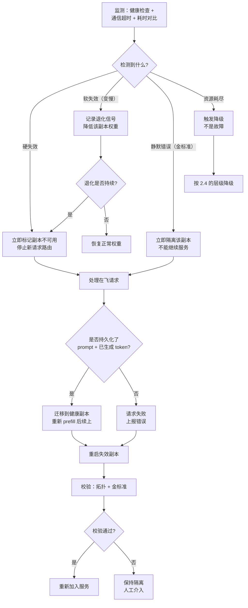
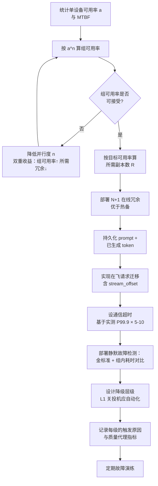

# 容错与优雅降级

> 位置：[InferenceAtlas](../../INDEX.md) > [模块 06](README.md) > 当前文档
> 信息截至：2026-07-29 ｜ 最后核验：2026-07-29 ｜ 内容版本：v0.1
> 时效性等级：中
> 相关主题：[多节点服务拓扑](09_multi_node_serving_topologies.md)｜[服务事故排查手册](../03_serving_engines_and_scheduling/12_serving_incident_playbook.md)｜[自动扩缩容与负载均衡](../03_serving_engines_and_scheduling/10_autoscaling_and_load_balancing.md)

## 本章导读

分布式推理的容错与传统无状态服务有一个根本差异：**推理实例是有状态的**。它持有正在生成的请求的 KV cache——一份可以重建但重建代价高昂的状态。这使得"重启即恢复"这个无状态服务的标准答案在这里只是部分有效。

三个特有的容错问题：

1. **故障域是并行组而非单卡**：TP 组内任一设备失效，整组不可用。故障的粒度由放置决定（见 [多节点服务拓扑](09_multi_node_serving_topologies.md) 2.4）。
2. **在飞请求的处理**：失效时正在生成的请求怎么办？它们的 KV 丢了，但原始 prompt 还在——**重新 prefill 是可行的，代价是一次完整的重算**。
3. **降级的维度比传统服务多**：除了拒绝请求，推理服务还可以降低 reasoning 预算、关闭投机解码、缩小批、切换到更小的模型——这些是**降低单请求资源消耗**的手段，传统服务没有。

本章建立分布式推理的容错框架：故障模式的分类与检测、在飞请求的恢复策略、以及降级的层级设计。核心论点是：**推理服务的降级空间比传统服务大得多，应当在拒绝请求之前用尽这些手段**。

## 学习目标

读完本章后，读者应能够：

1. 列举分布式推理的故障模式，并按检测难度与影响范围分类；
2. 分析在飞请求在各类故障下的可恢复性，并给出恢复策略；
3. 设计降级的层级，并说明每级的收益与用户可感知的影响；
4. 计算给定单设备故障率下的服务可用率与所需冗余；
5. 识别静默故障（不报错但结果错误）并设计检测手段。

## 核心结论

- **故障域是并行组，不是单卡**：一个 $N_{\text{TP}} \times N_{\text{PP}}$ 的副本，任一设备失效则整个副本不可用。
- **在飞请求可以恢复**：prompt 与已生成的 token 都是可持久化的，重新 prefill 即可续上。代价是一次重算，但比让用户重来好得多。
- **静默故障是最危险的**：数值错误、放置错误、KV 传输的元数据不一致都不报错，只是结果变差。**必须有主动检测**。
- **推理服务的降级维度比传统服务多**：可以降低单请求的计算量（reasoning 预算、投机、批），这是传统服务没有的弹性来源。
- **降级应有明确的层级与触发条件**，且每级的用户可感知影响必须被记录，否则运维方无法判断降级是否合理。

## 1. 问题定义、系统边界与工作负载

### 1.1 故障模式分类

| 类别 | 例子 | 检测难度 | 影响范围 |
|---|---|---|---|
| **硬失效** | 设备掉线、进程崩溃、节点断电 | 低（明显） | 整个并行组 |
| **软失效** | 设备变慢、ECC 错误纠正、降频 | 中 | 整组（同步拖累） |
| **通信失效** | 链路中断、集合通信挂起 | 中（可能表现为 hang） | 整组 |
| **静默错误** | 数值错误、KV 元数据不一致、放置错误 | **高** | 质量下降，无报错 |
| **资源耗尽** | KV OOM、队列积压 | 低 | 该实例 |
| **依赖失效** | 工具调用超时、外部存储不可用 | 低 | 相关请求 |

**"软失效"在同步并行中特别有害**：一张卡降频 20%，整个 TP 组的每一步都被它拖慢 20%——因为集合通信是同步的。**单卡的部分退化会传染给整组**。

$$
T_{\text{group}} = \max_i T_i
$$

这与"一张卡完全失效"不同：完全失效会被健康检查发现并下线，而部分退化可能长期存在。

**"静默错误"是本章的重点之一**，因为它不触发任何自动恢复机制——系统认为一切正常。

### 1.2 状态的可恢复性

推理实例持有的状态，按可恢复性分类：

| 状态 | 可否重建 | 重建代价 |
|---|---|---|
| 模型权重 | 是（从存储加载） | 加载时间 |
| KV cache | **是**（从 prompt + 已生成 token 重新 prefill） | 一次完整 prefill |
| 已生成的 token | 需持久化，否则丢失 | 若丢失则用户需重来 |
| 采样 RNG 状态 | 可重建（若 seed 持久化） | 无 |
| 约束解码状态机位置 | 可重建（从已生成文本重放） | 小 |
| 请求元数据（参数、SLO） | 需持久化 | 无 |

**关键洞察**：**KV cache 是唯一昂贵但可重建的状态**。只要 prompt 与已生成的 token 被持久化，任何实例都能重建出该请求的完整状态并继续生成。

$$
\text{恢复代价} = \text{prefill}(S_{\text{prompt}} + L_{\text{generated}})
$$

- 已生成得越多，恢复代价越高（要重算的上下文更长）；
- 但这个代价**远小于"让用户从头重来"**——后者不仅浪费了已完成的计算，还损害体验。

**因此容错设计的第一原则**：**持久化 prompt 与已生成的 token**。这是一个很小的状态（文本），但它使得任何故障都是可恢复的。

### 1.3 系统边界

| 层次 | 容错手段 | 本章覆盖 |
|---|---|---|
| 硬件 | ECC、冗余电源 | 否 |
| 设备驱动 | 错误检测与上报 | 仅提及 |
| 并行组 | 组内一致性、通信超时 | 是 |
| 实例/副本 | 健康检查、下线与替换 | 是 |
| 服务层 | 路由、重试、降级 | 是 |
| 请求层 | 状态持久化与恢复 | 是 |

## 2. 原理、数学与性能模型

### 2.1 可用率模型

设单设备的可用率为 $a$（无故障运行的时间比例）。

**一个并行组（$n$ 卡）的可用率**：

$$
a_{\text{group}} = a^n
$$

- 组内任一设备失效则整组不可用。
- **$n$ 越大，组可用率越低**——这是并行度的又一个代价。

**$R$ 个副本中至少 $k$ 个可用的概率**：

$$
\Pr[\ge k] = \sum_{j=k}^{R} \binom{R}{j} a_{\text{group}}^j (1-a_{\text{group}})^{R-j}
$$

**服务可用率**（需要至少 $k$ 个副本才能满足 SLO）：

$$
A_{\text{service}} = \Pr[\ge k]
$$

**数值表**（按上式计算的**模型输出**，非实测。设单设备可用率 $a = 0.999$）：

| 组大小 $n$ | 组可用率 $a^n$ | $R=2, k=1$ | $R=4, k=3$ | $R=8, k=6$ |
|---:|---:|---:|---:|---:|
| 1 | 0.99900 | 0.999999 | 0.999994 | 0.9999999 |
| 2 | 0.99800 | 0.999996 | 0.999976 | 0.9999996 |
| 4 | 0.99601 | 0.999984 | 0.999905 | 0.9999965 |
| 8 | 0.99203 | 0.999936 | 0.999623 | 0.9999725 |
| 16 | 0.98412 | 0.999748 | 0.998519 | 0.9997887 |

**从表中可读出**：

1. **组越大，组可用率下降得很快**：$n=16$ 时单副本可用率已降到 98.41%，即每周约 2.7 小时不可用。
2. **副本冗余极其有效**：即使组可用率只有 98.4%，$R=2$ 且只需 1 个可用时，服务可用率仍达 99.97%。
3. **"需要多少个可用"比"有多少个"更重要**：$R=4,k=3$（容忍 1 个失效）明显差于 $R=2,k=1$（容忍 1 个失效但只需 1 个）——因为前者的容量需求更高。

> **实践含义**：**容量规划应当按"$k$ 个副本满足 SLO"来定，然后部署 $R > k$ 个**。冗余度 $R-k$ 直接决定可用率。

### 2.2 恢复时间与容量影响

一次故障的完整影响：

$$
\text{影响} = \underbrace{\frac{1}{R}}_{\text{容量损失比例}} \times \underbrace{(T_{\text{detect}} + T_{\text{drain}} + T_{\text{restart}} + T_{\text{warmup}})}_{\text{恢复时间}}
$$

| 阶段 | 内容 | 典型影响因素 |
|---|---|---|
| $T_{\text{detect}}$ | 健康检查发现故障 | 检查周期与超时阈值 |
| $T_{\text{drain}}$ | 排空该副本的在飞请求 | 请求剩余生成长度 |
| $T_{\text{restart}}$ | 重启进程、重建通信组 | 权重加载时间 |
| $T_{\text{warmup}}$ | 预热（CUDA Graph 捕获、缓存重建） | 图捕获次数、缓存大小 |

**$T_{\text{restart}}$ 通常是主导项**——加载几十到几百 GB 的权重需要可观的时间。

**降低恢复时间的手段**：

| 手段 | 效果 | 代价 |
|---|---|---|
| 权重预加载到主机内存 | 跳过存储读取 | 主机内存占用 |
| 保持热备副本 | $T_{\text{restart}} = 0$ | 一个副本的成本 |
| 快速健康检查 | 降低 $T_{\text{detect}}$ | 误报风险 |
| 跳过预热 | 降低 $T_{\text{warmup}}$ | 前几个请求慢 |

**热备的经济性**：

$$
\text{热备成本} = \frac{1}{R} \quad \text{vs.} \quad \text{节省的不可用时间} = \frac{T_{\text{restart}} + T_{\text{warmup}}}{\text{MTBF}}
$$

- 若故障频繁（MTBF 短）或重启很慢，热备划算；否则不划算。
- **大规模集群下故障是常态**，热备通常值得。

### 2.3 在飞请求的恢复

**恢复的可行性取决于持久化了什么**：

| 持久化内容 | 可恢复到 | 用户感知 |
|---|---|---|
| 无 | 请求失败 | 需要重新提交 |
| prompt | 从头重新生成 | 已生成内容丢失，输出可能不同 |
| prompt + 已生成 token | **无缝续上** | 只是一次卡顿 |
| 上述 + KV（换出） | 更快恢复 | 卡顿更短 |

**"prompt + 已生成 token"是性价比最高的选择**：状态很小（纯文本），但使恢复完全无损。

**恢复的代价**：

$$
T_{\text{recover}} = \text{prefill}(S_{\text{prompt}} + L_{\text{generated}})
$$

**对流式输出的特殊考虑**：如果已经向用户流式返回了 $L_{\text{generated}}$ 个 token，恢复后必须**从第 $L_{\text{generated}}+1$ 个开始继续**，不能重复也不能跳过。这要求：

1. 流式输出的位置被记录；
2. 恢复时把已发送的部分作为上下文，只生成后续。

**采样一致性的问题**：恢复后的生成是一次新的采样，即使 seed 相同，由于批次组成不同，输出可能与"没有故障时"的续写不同（见 [采样参数](../05_decoding_and_generation_algorithms/02_greedy_sampling_topk_topp_temperature.md) 3.4）。**这是可接受的**——用户看到的是一个连贯的输出，只是与另一个平行世界的输出不同。

### 2.4 降级的层级

推理服务的降级空间比传统服务大，因为它可以**降低单请求的资源消耗**。

| 级别 | 手段 | 容量收益 | 用户可感知影响 |
|---|---|---|---|
| **L0 正常** | — | — | 无 |
| **L1 关闭增益特性** | 关投机解码、关束搜索 | 中（投机本就降吞吐） | 时延略升 |
| **L2 收紧计算预算** | 降低 reasoning 预算、减少并行采样数 | **高** | 质量下降 |
| **L3 缩小批与上下文** | 降 max_tokens、截断长上下文 | 中 | 输出变短 |
| **L4 分级限流** | 低优先级请求排队或拒绝 | 高 | 部分用户受影响 |
| **L5 模型降级** | 切换到更小的模型 | **很高** | 质量明显下降 |
| **L6 全面限流** | 拒绝新请求 | 最高 | 服务不可用 |

**L1 与 L2 是推理特有的**：传统服务没有"降低单请求计算量"这个旋钮。

**关键设计原则**：

> **降级应当从"用户不易察觉"到"明显可感知"逐级推进，而不是直接跳到限流。**

**L1 的特殊性**：关闭投机解码在高负载下**同时改善容量与不损害质量**——因为投机在大批下本就是净损失（见 [draft 选型](../05_decoding_and_generation_algorithms/06_draft_model_selection_and_acceptance_rate.md) 4.2）。**这一级几乎是免费的**，应当自动化。

**触发条件**：每一级应有明确的进入与退出条件，且带滞回：

$$
\text{进入 L}_i：\text{指标} > \theta_i^{\text{in}}, \qquad \text{退出 L}_i：\text{指标} < \theta_i^{\text{out}} < \theta_i^{\text{in}}
$$

**指标的选择**：

| 指标 | 反映 | 适合触发 |
|---|---|---|
| 队列深度 | 需求超过供给 | L1–L4 |
| KV 使用率 | 内存压力 | L3 |
| P99 时延 | SLO 违反 | L2–L4 |
| 可用副本数 | 故障 | L4–L6 |
| 抢占率 | 内存与调度压力 | L3 |

### 2.5 静默故障的检测

静默故障不触发任何自动机制，必须靠主动检测。

| 静默故障 | 检测手段 | 成本 |
|---|---|---|
| 数值错误（硬件/切分） | 定期用固定输入做金标准对比 | 低（占用少量算力） |
| 放置错误 | 启动时的组间延迟一致性检查 | 低（见 [多节点服务拓扑](09_multi_node_serving_topologies.md) 3.2） |
| KV 元数据不一致 | 传输后校验哈希与页数 | 低 |
| 模型版本不一致 | 启动时校验模型哈希 | 极低 |
| 设备部分退化 | 组内各设备的单步耗时对比 | 低 |
| 质量漂移 | 定期跑固定评估集 | 中 |

**"金标准对比"的设计**：

```
# 定期（如每 N 分钟）用一组固定输入做前向，比对输出哈希
function canary_check(engine, golden_set):
    for case in golden_set:
        out = engine.forward(case.input, temperature=0, seed=FIXED)
        h = hash(out.logits.round(decimals=3))   # 容忍最末位浮点差异
        if h != case.expected_hash:
            alert(f"金标准不匹配：{case.id}")
            return FAIL
    return OK
```

**要点**：
1. **温度为 0** 消除采样随机性；
2. **固定 batch 组成**——否则浮点归约顺序变化会导致误报（见 [采样参数](../05_decoding_and_generation_algorithms/02_greedy_sampling_topk_topp_temperature.md) 3.4）；
3. **对 logits 做舍入后哈希**——容忍最末位的浮点差异，只捕获真正的错误；
4. **金标准应在健康的实例上生成并锁定**，而不是每次动态比较（否则两个都坏了就检测不出）。

**组内耗时对比**：并行组内各设备的单步耗时应当接近。若某个设备持续偏慢，说明它可能在降频或有其他退化。

$$
\text{退化信号} = \frac{\max_i T_i}{\text{median}_i T_i} > \theta
$$

- 这个检测**不需要额外的算力**——只需记录每步各设备的耗时。

## 3. 实现机制与系统设计

### 3.1 故障处理的完整流程



**图解读**：
1. **本图展示什么**：从检测到恢复的完整故障处理链路，区分了四类事件——硬失效、软失效、静默错误、资源耗尽——它们的处理路径完全不同。
2. **核心瓶颈**：瓶颈是"是否持久化了 prompt + 已生成 token"这个分叉。**这一个设计决策决定了故障对用户是"一次卡顿"还是"请求失败"**，而它的成本只是持久化一小段文本。
3. **图中的 trade-off**：左侧的"软失效"分支体现了一个权衡——立即下线会损失容量，容忍则拖慢整组。折中做法是先降低路由权重观察，持续退化才下线。
4. **面试如何引用**：被问"实例挂了怎么办"时，用这张图区分四类事件并强调静默错误需要主动检测——这比只讲"健康检查 + 重启"深入得多。

**"资源耗尽不是故障"值得强调**：KV OOM、队列积压是**容量不足**的表现，正确的响应是降级而非重启。把它当故障处理（重启实例）会让情况更糟——容量进一步下降。

### 3.2 在飞请求的迁移

```
function migrate_inflight_requests(failed_replica, healthy_replicas):
    for req in failed_replica.inflight_requests():
        # --- 1. 检查可恢复性 ---
        state = persistent_store.get(req.id)
        if state is None or state.prompt is None:
            fail_request(req, "状态未持久化，无法恢复")
            continue

        # --- 2. 构造恢复上下文 ---
        # 关键：已生成的 token 要作为上下文的一部分
        recovery_input = state.prompt + state.generated_tokens
        remaining_budget = req.max_tokens - len(state.generated_tokens)
        if remaining_budget <= 0:
            complete_request(req, state.generated_tokens)   # 本就该结束了
            continue

        # --- 3. 选目标副本（需有足够 KV 空间）---
        target = select_replica(healthy_replicas,
                                needed_kv=kv_size(len(recovery_input)))
        if target is None:
            queue_for_retry(req)      # 暂无容量，排队
            continue

        # --- 4. 提交恢复请求 ---
        target.submit(
            request_id      = req.id,
            input_tokens    = recovery_input,
            max_tokens      = remaining_budget,
            sampling_params = req.sampling_params,
            stream_offset   = len(state.generated_tokens),   # 从这里继续输出
            is_recovery     = True,                          # 供监控区分
        )
        record_metric("request_recovered", 1)
```

**四个要点**：

1. **`recovery_input` 必须包含已生成的 token**，否则会重新生成前面的内容，用户看到重复。
2. **`remaining_budget` 要扣除已生成的部分**，否则总输出会超过 `max_tokens`。
3. **`stream_offset` 告诉下游从哪里继续发送**，避免重复推送。
4. **`is_recovery` 标记用于监控**——恢复请求的时延会显著高于正常请求，混在一起统计会污染 P99 指标。**恢复请求应当在 SLO 统计中单独标记**。

**目标副本的选择**：恢复请求需要一次完整的 prefill（长度是 prompt + 已生成），因此**它对 KV 空间的需求高于普通新请求**。选择时必须确认目标有足够空间，否则会在恢复时再次失败。

### 3.3 通信超时与挂起处理

集合通信的挂起是分布式特有的故障：某个设备不参与，其他设备无限等待。

| 情形 | 表现 | 处理 |
|---|---|---|
| 一个 rank 崩溃 | 其余 rank 在集合操作中挂起 | 通信超时 → 全组重启 |
| 一个 rank 极慢 | 其余 rank 长时间等待 | 超时阈值需大于最慢的合理耗时 |
| 网络分区 | 部分 rank 互相看不到 | 超时 → 全组重启 |

**超时阈值的设定是一个真实的两难**：

- 太短 → 正常的慢操作（如大 prefill）被误判为挂起；
- 太长 → 真正的挂起要等很久才被发现。

**实用做法**：

$$
\theta_{\text{timeout}} = c \cdot \max(\text{历史单步耗时的 P99.9})
$$

- $c$ 取 5–10 倍；
- **必须基于实测的耗时分布**，而不是拍脑袋定一个固定值。

**"全组重启"的必要性**：集合通信的状态是分布式的，一个 rank 退出后通信组已经损坏，无法只重启那一个 rank。**必须整组重启**——这也是为什么故障域是并行组。

### 3.4 降级的实现

```
# 降级控制器
DEGRADATION_LEVELS = [
    (0, "正常",       lambda cfg: cfg),
    (1, "关增益特性",  lambda cfg: cfg.with(speculative=False, beam_search=False)),
    (2, "收紧预算",    lambda cfg: cfg.with(reasoning_budget=cfg.reasoning_budget*0.4,
                                            parallel_samples=1)),
    (3, "缩小输出",    lambda cfg: cfg.with(max_tokens=min(cfg.max_tokens, 1024))),
    (4, "分级限流",    lambda cfg: cfg.with(admit_tiers=["premium","standard"])),
    (5, "模型降级",    lambda cfg: cfg.with(model=cfg.fallback_model)),
    (6, "全面限流",    lambda cfg: cfg.with(admit_tiers=[])),
]

function degradation_controller(metrics, current_level):
    pressure = compute_pressure(metrics)   # 综合队列深度、KV 使用率、P99、可用副本数

    # 滞回：升级阈值高于降级阈值
    if pressure > UP_THRESHOLD[current_level] and current_level < 6:
        new_level = current_level + 1
        log_event("degrade_up", level=new_level, pressure=pressure,
                  metrics=metrics)                        # 必须记录触发原因
    elif pressure < DOWN_THRESHOLD[current_level] and current_level > 0:
        new_level = current_level - 1
        log_event("degrade_down", level=new_level, pressure=pressure)
    else:
        new_level = current_level

    # 记录该级别下的质量代理指标，供事后评估降级是否合理
    record_quality_proxies(new_level, metrics)
    return new_level
```

**三个设计要点**：

1. **滞回是必需的**。没有滞回会在阈值附近震荡，而每次级别变化本身有成本（配置切换、可能的图重捕获）。
2. **必须记录触发原因与当时的指标**。事后要能回答"为什么昨天下午降级了"。
3. **必须记录该级别下的质量代理指标**（见 [生成质量与时延权衡](../05_decoding_and_generation_algorithms/10_generation_quality_latency_tradeoffs.md) 2.4）。否则无法判断降级的质量代价是否可接受，也就无法优化层级设计。

**分级限流的公平性**：L4 按用户等级限流时，被拒的总是低优先级用户。这在长时间降级下会造成明显的不公平。缓解：加入**老化**机制——排队久的低优先级请求逐渐提升优先级（见 [模块 03 第 4 章](../03_serving_engines_and_scheduling/04_request_scheduling_and_admission_control.md)）。

### 3.5 与其他机制的交互

| 机制 | 交互 |
|---|---|
| 前缀缓存 | 副本失效则其缓存丢失；恢复后缓存需重建，命中率暂降 |
| PD 分离 | prefill 池与 decode 池的故障影响不同；decode 池失效损失在飞请求 |
| MoE | 专家分布在多设备，EP 组的故障域是整个 EP 组 |
| 投机解码 | 降级 L1 关闭它，通常无质量损失 |
| CUDA Graph | 重启后需重新捕获，计入 $T_{\text{warmup}}$ |
| 自动扩缩容 | 故障导致的容量下降会触发扩容；需区分"故障"与"负载上升" |

**"需区分故障与负载上升"**：两者都表现为"容量不足"，但正确响应不同——故障应替换失效副本，负载上升应扩容。若把故障当负载上升，会在已有故障的基础上再加副本，掩盖问题；若把负载上升当故障，会反复重启健康的副本。

**区分方法**：故障有明确的信号（健康检查失败、通信超时、金标准不匹配），而负载上升没有。**先查故障信号，无信号才按负载处理**。

## 4. 性能、成本、能耗与可靠性 trade-off

### 4.1 冗余的成本

| 冗余方式 | 成本 | 恢复时间 | 适用 |
|---|---|---|---|
| 无冗余 | 0 | 完整重启 | 可容忍中断 |
| 冷备（配置就绪未启动） | 低（设备闲置） | 需加载权重 | 中等 |
| 热备（已加载权重待命） | 一个副本 | 接近 0 | 故障频繁或重启慢 |
| $N+1$ 在线（多一个副本分担） | 一个副本 | 接近 0 | **通常最优** |

**$N+1$ 在线优于热备**：热备的副本在待命时不服务请求（浪费），而 $N+1$ 的所有副本都在服务——只是每个的负载低一些。故障时剩下的 $N$ 个刚好承担全部负载。

$$
\text{正常时每副本负载} = \frac{\Lambda}{N+1}, \qquad \text{故障后} = \frac{\Lambda}{N}
$$

- **正常时还额外获得了更低的负载**（更好的时延），这不是浪费。
- **因此"$N+1$ 在线"应当是默认的冗余方式**。

### 4.2 可用性目标与冗余度

给定单设备可用率 $a$、组大小 $n$、需要 $k$ 个副本满足 SLO，求达到目标可用率 $A$ 所需的 $R$：

$$
R = \min\left\{ R' : \sum_{j=k}^{R'} \binom{R'}{j} a^{nj}(1-a^n)^{R'-j} \ge A \right\}
$$

**这个式子说明三件事**：

1. **组越大（$n$ 大），需要的冗余越多**——这是高并行度的隐藏成本；
2. **$k$ 越大（容量需求越高），需要的 $R$ 越大**；
3. **可用性目标每提高一个"9"，需要的冗余增长是超线性的**。

**实践建议**：**先降低 $n$（并行度），再加冗余**。降低并行度同时改善组可用率与所需冗余，是双重收益——前提是时延与显存允许。

### 4.3 降级的质量代价

每一级降级都有质量代价，但它们**不可直接比较**：

| 级别 | 质量影响的性质 |
|---|---|
| L1 关投机 | **无质量影响**（投机保持分布不变） |
| L2 收紧 reasoning | 复杂问题的正确率下降 |
| L3 缩小输出 | 长回答被截断 |
| L4 分级限流 | 部分用户完全失去服务 |
| L5 模型降级 | 全面质量下降 |
| L6 全面限流 | 服务不可用 |

**L1 是免费的**——投机解码保持输出分布不变（见 [投机解码](../05_decoding_and_generation_algorithms/04_speculative_decoding.md)），关闭它只影响时延而非质量，且在高负载下本就是净损失。**这一级应当自动化且无需犹豫**。

**L4 与 L5 的选择是一个产品决策**：是"让一部分用户完全没有服务"还是"让所有用户得到较差的服务"。这不是技术问题，但技术方必须把选项与代价讲清楚。

### 4.4 能耗

故障与降级对能耗的影响：

| 情形 | 能耗 |
|---|---|
| 设备失效 | 该设备不耗电（但也不产出） |
| 组内一个失效 | **整组闲置但仍耗电**——最糟的情形 |
| 降级运行 | 每 token 能耗可能下降（关投机、少 reasoning） |
| 热备 | 待命也耗电（虽然低于满载） |

**"整组闲置但仍耗电"值得注意**：TP 组内一卡失效，其余 $n-1$ 卡无法独立工作，但它们仍在通电。这是纯粹的浪费。**快速检测与重启不只是可用性问题，也是能耗问题**。

## 5. benchmark、真实案例或公开部署案例

当前环境的网络出口策略阻断了外部一手来源（详见 [AGENTS.md 第 11 节](../../AGENTS.md)）。因此本节**不引用任何具体的设备故障率、MTBF、重启时间或真实事故案例**。第 2.1 节的表格是按该节公式计算的**模型输出**，其中 $a=0.999$ 是一个**示例假设值**，不代表任何真实硬件。

| 陈述 | 披露标签 | 状态 |
|---|---|---|
| 集合通信库提供超时机制 | `开源代码/配置披露` | `待核实` |
| 主流框架支持实例健康检查与替换 | `开源代码/配置披露` | `待核实` |
| 真实的设备故障率与 MTBF | — | **不引用**（无一手来源，且高度依赖硬件与环境） |
| 具体的重启与预热时间 | — | **不引用**（必须自测） |

**必做的自测清单**（`独立可复现实验`）：

1. **单设备可用率统计**（最基础）：从运维记录统计实际的设备故障频率与 MTBF。这是 2.1 与 4.2 全部计算的输入。
2. **恢复时间分解**：分别测量 $T_{\text{detect}}$、$T_{\text{drain}}$、$T_{\text{restart}}$、$T_{\text{warmup}}$。定位主导项并针对性优化。
3. **在飞请求恢复验证**：主动杀死一个副本，验证在飞请求能否无缝迁移。检查输出是否连贯、无重复、无跳过。
4. **通信超时阈值标定**：统计正常单步耗时的 P99.9，据此设定超时阈值（3.3）。
5. **金标准检测的误报率**：在健康实例上反复运行金标准检查，统计误报率。若误报率高，说明舍入精度设置不当或 batch 组成未固定。
6. **组内耗时离散度**：记录并行组内各设备的单步耗时，统计 $\max/\text{median}$。建立退化告警阈值。
7. **降级层级的容量收益**：逐级触发降级，测量各级带来的容量提升。验证 2.4 的排序。
8. **降级的质量代价**：在各降级级别下跑质量评估集，量化质量下降。这是层级设计的依据。
9. **$N+1$ vs 热备的对比**：在相同设备数下比较两种冗余方式的正常时延与故障恢复表现。验证 4.1 的结论。
10. **故障演练**：定期主动注入故障（杀进程、断网），验证整条恢复链路。**未经演练的恢复路径不可信**。

> 实验方法论要求见 [如何读推理 benchmark](../00_start_here/03_how_to_read_inference_benchmarks.md)。

## 6. 设计决策框架



**图解读**：
1. **本图展示什么**：容错设计的完整链路，从可用率计算到冗余部署、状态持久化、检测机制、降级层级，最后落到演练。
2. **核心瓶颈**：瓶颈是"降低并行度"这个回路。并行度同时影响组可用率（$a^n$）与所需冗余，**降低它是双重收益**——但它受时延与显存约束，不能无限降。这三者（时延、显存、可用性）共同夹住并行度的选择。
3. **图中的 trade-off**：$N+1$ 在线冗余用"正常时每副本负载更低"换取"故障时刚好扛得住"，这不是浪费而是双赢；相比之下热备的待命副本是真正的闲置。
4. **面试如何引用**：被问"分布式推理怎么做容错"时，按这张图从"算组可用率"讲起，并强调两个关键设计——**持久化 prompt + 已生成 token**（让故障从"失败"降为"卡顿"）与**主动检测静默故障**。

### 决策清单

| 问题 | 若答案为"是" | 若答案为"否" |
|---|---|---|
| 已统计实际设备可用率？ | 可以算冗余 | **先统计**，无输入 |
| 组可用率 $a^n$ 可接受？ | 继续 | 先降并行度（双重收益） |
| 已部署 $N+1$ 在线冗余？ | 好 | 优于热备，应改用 |
| 持久化 prompt + 已生成 token？ | 故障是卡顿 | 故障是失败，**必须补上** |
| 通信超时基于实测分布？ | 阈值合理 | 拍脑袋的值会误报或迟报 |
| 有金标准静默错误检测？ | — | **必须加**，无其他手段 |
| 记录组内各设备耗时？ | 可发现软退化 | 补上，零额外成本 |
| L1（关投机）已自动化？ | — | 应自动化，免费的容量 |
| 记录了降级的质量代价？ | 可优化层级 | 无法判断降级是否合理 |
| 定期做故障演练？ | 恢复路径可信 | **未演练的路径不可信** |

## 7. 常见失败模式与排查路径

| 症状 | 可能原因 | 排查步骤 |
|---|---|---|
| 一卡故障导致大面积不可用 | 并行度过高，副本太少（2.1） | 算 $n$ 与 $R$；考虑降并行度 |
| 服务挂起无响应 | 集合通信等待失效 rank（3.3） | 检查各 rank 存活；确认超时已配置 |
| 频繁误判为挂起 | 超时阈值过短 | 按实测 P99.9 重新标定 |
| 故障后请求全部失败 | 未持久化状态（2.3） | 补上 prompt + 已生成 token 的持久化 |
| 恢复后输出重复 | `recovery_input` 未含已生成 token（3.2） | 检查恢复上下文构造 |
| 恢复后输出跳过一段 | `stream_offset` 未设置 | 检查流式续传逻辑 |
| 总输出超过 max_tokens | 恢复时未扣除已生成部分 | 检查 `remaining_budget` |
| P99 突然恶化但无故障 | 恢复请求混入统计（3.2） | 用 `is_recovery` 标记单独统计 |
| 质量下降但无任何告警 | 静默错误（2.5） | 部署金标准检测 |
| 某副本持续偏慢 | 设备软退化（2.5） | 组内耗时对比；考虑下线该设备 |
| 重启后又立刻故障 | 根因未解决（如硬件问题） | 重启后必须过校验才重新加入 |
| 降级后仍不稳定 | 降级层级设计不当或滞回缺失 | 检查阈值与滞回带 |
| 降级在阈值附近震荡 | 无滞回（3.4） | 加滞回带 |
| 扩容后问题依旧 | 把故障当成负载上升（3.5） | 先查故障信号再按负载处理 |
| 整组闲置但仍耗电 | 检测或重启慢（4.4） | 缩短 $T_{\text{detect}}$ 与 $T_{\text{restart}}$ |

**排查原则**：分布式推理的故障排查，**第一步是区分四类事件**——硬失效、软失效、静默错误、资源耗尽。它们的正确响应完全不同，尤其是"资源耗尽不是故障，应降级而非重启"。

## 8. 关联面试主题

1. **为什么故障域是并行组而不是单卡**——见本章 1.1、2.1。
2. **组可用率 $a^n$ 与并行度的关系**——见本章 2.1，高并行度的隐藏成本。
3. **在飞请求为什么可以恢复，需要持久化什么**——见本章 1.2、2.3。
4. **恢复时的三个易错点**：recovery_input、remaining_budget、stream_offset——见本章 3.2。
5. **软失效（部分退化）为什么在同步并行中特别有害**——见本章 1.1，$\max_i T_i$。
6. **静默故障的类型与检测手段**——见本章 2.5。
7. **金标准检测为什么要固定 batch 组成**——见本章 2.5，浮点归约顺序。
8. **推理服务比传统服务多出的降级维度**——见本章 2.4，降低单请求计算量。
9. **为什么 L1（关投机）是免费的降级**——见本章 4.3。
10. **$N+1$ 在线冗余为什么优于热备**——见本章 4.1。
11. **通信超时阈值如何标定**——见本章 3.3。
12. **为什么"资源耗尽"不应按故障处理**——见本章 3.1。
13. **如何区分故障与负载上升**——见本章 3.5。

## 9. 小结

分布式推理容错的三个特有问题，各有一个明确的答案。

**故障域是并行组而非单卡**。TP 组内任一设备失效则整组不可用，因此组可用率是 $a^n$——并行度越高，单副本越脆弱。这与"并行度换时延、副本数换可用性"的权衡（见 [多节点服务拓扑](09_multi_node_serving_topologies.md) 4.2）是同一件事的两面。实践上，**降低并行度是双重收益**：既提高组可用率，又降低达到目标可用率所需的冗余——前提是时延与显存允许。

**在飞请求可以恢复，代价很小**。KV cache 是唯一昂贵但可重建的状态，而重建它只需要 prompt 与已生成的 token——这是一小段文本。**持久化这段文本，就把"请求失败"降级为"一次卡顿"**。这是本章性价比最高的单项设计。实现上有三个易错点：恢复上下文必须包含已生成的 token（否则重复输出）、剩余预算要扣除已生成部分（否则超长）、流式偏移要正确设置（否则重复推送）。此外，恢复请求的时延远高于正常请求，**必须在 SLO 统计中单独标记**，否则会污染 P99。

**静默故障必须主动检测**。数值错误、放置错误、KV 元数据不一致、设备软退化——这些都不报错，只是结果变差或变慢。两个成本极低的检测手段应当成为标配：**固定输入的金标准比对**（温度 0、固定 batch、对舍入后的 logits 做哈希）与**组内各设备单步耗时的对比**（零额外算力，只需记录）。

在降级上，推理服务有一个传统服务没有的弹性来源：**可以降低单请求的计算量**。关闭投机解码、收紧 reasoning 预算、减少并行采样——这些手段在拒绝请求之前就能释放可观的容量。其中 **L1（关闭投机解码）是免费的**——投机保持输出分布不变，且在高负载下本就是净损失，因此这一级应当自动化且无需犹豫。降级层级必须带滞回、必须记录触发原因、必须记录该级别下的质量代理指标——否则运维方无法判断降级是否合理，也就无法优化层级设计。

最后两条实践提醒：**"资源耗尽"不是故障**，正确响应是降级而非重启（重启会让容量进一步下降）；以及**未经演练的恢复路径不可信**——故障处理链路涉及检测、迁移、重启、校验多个环节，任何一环的缺陷都只有在真正故障时才暴露，而那时代价最高。

## 关键术语

| 中文术语 | 英文 | 定义 | 单位/口径 | 关联文档 |
|---|---|---|---|---|
| 故障域 | failure domain | 单个部件失效所影响的设备集合 | 设备数 | 本章 1.1 |
| 软失效 | soft failure / degradation | 设备未完全失效但性能显著下降 | — | 本章 1.1 |
| 静默错误 | silent error | 不报错但产生错误结果的故障 | — | 本章 2.5 |
| 在飞请求 | in-flight request | 故障发生时正在生成的请求 | 计数 | 本章 2.3 |
| 金标准检测 | canary / golden-output check | 用固定输入比对输出以发现数值错误 | — | 本章 2.5 |
| 优雅降级 | graceful degradation | 按层级降低服务能力而非直接拒绝 | 级别 | 本章 2.4 |
| $N+1$ 在线冗余 | N+1 online redundancy | 多部署一个在线服务的副本作为冗余 | 副本数 | 本章 4.1 |
| 流式偏移 | stream offset | 恢复时从第几个 token 继续推送 | token | 本章 3.2 |
| 滞回带 | hysteresis band | 避免降级级别震荡的双阈值区间 | — | 本章 3.4 |

## 延伸阅读

- [多节点服务拓扑](09_multi_node_serving_topologies.md) — 放置如何决定故障域的形状
- [服务事故排查手册](../03_serving_engines_and_scheduling/12_serving_incident_playbook.md) — 事故处理的通用流程
- [自动扩缩容与负载均衡](../03_serving_engines_and_scheduling/10_autoscaling_and_load_balancing.md) — 区分故障与负载上升
- [请求调度与准入控制](../03_serving_engines_and_scheduling/04_request_scheduling_and_admission_control.md) — 分级限流与老化
- [reasoning 成本治理](../05_decoding_and_generation_algorithms/07_reasoning_inference_and_test_time_scaling.md) — 预算作为降级手段
- [draft 选型与接受率](../05_decoding_and_generation_algorithms/06_draft_model_selection_and_acceptance_rate.md) — 为什么高负载下关投机是免费的
- [生成质量与时延的系统级权衡](../05_decoding_and_generation_algorithms/10_generation_quality_latency_tradeoffs.md) — 质量代理指标
- [KV 传输、RDMA 与远端内存](08_kv_cache_transfer_and_remote_memory.md) — 元数据不一致这类静默错误

## 主要来源

本章的可用率模型、恢复代价与降级设计为本库自洽推导，基于标准的可靠性计算（串并联系统可用率、二项分布）与前九章的推理系统模型。第 2.1 节的表格为公式计算结果，其中单设备可用率 $a=0.999$ 是**示例假设值**，不代表任何真实硬件。**本章不含任何真实的故障率、MTBF 或恢复时间数字**——这些必须从自己的运维记录统计（详见第 5 节）。

| 类别 | 说明 | 披露标签 |
|---|---|---|
| 组可用率 $a^n$ 与二项冗余模型 | 标准可靠性计算 | — |
| 恢复代价 = prefill(prompt + 已生成) | 由 KV 可重建性导出 | — |
| 降级层级设计 | 本库提出的框架 | — |
| 第 2.1 节数值表 | 由公式计算，$a$ 为示例假设值 | — |
| 真实故障率、MTBF、恢复时间 | **本章不给出**，须自行统计 | — |
| 框架的容错能力 | 需一手核验 | `待核实` |

## 更新记录

| 日期 | 版本 | 变更 | 核验人 |
|---|---|---|---|
| 2026-07-29 | v0.1 | 初稿：故障模式四分类、状态可恢复性与在飞请求迁移、组可用率与冗余计算、静默故障的主动检测、七级降级框架 | — |
