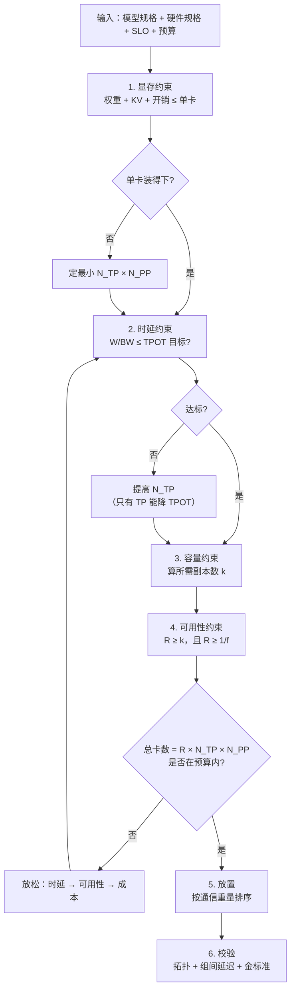
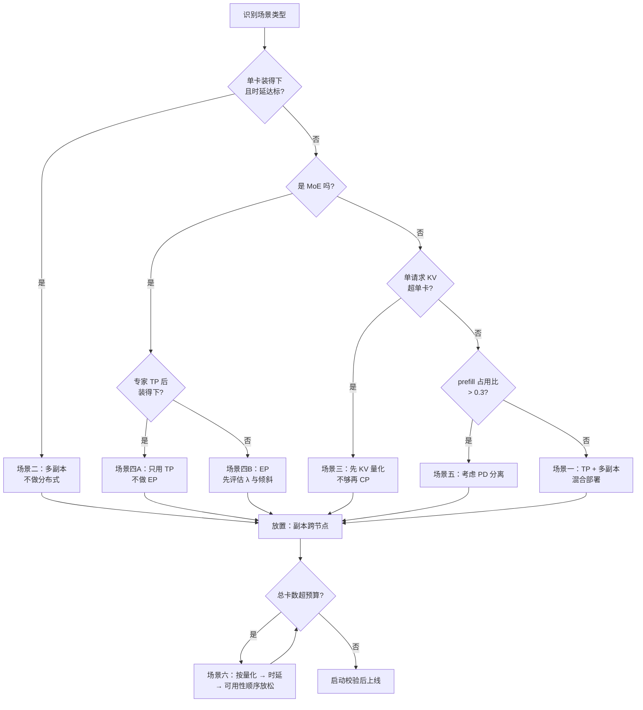

# 分布式推理配置案例研究

> 位置：[InferenceAtlas](../../INDEX.md) > [模块 06](README.md) > 当前文档
> 信息截至：2026-07-29 ｜ 最后核验：2026-07-29 ｜ 内容版本：v0.1
> 时效性等级：中
> 相关主题：[分布式推理总览](01_distributed_inference_overview.md)｜[多节点服务拓扑](09_multi_node_serving_topologies.md)｜[如何设计推理系统](../00_start_here/04_how_to_design_an_inference_system.md)

## 本章导读

前十章分别给出了各并行方式的原理与判据。本章把它们串起来，用**六个完整的配置推演**演示如何从需求走到配置。

**关于本章性质的重要说明**：受当前环境的网络出口策略限制（详见 [AGENTS.md 第 11 节](../../AGENTS.md)），本库无法访问 `arxiv.org`、`docs.nvidia.com`、`mlcommons.org` 等一手来源，因此**无法核验任何真实公司的部署规格、硬件参数或实测数据**。

按本库的披露纪律（[AGENTS.md 第 5 节](../../AGENTS.md)），**不得凭记忆书写任何未经一手核验的规格数字**。因此本章：

- **不引用任何真实公司的部署案例**；
- **不使用任何真实的 GPU 型号、显存容量、带宽或算力数字**；
- 全部案例使用**明确标注的假设参数**，用于演示推导方法而非描述现实。

**这是一个方法论章节，不是案例集**。它的价值在于展示"给定参数如何走完决策链"，而这个方法在读者代入自己的真实参数后立即可用。当网络策略允许核验一手来源后，本章应当补充真实案例（见第 5 节的待办）。

## 学习目标

读完本章后，读者应能够：

1. 把前十章的判据串成一条可执行的决策链；
2. 对给定的模型、硬件与 SLO，推导出完整的并行配置与放置方案；
3. 识别六类典型场景各自的主导约束；
4. 在约束冲突时判断应当放松哪一项；
5. 用同一套方法处理自己的部署场景。

## 核心结论

- **决策链的顺序是固定的**：显存 → 时延 → 容量 → 可用性 → 放置。前面的约束不满足，后面的优化无意义。
- **六类场景的主导约束各不相同**：小模型高吞吐受批与副本数主导，大模型低时延受 TP 度主导，超长上下文受 KV 与 CP 主导，MoE 受专家显存与倾斜主导。
- **约束冲突时的放松优先级**：先放松时延目标，再放松可用性，最后才增加成本。这个顺序应由业务确认而非工程默认。
- **每个案例的最后一步都是"校验放置"**——这是唯一能防住静默数倍性能损失的手段。

## 1. 问题定义、系统边界与工作负载

### 1.1 决策链

前十章的判据可以串成一条固定顺序的链：



**图解读**：
1. **本图展示什么**：从需求到配置的六步决策链，含一个"放松约束"的回路。
2. **核心瓶颈**：瓶颈是第 4 步之后的预算检查——**四个约束（显存、时延、容量、可用性）共同决定总卡数，而它可能超预算**。此时必须放松某一项，且放松的顺序是一个业务决策而非工程决策。
3. **图中的 trade-off**：回路里的放松顺序体现了核心权衡——时延目标通常最容易放松（用户对慢一点的容忍度高于对不可用的容忍度），可用性次之，成本最后。
4. **面试如何引用**：被问"给你 X 卡和 Y 模型怎么部署"时，按这张图逐步推导，并在预算不足时主动询问"哪一项可以放松"——这比直接给一个配置更专业。

### 1.2 本章的假设参数体系

为了让推导可执行，本章定义一组**纯假设的**符号化参数。**这些数字不对应任何真实硬件或模型**，仅用于演示计算。

**假设的加速器 X**（虚构，仅用于演示）：

| 参数 | 符号 | 假设值 |
|---|---|---|
| 显存 | $M_{\text{dev}}$ | 80 GB |
| 有效内存带宽 | $\text{BW}_{\text{HBM}}$ | 2.0 TB/s |
| 有效算力（bf16） | $\text{FLOPS}$ | 400 TFLOP/s |
| 节点内卡数 | — | 8 |
| 节点内互联有效带宽 | $\text{BW}_{\text{intra}}$ | 400 GB/s |
| 节点内小消息延迟 | $\alpha_{\text{intra}}$ | 5 μs |
| 跨节点有效带宽 | $\text{BW}_{\text{inter}}$ | 50 GB/s |
| 跨节点小消息延迟 | $\alpha_{\text{inter}}$ | 50 μs |

**假设的模型 M-Large**（虚构）：

| 参数 | 符号 | 假设值 |
|---|---|---|
| 参数量 | $P$ | 200 B |
| 层数 | $L$ | 80 |
| 隐藏维度 | $d$ | 8192 |
| 注意力头数 | $H$ | 64 |
| KV 头数（GQA） | $H_{kv}$ | 8 |
| 头维度 | $d_h$ | 128 |
| 权重精度 | $b_w$ | 2 B（bf16） |
| KV 精度 | $b_{kv}$ | 2 B |

**派生量**：

$$
W = P \cdot b_w = 200 \times 10^9 \times 2 = 400 \text{ GB}
$$

$$
m_{\text{tok}} = 2 L H_{kv} d_h b_{kv} = 2 \times 80 \times 8 \times 128 \times 2 = 327{,}680 \text{ B} \approx 320 \text{ KiB/token}
$$

**所有后续计算都基于这两组假设参数**。读者应代入自己的真实参数重做。

## 2. 原理、数学与性能模型

### 2.1 案例一：大模型 + 严格时延（交互式对话）

**需求**：模型 M-Large，TPOT ≤ 20 ms，TTFT ≤ 500 ms，容忍 25% 容量损失。

**第 1 步：显存**

$$
N_{\text{TP}} \cdot N_{\text{PP}} \ge \frac{W}{M_{\text{dev}} - M_{\text{KV,min}} - M_{\text{overhead}}} = \frac{400}{80 - 20 - 5} = \frac{400}{55} \approx 7.3 \Rightarrow 8
$$

（假设至少留 20 GB 给 KV、5 GB 给开销。）

**第 2 步：时延**

单卡权重读取时间：

$$
T_{\text{weight}} = \frac{W}{\text{BW}_{\text{HBM}}} = \frac{400 \text{ GB}}{2.0 \text{ TB/s}} = 200 \text{ ms}
$$

要求 $\le 20$ ms，因此需要

$$
N_{\text{TP}} \ge \frac{200}{20} = 10
$$

**但 TP 度受 $H_{kv} = 8$ 约束**（见 [张量并行推理](02_tensor_parallel_inference.md) 2.4）。$N_{\text{TP}} = 8$ 时：

$$
T_{\text{weight}}(8) = \frac{200}{8} = 25 \text{ ms} > 20 \text{ ms}
$$

**约束冲突**。选项：

| 选项 | 效果 | 代价 |
|---|---|---|
| $N_{\text{TP}} = 16$（KV 复制 2 份） | $T_{\text{weight}} = 12.5$ ms ✔ | KV 显存翻倍；跨节点 TP |
| 权重量化到 int8（$b_w=1$） | $W = 200$ GB，$T_{\text{weight}}(8) = 12.5$ ms ✔ | 精度损失 |
| 放松 TPOT 到 25 ms | $N_{\text{TP}} = 8$ ✔ | 用户体验 |

**推荐：权重量化**。它同时解决显存与时延（$W$ 减半使两个约束都放松），且不需要跨节点 TP。

量化后重算第 1 步：$N_{\text{TP}} \cdot N_{\text{PP}} \ge 200/55 \approx 3.6 \Rightarrow 4$。而时延要求 $N_{\text{TP}} \ge 100/20 = 5 \Rightarrow$ 取 8（下一个能整除 $H$ 与 $H_{kv}$ 的值）。

**第 3 步：通信开销校验**

$N_{\text{TP}}=8$，节点内。decode 每步通信：

$$
T_{\text{comm}} \approx 2L \left( \alpha_{\text{intra}} \cdot f(8) + \frac{2 \cdot B d b_a}{\text{BW}_{\text{intra}}} \right)
$$

取 $B=32$、$b_a=2$、$f(8) \approx 2$（ring 的步数因子已含在带宽项，这里 $f$ 保守取 2）：

- 固定延迟项：$2 \times 80 \times 5\,\mu s \times 2 = 1.6$ ms
- 带宽项：$2 \times 80 \times \frac{2 \times 32 \times 8192 \times 2}{400 \times 10^9}$ = $160 \times \frac{1.05 \text{ MB}}{400 \text{ GB/s}}$ = $160 \times 2.6\,\mu s$ = 0.42 ms

$$
T_{\text{comm}} \approx 2.0 \text{ ms}
$$

**占单步的比例**：$2.0 / (12.5 + 2.0) = 14\%$。可接受。

**注意固定延迟项（1.6 ms）是带宽项（0.42 ms）的近 4 倍**——这印证了 [张量并行推理](02_tensor_parallel_inference.md) 2.3 的结论：**decode 的 TP 代价主要来自"次数多"**。

**第 4 步：副本与可用性**

容忍 25% 损失 → $R \ge 4$。每副本 8 卡 → 总计 $4 \times 8 = 32$ 卡 = 4 个节点。

**第 5 步：放置**

| 维度 | 度数 | 放置 |
|---|---|---|
| TP | 8 | 每节点一组（整节点） |
| 副本 | 4 | 每节点一个副本 |

- TP 组严格在节点内 ✔
- 副本跨节点分布 ✔
- 单卡故障损失 25% ✔

**最终配置**：4 节点 × 8 卡，TP=8，int8 权重量化，每节点一个副本。

### 2.2 案例二：小模型 + 高吞吐（批量处理）

**需求**：假设模型 M-Small（$P = 8$ B，$W = 16$ GB bf16，$L=32$，$H_{kv}=8$，$d=4096$），无严格时延要求，最大化吞吐，16 卡预算。

**第 1 步：显存**

$W = 16$ GB $\ll 80$ GB，**单卡装得下**，且还剩约 59 GB 给 KV。

**第 2 步：时延**

$$
T_{\text{weight}} = \frac{16}{2000} = 8 \text{ ms}
$$

无时延要求，**不需要 TP**。

**第 3 步：容量**

每卡可用 KV 59 GB。设平均序列长 4096，$m_{\text{tok}} = 2\times32\times8\times128\times2 = 131{,}072$ B $= 128$ KiB：

$$
B_{\max} = \frac{59 \text{ GB}}{4096 \times 128 \text{ KiB}} = \frac{59 \times 10^9}{5.37 \times 10^8} \approx 110
$$

**每卡可并发约 110 个请求**。16 卡 = 16 个独立副本，总并发约 1760。

**第 4 步：可用性**

16 个副本，单卡故障损失 $1/16 = 6.25\%$。远优于案例一。

**第 5 步：放置**

无并行组，全是副本。**副本跨节点分布**（2 节点各 8 个）。

**最终配置**：16 个单卡副本，无模型并行。

> **本案例的要点**：**当单卡装得下且无时延约束时，正确答案是"不要分布式"**。16 个独立副本的吞吐远高于任何模型并行配置——因为零通信开销，且故障域最小。这是 [分布式推理总览](01_distributed_inference_overview.md) 1.1 结论的直接体现。

### 2.3 案例三：超长上下文

**需求**：模型 M-Large（int8 权重，$W=200$ GB），单请求上下文 512K token，TTFT ≤ 60 s。

**第 1 步：单请求 KV**

$$
M_{\text{KV}}^{\text{req}} = 512{,}000 \times 320 \text{ KiB} = 512{,}000 \times 327{,}680 \text{ B} \approx 168 \text{ GB}
$$

**单请求的 KV 就是 168 GB，远超单卡的 80 GB**。

**第 2 步：切分能力**

| 手段 | 可切到 | 剩余每卡 |
|---|---|---|
| TP=8（受 $H_{kv}$ 限） | $168/8 = 21$ GB | + 权重 $200/8 = 25$ GB = 46 GB ✔ |

**TP=8 已经够了**——每卡 46 GB，在 80 GB 内。**本例不需要 CP**。

**但如果上下文是 2M token**：

$$
M_{\text{KV}} = 2{,}000{,}000 \times 320 \text{ KiB} \approx 655 \text{ GB}, \quad \text{TP=8 后每卡 } 82 \text{ GB} > 80 \text{ GB} \times
$$

**此时需要额外手段**。按 [KV 传输](08_kv_cache_transfer_and_remote_memory.md) 4.1 的优先级：

| 手段 | 效果 | 每卡 KV |
|---|---|---|
| KV 量化到 int8（$b_{kv}=1$） | 减半 | 41 GB ✔ |
| CP=2 | 减半 | 41 GB ✔ |

**推荐 KV 量化**——它比 CP 简单得多，且同时降低所有 KV 相关成本。

**第 3 步：若 KV 量化仍不够（如 4M token）**，则引入 CP。检查 prefill 的重叠条件（[序列/上下文并行](04_sequence_context_parallel_inference.md) 2.4）：

$$
n_q \ge \frac{H_{kv}}{H} \cdot \frac{b_{kv}}{2} \cdot \frac{\text{FLOPS}}{\text{BW}_{\text{intra}}} = \frac{8}{64} \cdot \frac{2}{2} \cdot \frac{400 \times 10^{12}}{400 \times 10^9} = 0.125 \times 1 \times 1000 = 125
$$

- prefill 时每设备的 $n_q = S/N_{\text{CP}}$，对 4M token、$N_{\text{CP}}=4$ 就是 100 万——**远超 125，重叠轻松满足** ✔
- **decode 时 $n_q = 1 \ll 125$，重叠必然失败** ✘
- 若把 KV 量化到 int8（$b_{kv}=1$），临界值降到 62.5——**KV 量化让重叠门槛减半**

**结论**：**prefill 用 CP，decode 前做 KV 重分布**（[序列/上下文并行](04_sequence_context_parallel_inference.md) 4.2）。

**第 4 步：TTFT 校验**

prefill 计算量（含注意力二次项，$S=4$M）：

$$
T_{\text{prefill}} \approx \frac{2 P S}{N \cdot \text{FLOPS}} + \frac{\text{注意力项}}{N \cdot \text{FLOPS}}
$$

线性项：$\frac{2 \times 200\times10^9 \times 4\times10^6}{32 \times 400\times10^{12}} = \frac{1.6\times10^{18}}{1.28\times10^{16}} = 125$ s

**已经超过 60 s 的 TTFT 目标**（还没算注意力二次项）。必须：
- 增加设备数（$N=64$ → 62 s，仍勉强）；
- 或放松 TTFT 目标；
- 或使用稀疏注意力降低二次项。

> **本案例的要点**：**超长上下文的瓶颈往往不是显存而是 prefill 的时间**。KV 装得下不代表能在可接受的时间内算完。

### 2.4 案例四：MoE 模型

**需求**：假设 MoE 模型 M-MoE（$E=64$ 专家，$k=2$，每专家 $P_{\text{expert}}=2$ B 参数，非 MoE 部分 20 B，$L=48$，其中 MoE 层 48 个），bf16。

**第 1 步：总参数与显存**

$$
P_{\text{total}} = 20 + 48 \times 64 \times 2 = 20 + 6144 = 6164 \text{ B 参数}
$$

等等——这个数字说明专家参数量的算法需要澄清。设**每层每专家** $P_{\text{expert-layer}} = 2/48 \approx 0.042$ B，则每层 64 专家共 2.7 B，48 层共 128 B。

**重新定义假设**：设 MoE 部分总参数 128 B，非 MoE 部分 20 B，总计 148 B。

$$
W = 148 \times 2 = 296 \text{ GB}
$$

**激活参数量**：$P_{\text{act}} = 20 + 128 \times \frac{2}{64} = 20 + 4 = 24$ B。

**第 2 步：覆盖率与带宽**

$k/E = 2/64 = 1/32$。临界批（[MoE 推理](05_moe_inference_and_expert_parallelism.md) 2.1）：

$$
n^* \approx \frac{2.303}{1/32} \approx 74 \text{ token}
$$

**decode 批超过约 74 时，专家覆盖率已达 90%，带宽读取接近全部 296 GB**。

$$
T_{\text{weight}}(\text{大批}) \approx \frac{296}{2000} = 148 \text{ ms} \text{（单卡）}
$$

**对比同等激活量（24 B）的 dense 模型**：$W_{\text{dense}} = 48$ GB，$T = 24$ ms。**MoE 慢 6 倍**——这正是 [MoE 推理](05_moe_inference_and_expert_parallelism.md) 2.2 的 $\rho(B) E/k$ 结论。

**第 3 步：并行配置**

显存：$296 / 55 \approx 5.4 \Rightarrow$ 至少 6 卡，取 8（整节点）。

$$
\text{每卡权重} = \frac{296}{8} = 37 \text{ GB}
$$

**是否做 EP？** 按 [MoE 推理](05_moe_inference_and_expert_parallelism.md) 2.6 的判据：MoE 权重 $128 \times 2 = 256$ GB，TP=8 后每卡 32 GB——**装得下，因此不做 EP**，只用 TP。

> **这消除了 all-to-all 与全部倾斜问题**（[MoE 负载均衡](06_moe_routing_all_to_all_and_load_balancing.md) 3.2），是本案例最重要的决策。

**第 4 步：若专家更大（如 MoE 部分 512 B 参数）**

$$
W_{\text{moe}} = 1024 \text{ GB}, \quad \text{TP=8 后每卡 } 128 \text{ GB} > 80 \times
$$

此时必须 EP。取 $N_{\text{EP}}=2$（最小可行）：每卡 64 GB ✔

**倾斜评估**：decode 批 $B=32$，$\lambda = Bk/E = 32 \times 2/64 = 1$。按 [MoE 负载均衡](06_moe_routing_all_to_all_and_load_balancing.md) 2.1：

$$
\sigma_{\text{stat}} \approx 1 + \sqrt{\frac{2\ln 64}{1}} = 1 + \sqrt{8.32} = 3.88
$$

**效率上限只有 26%**——纯粹来自统计涨落，即使路由完全均匀。

**缓解**：增大批。$B=256$ 时 $\lambda=8$，$\sigma \approx 2.02$，效率 50%。**MoE 强烈倾向大批**（[MoE 负载均衡](06_moe_routing_all_to_all_and_load_balancing.md) 3.6）。

### 2.5 案例五：PD 分离

**需求**：RAG 场景，prompt 平均 8000 token，输出平均 200 token，模型 M-Large（int8，$W=200$ GB）。

**第 1 步：prefill 占用比**

单请求 prefill 时间（TP=8）：

$$
T_{\text{prefill}} = \frac{2 \times 200\times10^9 \times 8000}{8 \times 400\times10^{12}} = \frac{3.2\times10^{15}}{3.2\times10^{15}} = 1.0 \text{ s}
$$

单请求 decode 时间：

$$
T_{\text{decode}} = 200 \times T_{\text{step}} = 200 \times \frac{200/8}{1000} = 200 \times 25\text{ms} = 5.0 \text{ s}
$$

**prefill 占单请求总时间的** $1.0/6.0 = 17\%$。

在混合部署下，若系统满载，prefill 占用比约等于这个 17%。按 [PD 分离](07_prefill_decode_disaggregation.md) 2.2 的表：

$$
\text{TPOT 改善} = \frac{1}{1-0.17} = 1.20\times
$$

**收益只有 20%**——低于 1.43×（占用比 0.3）的门槛。

**第 2 步：KV 传输代价**

$$
M_{\text{KV}} = 8000 \times 320 \text{ KiB} = 2.6 \text{ GB}
$$

跨节点传输（$\text{BW}_{\text{inter}} = 50$ GB/s）：

$$
T_{\text{transfer}} = \frac{2.6}{50} = 52 \text{ ms}
$$

**相对 prefill 时间**：$52/1000 = 5.2\%$。可接受。

**第 3 步：判断**

- 收益 1.20×，代价 5.2% 的 TTFT 增加；
- 按 [PD 分离](07_prefill_decode_disaggregation.md) 4.2，**占用比 < 0.3 时不建议分离**；
- **推荐：先用分块 prefill**，它能拿到大部分收益而复杂度低得多。

**第 4 步：如果 prompt 是 64K 而非 8K**

$$
T_{\text{prefill}} = 8 \text{ s}, \quad \text{占单请求} = \frac{8}{8+5} = 62\%
$$

$$
\text{TPOT 改善} = \frac{1}{1-0.62} = 2.6\times
$$

$$
M_{\text{KV}} = 21 \text{ GB}, \quad T_{\text{transfer}} = 420 \text{ ms}, \quad \text{相对 prefill} = 5.2\%
$$

- **注意传输相对占比仍是 5.2%**——印证 [PD 分离](07_prefill_decode_disaggregation.md) 2.1 的"与 prompt 长度无关"；
- **收益从 1.20× 升到 2.6×**，**此时分离明确划算**。

> **本案例的要点**：**分离的划算与否由 prefill 占用比决定，而传输的相对代价是一个与长度无关的常数**。这两个量都可以在部署前算出。

### 2.6 案例六：约束冲突时的取舍

**需求**：模型 M-Large（bf16，$W=400$ GB），TPOT ≤ 10 ms，容忍 10% 容量损失，预算 32 卡。

**第 1 步：时延要求的 TP 度**

$$
N_{\text{TP}} \ge \frac{W/\text{BW}}{10\text{ms}} = \frac{200 \text{ ms}}{10 \text{ ms}} = 20
$$

**第 2 步：可用性要求的副本数**

容忍 10% 损失 → $R \ge 10$。

**第 3 步：总卡数**

$$
N_{\text{total}} = R \times N_{\text{TP}} \ge 10 \times 20 = 200 \text{ 卡} \gg 32
$$

**严重超预算（6 倍）**。必须放松。

**放松选项的量化对比**：

| 放松项 | 调整 | 所需卡数 | 代价 |
|---|---|---|---|
| 权重量化 int8 | $W \to 200$ GB，$N_{\text{TP}} \ge 10$ | $10 \times 10 = 100$ | 精度损失 |
| + 量化 int4 | $W \to 100$ GB，$N_{\text{TP}} \ge 5 \Rightarrow 8$ | $10 \times 8 = 80$ | 更大精度损失 |
| + 放松 TPOT 到 25 ms | $N_{\text{TP}} \ge 2 \Rightarrow 4$（int4） | $10 \times 4 = 40$ | 用户体验 |
| + 放松可用性到 25% | $R \ge 4$ | $4 \times 4 = 16$ ✔ | 故障影响更大 |
| + 放松 TPOT 到 50 ms | $N_{\text{TP}} \ge 2$ | $4 \times 2 = 8$ | 体验明显下降 |

**在 32 卡预算内的可行组合**：int4 量化 + TPOT 25 ms + 可用性 25% → 16 卡（还有余量可增加副本到 $R=8$，可用性提升到 12.5%）。

**最终推荐**：int4 量化、$N_{\text{TP}}=4$、$R=8$、总计 32 卡。TPOT 约 25 ms，单卡故障损失 12.5%。

> **本案例的要点**：**约束冲突时必须量化每个放松选项的代价，把选择权交给业务**。工程方的职责是把选项与代价讲清楚，而不是默默地选一个。放松顺序（量化 → 时延 → 可用性）是一个业务决策。

## 3. 实现机制与系统设计

### 3.1 六个案例的对照

| 案例 | 主导约束 | 关键决策 | 最终配置 |
|---|---|---|---|
| 一：大模型交互式 | 时延 + $H_{kv}$ 上限 | 权重量化解决双重约束 | TP=8，4 副本，32 卡 |
| 二：小模型高吞吐 | 无（单卡可行） | **不做分布式** | 16 个单卡副本 |
| 三：超长上下文 | KV 显存 → prefill 时间 | KV 量化优先于 CP | TP=8 + KV int8 |
| 四：MoE | 专家显存 + 倾斜 | **能不做 EP 就不做** | TP=8，不做 EP |
| 五：PD 分离 | prefill 占用比 | 占用比 < 0.3 不分离 | 混合 + 分块 prefill |
| 六：约束冲突 | 预算 | 量化 → 时延 → 可用性 | int4，TP=4，8 副本 |

**贯穿六个案例的三条规律**：

1. **量化是最通用的杠杆**。案例一、三、六都用它解决了看似需要更多硬件的问题。它同时放松显存、时延、传输三个约束。
2. **"不做"常常是正确答案**。案例二不做分布式、案例四不做 EP、案例五不做分离——三个案例的最优解都是"用更简单的方案"。
3. **约束之间有耦合**。$H_{kv}$ 限制 TP 度（案例一）、并行度限制副本数（案例六）、KV 大小影响传输可行性（案例五）——不能孤立地优化任何一项。

### 3.2 从案例到自己的部署

**必需的输入**（读者必须自测，本库不提供）：

| 输入 | 获取方式 | 用于 |
|---|---|---|
| $W$、$P$、$L$、$H$、$H_{kv}$、$d_h$ | 模型配置 | 全部计算 |
| $M_{\text{dev}}$ | 硬件规格 | 显存约束 |
| $\text{BW}_{\text{HBM}}$（**有效值**） | 实测（不是标称值） | 时延约束 |
| $\text{FLOPS}$（**有效值**） | 实测 | prefill 时间 |
| 各层链路的 $(\alpha, \text{BW})$ | 实测（[多节点服务拓扑](09_multi_node_serving_topologies.md) 第 5 节） | 通信开销、放置 |
| 单设备可用率 | 运维统计（[容错](10_fault_tolerance_and_graceful_degradation.md) 第 5 节） | 冗余计算 |
| 工作负载的长度分布 | 生产监控 | 容量、PD 分离判断 |

**"有效值而非标称值"是一个关键提醒**：标称带宽与算力在实际负载下都达不到。用标称值算出的配置会系统性乐观，导致 SLO 不达标。

### 3.3 推导的检查清单

完成推导后，逐项确认：

```
[ ] 显存：权重/N + KV/min(N_TP, H_kv)/N_PP + 开销 ≤ 单卡显存
[ ] 时延：W/(N_TP · BW_eff) + 通信开销 ≤ TPOT 目标
[ ] TP 度整除 H 与 H_kv（或已接受 KV 复制）
[ ] TP 度 ≤ 节点内卡数（或已改用 PP 跨节点）
[ ] 通信开销占单步 < 20%（否则重新评估 TP 度）
[ ] 副本数 R ≥ 1/f（f 为可容忍的容量损失比例）
[ ] 副本数 R ≥ k（k 为满足 SLO 所需的副本数）
[ ] 总卡数在预算内
[ ] 放置：TP 组在节点内，副本跨节点
[ ] MoE：若专家能装下则不做 EP
[ ] MoE：已评估 λ = Bk/E 下的倾斜因子
[ ] 长上下文：已优先尝试 KV 量化再考虑 CP
[ ] PD 分离：已测 prefill 占用比且 > 0.3
[ ] 启动校验：拓扑 + 组间延迟 + 金标准
```

## 4. 性能、成本、能耗与可靠性 trade-off

### 4.1 六个案例的成本对照

以案例六的假设为基准（$W=400$ GB bf16），比较不同放松组合的单位成本：

设单卡成本为 $c$，吞吐正比于副本数 × 每副本吞吐。

| 配置 | 卡数 | 副本数 | 相对吞吐 | 相对单位成本 |
|---|---|---|---|---|
| bf16, TP=20, R=10 | 200 | 10 | 10 × $\eta(20)$ | 高 |
| int8, TP=10, R=10 | 100 | 10 | 10 × $\eta(10)$ | 中 |
| int4, TP=4, R=8 | 32 | 8 | 8 × $\eta(4)$ | **最低** |

- $\eta(N)$ 是 TP 度 $N$ 下的并行效率（次线性，$\eta(N) < N$）。
- **低 TP 度 + 多副本的单位成本最低**——因为副本是零通信的线性扩展。
- 这印证了 [分布式推理总览](01_distributed_inference_overview.md) 4.2 的 $n/\eta(n) \ge 1$。

**但低 TP 度意味着高 TPOT**。因此：

> **单位成本与时延是直接对立的**，而量化是唯一能同时改善两者的手段（它减少了真实工作量）。

### 4.2 放松顺序的一般原则

案例六演示了放松的量化。一般原则：

| 优先级 | 放松项 | 理由 |
|---|---|---|
| 1 | **量化** | 减少真实工作量，多个约束同时放松，代价是可测量的精度 |
| 2 | **时延目标** | 用户对慢的容忍度通常高于对不可用的容忍度 |
| 3 | **可用性目标** | 可用性下降是概率性的，影响不是必然发生 |
| 4 | **成本** | 最后手段 |

**但这个顺序应由业务确认**。某些场景（如金融、医疗）可能把可用性排在时延之前；某些场景（如离线批处理）时延几乎可以无限放松。**工程方的职责是给出量化的选项表（如案例六的表），而不是替业务做选择**。

### 4.3 能耗视角

各案例的能耗特征：

| 案例 | 能耗特征 |
|---|---|
| 二（单卡副本） | **最优**——零通信、零等待 |
| 一（TP=8） | 通信与同步等待带来开销 |
| 四（MoE 不做 EP） | 读取全部专家权重，能耗高于同等激活量 dense |
| 四（MoE 做 EP） | 额外的 all-to-all 与倾斜等待 |
| 三（CP） | prefill 阶段重叠良好，能耗接近理想 |
| 五（PD 分离） | KV 传输的额外能耗，但两池效率更高 |

**量化在能耗上同样是纯收益**：更少的字节读取直接意味着更少的能量。

## 5. benchmark、真实案例或公开部署案例

**本节是本章的一个明确缺口，必须坦率说明。**

当前环境的网络出口策略阻断了 `arxiv.org`、`docs.nvidia.com`、`mlcommons.org`、`usenix.org`、`huggingface.co` 等全部一手来源（详见 [AGENTS.md 第 11 节](../../AGENTS.md)）。这意味着本库**无法核验任何真实公司的部署规格、硬件参数、实测吞吐或时延数据**。

按本库的披露纪律（[AGENTS.md 第 5 节](../../AGENTS.md)），**凭记忆书写规格数字是被明确禁止的**。因此本章：

| 内容 | 状态 |
|---|---|
| 第 1.2 节的硬件与模型参数 | **虚构的假设值**，已明确标注，不对应任何真实产品 |
| 第 2 节的六个案例 | **方法演示**，基于上述假设参数 |
| 真实公司的部署案例 | **未提供** |
| 公开的分布式推理系统论文数据 | **未引用** |
| MLPerf 等基准的实测结果 | **未引用** |

**待办事项**（网络策略允许后应补充）：

| 待补充内容 | 需要的来源 | 优先级 |
|---|---|---|
| 真实加速器的显存、带宽、算力规格 | 厂商官方文档 | 高 |
| 真实互联的带宽与延迟 | 厂商官方文档 | 高 |
| 公开的分布式推理系统论文（PD 分离、MoE 服务） | 会议论文 | 高 |
| MLPerf Inference 的公开提交结果 | MLCommons | 中 |
| 开源框架的默认并行配置与文档 | 各项目仓库 | 中 |
| 公开的生产部署经验分享 | 官方技术博客（需辨别是否官方披露） | 中 |

**读者当前可做的**（`独立可复现实验`）：

1. **建立自己的参数表**：按 3.2 的清单实测本系统的所有输入参数。
2. **用真实参数重做六个案例**：把 1.2 的假设值替换为实测值，重新推导。这是本章方法的直接应用。
3. **验证推导结论**：按推导出的配置实际部署，测量 TPOT、吞吐、通信占比，与推导值对比。差异本身是有信息量的（通常来自有效带宽/算力低于假设）。
4. **建立配置基线库**：为本组织的常用模型与硬件组合建立一张配置表，避免每次重新推导。

> 实验方法论要求见 [如何读推理 benchmark](../00_start_here/03_how_to_read_inference_benchmarks.md)。

## 6. 设计决策框架

（本章的决策框架即 1.1 的六步链。这里给出一个更细的分场景入口。）



**图解读**：
1. **本图展示什么**：按场景类型分流的决策入口，把六个案例组织成一棵判定树，终点统一到放置与预算检查。
2. **核心瓶颈**：瓶颈是最上面的"单卡装得下且时延达标"判断。通过它就走最简单的多副本路径（场景二），这是成本、能耗、可用性、运维复杂度四个维度上都最优的配置。**先认真检查这一条，不要因为"模型看起来很大"就跳过**。
3. **图中的 trade-off**：图中三个"能不做就不做"的分支（不做分布式、不做 EP、不做分离）体现了本章的核心态度——**简单方案的隐性收益（运维、可用性、可调试性）通常超过复杂方案的性能收益**。
4. **面试如何引用**：被问一个具体的部署题时，用这张图先分类场景，再走对应的推导路径。这个结构化的开场比直接报配置更能体现系统思维。

### 决策清单

| 问题 | 若答案为"是" | 若答案为"否" |
|---|---|---|
| 已实测有效带宽与算力（非标称）？ | 可以推导 | **先测**，标称值会导致乐观配置 |
| 单卡装得下且时延达标？ | 多副本，不做分布式 | 需要模型并行 |
| 已尝试量化？ | 继续 | **先试**，它同时放松多个约束 |
| MoE 的专家 TP 后装得下？ | 不做 EP | 必须 EP，评估倾斜 |
| 单请求 KV 超单卡？ | 先 KV 量化再 CP | TP/PP 足够 |
| prefill 占用比 > 0.3？ | 考虑分离 | 用分块 prefill |
| 总卡数在预算内？ | 进入放置 | 按顺序放松并给业务量化选项 |
| 已做启动校验？ | 可上线 | **必须做**，静默错误 |

## 7. 常见失败模式与排查路径

| 症状 | 可能原因 | 排查步骤 |
|---|---|---|
| 实测 TPOT 远高于推导值 | 用了标称带宽而非有效带宽（3.2） | 实测 $\text{BW}_{\text{eff}}$ 重算 |
| 通信占比远高于估算 | TP 组跨层（[多节点服务拓扑](09_multi_node_serving_topologies.md) 2.2） | 打印组成员；对比组间延迟 |
| 显存超出推导值 | 忘记开销项或 KV 复制（[张量并行推理](02_tensor_parallel_inference.md) 2.4） | 逐项核算；检查 $N_{\text{TP}}$ 与 $H_{kv}$ |
| MoE 吞吐远低于预期 | 倾斜（[MoE 负载均衡](06_moe_routing_all_to_all_and_load_balancing.md) 2.1） | 测 $\sigma$；对比 $\lambda$ 下的理论值 |
| 长上下文 TTFT 超标 | 只算了 KV 没算 prefill 时间（案例三） | 加上注意力二次项重算 |
| PD 分离后收益不明显 | 占用比本就低（案例五） | 回测占用比；考虑回退 |
| 单卡故障影响过大 | 副本数不足（案例六） | 算 $1/R$；降并行度换副本 |
| 成本远高于同行 | TP 度过高（4.1） | 检查是否可用量化降低 TP 度 |
| 配置无法复现问题 | 未记录实际运行时配置 | 补上配置记录 |

**排查原则**：**推导值与实测值的差异本身是最有价值的信息**。差异通常来自三处：有效带宽/算力低于假设、放置错误、遗漏了某项开销。按这三条依次排查。

## 8. 关联面试主题

1. **六步决策链的顺序及其理由**——见本章 1.1。
2. **为什么"不做分布式"常常是正确答案**——见本章 2.2（案例二）。
3. **量化为什么是最通用的杠杆**——见本章 3.1，它同时放松显存、时延、传输三个约束。
4. **$H_{kv}$ 如何在实际推导中成为硬约束**——见本章 2.1（案例一）。
5. **超长上下文的真正瓶颈往往是 prefill 时间而非显存**——见本章 2.3（案例三）。
6. **MoE 为什么"能不做 EP 就不做"**——见本章 2.4（案例四）。
7. **PD 分离的划算判据与传输代价的长度无关性**——见本章 2.5（案例五）。
8. **约束冲突时的放松顺序，以及为什么这是业务决策**——见本章 2.6、4.2。
9. **单位成本与时延为什么直接对立**——见本章 4.1。
10. **为什么必须用有效带宽而非标称带宽**——见本章 3.2。
11. **decode 的 TP 通信为什么固定延迟项主导**——见本章 2.1 第 3 步的数值。

## 9. 小结

本章把前十章的判据串成一条固定顺序的决策链：**显存 → 时延 → 容量 → 可用性 → 放置 → 校验**。前面的约束不满足，后面的优化没有意义。

六个案例演示了这条链在不同场景下的走法，得出三条贯穿性的规律：

**第一，量化是最通用的杠杆**。案例一用它同时解决了显存与时延的冲突，案例三用它替代了复杂的 CP，案例六用它把 200 卡的需求压到 32 卡。原因是量化**减少了真实工作量**——它不是把负担从一处挪到另一处，因此在显存、时延、传输、能耗、成本上都是正向的。在考虑任何并行方案之前，应当先确认量化的空间已经用尽。

**第二，"不做"常常是正确答案**。案例二不做分布式（单卡装得下且无时延约束时，16 个独立副本远优于任何模型并行）、案例四不做 EP（专家 TP 后装得下时，省掉 all-to-all 与全部倾斜问题）、案例五不做分离（prefill 占用比低于 0.3 时收益不足以抵偿复杂度）。**简单方案的隐性收益——运维成本、可用性、可调试性——通常超过复杂方案的性能收益**，而这些收益在纸面对比中不出现。

**第三，约束之间是耦合的**。$H_{kv}$ 限制 TP 度（案例一），TP 度又限制副本数进而限制可用性（案例六），KV 大小影响 PD 分离的可行性（案例五）。孤立优化任何一项都可能在别处付出更大代价。这正是需要一条固定顺序的决策链的原因。

在约束冲突时（案例六），工程方的职责是**给出量化的放松选项表**——每个选项需要多少卡、代价是什么——而不是默默地选一个。放松的一般顺序是**量化 → 时延目标 → 可用性目标 → 成本**，但这个顺序应由业务确认；金融、医疗类场景可能把可用性排在时延之前。

最后必须坦率说明本章的缺口：**受当前环境的网络出口策略限制，本章无法引用任何真实公司的部署案例或经核验的硬件规格**。第 1.2 节的参数是明确标注的虚构假设值，用于演示推导方法。**这是一个方法论章节，不是案例集**。读者代入自己实测的参数后，这套方法立即可用；而真实案例的补充需要等待网络策略允许核验一手来源（待办清单见第 5 节）。

## 关键术语

（本章为综合演练，不引入新术语。各术语的定义见对应章节。）

| 中文术语 | 定义所在章节 |
|---|---|
| 张量并行、流水线并行 | [第 2 章](02_tensor_parallel_inference.md)、[第 3 章](03_pipeline_parallel_inference.md) |
| 上下文并行、Ring Attention | [第 4 章](04_sequence_context_parallel_inference.md) |
| 专家并行、覆盖率、倾斜因子 | [第 5 章](05_moe_inference_and_expert_parallelism.md)、[第 6 章](06_moe_routing_all_to_all_and_load_balancing.md) |
| prefill 占用比、逐层流水传输 | [第 7 章](07_prefill_decode_disaggregation.md) |
| 传输 vs 重算、重算门槛 | [第 8 章](08_kv_cache_transfer_and_remote_memory.md) |
| 通信重量、故障域、放置 | [第 9 章](09_multi_node_serving_topologies.md) |
| 优雅降级、静默错误 | [第 10 章](10_fault_tolerance_and_graceful_degradation.md) |

## 延伸阅读

- [分布式推理总览](01_distributed_inference_overview.md) — 四个动因与决策链的起点
- [多节点服务拓扑](09_multi_node_serving_topologies.md) — 放置与校验
- [容错与优雅降级](10_fault_tolerance_and_graceful_degradation.md) — 可用性约束的来源
- [如何设计推理系统](../00_start_here/04_how_to_design_an_inference_system.md) — 更宏观的设计流程
- [容量规划](../01_foundations_and_metrics/08_capacity_planning.md) — 容量约束的计算
- [成本建模与单位经济学](../01_foundations_and_metrics/06_cost_modeling_and_unit_economics.md) — 成本约束的口径
- [量化内核](../04_compilers_runtimes_and_kernels/09_quantization_kernels.md) — 本章反复使用的杠杆
- [如何读推理 benchmark](../00_start_here/03_how_to_read_inference_benchmarks.md) — 实测参数的方法论

## 主要来源

**本章不含任何经核验的外部数据**。第 1.2 节的硬件与模型参数是为演示推导而虚构的假设值，已在正文明确标注，**不对应任何真实产品**。第 2 节的全部计算基于这些假设值。

受当前环境的网络出口策略限制，本库无法访问任何一手来源以核验真实的部署案例、硬件规格或实测数据（详见 [AGENTS.md 第 11 节](../../AGENTS.md)）。按本库的披露纪律，凭记忆书写规格数字是被禁止的，因此本章**未提供任何真实案例**。第 5 节列出了网络策略允许后应补充的内容与所需来源。

| 类别 | 说明 | 披露标签 |
|---|---|---|
| 第 1.2 节的硬件与模型参数 | **虚构假设值**，仅用于演示 | — |
| 第 2 节的六个案例计算 | 基于上述假设值的推导 | — |
| 各判据与公式 | 来自本模块第 1–10 章，均为本库推导 | — |
| 真实公司的部署案例 | **未提供**，需一手核验 | `待核实` |
| 真实硬件规格与实测数据 | **未提供**，需一手核验 | `待核实` |

## 更新记录

| 日期 | 版本 | 变更 | 核验人 |
|---|---|---|---|
| 2026-07-29 | v0.1 | 初稿：六步决策链、六个基于假设参数的配置推演、放松顺序的量化方法；明确标注本章不含经核验的真实案例并列出待补充清单 | — |
