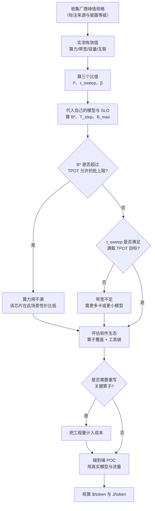
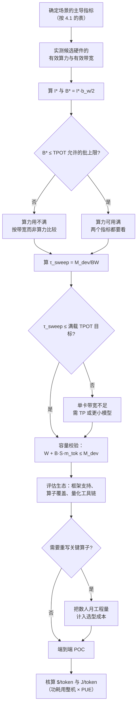

# 推理硬件全景：分类轴与选型口径

> 位置：[InferenceAtlas](../../INDEX.md) > [模块 07](README.md) > 当前文档
> 信息截至：2026-07-29 ｜ 最后核验：2026-07-29 ｜ 内容版本：v0.1
> 时效性等级：高
> 相关主题：`04_hbm_dram_and_memory_hierarchy.md`｜`13_hardware_selection_framework.md`｜[Roofline 与性能建模](../01_foundations_and_metrics/04_roofline_and_performance_modeling.md)

## 本章导读

推理硬件的讨论极易陷入"峰值算力比大小"的误区。这个误区的根源是一个错配：**厂商宣传的核心指标是峰值 FLOPS，而 LLM decode 的瓶颈是内存带宽**。一颗算力翻倍但带宽不变的芯片，在 decode 阶段几乎不会更快。

本章要建立的是**看硬件的正确坐标系**。它由四个轴构成：

1. **算力**（FLOPS，按精度分列）——决定 prefill 与大批场景；
2. **内存带宽**（B/s）——决定 decode 的时延下界；
3. **内存容量**（B）——决定模型能否装下与并发上限；
4. **互联**（带宽与延迟）——决定并行的可行性与代价。

四个轴的**比值**比绝对值更有信息量：算力/带宽比决定 roofline 拐点、容量/带宽比决定能装多少但读多快、互联/算力比决定并行的代价。**本章的核心论点是：应当用比值而非绝对值来比较硬件**。

**关于本章的数据**：受当前环境的网络出口策略限制（详见 [AGENTS.md 第 11 节](../../AGENTS.md)），本库无法访问 `docs.nvidia.com`、厂商官网等一手来源。按本库的披露纪律，**凭记忆书写硬件规格是被禁止的**。因此本章及本模块**不给出任何具体产品的规格数字**，而是给出：分类框架、比较的正确轴、测量的正确方法、以及读者填入自己核验到的数字后即可使用的对照表模板。

## 学习目标

读完本章后，读者应能够：

1. 列出推理硬件的四个核心指标轴，并说明各自决定什么；
2. 解释为什么比值比绝对值更有信息量，并写出三个关键比值；
3. 区分峰值规格与有效值，并说明两者差距的来源；
4. 按架构范式对推理硬件分类，并说明每类的适用工作负载；
5. 建立一张可填充的硬件对照表，并知道每个字段应从哪种来源获取。

## 核心结论

- **decode 的瓶颈是内存带宽而非算力**，因此"峰值 FLOPS 更高"不预示 decode 更快。
- **比值比绝对值更有信息量**：算力/带宽比给出 roofline 拐点，容量/带宽比给出"读完全部显存需要多久"，互联/算力比决定并行代价。
- **峰值与有效值的差距是系统性的**，且不同指标的达成率差异很大——必须分别实测。
- **架构范式决定了硬件的适用边界**：通用并行、脉动阵列、数据流、内存中心、晶圆级各有明确的优势场景与失效场景。
- **软件生态的成熟度是一个必须计入的选型维度**，它常常比硬件指标更能决定实际可达性能。

## 1. 问题定义、系统边界与工作负载

### 1.1 四个指标轴

| 轴 | 单位 | 决定什么 | 在哪个阶段主导 |
|---|---|---|---|
| **算力** | FLOP/s（按精度分列） | 矩阵乘的速度 | prefill、大批 decode |
| **内存带宽** | B/s | 权重与 KV 的读取速度 | **小批 decode** |
| **内存容量** | B | 模型是否装得下、KV 上限 | 全阶段（约束） |
| **互联** | B/s 与 s（延迟） | 并行的可行性与代价 | 分布式部署 |

**为什么带宽在 decode 中主导**（见 [模块 01 第 5 章](../01_foundations_and_metrics/05_memory_bandwidth_and_arithmetic_intensity.md)）：

decode 阶段每步要把全部权重读一遍，而计算量只有 $2PB$（$B$ 为批大小）。算术强度

$$
I_{\text{decode}} = \frac{2PB}{W} = \frac{2PB}{P b_w} = \frac{2B}{b_w}
$$

- $b_w=2$（bf16）时 $I = B$；
- 小批时 $I$ 很小，远低于硬件的 ridge point，**必然是带宽受限**。

**推论**：**在小批 decode 场景，两颗芯片的性能比约等于它们的带宽比，与算力比无关**。这是本模块最重要的单条结论。

### 1.2 三个关键比值

**（a）算力/带宽比**（ridge point）：

$$
I^* = \frac{\text{FLOPS}}{\text{BW}} \quad [\text{FLOP/B}]
$$

- 它是 roofline 的拐点：算术强度低于 $I^*$ 的负载带宽受限，高于则计算受限。
- **$I^*$ 越大，越难"喂饱"这颗芯片**——需要更大的批才能进入计算受限区。
- 由 1.1 的 $I_{\text{decode}} = 2B/b_w$，进入计算受限的批为

$$
B^* = \frac{I^* \cdot b_w}{2}
$$

**这个 $B^*$ 是一个极其实用的量**：它直接告诉你"批要多大才能用满算力"。若 $B^*$ 超过 TPOT 允许的批上限，**这颗芯片的算力在你的场景下永远用不满**。

**（b）容量/带宽比**：

$$
\tau_{\text{sweep}} = \frac{M_{\text{dev}}}{\text{BW}} \quad [\text{s}]
$$

- 物理含义：**把整个显存读一遍需要多久**。
- 它是"模型刚好占满显存时"的 decode 单步时间下界。
- **$\tau_{\text{sweep}}$ 越小，越适合大模型低时延**；越大则显存虽多但读不快，只适合吞吐场景。

**（c）互联/算力比**：

$$
\beta = \frac{\text{BW}_{\text{link}}}{\text{FLOPS}} \quad [\text{B/FLOP}]
$$

- 它决定并行的代价（见 [分布式推理总览](../06_distributed_and_moe_inference/01_distributed_inference_overview.md) 2.2）。
- **$\beta$ 越小，通信相对越贵**，可用的并行度越受限。

**三个比值构成一个硬件的"性格"**：

| $I^*$ | $\tau_{\text{sweep}}$ | $\beta$ | 性格 |
|---|---|---|---|
| 小 | 小 | 大 | 均衡，易用 |
| 大 | 小 | 大 | 算力强但难喂饱，适合大批 |
| 小 | 大 | 大 | 容量大但慢，适合吞吐/离线 |
| 任意 | 任意 | 小 | 并行代价高，倾向单卡或低并行度 |

### 1.3 峰值与有效值

**所有厂商规格都是峰值**，而实际可达的是有效值。两者的差距来源：

| 指标 | 差距来源 | 典型影响 |
|---|---|---|
| 算力 | 无法完美利用矩阵引擎、非矩阵算子、启动开销 | 显著 |
| 内存带宽 | 访存模式不连续、缓存未命中、刷新开销 | 中等 |
| 内存容量 | 框架开销、碎片、通信缓冲 | 中等 |
| 互联带宽 | 协议开销、小消息、拓扑不对称 | 显著（尤其小消息） |

**关键纪律**：

> **本库要求：所有性能推导必须使用有效值；有效值必须实测；峰值只用于标注硬件规格，不用于性能计算。**

用峰值算出的配置会**系统性乐观**，导致 SLO 不达标。这是硬件选型中最常见的错误之一。

**有效值的测量方法**（见第 5 节的清单）：

| 指标 | 测量方法 |
|---|---|
| 有效算力 | 大矩阵乘的实测 FLOP/s（形状应贴近实际模型） |
| 有效带宽 | 大块连续读取的实测 B/s（如 STREAM 类基准） |
| 有效容量 | 加载模型后的实际可用显存 |
| 有效互联 | 集合通信基准，分小消息与大消息 |

**"形状应贴近实际模型"值得强调**：矩阵乘的实测算力强烈依赖形状。用一个 8192×8192×8192 的方阵测出的数字，与模型中实际出现的 $[B, d] \times [d, d_{ff}]$（decode 时 $B$ 很小）差距巨大。**应当用实际模型的算子形状来测**。

## 2. 原理、数学与性能模型

### 2.1 单卡性能上界

给定一颗芯片的有效指标，它在给定模型上的性能上界：

**decode 单步时间**：

$$
T_{\text{step}} \ge \max\left( \frac{W_{\text{eff}}}{\text{BW}_{\text{eff}}}, \; \frac{2 P B}{\text{FLOPS}_{\text{eff}}} \right) + T_{\text{attn}}(B, S)
$$

- $W_{\text{eff}}$：实际要读取的权重字节数（MoE 下是 $\rho(B) W$，见 [MoE 推理](../06_distributed_and_moe_inference/05_moe_inference_and_expert_parallelism.md) 2.1）。

**注意力项**：

$$
T_{\text{attn}} \approx \frac{2 \cdot B \cdot S \cdot m_{\text{tok}}}{\text{BW}_{\text{eff}}}
$$

- decode 时每个请求要读自己的全部 KV，这也是带宽受限。
- **长上下文下这一项可能超过权重读取项**——此时"读 KV"而非"读权重"成为瓶颈。

$$
\frac{T_{\text{attn}}}{T_{\text{weight}}} = \frac{B \cdot S \cdot m_{\text{tok}}}{W}
$$

- **临界点**：当 $B \cdot S \cdot m_{\text{tok}} = W$ 时两者相等。
- **推论**：**批与上下文的乘积越大，KV 读取越主导**。这解释了为什么长上下文高并发场景对带宽的需求远超短上下文。

### 2.2 容量约束

$$
M_{\text{dev}} \ge W + B \cdot S \cdot m_{\text{tok}} + M_{\text{act}} + M_{\text{overhead}}
$$

**可并发数**：

$$
B_{\max} = \frac{M_{\text{dev}} - W - M_{\text{overhead}}}{S \cdot m_{\text{tok}}}
$$

**容量与带宽的联合约束**：把 $B_{\max}$ 代入 2.1 的 $T_{\text{attn}}$。注意 $m_{\text{tok}}$ 的定义已经包含 K 与 V 两份，因此 $B \cdot S \cdot m_{\text{tok}}$ 就是要读取的全部 KV 字节数：

$$
T_{\text{attn}}(B_{\max}) \approx \frac{B_{\max} \cdot S \cdot m_{\text{tok}}}{\text{BW}_{\text{eff}}} = \frac{M_{\text{dev}} - W - M_{\text{overhead}}}{\text{BW}_{\text{eff}}} = \frac{M_{\text{KV,avail}}}{\text{BW}_{\text{eff}}}
$$

- **当 KV 填满可用显存时，读一遍全部 KV 的时间就是 $M_{\text{KV,avail}}/\text{BW}_{\text{eff}}$**。

**这个式子极其有用**：它说明**在满载状态下，注意力部分的单步时间就是"把可用于 KV 的那部分显存读一遍"**。结合 $\tau_{\text{sweep}} = M_{\text{dev}}/\text{BW}$：

$$
T_{\text{step}}^{\text{满载}} \approx \frac{W}{\text{BW}_{\text{eff}}} + \frac{M_{\text{KV,avail}}}{\text{BW}_{\text{eff}}} \approx \frac{M_{\text{dev}}}{\text{BW}_{\text{eff}}} = \tau_{\text{sweep}}
$$

> **核心结论**：**满载运行时，decode 单步时间约等于把整个显存读一遍的时间 $\tau_{\text{sweep}}$**——无论显存里装的是权重还是 KV。

这使 $\tau_{\text{sweep}}$ 成为**预测满载 TPOT 的单一指标**，是硬件比较中信息量最高的一个数。

### 2.3 精度对指标的影响

低精度同时影响三个轴：

| 精度降低 | 算力 | 带宽需求 | 容量需求 |
|---|---|---|---|
| bf16 → fp8 | 通常提升（专用单元） | 减半 | 减半 |
| bf16 → int8 | 通常提升 | 减半 | 减半 |
| bf16 → int4 | 依硬件支持 | 1/4 | 1/4 |

**关键**：**低精度对 decode 的收益主要来自带宽与容量，而非算力**。因为 decode 本就带宽受限，算力的提升用不上。

$$
\frac{T_{\text{step}}(b_w')}{T_{\text{step}}(b_w)} \approx \frac{b_w'}{b_w} \quad \text{（带宽受限区）}
$$

- **权重精度减半，decode 单步时间近似减半**。这是量化在 decode 上收益如此大的原因。

**硬件支持的重要性**：如果硬件没有原生的低精度矩阵引擎，量化后仍需反量化到高精度再算，**只省带宽不省算力**。在带宽受限的 decode 中这仍然是净收益，但在 prefill 中收益有限。

**必须核验的规格项**：某颗芯片在某个精度下的**原生支持情况**（有专用单元、通过转换支持、还是不支持）。这直接影响量化的收益。本库标记为 `待核实`。

### 2.4 架构范式的分类

推理硬件按数据流组织方式可分为几个范式。**每个范式有明确的适用边界**：

| 范式 | 核心思想 | 优势场景 | 失效场景 |
|---|---|---|---|
| **通用并行（SIMT）** | 大量轻量线程，灵活调度 | 通用性最好、生态成熟 | 控制开销、非规则计算 |
| **脉动阵列** | 数据在阵列中流动，复用最大化 | 大矩阵乘、规则形状 | 小批、不规则形状 |
| **数据流** | 按计算图铺开，避免中间存储 | 固定模型、低时延 | 模型频繁变化、需要重编译 |
| **内存中心** | 极大的片上 SRAM，避免片外访存 | 权重能装进片上时极快 | 模型超出片上容量 |
| **晶圆级** | 整片晶圆作为一个芯片 | 极大的片上带宽与容量 | 良率、功耗、成本、编程模型 |

**判断一个架构是否适合某场景的通用方法**：

1. 算出该场景的算术强度 $I$；
2. 算出该架构的 $I^*$；
3. $I < I^*$ → 带宽受限 → 看该架构的带宽（含片上）；
4. $I > I^*$ → 计算受限 → 看该架构的有效算力（考虑形状规则性）。

**"内存中心"范式的特殊性**：它把权重放在片上 SRAM 而非片外 HBM。SRAM 的带宽可以比 HBM 高一到两个数量级，因此在**权重能完全装进片上**时性能极佳。但片上 SRAM 的容量远小于 HBM，因此：

$$
\text{适用条件}：W \le M_{\text{SRAM,total}}
$$

- 若模型超出，需要多芯片拼接（片间通信）或从片外流式加载（退化为带宽受限）。
- **这是一个非常尖锐的适用边界**：装得下则极快，装不下则优势大幅缩水。

### 2.5 软件生态维度

硬件指标之外，**软件生态的成熟度常常更能决定实际可达性能**。评估维度：

| 维度 | 问题 | 影响 |
|---|---|---|
| 框架支持 | 主流推理框架是否原生支持 | 决定能否直接部署 |
| 算子覆盖 | 模型用到的算子是否都有高效实现 | 缺一个关键算子可能拖垮整体 |
| 编译器成熟度 | 图优化、融合、调度的质量 | 决定峰值达成率 |
| 量化工具链 | 是否支持所需精度与量化方案 | 决定能否用上低精度收益 |
| 调试与剖析工具 | 能否定位性能问题 | 决定优化效率 |
| 社区与文档 | 遇到问题能否解决 | 决定工程风险 |

**一个实用的判断**：**如果某个硬件需要为你的模型重写关键算子，把这份工作量计入选型成本**。它通常是数人月量级，且是持续的（模型更新后可能要重做）。

> **经验法则**：**峰值指标高 20% 但生态不成熟的硬件，实际可达性能常常低于峰值指标低 20% 但生态成熟的硬件**。生态的价值在纸面对比中不出现，但在实际部署中主导结果。

## 3. 实现机制与系统设计

### 3.1 硬件评估的完整流程

**图解读**：
1. **本图展示什么**：从收集规格到端到端 POC 的完整评估流程，核心是"峰值 → 有效值 → 比值 → 代入自己的场景"这条链。
2. **核心瓶颈**：瓶颈是"实测有效值"这一步。跳过它直接用峰值规格做决策，是硬件选型中最常见也最昂贵的错误——不同硬件的峰值达成率差异很大，用峰值比较可能得出完全相反的结论。
3. **图中的 trade-off**：中间两个判断（$B^*$ 与 $\tau_{\text{sweep}}$）分别检查"算力能否用满"与"带宽是否够快"。一颗芯片可能在一个上通过而在另一个上失败——**它们检查的是不同的失效模式**。
4. **面试如何引用**：被问"怎么选推理硬件"时，按这张图强调三点：必须实测有效值、必须代入自己的模型算比值、必须把生态成本计入——这比罗列参数对比更有说服力。

### 3.2 对照表模板

本库提供一张**可填充的对照表模板**。所有字段留空，读者填入自己核验到的数字。**每个字段必须标注来源与披露等级**（见 [AGENTS.md 第 5 节](../../AGENTS.md)）。

| 字段 | 单位 | 应从何处获取 | 披露等级 |
|---|---|---|---|
| 峰值算力（各精度） | FLOP/s 或 OP/s | 厂商官方规格文档 | `官方披露` |
| 有效算力（实测） | FLOP/s | 自测（用实际模型形状） | `独立可复现实验` |
| 内存容量 | GB | 厂商官方规格 | `官方披露` |
| 峰值内存带宽 | B/s | 厂商官方规格 | `官方披露` |
| 有效内存带宽 | B/s | 自测 | `独立可复现实验` |
| 互联带宽（每卡） | B/s | 厂商官方规格 | `官方披露` |
| 有效互联带宽 | B/s | 自测（集合通信基准） | `独立可复现实验` |
| 小消息延迟 | s | 自测 | `独立可复现实验` |
| **功耗（芯片级）** | W | 厂商官方规格 | `官方披露` |
| **功耗（板卡级）** | W | 厂商官方规格 | `官方披露` |
| **功耗（整机级）** | W | 厂商官方规格或实测 | `官方披露`/自测 |
| 支持的原生精度 | — | 厂商官方文档 | `官方披露` |
| 主流框架支持 | — | 项目文档/源码 | `开源代码/配置披露` |
| 单价 | 货币 | 报价或云厂商定价 | `官方披露` |

**功耗必须分三级标注**（模块 README 的口径要求）：

| 级别 | 含义 | 常见混淆 |
|---|---|---|
| **芯片级（TDP）** | 加速器芯片本身 | 常被当作整机功耗 |
| **板卡级** | 芯片 + 显存 + 供电 + 散热 | — |
| **整机级** | 全部加速器 + CPU + 内存 + 网卡 + 风扇 + 供电损耗 | 整机通常显著高于加速器之和 |

**为什么必须区分**：数据中心的电力预算是按整机（甚至机架）算的。用芯片级 TDP 做容量规划会严重低估——CPU、内存、网卡、散热与供电效率损失都不在里面。

### 3.3 派生指标表模板

从上表的原始指标派生出对比用的比值。**这张表才是真正用于比较的**：

| 派生指标 | 公式 | 含义 |
|---|---|---|
| ridge point $I^*$ | $\text{FLOPS}_{\text{eff}} / \text{BW}_{\text{eff}}$ | 越大越难喂饱 |
| 满载扫描时间 $\tau_{\text{sweep}}$ | $M_{\text{dev}} / \text{BW}_{\text{eff}}$ | 满载 TPOT 的下界 |
| 互联/算力比 $\beta$ | $\text{BW}_{\text{link}} / \text{FLOPS}_{\text{eff}}$ | 越小并行越贵 |
| 带宽/功耗 | $\text{BW}_{\text{eff}} / P_{\text{board}}$ | decode 场景的能效代理 |
| 算力/功耗 | $\text{FLOPS}_{\text{eff}} / P_{\text{board}}$ | prefill 场景的能效代理 |
| 容量/功耗 | $M_{\text{dev}} / P_{\text{board}}$ | 大模型部署的密度代理 |
| 峰值达成率 | $\text{FLOPS}_{\text{eff}} / \text{FLOPS}_{\text{peak}}$ | 生态成熟度的间接信号 |

**"峰值达成率"是一个被低估的指标**：它间接反映了编译器与算子库的质量。达成率低意味着大量算力被浪费，且这个浪费不体现在任何规格表上。

**"带宽/功耗"对 decode 场景比"算力/功耗"更相关**——因为 decode 带宽受限。用后者比较 decode 能效会得出错误结论。

### 3.4 分区与共享

许多加速器支持**分区**（把一颗物理卡切成多个逻辑实例）。这在推理中有明确的用途：

| 场景 | 分区的价值 |
|---|---|
| 小模型多租户 | 一卡服务多个模型，提高利用率 |
| 隔离性要求 | 分区间硬件隔离，避免互相干扰 |
| 弹性粒度 | 更细的扩缩容单位 |

**代价**：

| 代价 | 说明 |
|---|---|
| 每分区的带宽是总带宽的一部分 | 分区越多，单分区的 decode 越慢 |
| 每分区的容量是总容量的一部分 | 限制单分区可装的模型 |
| 分区间可能仍有共享资源竞争 | 隔离性不一定完美 |

**判据**：**分区适用于"模型小到单分区能装下且带宽够用"的场景**。对大模型，分区没有意义（装不下）；对带宽受限的 decode，分区直接按比例降低性能。

$$
T_{\text{step}}^{\text{分区}} \approx N_{\text{partition}} \cdot T_{\text{step}}^{\text{整卡}} \quad \text{（带宽受限区，同一模型）}
$$

**具体的分区能力（支持几分区、隔离到什么程度）必须查厂商文档**，本库标记为 `待核实`。

### 3.5 主机侧的角色

加速器不是孤立的，主机侧（CPU、内存、存储、网卡）承担若干关键职能：

| 职能 | 影响 |
|---|---|
| 调度与批组装 | CPU 慢会成为小模型的瓶颈 |
| tokenize / detokenize | 高 QPS 下可能占用可观 CPU |
| KV 卸载的目标 | 主机内存容量与 PCIe 带宽 |
| 权重加载 | 存储带宽决定启动时间 |
| 网络收发 | 网卡决定跨节点通信与用户流量 |
| 采样的部分逻辑 | 若在 CPU 上做则可能成为瓶颈 |

**"CPU 可能成为小模型的瓶颈"值得注意**：当模型很小、单步只需几毫秒时，CPU 侧的调度、批组装、tokenize 开销可能与 GPU 计算同量级。**此时增加 GPU 算力毫无用处**。

**判断方法**：测量 GPU 利用率。若 GPU 有明显空闲而吞吐上不去，瓶颈在主机侧。

**主机侧规格的选型要点**（具体数字需查厂商文档，标记 `待核实`）：

| 部件 | 关注点 |
|---|---|
| CPU | 核数（并发调度）、单核性能（延迟敏感路径） |
| 主机内存 | 容量（KV 卸载）、带宽（PCIe 传输的另一端） |
| PCIe | 代次与通道数（决定主机-设备带宽） |
| 存储 | 带宽（权重加载）、容量 |
| 网卡 | 带宽（跨节点通信 + 用户流量） |

## 4. 性能、成本、能耗与可靠性 trade-off

### 4.1 场景与硬件特性的匹配

| 场景 | 主导指标 | 次要指标 | 不重要 |
|---|---|---|---|
| 小批低时延 decode | **内存带宽** | 容量 | 算力 |
| 大批高吞吐 decode | 带宽 + 算力 | 容量 | — |
| prefill 密集（RAG） | **算力** | 带宽 | — |
| 长上下文 | **容量 + 带宽** | 算力 | — |
| 大模型 | **容量** | 带宽、互联 | — |
| MoE | **容量**（全部专家） | 带宽 | 算力 |
| 多租户小模型 | 分区能力、容量 | 带宽 | 算力 |
| 边缘/端侧 | 功耗、容量 | 带宽 | 峰值算力 |

**这张表的用法**：先确定自己的场景，再看主导指标，用它作为比较硬件的首要依据。**用"不重要"那一列的指标比较硬件，是选型错误的常见来源**。

### 4.2 成本口径

$$
c_{\text{token}} = \frac{\text{（设备成本 + 电力成本 + 数据中心成本）}}{\text{token 吞吐}}
$$

**必须区分的成本项**：

| 项 | 说明 | 常见遗漏 |
|---|---|---|
| 设备采购/折旧 | 加速器 + 整机 | 只算加速器 |
| 电力 | 按**整机**功耗 | 用芯片 TDP |
| 制冷 | PUE 因子 | 完全遗漏 |
| 数据中心空间 | 机架位 | 完全遗漏 |
| 网络 | 交换机、线缆 | 完全遗漏 |
| 软件与人力 | 适配、维护 | 完全遗漏 |

**"用芯片 TDP 算电力"是一个系统性低估**：整机功耗包含 CPU、内存、网卡、风扇与供电效率损失，而制冷还要再乘 PUE。

**推荐口径**：

$$
P_{\text{total}} = P_{\text{server}} \times \text{PUE}
$$

- $P_{\text{server}}$：整机实测功耗（不是 TDP 之和）；
- PUE：数据中心的电能使用效率因子。

### 4.3 能效

decode 场景的能效应当用**带宽/功耗**而非算力/功耗（3.3）。更直接的指标是 J/token：

$$
\frac{J}{\text{token}} = \frac{P_{\text{server}} \times \text{PUE}}{\text{tokens/s}}
$$

（详见 [模块 01 第 7 章](../01_foundations_and_metrics/07_energy_efficiency_and_joules_per_token.md)。）

**低精度对能效的双重收益**：更少的字节读取（带宽能耗）+ 更少的计算（若有原生支持）。这使量化成为能效优化的首要手段。

### 4.4 可靠性与供应

| 维度 | 关注点 |
|---|---|
| 硬件故障率 | 影响冗余需求（见 [容错](../06_distributed_and_moe_inference/10_fault_tolerance_and_graceful_degradation.md) 2.1） |
| ECC 与 RAS | 内存错误的检测与纠正能力 |
| 供应与交期 | 影响扩容计划 |
| 生命周期 | 影响折旧与替换规划 |
| 单一供应商风险 | 影响议价与可替代性 |

**供应约束在 AI 硬件上是一个真实的选型因素**——一颗指标更优但拿不到货的芯片，实际价值为零。这类信息属于市场层面，具体内容见 [模块 15](../15_market_economics_and_strategy/)（规划中），且必须基于可核验的来源。

## 5. benchmark、真实案例或公开部署案例

**本节是本模块的一个结构性缺口，必须明确说明。**

受当前环境的网络出口策略限制，本库无法访问 `docs.nvidia.com`、`www.amd.com`、`cloud.google.com`、`aws.amazon.com`、`mlcommons.org` 等一手来源（详见 [AGENTS.md 第 11 节](../../AGENTS.md)）。按本库的披露纪律（[AGENTS.md 第 5 节](../../AGENTS.md)），**凭记忆书写硬件规格、功耗、价格或性能数字是被明确禁止的**。

因此本章及本模块：

| 内容 | 状态 |
|---|---|
| 分类框架、比较的轴、公式 | **已提供**（本库推导） |
| 测量方法与流程 | **已提供** |
| 可填充的对照表模板 | **已提供**（3.2、3.3） |
| 任何具体产品的规格数字 | **未提供** |
| 任何产品间的性能对比结论 | **未提供** |
| MLPerf 等基准的结果 | **未引用** |

**待补充清单**（网络策略允许后）：

| 待补充 | 需要的来源 | 披露等级 |
|---|---|---|
| 各加速器的峰值算力、带宽、容量、功耗 | 厂商官方规格文档 | `官方披露` |
| 各精度的原生支持情况 | 厂商官方文档 | `官方披露` |
| 分区能力与隔离粒度 | 厂商官方文档 | `官方披露` |
| MLPerf Inference 公开提交结果 | MLCommons | `官方披露` |
| 互联规格（带宽、拓扑） | 厂商官方文档 | `官方披露` |
| 框架对各硬件的支持程度 | 各项目仓库与文档 | `开源代码/配置披露` |
| 云上定价 | 云厂商官方定价页 | `官方披露` |

**读者当前可做的自测**（`独立可复现实验`）——这些不依赖外部来源：

1. **有效算力**：用实际模型中出现的矩阵形状做 GEMM 基准，记录各精度的实测 FLOP/s 与峰值达成率。
2. **有效带宽**：大块连续读写基准，记录实测 B/s 与峰值的比值。
3. **ridge point $I^*$**：由上两项相除得到，再算出 $B^* = I^* b_w / 2$。**若 $B^*$ 超过 TPOT 允许的批上限，该芯片的算力在你的场景下用不满**。
4. **满载扫描时间 $\tau_{\text{sweep}}$**：$M_{\text{dev}}/\text{BW}_{\text{eff}}$，与实测的满载 TPOT 对比。
5. **注意力/权重读取的比值**：按 2.1 算 $B S m_{\text{tok}} / W$，判断你的场景是"读权重"还是"读 KV"主导。
6. **互联基准**：小消息与大消息的集合通信延迟与带宽（见 [多节点服务拓扑](../06_distributed_and_moe_inference/09_multi_node_serving_topologies.md) 第 5 节）。
7. **整机功耗实测**：在满载与空载下测整机功耗，与芯片 TDP 之和对比。这个差值往往超出预期。
8. **主机侧瓶颈检查**：测 GPU 利用率。若有明显空闲，定位 CPU 侧的 tokenize、调度或采样开销。
9. **分区的性能影响**：若硬件支持分区，测同一模型在整卡与分区下的 decode 单步时间，验证 3.4 的比例关系。

> 实验方法论要求见 [如何读推理 benchmark](../00_start_here/03_how_to_read_inference_benchmarks.md)。

## 6. 设计决策框架

**图解读**：
1. **本图展示什么**：从场景出发的硬件选型流程，两个关键计算（$B^*$ 与 $\tau_{\text{sweep}}$）分别回答"算力能否用满"与"带宽是否够快"。
2. **核心瓶颈**：瓶颈是第一个判断 $B^* \le$ 批上限。**若不通过，算力指标就不该进入比较**——此时两颗芯片的性能比就是带宽比。跳过这个判断而按算力比较，是硬件选型最常见的错误。
3. **图中的 trade-off**：底部的"生态成本"环节体现了纸面指标与实际可达性能的差距。重写算子的数人月工程量在任何规格表上都不出现，却常常主导实际结果。
4. **面试如何引用**：被问"怎么选推理硬件"时，用这张图先算 $B^*$ 排除"算力用不满"的情形，再用 $\tau_{\text{sweep}}$ 判断带宽——两个数就能过滤掉大部分不合适的选项。

### 决策清单

| 问题 | 若答案为"是" | 若答案为"否" |
|---|---|---|
| 已实测有效值（非峰值）？ | 可以比较 | **先测**，峰值会误导 |
| $B^* \le$ TPOT 允许的批上限？ | 算力可用满 | 只按带宽比较 |
| $\tau_{\text{sweep}} \le$ 满载 TPOT 目标？ | 单卡带宽够 | 需 TP 或降低目标 |
| 容量装得下权重 + 目标并发的 KV？ | 可行 | 需并行或量化 |
| 主流框架原生支持？ | 生态成本低 | 计入适配工程量 |
| 所需精度有原生支持？ | 量化收益完整 | 只省带宽不省算力 |
| 功耗按整机 × PUE 核算？ | 成本准确 | **会系统性低估** |
| 已用带宽/功耗（而非算力/功耗）比较 decode 能效？ | 口径正确 | 结论可能相反 |

## 7. 常见失败模式与排查路径

| 症状 | 可能原因 | 排查步骤 |
|---|---|---|
| 换了算力更强的卡但 decode 没变快 | **decode 带宽受限**（1.1） | 比较两卡的有效带宽而非算力 |
| 实测性能远低于按峰值的估算 | 用了峰值而非有效值（1.3） | 实测有效值重算；查峰值达成率 |
| 峰值达成率很低 | 编译器/算子库不成熟（3.3） | 剖析各算子的达成率；定位瓶颈算子 |
| 长上下文下性能骤降 | KV 读取超过权重读取（2.1） | 算 $BSm_{\text{tok}}/W$；考虑 KV 量化 |
| 满载 TPOT 与 $\tau_{\text{sweep}}$ 接近 | **这是预期行为**（2.2） | 要改善需提高带宽或减少显存占用 |
| 电力预算超支 | 用芯片 TDP 而非整机 × PUE（4.2） | 实测整机功耗重算 |
| GPU 利用率低但吞吐上不去 | 主机侧瓶颈（3.5） | 剖析 CPU 侧的 tokenize/调度/采样 |
| 分区后性能按比例下降 | **这是预期行为**（3.4） | 带宽受限下分区必然如此 |
| 量化后 prefill 没变快 | 硬件无原生低精度支持（2.3） | 查该精度的原生支持情况 |
| 选型时结论相反 | 用了错误的能效口径（3.3） | decode 用带宽/功耗，prefill 用算力/功耗 |

**排查原则**：硬件相关的性能问题，**第一步永远是确认瓶颈在哪个轴**——算力、带宽、容量还是主机侧。用错误的轴去优化是最常见的浪费。

## 8. 关联面试主题

1. **为什么 decode 的性能比约等于带宽比而非算力比**——见本章 1.1，这是最基本也最常被搞错的一点。
2. **三个关键比值及其物理含义**——见本章 1.2。
3. **$B^* = I^* b_w/2$ 的含义与用法**——见本章 1.2，"批要多大才能用满算力"。
4. **满载 TPOT 约等于 $\tau_{\text{sweep}}$ 的推导**——见本章 2.2，信息量最高的单一指标。
5. **KV 读取何时超过权重读取**——见本章 2.1，$BSm_{\text{tok}}$ vs $W$。
6. **低精度对 decode 的收益为什么主要来自带宽**——见本章 2.3。
7. **内存中心架构的尖锐适用边界**——见本章 2.4。
8. **为什么必须区分芯片/板卡/整机三级功耗**——见本章 3.2、4.2。
9. **decode 能效为什么应看带宽/功耗而非算力/功耗**——见本章 3.3。
10. **峰值达成率作为生态成熟度的间接信号**——见本章 3.3。
11. **主机侧何时成为瓶颈**——见本章 3.5。
12. **分区在带宽受限场景下的性能影响**——见本章 3.4。

## 9. 小结

看推理硬件的正确坐标系由四个轴构成——算力、内存带宽、内存容量、互联——而**LLM decode 的瓶颈在带宽而非算力**。这条基本事实推翻了"比峰值 FLOPS"这个最流行的比较方式：在小批 decode 场景，两颗芯片的性能比约等于它们的**有效带宽比**，与算力比无关。

比绝对值更有信息量的是三个比值：

- **ridge point $I^* = \text{FLOPS}/\text{BW}$**，由它得出 $B^* = I^* b_w/2$——"批要多大才能用满算力"。**若 $B^*$ 超过 TPOT 允许的批上限，这颗芯片的算力在你的场景下永远用不满**，此时算力指标不应进入比较。
- **满载扫描时间 $\tau_{\text{sweep}} = M_{\text{dev}}/\text{BW}$**——把整个显存读一遍的时间。满载运行时 decode 单步时间约等于它，无论显存里装的是权重还是 KV。这使它成为预测满载 TPOT 的单一指标。
- **互联/算力比 $\beta$**——决定并行的代价。

两条口径纪律贯穿全模块。**第一，必须用有效值而非峰值**：不同硬件的峰值达成率差异很大，用峰值算出的配置系统性乐观。**第二，功耗必须分芯片/板卡/整机三级标注，成本核算用整机 × PUE**——用芯片 TDP 算电力是一个常见且严重的低估。

在纸面指标之外，**软件生态的成熟度常常更能决定实际可达性能**。峰值达成率是它的一个间接信号；而"是否需要为你的模型重写关键算子"是一个必须计入选型成本的问题——它通常是数人月量级且随模型更新而重复。

最后必须坦率说明本模块的结构性缺口：**受当前环境的网络出口策略限制，本库无法核验任何硬件规格，因此本模块不给出任何具体产品的数字或产品间的对比结论**。本章提供的是分类框架、比较的正确轴、测量方法，以及可填充的对照表模板——读者填入自己核验到的规格与实测的有效值后，这套方法立即可用。第 5 节列出了网络策略允许后应补充的内容与所需来源等级。

## 关键术语

| 中文术语 | 英文 | 定义 | 单位/口径 | 关联文档 |
|---|---|---|---|---|
| ridge point | ridge point | roofline 上带宽受限与计算受限的分界算术强度 | FLOP/B | 本章 1.2 |
| 满载扫描时间 | full-sweep time | 把整个设备显存读一遍所需时间 | s | 本章 1.2、2.2 |
| 有效值 | effective value | 实测可达的性能，区别于厂商峰值 | 依指标 | 本章 1.3 |
| 峰值达成率 | peak attainment | 有效值与峰值之比 | 比例 | 本章 3.3 |
| 芯片级功耗 | chip-level power (TDP) | 加速器芯片本身的功耗 | W | 本章 3.2 |
| 整机级功耗 | server-level power | 含 CPU、内存、网卡、散热与供电损耗 | W | 本章 3.2 |
| 分区 | partitioning | 把一颗物理加速器切成多个逻辑实例 | 分区数 | 本章 3.4 |
| 内存中心架构 | memory-centric architecture | 用大容量片上 SRAM 替代片外 HBM 的设计 | — | 本章 2.4 |
| 脉动阵列 | systolic array | 数据在计算阵列中流动以最大化复用 | — | 本章 2.4 |

## 延伸阅读

- `04_hbm_dram_and_memory_hierarchy.md` — 内存层次的详细展开
- `05_memory_capacity_bandwidth_and_kv_cache.md` — 容量与带宽如何约束并发
- `13_hardware_selection_framework.md` — 选型框架的完整版本
- [Roofline 与性能建模](../01_foundations_and_metrics/04_roofline_and_performance_modeling.md) — $I^*$ 的理论背景
- [内存带宽与算术强度](../01_foundations_and_metrics/05_memory_bandwidth_and_arithmetic_intensity.md) — 带宽受限的判据
- [能效与每 token 焦耳](../01_foundations_and_metrics/07_energy_efficiency_and_joules_per_token.md) — J/token 的口径
- [成本建模与单位经济学](../01_foundations_and_metrics/06_cost_modeling_and_unit_economics.md) — 完整的成本口径
- [分布式推理总览](../06_distributed_and_moe_inference/01_distributed_inference_overview.md) — 互联比值的应用

## 主要来源

**本章不含任何具体产品的规格数字**。全部内容为本库基于模块 01 的 roofline 框架与模块 02 的 KV 内存模型所做的推导，以及分类与方法论框架。

受当前环境的网络出口策略限制，本库无法访问厂商官方文档、MLPerf 等一手来源以核验硬件规格（详见 [AGENTS.md 第 11 节](../../AGENTS.md)）。按本库的披露纪律，凭记忆书写规格数字被明确禁止，因此本章**未提供任何产品数据**。第 5 节列出待补充内容与所需的披露等级。

| 类别 | 说明 | 披露标签 |
|---|---|---|
| 四轴分类与三个比值 | 本库推导 | — |
| 满载 TPOT ≈ $\tau_{\text{sweep}}$ | 由 roofline 与 KV 模型导出 | — |
| 架构范式分类 | 本库归纳的框架 | — |
| 对照表与派生指标模板 | 本库提出，字段留空 | — |
| 任何产品规格与对比结论 | **未提供**，需一手核验 | `待核实` |

## 更新记录

| 日期 | 版本 | 变更 | 核验人 |
|---|---|---|---|
| 2026-07-29 | v0.1 | 初稿：四指标轴与三个关键比值、峰值与有效值的纪律、满载 TPOT ≈ τ_sweep、架构范式分类、可填充对照表模板；明确声明本模块不含经核验的产品规格 | — |
