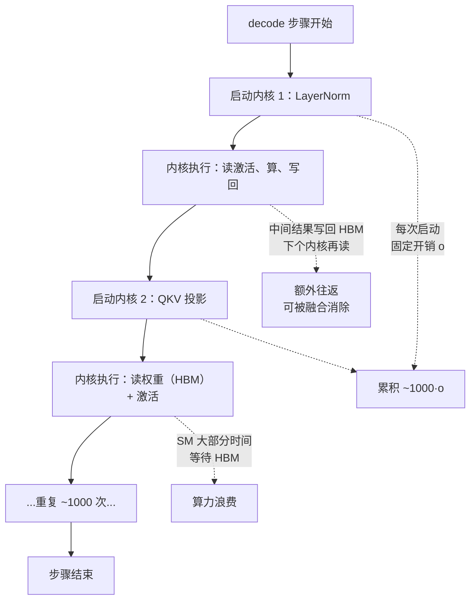
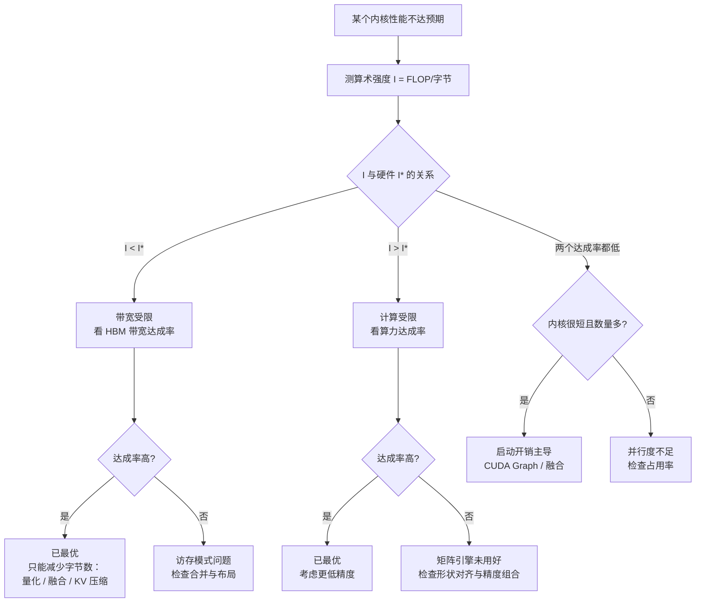

# GPU 微架构中与推理相关的部分

> 位置：[InferenceAtlas](../../INDEX.md) > [模块 07](README.md) > 当前文档
> 信息截至：2026-07-29 ｜ 最后核验：2026-07-29 ｜ 内容版本：v0.1
> 时效性等级：中
> 相关主题：[推理硬件全景](01_ai_inference_hardware_overview.md)｜`03_tensor_cores_matrix_engines_and_low_precision.md`｜[FlashAttention](../04_compilers_runtimes_and_kernels/08_flashattention_and_memory_efficient_attention.md)

## 本章导读

GPU 微架构的完整介绍需要一本书。本章只讲**与 LLM 推理直接相关的部分**，并且用一个统一的视角组织：**GPU 的每一层设计都在回答"如何隐藏访存延迟"这个问题**，而 LLM decode 恰恰是一个访存延迟无法被隐藏的极端场景。

这个矛盾解释了推理中的许多现象：

- 为什么 decode 阶段 GPU 的"利用率"看起来很高但实际算力浪费严重；
- 为什么小批 decode 的性能几乎只由 HBM 带宽决定；
- 为什么内核启动开销在 decode 中占比可观（每步都要启动几百个内核）；
- 为什么 FlashAttention 这类"减少 HBM 往返"的优化收益如此大。

本章覆盖四个层次：**执行模型**（线程组织与调度）、**存储层次**（寄存器 → 共享内存 → L2 → HBM）、**内核启动与调度开销**、以及**占用率与并行度**。每一层都给出它在 LLM 推理中的具体表现与优化含义。

**关于本章的数据**：与本模块其他章节一致，**不给出任何具体产品的规格数字**（原因见 [第 1 章](01_ai_inference_hardware_overview.md) 第 5 节）。本章讨论的是架构机制与它们的性能含义，这些不依赖具体型号。

## 学习目标

读完本章后，读者应能够：

1. 描述 GPU 的执行模型，并说明它如何通过并行隐藏访存延迟；
2. 解释为什么 LLM decode 是"延迟无法隐藏"的场景，以及由此产生的后果；
3. 画出存储层次并说明各层的容量/带宽/延迟量级关系；
4. 分析内核启动开销在 decode 中的累积效应；
5. 判断某个内核是受占用率、带宽、还是启动开销限制。

## 核心结论

- **GPU 的核心设计目标是用并行隐藏访存延迟**，而 decode 阶段可并行的工作太少，延迟无法被隐藏——这是 decode 效率低的根本原因。
- **"GPU 利用率高"不等于"算力被有效使用"**：decode 中 SM 忙于等待访存，利用率指标看起来正常但算力浪费严重。
- **存储层次每下一层，带宽降一个量级、延迟升一个量级**——因此优化的核心是"把数据留在更高层"。
- **decode 每步要启动数百个内核**，启动开销累积可观，这是 CUDA Graph 收益大的原因。
- **判断内核受什么限制，要看三个数**：算术强度、占用率、内核时长——它们分别对应带宽、并行度、启动开销三种限制。

## 1. 问题定义、系统边界与工作负载

### 1.1 GPU 的基本设计假设

GPU 的架构建立在一个假设上：**有大量彼此独立的工作可以并行**。基于这个假设，它做了一系列取舍：

| 取舍 | 相对 CPU | 后果 |
|---|---|---|
| 极多的简单核心 | 单核性能低 | 需要大量并行工作才能填满 |
| 很小的缓存/核心 | 缓存命中率低 | 依赖并行而非缓存隐藏延迟 |
| 无乱序执行 | 硬件简单 | 无法自动隐藏延迟 |
| 极快的上下文切换 | 可维持大量在飞线程 | **这是延迟隐藏的核心机制** |
| 高带宽内存 | 高功耗、高成本 | 带宽是主要卖点 |

**核心机制**：当一组线程因等待访存而阻塞时，调度器立即切换到另一组就绪的线程。只要有足够多的线程组，访存延迟就被完全掩盖。

**"足够多"的定量条件**：设访存延迟为 $\ell$（周期），单个线程组的计算耗时为 $c$（周期），则需要

$$
n_{\text{groups}} \ge \frac{\ell}{c} + 1
$$

才能完全掩盖延迟。

- **直觉**：一个线程组在等待的 $\ell$ 个周期内，其他组要能填满这段时间。
- **$\ell$ 通常是几百个周期**（HBM 访问），而 $c$ 可能只有几十——因此需要**几十个线程组**同时在飞。
- **这就是"占用率"（occupancy）指标的物理意义**。

### 1.2 LLM decode 为什么打破这个假设

decode 阶段的工作特征：

| 特征 | 后果 |
|---|---|
| 批很小（$B$ 为几十） | 可并行的独立工作少 |
| 每个权重只用一次 | 无数据复用，缓存无效 |
| 算术强度极低 | 计算太少，无法填满等待时间 |
| 大量小内核 | 每个内核的并行度都不足 |

**关键**：decode 的**总工作量**很小（$2PB$ FLOP），而**总访存量**很大（$W$ 字节）。即使把所有工作都并行起来，也不够填满访存等待。

$$
\text{可用于隐藏延迟的计算} = \frac{2PB}{\text{FLOPS}}, \qquad \text{需要隐藏的访存时间} = \frac{W}{\text{BW}}
$$

$$
\frac{\text{计算}}{\text{访存}} = \frac{2PB}{\text{FLOPS}} \cdot \frac{\text{BW}}{W} = \frac{2B}{b_w} \cdot \frac{1}{I^*}
$$

- 这正是 $I_{\text{decode}}/I^*$（见 [第 1 章](01_ai_inference_hardware_overview.md) 1.2）。
- 小批时这个比值远小于 1——**计算完全不足以掩盖访存**。

> **结论**：**decode 阶段 GPU 的延迟隐藏机制失效**。SM 大部分时间在等待 HBM，而不是在计算。这不是软件问题，是工作负载与架构假设的根本不匹配。

### 1.3 "利用率"指标的误导性

常用的 GPU 利用率指标（如 `nvidia-smi` 的 GPU-Util）通常表示"**至少有一个内核在执行**的时间比例"，而不是"算力被有效使用的比例"。

| 指标 | 含义 | decode 阶段的表现 |
|---|---|---|
| GPU 利用率 | 有内核在跑的时间占比 | **接近 100%**（一直在跑） |
| SM 占用率 | 活跃线程组占最大值的比例 | 中等 |
| 算力达成率 | 实测 FLOP/s 占峰值 | **很低** |
| 内存带宽达成率 | 实测 B/s 占峰值 | **高**（这才是真瓶颈） |

**推论**：**在 decode 场景，"GPU 利用率 100%"是一个几乎无信息量的指标**。真正应该看的是**内存带宽达成率**——它接近峰值说明已经打满了真正的瓶颈，此时增加算力毫无用处。

> **诊断建议**：decode 性能分析应当以"内存带宽达成率"为首要指标。若它已接近峰值，说明实现是好的，进一步优化只能靠减少要读的字节数（量化、KV 压缩）。

## 2. 原理、数学与性能模型

### 2.1 执行模型的层次

GPU 的并行组织有多个层次。**本库使用通用术语**，各厂商的具体命名不同（`待核实`）：

| 层次 | 说明 | 与推理的关系 |
|---|---|---|
| **线程** | 最小执行单位 | 通常对应一个输出元素 |
| **线程束（warp/wavefront）** | 锁步执行的一组线程 | 分支发散在此层次产生代价 |
| **线程块** | 共享同一块片上内存、可同步 | 对应一个数据分块 |
| **网格** | 一次内核启动的全部线程块 | 对应一个算子 |
| **流多处理器（SM/CU）** | 物理执行单元，驻留多个线程块 | 占用率在此层次度量 |

**分支发散的代价**：线程束内的线程锁步执行。若它们走了不同分支，硬件必须**串行执行每条路径**，代价是路径数的倍数。

$$
T_{\text{divergent}} \approx \sum_{\text{path}} T_{\text{path}}
$$

**在 LLM 推理中的表现**：

| 场景 | 是否发散 |
|---|---|
| 密集矩阵乘 | 否（规则） |
| 逐元素激活 | 否 |
| 采样中的按请求分支 | **是**（见 [采样参数](../05_decoding_and_generation_algorithms/02_greedy_sampling_topk_topp_temperature.md) 3.1） |
| MoE 的专家分派 | **是**（不同 token 走不同专家） |
| 变长序列的注意力 | 可能（需要合理分块） |

**这解释了为什么采样参数必须张量化**（见 [采样参数](../05_decoding_and_generation_algorithms/02_greedy_sampling_topk_topp_temperature.md) 3.1）：按请求走不同代码路径会导致线程束发散，代价是分支数的倍数。

### 2.2 存储层次

| 层次 | 相对容量 | 相对带宽 | 相对延迟 | 作用域 |
|---|---|---|---|---|
| 寄存器 | 最小 | 最高 | 最低 | 线程私有 |
| 共享内存/L1 | 小 | 很高 | 低 | 线程块 |
| L2 缓存 | 中 | 高 | 中 | 全芯片 |
| HBM | 大 | 中 | 高 | 全芯片 |
| 主机内存 | 很大 | 低 | 很高 | 跨设备 |

**本库不给出具体的容量与带宽数字**（需一手核验，`待核实`）。但有一个稳定的定性规律：

> **每下一层，带宽降约一个数量级，延迟升约一个数量级，容量升约两个数量级。**

**这个规律直接给出了优化的方向**：把数据留在尽可能高的层次。

**在 LLM 推理中的应用**：

| 优化 | 机制 | 收益来源 |
|---|---|---|
| **FlashAttention** | 把注意力中间结果留在共享内存，不写回 HBM | 消除 $O(S^2)$ 的 HBM 往返 |
| **算子融合** | 中间结果留在寄存器/共享内存 | 减少 HBM 读写次数 |
| **分块矩阵乘** | 复用共享内存中的分块 | 减少 HBM 读取 |
| **权重驻留** | 让权重留在 L2（若装得下） | 减少 HBM 读取 |

**"权重驻留"的可行性判断**：

$$
\text{可行} \iff \frac{W}{N_{\text{TP}}} \le M_{\text{L2}}
$$

- 对大模型，$W/N_{\text{TP}}$ 通常远超 L2 容量，因此**权重每步都要从 HBM 读**——这正是 decode 带宽受限的直接原因。
- 对小模型或高 TP 度，部分权重可能命中 L2，带来额外收益。**这是一个值得实测的效应**。

### 2.3 内核启动开销

每次内核启动有固定开销（提交、调度、同步）。设单次开销为 $o$，一次前向启动 $n_k$ 个内核：

$$
T_{\text{launch}} = n_k \cdot o
$$

**$n_k$ 在 LLM 推理中有多大**：一个 $L$ 层的模型，每层至少有：

| 算子 | 数量 |
|---|---|
| LayerNorm | 2 |
| QKV 投影 | 1–3 |
| RoPE | 1–2 |
| 注意力 | 1–2 |
| 输出投影 | 1 |
| FFN | 2–3 |
| 残差 | 2 |
| 通信（TP 下） | 2 |

**每层约 10–15 个内核**，$L=80$ 时**每步 800–1200 个内核**。

$$
T_{\text{launch}} \approx 1000 \cdot o
$$

- 若 $o$ 是几微秒，$T_{\text{launch}}$ 就是几毫秒——**与 decode 单步的计算时间同量级**。
- **这是 CUDA Graph 收益巨大的原因**（见 [模块 04 第 10 章](../04_compilers_runtimes_and_kernels/10_cuda_graphs_and_execution_overhead.md)）：图捕获把 $n_k$ 次启动变成 1 次。

**启动开销的占比**：

$$
\eta_{\text{launch}} = \frac{n_k \cdot o}{T_{\text{step}}}
$$

- **小模型、小批时占比最高**（$T_{\text{step}}$ 小而 $n_k$ 不变）；
- 大模型、大批时占比下降。

> **诊断**：如果 decode 的实测单步时间显著高于 $W/\text{BW}_{\text{eff}}$，且模型不大，**首先怀疑内核启动开销**。测量方法是开关 CUDA Graph 对比。

### 2.4 占用率与并行度

**占用率**：单个 SM 上活跃线程束数占硬件上限的比例。

$$
\text{occupancy} = \frac{n_{\text{warps,active}}}{n_{\text{warps,max}}}
$$

**限制占用率的三个资源**：

| 资源 | 机制 |
|---|---|
| 寄存器 | 每线程用的寄存器越多，能驻留的线程越少 |
| 共享内存 | 每块用的共享内存越多，能驻留的块越少 |
| 线程块数 | 硬件对每 SM 的块数有上限 |

**占用率与性能的关系不是单调的**：

- **低占用率**（如 25%）可能不足以隐藏访存延迟 → 性能受限；
- **高占用率**不保证高性能——如果本来就带宽受限，增加线程只是增加等待的线程。

> **在 LLM decode 中，提高占用率通常无效**——因为瓶颈是 HBM 带宽而非并行度不足。这与训练或 prefill 不同。

**一个反直觉的推论**：FlashAttention 类内核为了在共享内存中放下大块，往往**主动降低占用率**（每块用更多共享内存）。这是正确的取舍——**用更低的占用率换取更少的 HBM 往返**，因为后者才是瓶颈。

### 2.5 三种限制的诊断

任一内核可能受三种限制之一：

| 限制 | 症状 | 诊断指标 | 优化方向 |
|---|---|---|---|
| **带宽** | 内存带宽达成率高，算力达成率低 | 算术强度 $I < I^*$ | 减少字节数（量化、融合） |
| **算力** | 算力达成率高 | $I > I^*$ | 用更低精度、更好的矩阵引擎利用 |
| **延迟/并行度** | 两个达成率都低 | 占用率低、内核很短 | 增大并行度、合并内核 |
| **启动开销** | 内核数多、每个都很短 | $n_k \cdot o / T$ 高 | CUDA Graph、融合 |

**诊断流程**：

```
1. 测算术强度 I = FLOP / 字节
2. 与硬件的 I* 比较
   - I < I* → 带宽受限 → 看带宽达成率
     - 达成率高 → 已最优，只能减少字节
     - 达成率低 → 访存模式差（不连续、未合并）
   - I > I* → 计算受限 → 看算力达成率
     - 达成率高 → 已最优
     - 达成率低 → 矩阵引擎未被有效利用（形状、精度、对齐）
3. 若两个达成率都低 → 并行度或启动开销问题
   - 内核时长很短且数量多 → 启动开销
   - 内核时长正常但占用率低 → 并行度不足
```

**这个流程覆盖了绝大多数内核性能问题**。它的价值在于**先分类再优化**——用错误的手段优化（如为带宽受限的内核提高占用率）是常见的浪费。

## 3. 实现机制与系统设计

### 3.1 decode 的执行画像



**图解读**：
1. **本图展示什么**：一个 decode 步骤的执行画像——约 1000 次内核启动，每次内核内 SM 大部分时间在等 HBM，且内核之间通过 HBM 传递中间结果。
2. **核心瓶颈**：三个损失叠加——**HBM 等待**（算力浪费）、**启动开销累积**（约 1000 × $o$）、**中间结果往返 HBM**。三者的优化手段不同：前者只能靠减少字节数，中者靠 CUDA Graph，后者靠算子融合。
3. **图中的 trade-off**：融合减少 HBM 往返但增加单个内核的寄存器/共享内存压力（降低占用率）。在带宽受限场景这个交换是划算的——这也是 FlashAttention 的设计逻辑。
4. **面试如何引用**：被问"decode 为什么效率低"时，用这张图给出三个具体损失，而不是笼统地说"带宽受限"——三个损失对应三种不同的优化手段，能体现分析深度。

### 3.2 访存合并

GPU 从 HBM 读取时以**固定大小的事务**为单位。若一个线程束的 32 个线程访问的地址不连续，可能需要多个事务，有效带宽大幅下降。

$$
\text{有效带宽} = \text{峰值带宽} \times \frac{\text{实际需要的字节}}{\text{实际传输的字节}}
$$

**最差情况**：每个线程访问一个远离其他线程的地址，每次事务只有一小部分有用 → 有效带宽可能降到峰值的几分之一。

**在 LLM 推理中容易出问题的地方**：

| 场景 | 风险 | 缓解 |
|---|---|---|
| 分页 KV 的非连续读取 | 页边界处的访问不连续 | 页大小对齐到事务大小 |
| MoE 的 gather/scatter | 按路由结果散列访问 | 排序后批量访问 |
| 变长序列的注意力 | 不同序列长度导致不规则 | 合理的分块与 padding |
| 采样的 top-k 选择 | 排序过程的随机访问 | 用分块归约替代全排序 |

**"分页 KV 的对齐"值得强调**：KV 页的大小应当是内存事务大小的整数倍，且页内布局应使同一线程束访问连续地址。**布局选择（是 `[层][头][token][维]` 还是 `[层][token][头][维]`）直接影响访存合并**——这是一个在实现时必须仔细考虑的点。

### 3.3 精度与矩阵引擎

（详细内容见 `03_tensor_cores_matrix_engines_and_low_precision.md`，这里只讲与执行模型的关系。）

现代 GPU 有专用的矩阵乘单元。它们的使用有约束：

| 约束 | 说明 | 违反的后果 |
|---|---|---|
| 形状对齐 | 矩阵维度需是特定值的倍数 | 回退到通用路径，性能大幅下降 |
| 数据布局 | 需要特定的内存排布 | 需要额外的重排开销 |
| 精度组合 | 输入/累加/输出精度的组合有限 | 不支持的组合走慢路径 |

**decode 的特殊困难**：decode 的矩阵乘是 $[B, d] \times [d, d']$，其中 $B$ 很小（几十）。**矩阵引擎对小 $M$ 维度的效率很低**——它们是为大矩阵设计的。

$$
\text{矩阵引擎效率} \propto \min\left(1, \frac{B}{B_{\text{tile}}}\right)
$$

- $B_{\text{tile}}$ 是引擎的分块大小（`待核实`，依硬件）。
- $B < B_{\text{tile}}$ 时，引擎的部分单元空转。

**但这在 decode 中通常不重要**——因为 decode 本就带宽受限，算力浪费不影响总时间。**只有当批大到进入计算受限区时，矩阵引擎的效率才成为问题**。

### 3.4 与软件栈的对应

本章的架构概念在软件栈中的对应（见 [模块 04](../04_compilers_runtimes_and_kernels/)）：

| 架构概念 | 软件层面的对应优化 |
|---|---|
| 存储层次 | 算子融合、FlashAttention 的分块 |
| 内核启动开销 | CUDA Graph、算子融合 |
| 访存合并 | 内存布局选择、KV 页设计 |
| 线程束发散 | 采样参数张量化、MoE 的分组 GEMM |
| 占用率 | 内核的寄存器/共享内存预算 |
| 矩阵引擎约束 | 形状 padding、精度选择 |

**这张表说明了一件事**：**模块 04 讨论的所有软件优化，都是在应对本章讨论的硬件约束**。理解硬件约束能让优化的选择从"试试看"变成"有依据的判断"。

## 4. 性能、成本、能耗与可靠性 trade-off

### 4.1 优化手段的收益归因

| 优化 | 消除的损失 | 在 decode 中的收益量级 |
|---|---|---|
| 权重量化 | HBM 读取字节数 | **大**（直接按比例） |
| KV 量化 | HBM 读取字节数 | **大**（长上下文下） |
| CUDA Graph | 启动开销 | 中到大（小模型时大） |
| 算子融合 | HBM 往返 | 中 |
| FlashAttention | 注意力的 HBM 往返 | 大（长序列时） |
| 提高占用率 | 延迟隐藏不足 | **小**（decode 本就带宽受限） |
| 更好的矩阵引擎利用 | 算力浪费 | **小**（decode 中算力不是瓶颈） |

**这张表的重要性**：它按"decode 场景"给出了优化的优先级。**最后两行是常见的误投入**——它们在训练或 prefill 中有价值，在 decode 中收益很小。

### 4.2 功耗的构成

GPU 功耗的主要来源（定性，具体比例 `待核实`）：

| 来源 | 说明 | 在 decode 中的占比 |
|---|---|---|
| HBM 访问 | 每字节的搬运能耗 | **高**（decode 访存密集） |
| 计算单元 | FLOP 的能耗 | 低（decode 计算少） |
| 片上数据搬运 | 寄存器/共享内存/L2 之间 | 中 |
| 静态功耗 | 漏电、时钟 | 中 |

**关键**：**数据搬运的能耗通常高于计算的能耗**（每字节 vs 每 FLOP 的对比）。因此：

> **在 decode 中，降低能耗的最有效手段是减少字节搬运量——即量化与 KV 压缩，与降低时延的手段完全一致。**

这是一个少见的"多目标一致"的情形：量化同时改善时延、吞吐、能耗与显存。

### 4.3 可靠性

| 机制 | 作用 | 与推理的关系 |
|---|---|---|
| ECC | 检测/纠正内存位翻转 | 显存越大越重要 |
| 页级退役 | 隔离故障显存页 | 可用显存缓慢减少 |
| 时钟/电压监控 | 检测异常 | 降频是软失效的信号 |
| 温度保护 | 过热降频 | 表现为性能突然下降 |

**"过热降频"在推理中的表现**：持续满载的 decode 负载会让芯片长期处于高功耗状态。若散热不足，芯片降频，表现为**性能缓慢下降或周期性波动**。

**诊断**：记录芯片频率与温度的时间序列。若性能下降与温度上升同步，是散热问题而非软件问题。**这类问题在密集部署中很常见，且容易被误诊为软件退化**。

## 5. benchmark、真实案例或公开部署案例

与本模块其他章节一致，受当前环境的网络出口策略限制（详见 [AGENTS.md 第 11 节](../../AGENTS.md)），本章**不引用任何具体产品的架构参数、缓存容量、延迟周期数或功耗数字**。

| 陈述 | 披露标签 | 状态 |
|---|---|---|
| 存储层次的定性规律（每层带宽降一个量级） | 通用架构常识 | — |
| 各层的具体容量、带宽、延迟 | — | `待核实`（需厂商文档） |
| 矩阵引擎的分块大小 $B_{\text{tile}}$ | — | `待核实` |
| 各厂商的具体术语与命名 | — | `待核实` |
| 功耗中访存与计算的具体比例 | — | `待核实` |

**可自行复现的实验**（`独立可复现实验`）：

1. **访存延迟测量**：用指针追逐（pointer chase）基准测量各存储层次的延迟，画出容量-延迟曲线。曲线的拐点就是各级缓存的容量。
2. **占用率与性能的关系**：对一个 decode 内核，通过调整每线程寄存器数改变占用率，测性能。**预期观察：带宽受限的内核对占用率不敏感**（验证 2.4）。
3. **内核启动开销 $o$**：启动大量空内核，测总时间除以数量。再统计实际模型每步的内核数 $n_k$，算 $n_k \cdot o$ 占单步的比例。
4. **CUDA Graph 收益**：开关图捕获测 decode 单步时间，差值即启动开销的实际影响。与实验 3 的估算对比。
5. **访存合并的影响**：对同一份数据，分别用连续与散列的访问模式读取，比较有效带宽。这个比值反映了访存模式对性能的影响幅度。
6. **KV 布局的影响**：实现两种 KV 内存布局，测注意力内核的有效带宽。验证 3.2 的布局敏感性。
7. **带宽达成率**：测 decode 内核的实测 HBM 流量与耗时，算达成率。**若已接近峰值，说明实现良好，只能靠减少字节数进一步优化**。
8. **矩阵引擎的批敏感性**：固定 $d$，扫描 $B$，测矩阵乘的算力达成率。定位 $B_{\text{tile}}$ 的效应（验证 3.3）。
9. **温度与频率监控**：长时间满载运行，记录频率、温度、吞吐的时间序列。检查是否有降频。

> 实验方法论要求见 [如何读推理 benchmark](../00_start_here/03_how_to_read_inference_benchmarks.md)。

## 6. 设计决策框架



**图解读**：
1. **本图展示什么**：内核性能问题的诊断树，用算术强度作为第一分叉，把问题归入带宽、算力、启动开销、并行度四类。
2. **核心瓶颈**：瓶颈是第一步的算术强度测量。**它决定了后续该看哪个达成率**——看错指标会得出相反的结论（例如为带宽受限的内核去优化算力利用）。
3. **图中的 trade-off**：左侧"达成率高 → 已最优"这个终点很重要——它说明**有些情况下没有软件优化空间，只能改变问题本身**（减少要读的字节）。承认这一点比继续微调实现更有价值。
4. **面试如何引用**：被问"如何优化一个慢内核"时，按这张图先分类再优化。这个"先诊断后治疗"的结构比直接列举优化手段更专业。

### 决策清单

| 问题 | 若答案为"是" | 若答案为"否" |
|---|---|---|
| 已测算术强度并与 $I^*$ 比较？ | 可以诊断 | **先测**，否则会优化错方向 |
| 带宽达成率已接近峰值？ | 只能减少字节数 | 检查访存模式与布局 |
| 内核数 × 启动开销占比高？ | 用 CUDA Graph | 不是主要问题 |
| decode 场景在优化占用率？ | **通常无效**，改优化带宽 | — |
| KV 页大小对齐到事务大小？ | 访存合并好 | 检查布局 |
| 采样参数已张量化？ | 无线程束发散 | 会有分支代价 |
| 有温度与频率监控？ | 能发现降频 | 可能误诊为软件问题 |

## 7. 常见失败模式与排查路径

| 症状 | 可能原因 | 排查步骤 |
|---|---|---|
| GPU 利用率 100% 但吞吐低 | **利用率指标误导**（1.3） | 改看带宽达成率与算力达成率 |
| decode 单步远超 $W/\text{BW}$ | 启动开销或访存模式差（2.3、3.2） | 开关 CUDA Graph；查访存合并 |
| 提高占用率无效果 | **带宽受限，占用率不是瓶颈**（2.4） | 改优化字节数 |
| 注意力内核带宽达成率低 | KV 布局导致访存不合并（3.2） | 换布局重测 |
| MoE 内核效率低 | gather/scatter 散列访问 | 排序后批量访问；用分组 GEMM |
| 采样内核慢 | 线程束发散（2.1） | 参数张量化 |
| 小模型的 decode 特别慢 | 启动开销占比高（2.3） | CUDA Graph 必开 |
| 性能随时间缓慢下降 | 过热降频（4.3） | 监控频率与温度 |
| 量化后收益不如预期 | 未省下 HBM 流量（如仍读高精度权重） | 测实际 HBM 流量 |
| 大批时矩阵乘效率低 | 形状未对齐（3.3） | padding 到引擎要求的倍数 |

**排查原则**：**先确认瓶颈类别再优化**。本章的诊断树（第 6 节）能在几次测量内把问题归类，比盲目尝试优化手段高效得多。

## 8. 关联面试主题

1. **GPU 用什么机制隐藏访存延迟，为什么在 decode 中失效**——见本章 1.1、1.2。
2. **为什么"GPU 利用率 100%"在 decode 中几乎无信息量**——见本章 1.3。
3. **decode 性能分析应以哪个指标为首要依据**——见本章 1.3，内存带宽达成率。
4. **存储层次的定性规律及其优化含义**——见本章 2.2。
5. **decode 每步的内核数量级与启动开销的累积**——见本章 2.3。
6. **为什么在 decode 中提高占用率通常无效**——见本章 2.4。
7. **FlashAttention 为什么主动降低占用率**——见本章 2.4，用占用率换 HBM 往返。
8. **线程束发散在 LLM 推理中的三个场景**——见本章 2.1。
9. **访存合并与 KV 布局的关系**——见本章 3.2。
10. **内核性能问题的四类诊断**——见本章 2.5 与第 6 节。
11. **为什么量化在 decode 中同时改善时延与能耗**——见本章 4.2。
12. **过热降频如何被误诊为软件退化**——见本章 4.3。

## 9. 小结

GPU 的每一层设计都在回答同一个问题：**如何用并行隐藏访存延迟**。而 LLM decode 恰恰是这个机制失效的场景——批太小、无数据复用、算术强度极低，**计算量根本不足以填满访存等待**。这不是软件问题，是工作负载与架构假设的根本不匹配。

由此产生三个具体后果，各对应不同的优化手段：

**第一，SM 大部分时间在等 HBM**。这使得"GPU 利用率 100%"成为一个几乎无信息量的指标——它只说明有内核在跑，不说明算力在被使用。**decode 的性能分析应以内存带宽达成率为首要指标**：若它已接近峰值，说明实现良好，进一步优化只能靠**减少要读的字节数**（量化、KV 压缩），而不是任何执行层面的调优。

**第二，每步要启动约一千个内核**（$L$ 层 × 每层 10–15 个算子）。若单次启动开销是几微秒，累积就是几毫秒——与 decode 单步的计算时间同量级。这是 CUDA Graph 收益如此大的原因，且**模型越小、批越小，这个占比越高**。

**第三，中间结果在内核之间通过 HBM 传递**。算子融合与 FlashAttention 的价值就在于把这些往返消除，把中间结果留在共享内存或寄存器中。

一个重要的推论是**优化优先级的重排**：在 decode 场景，"提高占用率"与"更好地利用矩阵引擎"这两个在训练与 prefill 中有效的手段，收益都很小——因为瓶颈既不是并行度也不是算力。FlashAttention 甚至**主动降低占用率**来换取更少的 HBM 往返，这在带宽受限场景是正确的取舍。

最后，本章的诊断树给出了一个可执行的方法：**测算术强度 → 与 $I^*$ 比较 → 决定看哪个达成率 → 归入四类问题之一**。它的价值在于把"试各种优化"变成"先分类再对症下药"，而分类只需要两三次测量。

## 关键术语

| 中文术语 | 英文 | 定义 | 单位/口径 | 关联文档 |
|---|---|---|---|---|
| 线程束 | warp / wavefront | 锁步执行的一组线程 | 线程数 | 本章 2.1 |
| 线程束发散 | warp divergence | 束内线程走不同分支导致串行执行 | — | 本章 2.1 |
| 占用率 | occupancy | 活跃线程束占硬件上限的比例 | 比例 | 本章 2.4 |
| 访存合并 | memory coalescing | 束内线程访问连续地址以减少事务数 | — | 本章 3.2 |
| 内核启动开销 | kernel launch overhead | 单次内核提交与调度的固定成本 | s | 本章 2.3 |
| 带宽达成率 | bandwidth attainment | 实测 HBM 流量速率占峰值的比例 | 比例 | 本章 1.3 |
| 算力达成率 | compute attainment | 实测 FLOP/s 占峰值的比例 | 比例 | 本章 1.3 |
| 流多处理器 | SM / CU | GPU 的物理执行单元 | 计数 | 本章 2.1 |

## 延伸阅读

- [推理硬件全景](01_ai_inference_hardware_overview.md) — 四个指标轴与 $I^*$
- `03_tensor_cores_matrix_engines_and_low_precision.md` — 矩阵引擎的详细讨论
- `04_hbm_dram_and_memory_hierarchy.md` — 存储层次的物理基础
- [FlashAttention 与内存高效注意力](../04_compilers_runtimes_and_kernels/08_flashattention_and_memory_efficient_attention.md) — 用占用率换 HBM 往返的典型案例
- [CUDA Graphs 与执行开销](../04_compilers_runtimes_and_kernels/10_cuda_graphs_and_execution_overhead.md) — 消除启动开销
- [内核融合与算子优化](../04_compilers_runtimes_and_kernels/07_kernel_fusion_and_operator_optimization.md) — 消除 HBM 往返
- [编译器调试与剖析](../04_compilers_runtimes_and_kernels/11_compiler_debugging_and_profiling.md) — 达成率的测量方法
- [内存带宽与算术强度](../01_foundations_and_metrics/05_memory_bandwidth_and_arithmetic_intensity.md) — 算术强度的定义

## 主要来源

本章讨论的是通用的 GPU 架构机制与它们在 LLM 推理中的性能含义，全部为本库基于 roofline 框架与架构常识的推导。**不含任何具体产品的架构参数**（缓存容量、延迟周期、功耗比例、矩阵引擎分块大小等均标记为 `待核实`），原因是当前环境无法访问厂商文档核验（详见 [AGENTS.md 第 11 节](../../AGENTS.md)）。

| 类别 | 说明 | 披露标签 |
|---|---|---|
| 延迟隐藏的定量条件 | 标准的流水线分析 | — |
| 存储层次的定性规律 | 通用架构常识 | — |
| 内核数量的估算 | 由标准 Transformer 结构导出 | — |
| 诊断树 | 本库提出的框架 | — |
| 各层的具体容量/带宽/延迟 | 需一手核验 | `待核实` |
| 厂商特定术语与参数 | 需一手核验 | `待核实` |

## 更新记录

| 日期 | 版本 | 变更 | 核验人 |
|---|---|---|---|
| 2026-07-29 | v0.1 | 初稿：延迟隐藏机制及其在 decode 中的失效、利用率指标的误导性、存储层次与优化对应、内核启动开销的累积、占用率在带宽受限下的无效性、四类限制的诊断树 | — |
