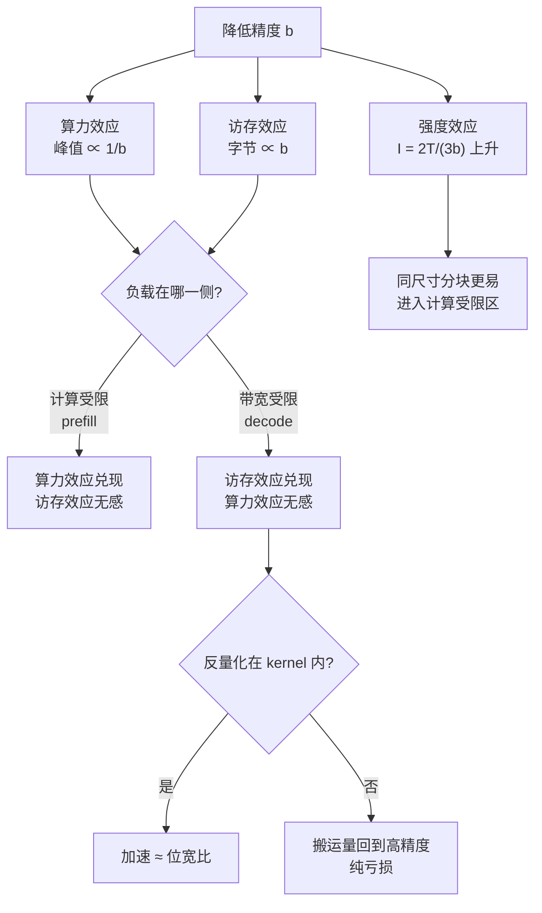
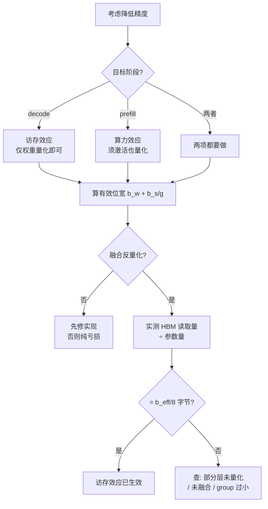

# 矩阵引擎与低精度算力

> 位置：[InferenceAtlas](../../INDEX.md) > [模块 07](README.md) > 当前文档
> 信息截至：2026-07-31 ｜ 最后核验：2026-07-31 ｜ 内容版本：v0.1
> 时效性等级：低（原理与数学部分）
> 相关主题：[推理硬件总览](01_ai_inference_hardware_overview.md)｜[GPU 微架构](02_gpu_architecture_for_inference.md)｜[量化 kernel](../04_compilers_runtimes_and_kernels/09_quantization_kernels.md)

## 本章导读

本章要澄清一件在实践中反复被弄混的事：
**降低精度带来两个完全独立的收益，它们作用在不同的阶段、幅度不同、失效条件也不同**。

| 效应 | 机制 | 在哪个阶段兑现 |
|---|---|---|
| **算力效应** | 同样的硅面积在低精度下每周期做更多次乘加 | **prefill**（计算受限） |
| **访存效应** | 权重与激活的字节数减少 | **decode**（带宽受限） |

**把两者当成一件事，是量化相关的性能预期出错最常见的原因**：
仅权重量化到 4 bit，在 decode 上可以接近 4 倍加速，
**在 prefill 上却可能接近 0**——
因为反量化之后的矩阵乘仍按高精度进行，算力没有变。

本章还要回答一个更基本的问题：
**矩阵引擎为什么存在**。
答案是分块矩阵乘的算术强度 $I = 2T/(3b)$ **随分块边长线性增长**，
因此把一个固定尺寸的分块做成一条指令，
是把强度从「带宽受限」推到「计算受限」的最直接手段。

**关于本章数字的说明**：
本章不给出任何产品的算力、精度支持或分块尺寸。
受当前环境的网络出口策略限制（详见 [AGENTS.md 第 11 节](../../AGENTS.md)），
本库无法核验厂商规格，
**因此本章只讨论由数据格式与算法结构决定的量**，
这些量与具体硬件无关。

## 学习目标

读完本章后，读者应能够：

1. 推出分块矩阵乘的算术强度 $I = 2T/(3b)$，并用它解释矩阵引擎与分块存在的理由
2. 把低精度的算力效应与访存效应分开，并判断某次量化在 prefill 与 decode 上各能拿到多少
3. 算出含缩放因子开销的有效位宽，并判断 group 大小是否合理
4. 说明累加精度为什么必须高于输入精度，并估算误差随 $K$ 的增长
5. 识别矩阵引擎的形状与布局约束在 decode 小批场景下的表现

## 核心结论

- **分块矩阵乘的算术强度随分块边长线性增长**：$I = 2T/(3b)$。这是矩阵引擎、分块与片上复用共同的存在理由。
- **低精度的两个效应必须分开算**：算力效应作用于 prefill，访存效应作用于 decode。
- **仅权重量化在 decode 上接近位宽比的加速，在 prefill 上接近 0**——因为反量化后仍按高精度计算。
- **缩放因子的开销是 $b_s/g$**：4 bit 权重配 16 bit 缩放、group=32 时开销 12.5%，group 过小会侵蚀量化收益。
- **累加精度必须高于输入精度**：$K=8192$ 时 fp16 累加的随机误差已达 $4.4\times10^{-2}$ 量级，fp32 累加小 8192 倍。
- **矩阵引擎对小 $M$ 维度效率低**，但在 decode 中通常不重要——因为 decode 本就带宽受限。

## 1. 问题定义、系统边界与工作负载

### 1.1 本章的范围

本章讨论**由数据格式与算法结构决定的性质**：

| 在范围内 | 不在范围内 |
|---|---|
| 分块与算术强度的关系 | 具体硬件的分块尺寸 |
| 位宽与字节数、算力的关系 | 具体产品的峰值算力 |
| 缩放因子开销的计算 | 具体量化算法的质量表现 |
| 累加误差的增长规律 | 具体格式的硬件支持情况 |

**质量侧的问题**（哪种量化方法损失小、如何校准）见
[模块 04 第 9 章](../04_compilers_runtimes_and_kernels/09_quantization_kernels.md)
与 [模块 10 第 7 章](../10_edge_and_on_device_inference/07_quantization_distillation_and_pruning_for_edge.md)。
**本章只处理性能侧**。

### 1.2 两个阶段的不同处境

由 [模块 01](../01_foundations_and_metrics/04_roofline_and_performance_modeling.md) 与
[模块 02 第 2 章](../02_transformer_and_kv_cache/02_prefill_vs_decode.md)：

| | prefill | decode（batch 小） |
|---|---|---|
| 矩阵形状 | $[S, d] \times [d, d']$，$S$ 大 | $[B, d] \times [d, d']$，$B$ 小 |
| 算术强度 | **高**（随 $S$ 增长） | **固定且低**（$2/b_w$） |
| 瓶颈 | **计算** | **带宽** |
| 低精度的哪个效应起作用 | **算力** | **访存** |

**最后一行是本章的主线**：
**同一次量化在两个阶段被不同的机制兑现**。

## 2. 原理、数学与性能模型

### 2.1 矩阵引擎为什么存在

考虑 $T\times T$ 分块的矩阵乘：读入两个 $T\times T$ 块、写出一个 $T\times T$ 块，
完成 $T^3$ 次乘加。设每元素 $b$ 字节：

$$I = \frac{2T^3}{3T^2 b} = \frac{2T}{3b}$$

**算术强度随分块边长线性增长**。

| $b$ | $T=8$ | $T=16$ | $T=32$ | $T=64$ | $T=128$ |
|---:|---:|---:|---:|---:|---:|
| 2 B（fp16） | 2.7 | 5.3 | 10.7 | 21.3 | 42.7 |
| 1 B（fp8） | 5.3 | 10.7 | 21.3 | 42.7 | 85.3 |

**两个推论**：

1. **分块越大越好，直到片上存储装不下**——
   这是分块、寄存器复用与共享内存存在的全部理由
   （见 [模块 04 第 7 章](../04_compilers_runtimes_and_kernels/07_kernel_fusion_and_operator_optimization.md)）。
2. **矩阵引擎把一个固定尺寸的分块做成一条指令**，
   从而在硬件层面固化了这个复用。
   **它的价值不是「算得快」，而是「以固定的数据搬运量做更多的计算」**。

**注意 $b$ 出现在分母**：
**降低精度同时提高了同尺寸分块的算术强度**。
这是低精度的第三个、常被忽略的效应——
它使更小的分块也能达到计算受限。

### 2.2 低精度的两个效应

**必须分开处理**：

$$\text{算力效应}：\quad \text{峰值算力} \propto \frac{1}{b} \ (\text{近似})$$

$$\text{访存效应}：\quad \text{搬运字节} \propto b$$

**它们的适用条件互斥**：

| 负载所处区间 | 起作用的效应 | 加速比上限 |
|---|---|---|
| 计算受限（prefill、大批） | **算力效应** | 算力提升比 |
| 带宽受限（decode 小批） | **访存效应** | 位宽比 |

### 2.3 仅权重量化的两阶段表现

**仅权重量化**（weight-only）：权重以低位宽存储，
读入后**反量化为高精度**再参与矩阵乘。

**权重体积**（以 140B 参数为例，假设值）：

| 格式 | 权重体积 | decode 每步搬运量（相对 fp16） |
|---|---:|---:|
| fp16 | 280 GB | 1.00× |
| fp8 | 140 GB | 0.50× |
| int4 | 70 GB | **0.25×** |

| 阶段 | 加速比 | 原因 |
|---|---|---|
| **decode** | **≈ 4×**（int4 vs fp16） | 搬运量降为 1/4，而 decode 带宽受限 |
| **prefill** | **≈ 1×** | 反量化后按 fp16 计算，**算力完全没变** |

**这是本章最重要的一条**：
**「我们量化到 4 bit 了，应该快 4 倍」这个预期只在 decode 上成立**。
若要 prefill 也加速，**必须同时量化激活并让矩阵乘在低精度下进行**。

**一个必要的前提**（见 [模块 04 第 9 章](../04_compilers_runtimes_and_kernels/09_quantization_kernels.md)）：
**反量化必须在 kernel 内完成、不写回 HBM**。
若反量化的结果被物化到 HBM，
**搬运量反而回到 fp16 的水平，访存效应完全消失**——
**量化在这种实现下是纯亏损**（多了反量化的计算，没省下搬运）。

### 2.4 有效位宽

分组量化需要为每组存一个缩放因子。设 group 大小 $g$、缩放因子 $b_s$ 位：

$$b_{\text{eff}} = b_w + \frac{b_s}{g}$$

| $b_w$ | $b_s$ | $g$ | $b_{\text{eff}}$ | 开销 |
|---:|---:|---:|---:|---:|
| 4 | 16 | 32 | 4.50 | **12.5%** |
| 4 | 16 | 64 | 4.25 | 6.2% |
| 4 | 16 | 128 | 4.12 | 3.1% |

**group 越小质量越好但开销越大**。
在 decode 这种带宽受限场景下，
**开销直接按比例吃掉加速比**：
$g=32$ 时实际搬运量是 $4.5/2 = 2.25$ 倍的压缩而非 4 倍。

**因此 group 大小的选择是一个质量与带宽的直接取舍**，
而不只是质量参数。

### 2.5 累加精度

矩阵乘要把 $K$ 个乘积相加。设单位舍入为 $u$：

| 误差模型 | 增长 |
|---|---|
| 最坏情况 | $\sim K u$ |
| 随机舍入（近似随机游走） | $\sim \sqrt{K}\, u$ |

| 累加格式 | $u$ | $K=8192$ 随机 | $K=8192$ 最坏 |
|---|---:|---:|---:|
| fp16 | $4.9\times10^{-4}$ | $4.4\times10^{-2}$ | $4.0$ |
| bf16 | $3.9\times10^{-3}$ | $3.5\times10^{-1}$ | $32$ |
| fp32 | $6.0\times10^{-8}$ | $5.4\times10^{-6}$ | $4.9\times10^{-4}$ |

**在 $K=8192$（相当于隐藏维 8192 的一次投影）下，
fp16 累加的随机误差已达 $10^{-2}$ 量级**——
相对于激活的典型幅度已不可忽略。

**这就是矩阵引擎普遍采用「低精度输入、高精度累加」的原因**：
**输入精度决定搬运量与算力，累加精度决定数值可用性，两者可以分别选择**。

**注意 $\sqrt{K}$ 与 $K$ 相差 91 倍**（$K=8192$）：
实际误差落在两者之间，取决于数据的符号分布。
**因此这个估计给的是量级而非精确值，应当实测确认**。

**图解读**：

1. **本图展示什么**：降低精度产生三个效应，
   **而其中两个的兑现条件互斥**——
   同一次量化在 prefill 和 decode 上被不同机制兑现，幅度也不同。
2. **核心瓶颈**：判定点 I 是实现层面的关键。
   **访存效应的整个收益都取决于反量化是否被融合进 kernel**；
   一旦中间结果写回 HBM，搬运量回到高精度水平，
   **量化变成纯亏损**——多了计算，没省下搬运。
3. **图中的 trade-off**：第三条支路（强度效应）说明低精度还有一个间接好处——
   它使同样尺寸的分块更容易达到计算受限。
   **代价是数值裕度下降**，因此累加精度必须单独保住。
4. **面试如何引用**：可以说
   「低精度有两个独立效应：算力和访存，
   **它们分别在 prefill 和 decode 上兑现**。
   仅权重量化到 4 bit，decode 能接近 4 倍，
   **prefill 接近 1 倍，因为反量化后还是按高精度算**；
   而且这 4 倍还有个前提——**反量化必须融合在 kernel 里**，
   否则搬运量回到原点」。

### 2.6 形状与布局约束

矩阵引擎按固定分块工作，因此有约束：

| 约束 | 违反的后果 |
|---|---|
| 维度需为分块尺寸的倍数 | 补齐产生无效计算，或回退到通用路径 |
| 数据布局需匹配 | 额外的重排开销 |
| 输入/累加/输出的精度组合有限 | 不支持的组合走慢路径 |

**补齐浪费**：设分块尺寸 $T_{\text{tile}}$，实际维度 $M$：

$$\text{有效率} = \frac{M}{\lceil M/T_{\text{tile}}\rceil \cdot T_{\text{tile}}}$$

**decode 的 $B$ 通常远小于 $T_{\text{tile}}$**，
此时有效率约为 $B/T_{\text{tile}}$，可能只有百分之几。

**但这在 decode 中通常不重要**：
decode 本就带宽受限，**算力浪费不延长总时间**。
**只有当批大到进入计算受限区时，这个浪费才开始花钱**——
而那时 $B$ 也已经不小了，浪费比例自然下降。

**这是一个「看起来很糟但实际无害」的指标**，
常被误当作优化目标。

## 3. 实现机制与系统设计

### 3.1 判断某次量化能拿到多少

**四步**：

| # | 步骤 | 输出 |
|---:|---|---|
| 1 | 确定负载落在 roofline 哪一侧 | 决定看哪个效应 |
| 2 | 算有效位宽 $b_w + b_s/g$ | 真实的压缩比 |
| 3 | 确认反量化是否融合 | 访存效应是否成立 |
| 4 | 确认矩阵乘是否真在低精度下进行 | 算力效应是否成立 |

**第 3、4 步是两个独立的开关**：

| 反量化融合 | 低精度矩阵乘 | decode | prefill |
|---|---|---|---|
| 否 | 否 | **无收益** | 无收益 |
| **是** | 否 | **接近位宽比** | 无收益 |
| 是 | **是** | 接近位宽比 | **接近算力比** |

**中间那一行是最常见的实际配置**（仅权重量化 + 融合反量化），
它解释了「decode 快了很多、prefill 没变」这个常见观察。

### 3.2 验证优化是否真的生效

由 [模块 04 第 10 章](../04_compilers_runtimes_and_kernels/10_cuda_graphs_and_execution_overhead.md)
的「静默失效」原则：**配置项不是证据，可观测的数字才是**。

| 要验证的 | 证据 |
|---|---|
| 访存效应生效 | **decode 每步时间按位宽比下降** |
| 反量化已融合 | HBM 读取量按位宽比下降（**而非只有权重文件变小**） |
| 算力效应生效 | **prefill 时间下降**，且矩阵乘 kernel 的精度标记正确 |
| 有效位宽符合预期 | 实际 HBM 读取量 ÷ 参数量 = $b_{\text{eff}}/8$ 字节 |

**最后一行是一个很好的端到端校验**：
它把「配置说 4 bit」与「实际搬了多少字节」对上，
**能同时抓出未融合、group 过小、以及部分层未量化三类问题**。

### 3.3 混合精度的分层选择

不同张量对精度的敏感度不同，因此实践中常分层处理：

| 张量 | 常见做法 | 理由 |
|---|---|---|
| 权重（大部分线性层） | 最低位宽 | 占搬运量的绝大部分 |
| 累加器 | **最高精度** | 第 2.5 节的误差增长 |
| 归一化、softmax | 较高精度 | 涉及求和与指数，数值敏感 |
| KV cache | 独立选择 | 见 [模块 02 第 8 章](../02_transformer_and_kv_cache/08_kv_cache_compression_quantization_and_eviction.md) |
| 嵌入与输出头 | 视词表大小 | 词表大时体积可观 |

**KV cache 的精度是一个独立的决策**，
**因为它影响的是随批与序列长度增长的那部分搬运量，而非权重那部分**——
两者在 [第 5 章](05_memory_capacity_bandwidth_and_kv_cache.md) 中分别出现在不同的项里。

### 3.4 为什么「峰值算力」对推理选型价值有限

由第 2.2 节，算力效应只在计算受限时兑现。
而 [模块 01](../01_foundations_and_metrics/05_memory_bandwidth_and_arithmetic_intensity.md) 已给出
decode 的算术强度是 $2/b_w$，**远低于任何 AI 加速器的机器平衡**。

**因此**：

| 指标 | 对 prefill | 对 decode |
|---|---|---|
| 峰值算力 | **相关** | **几乎不相关** |
| 内存带宽 | 次要 | **决定性** |
| 内存容量 | 次要 | 决定并发上限 |

**这解释了为什么本模块的定位是「带宽与容量往往比峰值算力更能预测实际吞吐」**。
**低精度算力的宣称尤其容易误导**，
因为它往往以最激进的格式与含稀疏的口径给出——
口径要求见 [模块 00 第 6 章](../00_start_here/06_metrics_units_and_quick_reference.md)。

## 4. 性能、成本、能耗与可靠性 trade-off

### 4.1 位宽的取舍

| 降低位宽 | 得到 | 付出 |
|---|---|---|
| 权重位宽 | decode 加速、容量释放 | 质量下降；group 小则开销上升 |
| 激活位宽 | prefill 加速 | 质量下降更敏感（动态范围） |
| 累加位宽 | 少量面积/功耗 | **数值可用性，通常不该降** |
| KV cache 位宽 | 并发上限提高 | 长序列质量影响 |

**第三行是唯一一个「通常不该做」的**：
累加精度的收益很小而风险很大（第 2.5 节）。

### 4.2 能耗方向

**低精度同时降低计算能耗与搬运能耗，但幅度不同**：
搬运能耗大致按字节数线性下降，
而计算能耗的下降取决于电路实现。

**在 decode 这种带宽受限场景下，能耗的主要项是搬运**，
因此**位宽是端侧与数据中心共同的首要能效杠杆**——
这与 [模块 10 第 7 章](../10_edge_and_on_device_inference/07_quantization_distillation_and_pruning_for_edge.md) 的结论一致。

**本库不给出任何具体的每字节或每次运算能耗数字**，
它们需要一手核验（`待核实`）。
结构性的比较见 [第 4 章](04_hbm_dram_and_memory_hierarchy.md)。

### 4.3 可靠性

| 风险 | 表现 |
|---|---|
| 累加精度不足 | **偶发的数值异常**，难以复现 |
| 动态范围溢出 | 特定输入下输出崩坏 |
| 校准分布不匹配 | 通用评测正常、生产流量异常 |

**第一行的隐蔽性最高**：
误差是数据相关的，
**因此它在一部分输入上正常、在另一部分上不正常**，
表现为「偶发」而非「必现」。

## 5. benchmark、真实案例或公开部署案例

**本章不给出任何产品的算力、精度支持或分块尺寸**。

受当前环境的网络出口策略限制（详见 [AGENTS.md 第 11 节](../../AGENTS.md)），
本库无法核验厂商规格，**因此无法核验任何一项**。
第 2 节的算术强度、有效位宽与误差增长均由定义推出，与硬件无关；
第 2.3 节的参数量为演示设定的假设值。

**读者应在自己平台上完成的测量**：

| 项 | 你的值 | 方法 | 披露标签 |
|---|---|---|---|
| 负载的算术强度与机器平衡 | 待填 | 见 [模块 01](../01_foundations_and_metrics/04_roofline_and_performance_modeling.md) | 推出 |
| 权重位宽 $b_w$ 与缩放位宽 $b_s$、group $g$ | 待填 | 配置 | `开源代码/配置披露` |
| **有效位宽 $b_w + b_s/g$** | 待填 | **心算** | 推出 |
| **实际 HBM 读取量 ÷ 参数量** | 待填 | **profile；应等于 $b_{\text{eff}}/8$ 字节** | `独立可复现实验` |
| 上一行与预期是否一致 | 是/否 | **不一致说明未融合或部分层未量化** | 推出 |
| decode 每步时间随位宽的变化 | 待填 | 换位宽实测 | `独立可复现实验` |
| prefill 时间随位宽的变化 | 待填 | 同上 | `独立可复现实验` |
| 矩阵乘 kernel 的实际精度 | 待填 | profile 的 kernel 名或标记 | `独立可复现实验` |
| 累加精度 | 待填 | 代码或库配置 | `开源代码/配置披露` |
| 分块尺寸与 $B$ 的关系 | 待填 | 见第 2.6 节 | `待核实`（依硬件） |

**第四、五行是本章最有价值的一项校验**：
**它把「配置声称的位宽」与「实际搬运的字节」对上**，
能一次抓出未融合、group 过小、部分层未量化三类问题。

> 测量方法论的通用要求见
> [推理 benchmark 方法论](../11_benchmarking_reliability_and_observability/01_inference_benchmarking_methodology.md)。

## 6. 设计决策框架

**图解读**：

1. **本图展示什么**：从目标阶段出发的决策路径，
   **入口是「想加速哪个阶段」而不是「量化到几位」**——
   因为目标阶段决定了需要做哪些工作。
2. **核心瓶颈**：判定点 J 是全图唯一的客观校验。
   **「实际 HBM 读取量 ÷ 参数量」是一个不能被配置项欺骗的数**，
   而前面所有步骤都可能声称成功却实际未生效。
3. **图中的 trade-off**：左右两条支路的工作量不同——
   仅权重量化实现简单、质量风险小，
   **激活量化则要处理动态范围，质量风险明显更高**。
   **只在 prefill 确实是瓶颈时才付这个代价**。
4. **面试如何引用**：可以说
   「我会先问要加速哪个阶段。
   decode 的话仅权重量化就够，**但反量化必须融合在 kernel 里**；
   prefill 的话必须让矩阵乘真的在低精度下跑，光量化权重没用。
   **验证我只看一个数：实际 HBM 读取量除以参数量，应该等于有效位宽除以 8**」。

**判定标准**：

| 观察 | 结论 |
|---|---|
| decode 加速接近位宽比 | 访存效应已生效 |
| decode 无加速 | **反量化未融合**，或负载不在带宽侧 |
| prefill 无加速 | 正常（仅权重量化时的预期） |
| HBM 读取量 ÷ 参数量 > $b_{\text{eff}}/8$ | 部分层未量化，或未融合 |
| $b_s/g$ > 10% | **group 过小**，开销侵蚀收益 |
| 偶发数值异常 | 查累加精度（第 2.5 节） |

## 7. 常见失败模式与排查路径

| 症状 | 首先怀疑 | 检查 |
|---|---|---|
| 量化后 decode 没变快 | **反量化未融合** | HBM 读取量而非权重文件大小 |
| 量化后 prefill 没变快 | 这是预期 | 是否只做了权重量化 |
| 实际压缩比低于标称 | **group 过小** | 算 $b_w + b_s/g$ |
| 加速比在某些层不明显 | 部分层未量化 | 逐层的读取量 |
| 偶发的输出异常且难复现 | **累加精度** | 第 2.5 节；数据相关 |
| 小批时矩阵引擎利用率极低 | 补齐浪费 | **通常无害**（第 2.6 节） |
| 换了更高峰值算力的硬件但 decode 没变快 | decode 不看算力 | [模块 01](../01_foundations_and_metrics/05_memory_bandwidth_and_arithmetic_intensity.md) 的强度判据 |
| 厂商标称的低精度算力对不上 | 口径（稀疏、格式） | 精度与稀疏必须显式标注 |

**第一行与第三行合起来是最常见的一对**：
**「权重文件变小了」不等于「搬运量变小了」**，
中间隔着「反量化是否融合」与「缩放因子开销」两道关。

## 8. 关联面试主题

- 分块与算术强度、矩阵引擎的存在理由 → [模块 17 编译器与 kernel 题](../17_interview_prep/04_compiler_kernel_and_quantization_questions.md)
- 低精度两个效应的区分 → [模块 17 系统设计题](../17_interview_prep/01_inference_system_design.md)
- 累加精度与数值稳定 → [模块 17 编译器与 kernel 题](../17_interview_prep/04_compiler_kernel_and_quantization_questions.md)
- 峰值算力对推理选型的价值 → [模块 17 硬件与数据中心题](../17_interview_prep/06_hardware_and_datacenter_questions.md)

## 9. 小结

**矩阵引擎存在的理由是一条公式**：分块矩阵乘的算术强度

$$I = \frac{2T}{3b}$$

**随分块边长线性增长**。
把固定尺寸的分块固化成一条指令，
就是以固定的搬运量换取更多计算——
**这也是分块、寄存器复用与共享内存的共同理由**。

**低精度的三个效应必须分开**：

| 效应 | 表达式 | 兑现于 |
|---|---|---|
| 算力 | 峰值 $\propto 1/b$ | prefill |
| 访存 | 字节 $\propto b$ | **decode** |
| 强度 | $I = 2T/(3b)$ 上升 | 使更小分块进入计算受限区 |

**因此「量化到 4 bit 应该快 4 倍」只在 decode 上成立**，
且还有两个前提：

1. **反量化必须融合在 kernel 内**——
   否则搬运量回到高精度水平，量化变成纯亏损；
2. **有效位宽是 $b_w + b_s/g$**——
   4 bit 配 16 bit 缩放、group=32 时开销 12.5%，实际压缩只有 2.25 倍而非 4 倍。

**累加精度是唯一不该降的位宽**：
$K=8192$ 时 fp16 累加的随机误差已达 $4.4\times10^{-2}$，
fp32 小 8192 倍。
**它的收益很小而风险很大，且风险表现为数据相关的偶发异常**。

**最后一条实践建议**：
验证量化是否生效只需要一个数——
**实际 HBM 读取量 ÷ 参数量，应等于 $b_{\text{eff}}/8$ 字节**。
**这个数不能被配置项欺骗**，
且能一次抓出未融合、group 过小、部分层未量化三类问题。

## 关键术语

| 中文术语 | 英文 | 定义 | 单位/口径 | 关联文档 |
|---|---|---|---|---|
| 分块算术强度 | tile arithmetic intensity | $I = 2T/(3b)$，随分块边长线性增长 | FLOP/B | 本章 2.1 |
| 算力效应 | compute effect | 低精度提高峰值算力；**只在计算受限时兑现** | — | 本章 2.2 |
| 访存效应 | memory effect | 低精度减少搬运字节；**只在带宽受限时兑现** | — | 本章 2.2 |
| 仅权重量化 | weight-only quantisation | 只量化权重，读入后反量化再计算 | — | 本章 2.3 |
| 有效位宽 | effective bit width | $b_w + b_s/g$，含缩放因子开销 | 位 | 本章 2.4 |
| 累加精度 | accumulation precision | 乘积求和所用的格式；**通常应高于输入** | — | 本章 2.5 |
| 补齐浪费 | padding waste | 维度非分块倍数造成的无效计算 | % | 本章 2.6 |

## 延伸阅读

- [推理硬件总览](01_ai_inference_hardware_overview.md)
- [GPU 微架构中与推理相关的部分](02_gpu_architecture_for_inference.md)
- [量化 kernel](../04_compilers_runtimes_and_kernels/09_quantization_kernels.md)
- [算子融合与 kernel 优化](../04_compilers_runtimes_and_kernels/07_kernel_fusion_and_operator_optimization.md)
- [算术强度与带宽墙](../01_foundations_and_metrics/05_memory_bandwidth_and_arithmetic_intensity.md)
- [面向端侧的模型压缩](../10_edge_and_on_device_inference/07_quantization_distillation_and_pruning_for_edge.md)

## 主要来源

本章由分块矩阵乘的计算量与数据量之比、
数据格式的位宽定义、
以及浮点累加的误差增长规律推导而成。

**不含任何产品的算力、精度支持或分块尺寸**。
受当前环境的网络出口策略限制，本库无法核验厂商规格
（详见 [AGENTS.md 第 11 节](../../AGENTS.md)）。

| 类别 | 说明 | 披露标签 |
|---|---|---|
| 分块算术强度 $2T/(3b)$ | 由分块矩阵乘的计算量与数据量推出 | — |
| 有效位宽 $b_w + b_s/g$ | 由分组量化的存储定义推出 | — |
| 累加误差的 $\sqrt{K}$ 与 $K$ 增长 | 浮点求和的标准误差界 | — |
| 第 2.3 节的参数量与权重体积 | **为演示设定的假设值** | — |
| 读者自身平台的测量 | 应自行实测 | `独立可复现实验` |
| 任何产品的算力、格式支持与分块尺寸 | **本章未给出** | `待核实` |

## 更新记录

| 日期 | 版本 | 变更 | 核验人 |
|---|---|---|---|
| 2026-07-31 | v0.1 | 初稿：分块算术强度与矩阵引擎的存在理由、低精度三个效应的区分与各自兑现条件、仅权重量化的两阶段表现、有效位宽、累加精度的误差增长、补齐浪费为何通常无害 | — |
