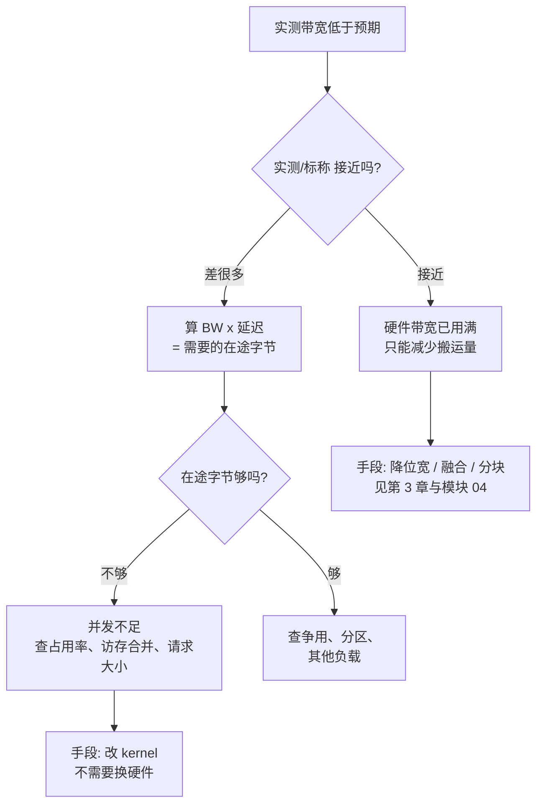

# HBM、DRAM 与存储层次

> 位置：[InferenceAtlas](../../INDEX.md) > [模块 07](README.md) > 当前文档
> 信息截至：2026-07-31 ｜ 最后核验：2026-07-31 ｜ 内容版本：v0.1
> 时效性等级：低（结构与数学部分）
> 相关主题：[GPU 微架构](02_gpu_architecture_for_inference.md)｜[矩阵引擎与低精度](03_tensor_cores_matrix_engines_and_low_precision.md)｜[算术强度与带宽墙](../01_foundations_and_metrics/05_memory_bandwidth_and_arithmetic_intensity.md)

## 本章导读

本模块的定位是「带宽与容量往往比峰值算力更能预测实际吞吐」。
**本章给出这句话的量化形式**：

decode 的算术强度是 $2/b_w$，
而设备的机器平衡（$\text{FLOPS}/\text{BW}$）通常在百量级以上。
两者相除即是 decode 实际用到的算力比例：

| 权重位宽 | $I$ | 机器平衡 100 | 300 | 600 |
|---|---:|---:|---:|---:|
| fp16 | 1.0 | 1.00% | 0.33% | **0.17%** |
| fp8 | 2.0 | 2.00% | 0.67% | 0.33% |
| int4 | 4.0 | 4.00% | 1.33% | 0.67% |

**decode 用到的算力不足峰值的百分之一到百分之几**。
**这不是实现不好，而是负载的性质**——
[第 3 章](03_tensor_cores_matrix_engines_and_low_precision.md) 已说明 $I=2/b_w$ 只由权重位宽决定。

本章要说明这个局面的物理来源：
**容量与带宽由不同的物理机制决定，因此不会同步增长**；
以及一个常被忽略的约束——
**带宽越高，把它喂饱所需的访存并发就越多**，
而访存延迟的改善远慢于带宽。

**关于本章数字的说明**：
**本章不给出任何产品的容量、带宽、延迟或能耗数值**。
受当前环境的网络出口策略限制（详见 [AGENTS.md 第 11 节](../../AGENTS.md)），
本库无法核验厂商规格或标准文本。
本章给出的是**结构关系与量级规律**，并附可填写的核算表；
出现的具体数值均为演示推导设定的假设值。

## 学习目标

读完本章后，读者应能够：

1. 说明带宽与容量为什么由不同机制决定，以及这对选型意味着什么
2. 用 $I$ 与机器平衡之比算出某负载实际用到的算力比例
3. 用 $\text{在途字节} = \text{BW}\times\text{延迟}$ 算出打满带宽所需的访存并发
4. 判断把权重或 KV 卸载到更低层次是否可行，并给出定量判据
5. 区分「带宽不足」与「访存并发不足」这两种表现相似但成因不同的情况

## 核心结论

- **decode 实际用到的算力通常不足峰值的 1%**：这是 $I=2/b_w$ 与机器平衡之比的直接结果。
- **带宽由接口宽度 × 传输率决定，容量由裸片密度 × 堆叠层数决定**——两者是独立的旋钮，因此容量/带宽之比会随代际漂移。
- **打满带宽所需的在途字节等于 $\text{BW}\times\text{延迟}$**：带宽越高、要求的访存并发越多，而延迟的改善远慢于带宽。
- **权重卸载到主机内存在 decode 上几乎不可行**：每步都要读全部权重，代价直接按带宽比放大。
- **KV 卸载的可行性取决于访问是否可选择性**：与权重不同，KV 不必每步全读。
- **「带宽不足」与「访存并发不足」表现相似**：前者靠换硬件，后者靠改 kernel，判据是实测带宽是否接近标称。

## 1. 问题定义、系统边界与工作负载

### 1.1 层次的稳定规律

[第 2 章第 2.2 节](02_gpu_architecture_for_inference.md) 已给出定性规律：

> 每下一层，带宽降约一个数量级，延迟升约一个数量级，容量升约两个数量级。

**本章补充第四个维度——每字节能耗**，
它与延迟同向变化（数据走得越远越贵）：

| 层次 | 容量 | 带宽 | 延迟 | 每字节能耗 | 作用域 |
|---|---|---|---|---|---|
| 寄存器 | 最小 | 最高 | 最低 | **最低** | 线程私有 |
| SRAM / 共享内存 | 小 | 很高 | 低 | 低 | 线程块 |
| L2 | 中 | 高 | 中 | 中 | 全芯片 |
| HBM | 大 | 中 | 高 | **高** | 全芯片 |
| 主机内存 | 很大 | 低 | 很高 | 很高 | 跨设备 |
| 存储 | 最大 | 最低 | 最高 | 最高 | 持久 |

**本库不给出各层的具体倍数**（`待核实`，依平台）。
**稳定的是顺序与量级差，而不是倍数**——
后者随代际与实现变化，前者由物理决定。

**这张表给出的唯一优化方向是：把数据留在尽可能高的层次**，
而这正是分块、融合与 FlashAttention 的共同机制
（见 [模块 04 第 7、8 章](../04_compilers_runtimes_and_kernels/07_kernel_fusion_and_operator_optimization.md)）。

### 1.2 推理向内存提出的三类请求

| 请求 | 数据量 | 频率 | 可否复用 |
|---|---|---|---|
| **读权重** | $W/\text{TP}$ | **每步一次** | 步内可复用，**步间不可** |
| **读写 KV** | 与并发×序列长度成正比 | 每步 | 只读自己的那部分 |
| 激活与中间结果 | 小 | 频繁 | **可留在片上** |

**第一行的「步间不可复用」是 decode 带宽受限的根源**：
每生成一个 token 都要把全部权重过一遍，
**而两次之间没有任何可复用的东西**。

## 2. 原理、数学与性能模型

### 2.1 带宽与容量是两个独立的旋钮

**带宽**由接口决定：

$$\text{BW} = (\text{接口位宽}) \times (\text{每引脚传输率}) / 8$$

**容量**由存储阵列决定：

$$M = (\text{单裸片容量}) \times (\text{堆叠层数}) \times (\text{堆栈数})$$

**两者依赖不同的物理进展**：
带宽受限于信号完整性与功耗，
容量受限于工艺密度与堆叠工艺。
**它们没有理由同步改善**。

**后果是容量/带宽之比会随代际漂移**，而这个比值直接决定：

| 比值变化 | 后果 |
|---|---|
| 容量增长快于带宽 | 装得下更多并发，**但喂不饱**；每 token 更慢 |
| 带宽增长快于容量 | 单请求更快，**但并发上限受限** |

**这解释了为什么不能用单一指标做选型**——
[第 5 章](05_memory_capacity_bandwidth_and_kv_cache.md) 会给出两者的联合判据。

### 2.2 机器平衡与实际算力利用

定义机器平衡

$$B_{\text{machine}} = \frac{\text{FLOPS}}{\text{BW}} \quad [\text{FLOP/B}]$$

负载实际用到的算力比例为

$$\frac{\text{实际算力}}{\text{峰值}} = \min\left(1, \frac{I}{B_{\text{machine}}}\right)$$

由 [第 3 章](03_tensor_cores_matrix_engines_and_low_precision.md)，
decode 的 $I = 2/b_w$：

| 权重位宽 | $I$ | $B_{\text{machine}}=100$ | 300 | 600 |
|---|---:|---:|---:|---:|
| fp16 | 1.0 | 1.00% | 0.33% | 0.17% |
| fp8 | 2.0 | 2.00% | 0.67% | 0.33% |
| int4 | 4.0 | 4.00% | 1.33% | 0.67% |

**两个推论**：

1. **decode 的算力利用率天然极低**，
   报告「GPU 利用率低」在 decode 上不是问题信号——
   与 [第 2 章第 1.3 节](02_gpu_architecture_for_inference.md) 关于利用率指标误导性的讨论一致。
2. **降低权重位宽会提高这个比例**（$I$ 上升），
   但它提高的是「用到的算力比例」，
   **实际收益仍来自搬运量下降**（[第 3 章第 2.2 节](03_tensor_cores_matrix_engines_and_low_precision.md)）。

### 2.3 访存并发：带宽的隐藏门槛

**带宽不是自动达到的**。由 Little's Law，
要让带宽持续满载，必须始终有足够多的访存在飞：

$$\boxed{\text{在途字节} = \text{BW} \times \text{访存延迟}}$$

**算例（假设值）**：

| BW | 延迟 | 在途字节 | 若单次 128 B | 若单次 512 B |
|---:|---:|---:|---:|---:|
| 1 TB/s | 350 ns | 342 KiB | 2,734 个并发 | 684 个并发 |
| 3 TB/s | 450 ns | 1,318 KiB | 10,547 个并发 | 2,637 个并发 |
| 8 TB/s | 500 ns | 3,906 KiB | 31,250 个并发 | 7,812 个并发 |

**这张表给出一个常被忽略的结论**：
**带宽越高，把它喂饱所需的并发访存数越多**。
而**访存延迟的改善历来远慢于带宽**，
因此**这个并发要求随代际上升**。

**实践含义**：

| 现象 | 成因 |
|---|---|
| 实测带宽远低于标称 | **可能是并发不足，而非硬件问题** |
| 访存合并差 | 单次请求小 → 需要更多并发才能填满 |
| 占用率过低 | 在飞的线程不够 → 在途字节不足 |

**这解释了为什么「访存合并」与「占用率」会影响带宽**
（见 [第 2 章第 2.4、3.2 节](02_gpu_architecture_for_inference.md)）：
**它们都是在调节「在途字节」这一个量**。

**注意「占用率并非越高越好」这条已知结论并不矛盾**：
占用率的作用是提供足够的在途访存，
**一旦在途字节已达 $\text{BW}\times\text{延迟}$，再提高就没有收益**——
存在一个饱和点而非单调关系。

### 2.4 卸载的可行性判据

把数据放到更低层次（主机内存、存储），
**代价是该数据的读取带宽按层次落差下降**：

**算例（假设值）**：读 140 GB 权重

| 层次 | 带宽 | 读完耗时 |
|---|---:|---:|
| HBM | 3 TB/s | 0.05 s |
| 主机 DRAM | 200 GB/s | **0.70 s** |
| NVMe | 7 GB/s | **20.0 s** |

**权重卸载在 decode 上的判据**：
decode 每步都要读全部权重，因此

$$\frac{t_{\text{卸载}}}{t_{\text{本地}}} = \frac{\text{BW}_{\text{HBM}}}{\text{BW}_{\text{卸载层}}}$$

算例中主机内存是 **15 倍**，NVMe 是 **429 倍**。
**权重卸载在 decode 上几乎不可行**，
除非配合极高的批（把每步的权重读摊薄到很多请求上）。

**KV 卸载则不同**：

| | 权重 | KV cache |
|---|---|---|
| 每步是否全读 | **是** | **否**（只读自己那部分） |
| 访问是否可选择性 | 否 | **是**（可按请求、按层、按位置） |
| 是否可预取 | 有限 | **可**（知道下一步要哪些） |
| 卸载可行性 | **低** | **中等** |

**关键差别是「可选择性」**：
KV 的访问可以按请求划分，
因此可以只把**不活跃请求**的 KV 放到低层次，
**在它被调度到时再取回**——
这使卸载的代价可以被预取隐藏。
详见 [模块 02 第 8 章](../02_transformer_and_kv_cache/08_kv_cache_compression_quantization_and_eviction.md)
与 [模块 06 第 8 章](../06_distributed_and_moe_inference/08_kv_cache_transfer_and_remote_memory.md)。

**图解读**：

1. **本图展示什么**：把「带宽不够」这一个症状分成两种成因，
   **它们的处理方式完全不同**：
   一个要减少搬运量（或换硬件），一个只要改 kernel。
2. **核心瓶颈**：判定点 B 是分岔的关键，
   而它只需要一个比值——**实测带宽 ÷ 标称带宽**。
   **这个数在多数 profile 工具里都能得到，却常被跳过**。
3. **图中的 trade-off**：右支的修复不花钱（改 kernel），
   左支要么降质量（降位宽）要么花钱（换硬件）。
   **因此应当先排除右支**——
   这与 [模块 08 第 12 章](../08_networking_and_interconnect/12_inference_network_case_studies.md)
   「先软后硬」是同一条纪律。
4. **面试如何引用**：可以说
   「带宽不够我会先看实测除以标称。
   **接近标称说明硬件已经用满，只能减少搬运量**；
   差很多则先算 $\text{BW}\times\text{延迟}$ 得到需要的在途字节，
   **不够就是并发问题，改 kernel 就行，不用换硬件**」。

## 3. 实现机制与系统设计

### 3.1 SRAM 的作用与限度

片上 SRAM（共享内存、L2）的价值是**把复用留在片上**。
由 [第 3 章第 2.1 节](03_tensor_cores_matrix_engines_and_low_precision.md)，
分块的算术强度 $I = 2T/(3b)$ 随分块边长增长，
**而分块的上限由片上容量决定**：

$$3T^2 b \le M_{\text{片上}} \quad\Rightarrow\quad T \le \sqrt{\frac{M_{\text{片上}}}{3b}}$$

**因此片上容量通过 $\sqrt{\cdot}$ 影响可达强度**：

$$I_{\max} = \frac{2T_{\max}}{3b} = \frac{2}{3b}\sqrt{\frac{M_{\text{片上}}}{3b}}$$

**片上容量翻倍只能把强度提高约 41%**（$\sqrt{2}$）。
**这解释了为什么 SRAM 容量不能单独解决带宽问题**——
它的作用是次线性的。

**而 decode 的困难与此无关**：
decode 的低强度不是分块不够大造成的，
**而是权重每步只用一次、没有复用可言**。
**片上容量再大也无法制造不存在的复用**——
这是 decode 与 prefill 最根本的区别。

### 3.2 容量分层的实际结构

| 层次 | 放什么 | 前提 |
|---|---|---|
| 片上 | 当前分块的操作数 | 由 kernel 管理 |
| HBM | **权重 + 活跃请求的 KV** | 决定并发上限 |
| 主机内存 | 不活跃请求的 KV、前缀缓存 | **需可预取** |
| 存储 | 模型文件、冷前缀 | 只在加载/命中时读 |

**第三行是唯一有争议的一层**：
它的可行性完全取决于「能否提前知道要取什么」。
**调度器知道下一批要跑哪些请求，因此预取是可能的**——
这是把 KV 卸载做成可用方案的关键前提。

### 3.3 带宽的分配

**HBM 带宽是被多方共享的**：

| 消耗者 | 占比随什么变化 |
|---|---|
| 读权重 | 固定（$W/\text{TP}$ 每步） |
| 读写 KV | **随并发 × 序列长度增长** |
| 激活读写 | 随批增长，但可被融合减少 |
| 其他（通信缓冲、拷贝） | 视实现 |

**前两行的相对大小是 [第 5 章](05_memory_capacity_bandwidth_and_kv_cache.md) 的核心**：
**存在一个批大小，超过它之后 KV 流量超过权重流量**，
此时继续增大批不再提高吞吐。

### 3.4 ECC 与可靠性开销

内存的纠错会占用一部分容量与带宽。
**本库不给出具体的开销比例**（`待核实`，依实现），
但结构上应注意：

| 项 | 影响 |
|---|---|
| 纠错码存储 | 占用容量 |
| 纠错逻辑 | 可能影响延迟 |
| 不可纠正错误 | **导致该设备失效**，进入 [模块 09 第 7 章](../09_datacenter_power_thermal_and_operations/07_reliability_redundancy_and_maintenance.md) 的可用性核算 |

**第三行的影响不在性能而在可用性**：
由 [模块 08 第 6 章第 4.2 节](../08_networking_and_interconnect/06_scale_up_vs_scale_out.md)，
域可用性是 $a^S$，**单设备的内存故障率直接进入这个指数**。

## 4. 性能、成本、能耗与可靠性 trade-off

### 4.1 容量与带宽的取舍

| 增加 | 得到 | 付出 |
|---|---|---|
| 容量 | 更高并发上限、更长上下文 | 成本；**若带宽不变则每 token 更慢** |
| 带宽 | 更快的每步时间 | 成本、功耗；**需要更多访存并发才能兑现** |
| 片上 SRAM | 更高可达强度（$\sqrt{\cdot}$） | 面积成本大；**对 decode 无用** |

**第三行的「对 decode 无用」值得强调**：
SRAM 解决的是复用问题，
**而 decode 的权重读取本来就没有复用可言**。

### 4.2 能耗方向

**在低算术强度负载中，能耗由数据搬运主导而非计算**。
这是第 1.1 节能耗列的直接推论：
每字节的搬运能耗随层次上升，
而 decode 每步要搬运全部权重。

**因此 decode 的能效杠杆按优先级是**：

| 优先级 | 手段 | 机制 |
|---|---|---|
| 1 | **降低权重位宽** | 直接减少搬运字节 |
| 2 | 提高批（若容量允许） | 把每步的权重读摊薄到更多请求 |
| 3 | 减少不必要的中间物化 | 融合，见 [模块 04](../04_compilers_runtimes_and_kernels/07_kernel_fusion_and_operator_optimization.md) |
| 4 | 提高算力利用率 | **收益最小**，因为算力本就不是瓶颈 |

**第 4 项排在最后是本表的要点**：
在带宽受限区，提高算力利用率既不省时间也不省多少能耗。

**本库不给出任何具体的每字节或每次运算能耗数值**（`待核实`）。

### 4.3 可靠性与供应

| 维度 | 说明 |
|---|---|
| 内存故障 | 进入域可用性 $a^S$ |
| 容量与供应 | **本库不对供应链状况作判断**——需一手核验 |

**第二行是一条边界声明**：
关于内存供应、价格与产能的任何陈述都需要可核验的一手来源，
**当前环境下无法获得**，因此本库不给出
（模块 07 第 12 章因此受阻，见 [模块 README](README.md)）。

## 5. benchmark、真实案例或公开部署案例

**本章不给出任何产品的容量、带宽、延迟或能耗数值**。

受当前环境的网络出口策略限制（详见 [AGENTS.md 第 11 节](../../AGENTS.md)），
本库无法核验厂商规格或标准文本，**因此无法核验任何一项**。
第 2 节的公式由定义推出；表中的具体数值为演示设定的假设值，已在导读中声明。

**读者应在自己平台上完成的核算**：

| 项 | 你的值 | 方法 | 披露标签 |
|---|---|---|---|
| 标称带宽与容量 | 待填 | 规格 | `官方披露` |
| **实测带宽（大消息流式读）** | 待填 | **microbenchmark** | `独立可复现实验` |
| **实测 ÷ 标称** | 待填 | **区分「带宽不足」与「并发不足」** | 推出 |
| 访存延迟 | 待填 | pointer-chase 类 microbenchmark | `独立可复现实验` |
| **在途字节需求 = BW × 延迟** | 待填 | **上两行相乘** | 推出 |
| 实际在途字节 | 待填 | profile 的访存并发 | `独立可复现实验` |
| 机器平衡 = FLOPS ÷ BW | 待填 | 规格相除 | 推出 |
| **decode 用到的算力比例 = $I/B_{\text{machine}}$** | 待填 | **通常 < 1%** | 推出 |
| 片上容量与可达分块 $T_{\max}$ | 待填 | 第 3.1 节 | 推出 |
| 各层次带宽落差 | 待填 | 分层 microbenchmark | `独立可复现实验` |
| **卸载层带宽比 = BW_HBM ÷ BW_卸载** | 待填 | **权重卸载的代价倍数** | 推出 |
| ECC 的容量与带宽开销 | 待填 | 平台事实 | `待核实` |

**加粗的四行构成本章的核心链条**：
先用「实测 ÷ 标称」分清成因，
再用「BW × 延迟」判断并发是否足够，
最后用机器平衡确认算力从来不是瓶颈。

> 测量方法论的通用要求见
> [推理 benchmark 方法论](../11_benchmarking_reliability_and_observability/01_inference_benchmarking_methodology.md)。

## 6. 设计决策框架

**选型时的提问顺序**：

| # | 问题 | 用什么回答 |
|---:|---|---|
| 1 | 负载落在 roofline 哪一侧 | $I$ 与 $B_{\text{machine}}$ 比较 |
| 2 | 容量够不够装下目标并发 | 见 [第 5 章](05_memory_capacity_bandwidth_and_kv_cache.md) |
| 3 | 带宽能不能被兑现 | $\text{BW}\times\text{延迟}$ 与实际在途字节 |
| 4 | 容量/带宽之比是否匹配负载 | [第 5 章](05_memory_capacity_bandwidth_and_kv_cache.md) 的联合判据 |

**判定标准**：

| 观察 | 结论 |
|---|---|
| $I \ll B_{\text{machine}}$ | **带宽受限**；峰值算力不进入选型 |
| 实测带宽 ≈ 标称 | 硬件已用满，**只能减少搬运量** |
| 实测带宽 ≪ 标称 | **先查并发**，不要先换硬件 |
| 在途字节 < BW × 延迟 | 并发不足，改 kernel |
| 容量增长快于带宽 | 装得下但喂不饱，**每 token 会变慢** |
| 考虑权重卸载 | 代价 = 带宽比；**decode 上通常不可行** |
| 考虑 KV 卸载 | 看**可选择性与可预取性**，而非单纯带宽 |

**这些判据不含任何产品数值，可直接套用**。

## 7. 常见失败模式与排查路径

| 症状 | 首先怀疑 | 检查 |
|---|---|---|
| 实测带宽远低于标称 | **访存并发不足** | BW × 延迟 vs 实际在途 |
| 「GPU 利用率低」被当作问题 | decode 本就用不到算力 | $I/B_{\text{machine}}$ |
| 换了更大显存但每 token 更慢 | **容量涨了带宽没涨** | 容量/带宽之比 |
| 增大批后吞吐不再提升 | KV 流量超过权重流量 | [第 5 章](05_memory_capacity_bandwidth_and_kv_cache.md) |
| 权重卸载后慢到不可用 | 每步全读，代价 = 带宽比 | 第 2.4 节 |
| KV 卸载偶尔很慢 | 预取未命中 | 调度与预取的配合 |
| 加大片上 SRAM 但 decode 没变快 | **SRAM 解决复用，decode 无复用** | 第 3.1 节 |
| 访存合并改善后带宽提升 | 单次请求变大 → 在途字节增加 | 第 2.3 节 |

**第七行是本章最容易被误解的一条**：
**片上容量对 prefill 有效、对 decode 无效**，
因为两者的困难性质不同——
一个是复用不够，一个是根本没有复用。

## 8. 关联面试主题

- 机器平衡与算力利用率 → [模块 17 硬件与数据中心题](../17_interview_prep/06_hardware_and_datacenter_questions.md)
- 访存并发与 Little's Law → [模块 17 编译器与 kernel 题](../17_interview_prep/04_compiler_kernel_and_quantization_questions.md)
- 卸载的可行性判据 → [模块 17 KV cache 题](../17_interview_prep/02_kv_cache_and_transformer_questions.md)
- 容量与带宽的联合选型 → [模块 17 系统设计题](../17_interview_prep/01_inference_system_design.md)

## 9. 小结

**本章把「带宽比算力更重要」变成了可计算的形式**：

$$\frac{\text{实际算力}}{\text{峰值}} = \min\left(1, \frac{I}{B_{\text{machine}}}\right)$$

decode 的 $I = 2/b_w$ 在 fp16 下是 1.0 FLOP/B，
**因此实际用到的算力通常不足峰值的 1%**。
这不是实现问题，**是负载的性质**。

**三条结构性事实**：

1. **带宽与容量由不同机制决定**（接口宽度 × 传输率 对 裸片密度 × 堆叠层数），
   因此**不会同步增长，比值会随代际漂移**。
   容量涨得快意味着「装得下但喂不饱」。
2. **打满带宽需要 $\text{BW}\times\text{延迟}$ 的在途字节**，
   而延迟改善远慢于带宽——
   **这个并发门槛随代际上升**。
   「实测带宽低」常常是并发不足而非硬件不足，
   **判据是实测 ÷ 标称**。
3. **片上容量通过 $\sqrt{\cdot}$ 影响可达强度**（$T\le\sqrt{M/3b}$），
   容量翻倍只提高约 41%；
   **而且它对 decode 完全无效**——
   SRAM 解决的是复用不够，decode 的问题是根本没有复用。

**卸载的判据**：

- **权重卸载在 decode 上几乎不可行**：每步全读，代价直接等于带宽比（算例中主机内存 15 倍、NVMe 429 倍）。
- **KV 卸载可行性中等**，关键不在带宽而在**可选择性与可预取性**——
  调度器知道下一批要哪些请求，因此代价可被预取隐藏。

**最后一条纪律**：
「带宽不够」先看实测 ÷ 标称。
**接近标称才是硬件问题，差很多是 kernel 问题**——
后者不用花钱。

## 关键术语

| 中文术语 | 英文 | 定义 | 单位/口径 | 关联文档 |
|---|---|---|---|---|
| 机器平衡 | machine balance | $\text{FLOPS}/\text{BW}$，硬件的强度分界 | FLOP/B | 本章 2.2 |
| 在途字节 | bytes in flight | $\text{BW}\times\text{延迟}$，打满带宽所需的并发访存量 | 字节 | 本章 2.3 |
| 访存并发不足 | insufficient memory-level parallelism | 在途字节低于 $\text{BW}\times\text{延迟}$，带宽无法兑现 | — | 本章 2.3 |
| 可达分块 | achievable tile size | $T_{\max}=\sqrt{M_{\text{片上}}/3b}$ | — | 本章 3.1 |
| 卸载带宽比 | offload bandwidth ratio | $\text{BW}_{\text{HBM}}/\text{BW}_{\text{卸载层}}$；权重卸载的代价倍数 | 无量纲 | 本章 2.4 |
| 可选择性 | selectivity | 能否只访问所需的一部分；**KV 有而权重没有** | — | 本章 2.4 |

## 延伸阅读

- [GPU 微架构中与推理相关的部分](02_gpu_architecture_for_inference.md)
- [矩阵引擎与低精度算力](03_tensor_cores_matrix_engines_and_low_precision.md)
- [显存容量、带宽与 KV cache](05_memory_capacity_bandwidth_and_kv_cache.md)
- [算术强度与带宽墙](../01_foundations_and_metrics/05_memory_bandwidth_and_arithmetic_intensity.md)
- [KV cache 压缩、量化与驱逐](../02_transformer_and_kv_cache/08_kv_cache_compression_quantization_and_eviction.md)
- [算子融合与 kernel 优化](../04_compilers_runtimes_and_kernels/07_kernel_fusion_and_operator_optimization.md)

## 主要来源

本章由存储层次的结构定义、
Little's Law 应用于访存并发、
分块容量约束 $3T^2b\le M_{\text{片上}}$、
以及 [第 3 章](03_tensor_cores_matrix_engines_and_low_precision.md) 的算术强度结论推导而成。

**不含任何产品的容量、带宽、延迟或能耗数值**。
受当前环境的网络出口策略限制，本库无法核验厂商规格或标准文本
（详见 [AGENTS.md 第 11 节](../../AGENTS.md)）。
**关于内存供应、价格与产能，本库不作任何判断**。

| 类别 | 说明 | 披露标签 |
|---|---|---|
| 机器平衡与算力利用率 | 由 roofline 定义推出 | — |
| 在途字节 = BW × 延迟 | Little's Law | — |
| 可达分块 $\sqrt{M/3b}$ | 由分块容量约束推出 | — |
| 第 2 节各表的具体数值 | **为演示设定的假设值** | — |
| 各层次的具体倍数与能耗 | **本章未给出** | `待核实` |
| 读者自身平台的核算 | 应自行实测 | `独立可复现实验` |
| 内存供应、价格与产能 | **本库不作判断** | `待核实` |

## 更新记录

| 日期 | 版本 | 变更 | 核验人 |
|---|---|---|---|
| 2026-07-31 | v0.1 | 初稿：机器平衡与 decode 的算力利用率、带宽与容量的独立机制、在途字节与访存并发门槛、片上容量的 $\sqrt{\cdot}$ 效应及其对 decode 无效、权重与 KV 卸载的可行性判据 | — |
