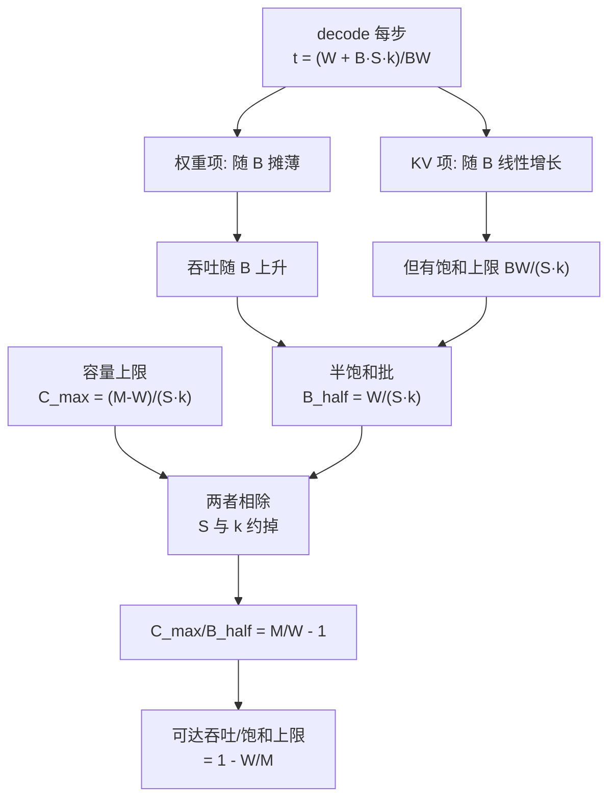
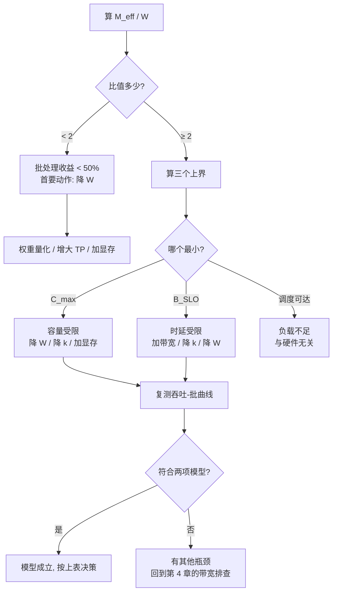

# 显存容量、带宽与 KV cache

> 位置：[InferenceAtlas](../../INDEX.md) > [模块 07](README.md) > 当前文档
> 信息截至：2026-07-31 ｜ 最后核验：2026-07-31 ｜ 内容版本：v0.1
> 时效性等级：低（数学部分）
> 相关主题：[HBM 与存储层次](04_hbm_dram_and_memory_hierarchy.md)｜[KV cache 容量与显存模型](../02_transformer_and_kv_cache/05_kv_cache_capacity_and_memory_models.md)｜[连续批处理](../03_serving_engines_and_scheduling/02_static_dynamic_and_continuous_batching.md)

## 本章导读

[第 4 章](04_hbm_dram_and_memory_hierarchy.md) 说明容量与带宽是两个独立的旋钮。
**本章给出它们如何联合决定 decode 吞吐，并得到一个出乎意料地简洁的结论**。

decode 每步的搬运量是权重加 KV 两项：

$$t_{\text{step}} = \frac{W + B\,S\,k}{\text{BW}}$$

吞吐 $B/t_{\text{step}}$ 随批增长但**有饱和上限**，
半饱和点在 $B_{\text{half}} = W/(Sk)$——**即 KV 流量等于权重流量的那个批**。

而容量给出并发上限 $C_{\max} = (M_{\text{total}}-W)/(Sk)$。
把两者相除：

$$\frac{C_{\max}}{B_{\text{half}}} = \frac{M_{\text{total}}}{W} - 1$$

**序列长度 $S$、KV 每 token 字节数 $k$、层数——全部约掉**。
更进一步，实际可达的吞吐占饱和上限的比例是

$$\boxed{\frac{\text{可达吞吐}}{\text{饱和上限}} = 1 - \frac{W}{M_{\text{total}}}}$$

**即「显存中没有被权重占据的那部分比例」**。

**这个结论把一个看似复杂的多参数问题压缩成了一个比值**：
权重占显存一半，就只能拿到饱和吞吐的一半；
占四分之一，能拿到四分之三。
**上下文长度、KV 配置、模型层数都不影响这个比例**——
它们只改变 $C_{\max}$ 和 $B_{\text{half}}$ 的绝对值，不改变两者之比。

**关于本章数字的说明**：
本章的模型参数、带宽与容量均为演示推导设定的假设值，
**不对应任何具体产品或模型**。
受当前环境的网络出口策略限制（详见 [AGENTS.md 第 11 节](../../AGENTS.md)），
本库无法核验厂商规格。**本章的结论是代数恒等式，与数值无关**。

## 学习目标

读完本章后，读者应能够：

1. 写出 decode 每步时间的两项分解，并求出吞吐的饱和上限与半饱和批
2. 推出 $C_{\max}/B_{\text{half}} = M_{\text{total}}/W - 1$，并说明为什么 $S$ 与 $k$ 会约掉
3. 用 $1 - W/M_{\text{total}}$ 判断一套硬件在给定模型上能拿到多少吞吐
4. 说明为什么「加显存」与「加带宽」在不同情形下的收益完全不同
5. 判断 TP、量化、KV 压缩各自改变了上式中的哪一项

## 核心结论

- **decode 吞吐有饱和上限 $\text{BW}/(Sk)$**，继续加批只能逼近它而不能超过。
- **半饱和批 $B_{\text{half}} = W/(Sk)$ 是 KV 流量等于权重流量的那个批**。
- **$C_{\max}/B_{\text{half}} = M_{\text{total}}/W - 1$**：$S$ 与 KV 配置完全约掉。
- **可达吞吐占饱和上限的比例是 $1 - W/M_{\text{total}}$**，即显存中未被权重占据的比例。
- **$M_{\text{total}}/W < 2$ 时连半饱和都达不到**——这是「批处理是否有意义」的门槛。
- **权重量化同时改善两项**（降 $W$ 又降每步搬运），**KV 量化只改善 $k$**，两者作用位置不同。

## 1. 问题定义、系统边界与工作负载

### 1.1 符号

| 符号 | 含义 | 单位 |
|---|---|---|
| $W$ | 权重总字节数（全部设备合计） | 字节 |
| $M_{\text{total}}$ | 显存总容量（全部设备合计） | 字节 |
| $\text{BW}$ | 显存总带宽（全部设备合计） | 字节/秒 |
| $k$ | 每 token 每请求的 KV 字节数 | 字节 |
| $S$ | 平均序列长度 | token |
| $B$ | 并发请求数（decode 批大小） | — |

**$k$ 的展开**（见 [模块 02 第 5 章](../02_transformer_and_kv_cache/05_kv_cache_capacity_and_memory_models.md)）：

$$k = 2 L\, n_{kv}\, d_h\, b_{kv}$$

**注意本章用「全部设备合计」的口径**：
这样 TP 度不显式出现，
**因为 TP 同时切分了 $W$、$M$ 与 $\text{BW}$，三者按同一比例变化**——
[第 3 节](#3-实现机制与系统设计) 会说明这个口径选择的后果。

### 1.2 本章的边界

**本章只处理 decode 的稳态吞吐**。
不处理：TTFT 与 prefill（见 [模块 02 第 2 章](../02_transformer_and_kv_cache/02_prefill_vs_decode.md)）、
调度与抢占（见 [模块 03](../03_serving_engines_and_scheduling/04_request_scheduling_and_admission_control.md)）、
以及碎片与分页（见 [模块 03 第 3 章](../03_serving_engines_and_scheduling/03_pagedattention_and_kv_memory_management.md)）。

**本章还假设 decode 严格带宽受限**，
这由 [第 4 章第 2.2 节](04_hbm_dram_and_memory_hierarchy.md) 的
「实际用到的算力不足峰值 1%」支持。

## 2. 原理、数学与性能模型

### 2.1 每步时间的两项分解

decode 每步必须读一遍权重，并读写当前所有请求的 KV：

$$t_{\text{step}} = \frac{\overbrace{W}^{\text{权重}} + \overbrace{B\,S\,k}^{\text{KV}}}{\text{BW}}$$

**两项的行为完全不同**：

| 项 | 随 $B$ | 随 $S$ |
|---|---|---|
| 权重 $W$ | **不变** | 不变 |
| KV $BSk$ | **线性增长** | 线性增长 |

**这就是批处理有效的原因，也是它失效的原因**：
权重那一项被摊薄到 $B$ 个请求上，
**但 KV 那一项摊不薄——它本来就是每请求各自的**。

### 2.2 吞吐与饱和上限

$$\text{吞吐} = \frac{B}{t_{\text{step}}} = \frac{B \cdot \text{BW}}{W + B S k}$$

$$\lim_{B\to\infty} \text{吞吐} = \frac{\text{BW}}{S k}$$

**饱和上限 $\text{BW}/(Sk)$ 与权重无关**——
批足够大时权重的搬运被完全摊薄，只剩 KV。

**半饱和批**（吞吐达上限一半时的 $B$）：

$$\frac{B\cdot\text{BW}}{W+BSk} = \frac{1}{2}\cdot\frac{\text{BW}}{Sk} \quad\Rightarrow\quad \boxed{B_{\text{half}} = \frac{W}{Sk}}$$

**它恰好是「KV 流量等于权重流量」的批**：$B S k = W$。

**算例**（假设值：$W=140$ GB、$\text{BW}=3$ TB/s、$L=80$、$n_{kv}=8$、$d_h=128$、KV fp16 → $k=320$ KiB）：

| $S$ | $B_{\text{half}}$ | 饱和上限 |
|---:|---:|---:|
| 2,048 | 208.6 | 4,470 token/s |
| 8,192 | 52.2 | 1,118 token/s |
| 32,768 | **13.0** | 279 token/s |

**长上下文使 $B_{\text{half}}$ 迅速下降**：
$S=32{,}768$ 时批超过 13 就进入 KV 主导区，
**继续加批的边际收益已经很小**。

**同一算例的吞吐曲线**（$S=8{,}192$）：

| $B$ | 每步 | 吞吐 | 占饱和上限 |
|---:|---:|---:|---:|
| 1 | 47.6 ms | 21.0 token/s | 1.9% |
| 8 | 53.8 ms | 148.6 token/s | 13.3% |
| 32 | 75.3 ms | 425.0 token/s | 38.0% |
| 128 | 161.2 ms | 794.0 token/s | 71.1% |
| 512 | 504.8 ms | 1,014.3 token/s | 90.8% |

**注意每步时间随 $B$ 增长**：
批处理提高的是吞吐，**不是单请求时延**——
$B=512$ 时每步 504.8 ms，TPOT 已经完全不可接受。
**吞吐与时延在这里是直接冲突的**（见 [模块 01 第 2 章](../01_foundations_and_metrics/02_latency_throughput_and_slo.md)）。

### 2.3 容量给出的并发上限

显存装下权重之后，剩余部分供 KV：

$$C_{\max} = \frac{M_{\text{total}} - W}{S k}$$

**这是硬上界**：超过它请求就装不下，必须排队或抢占。

### 2.4 核心结论：两个上界的比值

把 $C_{\max}$ 与 $B_{\text{half}}$ 相除：

$$\frac{C_{\max}}{B_{\text{half}}} = \frac{(M_{\text{total}}-W)/(Sk)}{W/(Sk)} = \frac{M_{\text{total}}-W}{W} = \frac{M_{\text{total}}}{W} - 1$$

**$S$ 与 $k$ 完全约掉**。

进一步，把 $B = C_{\max}$ 代入吞吐公式：

$$\frac{\text{可达吞吐}}{\text{饱和上限}} = \frac{C_{\max}}{C_{\max}+B_{\text{half}}} = \frac{M_{\text{total}}-W}{M_{\text{total}}} = 1 - \frac{W}{M_{\text{total}}}$$

**即显存中未被权重占据的比例**。

| $M_{\text{total}}/W$ | 权重占显存 | 可达饱和吞吐的 |
|---:|---:|---:|
| 1.25 | 80% | **20%** |
| 1.5 | 67% | 33% |
| 2.0 | 50% | **50%** |
| 3.0 | 33% | 67% |
| 4.0 | 25% | 75% |
| 8.0 | 12% | 88% |

**这张表是本章的全部内容的浓缩**，
且它**不依赖上下文长度、KV 配置或模型层数**——
这些参数改变 $C_{\max}$ 和 $B_{\text{half}}$ 的绝对值，但同比例改变，故约掉。

**门槛**：$M_{\text{total}}/W < 2$ 时连半饱和都达不到。
**「刚好装得下」的配置（$M/W$ 略大于 1）几乎拿不到任何批处理收益**——
这是评估一套硬件能否胜任某模型的第一个判据。

**图解读**：

1. **本图展示什么**：两个看似独立的上界——带宽给的饱和点与容量给的并发上限——
   **相除之后所有工作负载参数都消失了**，
   只剩显存与权重之比这一个硬件-模型匹配度指标。
2. **核心瓶颈**：瓶颈在节点 C。
   **KV 项摊不薄，因为它本来就是每请求各自的**；
   正是这一项造成饱和上限的存在。
   若没有 KV，吞吐会随批无限增长。
3. **图中的 trade-off**：提高 $B$ 换来吞吐、付出每步时间（即 TPOT）。
   **这个取舍在 $B > B_{\text{half}}$ 之后迅速恶化**——
   吞吐收益递减而时延仍线性增长。
   **$B_{\text{half}}$ 因此也是一个实用的批上限参考点**。
4. **面试如何引用**：可以说
   「decode 每步搬运是权重加 KV 两项，
   **权重那项能被批摊薄，KV 那项不能**，
   所以吞吐有上限 $\text{BW}/(Sk)$，半饱和批是 $W/(Sk)$。
   容量给的并发上限除以它，**上下文长度和 KV 配置全约掉**，
   只剩 $M/W - 1$。
   **所以我判断一套硬件够不够，先看显存除以权重体积——小于 2 就基本拿不到批处理收益**」。

### 2.5 各种优化改变了哪一项

| 手段 | 改变 | 对 $M/W$ | 对饱和上限 |
|---|---|---|---|
| **权重量化** | $W \downarrow$ | **上升** | 不变 |
| **KV 量化 / GQA / MLA** | $k \downarrow$ | 不变 | **上升** |
| 加显存 | $M \uparrow$ | **上升** | 不变 |
| 加带宽 | $\text{BW} \uparrow$ | 不变 | **上升** |
| 增大 TP | $W/P$、$M\cdot P$、$\text{BW}\cdot P$ | 见第 3.1 节 | 上升 |
| 缩短上下文 | $S \downarrow$ | 不变 | **上升** |

**这张表说明四类手段两两成对**：

- **$W\downarrow$ 与 $M\uparrow$ 都提高 $M/W$**，即提高「能拿到饱和吞吐的多大比例」；
- **$k\downarrow$、$\text{BW}\uparrow$、$S\downarrow$ 都提高饱和上限本身**。

**两组的作用完全不同，且都需要**：
只提高比例而不提高上限，是在一个低的天花板下接近它；
只提高上限而不提高比例，是够不着更高的天花板。

**权重量化是唯一同时作用于两处的手段**——
它降低 $W$（提高比例），
**同时减少每步的权重搬运（缩短 $t_{\text{step}}$）**。
**这是 decode 场景下权重量化收益特别大的结构性原因**。

## 3. 实现机制与系统设计

### 3.1 TP 度的作用

本章用「全部设备合计」口径，因此增大 TP 时：

| 量 | 变化 |
|---|---|
| $W$（合计） | **不变**（同一个模型） |
| $M_{\text{total}}$ | **随设备数线性增长** |
| $\text{BW}$（合计） | 随设备数线性增长 |

$$\frac{M_{\text{total}}}{W} \propto P$$

**因此增大 TP 同时提高了「可达比例」与「饱和上限」**。

**但这不是免费的**：
由 [模块 08 第 1 章](../08_networking_and_interconnect/01_inference_networking_overview.md)，
TP 的通信代价随 $P$ 增长且落在 decode 关键路径上；
由 [模块 08 第 6 章](../08_networking_and_interconnect/06_scale_up_vs_scale_out.md)，
时延项在 ring 算法下是 $O(P)$。

**所以 TP 度的选择是显存收益与通信代价的平衡**，
本章给出前者的定量形式，模块 08 给出后者。

### 3.2 有效容量的折扣

$M_{\text{total}}$ 不能按标称取。实际可用的是

$$M_{\text{eff}} = M_{\text{total}} \cdot u - M_{\text{act}} - M_{\text{rt}}$$

| 折扣来源 | 说明 |
|---|---|
| 激活与工作区 | 随批与序列长度变化 |
| 运行时与框架开销 | 相对固定 |
| **碎片** | 分页可大幅减少，见 [模块 03 第 3 章](../03_serving_engines_and_scheduling/03_pagedattention_and_kv_memory_management.md) |
| 安全余量 | 避免 OOM |

**把 $u$ 代入第 2.4 节的公式即可**：
结论形式不变，只是 $M_{\text{total}}$ 换成 $M_{\text{eff}}$。
**这也说明碎片治理的价值可以直接量化**——
它提高 $u$，从而提高可达吞吐比例。

### 3.3 $S$ 的分布而非均值

第 2 节用了平均序列长度 $S$，**这是一个简化**。
真实负载中 $S$ 的分布通常长尾（见 [模块 01 第 1 章](../01_foundations_and_metrics/01_inference_workload_taxonomy.md)）。

| 影响 | 说明 |
|---|---|
| 容量 | 由**当前在跑的请求的 $S$ 之和**决定，非均值 |
| $B_{\text{half}}$ | 用均值估计可接受 |
| 尾部风险 | 少数超长请求可占据大量 KV，**挤掉许多短请求** |

**因此按均值做的容量规划会低估尾部风险**，
调度侧需要按实际占用而非请求数做准入
（见 [模块 03 第 4 章](../03_serving_engines_and_scheduling/04_request_scheduling_and_admission_control.md)）。

### 3.4 与 SLO 的联合约束

第 2.2 节的算例显示 $B=512$ 时每步 504.8 ms，
**TPOT 已完全不可接受**。因此实际批还受 SLO 约束：

$$B_{\text{SLO}} = \frac{\text{TPOT}_{\text{target}}\cdot\text{BW} - W}{S k}$$

**实际批是三个上界的最小值**：

$$B = \min(C_{\max},\ B_{\text{SLO}},\ B_{\text{调度可达}})$$

| 哪个最小 | 含义 | 手段 |
|---|---|---|
| $C_{\max}$ | **容量受限** | 降 $W$、加显存、降 $k$、增大 TP |
| $B_{\text{SLO}}$ | **时延受限** | 加带宽、降 $k$、降 $W$、放宽 SLO |
| 调度可达 | 负载不够 | 与硬件无关 |

**区分前两者是选型的关键一步**：
**容量受限时加带宽无用，时延受限时加显存无用**。

## 4. 性能、成本、能耗与可靠性 trade-off

### 4.1 加显存还是加带宽

| 情形 | 加显存 | 加带宽 |
|---|---|---|
| $C_{\max} < B_{\text{SLO}}$（容量受限） | **有效** | 无效 |
| $C_{\max} > B_{\text{SLO}}$（时延受限） | 无效 | **有效** |
| $M/W$ 接近 1 | **首要** | 次要 |
| 上下文很长（$k S$ 大） | 有效 | **也有效**（提高饱和上限） |

**这张表回答了本章开头的问题**：
「加显存还是加带宽」**没有普遍答案，取决于哪个上界更紧**。
而两个上界都可以在纸上算出来。

### 4.2 成本方向

| 手段 | 是否花钱 | 收益位置 |
|---|---|---|
| 权重量化 | **否** | **同时提高比例与缩短每步** |
| KV 量化 / GQA | 否（模型侧） | 提高饱和上限 |
| 碎片治理 | 否 | 提高有效 $u$ |
| 增大 TP | 是（更多设备） | 两者都提高，**但付通信代价** |
| 加显存/带宽 | **是** | 分别提高比例/上限 |

**前三项都不花钱**，
**且权重量化同时作用于两处**——
因此它应当是 decode 吞吐优化的第一个动作。

**这与 [模块 08 第 12 章](../08_networking_and_interconnect/12_inference_network_case_studies.md)
的「先软后硬」是同一条纪律**。

### 4.3 能耗

由 [第 4 章第 4.2 节](04_hbm_dram_and_memory_hierarchy.md)，
带宽受限负载的能耗由搬运主导。
**每 token 的搬运量为**

$$\frac{W + BSk}{B} = \frac{W}{B} + Sk$$

**第二项与 $B$ 无关**——
**因此提高批只能摊薄权重那一半，$Sk$ 是每 token 能耗的地板**。

**这给出能效的两条路径**：
降 $W$（可被批摊薄的部分）与降 $Sk$（不可摊薄的地板）。
**长上下文场景中地板项占主导，此时 KV 压缩是唯一有效的能效手段**。

## 5. benchmark、真实案例或公开部署案例

**本章不给出任何产品或模型的具体规格**。

受当前环境的网络出口策略限制（详见 [AGENTS.md 第 11 节](../../AGENTS.md)），
本库无法核验厂商规格或模型配置，**因此无法核验任何一项**。
第 2 节的公式为代数恒等式，与数值无关；表中的具体数值为演示设定的假设值。

**读者应为自己的系统填写的核算表**：

| 项 | 你的值 | 方法 | 披露标签 |
|---|---|---|---|
| 权重体积 $W$（含量化后） | 待填 | 参数量 × 有效位宽 | 推出 |
| 显存总容量 $M_{\text{total}}$ | 待填 | 规格 × 设备数 | `官方披露` |
| **有效容量比 $u$** | 待填 | **实测可分配 KV ÷ 标称** | `独立可复现实验` |
| **$M_{\text{eff}}/W$** | 待填 | **本章的核心比值** | 推出 |
| **可达吞吐比例 $1-W/M_{\text{eff}}$** | 待填 | **< 50% 说明权重占用过高** | 推出 |
| 每 token KV 字节数 $k$ | 待填 | $2Ln_{kv}d_hb_{kv}$ | 推出 |
| 平均与 P90 序列长度 $S$ | 待填 | 生产流量统计 | `独立可复现实验` |
| 显存总带宽 BW | 待填 | 规格 × 设备数 | `官方披露` |
| $B_{\text{half}} = W/(Sk)$ | 待填 | 心算 | 推出 |
| $C_{\max} = (M_{\text{eff}}-W)/(Sk)$ | 待填 | 心算 | 推出 |
| $B_{\text{SLO}}$ | 待填 | 第 3.4 节 | 推出 |
| **三个上界中哪个最小** | 待填 | **决定加显存还是加带宽** | 推出 |
| 实测吞吐随 $B$ 的曲线 | 待填 | 扫 $B$ 作图 | `独立可复现实验` |
| 实测曲线是否符合两项模型 | 是/否 | **不符说明有其他瓶颈** | 推出 |

**加粗的四行是本章的核心**：
$M_{\text{eff}}/W$ 一个数就能判断硬件与模型是否匹配，
而「三个上界哪个最小」直接决定该买什么。

> 测量方法论的通用要求见
> [推理 benchmark 方法论](../11_benchmarking_reliability_and_observability/01_inference_benchmarking_methodology.md)。

## 6. 设计决策框架

**图解读**：

1. **本图展示什么**：一条从单个比值出发的决策路径。
   **入口 $M_{\text{eff}}/W$ 只需要两个数就能算，却能立刻排除一大类配置**。
2. **核心瓶颈**：判定点 F 是采购决策的关键。
   **容量受限与时延受限的手段几乎不重叠**——
   加显存对时延受限无用，加带宽对容量受限无用。
   **搞反了就是白花钱**。
3. **图中的 trade-off**：左侧「降 $W$」的手段（量化）会影响质量，
   右侧「加带宽/显存」花钱，中间「增大 TP」付通信代价。
   **三条路各有代价，但降 $W$ 是唯一同时改善两个上界的**。
4. **面试如何引用**：可以说
   「我先算有效显存除以权重体积。
   **小于 2 就说明连半饱和吞吐都拿不到，首要动作是降权重体积**。
   然后算容量上界、SLO 上界和调度可达三个数看哪个最小——
   **容量受限就加显存或降 $W$，时延受限就加带宽，这两类手段不通用**」。

**判定标准**：

| 观察 | 结论 |
|---|---|
| $M_{\text{eff}}/W < 2$ | **批处理收益 < 50%**，先降 $W$ |
| $M_{\text{eff}}/W > 4$ | 容量宽裕，看带宽与 SLO |
| $C_{\max}$ 最小 | 容量受限 |
| $B_{\text{SLO}}$ 最小 | 时延受限 |
| $B_{\text{half}}$ 很小（长上下文） | **加批收益递减快**，优先降 $k$ |
| 实测曲线偏离两项模型 | 有其他瓶颈，回 [第 4 章](04_hbm_dram_and_memory_hierarchy.md) |

## 7. 常见失败模式与排查路径

| 症状 | 首先怀疑 | 检查 |
|---|---|---|
| 加批后吞吐不再提升 | **超过 $B_{\text{half}}$，进入 KV 主导区** | 算 $B_{\text{half}}$ |
| 加显存后吞吐没变 | **时延受限而非容量受限** | 三个上界哪个最小 |
| 加带宽后并发上不去 | **容量受限而非时延受限** | 同上 |
| 长上下文场景吞吐极低 | 饱和上限 $\text{BW}/(Sk)$ 本身低 | 降 $k$（GQA/MLA/量化） |
| 「刚好装得下」但性能很差 | $M/W$ 接近 1 | 第 2.4 节的表 |
| 实测容量远低于标称 | **碎片或余量** | 实测 $u$ |
| 平均序列长度算得对但偶发 OOM | **$S$ 的尾部** | 按实际占用准入 |
| 权重量化后吞吐提升超预期 | 正常 | 它同时改善两项（第 2.5 节） |
| 实测吞吐曲线不是两项模型的形状 | 别处有瓶颈 | 计算、通信或调度 |

**最后一行是一条必要的自查**：
**本章的全部结论建立在「decode 严格带宽受限」这个前提上**。
若实测曲线与两项模型明显不符，
**说明瓶颈不在显存，本章的判据不适用**。

## 8. 关联面试主题

- 吞吐饱和与半饱和批 → [模块 17 系统设计题](../17_interview_prep/01_inference_system_design.md)
- KV cache 容量与并发上限 → [模块 17 KV cache 题](../17_interview_prep/02_kv_cache_and_transformer_questions.md)
- 吞吐与时延的冲突 → [模块 17 serving 与 SLO 题](../17_interview_prep/03_serving_scheduling_and_slo_questions.md)
- 加显存还是加带宽 → [模块 17 硬件与数据中心题](../17_interview_prep/06_hardware_and_datacenter_questions.md)

## 9. 小结

**decode 每步的搬运量是两项**：

$$t_{\text{step}} = \frac{W + BSk}{\text{BW}}$$

**权重项能被批摊薄，KV 项不能**。
由此得到三个量：

| 量 | 表达式 | 含义 |
|---|---|---|
| 饱和上限 | $\text{BW}/(Sk)$ | 吞吐的天花板，与 $W$ 无关 |
| 半饱和批 | $B_{\text{half}} = W/(Sk)$ | KV 流量等于权重流量的批 |
| 容量上限 | $C_{\max} = (M-W)/(Sk)$ | 装得下的最大并发 |

**两个上界相除，工作负载参数全部约掉**：

$$\frac{C_{\max}}{B_{\text{half}}} = \frac{M_{\text{total}}}{W}-1, \qquad \frac{\text{可达吞吐}}{\text{饱和上限}} = 1-\frac{W}{M_{\text{total}}}$$

**即：能拿到饱和吞吐的多大比例，等于显存中没被权重占据的比例**。
**上下文长度、KV 配置、层数都不影响这个比例**。

**四条实践结论**：

1. **$M_{\text{eff}}/W < 2$ 是一条门槛**：低于它连半饱和都达不到，
   「刚好装得下」的配置几乎拿不到批处理收益。
2. **优化手段分两组**：$W\downarrow$ 与 $M\uparrow$ 提高**比例**，
   $k\downarrow$、$\text{BW}\uparrow$、$S\downarrow$ 提高**上限**。
   两组都需要——只提高比例是在低天花板下接近它。
3. **权重量化是唯一同时作用于两处的手段**，
   因此它是 decode 吞吐优化应当最先做的动作，且不花钱。
4. **容量受限与时延受限的手段不通用**：
   加显存对时延受限无用，加带宽对容量受限无用。
   **三个上界（$C_{\max}$、$B_{\text{SLO}}$、调度可达）中哪个最小，直接决定该买什么**。

**最后一条边界**：
本章假设 decode 严格带宽受限。
**若实测吞吐-批曲线不符合两项模型的形状，说明瓶颈在别处**，
应回到 [第 4 章](04_hbm_dram_and_memory_hierarchy.md) 的带宽排查。

## 关键术语

| 中文术语 | 英文 | 定义 | 单位/口径 | 关联文档 |
|---|---|---|---|---|
| 饱和吞吐上限 | throughput ceiling | $\text{BW}/(Sk)$，批趋于无穷时的吞吐；**与权重无关** | token/s | 本章 2.2 |
| 半饱和批 | half-saturation batch | $B_{\text{half}}=W/(Sk)$；KV 流量等于权重流量的批 | — | 本章 2.2 |
| 容量并发上限 | capacity concurrency limit | $C_{\max}=(M-W)/(Sk)$ | — | 本章 2.3 |
| 显存权重比 | memory-to-weight ratio | $M_{\text{total}}/W$；**决定可达吞吐占上限的比例** | 无量纲 | 本章 2.4 |
| 有效容量比 | effective capacity ratio $u$ | 实际可分配给 KV 的容量占标称的比例 | % | 本章 3.2 |
| 每 token 搬运地板 | per-token traffic floor | $Sk$，不可被批摊薄的那部分 | 字节 | 本章 4.3 |

## 延伸阅读

- [HBM、DRAM 与存储层次](04_hbm_dram_and_memory_hierarchy.md)
- [矩阵引擎与低精度算力](03_tensor_cores_matrix_engines_and_low_precision.md)
- [KV cache 容量与显存模型](../02_transformer_and_kv_cache/05_kv_cache_capacity_and_memory_models.md)
- [GQA/MQA/MLA 与 KV 缩减](../02_transformer_and_kv_cache/06_gqa_mqa_mla_and_kv_reduction.md)
- [连续批处理](../03_serving_engines_and_scheduling/02_static_dynamic_and_continuous_batching.md)
- [PagedAttention 与 KV 内存管理](../03_serving_engines_and_scheduling/03_pagedattention_and_kv_memory_management.md)
- [scale-up 与 scale-out 的决策框架](../08_networking_and_interconnect/06_scale_up_vs_scale_out.md)

## 主要来源

本章由 decode 每步搬运量的两项分解出发，
经代数推导得到饱和上限、半饱和批、容量上限及其比值。
**第 2.4 节的两个结论是恒等式，不依赖任何数值**。

**不含任何产品或模型的具体规格**。
受当前环境的网络出口策略限制，本库无法核验厂商规格或模型配置
（详见 [AGENTS.md 第 11 节](../../AGENTS.md)）。

| 类别 | 说明 | 披露标签 |
|---|---|---|
| 每步时间的两项分解 | 由 decode 的搬运需求推出 | — |
| 饱和上限、$B_{\text{half}}$、$C_{\max}$ | 由上式代数推出 | — |
| $C_{\max}/B_{\text{half}}=M/W-1$ 与 $1-W/M$ | **代数恒等式，与数值无关** | — |
| $k = 2Ln_{kv}d_hb_{kv}$ | 见 [模块 02 第 5 章](../02_transformer_and_kv_cache/05_kv_cache_capacity_and_memory_models.md) | — |
| 第 2 节各表的模型与硬件参数 | **为演示设定的假设值** | — |
| 读者自身系统的核算 | 应自行实测 | `独立可复现实验` |
| 任何产品或模型的具体规格 | **本章未给出** | `待核实` |

## 更新记录

| 日期 | 版本 | 变更 | 核验人 |
|---|---|---|---|
| 2026-07-31 | v0.1 | 初稿：每步时间的两项分解、吞吐饱和上限与半饱和批、容量并发上限、$C_{\max}/B_{\text{half}}=M/W-1$ 与可达吞吐比例 $1-W/M$ 的推导、优化手段的两组划分、三个上界的联合判据 | — |
