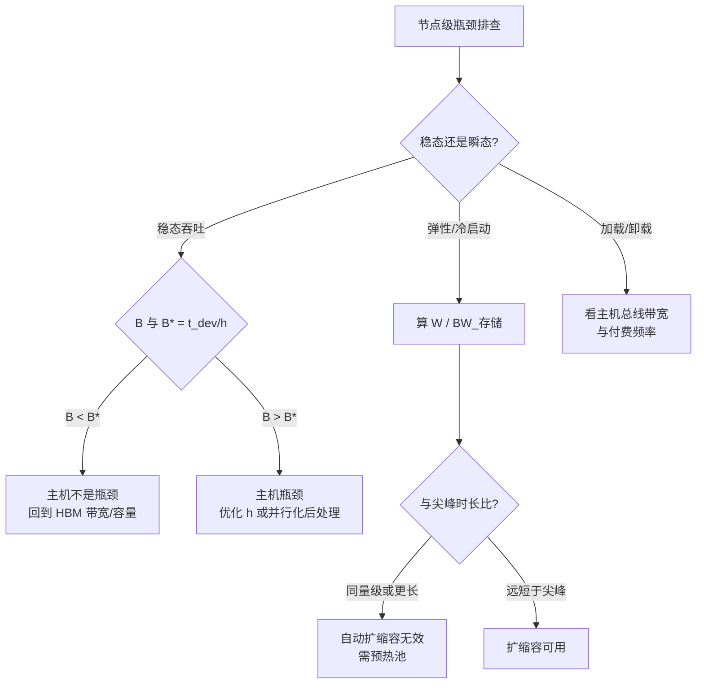

# 服务器节点架构：主机、总线、网卡与存储

> 位置：[InferenceAtlas](../../INDEX.md) > [模块 07](README.md) > 当前文档
> 信息截至：2026-07-31 ｜ 最后核验：2026-07-31 ｜ 内容版本：v0.1
> 时效性等级：低（结构与数学部分）
> 相关主题：[HBM 与存储层次](04_hbm_dram_and_memory_hierarchy.md)｜[显存容量、带宽与 KV cache](05_memory_capacity_bandwidth_and_kv_cache.md)｜[推理网络总览](../08_networking_and_interconnect/01_inference_networking_overview.md)

## 本章导读

前几章把注意力放在加速器本身。
**本章讨论加速器之外的那些部件——主机 CPU、总线、网卡、存储——
它们在稳态 decode 中几乎不参与，却决定了三件加速器无法决定的事**：

| 部件 | 在稳态 decode 中 | 但它决定 |
|---|---|---|
| 主机 CPU | 不在数据路径上 | **批大到一定程度后的吞吐上限** |
| 主机总线 | 不在数据路径上 | **权重加载、KV 卸载、PD 传输的速度** |
| 存储 | 不参与 | **冷启动时间，进而决定自动扩缩容能不能跟上** |
| 网卡 | 见 [模块 08](../08_networking_and_interconnect/01_inference_networking_overview.md) | 跨节点并行的可行性 |

**这张表解释了本章为什么必要**：
一个只看加速器规格的选型会在这四处各留一个盲区，
**而每一个盲区都在特定条件下变成硬上界**。

本章给出两个可计算的判据：
**主机成为瓶颈的批大小 $B^{*} = t_{\text{dev}}/h$**，
以及**冷启动时间与负载尖峰时长的比较**——
后者决定了自动扩缩容是有用还是形同虚设。

**关于本章数字的说明**：
**本章不给出任何产品的总线速率、CPU 规格或存储性能**。
受当前环境的网络出口策略限制（详见 [AGENTS.md 第 11 节](../../AGENTS.md)），
本库无法核验厂商规格或标准文本；
**具名的总线与互连技术属于[受阻的第 8、11 篇](README.md)**。
本章讨论的是**结构与判据**，出现的数值均为演示设定的假设值。

## 学习目标

读完本章后，读者应能够：

1. 列出主机 CPU 在推理中承担的工作，并算出它成为瓶颈的批大小 $B^{*}=t_{\text{dev}}/h$
2. 判断哪些流量走主机总线、哪些不走，并据此评估总线带宽是否重要
3. 由权重体积与存储带宽算出冷启动时间，并判断它对自动扩缩容的影响
4. 说明节点内加速器数量的选择受哪些约束
5. 区分「节点级」与「加速器级」的功耗与可用性口径

## 核心结论

- **主机 CPU 不在稳态 decode 的数据路径上，但每请求的主机开销 $h$ 会在 $B > t_{\text{dev}}/h$ 时成为瓶颈**。
- **主机总线与 HBM 的带宽差约两个数量级**：稳态 decode 不走这条路，但权重加载、KV 卸载与 PD 传输都走。
- **冷启动时间由权重体积除以存储带宽决定**，算例中 140 GB 从 NVMe 加载需 20 s——**它常常长于负载尖峰本身**。
- **加速器数量的选择由一致域大小、供电与散热共同约束**，而非单纯的性价比。
- **功耗与可用性必须按节点级而非加速器级核算**，两者相差主机、风扇、电源转换等固定项。
- **节点是故障域的最小单位之一**：一台机器的问题会带走其上全部加速器。

## 1. 问题定义、系统边界与工作负载

### 1.1 节点的组成

| 部件 | 主要职责 | 在推理中的角色 |
|---|---|---|
| 加速器 | 计算与显存 | **稳态推理的全部** |
| 主机 CPU | 调度、分词、采样、请求处理、内核提交 | **控制面 + 每请求开销** |
| 主机内存 | 暂存、卸载目标、页缓存 | KV 卸载、前缀缓存 |
| 主机总线 | 主机与加速器之间的路径 | 加载、卸载、PD 传输 |
| 网卡 | 跨节点通信 | 见 [模块 08](../08_networking_and_interconnect/01_inference_networking_overview.md) |
| 存储 | 模型文件、日志 | **冷启动** |
| 供电与散热 | — | 见 [模块 09](../09_datacenter_power_thermal_and_operations/03_power_delivery_48v_and_busbar.md) |

### 1.2 哪些路径在稳态 decode 上

**这是本章最重要的区分**：

| 路径 | 稳态 decode | 其他场景 |
|---|---|---|
| 加速器 ↔ HBM | **是**（决定性） | 全部 |
| 加速器 ↔ 加速器（域内） | **是**（TP） | 全部 |
| 加速器 ↔ 网卡 | 跨节点并行时是 | KV 传输 |
| **加速器 ↔ 主机总线** | **否** | 加载、卸载、PD |
| **主机 CPU ↔ 加速器（控制）** | **是**（提交与同步） | 全部 |
| 存储 | 否 | **冷启动** |

**第四行与第五行的区别值得强调**：
**数据不走主机总线，但控制走**。
因此主机总线的**带宽**在稳态 decode 中不重要，
**而主机的响应及时性重要**——这是两个不同的量。

## 2. 原理、数学与性能模型

### 2.1 主机成为瓶颈的条件

设每步的设备时间为 $t_{\text{dev}}$，
每个请求每步在主机侧的开销为 $h$（分词增量、采样后处理、状态更新、日志）。
主机侧每步的总工作为 $B h$。

**主机不成为瓶颈的条件**：

$$B h < t_{\text{dev}} \quad\Longleftrightarrow\quad B < B^{*} = \frac{t_{\text{dev}}}{h}$$

**算例（假设值）**：

| $t_{\text{dev}}$ | $h = 5$ μs | $h = 20$ μs | $h = 50$ μs |
|---:|---:|---:|---:|
| 10 ms | 2,000 | 500 | **200** |
| 25 ms | 5,000 | 1,250 | 500 |
| 50 ms | 10,000 | 2,500 | 1,000 |

**两个方向的推论**：

1. **设备越快，$B^{*}$ 越低**——
   优化了加速器之后，主机更容易成为新的瓶颈。
   **这是一个典型的瓶颈转移**（见 [模块 11 第 11 章](../11_benchmarking_reliability_and_observability/11_benchmark_case_studies.md) 案例四）。
2. **$h$ 是可以优化的**：
   批量化后处理、避免逐请求的同步与日志、
   把可并行的部分放到多核上。

**注意 $B^{*}$ 通常远大于 [第 5 章](05_memory_capacity_bandwidth_and_kv_cache.md) 给出的
容量上限 $C_{\max}$**，
因此**主机瓶颈在多数配置下不是首要矛盾**——
但在小模型、高并发、或 $h$ 未经优化的系统中会浮现。

### 2.2 主机总线的角色

主机总线与 HBM 的带宽差约两个数量级（算例中 64 GB/s 对 3 TB/s，比值 0.021）。

**这个差距决定了各场景的可行性**：

| 场景 | 数据量 | 频率 | 走主机总线可行吗 |
|---|---|---|---|
| 稳态 decode 读权重 | $W$ | **每步** | **否**（见 [第 4 章第 2.4 节](04_hbm_dram_and_memory_hierarchy.md)） |
| 权重初次加载 | $W$ | **一次** | **是**（冷启动的一部分） |
| KV 卸载/取回 | 部分请求的 KV | 按调度 | **是**（可预取，见 [第 4 章](04_hbm_dram_and_memory_hierarchy.md)） |
| PD 分离的 KV 传输 | 与 prompt 成正比 | 每请求 | 视架构（也可走网卡直连） |

**第一行与第二行的对比是关键**：
**同样的 $W$ 字节，每步一次不可行，一次性可行**。
可行性不由带宽本身决定，**而由「多久要付一次」决定**。

### 2.3 冷启动

$$t_{\text{冷启动}} \approx \frac{W}{\text{BW}_{\text{存储}}} + t_{\text{初始化}}$$

**算例（假设值）**：

| 权重体积 | 网络存储 2 GB/s | NVMe 7 GB/s | 多盘并行 25 GB/s |
|---:|---:|---:|---:|
| 70 GB | 35.0 s | 10.0 s | 2.8 s |
| 140 GB | 70.0 s | **20.0 s** | 5.6 s |
| 280 GB | 140.0 s | 40.0 s | 11.2 s |

**这个时间要与负载尖峰的时长比较**：

| 尖峰时长 | 冷启动 20 s | 新副本在尖峰的后多少比例才可用 |
|---:|---:|---:|
| 30 s | 20 s | **33%** |
| 60 s | 20 s | 67% |
| 300 s | 20 s | 93% |

**结论**：
**当冷启动时间与尖峰时长同量级时，自动扩缩容基本无效**——
副本就绪时尖峰已经过去。
**此时唯一有效的手段是预热池（warm pool）**，
即以成本换就绪时间（见 [模块 03 第 10 章](../03_serving_engines_and_scheduling/10_autoscaling_and_load_balancing.md)）。

**这把一个存储指标变成了一个架构决策**：
**存储带宽的价值不在稳态性能，而在弹性能力**。

**图解读**：

1. **本图展示什么**：节点级的三类问题走三条不相干的路径。
   **稳态、弹性、加载各有各的判据**，
   用其中一条的指标去判断另一条会得出错误结论。
2. **核心瓶颈**：三条路径各有自己的瓶颈量——
   稳态是 $h$，弹性是存储带宽，加载是总线带宽。
   **它们分别对应三个不同的部件，没有一个是加速器**。
3. **图中的 trade-off**：右侧的「预热池」是以持续成本换就绪时间；
   左侧的「优化 $h$」是工程投入换吞吐上限。
   **两者都不是买更好的加速器能解决的**——
   这正是本章存在的理由。
4. **面试如何引用**：可以说
   「节点级我会分三类看：
   稳态比 $B$ 和 $t_{\text{dev}}/h$，
   弹性比冷启动时间和尖峰时长，
   加载看总线带宽和付费频率。
   **冷启动跟尖峰同量级时自动扩缩容基本没用，只能上预热池**」。

### 2.4 节点内加速器数量

**加速器数量不是自由选择的**，它受三类约束：

| 约束 | 来源 | 后果 |
|---|---|---|
| 一致域大小 | 互连拓扑 | 决定 TP 能开到多大不跨界（[模块 08 第 6 章](../08_networking_and_interconnect/06_scale_up_vs_scale_out.md)） |
| 供电 | 机架与配电 | 见 [模块 09 第 2、3 章](../09_datacenter_power_thermal_and_operations/02_rack_power_and_density.md) |
| 散热 | 热预算 | 同上 |

**这三者共同决定了「一台机器放几张卡」**，
而这个数又通过一致域大小反过来决定并行策略的可行空间。
**因此节点配置与并行策略是耦合的，不能分开决定**。

**由 [第 5 章第 3.1 节](05_memory_capacity_bandwidth_and_kv_cache.md)**：
节点内加速器数直接决定 $M_{\text{total}}/W$，
**从而决定可达吞吐占饱和上限的比例 $1 - W/M_{\text{total}}$**。

## 3. 实现机制与系统设计

### 3.1 主机侧工作的分类

| 工作 | 是否随 $B$ 增长 | 能否批量化 |
|---|---|---|
| 请求解析与分词 | 是 | **部分**（新请求才需要） |
| 采样与后处理 | 是 | **可**（向量化） |
| 状态更新（KV 块表等） | 是 | 可 |
| 日志与指标 | 是 | **可**（聚合后写） |
| 内核提交与同步 | 与内核数成正比 | **可**（图捕获，见 [模块 04 第 10 章](../04_compilers_runtimes_and_kernels/10_cuda_graphs_and_execution_overhead.md)） |
| 网络与 RPC | 是 | 部分 |

**「能否批量化」这一列决定了 $h$ 的可压缩空间**。
**多数系统的 $h$ 中有相当部分是逐请求的同步与日志**，
它们是最容易被压缩的部分。

**内核提交那一行有专门的手段**：
图捕获把大量小内核的提交合并为一次，
**这既降低 $h$ 也降低设备侧的启动开销**——
是少数同时改善两侧的优化。

### 3.2 存储路径的设计

| 目标 | 手段 |
|---|---|
| 缩短冷启动 | 多盘并行、本地缓存、更紧凑的权重格式 |
| 避免重复下载 | 节点本地缓存已加载过的模型 |
| 加速扩容 | **预热池**（以成本换时间） |
| 减少体积 | **量化**（同时改善冷启动与稳态） |

**最后一行值得注意**：
权重量化在 [第 3](03_tensor_cores_matrix_engines_and_low_precision.md)、
[5 章](05_memory_capacity_bandwidth_and_kv_cache.md) 已被指出同时改善多处，
**这里是第三处**——它按位宽比缩短冷启动。

### 3.3 主机内存的用途

| 用途 | 说明 |
|---|---|
| KV 卸载目标 | 见 [第 4 章第 2.4 节](04_hbm_dram_and_memory_hierarchy.md)；需可预取 |
| 前缀缓存的二级存储 | 命中率与容量的取舍，见 [模块 03 第 8 章](../03_serving_engines_and_scheduling/08_prompt_caching_and_prefix_caching.md) |
| 页缓存 | 加速重复的模型加载 |
| 请求与响应缓冲 | 随并发增长 |

**主机内存容量因此不是一个可以最小化的项**：
它同时是卸载目标与缓存层，
**而这两者都直接影响加速器侧的有效容量**。

### 3.4 节点级的口径

**功耗与可用性必须按节点级核算**：

| 口径 | 包含 |
|---|---|
| 加速器级（chip/board） | 仅加速器 |
| **节点级（server）** | 加速器 + 主机 + 内存 + 网卡 + 风扇 + 电源转换损耗 |
| 机架级 | 多节点 + 配电 + 机架内散热 |

**用加速器级功耗做机架容量规划会系统性低估**，
因为固定项（主机、风扇、转换损耗）不随加速器数线性变化。
**口径要求见 [模块 09 第 2 章](../09_datacenter_power_thermal_and_operations/02_rack_power_and_density.md)
与 [模块 01 第 7 章](../01_foundations_and_metrics/07_energy_efficiency_and_joules_per_token.md)**。

**可用性同理**：
节点是故障域的最小单位之一，
**主机、电源或网卡的问题会带走其上全部加速器**。
这直接进入 [模块 08 第 6 章第 4.2 节](../08_networking_and_interconnect/06_scale_up_vs_scale_out.md) 的 $a^S$ 核算。

### 3.5 可维护性

| 设计 | 影响 |
|---|---|
| 热插拔能力 | 单点更换是否需要停整机 |
| 带外管理 | 能否在系统无响应时诊断与重启 |
| 部件粒度 | 更换单元越小，维护中断越短 |

**这些不影响性能，但直接影响可用性**——
而可用性经 $a^S$ 放大后对大域的影响很大
（见 [模块 09 第 7 章](../09_datacenter_power_thermal_and_operations/07_reliability_redundancy_and_maintenance.md)）。

## 4. 性能、成本、能耗与可靠性 trade-off

### 4.1 节点配置的取舍

| 增加 | 得到 | 付出 |
|---|---|---|
| 加速器数/节点 | 更大一致域、更高 $M/W$ | 供电与散热压力、**故障域变大** |
| 主机 CPU 能力 | 更高的 $B^{*}$ | 成本；**多数配置下不是瓶颈** |
| 主机内存 | 更好的卸载与缓存 | 成本 |
| 存储带宽 | **更短冷启动 → 弹性更好** | 成本 |
| 网卡能力 | 跨节点并行可行性 | 成本；见 [模块 08](../08_networking_and_interconnect/01_inference_networking_overview.md) |

**第二行是一个常见的过度投资**：
由第 2.1 节，$B^{*}$ 通常远大于容量上限 $C_{\max}$，
**因此主机 CPU 在多数推理配置下有富余**。
**应当先测再买**。

### 4.2 成本口径

**单位成本必须按节点级摊销**，
因为主机、内存、网卡、机箱都是必须购置的。
**「每加速器成本」会系统性低估**，且低估幅度随每节点加速器数下降而上升。

**本库不给出任何绝对成本数字**，
核算方法见 [模块 01 第 6 章](../01_foundations_and_metrics/06_cost_modeling_and_unit_economics.md)。

### 4.3 可靠性

| 部件 | 故障后果 |
|---|---|
| 单个加速器 | 该节点的并行组不完整 → **通常整节点退出** |
| 主机 / 电源 / 网卡 | **整节点失效** |
| 单盘 | 视冗余；影响加载而非稳态 |

**第一行的「通常整节点退出」值得说明**：
若 TP 组横跨节点内全部加速器，
**少一张卡就无法组成完整的并行组**，
因此单卡故障的实际影响等同于整节点故障。
**这使节点内加速器数直接等于故障粒度**——
与第 4.1 节第一行的「故障域变大」是同一件事。

## 5. benchmark、真实案例或公开部署案例

**本章不给出任何产品的总线速率、CPU 规格或存储性能**。

受当前环境的网络出口策略限制（详见 [AGENTS.md 第 11 节](../../AGENTS.md)），
本库无法核验厂商规格或标准文本，**因此无法核验任何一项**。
**具名的总线与互连技术属于受阻的第 8、11 篇**（见 [模块 README](README.md)）。
第 2 节的公式由定义推出；表中数值为演示设定的假设值。

**读者应在自己节点上完成的测量**：

| 项 | 你的值 | 方法 | 披露标签 |
|---|---|---|---|
| 每步设备时间 $t_{\text{dev}}$ | 待填 | profile | `独立可复现实验` |
| **每请求每步主机开销 $h$** | 待填 | **CPU profile，分解到各类工作** | `独立可复现实验` |
| **$B^{*} = t_{\text{dev}}/h$** | 待填 | **上两行相除** | 推出 |
| 实际 $B$ 与 $B^{*}$ 的关系 | 待填 | **决定主机是否是瓶颈** | 推出 |
| $h$ 中可批量化的比例 | 待填 | 按第 3.1 节分类 | `独立可复现实验` |
| 主机总线实测带宽 | 待填 | microbenchmark | `独立可复现实验` |
| 存储实测带宽（并行读） | 待填 | microbenchmark | `独立可复现实验` |
| **冷启动时间（实测，非估算）** | 待填 | **完整走一次加载到就绪** | `独立可复现实验` |
| 负载尖峰的典型时长 | 待填 | 生产流量统计 | `独立可复现实验` |
| **冷启动 ÷ 尖峰时长** | 待填 | **决定扩缩容是否有效** | 推出 |
| 节点级功耗（含主机与风扇） | 待填 | **整机测量，非加速器读数** | `独立可复现实验` |
| 节点级与加速器级功耗之差 | 待填 | 两者相减 | 推出 |
| 节点故障率 | 待填 | 长期统计 | `独立可复现实验` |

**加粗的四行是本章的两条核心链条**：
$B^{*}$ 判断主机是否是瓶颈，
冷启动 ÷ 尖峰时长判断弹性手段是否有效。

> 测量方法论的通用要求见
> [推理 benchmark 方法论](../11_benchmarking_reliability_and_observability/01_inference_benchmarking_methodology.md)。

## 6. 设计决策框架

**按问题类型分三条路**：

| 问题 | 判据 | 若不满足 |
|---|---|---|
| 稳态吞吐是否受主机限制 | $B < B^{*} = t_{\text{dev}}/h$ | 优化 $h$（批量化后处理、图捕获） |
| 弹性是否可用 | 冷启动 $\ll$ 尖峰时长 | **上预热池**，或缩短冷启动 |
| 加载/卸载是否可行 | 总线带宽 × 可用时间 ≥ 数据量 | 降低频率或数据量 |
| 节点内加速器数 | 一致域 / 供电 / 散热三者的最小值 | 见 [模块 08](../08_networking_and_interconnect/06_scale_up_vs_scale_out.md)、[模块 09](../09_datacenter_power_thermal_and_operations/02_rack_power_and_density.md) |

**判定标准**：

| 观察 | 结论 |
|---|---|
| $B \ll B^{*}$ | 主机有富余，**不要加 CPU** |
| $B$ 接近或超过 $B^{*}$ | 先优化 $h$，再考虑硬件 |
| 冷启动 > 尖峰时长 | **自动扩缩容形同虚设** |
| 加速器级功耗用于机架规划 | **系统性低估**，改用节点级 |
| 单卡故障导致整节点退出 | 正常（TP 组不完整） |

**这些判据不含任何产品数值，可直接套用**。

## 7. 常见失败模式与排查路径

| 症状 | 首先怀疑 | 检查 |
|---|---|---|
| 优化了加速器但吞吐没提升 | **瓶颈转移到主机** | $B$ 与 $B^{*}$ |
| 高并发下 CPU 占满 | $h$ 未批量化 | 按第 3.1 节分解 |
| 扩容了但尖峰仍然打挂 | **冷启动长于尖峰** | 实测冷启动 ÷ 尖峰时长 |
| 权重加载很慢 | 存储带宽或单盘 | 并行读实测 |
| KV 卸载没有预期效果 | 总线带宽或预取失效 | 第 2.2 节 |
| 机架实际功耗高于规划 | **用了加速器级口径** | 改节点级实测 |
| 单卡故障导致整机不可用 | TP 组不完整 | 正常行为，见第 4.3 节 |
| 内核提交开销大 | 未用图捕获 | [模块 04 第 10 章](../04_compilers_runtimes_and_kernels/10_cuda_graphs_and_execution_overhead.md) |

**第一行是本章最值得预防的一条**：
**加速器优化会降低 $t_{\text{dev}}$，从而降低 $B^{*}$**，
使原本不是瓶颈的主机变成瓶颈。
**因此每次加速器侧优化之后都应重新算一次 $B^{*}$**。

## 8. 关联面试主题

- 主机瓶颈与瓶颈转移 → [模块 17 系统设计题](../17_interview_prep/01_inference_system_design.md)
- 冷启动与自动扩缩容 → [模块 17 serving 与 SLO 题](../17_interview_prep/03_serving_scheduling_and_slo_questions.md)
- 节点级功耗口径 → [模块 17 硬件与数据中心题](../17_interview_prep/06_hardware_and_datacenter_questions.md)
- 故障域与可用性 → [模块 17 调试与可靠性题](../17_interview_prep/07_debug_benchmark_and_reliability_questions.md)

## 9. 小结

**加速器之外的部件在稳态 decode 中几乎不参与，却各自决定一个硬上界**：

1. **主机 CPU**：不在数据路径上，但每请求开销 $h$ 使
   $$B^{*} = \frac{t_{\text{dev}}}{h}$$
   成为吞吐上限。
   **设备越快 $B^{*}$ 越低**——加速器优化会把瓶颈推给主机，
   因此每次优化后都应重算。
   **但 $B^{*}$ 通常远大于容量上限 $C_{\max}$，所以主机多数时候有富余，应先测再买**。
2. **主机总线**：与 HBM 差约两个数量级，
   **稳态 decode 不走这条路**；
   但权重加载、KV 卸载、PD 传输都走。
   **可行性不由带宽决定，而由「多久付一次」决定**——
   同样的 $W$ 字节，每步一次不可行，一次性可行。
3. **存储**：决定冷启动 $\approx W/\text{BW}_{\text{存储}}$。
   **当它与负载尖峰时长同量级时，自动扩缩容形同虚设**，
   此时唯一有效的是预热池——以成本换就绪时间。
   **这把一个存储指标变成了架构决策**。

**两条口径纪律**：

- **功耗与成本必须按节点级核算**：
  用加速器级口径做机架规划会系统性低估，
  因为主机、风扇、电源转换是不随加速器数线性变化的固定项。
- **节点是故障域的最小单位之一**：
  主机、电源或网卡故障带走整节点；
  且若 TP 组横跨节点内全部加速器，
  **单卡故障的实际影响也等同于整节点故障**。

**最后一条联系**：
节点内加速器数由一致域、供电、散热三者的最小值决定，
而它又通过 $M_{\text{total}}/W$ 决定
[第 5 章](05_memory_capacity_bandwidth_and_kv_cache.md) 的可达吞吐比例。
**因此节点配置与并行策略必须一起决定，不能分开**。

## 关键术语

| 中文术语 | 英文 | 定义 | 单位/口径 | 关联文档 |
|---|---|---|---|---|
| 主机瓶颈批 | host-bound batch $B^{*}$ | $t_{\text{dev}}/h$；超过它主机成为瓶颈 | — | 本章 2.1 |
| 每请求主机开销 | per-request host cost $h$ | 每请求每步在主机侧的处理时间 | 秒 | 本章 2.1 |
| 冷启动时间 | cold start time | $W/\text{BW}_{\text{存储}}$ 加初始化 | 秒 | 本章 2.3 |
| 预热池 | warm pool | 预先就绪的副本；**以成本换就绪时间** | 副本数 | 本章 2.3 |
| 节点级口径 | node-level accounting | 含主机、风扇、电源转换的功耗与成本口径 | W / $ | 本章 3.4 |
| 故障粒度 | failure granularity | 一次故障带走的最小单位；节点内卡数即粒度 | — | 本章 4.3 |

## 延伸阅读

- [HBM、DRAM 与存储层次](04_hbm_dram_and_memory_hierarchy.md)
- [显存容量、带宽与 KV cache](05_memory_capacity_bandwidth_and_kv_cache.md)
- [scale-up 与 scale-out 的决策框架](../08_networking_and_interconnect/06_scale_up_vs_scale_out.md)
- [自动扩缩容与负载均衡](../03_serving_engines_and_scheduling/10_autoscaling_and_load_balancing.md)
- [机架功耗与密度](../09_datacenter_power_thermal_and_operations/02_rack_power_and_density.md)
- [CUDA Graphs 与执行开销](../04_compilers_runtimes_and_kernels/10_cuda_graphs_and_execution_overhead.md)

## 主要来源

本章由节点各部件的职责划分、
主机与设备工作量的比较（$B^{*}=t_{\text{dev}}/h$）、
以及冷启动时间的定义推导而成。

**不含任何产品的总线速率、CPU 规格或存储性能**。
受当前环境的网络出口策略限制，本库无法核验厂商规格或标准文本
（详见 [AGENTS.md 第 11 节](../../AGENTS.md)）。
**具名的总线与互连技术属于受阻的第 8、11 篇**。

| 类别 | 说明 | 披露标签 |
|---|---|---|
| $B^{*} = t_{\text{dev}}/h$ | 由主机与设备工作量的比较推出 | — |
| 冷启动 $= W/\text{BW}_{\text{存储}}$ | 由定义推出 | — |
| 各路径是否在稳态 decode 上 | 由数据流结构推出 | — |
| 第 2 节各表的具体数值 | **为演示设定的假设值** | — |
| 读者自身节点的测量 | 应自行实测 | `独立可复现实验` |
| 任何产品的总线、CPU 与存储规格 | **本章未给出** | `待核实` |

## 更新记录

| 日期 | 版本 | 变更 | 核验人 |
|---|---|---|---|
| 2026-07-31 | v0.1 | 初稿：稳态 decode 的路径划分、主机瓶颈批 $B^{*}=t_{\text{dev}}/h$ 与瓶颈转移、主机总线的可行性由付费频率决定、冷启动与自动扩缩容有效性的比较、节点级功耗与故障粒度口径 | — |
