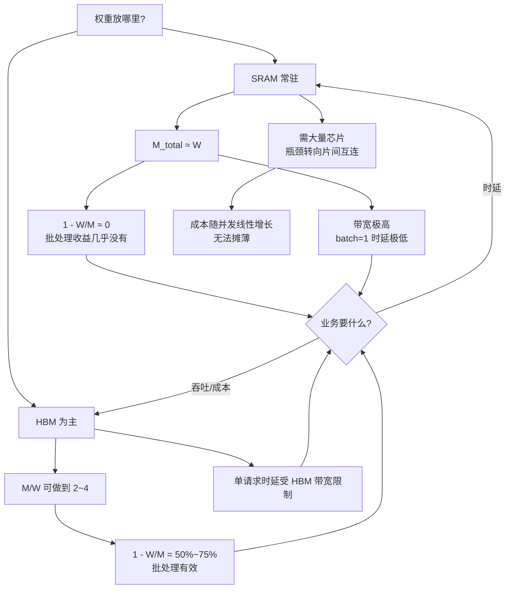

# 推理 ASIC 的架构取舍

> 位置：[InferenceAtlas](../../INDEX.md) > [模块 07](README.md) > 当前文档
> 信息截至：2026-07-31 ｜ 最后核验：2026-07-31 ｜ 内容版本：v0.1
> 时效性等级：低（架构原理部分）
> 相关主题：[矩阵引擎与低精度](03_tensor_cores_matrix_engines_and_low_precision.md)｜[HBM 与存储层次](04_hbm_dram_and_memory_hierarchy.md)｜[显存容量、带宽与 KV cache](05_memory_capacity_bandwidth_and_kv_cache.md)

## 本章导读

推理 ASIC 的设计空间通常被描述成一堆并列的选项：
脉动阵列还是 SIMT、数据流还是指令流、SRAM 常驻还是 HBM。
**本章要说明这些选项并非并列，它们被一个已经推导过的恒等式串在一起**。

由 [第 5 章第 2.4 节](05_memory_capacity_bandwidth_and_kv_cache.md)：

$$\frac{\text{可达吞吐}}{\text{饱和上限}} = 1 - \frac{W}{M_{\text{total}}}$$

**SRAM 常驻路线的定义就是「把权重全部放进片上存储」**，
因此它的 $M_{\text{total}}$ 按构造就接近 $W$：

| 路线 | $M_{\text{total}}/W$ | 可达吞吐占上限 | batch=1 时延 |
|---|---:|---:|---|
| SRAM 常驻（存储几乎全给权重） | ~1.1 | **9%** | **极低** |
| SRAM 常驻（留 20% 给 KV） | ~1.25 | 20% | 极低 |
| HBM 路线（典型） | 2.0 | 50% | 中 |
| HBM 大显存 | 4.0 | 75% | 中 |

**SRAM 常驻路线在结构上无法通过批处理提高吞吐——这不是实现问题而是定义问题**。
它买到的是 batch=1 的极低时延，
**卖掉的是把权重搬运摊薄到多个请求上的能力**。

**这条推理把「该选哪种架构」变成了「你要的是时延还是吞吐」**，
而这是一个业务问题而非技术问题。

**关于本章数字的说明**：
**本章不点名任何公司、产品或芯片，也不给出任何真实规格**。
受当前环境的网络出口策略限制（详见 [AGENTS.md 第 11 节](../../AGENTS.md)），
本库无法核验厂商资料；**具名产品属于[受阻的第 8–10 篇](README.md)**。
本章讨论的是**架构范式的结构性取舍**，出现的数值均为演示设定的假设值。

## 学习目标

读完本章后，读者应能够：

1. 用 $1 - W/M_{\text{total}}$ 解释 SRAM 常驻路线为什么是时延优化而非吞吐优化
2. 估算 SRAM 常驻路线所需的芯片数，并说明瓶颈如何从 HBM 带宽转移到芯片间互连
3. 说明脉动阵列在 decode 小批下的效率，并判断这个效率是否重要
4. 区分「专用化省下了什么」与「专用化放弃了什么」
5. 判断一个架构范式与自己负载的匹配度，而不是比较峰值指标

## 核心结论

- **SRAM 常驻路线的 $M/W$ 按构造接近 1**，因此它在结构上拿不到批处理的吞吐收益——这是定义的推论，不是实现缺陷。
- **它买到的是 batch=1 时延**：算例中每步从 11.7 ms 降到 0.117 ms，约两个数量级。
- **代价是芯片数**：装下 70B int4 需要数十到上百颗芯片，瓶颈从 HBM 带宽转移到**芯片间互连**。
- **脉动阵列在 decode 小批下效率极低**（$B=1$、阵列边长 128 时约 0.8%），**但这通常不重要**——decode 本就带宽受限。
- **专用化省下的是通用性开销，放弃的是应对模型结构变化的能力**；后者在算法快速变化时是主要风险。
- **架构选择应当由「时延还是吞吐」这个业务问题决定**，而不是由峰值指标比较决定。

## 1. 问题定义、系统边界与工作负载

### 1.1 本章的范围

| 在范围内 | 不在范围内 |
|---|---|
| 架构范式的结构性取舍 | 任何具体产品或公司 |
| 由物理与代数推出的关系 | 任何真实规格或性能数字 |
| 「什么负载适合什么范式」 | 「哪家的芯片更好」 |

**受阻说明**：
具名加速器的对比属于第 8–10 篇，
**其内容本体是需核验的厂商规格，当前无法撰写**（见 [模块 README](README.md)）。
**本章刻意只保留与产品无关的部分**。

### 1.2 三条设计轴

| 轴 | 两端 | 主要影响 |
|---|---|---|
| **存储层次** | SRAM 常驻 ↔ HBM 为主 | **吞吐与时延的分野**（第 2 节） |
| **执行模型** | 固定数据流 ↔ 可编程 SIMT | 灵活性与效率的取舍 |
| **专用程度** | 固定功能 ↔ 通用 | 对模型结构变化的适应能力 |

**第一轴的影响最大且最结构化**，因此本章以它为主线。

## 2. 原理、数学与性能模型

### 2.1 SRAM 常驻路线的定义与推论

**定义**：把全部权重放进片上 SRAM，使 decode 的权重读取不再经过 HBM。

**这个定义直接决定了它的吞吐性质**。
由 [第 5 章](05_memory_capacity_bandwidth_and_kv_cache.md)，
可达吞吐占饱和上限的比例是 $1 - W/M_{\text{total}}$，
而**片上存储几乎全部被权重占据意味着 $M_{\text{total}}\approx W$**：

$$\frac{\text{可达吞吐}}{\text{饱和上限}} = 1 - \frac{W}{M_{\text{total}}} \approx 0$$

**换句话说：SRAM 常驻路线几乎没有空间放 KV cache，因此几乎不能通过增大批来摊薄权重搬运**。

**这一点常被表述为「它是低时延架构」，但那只说了一半**。
更准确的说法是：
**它把「权重搬运」这个成本从「每步一次、可被批摊薄」
变成了「每步一次、无法摊薄」**——
因为摊薄需要 KV 的容纳空间，而这个空间被权重本身占用了。

### 2.2 时延收益

**代价换来的是极低的 batch=1 时延**。
片上 SRAM 的聚合带宽远高于 HBM：

**算例（假设值，70B int4 → $W = 35$ GB）**：

| 路线 | 有效带宽 | 每步时间 | 单请求上限 |
|---|---:|---:|---:|
| HBM 路线 | 3 TB/s | 11.667 ms | 86 token/s |
| SRAM 常驻 | 300 TB/s（聚合） | **0.117 ms** | **8,571 token/s** |

**约两个数量级的差距**。

**注意这是单请求的上限**，
而 HBM 路线可以通过批处理让**总**吞吐接近饱和上限。
**两条路线优化的不是同一个指标**：

| | SRAM 常驻 | HBM 路线 |
|---|---|---|
| 优化对象 | **单请求时延（TPOT）** | **总吞吐（token/s per 设备）** |
| 批处理收益 | **几乎没有** | 显著（至 $1-W/M$） |
| 适合 | 时延敏感、并发不高 | 吞吐优先、并发高 |

### 2.3 芯片数与瓶颈转移

SRAM 的容量密度远低于 DRAM，因此装下同样的权重需要大量芯片。

**算例（假设值）**：

| 模型与位宽 | 权重 | 单芯片 SRAM 200 MB | 单芯片 900 MB |
|---|---:|---:|---:|
| 7B int4 | 3.5 GB | 18 颗 | 4 颗 |
| 70B int4 | 35 GB | **175 颗** | 39 颗 |
| 70B fp8 | 70 GB | 350 颗 | 78 颗 |
| 400B int4 | 200 GB | **1,000 颗** | 222 颗 |

**这带来瓶颈转移**：

$$\text{HBM 带宽瓶颈} \;\longrightarrow\; \text{芯片间互连瓶颈}$$

**每步的激活必须流经全部芯片**。若能流水线化，这是吞吐代价而非时延代价；
若不能，时延被跳数主导：

| 芯片数 | 每跳 100 ns | 每跳 500 ns |
|---:|---:|---:|
| 100 | 0.01 ms | 0.05 ms |
| 1,000 | 0.10 ms | **0.50 ms** |

**与 HBM 路线的 11.7 ms 相比，这些数字仍然很小**——
**因此 SRAM 常驻路线的时延优势在算例的参数下是成立的**，
互连开销没有吃掉它。

**但芯片数直接变成成本与功耗**，
而由第 2.1 节这个成本**无法被批摊薄**。
**这才是这条路线的真正代价**：
**每个并发请求都需要一整套芯片**。

### 2.4 量化对两条路线的作用不同

由 [第 3 章](03_tensor_cores_matrix_engines_and_low_precision.md)，
权重量化减少搬运字节。**但在两条路线上的意义不同**：

| 路线 | 量化的主要作用 |
|---|---|
| HBM 路线 | **减少每步搬运** → 直接加速；且提高 $M/W$ → 提高可达吞吐比例 |
| SRAM 常驻 | **减少所需芯片数** → 直接降低成本与功耗 |

**在 SRAM 常驻路线上，量化把「装不下」变成「装得下」**，
因此它不是性能优化而是**可行性前提**：
算例中 70B 从 fp8 换到 int4，芯片数从 350 降到 175。

**图解读**：

1. **本图展示什么**：两条路线的性质**全部由「权重放哪里」这一个选择推出**，
   而不是一组独立的设计决定。
   **中间的每一步都是 [第 5 章](05_memory_capacity_bandwidth_and_kv_cache.md) 恒等式的直接推论**。
2. **核心瓶颈**：节点 D 是全图的枢纽。
   **$M_{\text{total}}\approx W$ 同时产生了优势（极高带宽）与劣势（无批处理空间）**——
   两者是同一件事的两面，不可能只要一面。
3. **图中的 trade-off**：终点的分岔不是技术问题。
   **时延与吞吐/成本在这里是结构性对立的**，
   因为摊薄成本的手段（批处理）恰恰需要 SRAM 常驻路线所没有的容量。
4. **面试如何引用**：可以说
   「SRAM 常驻路线的 $M/W$ 按定义就接近 1，
   而可达吞吐占饱和上限的比例是 $1-W/M$，
   **所以它在结构上拿不到批处理收益——这是定义的推论不是实现缺陷**。
   它买的是 batch=1 时延，算例里差约两个数量级；
   **卖掉的是把权重搬运摊薄到多个请求上的能力，所以成本随并发线性增长**」。

### 2.5 脉动阵列与小批

脉动阵列以固定的二维结构做矩阵乘，效率随 $M$ 维（此处即批）下降：

$$\text{效率} \approx \min\left(1, \frac{B}{T_{\text{array}}}\right)$$

| 阵列边长 | $B=1$ | $B=8$ | $B=32$ | $B=128$ |
|---:|---:|---:|---:|---:|
| 128 | 0.8% | 6.2% | 25.0% | 100% |
| 256 | 0.4% | 3.1% | 12.5% | 50.0% |

**看起来很糟，但通常不重要**——
由 [第 4 章第 2.2 节](04_hbm_dram_and_memory_hierarchy.md)，
decode 实际用到的算力本就不足峰值的 1%。
**在带宽受限区，算力单元空转不延长总时间**。

**它重要的场合是**：

| 场合 | 为什么重要 |
|---|---|
| prefill | $M$ 维是序列长度，通常远大于 $T_{\text{array}}$，**效率高，是该架构的强项** |
| 大批 decode | 进入计算受限区后空转开始花钱 |
| **功耗** | 空转的单元仍有静态功耗 |

**第三行是唯一在 decode 下仍成立的代价**：
**效率低不延长时间，但浪费能量**。

### 2.6 专用化的两面

| 专用化省下 | 专用化放弃 |
|---|---|
| 指令译码、调度、通用数据通路的面积与功耗 | **对新算子与新结构的支持** |
| 灵活性带来的控制开销 | 软件生态与工具链的成熟度 |
| 为通用性保留的余量 | **在算法变化时的适应能力** |

**右列第一行与第三行是同一个风险的两种表述**，
且它在推理领域尤其突出：
**注意力变体、KV 缩减方式、量化格式都在持续变化**
（见 [模块 02 第 6 章](../02_transformer_and_kv_cache/06_gqa_mqa_mla_and_kv_reduction.md)
与 [模块 03](../03_serving_engines_and_scheduling/03_pagedattention_and_kv_memory_management.md)）。

**由 [模块 04 第 6 章](../04_compilers_runtimes_and_kernels/06_onnx_runtime_openvino_and_portability.md) 的
「支持的三个层次」**：
厂商矩阵通常只保证「能跑通」（L1），
**而专用架构上从 L1 到 L3（接近最优）的距离可能很大**。
**因此评估专用硬件时应当测自己的实际模型，而不是看支持列表**。

## 3. 实现机制与系统设计

### 3.1 架构与负载的匹配

| 负载特征 | 倾向的路线 | 理由 |
|---|---|---|
| 单请求时延优先、并发低 | **SRAM 常驻** | 时延优势可兑现，成本劣势不明显 |
| 高并发、吞吐/成本优先 | **HBM 路线** | 批处理摊薄，$1-W/M$ 可到 50%+ |
| 长上下文 | **HBM 路线** | KV 需要容量，SRAM 路线没有 |
| prefill 密集 | 计算受限，看算力与阵列效率 | 脉动阵列的强项 |
| 模型结构频繁变化 | **通用路线** | 专用化的适应风险 |

**第三行值得强调**：
长上下文使 $Sk$ 增大，
由 [第 5 章](05_memory_capacity_bandwidth_and_kv_cache.md)，
**KV 需要的容量随之增大**，
而 SRAM 常驻路线的容量已被权重占满。
**因此这两者在结构上不相容**。

### 3.2 混合方案

**并非只有两个端点**：

| 方案 | 做法 | 取舍 |
|---|---|---|
| SRAM 放热点、HBM 放其余 | 按访问频率分层 | decode 的权重访问是均匀的，**热点不明显** |
| SRAM 放 KV、HBM 放权重 | 反过来 | KV 随并发增长，**片上容量很快不够** |
| 大 SRAM + HBM | 提高可达分块 | 由 [第 4 章第 3.1 节](04_hbm_dram_and_memory_hierarchy.md)，收益是 $\sqrt{\cdot}$ |

**第一行说明了一个重要限制**：
**分层存储依赖访问的不均匀性，而 decode 的权重访问恰恰是完全均匀的**——
每步把每个权重读且只读一次。
**因此传统缓存思路在 decode 的权重读取上无效**。

**这也是 [第 4 章](04_hbm_dram_and_memory_hierarchy.md) 中
「SRAM 解决复用不够，decode 的问题是没有复用」的另一种表述**。

### 3.3 评估一个架构范式的方法

**不要比较峰值指标**（由 [第 4 章](04_hbm_dram_and_memory_hierarchy.md)，decode 用不到 1%）。
应当按顺序问：

| # | 问题 | 判据 |
|---:|---|---|
| 1 | 权重装在哪 | 决定 $M/W$，进而决定批处理收益 |
| 2 | KV 放哪、有多少空间 | 决定并发上限 |
| 3 | 有效带宽是多少 | 决定 batch=1 时延 |
| 4 | 我的负载要时延还是吞吐 | **决定前三项哪个重要** |
| 5 | 我的模型结构在这上面是 L1 还是 L3 | 决定实际可达性能 |

**第 4 问应当最先明确**，
因为它决定了前三项的权重。
**把它留到最后是选型出错的常见原因**。

## 4. 性能、成本、能耗与可靠性 trade-off

### 4.1 两条路线的成本结构

| | SRAM 常驻 | HBM 路线 |
|---|---|---|
| 每实例硬件量 | **高**（大量芯片） | 中 |
| 成本能否被并发摊薄 | **否**（$M/W\approx1$） | **是**（至 $1-W/M$） |
| 每 token 成本随并发 | **基本不变** | **随并发下降** |
| 适合的定价模型 | 高价低延迟服务 | 规模化通用服务 |

**第三行是两条路线经济性的根本差别**，
**而它直接来自第 2.1 节的恒等式**。

### 4.2 能耗

| | SRAM 常驻 | HBM 路线 |
|---|---|---|
| 每字节搬运能耗 | **低**（片上） | 高（片外） |
| 每 token 总搬运 | $W$（不可摊薄） | $W/B + Sk$（[第 5 章](05_memory_capacity_bandwidth_and_kv_cache.md)） |
| 空转单元的静态功耗 | 取决于芯片数 | 取决于阵列效率 |

**第二行是关键**：
**HBM 路线的每 token 搬运量随批下降，SRAM 常驻不随**。
因此在高并发下，
**HBM 路线的每 token 能耗可能反而更低**——
尽管它的每字节能耗更高。

**这是一个典型的「单位指标与总量指标方向相反」的例子**，
应按 [模块 01 第 7 章](../01_foundations_and_metrics/07_energy_efficiency_and_joules_per_token.md) 的
J/token 口径核算而非按每字节能耗比较。

### 4.3 可靠性与供应

| 维度 | SRAM 常驻 | HBM 路线 |
|---|---|---|
| 单实例部件数 | **多**（芯片数大） | 少 |
| 单点故障影响 | 一颗芯片影响整个实例 | 一张卡影响该并行组 |
| 可用性 | $a^N$，**$N$ 大则显著下降** | $a^S$ |

**由 [模块 08 第 6 章第 4.2 节](../08_networking_and_interconnect/06_scale_up_vs_scale_out.md)**，
域可用性是 $a^N$。
**SRAM 常驻路线的 $N$ 大得多，因此对单芯片可用性的要求也高得多**。

**本库不对任何厂商的供应状况作判断**（`待核实`）。

## 5. benchmark、真实案例或公开部署案例

**本章不点名任何公司、产品或芯片，也不给出任何真实规格或性能数字**。

受当前环境的网络出口策略限制（详见 [AGENTS.md 第 11 节](../../AGENTS.md)），
本库无法核验厂商资料，**因此无法核验任何一项**。
**具名产品的对比属于受阻的第 8–10 篇**（见 [模块 README](README.md)）。
第 2 节的公式由 [第 5 章](05_memory_capacity_bandwidth_and_kv_cache.md) 的恒等式推出；
表中数值为演示设定的假设值。

**读者评估一个候选架构时应填写的表**：

| 项 | 你的值 | 方法 | 披露标签 |
|---|---|---|---|
| 权重存放层次 | SRAM / HBM / 混合 | 架构事实 | `官方披露` |
| 单实例总存储 $M_{\text{total}}$ | 待填 | 规格 | `官方披露` |
| **$M_{\text{total}}/W$（用你的模型）** | 待填 | **决定批处理收益** | 推出 |
| **可达吞吐比例 $1-W/M$** | 待填 | **本章的核心判据** | 推出 |
| 有效聚合带宽 | 待填 | **实测，非标称** | `独立可复现实验` |
| batch=1 每步时间 | 待填 | 实测 | `独立可复现实验` |
| 单实例芯片/卡数 | 待填 | 规格 | `官方披露` |
| 芯片间互连的每跳开销 | 待填 | 实测或规格 | `待核实` |
| **每 token 成本随并发的变化** | 待填 | **扫并发实测** | `独立可复现实验` |
| 阵列/引擎在你的 $B$ 下的效率 | 待填 | 第 2.5 节 | 推出 |
| **你的模型在其上是 L1 还是 L3** | 待填 | **跑自己的模型，不看支持列表** | `独立可复现实验` |
| 每 token 能耗（J/token） | 待填 | 与吞吐同步测 | `独立可复现实验` |
| 单部件可用性与实例部件数 | 待填 | 长期统计 | `独立可复现实验` |

**加粗的四行是本章的核心**：
$M/W$ 一个数就能预判批处理收益，
「每 token 成本随并发的变化」是它的实测验证，
而 L1/L3 决定纸面性能能否兑现。

> 测量方法论的通用要求见
> [推理 benchmark 方法论](../11_benchmarking_reliability_and_observability/01_inference_benchmarking_methodology.md)。

## 6. 设计决策框架

**提问顺序**：

| # | 问题 | 若答案是… |
|---:|---|---|
| 1 | **业务要时延还是吞吐/成本** | 时延 → 考虑 SRAM 常驻；吞吐 → HBM 路线 |
| 2 | 上下文有多长 | 长 → **排除 SRAM 常驻**（无 KV 空间） |
| 3 | 并发有多高 | 高 → HBM 路线（可摊薄） |
| 4 | 模型结构是否稳定 | 不稳定 → 倾向通用路线 |
| 5 | 用自己的模型实测 | L1 与 L3 的差距 |

**判定标准**：

| 观察 | 结论 |
|---|---|
| $M/W \approx 1$ | **批处理收益几乎为零**，只能做时延产品 |
| $M/W \ge 2$ | 批处理有效，可做吞吐产品 |
| 需要长上下文 | SRAM 常驻不适用 |
| 每 token 成本不随并发下降 | 符合 $M/W\approx1$ 的预期，**不是调优问题** |
| 阵列效率低但 decode 不慢 | 正常（带宽受限），**只影响能耗** |
| 支持列表有但实测很慢 | L1 而非 L3，见第 2.6 节 |

**这些判据不含任何产品信息，可直接套用**。

## 7. 常见失败模式与排查路径

| 症状 | 首先怀疑 | 检查 |
|---|---|---|
| 低时延架构上加批没有收益 | **$M/W\approx1$，结构决定** | 第 2.1 节 |
| 长上下文在低时延架构上跑不动 | KV 无处安放 | $M_{\text{total}}-W$ |
| 每 token 成本降不下来 | 成本无法被并发摊薄 | 扫并发看成本曲线 |
| 峰值算力很高但推理不快 | decode 用不到算力 | [第 4 章第 2.2 节](04_hbm_dram_and_memory_hierarchy.md) |
| 阵列效率极低 | 小批下正常 | **只看是否影响能耗** |
| 换了新模型结构后性能崩塌 | **专用化的适应风险** | 第 2.6 节；测 L1/L3 |
| 实例可用性低于预期 | 部件数大，$a^N$ | 第 4.3 节 |
| 纸面对比很好但实测差 | 看的是峰值指标 | 改用第 3.3 节的五问 |

**第一行是本章要预防的主要误解**：
**「加批没有收益」在 SRAM 常驻路线上是预期行为而非故障**，
把它当成调优问题会浪费大量时间。

## 8. 关联面试主题

- 架构范式与 $M/W$ 的关系 → [模块 17 硬件与数据中心题](../17_interview_prep/06_hardware_and_datacenter_questions.md)
- 时延与吞吐的结构性对立 → [模块 17 系统设计题](../17_interview_prep/01_inference_system_design.md)
- 专用化的适应风险 → [模块 17 编译器与 kernel 题](../17_interview_prep/04_compiler_kernel_and_quantization_questions.md)
- 单位指标与总量指标方向相反 → [模块 17 调试与 benchmark 题](../17_interview_prep/07_debug_benchmark_and_reliability_questions.md)

## 9. 小结

**推理 ASIC 的设计空间不是一组并列选项，它被一个恒等式串起来**：

$$\frac{\text{可达吞吐}}{\text{饱和上限}} = 1 - \frac{W}{M_{\text{total}}}$$

**SRAM 常驻路线的定义就是把权重放进片上存储，因此 $M_{\text{total}}\approx W$**，
于是：

- **它在结构上拿不到批处理的吞吐收益**——
  这是定义的推论，不是实现缺陷，
  因此「加批没收益」是预期行为而非故障。
- **它买到的是 batch=1 时延**（算例中约两个数量级）；
- **它卖掉的是把权重搬运摊薄到多请求上的能力**，
  因此**每 token 成本基本不随并发下降**。
- **它与长上下文在结构上不相容**，因为 KV 需要容量而容量已被权重占满。

**三条派生结论**：

1. **芯片数是它的真正代价**：装下 70B int4 需数十到上百颗，
   瓶颈从 HBM 带宽转移到芯片间互连
   （算例中互连开销 0.01–0.5 ms，未吃掉 11.7 ms 的时延优势），
   **但成本与功耗随之上升且无法摊薄**。
2. **量化在两条路线上作用不同**：
   HBM 路线上是性能优化，
   **SRAM 常驻路线上是可行性前提**（决定装不装得下）。
3. **脉动阵列在 decode 小批下效率极低（$B=1$ 时约 0.8%），但通常不重要**——
   带宽受限时算力空转不延长时间，
   **唯一仍成立的代价是能耗**。

**最后一条方法论**：
**不要比较峰值指标**，decode 用不到 1%。
应按「业务要时延还是吞吐 → 上下文多长 → 并发多高 → 模型是否稳定 → 用自己的模型实测」
这个顺序评估，
**而第一问应当最先明确，因为它决定其余各项的权重**。

## 关键术语

| 中文术语 | 英文 | 定义 | 单位/口径 | 关联文档 |
|---|---|---|---|---|
| SRAM 常驻 | SRAM-resident | 权重全部放进片上存储；**$M/W\approx1$** | — | 本章 2.1 |
| 瓶颈转移 | bottleneck migration | SRAM 路线把 HBM 带宽瓶颈换成片间互连瓶颈 | — | 本章 2.3 |
| 阵列效率 | array efficiency | $\min(1, B/T_{\text{array}})$；小批下极低但通常无害 | % | 本章 2.5 |
| 专用化适应风险 | specialisation adaptation risk | 模型结构变化时专用架构的失效风险 | — | 本章 2.6 |
| 支持的三个层次 | L1/L2/L3 support | 能跑通 / 性能可接受 / 接近最优 | — | 本章 2.6 |
| 可摊薄性 | amortisability | 成本能否随并发下降；由 $1-W/M$ 决定 | — | 本章 4.1 |

## 延伸阅读

- [矩阵引擎与低精度算力](03_tensor_cores_matrix_engines_and_low_precision.md)
- [HBM、DRAM 与存储层次](04_hbm_dram_and_memory_hierarchy.md)
- [显存容量、带宽与 KV cache](05_memory_capacity_bandwidth_and_kv_cache.md)
- [跨硬件可移植性与代价](../04_compilers_runtimes_and_kernels/06_onnx_runtime_openvino_and_portability.md)
- [J/token 与能效](../01_foundations_and_metrics/07_energy_efficiency_and_joules_per_token.md)
- [scale-up 与 scale-out 的决策框架](../08_networking_and_interconnect/06_scale_up_vs_scale_out.md)

## 主要来源

本章由 [第 5 章](05_memory_capacity_bandwidth_and_kv_cache.md) 的恒等式
$1-W/M_{\text{total}}$、
[第 4 章](04_hbm_dram_and_memory_hierarchy.md) 的存储层次结构、
以及脉动阵列的效率定义推导而成。

**不点名任何公司、产品或芯片，不含任何真实规格或性能数字**。
受当前环境的网络出口策略限制，本库无法核验厂商资料
（详见 [AGENTS.md 第 11 节](../../AGENTS.md)）。
**具名产品的对比属于受阻的第 8–10 篇**。
**本库不对任何厂商的供应状况作判断**。

| 类别 | 说明 | 披露标签 |
|---|---|---|
| SRAM 常驻路线的 $M/W\approx1$ 推论 | 由定义与第 5 章恒等式推出 | — |
| 阵列效率 $\min(1,B/T)$ | 由脉动阵列的结构推出 | — |
| 瓶颈从带宽转向片间互连 | 由 SRAM 容量密度的结构性劣势推出 | — |
| 第 2 节各表的具体数值 | **为演示设定的假设值** | — |
| 读者对候选架构的评估 | 应自行实测 | `独立可复现实验` |
| 任何公司、产品、芯片规格与供应状况 | **本章未给出** | `待核实` |

## 更新记录

| 日期 | 版本 | 变更 | 核验人 |
|---|---|---|---|
| 2026-07-31 | v0.1 | 初稿：用 $1-W/M$ 统一解释 SRAM 常驻与 HBM 两条路线、时延与吞吐的结构性对立、芯片数与瓶颈转移、量化在两条路线上的不同意义、阵列效率为何通常无害、专用化的适应风险 | — |
