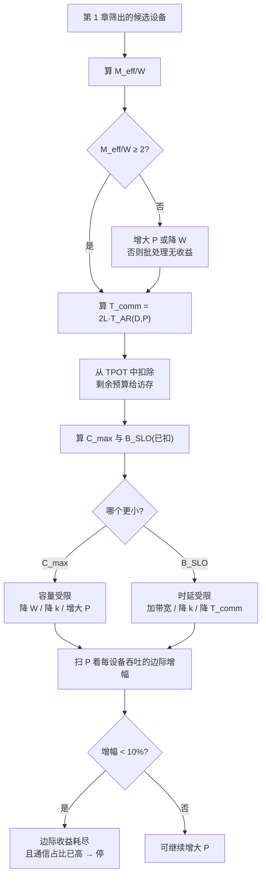

# 面向 workload 的硬件选型框架

> 位置：[InferenceAtlas](../../INDEX.md) > [模块 07](README.md) > 当前文档
> 信息截至：2026-07-31 ｜ 最后核验：2026-07-31 ｜ 内容版本：v0.1
> 时效性等级：低（框架部分）
> 相关主题：[推理硬件总览](01_ai_inference_hardware_overview.md)｜[显存容量、带宽与 KV cache](05_memory_capacity_bandwidth_and_kv_cache.md)｜[scale-up 与 scale-out](../08_networking_and_interconnect/06_scale_up_vs_scale_out.md)

## 本章导读

[第 1 章第 6 节](01_ai_inference_hardware_overview.md) 已给出**单设备的筛选流程**：
用 $B^{*}$ 判断算力能否用满、用 $\tau_{\text{sweep}}$ 判断带宽是否够快。
**本章不重复它，而是处理它之后的问题**：

> 筛出候选设备之后，**要几个、怎么摆、能拿到多少**。

这个问题不能在模块 07 内部独立回答，
因为**显存侧的收益与网络侧的代价是同一个 TPOT 预算的两个消费者**。
本章的核心做法是把两者放进同一个预算：

$$B_{\text{SLO}} = \frac{(\text{TPOT} - T_{\text{comm}})\cdot \text{BW} - W}{S k}$$

**通信时间必须先从 TPOT 中扣除，剩下的才是留给访存的预算**。

**不扣通信会系统性高估可行批，且 $P$ 越大高估越多**——
本章的算例中 $P=32$ 时未扣为 842、已扣为 303，**高估 1.8 倍**。

**这就是本章存在的理由**：
模块 07 与模块 08 各自的结论都正确，
**但分开使用会得到一个不可达的配置**。

**关于本章数字的说明**：
**本章不给出任何产品规格、价格或真实配置**。
受当前环境的网络出口策略限制（详见 [AGENTS.md 第 11 节](../../AGENTS.md)），
本库无法核验厂商规格或成本数据。
算例的全部参数均为演示设定的假设值；**框架本身与数值无关**。

## 学习目标

读完本章后，读者应能够：

1. 说明本章与 [第 1 章第 6 节](01_ai_inference_hardware_overview.md) 的分工，并按序组合两者
2. 把通信时间扣除后再算 $B_{\text{SLO}}$，并说明不扣会高估多少
3. 用一张表比较不同并行度下的可达吞吐、每设备吞吐与通信占比
4. 判断增加设备数的边际收益何时耗尽
5. 列出选型中必须跨模块核对的四类约束及其归属章节

## 核心结论

- **通信必须先从 TPOT 预算中扣除**：不扣会高估 $B_{\text{SLO}}$，且 $P$ 越大高估越多（算例中 $P=32$ 高估 1.8 倍）。
- **$M_{\text{eff}}/W$ 是最先该算的数**：算例中 $P=2$ 时它是 1.10，可达吞吐只有上限的 9%——**配置直接不成立**。
- **每设备吞吐的边际收益迅速耗尽**：算例中 $4\to8$ 增 45%，$8\to16$ 增 15%，$16\to32$ 只增 2%。
- **同时通信占比在快速上升**（6.3% → 14.1% → 29.5% → 60.2%），**因此边际收益耗尽点也是脆弱性拐点**。
- **选型的约束分属四个模块**，任何一个被忽略都会得到纸面可行、实际不可达的配置。
- **框架的输出不是「买哪款」而是「哪个上界最紧」**，因为后者决定了下一步该动什么。

## 1. 问题定义、系统边界与工作负载

### 1.1 与第 1 章的分工

| | [第 1 章第 6 节](01_ai_inference_hardware_overview.md) | 本章 |
|---|---|---|
| 问题 | **这款设备能不能用** | **要几个、怎么摆、能拿到多少** |
| 单位 | 单设备 | 配置（设备数 + 并行切分 + 节点形状） |
| 关键量 | $B^{*}$、$\tau_{\text{sweep}}$、容量 | $M_{\text{eff}}/W$、三个上界、通信占比 |
| 输出 | 候选集 | **哪个上界最紧** |

**两者是串联的**：先用第 1 章筛掉不合格的设备，再用本章决定配置。
**跳过第 1 章直接做本章，会在一个本不该入选的设备上做精细核算**。

### 1.2 需要的输入

| 输入 | 来源 |
|---|---|
| 模型：$W$（量化后）、$L$、$k = 2Ln_{kv}d_hb_{kv}$ | 模型配置 |
| 负载：$S$ 的均值与高分位、并发目标 | [模块 01 第 1 章](../01_foundations_and_metrics/01_inference_workload_taxonomy.md) |
| SLO：TPOT、TTFT | [模块 01 第 2 章](../01_foundations_and_metrics/02_latency_throughput_and_slo.md) |
| 设备：$M_{\text{dev}}$、$\text{BW}$、可用率 $u$ | 规格 + 实测 |
| 互连：$\alpha$、$\beta$、一致域大小 $S_{\text{domain}}$ | [模块 08 第 1 章](../08_networking_and_interconnect/01_inference_networking_overview.md) |
| 节点：供电、散热、每节点设备数上限 | [模块 09 第 2 章](../09_datacenter_power_thermal_and_operations/02_rack_power_and_density.md) |

**注意 $W$ 应取量化后的值**：
由 [第 3](03_tensor_cores_matrix_engines_and_low_precision.md)、[5 章](05_memory_capacity_bandwidth_and_kv_cache.md)，
量化同时改善多项，**因此它应当在选型之前决定，而不是选型之后再优化**。

## 2. 原理、数学与性能模型

### 2.1 三个上界与通信

由 [第 5 章](05_memory_capacity_bandwidth_and_kv_cache.md)，实际批是三个上界的最小值：

$$B = \min(C_{\max},\ B_{\text{SLO}},\ B_{\text{调度可达}})$$

$$C_{\max} = \frac{M_{\text{eff}} - W}{Sk}, \qquad B_{\text{SLO}} = \frac{(\text{TPOT} - T_{\text{comm}})\cdot\text{BW} - W}{Sk}$$

**与第 5 章的唯一差别是 $B_{\text{SLO}}$ 中扣除了 $T_{\text{comm}}$**，
而由 [模块 08 第 1 章第 2.5 节](../08_networking_and_interconnect/01_inference_networking_overview.md)：

$$T_{\text{comm}} = 2L \cdot T_{\text{AR}}(D, P)$$

**这一步是本章的核心**：
**通信与访存共用同一个 TPOT 预算，先扣后算**。

### 2.2 算例

**给定（全部为假设值）**：
$W = 140$ GB（量化后）、$L = 80$、每 token KV $k = 320$ KiB、
$S = 8192$、TPOT = 25 ms、
单设备 96 GB（可用率 80%）、3 TB/s、
域内互连 $\alpha = 1.5$ μs、$\beta = 900$ GB/s。

**先看不扣通信的结果**：

| $P$ | $M_{\text{eff}}$ | $M/W$ | $1-W/M$ | 饱和上限 | $C_{\max}$ | $B_{\text{SLO}}$ | 实际 $B$ | 总吞吐 |
|---:|---:|---:|---:|---:|---:|---:|---:|---:|
| 2 | 154 GB | **1.10** | **9%** | 2,235 | 5.1 | 3.7 | 3.7 | **149** |
| 4 | 307 GB | 2.19 | 54% | 4,470 | 62.3 | 59.6 | 59.6 | 2,384 |
| 8 | 614 GB | 4.39 | 77% | 8,941 | 176.7 | 171.4 | 171.4 | 6,855 |
| 16 | 1,229 GB | 8.78 | 89% | 17,881 | 405.6 | 394.9 | 394.9 | 15,795 |

**$P=2$ 一行已经足以否决该配置**：
$M/W = 1.10$，可达吞吐只有饱和上限的 9%，总吞吐 149 token/s。
**这正是 [第 5 章](05_memory_capacity_bandwidth_and_kv_cache.md) 中「$M/W<2$ 是门槛」的实例**。

### 2.3 扣除通信后

| $P$ | $T_{\text{comm}}$ | 占 TPOT | 剩余预算 | $B_{\text{SLO}}$ 未扣 | **已扣** | $C_{\max}$ | 实际 $B$ | 总吞吐 | 每设备 |
|---:|---:|---:|---:|---:|---:|---:|---:|---:|---:|
| 4 | 1.58 ms | 6.3% | 23.42 ms | 59.6 | **52.5** | 62.3 | 52.5 | 2,243 | 560.9 |
| 8 | 3.52 ms | 14.1% | 21.48 ms | 171.4 | **139.9** | 176.7 | 139.9 | 6,512 | 814.0 |
| 16 | 7.37 ms | 29.5% | 17.63 ms | 394.9 | **263.0** | 405.6 | 263.0 | 14,922 | 932.6 |
| 32 | 15.06 ms | **60.2%** | 9.94 ms | 841.9 | **303.3** | 863.4 | 303.3 | 30,516 | 953.6 |

**两个观察**：

1. **不扣通信会高估 $B_{\text{SLO}}$，且 $P$ 越大高估越多**：
   $P=4$ 时高估 14%，$P=32$ 时高估 **1.8 倍**（842 对 303）。
2. **$P=32$ 时通信已占 TPOT 的 60.2%**，
   **留给访存的预算不足 10 ms**——
   此时系统对任何通信抖动都极其敏感
   （见 [模块 08 第 1 章第 2.6 节](../08_networking_and_interconnect/01_inference_networking_overview.md) 的抖动放大）。

### 2.4 边际收益

**每设备吞吐的增幅**：

| 变化 | 每设备吞吐 | 增幅 |
|---|---:|---:|
| $P: 4\to8$ | 560.9 → 814.0 | **+45%** |
| $P: 8\to16$ | 814.0 → 932.6 | +15% |
| $P: 16\to32$ | 932.6 → 953.6 | **+2%** |

**设备数翻倍只换来 2% 的每设备吞吐提升，同时通信占比从 29.5% 升到 60.2%**。

**因此 $P=16$ 是本算例的合理上界，$P=8$ 是留有余量的选择**。

**这个判断不能只看吞吐**：
边际收益耗尽点同时是**脆弱性拐点**——
通信占比越高，系统对抖动、争用与故障的容忍度越低。
**两者恰好在同一处，这不是巧合**：
两者都源于 $T_{\text{AR}}$ 中 $2(P-1)\alpha$ 这一项的线性增长
（见 [模块 08 第 5 章](../08_networking_and_interconnect/05_collectives_rdma_and_communication_libraries.md)）。

**图解读**：

1. **本图展示什么**：一条把模块 07 的容量分析与模块 08 的通信分析
   **合并进同一个 TPOT 预算**的流程。
   **节点 F 是两条线汇合的地方**，也是本章相对第 5 章唯一新增的一步。
2. **核心瓶颈**：判定点 H 决定后续手段，
   **而它的结果会因为是否扣除通信而改变**——
   不扣通信时 $C_{\max}$ 与 $B_{\text{SLO}}$ 的大小关系可能反转，
   从而把「时延受限」误判为「容量受限」。
3. **图中的 trade-off**：右下角的停止条件有两个理由——
   边际收益耗尽（经济）与通信占比过高（脆弱）。
   **两者在同一处出现，因为都源于 $2(P-1)\alpha$ 的线性增长**。
4. **面试如何引用**：可以说
   「配置我会先算 $M_{\text{eff}}/W$，小于 2 就先解决权重体积。
   然后**把通信时间从 TPOT 里扣掉再算 $B_{\text{SLO}}$**——
   不扣的话 $P$ 大时会高估很多，我的算例里 $P=32$ 高估 1.8 倍。
   最后扫 $P$ 看每设备吞吐的边际增幅，
   **降到 10% 以下就停，因为那时通信占比也已经很高了**」。

## 3. 实现机制与系统设计

### 3.1 四类约束及其归属

**选型必须同时满足四类约束，它们分属不同模块**：

| 约束 | 判据 | 归属 |
|---|---|---|
| **容量与带宽** | $C_{\max}$、$B_{\text{SLO}}$、$M/W$ | [第 5 章](05_memory_capacity_bandwidth_and_kv_cache.md) |
| **通信** | $T_{\text{comm}}$ 占 TPOT 的比例、一致域大小 | [模块 08 第 1、6 章](../08_networking_and_interconnect/06_scale_up_vs_scale_out.md) |
| **供电与散热** | 每节点设备数、机架密度 | [模块 09 第 2 章](../09_datacenter_power_thermal_and_operations/02_rack_power_and_density.md) |
| **主机与弹性** | $B^{*}=t_{\text{dev}}/h$、冷启动 ÷ 尖峰时长 | [第 6 章](06_gpu_server_node_architecture.md) |

**任何一类被忽略都会得到纸面可行、实际不可达的配置**：

| 忽略 | 后果 |
|---|---|
| 通信 | 高估 $B_{\text{SLO}}$（第 2.3 节） |
| 一致域大小 | TP 跨界，通信代价数倍上升（[模块 08](../08_networking_and_interconnect/06_scale_up_vs_scale_out.md)） |
| 供电散热 | 每节点装不下计划的设备数 |
| 主机 | 高并发下 $B$ 被 $B^{*}$ 截断 |
| 冷启动 | 扩缩容跟不上尖峰（[第 6 章](06_gpu_server_node_architecture.md)） |

### 3.2 决策的顺序

**顺序本身是框架的一部分**：

| # | 步骤 | 为什么在这个位置 |
|---:|---|---|
| 1 | 定 SLO 与负载画像 | 后续全部判据的输入 |
| 2 | **定量化方案** | $W$ 进入几乎所有公式，**必须先定** |
| 3 | 第 1 章的单设备筛选 | 排除不合格设备 |
| 4 | 算 $M_{\text{eff}}/W$ | 一个数否决大量配置 |
| 5 | 算 $T_{\text{comm}}$ 并扣除 | **本章的关键一步** |
| 6 | 算三个上界，看哪个最紧 | 决定下一步动什么 |
| 7 | 扫 $P$ 看边际增幅 | 决定停在哪 |
| 8 | 核对供电、散热、主机、弹性 | 排除不可实施的配置 |
| 9 | 端到端 POC | **纸面结论的验证** |

**第 2 步的位置值得强调**：
量化改变 $W$，而 $W$ 出现在 $M/W$、$C_{\max}$、$B_{\text{SLO}}$、
甚至冷启动时间里。
**把量化留到最后当作「调优」，会导致前面所有核算都要重做**。

**第 9 步不可省略**：
本框架给出的是**上界**，
真实系统还有调度、碎片、抖动等因素，
**实测通常低于上界，差距本身就是有用的信息**。

### 3.3 当上界互相冲突时

| 冲突 | 表现 | 处理 |
|---|---|---|
| 容量够但时延不够 | $C_{\max} > B_{\text{SLO}}$ | 加带宽、降 $k$、降 $T_{\text{comm}}$ |
| 时延够但容量不够 | $B_{\text{SLO}} > C_{\max}$ | 降 $W$、降 $k$、增大 $P$ |
| 增大 $P$ 解决容量但恶化通信 | 两个上界反向移动 | **本章第 2.3 节的表就是为此而设** |
| 供电限制了每节点设备数 | 需跨节点 → 通信恶化 | 让 PP 跨界（[模块 08 第 6 章](../08_networking_and_interconnect/06_scale_up_vs_scale_out.md)） |

**第三行是最常见的真实冲突**：
**增大 $P$ 同时提高 $M/W$（好）与 $T_{\text{comm}}$（坏）**，
因此存在一个内部最优——
**这正是第 2.3 节的表要逐行算出来的原因**。

### 3.4 成本口径

**比较配置时用每设备吞吐还是总吞吐，取决于成本结构**：

| 指标 | 何时用 |
|---|---|
| 总吞吐 | 容量规划（要多少套） |
| **每设备吞吐** | **成本比较**（设备是主要成本项时） |
| $/token$ | 最终口径，见 [模块 01 第 6 章](../01_foundations_and_metrics/06_cost_modeling_and_unit_economics.md) |
| J/token | 能效，见 [模块 01 第 7 章](../01_foundations_and_metrics/07_energy_efficiency_and_joules_per_token.md) |

**注意每设备吞吐会低估大 $P$ 配置的成本**，
因为它不含互连、节点与机架的固定成本。
**完整的 TCO 核算需要节点级口径**（见 [第 6 章第 3.4 节](06_gpu_server_node_architecture.md)）。

**本库不给出任何绝对成本数字**。

## 4. 性能、成本、能耗与可靠性 trade-off

### 4.1 增大 $P$ 的四个后果

| 维度 | 方向 | 依据 |
|---|---|---|
| $M/W$ 与可达吞吐比例 | **改善** | [第 5 章](05_memory_capacity_bandwidth_and_kv_cache.md) |
| 每设备吞吐 | 改善但**边际递减** | 本章 2.4 |
| 通信占 TPOT | **恶化，线性** | [模块 08 第 5 章](../08_networking_and_interconnect/05_collectives_rdma_and_communication_libraries.md) |
| 故障域与可用性 $a^P$ | **恶化** | [模块 08 第 6 章](../08_networking_and_interconnect/06_scale_up_vs_scale_out.md) |

**前两行与后两行方向相反**，
因此**必然存在一个内部最优**，
而它的位置由 SLO 的松紧决定：
**TPOT 目标越紧，通信占比的约束越早生效，最优 $P$ 越小**。

### 4.2 脆弱性

**通信占比高的配置更脆弱**：

| 占比 | 抖动容忍度 | 故障后余量 |
|---|---|---|
| < 15% | 高 | 大 |
| 15%–30% | 中 | 中 |
| **> 50%** | **低** | **几乎没有** |

**算例中 $P=32$ 的 60.2% 落在最后一行**：
剩余预算不足 10 ms，
**任何一次通信抖动都会直接突破 TPOT**。

**因此边际收益耗尽点应当被当作硬上界而非软建议**。

### 4.3 与其他模块的可靠性联动

| 项 | 归属 |
|---|---|
| 域可用性 $a^P$ | [模块 08 第 6 章](../08_networking_and_interconnect/06_scale_up_vs_scale_out.md) |
| 容错利用率上界 $(R-1)/R$ | [模块 09 第 7 章](../09_datacenter_power_thermal_and_operations/07_reliability_redundancy_and_maintenance.md) |
| 节点故障粒度 | [第 6 章第 4.3 节](06_gpu_server_node_architecture.md) |
| 优雅降级 | [模块 06 第 10 章](../06_distributed_and_moe_inference/10_fault_tolerance_and_graceful_degradation.md) |

## 5. benchmark、真实案例或公开部署案例

**本章不给出任何产品规格、价格或真实配置**。

受当前环境的网络出口策略限制（详见 [AGENTS.md 第 11 节](../../AGENTS.md)），
本库无法核验厂商规格或成本数据，**因此无法核验任何一项**。
第 2 节算例的全部参数为演示设定的假设值；**框架本身与数值无关**。

**读者应完整填写的选型核算表**：

| # | 项 | 你的值 | 归属章节 |
|---:|---|---|---|
| 1 | TPOT / TTFT 目标 | 待填 | [模块 01 第 2 章](../01_foundations_and_metrics/02_latency_throughput_and_slo.md) |
| 2 | $S$ 的均值与 P90 | 待填 | [模块 01 第 1 章](../01_foundations_and_metrics/01_inference_workload_taxonomy.md) |
| 3 | **量化后的 $W$** | 待填 | [第 3 章](03_tensor_cores_matrix_engines_and_low_precision.md)；**必须先定** |
| 4 | $k = 2Ln_{kv}d_hb_{kv}$ | 待填 | [模块 02 第 5 章](../02_transformer_and_kv_cache/05_kv_cache_capacity_and_memory_models.md) |
| 5 | 单设备 $M$、BW、**实测可用率 $u$** | 待填 | [第 4 章](04_hbm_dram_and_memory_hierarchy.md) |
| 6 | 第 1 章的 $B^{*}$ 与 $\tau_{\text{sweep}}$ 筛选结果 | 待填 | [第 1 章](01_ai_inference_hardware_overview.md) |
| 7 | **$M_{\text{eff}}/W$（逐个 $P$）** | 待填 | [第 5 章](05_memory_capacity_bandwidth_and_kv_cache.md) |
| 8 | 互连 $\alpha$、$\beta$、一致域大小 | 待填 | [模块 08 第 1 章](../08_networking_and_interconnect/01_inference_networking_overview.md) |
| 9 | **$T_{\text{comm}} = 2L\cdot T_{\text{AR}}$（逐个 $P$）** | 待填 | [模块 08 第 5 章](../08_networking_and_interconnect/05_collectives_rdma_and_communication_libraries.md) |
| 10 | **扣除通信后的 $B_{\text{SLO}}$** | 待填 | **本章 2.1** |
| 11 | $C_{\max}$ 与哪个上界更紧 | 待填 | 本章 2.3 |
| 12 | **每设备吞吐的边际增幅** | 待填 | 本章 2.4 |
| 13 | 主机 $B^{*}=t_{\text{dev}}/h$ | 待填 | [第 6 章](06_gpu_server_node_architecture.md) |
| 14 | 冷启动 ÷ 尖峰时长 | 待填 | [第 6 章](06_gpu_server_node_architecture.md) |
| 15 | 每节点设备数（供电/散热上限） | 待填 | [模块 09 第 2 章](../09_datacenter_power_thermal_and_operations/02_rack_power_and_density.md) |
| 16 | **端到端 POC 实测 ÷ 本表上界** | 待填 | **差距本身是信息** |

**加粗的五行是本章相对其他章新增的部分**，
其余各行是从各章汇总而来。

> 测量方法论的通用要求见
> [推理 benchmark 方法论](../11_benchmarking_reliability_and_observability/01_inference_benchmarking_methodology.md)。

## 6. 设计决策框架

**判定标准**：

| 观察 | 结论 |
|---|---|
| $M_{\text{eff}}/W < 2$ | **配置不成立**，先降 $W$ 或增大 $P$ |
| $T_{\text{comm}}$ 占 TPOT > 30% | 接近脆弱区，**慎重增大 $P$** |
| $T_{\text{comm}}$ 占 TPOT > 50% | **视为硬上界**，不应再增大 $P$ |
| 每设备吞吐边际增幅 < 10% | 边际收益耗尽，停 |
| $C_{\max} < B_{\text{SLO}}$ | 容量受限 |
| $B_{\text{SLO}} < C_{\max}$ | 时延受限 |
| POC 实测远低于上界 | 有本框架未覆盖的瓶颈（调度、碎片、抖动） |
| 主机 $B^{*}$ 小于目标 $B$ | 主机截断，先优化 $h$ |

**这些阈值是本库为便于判断而设的分界，不是任何标准的规定**。

**框架的输出不是「买哪款」**，
**而是「哪个上界最紧」**——
因为后者直接决定下一步该动什么，
而「买哪款」往往不是最有效的动作
（见 [模块 08 第 12 章](../08_networking_and_interconnect/12_inference_network_case_studies.md) 的「先软后硬」）。

## 7. 常见失败模式与排查路径

| 症状 | 首先怀疑 | 检查 |
|---|---|---|
| 纸面配置可行但实测差很多 | **未扣通信** | 第 2.3 节 |
| 增大 $P$ 后总吞吐涨但体验变差 | 通信占比过高 | $T_{\text{comm}}$ / TPOT |
| 「刚好装得下」的配置性能极差 | $M/W$ 接近 1 | 第 2.2 节 $P=2$ 行 |
| 加设备的收益越来越小 | 边际递减 | 第 2.4 节 |
| 选型时算得好，上线后被主机限制 | 忽略了 $B^{*}$ | [第 6 章](06_gpu_server_node_architecture.md) |
| 扩容跟不上尖峰 | 忽略了冷启动 | [第 6 章](06_gpu_server_node_architecture.md) |
| 每节点装不下计划的设备数 | 忽略了供电散热 | [模块 09](../09_datacenter_power_thermal_and_operations/02_rack_power_and_density.md) |
| 量化后所有核算都要重做 | **量化定得太晚** | 第 3.2 节第 2 步 |
| POC 与上界差距大且找不到原因 | 调度、碎片、抖动 | [模块 03](../03_serving_engines_and_scheduling/03_pagedattention_and_kv_memory_management.md)、[模块 11](../11_benchmarking_reliability_and_observability/01_inference_benchmarking_methodology.md) |

**第一行是本章要预防的主要错误**：
**模块 07 与模块 08 的结论各自正确，但分开使用会给出不可达的配置**。

## 8. 关联面试主题

- 从 SLO 反推硬件配置 → [模块 17 案例走查](../17_interview_prep/09_mock_interview_cases.md)
- 三个上界与哪个最紧 → [模块 17 系统设计题](../17_interview_prep/01_inference_system_design.md)
- 并行度的内部最优 → [模块 17 分布式与 MoE 题](../17_interview_prep/05_distributed_and_moe_questions.md)
- 选型口径与 TCO → [模块 17 硬件与数据中心题](../17_interview_prep/06_hardware_and_datacenter_questions.md)

## 9. 小结

**本章接在 [第 1 章第 6 节](01_ai_inference_hardware_overview.md) 的单设备筛选之后，
回答「要几个、怎么摆、能拿到多少」**。

**关键一步只有一个**：

$$B_{\text{SLO}} = \frac{(\text{TPOT} - T_{\text{comm}})\cdot\text{BW} - W}{Sk}$$

**通信时间必须先从 TPOT 中扣除**。
不扣会系统性高估可行批，且 $P$ 越大高估越多——
算例中 $P=4$ 高估 14%，$P=32$ 高估 **1.8 倍**。

**算例给出的三条结论**：

1. **$M_{\text{eff}}/W$ 是最先该算的数**：
   $P=2$ 时它是 1.10，可达吞吐只有饱和上限的 9%，
   **这一个数就否决了该配置**。
2. **每设备吞吐的边际收益迅速耗尽**：
   $4\to8$ 增 45%，$8\to16$ 增 15%，$16\to32$ 只增 2%。
3. **边际收益耗尽点同时是脆弱性拐点**：
   通信占比在同一区间从 29.5% 升到 60.2%，
   剩余访存预算不足 10 ms。
   **两者同处一点不是巧合——都源于 $2(P-1)\alpha$ 的线性增长**。

**两条流程纪律**：

- **量化必须在选型之前定**：
  $W$ 出现在 $M/W$、$C_{\max}$、$B_{\text{SLO}}$ 乃至冷启动里，
  把它当作事后调优会导致全部核算重做。
- **四类约束分属四个模块**——
  容量带宽（本模块第 5 章）、通信（模块 08）、
  供电散热（模块 09）、主机与弹性（本模块第 6 章）。
  **忽略任何一类都会得到纸面可行、实际不可达的配置**。

**最后是本框架的定位**：
**它的输出不是「买哪款」，而是「哪个上界最紧」**。
后者决定下一步该动什么，
而它常常不是买新硬件——
**降 $W$、改并行切分、修主机开销这些不花钱的手段，往往先于采购**。

## 关键术语

本章不引入新的量，所用概念均见前几章。仅补充两个框架性术语：

| 中文术语 | 英文 | 定义 | 单位/口径 | 关联文档 |
|---|---|---|---|---|
| 扣除通信后的 SLO 上界 | communication-adjusted SLO bound | $((\text{TPOT}-T_{\text{comm}})\text{BW}-W)/(Sk)$ | — | 本章 2.1 |
| 边际收益耗尽点 | marginal-return exhaustion point | 每设备吞吐增幅降至阈值以下的 $P$；**同时是脆弱性拐点** | — | 本章 2.4 |

## 延伸阅读

- [推理硬件全景与分类](01_ai_inference_hardware_overview.md)
- [显存容量、带宽与 KV cache](05_memory_capacity_bandwidth_and_kv_cache.md)
- [服务器节点架构](06_gpu_server_node_architecture.md)
- [scale-up 与 scale-out 的决策框架](../08_networking_and_interconnect/06_scale_up_vs_scale_out.md)
- [推理网络总览](../08_networking_and_interconnect/01_inference_networking_overview.md)
- [成本建模与单位经济学](../01_foundations_and_metrics/06_cost_modeling_and_unit_economics.md)
- [机架功耗与密度](../09_datacenter_power_thermal_and_operations/02_rack_power_and_density.md)

## 主要来源

本章是 [模块 07](README.md) 第 1、3–6 章与
[模块 08](../08_networking_and_interconnect/01_inference_networking_overview.md) 第 1、5、6 章
已推导结论的组合，**唯一新增的一步是把 $T_{\text{comm}}$ 从 TPOT 预算中扣除**。

**不含任何产品规格、价格或真实配置**。
受当前环境的网络出口策略限制，本库无法核验厂商规格或成本数据
（详见 [AGENTS.md 第 11 节](../../AGENTS.md)）。

| 类别 | 说明 | 披露标签 |
|---|---|---|
| 三个上界与 $M/W$ 恒等式 | 见 [第 5 章](05_memory_capacity_bandwidth_and_kv_cache.md) 的推导 | — |
| $T_{\text{comm}} = 2L\cdot T_{\text{AR}}$ | 见 [模块 08 第 1、5 章](../08_networking_and_interconnect/05_collectives_rdma_and_communication_libraries.md) | — |
| 扣除通信后的 $B_{\text{SLO}}$ | 由两者组合推出 | — |
| 第 2 节算例的全部参数 | **为演示设定的假设值** | — |
| 第 6 节的阈值 | **本库为便于判断而设的分界，非标准规定** | — |
| 读者自身的选型核算与 POC | 应自行完成 | `独立可复现实验` |
| 任何产品规格、价格与真实配置 | **本章未给出** | `待核实` |

## 更新记录

| 日期 | 版本 | 变更 | 核验人 |
|---|---|---|---|
| 2026-07-31 | v0.1 | 初稿：与第 1 章的分工、把 $T_{\text{comm}}$ 扣出 TPOT 预算后再算 $B_{\text{SLO}}$、逐 $P$ 的完整算例、边际收益耗尽点与脆弱性拐点的重合、四类跨模块约束的归属与决策顺序 | — |
