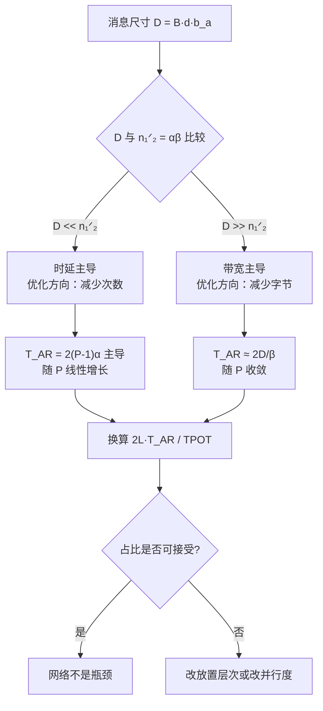
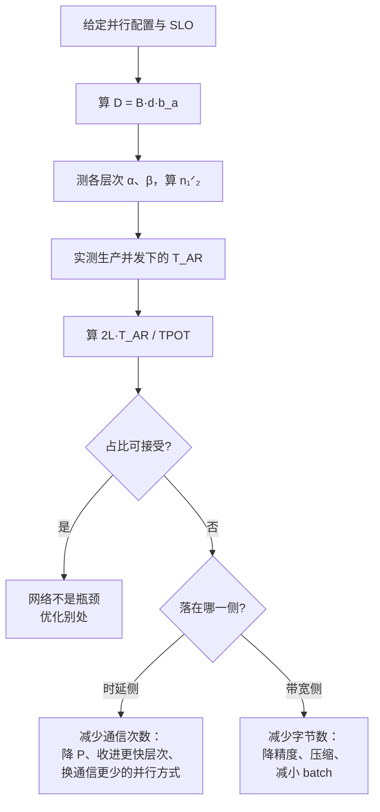

# 推理网络总览：从 die-to-die 到跨数据中心

> 位置：[InferenceAtlas](../../INDEX.md) > [模块 08](README.md) > 当前文档
> 信息截至：2026-07-31 ｜ 最后核验：2026-07-31 ｜ 内容版本：v0.1
> 时效性等级：低（结构与数学部分）
> 相关主题：[分布式推理总览](../06_distributed_and_moe_inference/01_distributed_inference_overview.md)｜[张量并行](../06_distributed_and_moe_inference/02_tensor_parallel_inference.md)｜[多节点部署拓扑](../06_distributed_and_moe_inference/09_multi_node_serving_topologies.md)

## 本章导读

本模块的核心问题只有一个：**什么时候网络是瓶颈，什么时候不是**。

这个问题在训练与推理中的答案不同，
而多数关于「AI 网络」的讨论是围绕训练展开的。
**训练的集合通信是大消息、可与计算重叠、且每个 step 才发生一次**；
**推理 decode 的集合通信是小消息、在关键路径上、且每层每 token 都要发生一次**。
两者对网络的要求分别落在带宽与时延上，
**因此为训练优化的网络未必适合推理，反之亦然**。

本章建立三样东西：
互连层次的划分方式、
把网络代价换算成 token 时延的方法、
以及判断瓶颈位置的判据。
**后续各章是这三样东西在具体技术上的展开**。

**关于本章数字的说明**：
本章出现的全部链路参数（时延、带宽）
**都是为演示推导而设定的假设值，不对应任何具体产品**。
受当前环境的网络出口策略限制（详见 [AGENTS.md 第 11 节](../../AGENTS.md)），
本库无法核验任何厂商规格或标准文本，
**因此本章不引用任何外部数据，也不给出任何产品的具体指标**。
读者应把自己平台的实测值代入同样的算式——**算式与数值无关**。

## 学习目标

读完本章后，读者应能够：

1. 按「时延下界、带宽、故障域」而不是按产品名称划分互连层次
2. 用 $\alpha$-$\beta$ 模型算出一条链路的半功率消息尺寸，并判断给定负载落在时延侧还是带宽侧
3. 把每层每 token 的集合通信换算成占 TPOT 预算的百分比
4. 说明推理与训练对网络要求的差别，并解释为什么它导致不同的设计取向
5. 正确区分 Gb/s 与 GB/s，并说明线速与有效吞吐的差距来自哪里

## 核心结论

- **判断瓶颈的唯一可靠方法是把通信时间换算成 TPOT 的百分比**，而不是比较链路速率。
- **decode 的 TP 消息尺寸是 $B d b_a$，与并行度 $P$ 无关**：它由 batch 与隐藏维决定，通常落在几十 KiB 到几 MiB。
- **半功率消息尺寸 $n_{1/2} = \alpha\beta$ 决定了一条链路对给定负载是「时延型」还是「带宽型」**；同一条链路对 prefill 和 decode 可以给出不同的答案。
- **同一份并行配置，放在节点内与跨节点上，通信占 TPOT 的比例可以相差数倍**——本章的算例是 17.6% 对 70.7%。
- **推理网络的设计目标是小消息的时延与抖动，训练是大消息的带宽**；这两个目标在拓扑与拥塞控制上会导出不同选择。
- **Gb/s 与 GB/s 相差 8 倍**，且线速与有效吞吐之间还有编码与协议开销；混用是本领域最常见的口径错误。

## 1. 问题定义、系统边界与工作负载

### 1.1 互连层次

**按产品名称划分层次是不稳定的**，因为产品会变。
本库按**两个物理量加一个组织属性**划分：

| 层次 | 典型跨度 | 时延量级 | 带宽量级 | 故障域 |
|---|---|---|---|---|
| on-package / die-to-die | 毫米 | 亚微秒 | 最高 | 单封装 |
| board / scale-up 域 | 厘米–米 | 微秒 | 高 | 单节点或单机架内的一致域 |
| 节点间 / scale-out | 米–百米 | 数微秒–数十微秒 | 中 | 集群 |
| 数据中心内 | 百米–公里 | 数十微秒 | 中 | 站点 |
| 跨数据中心 | 公里以上 | 毫秒 | 低 | 跨站点 |

**这张表刻意不填具体数值**：
数值随代际变化，而**层次之间的数量级关系是稳定的**，
后者才是做设计判断时真正用到的东西。

**三个属性各自决定不同的事**：

| 属性 | 决定什么 |
|---|---|
| 时延下界 $\alpha$ | 小消息的代价；decode 关键路径的主导项 |
| 带宽 $\beta$ | 大消息的代价；prefill 与 KV 传输的主导项 |
| 故障域 | 一次故障会带走多少设备；见 [模块 06 第 9 章](../06_distributed_and_moe_inference/09_multi_node_serving_topologies.md) |

### 1.2 推理向网络提出的请求

推理系统产生的网络流量可以完全归入五类，
**每一类的消息尺寸与所在路径都不同**：

| 流量类型 | 触发频率 | 消息尺寸 | 是否在关键路径 | 来源 |
|---|---|---|---|---|
| TP 集合通信 | 每层每 token | $B d b_a$ | **是** | [模块 06 第 2 章](../06_distributed_and_moe_inference/02_tensor_parallel_inference.md) |
| PP 激活传递 | 每 stage 边界每 micro-batch | $B d b_a$ | 是（但可与计算重叠） | [模块 06 第 3 章](../06_distributed_and_moe_inference/03_pipeline_parallel_inference.md) |
| MoE all-to-all | 每 MoE 层每 token | 与被路由 token 数成正比 | **是** | [模块 06 第 6 章](../06_distributed_and_moe_inference/06_moe_routing_all_to_all_and_load_balancing.md) |
| KV 传输（PD 分离） | 每请求一次 | 与 prompt 长度成正比 | 部分（见下） | [模块 06 第 8 章](../06_distributed_and_moe_inference/08_kv_cache_transfer_and_remote_memory.md) |
| 控制面与观测 | 持续 | 小 | 否 | [模块 11 第 7 章](../11_benchmarking_reliability_and_observability/07_observability_metrics_logs_traces.md) |

**第四行的「部分」需要解释**：
KV 传输在 prefill 之后、decode 之前发生，
所以它落在 TTFT 上而不是 TPOT 上；
**且当 prefix cache 命中率高时，prefill 变短而传输量不变，传输占比反而上升**
（见 [模块 06 第 7 章](../06_distributed_and_moe_inference/07_prefill_decode_disaggregation.md)）。

### 1.3 与训练的差别

**这是本模块最重要的一节，因为它决定了后续所有取舍的方向**。

| | 训练 | 推理 decode |
|---|---|---|
| 集合通信频率 | 每 step 一次（梯度） | **每层每 token 两次** |
| 单次消息尺寸 | 与参数量成正比，很大 | $B d b_a$，通常小得多 |
| 能否与计算重叠 | 大部分可以 | **TP 的两次 all-reduce 是同步点，不能** |
| 主导代价 | 带宽 | **时延与抖动** |
| 对尾部的敏感度 | 低（step 时间取最大值，但 step 很长） | **高（每 token 都取最大值）** |
| 优化目标 | 总吞吐 | **每 token 的稳定上界** |

**倒数第二行是推理网络最容易被低估的地方**：
一次集合通信取所有参与者中最慢的一个，
而 decode 每个 token 每层都要做两次。
**单次通信 1% 的异常率，在 80 层 × 2 次的放大下，
会使约 80% 的 token 至少碰上一次**——
这一点在第 2.6 节量化。

## 2. 原理、数学与性能模型

### 2.1 $\alpha$-$\beta$ 模型

一次点对点传输的时间用两参数模型描述：

$$T(n) = \alpha + \frac{n}{\beta}$$

其中 $\alpha$ 是与消息大小无关的固定开销（链路时延、协议栈、同步），
$\beta$ 是渐近带宽，$n$ 是字节数。

**这个模型的价值在于它把「链路快不快」这个含混的问题拆成了两个可分别测量的量**。

### 2.2 半功率消息尺寸

令固定开销与传输时间相等，得到

$$\boxed{n_{1/2} = \alpha \beta}$$

**它的含义**：传输 $n_{1/2}$ 字节时，一半时间花在固定开销上。

| $n \ll n_{1/2}$ | $n \approx n_{1/2}$ | $n \gg n_{1/2}$ |
|---|---|---|
| **时延主导** | 两者相当 | **带宽主导** |
| 增大带宽几乎无用 | 都有用 | 降低时延几乎无用 |
| 应减少消息**次数** | — | 应减少消息**字节数** |

**这张表直接给出了优化方向**：
在时延侧做压缩是徒劳的，在带宽侧做批合并是徒劳的。
**先定位再优化**——与 [模块 10 第 9 章](../10_edge_and_on_device_inference/09_edge_deployment_case_studies.md) 案例三是同一条纪律。

**算例（假设值）**：

| 层次（假设参数） | $\alpha$ | $\beta$ | $n_{1/2}$ |
|---|---:|---:|---:|
| 节点内 scale-up | 1.5 μs | 900 GB/s | 1,318 KiB |
| 节点内次级路径 | 2.5 μs | 450 GB/s | 1,099 KiB |
| 节点间 RDMA | 5 μs | 50 GB/s | 244 KiB |
| 跨数据中心 | 100 μs | 12.5 GB/s | 1,221 KiB |

**注意一个反直觉的现象**：
节点内 scale-up 的 $n_{1/2}$ 比节点间 RDMA **更大**。
这不是错误——**$n_{1/2}$ 衡量的是「这条链路对多大的消息才算发挥出带宽」，而不是链路的好坏**。
高带宽链路需要更大的消息才能摊薄固定开销。
**所以「换更快的链路」在小消息上可能完全不起作用**，这正是本模块反复要说的事。

### 2.3 decode 的 TP 消息尺寸

由 [模块 06 第 2 章](../06_distributed_and_moe_inference/02_tensor_parallel_inference.md)，
配对切法下每层两次 all-reduce，单次的数据量是

$$D = B \, d \, b_a$$

**关键性质是它与 $P$ 无关**：
增加张量并行度不改变单次消息的字节数，只改变参与者数量。

| $B$ | $d = 4096$ | $d = 8192$ |
|---:|---:|---:|
| 1 | 8 KiB | 16 KiB |
| 8 | 64 KiB | 128 KiB |
| 32 | 256 KiB | 512 KiB |
| 128 | 1,024 KiB | 2,048 KiB |

**把这张表与第 2.2 节的 $n_{1/2}$ 对照，就得到了本章的核心判断**：

- 小 batch decode（$B \le 8$）的消息是**几十到一百多 KiB**，
  远小于所有层次的 $n_{1/2}$ → **时延主导**；
- 大 batch 或 prefill 的消息可达 MiB 级 → **进入带宽主导区**。

**同一套硬件、同一份并行配置，在 decode 和 prefill 上落在 roofline 的两侧**——
这与 [模块 10 第 9 章](../10_edge_and_on_device_inference/09_edge_deployment_case_studies.md) 案例三中
「按阶段而非按算子切分」的结论同源。

### 2.4 环状 all-reduce 的代价

$P$ 个参与者的环状 all-reduce 分 reduce-scatter 与 all-gather 两轮，
共 $2(P-1)$ 步，每步传 $D/P$ 字节：

$$T_{\text{AR}}(D, P) = 2(P-1)\alpha + \frac{2(P-1)}{P}\cdot\frac{D}{\beta}$$

**两项的行为完全不同**：

- 时延项 $2(P-1)\alpha$ **随 $P$ 线性增长**，无上界；
- 带宽项的系数 $\frac{2(P-1)}{P} \to 2$，**随 $P$ 收敛**。

**所以在时延主导区，扩大 $P$ 的代价是线性的**；
这是 TP 度数不能无限增大的网络侧原因
（显存侧与计算侧的原因见 [模块 06 第 2 章](../06_distributed_and_moe_inference/02_tensor_parallel_inference.md)）。

**算例**（$D = 512$ KiB，即 $B=32$、$d=8192$、fp16；链路参数取第 2.2 节的假设值）：

| $P$ | 节点内 scale-up | 节点间 RDMA |
|---:|---:|---:|
| 2 | 3.6 μs | 20.5 μs |
| 4 | 9.9 μs | 45.7 μs |
| 8 | 22.0 μs | 88.4 μs |

### 2.5 换算成 TPOT 百分比

**这是本章唯一真正要记住的操作**。
$L$ 层、每层 2 次 all-reduce，每 token 的通信时间为

$$T_{\text{comm/token}} = 2L \cdot T_{\text{AR}}(D, P)$$

占 TPOT 预算的比例即 $T_{\text{comm/token}} / \text{TPOT}$。

**算例**（$L = 80$、$P = 8$、$D = 512$ KiB，假设值）：

| 放置方式 | 单次 all-reduce | 每 token 通信 | 占 20 ms TPOT | 占 40 ms TPOT |
|---|---:|---:|---:|---:|
| 单节点内（scale-up） | 22.0 μs | 3.52 ms | **17.6%** | 8.8% |
| 跨节点（RDMA） | 88.4 μs | 14.14 ms | **70.7%** | 35.3% |

**同一份并行配置，仅因为放置跨越了层次边界，通信占比从 17.6% 变成 70.7%**。
这就是 [模块 06 第 9 章](../06_distributed_and_moe_inference/09_multi_node_serving_topologies.md)
「TP 优先放在最快的层次内」这条放置原则的定量依据。

**这张表也说明了 TPOT 目标的作用**：
同样是跨节点，20 ms 目标下网络吃掉 70.7% 而 40 ms 下只有 35.3%。
**「网络够不够快」不是一个能脱离 SLO 回答的问题**。

**图解读**：

1. **本图展示什么**：从消息尺寸到「网络是不是瓶颈」的完整判定链。
   **入口是 $D = B d b_a$ 而不是链路速率**——
   因为同一条链路对不同的 $D$ 给出不同的答案。
2. **核心瓶颈**：瓶颈的位置由 $D$ 与 $n_{1/2}$ 的关系决定，
   **而不是由链路的绝对性能决定**。
   在时延侧，$2(P-1)\alpha$ 随 $P$ 线性增长且没有上界，
   **这是整条链上唯一一个不收敛的项**，也因此是设计中最需要约束的量。
3. **图中的 trade-off**：增大 $P$ 换来的是每卡显存与计算量的下降，
   付出的是线性增长的时延项。
   **在带宽主导区这个取舍是划算的（系数收敛到 2），在时延主导区不是**——
   而 decode 恰恰在时延主导区。
4. **面试如何引用**：可以说
   「我不会直接比较链路速率，
   我会先算 $D = B d b_a$ 和 $n_{1/2} = \alpha\beta$ 判断落在哪一侧，
   再把 $2L \cdot T_{\text{AR}}$ 换算成 TPOT 的百分比；
   **同一份配置放在节点内还是跨节点，这个百分比可以差 4 倍**，
   这就是 TP 必须收在最快层次内的定量理由」。

### 2.6 抖动的放大

一次集合通信取所有参与者中最慢的一个。
设单次通信超出正常值的概率为 $p$（相互独立），
则一个 token 的 $2L$ 次通信中**至少碰上一次**的概率为

$$P_{\text{hit}} = 1 - (1-p)^{2L}$$

| $p$ | $L=80$ 时 $P_{\text{hit}}$ |
|---:|---:|
| $10^{-4}$ | 1.6% |
| $10^{-3}$ | 14.8% |
| $10^{-2}$ | 79.9% |

**万分之一的抖动率，在 160 次通信的放大下变成百分之 1.6**；
**千分之一变成近 15%**。
这解释了为什么推理网络对尾部的要求比直觉严格得多：
**要让 P99 的 token 不受影响，单次通信的异常率必须低于约 $10^{-4}$**。

**独立性假设通常是乐观的**：
真实的抖动源（拥塞、邻居干扰、重传）具有时间相关性，
**会同时影响相邻的多次通信**。
相关性使 $P_{\text{hit}}$ 低于上表，但也使**受影响的 token 聚集出现**，
后者对用户体验更差。**这一点应实测而非假设**。

## 3. 实现机制与系统设计

### 3.1 各并行维度对网络层次的要求

把第 1.2 节的流量类型与第 1.1 节的层次对上，得到放置的优先级：

| 并行维度 | 消息尺寸 | 频率 | 要求的层次 | 理由 |
|---|---|---|---|---|
| TP | 小（$Bdb_a$） | **每层每 token** | **最快的一层** | 时延主导且在关键路径 |
| EP（MoE） | 中 | 每 MoE 层每 token | 次快 | all-to-all，见第 3.2 节 |
| PP | 小 | 每 stage 边界 | 可跨节点 | 次数少且可与计算重叠 |
| DP / 副本 | 无跨副本通信 | — | 任意 | 副本之间不通信 |
| KV 传输 | 大 | 每请求 | 带宽优先 | 落在 TTFT 而非 TPOT |

**最后一行值得强调**：
KV 传输是本表中唯一的**带宽主导**流量，
因此它对网络的要求与 TP 恰好相反。
**一个同时承载两者的网络需要在两个方向上都合格**，
而这两个方向的优化手段互相冲突（见第 4 节）。

### 3.2 all-to-all 与 all-reduce 的差别

MoE 的 all-to-all 与 TP 的 all-reduce 在网络上不是同一类负载：

| | all-reduce | all-to-all |
|---|---|---|
| 每对参与者之间 | 环状：只与邻居通信 | **所有对之间都有流量** |
| 对拓扑的要求 | 一条环即可 | **需要全局二分带宽** |
| 消息尺寸 | $D/P$ | $D/P^2$，**更小** |
| 消息数量 | $2(P-1)$ | $P(P-1)$，**更多** |
| 对不均衡的敏感度 | 低 | **高**（路由不均导致热点） |

**第三、四行合起来说明了 all-to-all 更靠近时延侧**：
消息更小、更多。
**这使 MoE 的专家并行对网络时延比 TP 更敏感**，
且路由不均衡会把负载集中到少数链路上——
见 [模块 06 第 6 章](../06_distributed_and_moe_inference/06_moe_routing_all_to_all_and_load_balancing.md)
关于 $\sigma_{\text{stat}}$ 的分析。

### 3.3 单位与口径纪律

**这是本模块的强制要求，因为它是本领域最高频的错误来源**。

| 量 | 单位 | 说明 |
|---|---|---|
| 网络链路速率 | **Gb/s、Tb/s**（比特） | 以太网、InfiniBand 的标称速率一律是比特 |
| 内存与互连带宽 | **GB/s、TB/s**（字节） | HBM、scale-up 互连一律是字节 |
| 换算 | 1 Gb/s = 0.125 GB/s | **相差 8 倍** |

| 标称线速 | 字节口径 |
|---:|---:|
| 100 Gb/s | 12.5 GB/s |
| 200 Gb/s | 25 GB/s |
| 400 Gb/s | 50 GB/s |
| 800 Gb/s | 100 GB/s |

**上表是线速，不是可用吞吐**。三层折扣依次作用：

1. **编码开销**：物理层编码占用一部分线速；
2. **协议开销**：包头、ACK、重传；
3. **有效载荷比**：小消息的头部占比更高——
   **这与第 2.2 节是同一件事的两种表述**。

**因此报告网络性能时必须说明是哪一层的数字**，
否则同一条链路可以合法地报出相差可观的多个值。
这与 [模块 11 第 1 章](../11_benchmarking_reliability_and_observability/01_inference_benchmarking_methodology.md)
关于口径一致性的要求是同一条纪律。

### 3.4 测量方法

**要判断网络是不是瓶颈，需要的不是链路速率，而是三个可测量**：

| 测量 | 方法 | 用途 |
|---|---|---|
| $\alpha$ | 最小消息的往返时间 | 时延项 |
| $\beta$ | 大消息的渐近吞吐 | 带宽项 |
| 单次集合通信耗时 | 在**生产并行度与生产消息尺寸下**测 | 直接代入第 2.5 节 |

**第三行不能用前两行推出来就完事**：
$\alpha$-$\beta$ 模型是近似，
真实的集合通信还受实现、拓扑映射与并发流量影响。
**模型用来定位方向，实测用来定量**。

**最关键的一项是「在生产并发下测」**：
空载时测出的时延与满载时可以相差很多，
而 decode 的通信恰恰发生在系统繁忙的时候。
**这与 [模块 10 第 5 章](../10_edge_and_on_device_inference/05_automotive_robotics_and_embedded_inference.md)
的共存验证要求是同一条原则**。

## 4. 性能、成本、能耗与可靠性 trade-off

### 4.1 时延与带宽的取舍

**多数网络设计选择在这两者之间是对立的**：

| 手段 | 有利于 | 不利于 |
|---|---|---|
| 增大 MTU / 消息聚合 | 带宽（摊薄头部） | 时延（等待聚合） |
| 更深的缓冲 | 吞吐（吸收突发） | **尾部时延（排队）** |
| 更激进的拥塞控制 | 尾部时延 | 平均吞吐 |
| 增大并行度 $P$ | 每卡显存与计算 | **时延项 $2(P-1)\alpha$** |
| 更高基数的交换 | 跳数（时延） | 单端口带宽或成本 |

**第二行是推理网络与训练网络分歧最大的一处**：
训练欢迎深缓冲，因为它提高吞吐且 step 时间本来就长；
**推理不欢迎，因为缓冲里的排队直接变成 token 时延的尾部**。
这一条在 [第 10 章](README.md) 展开。

### 4.2 成本方向

**网络成本的主要驱动不是链路速率，而是层次边界的数量**：

| 决策 | 对成本 | 对性能 |
|---|---|---|
| 把 TP 收在单节点内 | 需要更大的单节点，单价高 | **通信占比大幅下降**（17.6% vs 70.7%） |
| 允许 TP 跨节点 | 节点更便宜、更灵活 | 通信占比上升，可能需要放宽 TPOT |
| 增大 scale-up 域 | 成本随域大小超线性上升 | 更大的模型可以不跨层次 |

**这张表说明了为什么 scale-up 域的大小是一个重要的架构参数**：
它决定了「多大的模型可以不付跨层次代价」。
定量的决策框架见 [第 6 章](README.md)。

### 4.3 可靠性

| 层次 | 一次故障影响 | 恢复方式 |
|---|---|---|
| 链路 | 该链路上的流量 | 多路径重路由 |
| 交换机 | 其下所有节点 | 拓扑冗余 |
| scale-up 域内互连 | **整个域不可用** | 域即故障域，需整域替换 |

**第三行是 scale-up 与 scale-out 在可靠性上的根本差别**：
**scale-up 域越大，单次故障带走的容量越多**。
可用性 $a^n$ 与容错利用率上界 $(R-1)/R$ 的分析见
[模块 09 第 7 章](../09_datacenter_power_thermal_and_operations/07_reliability_redundancy_and_maintenance.md)
与 [模块 06 第 10 章](../06_distributed_and_moe_inference/10_fault_tolerance_and_graceful_degradation.md)。

## 5. benchmark、真实案例或公开部署案例

**本章不给出任何产品、标准或厂商的具体指标**。

受当前环境的网络出口策略限制（详见 [AGENTS.md 第 11 节](../../AGENTS.md)），
本库无法访问标准组织文本或厂商文档，**因此无法核验任何一项**。
本章第 2 节的链路参数均为演示用假设值，已在导读中声明。

**读者应在自己平台上完成的测量**：

| 项 | 你的值 | 方法 | 披露标签 |
|---|---|---|---|
| 各层次的 $\alpha$ | 待填 | 最小消息往返 | `独立可复现实验` |
| 各层次的 $\beta$ | 待填 | 大消息渐近吞吐 | `独立可复现实验` |
| $n_{1/2} = \alpha\beta$ | 待填 | 由上两行算出 | 推出 |
| 生产 $B$、$d$、$b_a$ | 待填 | 配置 | `开源代码/配置披露` |
| $D = B d b_a$ | 待填 | 由上行算出 | 推出 |
| **$D$ 落在时延侧还是带宽侧** | 待填 | **与 $n_{1/2}$ 比较** | 推出 |
| 生产并行度 $P$ 与层数 $L$ | 待填 | 配置 | `开源代码/配置披露` |
| **单次 all-reduce 实测耗时** | 待填 | **在生产并发下测，非空载** | `独立可复现实验` |
| **$2L \cdot T_{AR}$ 占 TPOT 的比例** | 待填 | **本章的核心判据** | 推出 |
| 单次通信的异常率 $p$ | 待填 | 长时间采样分布尾部 | `独立可复现实验` |
| 链路速率的单位口径 | Gb/s 或 GB/s | **明确写出** | `官方披露` |
| 线速与实测有效吞吐之比 | 待填 | 两者相除 | `独立可复现实验` |

**加粗的三行是本章的核心链条**：
判断落在哪一侧 → 实测单次耗时 → 换算成 TPOT 百分比。

> 测量方法论的通用要求见
> [推理 benchmark 方法论](../11_benchmarking_reliability_and_observability/01_inference_benchmarking_methodology.md)。

## 6. 设计决策框架

**图解读**：

1. **本图展示什么**：一条从配置到结论的判定流程，
   **终点有两个不同的优化方向，选哪个由瓶颈侧决定**。
2. **核心瓶颈**：流程的瓶颈在第三步——实测 $T_{\text{AR}}$。
   **前两步都可以在纸上完成，第三步不能**，
   因为 $\alpha$-$\beta$ 模型不含实现与并发流量的影响。
   跳过这一步会得到一个系统性偏乐观的估计。
3. **图中的 trade-off**：两条出口分支的手段互相不通用——
   **在时延侧做压缩、在带宽侧做批合并，都是白费力气**。
   把方向搞反的代价不是收益小，而是零。
4. **面试如何引用**：可以说
   「判断网络是否瓶颈我会走四步：
   算消息尺寸、测 $\alpha$/$\beta$、在生产并发下实测集合通信、换算成 TPOT 百分比；
   **只有最后一个数能回答问题**，
   而优化方向由 $D$ 与 $n_{1/2}$ 的关系决定」。

**判定标准**：

| 条件 | 判断 |
|---|---|
| $2L \cdot T_{\text{AR}} / \text{TPOT} < 10\%$ | 网络不是瓶颈，优化别处 |
| 10%–30% | 值得优化，但不是首要矛盾 |
| $> 30\%$ | **首要矛盾**，优先改放置或并行度 |
| 空载与满载实测差距大 | **拥塞问题**，见 [第 10 章](README.md) |
| 异常率 $p > 10^{-4}$ | **尾部问题**，$P_{\text{hit}}$ 已不可忽略 |

**这些阈值是本库为便于判断而设的分界，不是任何标准的规定**。

## 7. 常见失败模式与排查路径

| 症状 | 首先怀疑 | 检查 |
|---|---|---|
| 换了更快的链路但 TPOT 没变 | 负载在时延侧 | $D$ 与 $n_{1/2}$ 比较 |
| 增大 TP 度数后 TPOT 上升 | 时延项 $2(P-1)\alpha$ | 按第 2.4 节分解两项 |
| 空载测试很好、上线后差 | 拥塞或并发干扰 | 在生产并发下重测 |
| TPOT 中位数正常但 P99 差 | 单次通信异常率 | 按第 2.6 节算 $P_{\text{hit}}$ |
| 同样配置换个机器就变慢 | 放置跨越了层次边界 | 拓扑发现与实际映射 |
| 报告的带宽数字对不上 | Gb/s 与 GB/s 混用 | 第 3.3 节的口径检查 |
| MoE 比 TP 更受网络影响 | all-to-all 消息更小更多 | 第 3.2 节 |
| prefix cache 命中率提高后 TTFT 占比变差 | KV 传输占比上升 | [模块 06 第 7 章](../06_distributed_and_moe_inference/07_prefill_decode_disaggregation.md) |

**倒数第一行是一个典型的反直觉现象**：
缓存命中率提高本身是好事，
**但它缩短的是 prefill 而不是传输，所以传输在 TTFT 中的占比必然上升**。
把它误判为「缓存导致变慢」是常见的归因错误。

## 8. 关联面试主题

- 「什么时候网络是推理的瓶颈」→ [模块 17 系统设计题](../17_interview_prep/01_inference_system_design.md)
- TP 通信量与 $P$ 无关的推导 → [模块 17 分布式与 MoE 题](../17_interview_prep/05_distributed_and_moe_questions.md)
- 尾部时延与抖动放大 → [模块 17 调试与 benchmark 题](../17_interview_prep/07_debug_benchmark_and_reliability_questions.md)
- scale-up 与 scale-out 的取舍 → [模块 17 硬件与数据中心题](../17_interview_prep/06_hardware_and_datacenter_questions.md)

## 9. 小结

**本章要回答的问题是「网络什么时候是瓶颈」，答案是一个可以算出来的百分比**：

$$\frac{2L \cdot T_{\text{AR}}(D, P)}{\text{TPOT}}$$

得到这个数需要四步，**每一步都不能跳过**：

1. **算消息尺寸** $D = B d b_a$——注意它与 $P$ 无关；
2. **测 $\alpha$ 与 $\beta$**，算半功率尺寸 $n_{1/2} = \alpha\beta$，判断落在哪一侧；
3. **在生产并发下实测**单次集合通信耗时——模型定方向，实测定量；
4. **换算成 TPOT 百分比**——只有这个数能回答问题。

**三个容易被跳过的要点**：

- **时延项 $2(P-1)\alpha$ 随 $P$ 线性增长且不收敛**，
  而带宽项的系数收敛到 2。**这是 TP 度数受限的网络侧原因**。
- **抖动被 $2L$ 次通信放大**：$10^{-3}$ 的单次异常率在 80 层下变成近 15% 的 token 受影响。
- **推理与训练对网络的要求方向不同**——
  小消息时延对大消息带宽，
  因此深缓冲、大 MTU 这些对训练有利的选择对推理未必有利。

**最后一条是本模块后续各章的主线**：
每讨论一项技术，都要问它是在优化时延还是带宽，
**以及它在推理的哪个阶段起作用**。

## 关键术语

| 中文术语 | 英文 | 定义 | 单位/口径 | 关联文档 |
|---|---|---|---|---|
| $\alpha$-$\beta$ 模型 | alpha-beta model | $T(n)=\alpha+n/\beta$，把传输拆为固定开销与带宽项 | — | 本章 2.1 |
| 半功率消息尺寸 | half-power message size | $n_{1/2}=\alpha\beta$，固定开销与传输时间相等的尺寸 | 字节 | 本章 2.2 |
| 时延主导 | latency-bound | $n \ll n_{1/2}$，应减少通信次数 | — | 本章 2.2 |
| 带宽主导 | bandwidth-bound | $n \gg n_{1/2}$，应减少通信字节 | — | 本章 2.2 |
| 环状 all-reduce | ring all-reduce | $2(P-1)$ 步的集合通信，时延项随 $P$ 线性增长 | — | 本章 2.4 |
| scale-up 域 | scale-up domain | 以高带宽低时延互连成一致域的设备集合；也是故障域 | 设备数 | 本章 1.1、4.3 |
| 抖动放大 | jitter amplification | $1-(1-p)^{2L}$，单次异常率经多次通信的放大 | — | 本章 2.6 |
| 线速 | line rate | 物理层标称速率，未扣除编码与协议开销 | Gb/s | 本章 3.3 |

## 延伸阅读

- [分布式推理总览](../06_distributed_and_moe_inference/01_distributed_inference_overview.md)
- [张量并行推理](../06_distributed_and_moe_inference/02_tensor_parallel_inference.md)
- [MoE 路由与 all-to-all](../06_distributed_and_moe_inference/06_moe_routing_all_to_all_and_load_balancing.md)
- [多节点部署拓扑](../06_distributed_and_moe_inference/09_multi_node_serving_topologies.md)
- [推理 benchmark 方法论](../11_benchmarking_reliability_and_observability/01_inference_benchmarking_methodology.md)

## 主要来源

本章由 $\alpha$-$\beta$ 传输模型、环状集合通信的标准代价公式、
以及 [模块 06](../06_distributed_and_moe_inference/) 已建立的并行通信量结论推导而成。

**不含任何产品、标准或厂商的具体指标**。
受当前环境的网络出口策略限制，本库无法访问标准组织文本或厂商文档
（详见 [AGENTS.md 第 11 节](../../AGENTS.md)）。

| 类别 | 说明 | 披露标签 |
|---|---|---|
| $\alpha$-$\beta$ 模型与 $n_{1/2}$ | 由定义推出 | — |
| 环状 all-reduce 代价公式 | 标准结果，由算法结构推出 | — |
| $D = B d b_a$ | 见 [模块 06 第 2 章](../06_distributed_and_moe_inference/02_tensor_parallel_inference.md) 的推导 | — |
| 第 2 节各算例的链路参数 | **为演示设定的假设值，不对应任何产品** | — |
| 第 6 节的百分比阈值 | **本库为便于判断而设的分界，非标准规定** | — |
| 读者自身平台的测量 | 应自行实测 | `独立可复现实验` |
| 任何产品规格与标准文本 | **本章未给出** | `待核实` |

## 更新记录

| 日期 | 版本 | 变更 | 核验人 |
|---|---|---|---|
| 2026-07-31 | v0.1 | 初稿：互连层次划分、$\alpha$-$\beta$ 与半功率尺寸、环状 all-reduce 代价、TPOT 百分比换算、抖动放大、单位口径纪律 | — |
