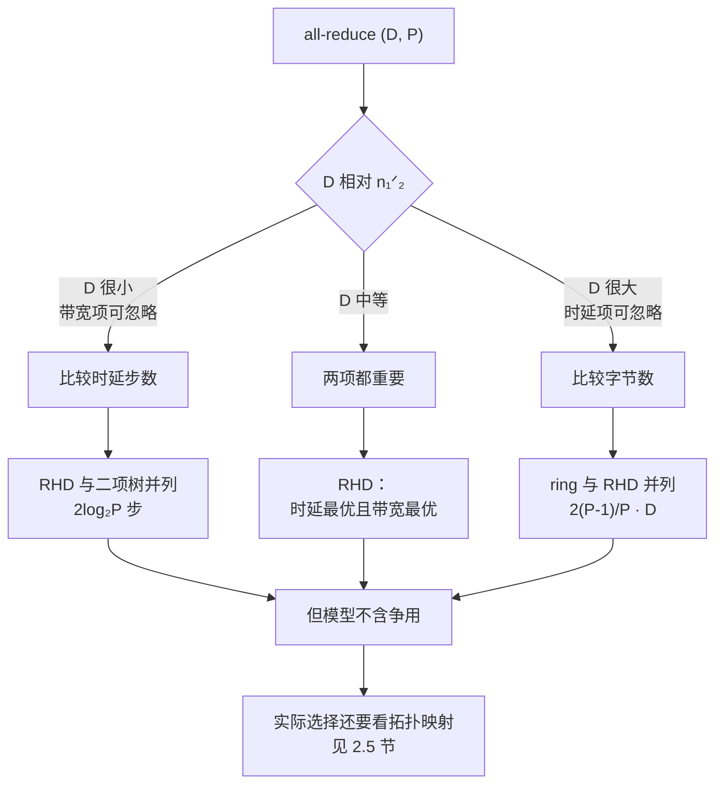
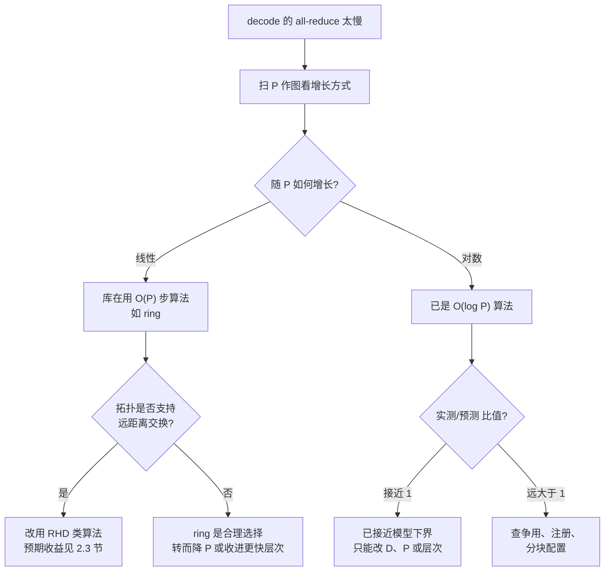

# 集合通信、RDMA 与通信库

> 位置：[InferenceAtlas](../../INDEX.md) > [模块 08](README.md) > 当前文档
> 信息截至：2026-07-31 ｜ 最后核验：2026-07-31 ｜ 内容版本：v0.1
> 时效性等级：低（算法与数学部分）
> 相关主题：[推理网络总览](01_inference_networking_overview.md)｜[张量并行](../06_distributed_and_moe_inference/02_tensor_parallel_inference.md)｜[MoE 路由与 all-to-all](../06_distributed_and_moe_inference/06_moe_routing_all_to_all_and_load_balancing.md)

## 本章导读

[第 1 章](01_inference_networking_overview.md) 留下了一个未解决的问题：
环状 all-reduce 的时延项 $2(P-1)\alpha$ 随并行度**线性增长且无上界**，
而 decode 恰恰落在时延主导区。

**本章给出这个问题的算法侧答案**：
在同样的字节数下，存在只需 $2\log_2 P$ 步的算法。
在第 1 章的算例上，这把跨节点配置的通信占比从 **70.7% 降到 38.7%**——
**移动的字节数完全相同，差别只在通信的组织方式**。

但本章同时要说明**为什么这个更优的算法不是无条件更好**：
$\alpha$-$\beta$ 模型假设网络无争用，
而真实拓扑上不同算法的映射代价不同。
**这解释了为什么通信库要按消息尺寸与拓扑动态选择算法**，
而不是固定用某一种。

**关于本章数字的说明**：
全部链路参数沿用 [第 1 章第 2.2 节](01_inference_networking_overview.md) 的假设值，
**不对应任何具体产品**。
受当前环境的网络出口策略限制（详见 [AGENTS.md 第 11 节](../../AGENTS.md)），
本库无法核验厂商文档或库的实现细节，
**因此本章不点名任何具体通信库，也不给出任何产品的实测数字**。
本章讨论的是**算法与机制**，它们与实现无关。

## 学习目标

读完本章后，读者应能够：

1. 写出 ring、递归折半-倍增、二项树三种 all-reduce 的时延步数与字节数，并说明各自的适用区间
2. 解释为什么在 $\alpha$-$\beta$ 模型下递归折半-倍增支配 ring，以及为什么实践中 ring 仍被使用
3. 分解 $\alpha$ 的组成，说明 RDMA 与内核旁路各消除了其中哪一部分
4. 判断一次集合通信能否与计算重叠，并说明 TP 的两次 all-reduce 为什么不能
5. 识别内存注册与消息尺寸切换带来的两类典型性能陷阱

## 核心结论

- **递归折半-倍增的字节数与 ring 完全相同，但时延步数从 $2(P-1)$ 降到 $2\log_2 P$**：$P=32$ 时步数相差 6.2 倍。
- **二项树的时延步数与递归折半-倍增相同，但字节数是它的数倍**（$P=8$ 时 3.4 倍）：它只在极小消息上有意义。
- **算法选择必须按消息尺寸切换**，因为三种算法在时延项与带宽项上的排序不同。
- **$\alpha$-$\beta$ 模型不含争用**，因此它给出的「最优算法」在具体拓扑上未必最优——ring 的优势在于只用最近邻链路且能同时用满所有链路。
- **RDMA 与内核旁路消除的是 $\alpha$ 中的软件部分，不是线缆时延**；因此它们的收益上限由 $\alpha$ 的组成决定。
- **内存注册是一次性的高成本操作**，把它放在关键路径上是 KV 传输最常见的性能错误。

## 1. 问题定义、系统边界与工作负载

### 1.1 推理实际用到的集合操作

集合通信的操作种类很多，**但推理只密集使用其中少数几个**：

| 操作 | 语义 | 推理中的来源 | 频率 |
|---|---|---|---|
| all-reduce | 各方数据求和后所有方获得结果 | **TP 的每层两次** | 最高 |
| all-to-all | 每方向每方发送不同数据 | **MoE 的专家路由** | 高（MoE 模型） |
| all-gather | 各方分片拼成完整结果 | 部分 TP 变体、序列并行 | 中 |
| reduce-scatter | 求和后各方保留一个分片 | all-reduce 的前半 | 中 |
| point-to-point | 一对一发送 | **PP 的 stage 边界、KV 传输** | 中 |
| broadcast | 一方发给所有方 | 权重加载、控制面 | 低（不在关键路径） |

**前两行占据了推理关键路径上几乎全部的通信时间**，
因此本章的分析集中在它们身上。

### 1.2 为什么 all-reduce 值得单独优化

由 [第 1 章第 2.5 节](01_inference_networking_overview.md)，
每 token 的通信时间是 $2L \cdot T_{\text{AR}}$。
$L$ 通常是几十到上百，**所以单次 all-reduce 的任何改进都被放大 $2L$ 倍**。

**这个放大倍数是本章的全部动机**：
把单次通信从 88.4 μs 降到 48.4 μs 听起来只省了 40 μs，
但在 $L=80$ 下它是每 token 6.4 ms，
**在 20 ms 的 TPOT 预算里占 32 个百分点**。

## 2. 原理、数学与性能模型

### 2.1 三种 all-reduce 算法

all-reduce 可以由不同的通信模式实现。三种代表性算法：

**环状（ring）**：分 reduce-scatter 与 all-gather 两轮，
每轮 $P-1$ 步，每步向下一个邻居发 $D/P$ 字节。

**递归折半-倍增（recursive halving-doubling, RHD）**：
reduce-scatter 阶段按 $\log_2 P$ 步递归折半，
all-gather 阶段按 $\log_2 P$ 步递归倍增。
**每步的数据量逐步减半（或倍增），总量与 ring 相同**。

**二项树（binomial tree）**：先 reduce 到根，再从根 broadcast，
各 $\log_2 P$ 步，**但每步都传完整的 $D$**。

### 2.2 代价对比

| 算法 | 时延步数 | 每节点字节数 | $T_{\text{AR}}$ |
|---|---|---|---|
| ring | $2(P-1)$ | $\frac{2(P-1)}{P}D$ | $2(P-1)\alpha + \frac{2(P-1)}{P}\frac{D}{\beta}$ |
| RHD | $2\log_2 P$ | $\frac{2(P-1)}{P}D$ | $2\log_2 P \cdot \alpha + \frac{2(P-1)}{P}\frac{D}{\beta}$ |
| 二项树 | $2\log_2 P$ | $2\log_2 P \cdot D$ | $2\log_2 P\left(\alpha + \frac{D}{\beta}\right)$ |

**这张表是本章的核心，三行两两之间的关系都值得单独看**：

1. **ring 与 RHD 的带宽项完全相同**，时延项一个是 $O(P)$、一个是 $O(\log P)$。
   **在 $\alpha$-$\beta$ 模型下 RHD 对 $P>2$ 严格更优**。
2. **RHD 与二项树的时延项相同**，但二项树的字节数多 $\frac{2\log_2 P}{2(P-1)/P} = \frac{P\log_2 P}{P-1}$ 倍。
   **二项树只在 $D$ 极小、带宽项可忽略时才有意义**。
3. **ring 的带宽系数 $\frac{2(P-1)}{P} < 2$ 是所有算法的下界**，
   RHD 达到同一下界——**两者都是带宽最优的**。

**时延步数对比**：

| $P$ | ring：$2(P-1)$ | RHD：$2\log_2 P$ | 比值 |
|---:|---:|---:|---:|
| 2 | 2 | 2 | 1.0× |
| 4 | 6 | 4 | 1.5× |
| 8 | 14 | 6 | 2.3× |
| 16 | 30 | 8 | 3.8× |
| 32 | 62 | 10 | 6.2× |
| 64 | 126 | 12 | 10.5× |

**差距随 $P$ 迅速拉开**，这正是 [第 1 章](01_inference_networking_overview.md) 指出的
「时延项不收敛」问题的直接后果。

### 2.3 算例

沿用 [第 1 章](01_inference_networking_overview.md) 的假设参数，$D = 512$ KiB：

**节点内 scale-up**（$\alpha = 1.5$ μs，$\beta = 900$ GB/s）：

| $P$ | ring | RHD | 二项树 | ring/RHD |
|---:|---:|---:|---:|---:|
| 2 | 3.6 μs | 3.6 μs | 4.2 μs | 1.00× |
| 4 | 9.9 μs | 6.9 μs | 8.3 μs | 1.44× |
| 8 | 22.0 μs | 10.0 μs | 12.5 μs | 2.20× |
| 16 | 46.1 μs | 13.1 μs | 16.7 μs | 3.52× |
| 32 | 94.1 μs | 16.1 μs | 20.8 μs | 5.84× |

**节点间 RDMA**（$\alpha = 5$ μs，$\beta = 50$ GB/s）：

| $P$ | ring | RHD | 二项树 | ring/RHD |
|---:|---:|---:|---:|---:|
| 2 | 20.5 μs | 20.5 μs | 31.0 μs | 1.00× |
| 4 | 45.7 μs | 35.7 μs | 61.9 μs | 1.28× |
| 8 | 88.4 μs | 48.4 μs | 92.9 μs | 1.83× |
| 16 | 169.7 μs | 59.7 μs | 123.9 μs | 2.84× |
| 32 | 330.3 μs | 70.3 μs | 154.9 μs | 4.70× |

**注意二项树在节点间的表现**：$P=8$ 时它（92.9 μs）比 ring（88.4 μs）还差，
因为带宽项的劣势已经超过了时延项的优势。
**这印证了第 2.2 节的第 2 点：二项树的适用区间很窄**。

### 2.4 换算成 TPOT

把第 2.3 节代入 [第 1 章第 2.5 节](01_inference_networking_overview.md) 的换算
（$L=80$、$P=8$、节点间）：

| 算法 | 单次 | 每 token | 占 20 ms TPOT |
|---|---:|---:|---:|
| ring | 88.4 μs | 14.14 ms | **70.7%** |
| RHD | 48.4 μs | 7.74 ms | **38.7%** |

**移动的字节数完全相同，占比相差 32 个百分点**。
这是本章最重要的一个数字：
**它说明在时延主导区，通信的组织方式与链路本身同样重要**。

**图解读**：

1. **本图展示什么**：三种算法的适用区间由 $D$ 相对 $n_{1/2}$ 的位置划分。
   **RHD 在中间区间同时达到两个最优**，
   ring 只在大消息区并列，二项树只在小消息区并列。
2. **核心瓶颈**：瓶颈随区间移动——
   小消息区是时延步数，大消息区是字节数。
   **没有一个算法在所有区间都最优，这就是为什么必须按尺寸切换**。
3. **图中的 trade-off**：二项树用更多字节换更少步数，
   ring 用更多步数换最近邻的通信模式。
   **RHD 表面上不需要付出任何代价——但它的代价藏在模型之外**，
   即最后一个节点指出的拓扑映射。
4. **面试如何引用**：可以说
   「ring 和递归折半-倍增移动的字节数是一样的，
   都是 $\frac{2(P-1)}{P}D$，**这是带宽下界**；
   区别在时延步数，$2(P-1)$ 对 $2\log_2 P$，
   $P=32$ 时差 6 倍多。
   **所以在 decode 这种时延主导的场景我会优先确认库选的是哪个算法**」。

### 2.5 为什么 ring 仍然被使用

**第 2.2 节说 RHD 在 $\alpha$-$\beta$ 模型下严格更优，这个结论有一个重要的前提**：
$\alpha$-$\beta$ 模型假设任意两方之间的通信互不干扰、代价相同。
**真实网络不满足这个假设**。

| | ring | RHD |
|---|---|---|
| 通信对象 | **只与两个邻居** | 距离逐步倍增的伙伴 |
| 在环形/网格物理拓扑上 | **每步都是一跳** | 远距离伙伴需多跳 |
| 链路利用 | **所有链路同时满载** | 部分链路空闲、部分争用 |
| 对拓扑映射的敏感度 | 低 | **高** |

**关键差别在第三行**：
ring 的每一步中，$P$ 条链路同时各传 $D/P$ 字节，
**链路利用率是 100%**。
RHD 的远距离交换若在物理上需要经过多跳，
就会与其他对的流量争用同一条链路，
**使有效 $\beta$ 下降**——而模型里的 $\beta$ 是常数。

**因此正确的说法是**：

- **在链路无争用、任意两方代价相同的网络上**（例如全连接的 scale-up 域），
  RHD 的优势成立；
- **在层次化或低维物理拓扑上**，RHD 的有效 $\beta$ 会下降，
  优势被侵蚀甚至反转。

**这不是一个可以在纸上判定的问题，必须实测**——
与 [第 1 章第 3.4 节](01_inference_networking_overview.md)
「模型定方向、实测定量」是同一条纪律。

### 2.6 all-to-all 的代价

MoE 的 all-to-all 与 all-reduce 结构不同：
每方向每方发送**不同的** $D/P^2$ 字节。

$$T_{\text{A2A}} \approx (P-1)\alpha + \frac{(P-1)}{P}\cdot\frac{D}{\beta} \quad (\text{直接交换})$$

| | all-reduce（ring/RHD） | all-to-all（直接） |
|---|---|---|
| 消息数 | $2(P-1)$ 次，每次 $D/P$ | $P-1$ 次，每次 $D/P^2$ |
| 单条消息尺寸 | $D/P$ | **$D/P^2$，小 $P$ 倍** |
| 所需二分带宽 | 低（环状即可） | **高（全局对全部）** |
| 对不均衡的敏感度 | 低 | **高** |

**第二行是 MoE 对网络时延更敏感的直接原因**：
消息小 $P$ 倍意味着**更深地落在时延主导区**。
**第四行则是 MoE 特有的**：
路由不均衡使某些方向的消息远大于平均，
而 all-to-all 的完成时间取决于最慢的那一对——
不均衡程度 $\sigma_{\text{stat}}$ 的分析见
[模块 06 第 6 章](../06_distributed_and_moe_inference/06_moe_routing_all_to_all_and_load_balancing.md)。

## 3. 实现机制与系统设计

### 3.1 $\alpha$ 由什么组成

**要知道 RDMA 能带来多少收益，先要知道 $\alpha$ 里有什么**：

| 组成 | 性质 | 能否被 RDMA/内核旁路消除 |
|---|---|---|
| 线缆传播时延 | 物理下界，与距离成正比 | **不能** |
| 串行化时延（消息上线的时间） | $n/\beta$ 的一部分 | 不能 |
| 交换跳数 | 每跳一次转发 | 不能（但可由拓扑减少） |
| NIC 处理 | 硬件 | 部分（卸载） |
| 协议栈与系统调用 | 软件 | **能**（内核旁路） |
| 内存拷贝 | 软件 | **能**（零拷贝） |
| 上下文切换与中断 | 软件 | **能**（轮询模式） |

**结论**：
**RDMA 与内核旁路消除的是后三项，即 $\alpha$ 中的软件部分**。
它们不改变物理时延，
**因此收益上限取决于软件部分在 $\alpha$ 中的占比**——
在长距离链路上这个占比小，收益也小；
在节点间短链路上占比大，收益显著。

**这解释了一个常见的误解**：
「上了 RDMA 时延就低了」并不总成立，
**要看被消除的那部分原本占多少**。

### 3.2 单边与双边操作

| | 双边（send/recv） | 单边（read/write） |
|---|---|---|
| 接收方是否参与 | **需要发出 recv** | **不参与** |
| 同步 | 隐含在配对中 | 需额外机制 |
| 适合 | 结构化的集合通信 | **远程内存访问、KV 拉取** |

**单边操作对 KV 传输特别合适**：
prefill 节点写完 KV 后，decode 节点可以直接读，
**不需要 prefill 节点参与调度**——
这减少了一次同步，也减少了 prefill 节点被打断的机会
（见 [模块 06 第 8 章](../06_distributed_and_moe_inference/08_kv_cache_transfer_and_remote_memory.md)）。

### 3.3 内存注册

**RDMA 要求参与传输的内存被预先注册**（页表锁定并向 NIC 登记）。
注册是一次性但**昂贵**的操作，**远比一次传输贵**。

| 做法 | 后果 |
|---|---|
| 每次传输前注册 | **注册成本落在关键路径上**，可能超过传输本身 |
| 启动时注册固定缓冲池 | 注册成本一次性付清；需要额外一次拷贝进池 |
| 注册缓存（按地址复用） | 避免重复注册；需处理内存被释放后的失效 |

**这是 KV 传输最常见的性能错误**：
把注册放在每次请求的路径上，
**测出来的「网络慢」实际上是注册慢**。
排查方法是分别计时注册与传输——
**这两个数分开测，才能知道时间去了哪里**。

### 3.4 通信库的职责

**通信库做的不只是「发数据」**，它至少要负责四件事：

| 职责 | 为什么必须由库来做 |
|---|---|
| 按消息尺寸选算法 | 第 2.2 节：不同区间的最优算法不同 |
| 按拓扑选映射 | 第 2.5 节：同一算法在不同拓扑上代价不同 |
| 分块与流水 | 大消息切块后，各块的传输可以重叠 |
| 与计算流的同步 | 决定能否重叠，见第 3.5 节 |

**第一、二项合起来意味着「同一个 all-reduce 调用在不同尺寸与不同机器上走的是不同代码路径」**。
这有两个实践后果：

1. **性能可能在某个消息尺寸附近出现跳变**——那是算法切换点；
2. **换机器后性能变化不一定是硬件差异**，也可能是库选了不同的算法或映射。

**因此排查性能问题时，应当先确认库实际选择了什么**，
而不是先怀疑硬件。

### 3.5 能否与计算重叠

**重叠是隐藏通信代价最有效的手段，但它有严格的前提**：
**被重叠的计算不能依赖这次通信的结果**。

| 通信 | 能否重叠 | 原因 |
|---|---|---|
| TP 的两次 all-reduce | **不能** | 后续计算直接依赖其结果，是同步点 |
| PP 的 stage 间传递 | **能** | 其他 micro-batch 的计算可以进行 |
| MoE 的 all-to-all | 部分 | 可与非专家部分的计算重叠 |
| KV 传输 | **能** | 与其他请求的计算并行 |
| 权重加载、控制面 | 能 | 不在关键路径 |

**第一行是 TP 的根本约束**，
也是 [第 1 章第 1.3 节](01_inference_networking_overview.md) 中
「推理 decode 的通信不能重叠」这一论断的来源。
**这就是为什么 TP 的通信必须被真正地做快，而不能被藏起来**。

**序列并行等变体可以把一部分 all-reduce 拆成 reduce-scatter + all-gather**，
从而与逐元素计算部分重叠——
但**同步点的数量不变**，收益来自更小的消息而非重叠
（见 [模块 06 第 4 章](../06_distributed_and_moe_inference/04_sequence_context_parallel_inference.md)）。

## 4. 性能、成本、能耗与可靠性 trade-off

### 4.1 算法选择的取舍

| 选择 | 得到 | 付出 |
|---|---|---|
| ring | 带宽最优、拓扑友好、链路利用满 | **时延步数 $O(P)$** |
| RHD | 带宽最优且时延步数 $O(\log P)$ | **对拓扑映射敏感** |
| 二项树 | 时延步数 $O(\log P)$、实现简单 | **字节数多数倍** |
| 分块流水 | 大消息下重叠各块 | 增加固定开销，**小消息更差** |

**最后一行值得注意**：
分块是针对大消息的优化，
**在小消息上它只增加开销**。
库通常按尺寸开关这个行为，但如果被手工固定住，
就会在 decode 的小消息上产生纯损失。

### 4.2 与并行度的联动

由第 2.2 节，时延项随 $P$ 的增长在两种算法下分别是 $O(P)$ 与 $O(\log P)$。
**这直接改变了 TP 度数的可行上界**：

| | ring | RHD |
|---|---|---|
| $P$ 翻倍时时延项 | **约翻倍** | 增加一个常数（$2\alpha$） |
| 对大 $P$ 的可行性 | 差 | **好** |
| 与显存收益的关系 | 显存线性省、时延线性增，**很快不划算** | 显存线性省、时延对数增，**更长的可行区间** |

**这说明「TP 最多开到几」不是一个纯硬件问题**，
它取决于集合通信的实现。
**在做这个决策前应当先确认库的算法选择**——
否则可能因为一个可以改变的实现细节而限制了架构。

### 4.3 可靠性

| 特性 | 影响 |
|---|---|
| 集合通信是全局同步点 | **任一参与者故障或变慢，全体等待** |
| ring 的链式依赖 | 单点变慢沿环传播 |
| 重传 | 一次重传的代价远大于 $\alpha$，直接进入尾部 |

**第一行与 [第 1 章第 2.6 节](01_inference_networking_overview.md) 的抖动放大合起来**，
说明集合通信的可靠性要求比点对点严格得多：
**它没有「只影响一个请求」的失效模式，任何异常都是全局的**。

## 5. benchmark、真实案例或公开部署案例

**本章不点名任何通信库，也不给出任何实测数字**。

受当前环境的网络出口策略限制（详见 [AGENTS.md 第 11 节](../../AGENTS.md)），
本库无法访问库文档、源码仓库或第三方测试结果，**因此无法核验任何一项**。
本章讨论的算法代价由算法结构推出，与具体实现无关；
第 2 节的链路参数为假设值，已在导读中声明。

**读者应在自己平台上完成的测量**：

| 项 | 你的值 | 方法 | 披露标签 |
|---|---|---|---|
| 各 $P$ 下 all-reduce 实测耗时 | 待填 | 生产消息尺寸与并发下 | `独立可复现实验` |
| **库实际选择的算法** | 待填 | **打开库的调试输出，不要猜** | `开源代码/配置披露` |
| 算法切换的消息尺寸阈值 | 待填 | 扫描尺寸看耗时跳变 | `独立可复现实验` |
| 实测耗时与 $\alpha$-$\beta$ 预测之比 | 待填 | 两者相除 | 推出 |
| **注册耗时与传输耗时（分开计）** | 待填 | **分别打点** | `独立可复现实验` |
| 是否使用注册缓存 | 是/否 | 代码检查 | `开源代码/配置披露` |
| all-to-all 实测耗时与不均衡度 | 待填 | 同时记录路由分布 | `独立可复现实验` |
| 通信与计算的实际重叠比例 | 待填 | profile 时间线 | `独立可复现实验` |
| $P$ 翻倍时耗时的增长方式 | 线性/对数 | **扫 $P$ 作图** | `独立可复现实验` |

**最后一行是判断库用了哪类算法最直接的方法**：
**耗时随 $P$ 线性增长说明是 $O(P)$ 步的算法，对数增长说明是 $O(\log P)$ 的**。
这比读文档更可靠。

> 测量方法论的通用要求见
> [推理 benchmark 方法论](../11_benchmarking_reliability_and_observability/01_inference_benchmarking_methodology.md)。

## 6. 设计决策框架

**图解读**：

1. **本图展示什么**：从症状出发的排查路径，
   **入口是「扫 $P$ 作图」而不是读配置**——
   增长方式是算法类别的可观测证据。
2. **核心瓶颈**：分支点 E 是真正的决策点。
   **它不是性能问题而是拓扑问题**：
   RHD 的收益能否兑现取决于远距离交换是否争用，
   这一点无法从算法本身判断。
3. **图中的 trade-off**：右下角的 I 与 J 代表两种截然不同的处境——
   **接近模型下界意味着只能改参数，远高于下界意味着有实现问题可修**。
   把后者误判为前者，会导致过早地放弃并去改架构。
4. **面试如何引用**：可以说
   「我会先扫 $P$ 作图：线性增长说明用的是 $O(P)$ 步算法，
   对数增长说明已经是 $O(\log P)$ 的。
   **然后比较实测与 $\alpha$-$\beta$ 预测的比值**——
   接近 1 说明只能改 $D$、$P$ 或放置层次，
   远大于 1 说明有争用或注册之类的实现问题可以先修」。

**判定标准**：

| 观察 | 结论 |
|---|---|
| 耗时随 $P$ 线性增长 | $O(P)$ 步算法；若拓扑允许，换算法有显著收益 |
| 耗时随 $P$ 对数增长 | 已是 $O(\log P)$；收益要从别处找 |
| 实测/预测 $\approx 1$ | 接近模型下界，改实现无用 |
| 实测/预测 $\gg 1$ | 有争用、注册或配置问题 |
| 某尺寸附近耗时跳变 | 算法切换点；确认切换阈值是否合适 |
| 注册耗时与传输同量级 | **注册在关键路径上**，改用缓冲池或注册缓存 |

## 7. 常见失败模式与排查路径

| 症状 | 首先怀疑 | 检查 |
|---|---|---|
| 增大 TP 度数后通信时间线性上升 | $O(P)$ 步算法 | 扫 $P$ 作图 |
| 换机器后性能变化但硬件相同 | 库选了不同算法或映射 | 打开库的调试输出 |
| 某个消息尺寸附近性能跳变 | 算法切换阈值 | 扫尺寸作图 |
| KV 传输远慢于带宽估算 | **内存注册在关键路径** | 分别计时注册与传输 |
| 小消息上分块反而更慢 | 分块被固定开启 | 检查分块阈值配置 |
| all-to-all 波动远大于 all-reduce | 路由不均衡 | 同时记录路由分布 |
| 通信时间正常但端到端没改善 | 通信本就不是瓶颈 | 回到 [第 1 章](01_inference_networking_overview.md) 的 TPOT 百分比 |
| P99 差但中位数正常 | 重传或全局同步点 | 按 [第 1 章 2.6 节](01_inference_networking_overview.md) 算 $P_{\text{hit}}$ |

**最后第二行是一个必要的自查**：
**本章的全部优化只有在通信确实是瓶颈时才有意义**。
先算 TPOT 百分比，再决定要不要读本章的其余部分。

## 8. 关联面试主题

- 集合通信算法的代价模型与选择 → [模块 17 分布式与 MoE 题](../17_interview_prep/05_distributed_and_moe_questions.md)
- TP 通信不可重叠的原因 → [模块 17 系统设计题](../17_interview_prep/01_inference_system_design.md)
- 内存注册与 KV 传输 → [模块 17 KV cache 题](../17_interview_prep/02_kv_cache_and_transformer_questions.md)
- 全局同步点与尾部时延 → [模块 17 调试与 benchmark 题](../17_interview_prep/07_debug_benchmark_and_reliability_questions.md)

## 9. 小结

**本章回答了第 1 章留下的问题：时延项的 $O(P)$ 增长不是必然的**。

- ring 与递归折半-倍增**移动完全相同的字节数** $\frac{2(P-1)}{P}D$，
  **这是带宽下界**；两者的差别只在时延步数：$2(P-1)$ 对 $2\log_2 P$。
- 在第 1 章的算例上（$L=80$、$P=8$、跨节点），
  这个差别把通信占 TPOT 的比例从 **70.7% 变成 38.7%**。
- 二项树的步数与 RHD 相同但字节数多数倍，**适用区间很窄**；
  $P=8$ 的跨节点算例中它甚至不如 ring。

**但更重要的是这个结论的边界**：

- **$\alpha$-$\beta$ 模型不含争用**。ring 只用最近邻链路且能同时用满所有链路，
  RHD 的远距离交换在低维物理拓扑上会争用。
  **因此「哪个算法更好」是一个必须实测的问题**，
  而扫 $P$ 作图是判断库实际用了哪类算法最可靠的方法。
- **RDMA 与内核旁路消除的是 $\alpha$ 中的软件部分**，
  收益上限由该部分的占比决定，不是无条件的。
- **内存注册若落在关键路径上，会被误认为「网络慢」**；
  分开计时是唯一的辨别方法。

**最后回到本章的前提**：
以上全部优化只有在通信确实占据 TPOT 显著比例时才值得做。
**先算百分比，再选算法**——
顺序颠倒会导致在一个不是瓶颈的地方投入精力。

## 关键术语

| 中文术语 | 英文 | 定义 | 单位/口径 | 关联文档 |
|---|---|---|---|---|
| 环状 all-reduce | ring all-reduce | $2(P-1)$ 步、只与邻居通信的带宽最优算法 | — | 本章 2.1 |
| 递归折半-倍增 | recursive halving-doubling | $2\log_2 P$ 步且字节数与 ring 相同的算法 | — | 本章 2.1 |
| 二项树 | binomial tree | $2\log_2 P$ 步但每步传完整 $D$ 的算法 | — | 本章 2.1 |
| 带宽下界 | bandwidth lower bound | all-reduce 每节点至少移动 $\frac{2(P-1)}{P}D$ 字节 | 字节 | 本章 2.2 |
| 内核旁路 | kernel bypass | 绕过内核协议栈直接与 NIC 交互 | — | 本章 3.1 |
| 单边操作 | one-sided operation | 接收方不参与的远程读写 | — | 本章 3.2 |
| 内存注册 | memory registration | 锁定页表并向 NIC 登记；一次性高成本 | — | 本章 3.3 |
| 注册缓存 | registration cache | 按地址复用已注册区域，避免重复注册 | — | 本章 3.3 |
| 同步点 | synchronization point | 后续计算依赖其结果因而不可重叠的通信 | — | 本章 3.5 |

## 延伸阅读

- [推理网络总览](01_inference_networking_overview.md)
- [张量并行推理](../06_distributed_and_moe_inference/02_tensor_parallel_inference.md)
- [序列与上下文并行](../06_distributed_and_moe_inference/04_sequence_context_parallel_inference.md)
- [MoE 路由与 all-to-all](../06_distributed_and_moe_inference/06_moe_routing_all_to_all_and_load_balancing.md)
- [KV cache 传输与远程内存](../06_distributed_and_moe_inference/08_kv_cache_transfer_and_remote_memory.md)

## 主要来源

本章由集合通信算法的标准代价模型
（ring、递归折半-倍增、二项树的步数与字节数由算法结构直接推出）、
$\alpha$-$\beta$ 传输模型、
以及 [模块 06](../06_distributed_and_moe_inference/) 已建立的并行通信量结论推导而成。

**不点名任何通信库，不含任何产品或实现的具体指标**。
受当前环境的网络出口策略限制，本库无法访问库文档、源码仓库或第三方测试结果
（详见 [AGENTS.md 第 11 节](../../AGENTS.md)）。

| 类别 | 说明 | 披露标签 |
|---|---|---|
| 三种算法的步数与字节数 | 由算法结构推出，与实现无关 | — |
| 带宽下界 $\frac{2(P-1)}{P}D$ | 由 all-reduce 的信息论要求推出 | — |
| 第 2.3 节各算例 | **链路参数为假设值，沿用第 1 章** | — |
| $\alpha$ 的组成与 RDMA 的作用范围 | 由机制分析推出 | — |
| 读者自身平台的测量 | 应自行实测 | `独立可复现实验` |
| 任何具体通信库的行为与实测数字 | **本章未给出** | `待核实` |

## 更新记录

| 日期 | 版本 | 变更 | 核验人 |
|---|---|---|---|
| 2026-07-31 | v0.1 | 初稿：三种 all-reduce 算法的代价对比、RHD 对 ring 的时延优势与其拓扑前提、$\alpha$ 的组成与 RDMA 的作用范围、内存注册陷阱、重叠的可行性判据 | — |
