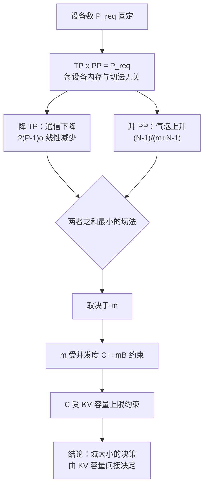
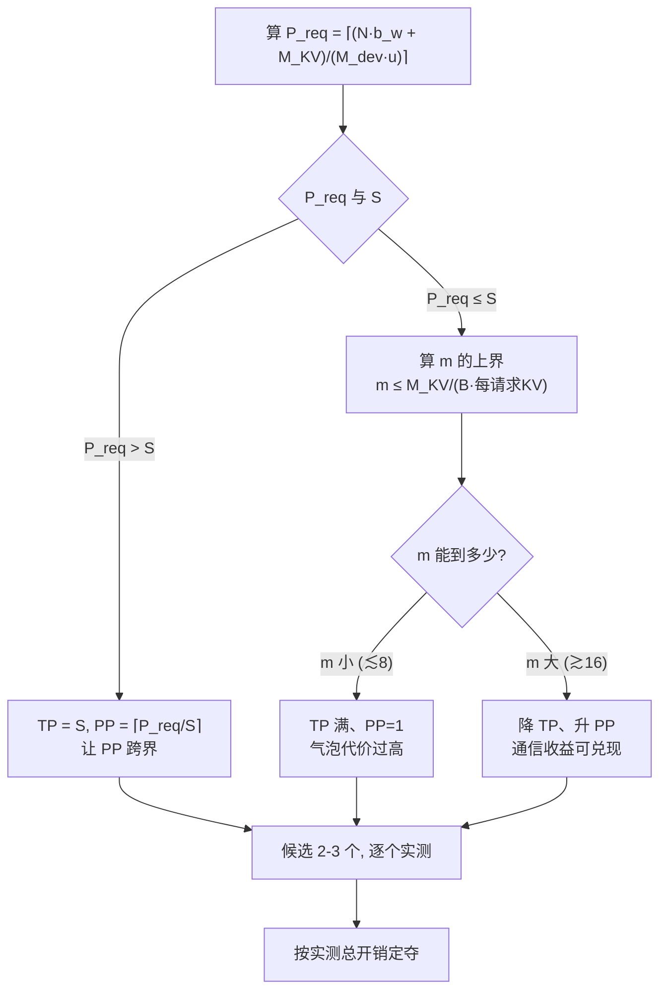

# scale-up 与 scale-out 的决策框架

> 位置：[InferenceAtlas](../../INDEX.md) > [模块 08](README.md) > 当前文档
> 信息截至：2026-07-31 ｜ 最后核验：2026-07-31 ｜ 内容版本：v0.1
> 时效性等级：低（决策框架部分）
> 相关主题：[推理网络总览](01_inference_networking_overview.md)｜[集合通信与通信库](05_collectives_rdma_and_communication_libraries.md)｜[多节点部署拓扑](../06_distributed_and_moe_inference/09_multi_node_serving_topologies.md)

## 本章导读

「scale-up 还是 scale-out」通常被表述成一个采购问题：
**买更大的一致域，还是连更多的节点**。
但它实际上是一个**并行度切分问题**，
因为一致域的大小 $S$ 决定的是**哪些并行维度可以不跨越层次边界**。

本章把这个决策化为可计算的形式，并给出一个反直觉的结论：
**在设备总数与每设备内存占用完全相同的前提下，
降低 TP、提高 PP 可以把关键路径通信从 17.6% 降到 8.0%**——
但它引入的流水气泡可能超过省下的通信。
**两者的平衡点由 decode 能形成多少 micro-batch 决定，
而这个数受 KV 容量上限约束**。

于是「买多大的域」这个采购问题，
**最终归结为一个由 KV 容量决定的调度问题**。

**关于本章数字的说明**：
链路参数沿用 [第 1 章第 2.2 节](01_inference_networking_overview.md) 的假设值，
模型与设备参数同为演示设定，**不对应任何具体产品**。
受当前环境的网络出口策略限制（详见 [AGENTS.md 第 11 节](../../AGENTS.md)），
本库无法核验任何厂商规格或价格，
**因此本章不给出任何产品指标，也不给出任何绝对成本数字**。

## 学习目标

读完本章后，读者应能够：

1. 由模型规模与 KV 预算算出所需设备数，并判断它与一致域大小 $S$ 的关系
2. 说明为什么在设备数相同时，TP×PP 的不同切法会给出差异很大的通信代价
3. 写出「通信占比 + 气泡占比」的一阶开销估计，并找出给定 $m$ 下的最优切法
4. 解释为什么最优切法由 KV 容量上限间接决定
5. 从故障域与可用性角度说明扩大 $S$ 的代价

## 核心结论

- **一致域大小 $S$ 的作用是划定「哪些并行维度不必跨越层次边界」**，它本身不直接提升性能。
- **设备数与每设备内存占用相同时，TP=4×PP=2 的关键路径通信是 TP=8×PP=1 的一半以下**（8.0% 对 17.6%）——因为 ring 的时延项随 $P$ 线性增长。
- **但 PP 引入气泡 $\frac{N-1}{m+N-1}$**，在算例中要到 $m \ge 16$ 时低 TP 方案才真正占优。
- **$m$ 受并发度 $C = mB$ 与 KV 容量上限约束**，因此「该买多大的域」最终由 KV 容量决定。
- **扩大 $S$ 同时扩大故障域**：单机可用性 0.999 时，$S=8$ 的域可用性是 0.992，$S=32$ 降到 0.968。
- **必须跨越层次边界时，应让 PP 而不是 TP 去跨**：PP 每 token 只付一次点对点，TP 每层付两次集合通信。

## 1. 问题定义、系统边界与工作负载

### 1.1 决策的形式

**输入**：模型规模、KV 预算、单设备内存、SLO（TPOT）、一致域大小 $S$。
**输出**：并行度切分 $(\text{TP}, \text{PP})$ 与放置方式。

**$S$ 在这里是约束而不是目标**：
它决定 TP 最大能开到多少而不跨越层次边界。

### 1.2 所需设备数

$$P_{\text{req}} = \left\lceil \frac{N b_w + M_{\text{KV}}}{M_{\text{dev}} \cdot u} \right\rceil$$

其中 $u$ 是可用率（扣除激活、运行时、碎片）。

**算例（假设值）**：$N = 400$B、$b_w = 1$ B/参数、
KV 预算 200 GB、单设备 96 GB、$u = 0.8$：

$$P_{\text{req}} = \left\lceil \frac{400 + 200}{96 \times 0.8} \right\rceil = \lceil 7.81 \rceil = 8$$

**这个 8 是本章后续全部讨论的前提**：
它是**下界**，实际配置可以更多但不能更少。

### 1.3 三种处境

| 关系 | 处境 | 后续 |
|---|---|---|
| $P_{\text{req}} \le S$ | **可以完全放进一个域** | 选 TP 与 PP 的组合，见第 2 节 |
| $P_{\text{req}} > S$ | 必须跨越层次边界 | **让 PP 跨，不要让 TP 跨**，见第 3.2 节 |
| $P_{\text{req}} \gg S$ | 需要多层切分 | 域内 TP、域间 PP，见第 3.3 节 |

## 2. 原理、数学与性能模型

### 2.1 同样的设备数，不同的切法

**关键观察**：TP 与 PP 对每设备内存的影响是等价的。

每设备承载的「层等价量」为

$$\frac{L}{\text{PP}} \times \frac{1}{\text{TP}} = \frac{L}{\text{TP} \cdot \text{PP}}$$

**它只依赖乘积**。因此在设备数 $\text{TP} \times \text{PP}$ 固定时，
**所有切法的每设备内存占用完全相同**：

| 切法 | 设备数 | 每设备层等价量（$L=80$） |
|---|---:|---:|
| TP=8, PP=1 | 8 | 10.0 |
| TP=4, PP=2 | 8 | 10.0 |
| TP=2, PP=4 | 8 | 10.0 |

**内存不区分这三者，通信区分**。

### 2.2 通信代价的差异

由 [第 5 章第 2.2 节](05_collectives_rdma_and_communication_libraries.md)，
ring all-reduce 的时延项是 $2(P-1)\alpha$，**随 TP 线性增长**。
每 token 的关键路径通信为

$$T_{\text{comm}} = \underbrace{2L \cdot T_{\text{AR}}(D, \text{TP})}_{\text{每层两次}} + \underbrace{(\text{PP}-1)\cdot T_{\text{p2p}}(D)}_{\text{每 token 一次}}$$

**注意两项的频率差了 $2L$ 倍**：
TP 的通信每层都发生，PP 的只在 stage 边界发生一次。
**这是「让 PP 去跨层次边界」这条规则的全部依据**。

**算例**（$L=80$、$D=512$ KiB、TP 在域内、PP 跨节点、TPOT = 20 ms）：

| 切法 | 单次 all-reduce | 每 token AR 合计 | PP 传递 | 合计 | 占 TPOT |
|---|---:|---:|---:|---:|---:|
| TP=8, PP=1（全在域内） | 22.0 μs | 3.52 ms | — | 3.52 ms | **17.6%** |
| TP=8, PP=1（跨节点） | 88.4 μs | 14.14 ms | — | 14.14 ms | **70.7%** |
| TP=4 域内, PP=2 跨节点 | 9.9 μs | 1.58 ms | 15.5 μs | 1.60 ms | **8.0%** |
| TP=2 域内, PP=4 跨节点 | 3.6 μs | 0.58 ms | 46.5 μs | 0.62 ms | **3.1%** |

**两个结论**：

1. **同样是 TP=8，放在域内与跨节点相差 4 倍**（17.6% vs 70.7%）——
   这是 [第 1 章](01_inference_networking_overview.md) 已给出的结果。
2. **同样 8 台设备、同样每设备内存，TP=4×PP=2 比 TP=8×PP=1 通信少一半以上**——
   而且它的 PP 还是跨节点的。
   **PP 跨节点的代价（15.5 μs/token）小到可以忽略**，
   因为它每 token 只付一次。

### 2.3 但 PP 有气泡

**第 2.2 节的表少算了一项**。PP 的流水气泡占比为

$$\text{bubble} = \frac{N_{\text{stage}} - 1}{m + N_{\text{stage}} - 1}$$

其中 $m$ 是同时在流水线中的 micro-batch 数
（见 [模块 06 第 3 章](../06_distributed_and_moe_inference/03_pipeline_parallel_inference.md)）。

| $N_{\text{stage}}$ | $m=2$ | $m=4$ | $m=8$ | $m=16$ | $m=32$ |
|---:|---:|---:|---:|---:|---:|
| 2 | 33.3% | 20.0% | 11.1% | 5.9% | 3.0% |
| 4 | 60.0% | 42.9% | 27.3% | 15.8% | 8.3% |

**气泡在 $m$ 小时非常大**，而且 $N_{\text{stage}}$ 越大越差。

### 2.4 合并两项

把通信占比与气泡占比相加，得到一阶的总开销估计：

$$\text{overhead} \approx \frac{T_{\text{comm}}}{\text{TPOT}} + \frac{N_{\text{stage}}-1}{m + N_{\text{stage}}-1}$$

**这是一阶近似**：两项的基准不完全相同
（通信占的是 TPOT，气泡占的是流水线时间），
**它用于排序而不是用于精确预测**。

| 切法 | 通信 | $m=2$ | $m=4$ | $m=8$ | $m=16$ | $m=32$ |
|---|---:|---:|---:|---:|---:|---:|
| TP=8, PP=1 | 17.6% | **17.6%** | **17.6%** | **17.6%** | 17.6% | 17.6% |
| TP=4, PP=2 | 8.0% | 41.3% | 28.0% | 19.1% | **13.9%** | **11.0%** |
| TP=2, PP=4 | 3.1% | 63.1% | 46.0% | 30.4% | 18.9% | 11.7% |

**最优切法随 $m$ 移动**：

| $m$ | 最优 | 次优 |
|---:|---|---|
| 2 | TP=8, PP=1（17.6%） | TP=4, PP=2（41.3%） |
| 4 | TP=8, PP=1（17.6%） | TP=4, PP=2（28.0%） |
| 8 | TP=8, PP=1（17.6%） | TP=4, PP=2（19.1%） |
| 16 | **TP=4, PP=2（13.9%）** | TP=8, PP=1（17.6%） |
| 32 | **TP=4, PP=2（11.0%）** | TP=2, PP=4（11.7%） |

**交叉点落在 $m=8$ 与 $m=16$ 之间**。
这意味着：
**「该不该用 PP 换通信」不取决于网络，而取决于能否形成足够多的 micro-batch**。

**注意 TP=2×PP=4 从未成为最优**：
它的通信最少，但气泡增长更快，
**在本算例的参数下始终被 TP=4×PP=2 支配**。
这说明**「通信越少越好」是错的**——存在一个内部最优。

**图解读**：

1. **本图展示什么**：从「设备数固定」出发的一条因果链，
   终点是一个不在网络领域内的量——**KV 容量**。
   **中间的每一步都是等式或已推导的关系，不是类比**。
2. **核心瓶颈**：瓶颈在节点 G→H。
   $m$ 不是可以自由选择的参数：
   decode 的并发度 $C = mB$ 必须由 KV cache 装得下，
   **所以 KV 容量上限最终决定了 PP 能不能换来净收益**。
3. **图中的 trade-off**：C 与 D 两条边是一对反向的效应，
   **降 TP 同时降低通信和提高气泡**。
   最优点在内部而不在端点——
   算例中 TP=2×PP=4 通信最少却从不最优，就是这个道理。
4. **面试如何引用**：可以说
   「设备数固定时 TP 和 PP 对内存的影响是等价的，
   区别只在通信：**TP 每层两次集合通信，PP 每 token 一次点对点**，
   差 $2L$ 倍。
   所以降 TP 升 PP 能大幅减通信，
   **但要用气泡换，而气泡取决于能形成多少 micro-batch，
   这又受 KV 容量限制**——
   所以我会先看 KV 上限，再定切法」。

### 2.5 $m$ 的上界

由 [模块 01](../01_foundations_and_metrics/) 的 Little's Law 与
[模块 06 第 3 章](../06_distributed_and_moe_inference/03_pipeline_parallel_inference.md)，
decode 阶段流水线中的并发请求数为

$$C = m \cdot B$$

而 $C$ 受 KV 容量约束：

$$C \le \frac{M_{\text{KV}}}{\text{每请求 KV 占用}}$$

**这给出 $m$ 的上界**：

$$m \le \frac{M_{\text{KV}}}{B \cdot (\text{每请求 KV 占用})}$$

**两个后果**：

1. **增大 $B$ 会减小可用的 $m$**（在 KV 预算固定时），
   因此 batch 与 micro-batch 数之间存在此消彼长；
2. **KV 预算越大，$m$ 的上界越高，低 TP 高 PP 的方案越可行**。

**第二点是本章的核心联系**：
**扩大 KV 预算不只是提高吞吐，它还改变了最优的并行切法**——
这是一个通常不会被一起考虑的耦合。

## 3. 实现机制与系统设计

### 3.1 $P_{\text{req}} \le S$：域内选切法

此时不需要跨越层次边界，按第 2.4 节的表选 $(\text{TP}, \text{PP})$：

| 条件 | 选择 |
|---|---|
| KV 预算紧、$m$ 只能到个位数 | **TP 满、PP=1**：气泡代价太高 |
| KV 预算宽、$m \ge 16$ | **降 TP、升 PP**：通信收益兑现 |
| TPOT 目标宽松 | 通信占比本就不高，优先简单方案（PP=1） |

**注意第三行**：
如果通信只占 TPOT 的 5%，
**再优化它最多也只能拿回 5%**——
应当先按 [第 1 章第 6 节](01_inference_networking_overview.md) 的判据确认它是不是首要矛盾。

### 3.2 $P_{\text{req}} > S$：让 PP 跨界

必须跨越层次边界时，**跨界的应当是 PP 而不是 TP**。

| 方案 | 跨界的通信 | 每 token 次数 | 算例代价 |
|---|---|---:|---:|
| TP 跨界 | 集合通信 | $2L = 160$ | **70.7%** |
| PP 跨界 | 点对点 | $\text{PP}-1$ | **0.08%** |

**差距接近三个数量级**，
来源是频率（$2L$ 对 $\text{PP}-1$）与操作类型（集合对点对点）的双重差异。

**因此标准做法是**：

$$\text{TP} = \min(P_{\text{req}}, S), \qquad \text{PP} = \lceil P_{\text{req}} / S \rceil$$

**即「TP 填满一个域，PP 跨域」**。
这与 [模块 06 第 9 章](../06_distributed_and_moe_inference/09_multi_node_serving_topologies.md)
的放置优先级是同一条规则的两种表述。

### 3.3 多层切分

$P_{\text{req}} \gg S$ 时，需要在多个层次上切分。
**原则是按通信重量排序，重的放在快的层次**：

| 层次（由快到慢） | 放什么 | 理由 |
|---|---|---|
| 域内 | **TP** | 每层两次集合通信 |
| 域间、节点内 | EP（若有 MoE） | all-to-all，消息小但次数多 |
| 节点间 | **PP** | 每 token 一次点对点 |
| 集群间 | **副本（DP）** | **副本之间不通信** |

**最后一行是这张表里最容易被忘记的**：
**不同副本之间完全没有通信**，
所以副本可以任意跨越层次边界，甚至跨站点。
**扩容优先加副本，是因为它不付任何通信代价**。

### 3.4 一致域大小的选择

**如果 $S$ 是可以选的（采购决策），第 1.2 节的 $P_{\text{req}}$ 给出下界**：

| 目标 | 所需 $S$ |
|---|---|
| 最大目标模型能完全放进一个域 | $S \ge P_{\text{req}}^{\max}$ |
| 允许 PP 跨节点 | $S \ge P_{\text{req}}^{\max} / \text{PP}_{\max}$ |
| 只求不让 TP 跨界 | $S \ge \text{TP}$ |

**但 $S$ 不是越大越好**，代价见第 4 节。
**并且第 2.4 节已经说明，即使域足够大，最优的 TP 也未必等于 $S$**——
**「买了大域就要把 TP 开满」是一个常见但错误的推论**。

## 4. 性能、成本、能耗与可靠性 trade-off

### 4.1 成本方向

| | scale-up（增大 $S$） | scale-out（加节点） |
|---|---|---|
| 成本增长 | **超线性**（互连复杂度随 $S$ 上升） | 近似线性 |
| 粒度 | 粗（按域） | 细（按节点） |
| 闲置风险 | **高**（域内资源难以细分给别的负载） | 低 |
| 对模型规模变化的适应 | 差（域大小固定） | 好 |

**第三行常被低估**：
一个大域如果只跑一个不需要那么多设备的模型，
**多出来的部分未必能有效地分给别的负载**——
因为域的价值在于一致性，拆开用就失去了这个价值。

**本库不给出任何绝对成本数字**，
成本核算方法见 [模块 01](../01_foundations_and_metrics/) 与
[模块 09 第 6 章](../09_datacenter_power_thermal_and_operations/06_cluster_capacity_and_site_planning.md)。

### 4.2 故障域

**扩大 $S$ 同时扩大故障域**。若单设备可用性为 $a$，
一个 $S$ 设备的域全部可用的概率是 $a^S$：

| 单设备可用性 | $S=4$ | $S=8$ | $S=16$ | $S=32$ |
|---|---:|---:|---:|---:|
| 0.999 | 0.9960 | 0.9920 | 0.9841 | **0.9685** |
| 0.9999 | 0.9996 | 0.9992 | 0.9984 | 0.9968 |

**在单设备 0.999 的假设下，$S=32$ 的域有超过 3% 的时间处于降级状态**。
这不是网络问题而是组合问题：
**域越大，"全部健康"的概率越低**。

**因此扩大 $S$ 需要同时提高单设备可用性，否则收益会被抵消**。
容错利用率上界 $(R-1)/R$ 与冗余设计见
[模块 09 第 7 章](../09_datacenter_power_thermal_and_operations/07_reliability_redundancy_and_maintenance.md)
与 [模块 06 第 10 章](../06_distributed_and_moe_inference/10_fault_tolerance_and_graceful_degradation.md)。

### 4.3 三个维度的汇总

| | 大 $S$ | 小 $S$ + 多节点 |
|---|---|---|
| 通信 | **好**（TP 不跨界） | 差（除非用 PP 跨界） |
| 成本 | 差（超线性） | **好**（线性） |
| 可用性 | 差（$a^S$） | **好**（故障域小） |
| 灵活性 | 差（粒度粗） | **好** |

**没有一个维度上大 $S$ 全面占优**，
它买到的只有「TP 不跨界」这一项。
**而第 3.2 节已经说明，PP 跨界的代价接近可忽略**——
**这使「必须要大域」的论证比通常认为的弱**，
前提是 $m$ 足够大（第 2.5 节）。

## 5. benchmark、真实案例或公开部署案例

**本章不给出任何产品规格、价格或真实部署配置**。

受当前环境的网络出口策略限制（详见 [AGENTS.md 第 11 节](../../AGENTS.md)），
本库无法核验厂商规格或成本数据，**因此无法核验任何一项**。
本章的模型、设备与链路参数均为演示用假设值，已在导读中声明。

**读者应为自己的系统填写的核算表**：

| 项 | 你的值 | 方法 | 披露标签 |
|---|---|---|---|
| 模型参数量与权重位宽 | 待填 | 配置 | `开源代码/配置披露` |
| KV 预算 $M_{\text{KV}}$ | 待填 | 配置 | `开源代码/配置披露` |
| 单设备内存与可用率 $u$ | 待填 | 规格 + 实测 | `官方披露` / `独立可复现实验` |
| $P_{\text{req}}$ | 待填 | 第 1.2 节公式 | 推出 |
| 一致域大小 $S$ | 待填 | 平台事实 | `官方披露` |
| **$P_{\text{req}}$ 与 $S$ 的关系** | 待填 | **决定处境，见 1.3 节** | 推出 |
| 每请求 KV 占用 | 待填 | 由模型配置算 | 推出 |
| **可达的 $m$ 上界** | 待填 | **第 2.5 节，受 KV 约束** | 推出 |
| 各切法的实测 all-reduce 耗时 | 待填 | 生产并发下 | `独立可复现实验` |
| 各切法的实测气泡占比 | 待填 | profile 流水线时间线 | `独立可复现实验` |
| **总开销最小的切法** | 待填 | **实测而非按 2.4 节的一阶近似** | `独立可复现实验` |
| 单设备可用性 $a$ | 待填 | 长期统计 | `独立可复现实验` |
| 域可用性 $a^S$ | 待填 | 由上行算出 | 推出 |

**倒数第三行强调「实测」**：
第 2.4 节的加和是一阶近似，**用于缩小候选范围，不用于最终定夺**。
**候选通常只有两三个，逐个实测是可行的**。

> 测量方法论的通用要求见
> [推理 benchmark 方法论](../11_benchmarking_reliability_and_observability/01_inference_benchmarking_methodology.md)。

## 6. 设计决策框架

**图解读**：

1. **本图展示什么**：从设备数核算到最终切法的完整路径。
   **注意入口不是「网络有多快」而是「模型要多少设备」**——
   网络参数只在最后的实测环节进入。
2. **核心瓶颈**：判定点 E 是全图的关键。
   **$m$ 的上界不是网络属性也不是模型属性，而是 KV 预算的推论**，
   这是本章最容易被跳过的一步。
3. **图中的 trade-off**：F 与 G 两条分支代表两种相反的取舍——
   用通信换气泡，或用气泡换通信。
   **两者都不是普遍更优的，选哪个由 $m$ 决定**。
4. **面试如何引用**：可以说
   「我会先算 $P_{\text{req}}$ 和一致域大小的关系。
   **要跨界就让 PP 跨，因为 TP 每层两次集合通信而 PP 每 token 一次点对点，差 $2L$ 倍**。
   域内选切法时看 $m$ 的上界：
   $m$ 小就把 TP 开满，$m$ 大就降 TP 升 PP。
   **而 $m$ 的上界由 KV 预算决定，所以这归根到底是个 KV 容量问题**」。

**判定标准**：

| 条件 | 判断 |
|---|---|
| $P_{\text{req}} > S$ | 必须跨界；**让 PP 跨** |
| $m \lesssim 8$ | TP 开满、PP=1 |
| $m \gtrsim 16$ | 降 TP 升 PP 值得试 |
| 通信占 TPOT < 10% | 通信不是首要矛盾，选简单方案 |
| 单设备可用性 < 0.999 且 $S$ 大 | **先修可用性，再谈扩大 $S$** |
| 需要频繁适配不同模型规模 | 倾向小 $S$ + 多节点（灵活性） |

**这些阈值是本库为便于判断而设的分界，不是任何标准的规定**。

## 7. 常见失败模式与排查路径

| 症状 | 首先怀疑 | 检查 |
|---|---|---|
| 买了大域但性能没有预期好 | TP 开满未必最优 | 按第 2.4 节比较几种切法 |
| 降 TP 升 PP 后反而更慢 | **$m$ 不够，气泡吃掉了收益** | 算 $m$ 的上界（第 2.5 节） |
| 增大 batch 后 PP 方案变差 | $C = mB$，$B$ 增则 $m$ 减 | 同时看 $B$ 与 $m$ |
| TP 跨界后通信占比暴涨 | 每层两次集合通信跨界 | 改为 PP 跨界 |
| 域规模扩大后可用性下降 | $a^S$ 的组合效应 | 第 4.2 节 |
| 大域利用率低 | 域内资源难以细分 | 第 4.1 节第三行 |
| 通信优化了但端到端没变 | 通信本就不是瓶颈 | [第 1 章第 6 节](01_inference_networking_overview.md) 的百分比判据 |

**第二行是本章最值得记住的失败模式**：
**「降 TP 减少通信」这一步是对的，但它只在 $m$ 足够时净收益为正**。
只看通信数字就切换配置，会在 $m$ 小的系统上得到相反的结果。

## 8. 关联面试主题

- TP 与 PP 的切分取舍 → [模块 17 分布式与 MoE 题](../17_interview_prep/05_distributed_and_moe_questions.md)
- 一致域大小与故障域 → [模块 17 硬件与数据中心题](../17_interview_prep/06_hardware_and_datacenter_questions.md)
- KV 容量对并发与切法的约束 → [模块 17 KV cache 题](../17_interview_prep/02_kv_cache_and_transformer_questions.md)
- 从 SLO 反推架构 → [模块 17 案例走查](../17_interview_prep/09_mock_interview_cases.md)

## 9. 小结

**「scale-up 还是 scale-out」不是采购问题，是并行切分问题**。

- 一致域大小 $S$ 的唯一作用是**划定哪些并行维度不必跨界**。
- **必须跨界时让 PP 跨，不要让 TP 跨**：
  TP 每层两次集合通信，PP 每 token 一次点对点，
  **频率差 $2L$ 倍**，算例中的代价差接近三个数量级。
- **设备数固定时，TP 与 PP 对每设备内存的影响完全等价**，
  区别只在通信与气泡：
  降 TP 使通信从 17.6% 降到 8.0%，但气泡从 0 升到 $\frac{N-1}{m+N-1}$。
- **两者的平衡点由 $m$ 决定**，算例中交叉点在 $m=8$ 与 $m=16$ 之间。
- **而 $m$ 受 $C = mB$ 与 KV 容量上限约束**——
  所以域大小的决策最终归结为 KV 容量。

**两个应当避免的推论**：

1. **「通信越少越好」是错的**：
   算例中 TP=2×PP=4 通信最少，却从未成为最优——最优点在内部。
2. **「买了大域就把 TP 开满」是错的**：
   即使域足够大，$m$ 充裕时降 TP 仍可能更好。

**扩大 $S$ 的代价也应当被明确计入**：
成本超线性、粒度变粗、
且故障域随之扩大——
单设备可用性 0.999 时 $S=32$ 的域可用性只有 0.968。
**大 $S$ 唯一买到的是「TP 不跨界」，
而 PP 跨界的代价接近可忽略**，
这使「必须要大域」的论证比通常认为的弱。

## 关键术语

| 中文术语 | 英文 | 定义 | 单位/口径 | 关联文档 |
|---|---|---|---|---|
| 一致域大小 | scale-up domain size $S$ | 以高带宽低时延互连成一致域的设备数 | 设备数 | 本章 1.1 |
| 所需设备数 | required device count $P_{\text{req}}$ | 由权重与 KV 预算除以单设备可用内存得出的下界 | 设备数 | 本章 1.2 |
| 层等价量 | layer-equivalent | $L/(\text{TP}\cdot\text{PP})$，每设备承载量；**只依赖乘积** | — | 本章 2.1 |
| 流水气泡 | pipeline bubble | $\frac{N-1}{m+N-1}$，流水线未填满造成的空闲 | % | 本章 2.3 |
| micro-batch 数 | micro-batch count $m$ | 同时在流水线中的批数；**上界由 KV 容量决定** | — | 本章 2.5 |
| 一阶开销估计 | first-order overhead | 通信占比与气泡占比之和；**用于排序而非精确预测** | % | 本章 2.4 |
| 故障域 | fault domain | 一次故障带走的设备集合；域可用性为 $a^S$ | — | 本章 4.2 |

## 延伸阅读

- [推理网络总览](01_inference_networking_overview.md)
- [集合通信、RDMA 与通信库](05_collectives_rdma_and_communication_libraries.md)
- [张量并行推理](../06_distributed_and_moe_inference/02_tensor_parallel_inference.md)
- [流水并行推理](../06_distributed_and_moe_inference/03_pipeline_parallel_inference.md)
- [多节点部署拓扑](../06_distributed_and_moe_inference/09_multi_node_serving_topologies.md)
- [容错与优雅降级](../06_distributed_and_moe_inference/10_fault_tolerance_and_graceful_degradation.md)

## 主要来源

本章由 [第 1 章](01_inference_networking_overview.md) 的 TPOT 百分比换算、
[第 5 章](05_collectives_rdma_and_communication_libraries.md) 的集合通信代价模型、
以及 [模块 06](../06_distributed_and_moe_inference/) 已建立的
并行通信量与流水气泡公式组合推导而成。

**不含任何产品规格、价格或真实部署配置**。
受当前环境的网络出口策略限制，本库无法核验厂商规格或成本数据
（详见 [AGENTS.md 第 11 节](../../AGENTS.md)）。

| 类别 | 说明 | 披露标签 |
|---|---|---|
| 层等价量只依赖 TP×PP 的乘积 | 由定义推出 | — |
| 通信与气泡的代价公式 | 见第 1、5 章与模块 06 的推导 | — |
| 第 2 节各算例的模型、设备与链路参数 | **为演示设定的假设值** | — |
| 第 2.4 节的加和 | **一阶近似，用于排序而非精确预测** | — |
| 第 6 节的阈值 | **本库为便于判断而设的分界，非标准规定** | — |
| 读者自身系统的核算与实测 | 应自行完成 | `独立可复现实验` |
| 任何产品规格与成本数据 | **本章未给出** | `待核实` |

## 更新记录

| 日期 | 版本 | 变更 | 核验人 |
|---|---|---|---|
| 2026-07-31 | v0.1 | 初稿：所需设备数核算、TP×PP 切法对内存等价而对通信不等价、通信与气泡的平衡点由 $m$ 决定、$m$ 的 KV 上界、让 PP 跨界的规则、域大小的成本与故障域代价 | — |
