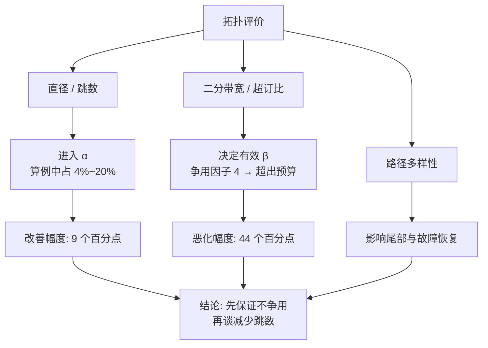
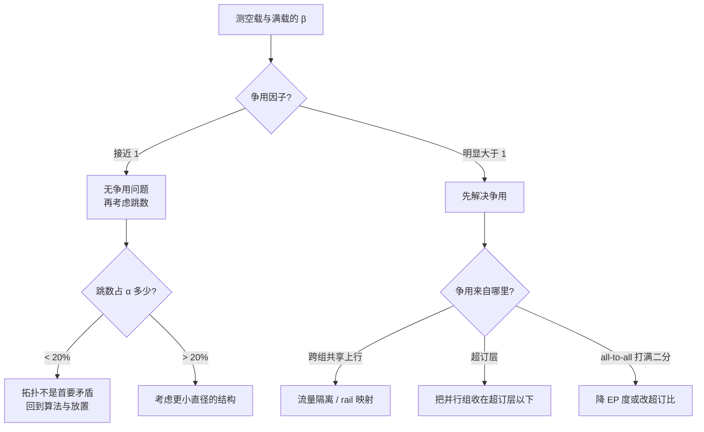

# 网络拓扑：fat-tree、dragonfly 与 rail 优化

> 位置：[InferenceAtlas](../../INDEX.md) > [模块 08](README.md) > 当前文档
> 信息截至：2026-07-31 ｜ 最后核验：2026-07-31 ｜ 内容版本：v0.1
> 时效性等级：低（图论与结构部分）
> 相关主题：[推理网络总览](01_inference_networking_overview.md)｜[集合通信与通信库](05_collectives_rdma_and_communication_libraries.md)｜[scale-up 与 scale-out](06_scale_up_vs_scale_out.md)

## 本章导读

拓扑讨论通常围绕两个指标展开：**二分带宽**与**直径（跳数）**。
但对推理而言，**这两个指标的重要性是不对等的，而且不是通常认为的那一个更重要**。

本章的算例给出：
**跳数差异只占 $\alpha$ 的 4%–20%**——
从单跳变成五跳，每 token 通信从 12.34 ms 变成 14.14 ms；
而**争用把有效 $\beta$ 降到 1/4 时，同一配置从占 TPOT 的 70.7% 变成 114.7%，即已经超出预算**。

**所以拓扑对推理的主要影响不是它有多少跳，而是它在生产流量下会不会产生争用**。
这也解释了 rail 优化为什么存在：
**它不是为了减少跳数，而是为了让最频繁的那一类流量根本不进入会争用的层次**。

**关于本章数字的说明**：
链路参数沿用 [第 1 章第 2.2 节](01_inference_networking_overview.md) 的假设值，
每跳时延与争用因子同为演示设定，**不对应任何具体产品或部署**。
受当前环境的网络出口策略限制（详见 [AGENTS.md 第 11 节](../../AGENTS.md)），
本库无法核验厂商规格、交换机参数或真实集群配置，
**因此本章不给出任何产品指标，也不描述任何真实部署的拓扑**。
本章讨论的是**结构与图论性质**，它们与具体设备无关。

## 学习目标

读完本章后，读者应能够：

1. 写出 $k$ 端口交换机构成的三层 Clos 网络的主机数、交换机数与跳数，并说明它们如何随 $k$ 变化
2. 区分二分带宽、直径、超订比与路径多样性，并说明各自影响推理的哪一项指标
3. 解释为什么跳数对推理的影响远小于争用，并用算例支持这个判断
4. 说明 rail 优化利用的是 AI 流量的哪个性质，以及这个性质在通用数据中心流量中为何不存在
5. 判断一个拓扑是否支持 [第 5 章](05_collectives_rdma_and_communication_libraries.md) 中递归折半-倍增算法的远距离交换

## 核心结论

- **跳数只占 $\alpha$ 的小部分**（算例中 4%–20%），因此「直径更小」对推理的直接收益有限。
- **争用是拓扑影响推理的主要途径**：有效 $\beta$ 降到 1/4 时，算例中的配置从 70.7% 的 TPOT 占比变成 114.7%——**已经不可行**。
- **超订比直接乘在 all-to-all 的时间上**：1:4 超订使需要满二分带宽的操作慢 4 倍。
- **rail 优化利用的是「AI 集合通信的参与者集合是预先已知且固定的」**——通用数据中心流量没有这个性质，所以那里不做 rail 优化。
- **Clos 的交换机/主机比随 $k$ 下降**（$5k^2/4$ 对 $k^3/4$，即 $5/k$），因此高基数交换机是大规模全二分带宽网络成本可控的前提。
- **拓扑决定了 RHD 的远距离交换是否争用**，因此「用哪个集合通信算法」不能脱离拓扑回答。

## 1. 问题定义、系统边界与工作负载

### 1.1 拓扑要回答的问题

给定主机数 $N$ 与交换机端口数（基数）$k$，拓扑决定四件事：

| 性质 | 定义 | 影响推理的哪一项 |
|---|---|---|
| 二分带宽 | 把网络分成两半时跨越切面的总带宽 | **all-to-all 的有效 $\beta$** |
| 直径 | 任意两主机间最长最短路径的跳数 | $\alpha$ 的一部分（**较小**） |
| 超订比 | 下行带宽与上行带宽之比 | 直接乘在需满带宽的操作上 |
| 路径多样性 | 任意两点间不相交路径的条数 | **尾部与故障恢复** |
| 成本 | 交换机数与线缆数 | 不影响性能，决定可行性 |

**第二行标注「较小」是本章的主要论点之一**，第 2.3 节给出算例。

### 1.2 推理流量的特殊性质

**通用数据中心流量与 AI 集合通信有一个结构性差别**：

| | 通用数据中心 | AI 集合通信 |
|---|---|---|
| 通信对象 | 事先不可知，任意两台之间 | **事先已知且固定**（并行组的成员） |
| 时间模式 | 不可预测 | **高度规律**（每层每 token） |
| 流大小 | 长尾分布 | **同构**（同一集合内消息等大） |
| 同步性 | 无 | **强**（全体同时开始、同时结束） |

**右列的四条性质合起来使一件事成为可能**：
**把通信模式固定下来，并为它专门设计拓扑与布线**。
rail 优化就是这个思路的直接产物（第 3.3 节）。

**左列的性质则要求「任意两点都要快」**，
这正是全二分带宽 Clos 网络的设计目标。
**两种目标导出不同的最优结构**——
这是本章要说明的核心区别。

## 2. 原理、数学与性能模型

### 2.1 Clos / fat-tree 的规模关系

$k$ 端口交换机构成的三层 Clos 网络：

| 量 | 表达式 |
|---|---|
| 主机数 | $N = k^3/4$ |
| 核心层交换机 | $k^2/4$ |
| 汇聚层交换机 | $k^2/2$ |
| 边缘层交换机 | $k^2/2$ |
| 交换机总数 | $S = 5k^2/4$ |
| 跨 pod 的交换跳数 | 5 |

| $k$ | 主机数 | 交换机数 | 交换机/主机 |
|---:|---:|---:|---:|
| 16 | 1,024 | 320 | 0.312 |
| 32 | 8,192 | 1,280 | 0.156 |
| 48 | 27,648 | 2,880 | 0.104 |
| 64 | 65,536 | 5,120 | 0.078 |

**关键比值是 $\frac{S}{N} = \frac{5k^2/4}{k^3/4} = \frac{5}{k}$**：
**每主机所需的交换机数与基数成反比**。

**这一条解释了高基数交换机的意义**：
它不是让网络更快，而是**让全二分带宽在大规模下成本可控**。
$k$ 从 16 到 64，每主机交换机数降到四分之一。

### 2.2 超订比

全二分带宽（1:1）意味着上行带宽等于下行带宽。
**超订（oversubscription）是有意削减上行带宽以省成本**：

$$\beta_{\text{eff}}(\text{需满二分带宽的操作}) = \frac{\beta}{o}$$

| 超订比 | all-to-all 有效带宽 | 完成时间 |
|---|---|---|
| 1:1 | $\beta$ | ×1 |
| 1:2 | $\beta/2$ | **×2** |
| 1:4 | $\beta/4$ | **×4** |

**超订比对不同操作的影响不同**：

| 操作 | 是否受超订影响 |
|---|---|
| all-to-all（MoE） | **完全受影响**：需要全局二分带宽 |
| ring all-reduce | **几乎不受**：只用最近邻链路 |
| RHD all-reduce | 部分受影响：远距离交换要上行 |
| 点对点（PP、KV） | 取决于两端是否跨越超订层 |

**第二行是 ring 算法的一个被低估的优点**：
**它对超订不敏感**，因为它从不产生跨切面的全局流量。
这与 [第 5 章第 2.5 节](05_collectives_rdma_and_communication_libraries.md)
「ring 只用最近邻链路」是同一件事在拓扑侧的表述。

### 2.3 跳数对 $\alpha$ 的贡献

设每跳增加固定时延 $t_{\text{hop}}$（假设 0.2 μs）：

| 路径 | 交换跳数 | 跳数贡献 |
|---|---:|---:|
| 同 rail（单跳） | 1 | 0.2 μs |
| 同 pod | 3 | 0.6 μs |
| 跨 pod（三层 Clos） | 5 | 1.0 μs |
| dragonfly 典型 | 3 | 0.6 μs |

**与假设的节点间 $\alpha = 5$ μs 相比，跳数只占 4%–20%**。

**换算到每 token**（$L=80$、$P=8$、ring、$D=512$ KiB）：

| 路径 | 有效 $\alpha$ | 单次 all-reduce | 每 token | 占 20 ms TPOT |
|---|---:|---:|---:|---:|
| 同 rail 单跳 | 4.2 μs | 77.2 μs | 12.34 ms | 61.7% |
| 跨 rail 五跳 | 5.0 μs | 88.4 μs | 14.14 ms | 70.7% |

**差 9 个百分点**——不可忽略，但也不是决定性的。

### 2.4 争用的影响

**同样的算例，改为让有效 $\beta$ 因争用而下降**：

| 争用因子 | 有效 $\beta$ | 单次 all-reduce | 每 token | 占 20 ms TPOT |
|---:|---:|---:|---:|---:|
| 1 | 50 GB/s | 88.4 μs | 14.14 ms | 70.7% |
| 2 | 25 GB/s | 106.7 μs | 17.07 ms | 85.4% |
| 4 | 12.5 GB/s | 143.4 μs | 22.94 ms | **114.7%** |

**争用因子 4 使配置直接不可行**——通信时间已超过整个 TPOT 预算。

**把 2.3 与 2.4 并排看，得到本章的核心判断**：

| 变化 | 对 TPOT 占比的影响 |
|---|---|
| 跳数从 5 降到 1 | 70.7% → 61.7%（**改善 9 个百分点**） |
| 争用因子从 1 升到 4 | 70.7% → 114.7%（**恶化 44 个百分点**） |

**争用的影响是跳数的数倍**。
因此评价一个拓扑时，
**「它在生产流量下会不会争用」比「它有几跳」重要得多**。

**图解读**：

1. **本图展示什么**：拓扑的三个性质各自通过不同路径影响推理，
   **三条路径的量级不同**。
   跳数进入 $\alpha$，争用进入 $\beta$，路径多样性进入尾部。
2. **核心瓶颈**：瓶颈在 C→F 这条边。
   **$\beta$ 是被争用**乘除**的，而 $\alpha$ 是被跳数**加减**的**——
   乘除的效应在数量级上压过加减，这就是两者不对等的根本原因。
3. **图中的 trade-off**：减少直径通常要提高基数或增加全局链路，
   两者都增加成本；而消除争用可以靠流量隔离或 rail 优化，
   **后者往往是布线与调度问题而非采购问题**。
   **先做便宜的那个**。
4. **面试如何引用**：可以说
   「我会先看拓扑在生产流量下会不会争用，再看跳数。
   **因为跳数是加在 $\alpha$ 上的，争用是乘在 $\beta$ 上的**；
   在我的算例里跳数从 5 降到 1 改善 9 个百分点，
   而争用因子 4 直接让配置超出 TPOT 预算」。

### 2.5 路径多样性与尾部

**路径多样性影响的不是平均值而是尾部**。
由 [第 1 章第 2.6 节](01_inference_networking_overview.md)，
单次通信异常率 $p$ 经 $2L$ 次放大后为 $1-(1-p)^{2L}$，
**要让 P99 的 token 不受影响，$p$ 需低于约 $10^{-4}$**。

| 路径多样性 | 后果 |
|---|---|
| 单路径 | 任何一条链路的瞬时拥塞直接进入 $p$ |
| 多路径 + 静态哈希 | 哈希冲突时仍会集中，**改善有限** |
| 多路径 + 自适应 | 可绕开拥塞点，**$p$ 显著下降** |

**第二行是一个常见的失望来源**：
「我们有多条路径」不等于「流量会均匀分布」。
**静态哈希在流数量少时冲突概率高**，
而 AI 集合通信恰恰是「少量大流」——
**这与通用数据中心的「大量小流」相反，因而哈希的大数效应不成立**。

## 3. 实现机制与系统设计

### 3.1 Clos / fat-tree

**结构**：多层交换，每层向上有多条等价路径，逐层收敛到核心层。

| 优点 | 缺点 |
|---|---|
| 可做到全二分带宽 | 跨 pod 需 5 跳 |
| 结构规则，易扩展 | 线缆数量大 |
| 路径多样性高 | 高基数交换机才能规模化（第 2.1 节） |
| **对任意通信模式都均匀** | **不利用 AI 流量的规律性** |

**最后一行是它在 AI 场景下的关键局限**：
Clos 的设计目标是「任意两点都一样快」，
**这在通信模式已知时是一种浪费**。

### 3.2 dragonfly

**结构**：主机连到交换机，交换机分组、组内全连接，组间由全局链路全连接。

| 优点 | 缺点 |
|---|---|
| 直径小（典型 3 跳） | **全局链路是稀缺资源** |
| 长线缆数量少（成本） | **必须自适应路由**，否则全局链路拥塞 |
| 组内通信极快 | 组间带宽远小于组内 |

**「必须自适应路由」这一条是 dragonfly 的核心约束**：
最短路径会把大量流量压到少数全局链路上，
**因此它依赖把部分流量绕远（非最短路径）来分散负载**。
这引入了一个取舍：**绕远增加跳数，但减少争用**——
按第 2.4 节的量级对比，**这个取舍通常是划算的**。

### 3.3 rail 优化

**这是专为 AI 集合通信设计的结构，值得单独说明它利用了什么**。

**结构**：每台主机有多个网络端口；
**所有主机的第 $i$ 个端口连到同一台「rail $i$」交换机**。

**它利用的性质是第 1.2 节右列的第一条**：
**集合通信的参与者集合事先已知且固定**。
把并行组的成员映射到同一条 rail 上，
**这一组的集合通信就只需要一跳，且不与其他组共享链路**。

| | 同 rail 通信 | 跨 rail 通信 |
|---|---|---|
| 跳数 | **1** | 需上行到更高层 |
| 是否与其他组争用 | **否**（rail 专用） | 是 |
| 适合 | **TP 组内的 all-reduce** | 跨组流量、PP、KV |

**注意收益的主要来源**：

由第 2.3 与 2.4 节，
**「一跳」带来的 $\alpha$ 收益是 9 个百分点，
而「不与其他组争用」避免的是 44 个百分点量级的恶化**。
**因此 rail 优化的价值主要在第二行而不是第一行**——
**它是一种流量隔离手段，减少跳数只是附带效果**。

这一点常被表述反：
「rail 优化让通信只要一跳」是对的但不是重点，
**「rail 优化让 TP 组的流量不与别人抢带宽」才是重点**。

### 3.4 拓扑与集合通信算法的耦合

[第 5 章第 2.5 节](05_collectives_rdma_and_communication_libraries.md) 指出
递归折半-倍增（RHD）在 $\alpha$-$\beta$ 模型下支配 ring，
但其远距离交换在低维物理拓扑上会争用。
**本章可以把这个条件写具体**：

| 拓扑 | RHD 的远距离交换 | 结论 |
|---|---|---|
| 全连接的 scale-up 域 | 任意两点等价 | **RHD 优势成立** |
| 同 rail（单跳到同一交换机） | 任意两点等价 | **RHD 优势成立** |
| 三层 Clos（跨 pod） | 远距离对需上行，可能争用 | 需实测 |
| dragonfly 跨组 | 全局链路稀缺 | **可能反转** |
| 物理环或网格 | 远距离对需多跳 | **优势通常被抵消** |

**前两行说明了一个实践要点**：
**rail 优化不仅减少争用，还使 RHD 这类算法的前提成立**。
两者叠加的收益大于各自单独的收益——
**这是拓扑与算法必须一起选的原因**。

### 3.5 映射的重要性

**拓扑本身不产生性能，「哪个进程放在哪台机器上」才产生**。

| 问题 | 后果 |
|---|---|
| TP 组的成员被分散到不同 rail | rail 优化完全失效 |
| 并行组跨越超订层 | 按第 2.2 节乘上超订比 |
| 编号顺序与物理拓扑不一致 | ring 的「邻居」在物理上不邻近 |

**第三行值得强调**：
ring 算法假设编号相邻的进程在物理上也相邻。
**如果映射打乱了这个假设，ring 的「只用最近邻链路」这个优点就不存在了**，
它会退化成随机的远距离通信——
**此时 ring 既没有 RHD 的低步数，也失去了自己的拓扑优势，是最差的组合**。

**因此拓扑发现与映射校验是部署的必要步骤**，
方法见 [模块 06 第 9 章第 3.2 节](../06_distributed_and_moe_inference/09_multi_node_serving_topologies.md)。

## 4. 性能、成本、能耗与可靠性 trade-off

### 4.1 三种结构的对比

| | Clos（全二分） | dragonfly | rail 优化 |
|---|---|---|---|
| 二分带宽 | **满** | 组间受限 | 跨 rail 受限 |
| 直径 | 5 跳 | **3 跳** | **1 跳（同 rail）** |
| 成本 | 高（线缆多） | **较低**（长线缆少） | 取决于每主机端口数 |
| 对通信模式的假设 | **无** | 无 | **强（组员固定）** |
| 路由复杂度 | 低 | **高（须自适应）** | 低 |
| 通信模式变化时 | **不受影响** | 不受影响 | **需重新映射** |

**最后一行是 rail 优化的代价**：
它把「通信模式已知」这个假设固化进了布线。
**假设一旦不成立——例如换了并行策略——收益就消失**，
而布线不能随之改变。

**这是一个典型的专用化取舍**：
用灵活性换性能，
**且这里换掉的灵活性是物理层面的，比软件层面的更难恢复**。

### 4.2 成本方向

| 决策 | 成本影响 | 性能影响 |
|---|---|---|
| 提高交换机基数 $k$ | 单台更贵，但每主机交换机数降为 $5/k$ | 同规模下层数更少 |
| 引入超订 | **线性省成本** | all-to-all 按超订比线性变慢 |
| 增加每主机端口（rail 数） | 端口与线缆成本上升 | 更多组可同时享受专用 rail |

**第二行的取舍需要按流量类型判断**：
**若负载不含 MoE（无 all-to-all），超订的代价小得多**，
因为 ring all-reduce 几乎不受超订影响（第 2.2 节）。
**这使「有没有 MoE」成为拓扑决策的一个输入**——
一个通常不会被放在一起考虑的耦合。

### 4.3 可靠性

| 结构 | 单交换机故障的影响 | 恢复 |
|---|---|---|
| Clos | 核心层故障降低带宽但不断连 | 路径多样性自动吸收 |
| dragonfly | 全局链路故障影响特定组对 | 依赖自适应路由绕行 |
| rail 优化 | **一条 rail 故障影响所有主机的该端口** | 降级到剩余 rail，带宽下降 |

**rail 优化的故障模式与另外两者不同**：
它的故障不是「部分主机不可达」，而是**「所有主机都损失一部分带宽」**。
**这在容量规划上更容易处理**（均匀降级而非部分失效），
但也意味着**没有哪台主机能幸免**。

## 5. benchmark、真实案例或公开部署案例

**本章不描述任何真实集群的拓扑，也不给出任何交换机或线缆的规格**。

受当前环境的网络出口策略限制（详见 [AGENTS.md 第 11 节](../../AGENTS.md)），
本库无法核验厂商规格或公开部署资料，**因此无法核验任何一项**。
第 2.1 节的规模关系由 Clos 结构的定义推出，与具体设备无关；
其余参数为演示用假设值，已在导读中声明。

**读者应为自己的集群填写的核查表**：

| 项 | 你的值 | 方法 | 披露标签 |
|---|---|---|---|
| 交换机基数 $k$ 与层数 | 待填 | 平台事实 | `官方披露` |
| 超订比 | 待填 | 上行/下行带宽之比 | `官方披露` |
| 跨 pod 跳数 | 待填 | 拓扑图或 traceroute 类工具 | `独立可复现实验` |
| 每跳时延 | 待填 | 逐跳测量 | `独立可复现实验` |
| **跳数在 $\alpha$ 中的占比** | 待填 | **上两行相乘再除以 $\alpha$** | 推出 |
| 是否 rail 优化 | 是/否 | 布线事实 | `官方披露` |
| **TP 组成员是否在同一 rail** | 是/否 | **查实际映射，不要查配置意图** | `独立可复现实验` |
| 进程编号与物理邻接是否一致 | 是/否 | 拓扑发现工具 | `独立可复现实验` |
| **空载与满载的 $\beta$ 之比（争用因子）** | 待填 | **两种条件下分别测** | `独立可复现实验` |
| 路由是静态哈希还是自适应 | 待填 | 平台事实 | `官方披露` |
| 单次通信异常率 $p$ | 待填 | 长时间采样尾部 | `独立可复现实验` |
| 负载中是否含 all-to-all（MoE） | 是/否 | 模型结构 | `开源代码/配置披露` |

**加粗的三行是本章的核心**：
争用因子是最重要的一项，
而 TP 组的实际映射是最容易与配置意图不符的一项。

> 测量方法论的通用要求见
> [推理 benchmark 方法论](../11_benchmarking_reliability_and_observability/01_inference_benchmarking_methodology.md)。

## 6. 设计决策框架

**图解读**：

1. **本图展示什么**：一个**先争用后跳数**的排查顺序。
   **入口是「空载与满载的 $\beta$ 之比」这一个可测量**，
   而不是拓扑图。
2. **核心瓶颈**：判定点 B 决定后续全部工作。
   **争用因子接近 1 时，拓扑几乎不可能是首要矛盾**；
   明显大于 1 时，减少跳数是在解决次要问题。
3. **图中的 trade-off**：三条解决争用的分支代价不同——
   rail 映射是调度问题（便宜），
   改超订比是采购问题（贵），
   降 EP 度是模型架构问题（影响质量）。
   **应按这个顺序尝试**。
4. **面试如何引用**：可以说
   「我会先测空载与满载的带宽比，也就是争用因子。
   **因为争用是乘在 $\beta$ 上的、跳数是加在 $\alpha$ 上的**，
   前者的量级大得多。
   争用因子接近 1 我就不动拓扑了，
   **转而去看集合通信算法和并行组的放置**」。

**判定标准**：

| 观察 | 结论 |
|---|---|
| 争用因子 $\approx 1$ | 拓扑不是瓶颈 |
| 争用因子 $> 2$ | **首要矛盾**，按第 6 节的三条分支处理 |
| 跳数占 $\alpha$ < 20% | 减少直径的收益有限 |
| TP 组跨越 rail 或超订层 | **映射问题**，先修映射再谈拓扑 |
| 进程编号与物理不邻接 | **ring 退化**，见第 3.5 节 |
| 有 MoE 且超订比 > 1:1 | all-to-all 按超订比变慢，重新评估 |

**这些阈值是本库为便于判断而设的分界，不是任何标准的规定**。

## 7. 常见失败模式与排查路径

| 症状 | 首先怀疑 | 检查 |
|---|---|---|
| 空载测试好、上线后差 | **争用** | 空载/满载 $\beta$ 之比 |
| 换了低直径拓扑但改善很小 | 跳数本就不是主要项 | 算跳数占 $\alpha$ 的比例 |
| 有多条路径但仍拥塞 | **静态哈希冲突** | 路由是否自适应；见第 2.5 节 |
| rail 优化没有带来预期收益 | TP 组未映射到同一 rail | 查实际映射 |
| ring 性能远低于预测 | **编号与物理不邻接** | 拓扑发现与映射校验 |
| MoE 模型比稠密模型受网络影响大得多 | all-to-all 需满二分带宽 | 超订比 |
| 换并行策略后网络性能下降 | rail 布线假设失效 | 第 4.1 节最后一行 |
| 部分主机带宽下降而非部分主机失联 | rail 故障的特征 | 第 4.3 节 |

**第三行是本章最容易被忽略的一条**：
**AI 流量是「少量大流」，静态哈希的大数效应不成立**。
在通用数据中心行之有效的 ECMP 哈希，
在这里可能长期把两条大流压在同一条链路上。

## 8. 关联面试主题

- 二分带宽、直径与超订比的区别 → [模块 17 硬件与数据中心题](../17_interview_prep/06_hardware_and_datacenter_questions.md)
- rail 优化利用的流量性质 → [模块 17 分布式与 MoE 题](../17_interview_prep/05_distributed_and_moe_questions.md)
- 拓扑与集合通信算法的耦合 → [模块 17 系统设计题](../17_interview_prep/01_inference_system_design.md)
- 争用与尾部时延 → [模块 17 调试与 benchmark 题](../17_interview_prep/07_debug_benchmark_and_reliability_questions.md)

## 9. 小结

**本章的主要论点是拓扑的两个常用指标对推理不对等**：

- **跳数加在 $\alpha$ 上**：算例中从 5 跳降到 1 跳，
  TPOT 占比从 70.7% 改善到 61.7%，**9 个百分点**。
- **争用乘在 $\beta$ 上**：争用因子从 1 升到 4，
  TPOT 占比从 70.7% 恶化到 114.7%，**44 个百分点且已不可行**。

**乘除压过加减，所以「会不会争用」比「有几跳」重要得多**。

**由此得到三条实践结论**：

1. **rail 优化的价值主要在流量隔离而非减少跳数**。
   把它说成「让通信只要一跳」是对的但抓错了重点。
2. **rail 优化还使 RHD 类算法的前提成立**（任意两点等价），
   因此拓扑与集合通信算法必须一起选——
   见 [第 5 章第 2.5 节](05_collectives_rdma_and_communication_libraries.md)。
3. **映射比拓扑更容易出错**：
   TP 组被分散到不同 rail、或进程编号与物理不邻接，
   都会使拓扑投资完全落空。
   **后者尤其糟糕——ring 会退化成既无低步数、又无拓扑优势的最差组合**。

**两个结构性的观察**：

- **Clos 的交换机/主机比是 $5/k$**，
  所以高基数交换机是大规模全二分带宽成本可控的前提，
  它买的是成本而不是速度。
- **AI 流量是「少量大流」**，
  因此静态哈希的大数效应不成立——
  「有多条路径」不等于「负载会均匀」。

**最后回到本模块的主线**：
本章讨论的一切只有在通信确实占 TPOT 显著比例时才值得做。
**先按 [第 1 章第 6 节](01_inference_networking_overview.md) 算百分比，再读本章**。

## 关键术语

| 中文术语 | 英文 | 定义 | 单位/口径 | 关联文档 |
|---|---|---|---|---|
| 二分带宽 | bisection bandwidth | 把网络分成两半时跨越切面的总带宽 | GB/s | 本章 1.1 |
| 直径 | diameter | 任意两主机间最长最短路径的跳数 | 跳 | 本章 1.1 |
| 交换机基数 | switch radix | 单台交换机的端口数 $k$ | 端口 | 本章 2.1 |
| 超订比 | oversubscription ratio | 下行与上行带宽之比；直接乘在需满带宽的操作上 | — | 本章 2.2 |
| 争用因子 | contention factor | 空载 $\beta$ 与满载有效 $\beta$ 之比 | 无量纲 | 本章 2.4 |
| 路径多样性 | path diversity | 任意两点间不相交路径的条数；影响尾部 | 条 | 本章 2.5 |
| rail 优化 | rail-optimized | 各主机同序号端口连到同一交换机；**本质是流量隔离** | — | 本章 3.3 |
| 映射校验 | mapping validation | 确认并行组成员的物理放置与假设一致 | — | 本章 3.5 |

## 延伸阅读

- [推理网络总览](01_inference_networking_overview.md)
- [集合通信、RDMA 与通信库](05_collectives_rdma_and_communication_libraries.md)
- [scale-up 与 scale-out 的决策框架](06_scale_up_vs_scale_out.md)
- [多节点部署拓扑](../06_distributed_and_moe_inference/09_multi_node_serving_topologies.md)
- [MoE 路由与 all-to-all](../06_distributed_and_moe_inference/06_moe_routing_all_to_all_and_load_balancing.md)

## 主要来源

本章由 Clos 网络的结构定义（主机数、交换机数与跳数由 $k$ 直接推出）、
$\alpha$-$\beta$ 模型、
以及 [第 1 章](01_inference_networking_overview.md) 与
[第 5 章](05_collectives_rdma_and_communication_libraries.md) 已建立的结论推导而成。

**不描述任何真实集群拓扑，不含任何交换机或线缆规格**。
受当前环境的网络出口策略限制，本库无法核验厂商规格或公开部署资料
（详见 [AGENTS.md 第 11 节](../../AGENTS.md)）。

| 类别 | 说明 | 披露标签 |
|---|---|---|
| Clos 的规模关系 $N=k^3/4$、$S=5k^2/4$ | 由结构定义推出 | — |
| 超订比对需满二分带宽操作的线性影响 | 由定义推出 | — |
| 第 2.3、2.4 节的每跳时延与争用因子 | **为演示设定的假设值** | — |
| rail 优化利用的流量性质 | 由第 1.2 节的结构分析推出 | — |
| 第 6 节的阈值 | **本库为便于判断而设的分界，非标准规定** | — |
| 读者自身集群的核查与测量 | 应自行实测 | `独立可复现实验` |
| 任何产品规格与真实部署拓扑 | **本章未给出** | `待核实` |

## 更新记录

| 日期 | 版本 | 变更 | 核验人 |
|---|---|---|---|
| 2026-07-31 | v0.1 | 初稿：Clos 规模关系、超订比的线性影响、跳数与争用对推理影响的量级对比、rail 优化的本质是流量隔离、拓扑与集合通信算法的耦合、映射校验 | — |
