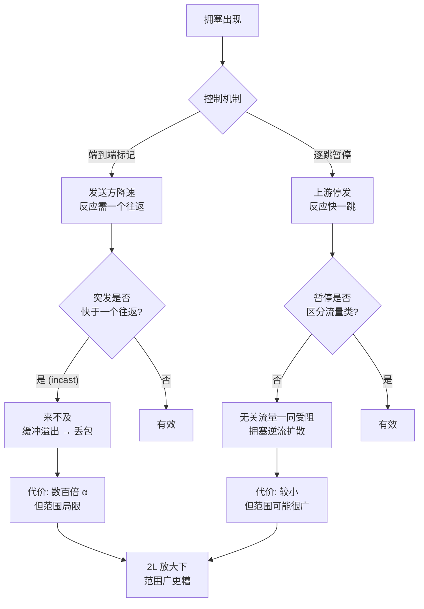
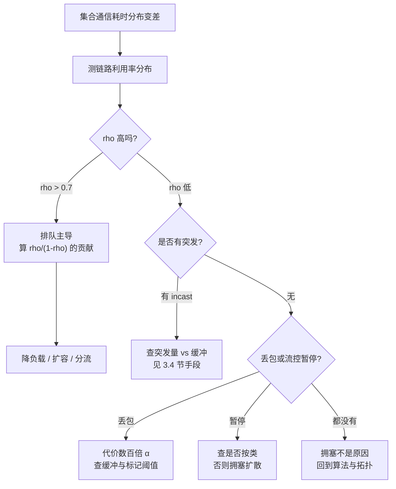

# 拥塞控制、incast 与 tail latency

> 位置：[InferenceAtlas](../../INDEX.md) > [模块 08](README.md) > 当前文档
> 信息截至：2026-07-31 ｜ 最后核验：2026-07-31 ｜ 内容版本：v0.1
> 时效性等级：低（排队论与机制部分）
> 相关主题：[推理网络总览](01_inference_networking_overview.md)｜[网络拓扑](07_network_topologies_fat_tree_dragonfly_rail_optimized.md)｜[推理排队论](../01_foundations_and_metrics/03_queueing_theory_for_inference.md)

## 本章导读

[第 7 章](07_network_topologies_fat_tree_dragonfly_rail_optimized.md) 指出争用是拓扑影响推理的主要途径。
**本章说明争用的代价为什么如此之大，答案来自排队论**。

链路利用率 $\rho$ 下的排队时延放大是 $\frac{\rho}{1-\rho}$。
把它代入 [第 1 章](01_inference_networking_overview.md) 的每 token $2L$ 次通信：

| 链路利用率 | 排队额外占 TPOT |
|---:|---:|
| 0.50 | 8.4% |
| 0.70 | 19.6% |
| 0.85 | **47.5%** |
| 0.95 | **159.4%** |

**这张表给出本章最重要的结论**：
**推理网络不能跑在高利用率上**。
$\rho = 0.85$ 在多数系统里被认为是「健康」的，
**但它已经吃掉近一半的 token 时延预算**。

这与成本优化的直觉相反——
**利用率是成本指标，但对时延而言它是风险指标**。

**关于本章数字的说明**：
链路参数沿用 [第 1 章第 2.2 节](01_inference_networking_overview.md) 的假设值，
重传超时等参数同为演示设定，**不对应任何具体产品或协议**。
受当前环境的网络出口策略限制（详见 [AGENTS.md 第 11 节](../../AGENTS.md)），
本库无法访问标准组织文本，
**因此本章只讨论拥塞控制的机制类别，不点名任何具体协议**；
具名协议属于[受阻的第 4 章](README.md)。

## 学习目标

读完本章后，读者应能够：

1. 把链路利用率经 $\frac{\rho}{1-\rho}$ 换算成 token 时延的额外占比
2. 说明为什么 all-to-all 在结构上就是一次 incast，并算出其突发量与缓冲需求
3. 比较端到端标记式与逐跳暂停式两类拥塞控制的失效方式
4. 解释为什么一次超时重传的代价是 $\alpha$ 的数百到数万倍，以及它如何主导尾部
5. 按流量类型设计 QoS 分类，并说明为什么 TP 集合通信与 KV 传输必须分开

## 核心结论

- **排队放大 $\frac{\rho}{1-\rho}$ 在 $\rho=0.85$ 时已达 5.67 倍**，折算到每 token 是 47.5% 的 TPOT 预算。
- **推理网络的目标利用率应显著低于通用网络**：这不是浪费，是时延预算的必要条件。
- **all-to-all 是 degree $P-1$ 的 incast**：$P=64$ 时单个接收端同时面对 63 个发送方。
- **一次超时重传的代价是 $\alpha$ 的 40–40,000 倍**，因此「偶尔丢一个包」在推理里不是小事。
- **逐跳暂停式流控会把拥塞向上游扩散**，使无关流量一同受害——它用丢包换成了阻塞。
- **TP 集合通信与 KV 传输的网络要求相反**（时延 vs 带宽），必须放在不同的流量类中。

## 1. 问题定义、系统边界与工作负载

### 1.1 拥塞在推理中的特殊后果

**通用服务里，拥塞的后果是「某些请求变慢」**。
**推理 decode 里不是**：

由 [第 1 章第 2.6 节](01_inference_networking_overview.md)，
每个 token 要经过 $2L$ 次集合通信，
而集合通信取所有参与者中最慢的一个。
**因此一次局部拥塞会影响整个并行组的每一个 token**。

| | 通用服务 | 推理 decode |
|---|---|---|
| 影响范围 | 经过该链路的请求 | **整个并行组的全部请求** |
| 时间尺度 | 单次请求 | **每 token 重复一次** |
| 放大 | 无 | $2L$ 次取最大 |

### 1.2 三类拥塞来源

| 来源 | 机制 | 典型场景 |
|---|---|---|
| **持续过载** | 平均到达率接近容量 | 利用率规划过高 |
| **incast** | 多对一的瞬时汇聚 | **all-to-all、reduce** |
| **邻居干扰** | 无关流量占用共享链路 | 多租户、混部 |

**第二行是集合通信自带的**，无法通过降低负载消除——
**它是通信模式的结构性质**（第 2.2 节）。

## 2. 原理、数学与性能模型

### 2.1 排队放大

由 [模块 01 第 3 章](../01_foundations_and_metrics/03_queueing_theory_for_inference.md)，
M/M/1 排队的平均等待时间与服务时间之比为

$$\frac{W}{S} = \frac{\rho}{1-\rho}$$

| $\rho$ | $\frac{\rho}{1-\rho}$ |
|---:|---:|
| 0.50 | 1.00 |
| 0.70 | 2.33 |
| 0.85 | 5.67 |
| 0.90 | 9.00 |
| 0.95 | 19.00 |
| 0.99 | 99.00 |

**换算到 token 时延**（$D=512$ KiB、$\beta=50$ GB/s，
故单条消息服务时间 $S = 10.5$ μs；$L=80$，每 token $2L=160$ 次）：

| $\rho$ | 每次排队 | 每 token 额外 | 占 20 ms TPOT |
|---:|---:|---:|---:|
| 0.50 | 10.5 μs | 1.68 ms | 8.4% |
| 0.70 | 24.5 μs | 3.91 ms | 19.6% |
| 0.85 | 59.4 μs | 9.51 ms | **47.5%** |
| 0.95 | 199.2 μs | 31.88 ms | **159.4%** |

**$\rho = 0.95$ 时排队本身就超过了整个 TPOT 预算**。

**这个结果的实践含义**：

| 通常的做法 | 对推理的后果 |
|---|---|
| 把利用率提到 0.8–0.9 以摊薄成本 | **吃掉近一半的时延预算** |
| 用平均利用率评估健康度 | **平均值掩盖瞬时排队** |
| 在时延变差时先怀疑带宽不足 | **可能只是利用率太高** |

**注意最后一行**：
$\rho$ 高既可以是「负载大」也可以是「容量小」，
**但解决方式不同**——前者要限流或分流，后者要扩容。
**先分清是哪个**。

### 2.2 all-to-all 就是 incast

**incast 指多个发送方同时向同一接收方发送**，
瞬时到达率远超接收链路容量，依赖缓冲吸收。

**all-to-all 在结构上必然是 incast**：
每个节点同时从其余 $P-1$ 个节点接收。

| $P$ | 并发发送方 | 突发量（单条 64 KiB） |
|---:|---:|---:|
| 8 | 7 | 0.4 MiB |
| 16 | 15 | 0.9 MiB |
| 32 | 31 | 1.9 MiB |
| 64 | 63 | **3.9 MiB** |

**无损吸收的条件是缓冲 $\ge$ 突发量**：

$$B \ge (P-1) \cdot s_{\text{msg}}$$

**这个需求随 $P$ 线性增长**，
而交换机缓冲是固定且昂贵的资源。
**因此 MoE 的专家并行度存在一个由缓冲决定的上界**——
超过之后要么丢包重传，要么触发流控（第 2.4 节），两者都很贵。

**对比 ring all-reduce**：
每个节点在每一步**只从一个邻居接收**，
**incast degree 恒为 1，与 $P$ 无关**。

| 操作 | incast degree | 随 $P$ |
|---|---:|---|
| ring all-reduce | 1 | **不变** |
| RHD all-reduce | 1（每步一个伙伴） | 不变 |
| **all-to-all** | $P-1$ | **线性增长** |

**这是 [第 5 章](05_collectives_rdma_and_communication_libraries.md) 中
「MoE 对网络比 TP 更敏感」这一论断的第二个原因**
（第一个是消息更小、更靠近时延侧）。

### 2.3 重传的代价

**丢包在推理网络里的代价与在通用网络里不是一个量级**：

| 一次超时重传 | 相当于多少倍 $\alpha$（$\alpha=5$ μs） |
|---:|---:|
| 0.2 ms | 40× |
| 1 ms | 200× |
| 10 ms | 2,000× |
| 200 ms | **40,000×** |

**因为超时重传的时间尺度由协议的超时设定决定，而不是由链路时延决定**，
所以它与 $\alpha$ 之间有几个数量级的鸿沟。

**结合 [第 1 章第 2.6 节](01_inference_networking_overview.md) 的 $2L$ 放大**：

| 单次异常率 $p$ | 每 token 至少一次 |
|---:|---:|
| $10^{-5}$ | 0.2% |
| $10^{-4}$ | 1.6% |
| $10^{-3}$ | **14.8%** |
| $10^{-2}$ | **80.0%** |

**千分之一的丢包率，配上毫秒级的重传，就足以毁掉 P99**：
14.8% 的 token 会碰上至少一次，每次多付几百倍 $\alpha$。

**这是推理网络倾向于无损传输的原因**——
不是因为丢包本身可怕，而是因为**恢复机制的时间尺度与 $\alpha$ 不匹配**。

### 2.4 两类拥塞控制机制

**本节只讨论机制类别，不点名具体协议**（见导读的说明）。

| | 端到端标记式 | 逐跳暂停式 |
|---|---|---|
| 触发 | 交换机在队列超阈值时给包打标记 | 下游缓冲将满时向上游发暂停 |
| 反应者 | **发送方**降低速率 | **上游链路**停止发送 |
| 反应时延 | 一个往返 | **一跳** |
| 是否丢包 | 可能（若反应不及） | **不丢** |
| 失效方式 | 反应慢，突发已经发生 | **拥塞向上游扩散** |

**两者的失效方式是本节的重点**：

**端到端标记式的问题是时间常数**：
反应需要一个往返，
而 incast 的突发在一个往返内就完成了。
**对 all-to-all 这种瞬时突发，端到端反馈基本来不及**。

**逐跳暂停式的问题是扩散**：
暂停一条链路会停下**该链路上的全部流量**，
包括与拥塞无关的流。
被暂停的上游随即自己缓冲变满，再向它的上游发暂停——
**拥塞由此逆流扩散，可能波及远离原始拥塞点的部分**。

| | 丢包 | 阻塞 |
|---|---|---|
| 端到端标记式 | **可能** | 否 |
| 逐跳暂停式 | 否 | **可能扩散** |

**因此这不是「哪个更好」的问题，而是「用丢包换阻塞」的取舍**：

- **丢包**的代价集中且巨大（第 2.3 节的数百倍 $\alpha$），但影响范围局限；
- **阻塞**的代价分散且较小，但**影响范围可能远超拥塞点**。

**在 $2L$ 放大的作用下，「影响范围广」通常比「单次代价大」更糟**——
因为集合通信取最慢者，波及范围广意味着几乎必然命中。

### 2.5 头端阻塞

**逐跳暂停式的扩散有一个更细的机制值得单独说明**。

如果暂停作用于整条链路而不区分流量类型，
**一条被拥塞的流会连累同一链路上的其他流**——
即使那些流的目的地毫无拥塞。

**这直接违背了第 3.2 节的 QoS 目标**：
把不同要求的流量分类，本意是让它们互不干扰，
**但链路级的暂停会把它们重新耦合起来**。

**因此流控的粒度必须与 QoS 的粒度一致**：
**若按流量类分了优先级，流控也必须按类进行**，
否则分类形同虚设。

**图解读**：

1. **本图展示什么**：两类机制各自的失效条件与失效后果。
   **两条失效路径是不同性质的**：
   一条是时间常数不匹配，一条是隔离粒度不足。
2. **核心瓶颈**：瓶颈在两个判定点 E 与 H，
   **它们都不是「机制好不好」的问题，而是「机制与负载/配置是否匹配」**。
   端到端标记式对 incast 失效不是实现缺陷，是原理限制。
3. **图中的 trade-off**：终点是「丢包」与「阻塞」的取舍。
   **在 $2L$ 放大下，影响范围广比单次代价大更糟**——
   因为集合通信取最慢者，范围广意味着几乎必然命中。
4. **面试如何引用**：可以说
   「端到端反馈需要一个往返，而 incast 的突发在一个往返内就完成了，
   **所以对 all-to-all 这类瞬时突发它原理上来不及**；
   逐跳暂停反应快但会向上游扩散，
   **而且如果暂停不区分流量类，QoS 分类就形同虚设**」。

## 3. 实现机制与系统设计

### 3.1 目标利用率

由第 2.1 节，**推理网络的目标利用率应显著低于通用网络**：

| 目标 | 建议 $\rho$ | 排队占 TPOT |
|---|---:|---:|
| 严格时延（低 TPOT 目标） | $\le 0.5$ | ~8% |
| 一般交互式 | $\le 0.7$ | ~20% |
| 吞吐优先（批量） | 可到 0.85+ | 47%+，但批量不在乎 |

**这不是浪费，是时延预算的组成部分**。
**把它写进容量规划，而不是事后发现**——
容量规划方法见 [模块 01 第 8 章](../01_foundations_and_metrics/08_capacity_planning.md)。

**这些数值是本库为便于判断而设的分界，不是任何标准的规定**。

### 3.2 按流量类型分类

由 [第 1 章第 3.1 节](01_inference_networking_overview.md)，
不同流量对网络的要求相反：

| 流量 | 主要要求 | 应有的处理 |
|---|---|---|
| TP 集合通信 | **低时延、低抖动** | 最高优先级、浅队列 |
| MoE all-to-all | 低时延 + 抗 incast | 高优先级、**足够缓冲** |
| PP 激活传递 | 中 | 中优先级 |
| KV 传输 | **高带宽**，可容忍时延 | 低优先级、**深队列** |
| 控制面与观测 | 低带宽、需可达 | 独立小额保障 |

**第一行与第四行的处理方式恰好相反**：
**浅队列对时延好、对吞吐差；深队列相反**。
**把它们放在同一个类里，必然牺牲其中之一**——
这就是必须分类的原因。

**分类必须贯穿到流控粒度**（第 2.5 节），
否则链路级的暂停会把它们重新耦合。

### 3.3 缓冲的两难

| 缓冲 | 有利于 | 不利于 |
|---|---|---|
| 深 | 吸收 incast 突发、提高吞吐 | **排队时延（第 2.1 节）** |
| 浅 | 低时延 | **incast 时溢出丢包** |

**这两个需求在推理里同时存在**：
TP 需要浅（时延），all-to-all 需要深（抗突发）。
**分类是唯一的解**——
用不同的队列服务不同的类，各自取合适的深度。

**这也说明「加大缓冲」不是一个普遍正确的建议**：
它改善 incast，**但恶化 TP 的排队时延**，
而 TP 的频率是每层每 token。

### 3.4 降低 incast 的手段

| 手段 | 机制 | 代价 |
|---|---|---|
| 降低 EP 度 | 直接减小 degree $P-1$ | 专家并行受限 |
| 分阶段 all-to-all | 把一次全局交换拆成多轮 | **增加步数（时延）** |
| 发送侧错峰 | 让发送方按顺序而非同时发 | 同上 |
| 层次化 all-to-all | 先组内再组间 | 减少跨层并发数 |

**第二、三行的共同代价是把带宽问题换成时延问题**——
**这只在原本处于带宽/缓冲受限时才划算**。
按 [第 1 章第 2.2 节](01_inference_networking_overview.md) 的半功率判据先确认落在哪一侧。

### 3.5 观测什么

**拥塞问题最难的部分是它在平均值里看不见**。

| 指标 | 为什么必须看 |
|---|---|
| 链路利用率的**分布**而非均值 | 瞬时峰值决定排队 |
| 队列深度的高分位 | 直接对应排队时延 |
| 丢包与重传计数 | 第 2.3 节的代价放大 |
| 流控暂停的次数与时长 | 逐跳暂停式的扩散证据 |
| **集合通信耗时的分布** | 最终指标，其余都是解释 |

**最后一行是唯一直接对应用户体验的**，
其余各行的作用是**解释它为什么差**。
**因此排查顺序应当是先看最后一行，再用前几行定位**。

## 4. 性能、成本、能耗与可靠性 trade-off

### 4.1 利用率与成本

| | 高利用率 | 低利用率 |
|---|---|---|
| 单位成本 | **低** | 高 |
| 时延 | **差**（$\frac{\rho}{1-\rho}$） | 好 |
| 突发承受力 | **差** | 好 |
| 故障时的余量 | **无** | 有 |

**第四行常被忽略**：
$\rho = 0.85$ 时若损失一部分容量，
剩余部分的 $\rho$ 会跳到接近 1，
**排队时延爆炸式增长**。
**因此高利用率同时放大了故障的后果**——
这与 [模块 09 第 7 章](../09_datacenter_power_thermal_and_operations/07_reliability_redundancy_and_maintenance.md)
的容错利用率上界 $(R-1)/R$ 是同一个约束的两种表述。

### 4.2 无损与有损

| | 无损（逐跳流控） | 有损（丢包重传） |
|---|---|---|
| 单次异常代价 | 小（阻塞） | **大（数百倍 $\alpha$）** |
| 影响范围 | **可能很广**（扩散） | 局限 |
| 配置复杂度 | **高**（需调流控参数） | 低 |
| 对 $2L$ 放大的表现 | 范围广 → 几乎必然命中 | 概率低但代价高 |

**没有一个选择在所有维度上占优**，
而 $2L$ 放大使「范围」这个维度的权重比通常更高。

### 4.3 QoS 分类的代价

| | 分类 | 不分类 |
|---|---|---|
| 时延与带宽可同时满足 | **是** | 否 |
| 配置与运维复杂度 | **高** | 低 |
| 误配置的后果 | **可能比不分类更差** | — |

**第三行是一个真实的风险**：
分了优先级但流控不按类进行（第 2.5 节），
或把 KV 传输误配到高优先级，
**都会得到比不分类更差的结果**。
**分类的前提是能够验证它确实生效**——
验证方法见第 5 节的核查表。

## 5. benchmark、真实案例或公开部署案例

**本章不点名任何拥塞控制协议，也不给出任何产品或部署的实测数字**。

受当前环境的网络出口策略限制（详见 [AGENTS.md 第 11 节](../../AGENTS.md)），
本库无法访问标准组织文本或厂商文档，**因此无法核验任何一项**。
第 2 节的排队论结果由 M/M/1 模型推出；其余参数为演示用假设值，已在导读中声明。

**读者应在自己集群上完成的测量**：

| 项 | 你的值 | 方法 | 披露标签 |
|---|---|---|---|
| 链路利用率的**分布**（非均值） | 待填 | 高频采样 | `独立可复现实验` |
| **由 $\rho$ 推出的排队占比** | 待填 | **$\frac{\rho}{1-\rho}\cdot S \cdot 2L / \text{TPOT}$** | 推出 |
| 队列深度的 P99 | 待填 | 交换机计数器 | `独立可复现实验` |
| 丢包率与重传次数 | 待填 | 计数器 | `独立可复现实验` |
| **单次超时重传的实际时长** | 待填 | **抓包或计数器，不要用默认值** | `独立可复现实验` |
| 流控暂停的次数与时长 | 待填 | 计数器 | `独立可复现实验` |
| all-to-all 的 incast degree | 待填 | $P-1$ | 推出 |
| 突发量与交换机缓冲之比 | 待填 | 上行 ÷ 缓冲规格 | 推出 |
| 拥塞控制的机制类别 | 标记式/暂停式 | 平台事实 | `官方披露` |
| **流控是否按流量类进行** | 是/否 | **平台事实；不按类则分类失效** | `官方披露` |
| QoS 分类的实际映射 | 待填 | **查实际标记，不要查配置意图** | `独立可复现实验` |
| **集合通信耗时的分布** | 待填 | **最终指标** | `独立可复现实验` |

**加粗的四行是本章的核心**：
排队占比是最重要的推出量，
而「流控是否按类」与「QoS 实际映射」是最容易与意图不符的两项。

> 测量方法论的通用要求见
> [推理 benchmark 方法论](../11_benchmarking_reliability_and_observability/01_inference_benchmarking_methodology.md)。

## 6. 设计决策框架

**图解读**：

1. **本图展示什么**：从最终指标出发的排查树，
   **入口是集合通信耗时的分布而不是任何网络计数器**。
   网络指标的作用是解释，不是判定。
2. **核心瓶颈**：判定点 C 分出两条性质不同的路径——
   **高 $\rho$ 是容量问题（持续），突发是模式问题（瞬时）**。
   两者的手段完全不同，混淆会导致扩容也解决不了突发。
3. **图中的 trade-off**：F 的三个手段代价递增
   （限流影响吞吐、分流增加复杂度、扩容花钱），
   **应按此顺序尝试**；而 G 的手段大多是拿时延换带宽，
   **只在确实处于带宽/缓冲受限侧时划算**。
4. **面试如何引用**：可以说
   「我会先看集合通信耗时的分布，再用网络计数器解释它。
   $\rho > 0.7$ 就先算 $\frac{\rho}{1-\rho}$ 的贡献——
   **$\rho=0.85$ 在我的算例里就吃掉 47.5% 的 TPOT 预算**；
   $\rho$ 不高就查突发和 incast，
   **因为 all-to-all 在结构上就是 degree $P-1$ 的 incast**」。

**判定标准**：

| 观察 | 结论 |
|---|---|
| $\rho > 0.7$ | 排队已显著，**先降 $\rho$** |
| $\rho$ 低但耗时分布尾巴长 | 突发或 incast |
| 突发量 > 缓冲 | **必然溢出**，按 3.4 节处理 |
| 有丢包 | 代价数百倍 $\alpha$，优先消除 |
| 有流控暂停且不按类 | **拥塞会扩散**，QoS 形同虚设 |
| 以上都正常 | 拥塞不是原因，回到 [第 5](05_collectives_rdma_and_communication_libraries.md)、[第 7 章](07_network_topologies_fat_tree_dragonfly_rail_optimized.md) |

## 7. 常见失败模式与排查路径

| 症状 | 首先怀疑 | 检查 |
|---|---|---|
| 时延随负载非线性恶化 | **排队 $\frac{\rho}{1-\rho}$** | 利用率分布 |
| 平均利用率不高但时延差 | 瞬时突发 | 高频采样而非均值 |
| MoE 模型出现周期性尖峰 | **all-to-all 的 incast** | 突发量 vs 缓冲 |
| 损失部分容量后时延爆炸 | $\rho$ 跳到接近 1 | 第 4.1 节 |
| 拥塞点很远但本地也受影响 | **逐跳暂停的扩散** | 流控暂停计数与传播路径 |
| 分了 QoS 但没效果 | 流控不按类 | 第 2.5 节 |
| P99 极差而 P50 正常 | 重传 | 丢包与重传计数 |
| 加大缓冲后 TP 反而变慢 | **深队列增加排队时延** | 第 3.3 节 |
| 扩容后突发问题依旧 | 扩容解决持续过载，**不解决瞬时突发** | 区分两类来源 |

**最后一行是本章最值得记住的诊断区分**：
**持续过载与瞬时突发是两类问题**，
扩容对前者有效、对后者几乎无效。
**而两者在平均利用率上可能看起来一样**。

## 8. 关联面试主题

- 排队放大与目标利用率 → [模块 17 系统设计题](../17_interview_prep/01_inference_system_design.md)
- all-to-all 的 incast 性质 → [模块 17 分布式与 MoE 题](../17_interview_prep/05_distributed_and_moe_questions.md)
- 尾部时延与重传代价 → [模块 17 调试与 benchmark 题](../17_interview_prep/07_debug_benchmark_and_reliability_questions.md)
- QoS 分类与流控粒度 → [模块 17 serving 与 SLO 题](../17_interview_prep/03_serving_scheduling_and_slo_questions.md)

## 9. 小结

**本章用排队论解释了 [第 7 章](07_network_topologies_fat_tree_dragonfly_rail_optimized.md) 中「争用代价极大」这一观察**：

- **$\frac{\rho}{1-\rho}$ 在 $\rho=0.85$ 时是 5.67 倍**，
  经每 token $2L$ 次通信放大后是 **47.5% 的 TPOT 预算**；
  $\rho=0.95$ 时达到 159%，**已不可行**。
- **因此推理网络的目标利用率应显著低于通用网络**。
  这与成本优化的方向相反：
  **利用率是成本指标，但对时延而言是风险指标**。

**三个结构性事实**：

1. **all-to-all 在结构上就是 degree $P-1$ 的 incast**，
   缓冲需求随 $P$ 线性增长；
   而 ring/RHD 的 incast degree 恒为 1。
   **这是 MoE 比 TP 更受网络影响的第二个原因**。
2. **一次超时重传是 $\alpha$ 的 40–40,000 倍**——
   两者的时间尺度不匹配，
   **所以推理网络倾向无损不是因为丢包可怕，而是因为恢复太慢**。
3. **逐跳暂停式流控把丢包换成了扩散**。
   在 $2L$ 放大下，**影响范围广通常比单次代价大更糟**，
   因为集合通信取最慢者。

**两条容易做错的事**：

- **「加大缓冲」不是普遍正确的建议**：
  它改善 incast 但恶化 TP 的排队时延，而 TP 每层每 token 都要付。
  **正解是分类，不是统一加深**。
- **分了 QoS 但流控不按类，等于没分**：
  链路级暂停会把已分开的流量重新耦合。

**最后是一条诊断纪律**：
**持续过载与瞬时突发在平均利用率上可能看起来一样，但扩容只对前者有效**。
先分清是哪一类，再决定手段。

## 关键术语

| 中文术语 | 英文 | 定义 | 单位/口径 | 关联文档 |
|---|---|---|---|---|
| 排队放大 | queueing amplification | $\frac{\rho}{1-\rho}$，等待与服务时间之比 | 无量纲 | 本章 2.1 |
| incast | incast | 多发送方同时向同一接收方汇聚 | degree | 本章 2.2 |
| incast degree | incast degree | 并发发送方数；all-to-all 为 $P-1$，ring 为 1 | — | 本章 2.2 |
| 端到端标记式 | end-to-end marking | 交换机打标记、发送方降速；**反应需一个往返** | — | 本章 2.4 |
| 逐跳暂停式 | hop-by-hop pause | 下游满时暂停上游；**不丢包但会扩散** | — | 本章 2.4 |
| 拥塞扩散 | congestion spreading | 暂停逆流传播，波及无关流量 | — | 本章 2.4 |
| 头端阻塞 | head-of-line blocking | 一条流阻塞同链路上的其他流 | — | 本章 2.5 |
| 流控粒度 | flow-control granularity | 流控作用的单位；**须与 QoS 分类一致** | — | 本章 2.5 |

## 延伸阅读

- [推理网络总览](01_inference_networking_overview.md)
- [网络拓扑：fat-tree、dragonfly 与 rail 优化](07_network_topologies_fat_tree_dragonfly_rail_optimized.md)
- [推理排队论](../01_foundations_and_metrics/03_queueing_theory_for_inference.md)
- [容量规划](../01_foundations_and_metrics/08_capacity_planning.md)
- [多租户隔离与 QoS](../03_serving_engines_and_scheduling/06_multi_tenant_isolation_and_qos.md)
- [MoE 路由与 all-to-all](../06_distributed_and_moe_inference/06_moe_routing_all_to_all_and_load_balancing.md)

## 主要来源

本章由 M/M/1 排队模型、
incast 的结构分析（all-to-all 的并发发送方数由操作定义直接推出）、
以及 [第 1 章](01_inference_networking_overview.md) 的 $2L$ 放大与 TPOT 换算推导而成。

**不点名任何拥塞控制协议，不含任何产品或部署的实测数字**。
受当前环境的网络出口策略限制，本库无法访问标准组织文本或厂商文档
（详见 [AGENTS.md 第 11 节](../../AGENTS.md)）。
**具名协议属于受阻的第 4 章**，见 [模块 README](README.md)。

| 类别 | 说明 | 披露标签 |
|---|---|---|
| 排队放大 $\frac{\rho}{1-\rho}$ | M/M/1 的标准结果 | — |
| all-to-all 的 incast degree $P-1$ | 由操作定义推出 | — |
| 两类拥塞控制的失效方式 | 由机制结构推出，**不指向任何具体协议** | — |
| 第 2 节各算例的链路与超时参数 | **为演示设定的假设值** | — |
| 第 3.1、6 节的阈值 | **本库为便于判断而设的分界，非标准规定** | — |
| 读者自身集群的测量 | 应自行实测 | `独立可复现实验` |
| 任何具名协议的行为与产品实测数字 | **本章未给出** | `待核实` |

## 更新记录

| 日期 | 版本 | 变更 | 核验人 |
|---|---|---|---|
| 2026-07-31 | v0.1 | 初稿：排队放大对 TPOT 的换算、推理网络的目标利用率、all-to-all 的 incast 性质与缓冲需求、重传代价与 $2L$ 放大、两类拥塞控制的失效方式、流控粒度与 QoS 分类的一致性要求 | — |
