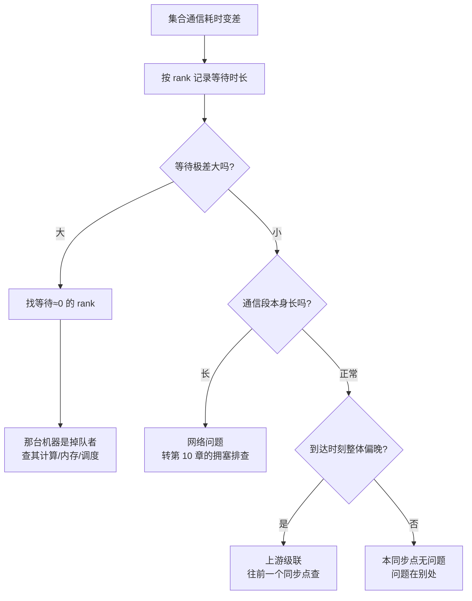

# 网络可观测性与排查

> 位置：[InferenceAtlas](../../INDEX.md) > [模块 08](README.md) > 当前文档
> 信息截至：2026-07-31 ｜ 最后核验：2026-07-31 ｜ 内容版本：v0.1
> 时效性等级：低（方法论部分）
> 相关主题：[推理网络总览](01_inference_networking_overview.md)｜[拥塞与 tail latency](10_network_congestion_tail_latency_and_qos.md)｜[可观测性：指标、日志与追踪](../11_benchmarking_reliability_and_observability/07_observability_metrics_logs_traces.md)

## 本章导读

网络侧的计数器很多，**但没有一个直接回答工程上真正的问题**：
**这次集合通信慢，是网络的问题，还是某个参与者的问题？**

这个区分至关重要，因为两者的处理方式毫无交集：
前者要动网络，后者要查那台机器上的计算、内存或调度。
**而在集合通信里，两者的表面症状完全相同——所有 rank 都报告「这次通信很慢」**。

本章给出一个可以当场执行的判别方法：
**按 rank 记录「在集合通信里等了多久」，看这些等待时长的极差**。

| 观察 | 结论 |
|---|---|
| 等待极差大，且有一个 rank 等待 ≈ 0 | **那个 rank 就是掉队者** |
| 等待极差小，通信段本身长 | **网络** |
| 等待极差小、通信段正常，但整体偏晚 | **上游级联**，往前一个同步点查 |

**第一行的判据是反直觉的**：
**等待最短的那个 rank 是罪魁祸首，不是最快的那个**。
因为集合通信取最慢者，掉队者一到就开始通信，它自己不需要等。

**关于本章数字的说明**：
本章的时间数值均为演示判别方法而设的假设值，**不对应任何真实系统**。
受当前环境的网络出口策略限制（详见 [AGENTS.md 第 11 节](../../AGENTS.md)），
本库无法访问厂商文档或工具资料，
**因此本章不点名任何具体的监控工具、计数器名称或平台特性**。
本章讨论的是**方法**，它与工具无关。

## 学习目标

读完本章后，读者应能够：

1. 用逐 rank 的等待时长极差把「网络慢」「单点掉队」「上游级联」三者区分开
2. 说明为什么等待最短的 rank 是掉队者，而不是最快的
3. 设计集合通信的埋点位置，并说明为什么必须分「等待段」与「通信段」
4. 列出计数器类指标的三个常见解读陷阱
5. 按「先看最终指标、再用网络指标解释」的顺序组织排查

## 核心结论

- **网络计数器不回答「网络是不是瓶颈」**，它们只在你已经知道答案后用来解释原因。
- **逐 rank 的等待时长是区分网络与掉队者的唯一低成本手段**，且**等待最短者即掉队者**。
- **埋点必须把「等待」与「通信」分开**，合成一个数会使三种情形不可区分。
- **均值在这里几乎无用**：$2L$ 放大使尾部主导体验，必须看分布。
- **计数器是累积量**，直接读取会把历史累积误读为当前状态；必须取速率并处理重置。
- **上游级联会让每一个同步点看起来都正常**——只能靠跨同步点的时间对齐发现。

## 1. 问题定义、系统边界与工作负载

### 1.1 要回答的问题

排查推理网络时，实际要依次回答的是三个问题：

| # | 问题 | 用什么回答 |
|---:|---|---|
| 1 | 网络是不是瓶颈？ | **集合通信耗时占 TPOT 的比例**（[第 1 章](01_inference_networking_overview.md)） |
| 2 | 慢的是网络还是某个参与者？ | **逐 rank 等待时长的极差**（本章第 2 节） |
| 3 | 网络为什么慢？ | 链路计数器、队列深度、丢包（[第 10 章](10_network_congestion_tail_latency_and_qos.md)） |

**顺序不能颠倒**：
问题 3 的指标数量最多、最容易获得，
**但在问题 1、2 未答之前看它们，几乎必然得出错误归因**——
任何繁忙系统的网络计数器上都能找到「看起来不对」的数字。

### 1.2 为什么集合通信难以归因

**集合通信的完成时间取决于最后一个到达者**：

$$T_{\text{完成}} = \max_i(t_i) + T_{\text{通信}}$$

其中 $t_i$ 是 rank $i$ 到达该同步点的时刻。

**所有 rank 观察到的完成时刻相同**，
因此「这次通信耗时 $X$」这个观察对全体一致，
**无法从中区分是 $\max_i(t_i)$ 大还是 $T_{\text{通信}}$ 大**。

**这就是必须分开埋点的原因**（第 3.1 节）。

## 2. 原理、数学与性能模型

### 2.1 等待时长

定义 rank $i$ 的**等待时长**为

$$w_i = \max_j(t_j) - t_i$$

即它到达同步点后，等待其余各方所花的时间。

**三个性质**：

1. $\min_i w_i = 0$，取到最小值的就是最后到达者；
2. $\max_i w_i$ 等于最早与最晚到达者的时差；
3. **极差 $\max_i w_i - \min_i w_i$ 度量的是参与者之间的不齐整程度**。

### 2.2 三种情形的判别

**三个算例的总耗时相近，成因完全不同**（时间为假设值，$P=8$）：

**情形 A：单点掉队**（rank 3 晚到 60 μs）

| rank | 0 | 1 | 2 | 3 | 4 | 5 | 6 | 7 |
|---|---:|---:|---:|---:|---:|---:|---:|---:|
| 到达时刻 (μs) | 0 | 1 | 0.5 | **60** | 1 | 0.5 | 1 | 0.5 |
| 等待时长 (μs) | 60 | 59 | 59.5 | **0** | 59 | 59.5 | 59 | 59.5 |

极差 **60.0** μs，通信段 22.0 μs，总计 82.0 μs。

**情形 B：网络整体变慢**（到达齐整，通信段长）

| rank | 0 | 1 | 2 | 3 | 4 | 5 | 6 | 7 |
|---|---:|---:|---:|---:|---:|---:|---:|---:|
| 到达时刻 (μs) | 0 | 1 | 0.5 | 1 | 1 | 0.5 | 1 | 0.5 |
| 等待时长 (μs) | 1 | 0 | 0.5 | 0 | 0 | 0.5 | 0 | 0.5 |

极差 **1.0** μs，通信段 **82.0** μs，总计 83.0 μs。

**情形 C：上游级联**（全体都晚，但彼此齐整）

| rank | 0 | 1 | 2 | 3 | 4 | 5 | 6 | 7 |
|---|---:|---:|---:|---:|---:|---:|---:|---:|
| 到达时刻 (μs) | 58 | 59 | 58.5 | 60 | 59 | 58.5 | 59 | 58.5 |
| 等待时长 (μs) | 2 | 1 | 1.5 | 0 | 1 | 1.5 | 1 | 1.5 |

极差 **2.0** μs，通信段 22.0 μs，**本同步点看起来完全正常**。

**判别表**：

| 等待极差 | 通信段 | 结论 |
|---|---|---|
| **大** | 正常 | **单点掉队**：等待 ≈ 0 的那个 rank |
| 小 | **长** | **网络** |
| 小 | 正常，但整体时刻偏晚 | **上游级联**，往前一个同步点查 |
| 大 | 长 | 两个问题同时存在，先修掉队者 |

**情形 C 是最难发现的**：
**它在本同步点的所有指标上都正常**。
只有把时刻与上一个同步点对齐，才能看出「大家都晚了 58 μs 才到」。
**这要求埋点带绝对时刻而不只是耗时**（第 3.1 节）。

**图解读**：

1. **本图展示什么**：一个三分支的判别树，
   **三条分支导向三个毫不相干的排查方向**：
   一台机器、网络、以及上一个同步点。
   **走错分支的代价不是效率低，而是完全找不到**。
2. **核心瓶颈**：判定点 C 是全图的关键，
   而它依赖一个通常不存在的埋点——**逐 rank 的等待时长**。
   多数系统只记录集合通信的总耗时，
   **而总耗时对三种情形是无法区分的**（第 1.2 节）。
3. **图中的 trade-off**：增加逐 rank 埋点会带来开销与数据量，
   换来的是把三种情形分开的能力。
   **这个取舍几乎总是划算的**，因为埋点可以采样而误判不能。
4. **面试如何引用**：可以说
   「集合通信的完成时间是 $\max_i(t_i) + T_{\text{通信}}$，
   所有 rank 看到的完成时刻一样，
   **所以光看总耗时区分不了『网络慢』和『某台机器掉队』**。
   我会按 rank 记等待时长看极差，
   **而且等待最短的那个 rank 才是掉队者**——
   因为它一到大家就开始通信，它自己不用等」。

### 2.3 为什么必须看分布

由 [第 1 章第 2.6 节](01_inference_networking_overview.md)，
单次异常率 $p$ 经每 token $2L$ 次通信放大为 $1-(1-p)^{2L}$。

| $p$ | $L=80$ 时受影响的 token |
|---:|---:|
| $10^{-4}$ | 1.6% |
| $10^{-3}$ | 14.8% |
| $10^{-2}$ | 80.0% |

**这意味着一个在均值上完全看不出来的异常率，可以主导用户体验**：
$p = 10^{-3}$ 对均值的影响可以忽略，
**但它让近 15% 的 token 至少碰上一次**。

**因此集合通信耗时必须以分布记录，且分位数需配样本量**——
分位数与样本量的口径要求见
[模块 11 第 3 章](../11_benchmarking_reliability_and_observability/03_ttft_tpot_itl_and_end_to_end_latency.md)。

## 3. 实现机制与系统设计

### 3.1 埋点位置

**最小可用的埋点是三个时刻**：

| 埋点 | 记录什么 | 用途 |
|---|---|---|
| $t_i$：进入集合通信调用 | **绝对时刻**（非耗时） | 算等待时长、对齐上游 |
| 通信实际开始 | 绝对时刻 | 分离等待段与通信段 |
| 通信结束 | 绝对时刻 | 通信段时长 |

**三点缺一不可**：

- 缺第一点，算不出等待时长 → 情形 A 与 B 不可区分；
- 缺第二点，等待与通信混在一起 → 同上；
- **只记耗时不记绝对时刻，情形 C 无法发现**（第 2.2 节）。

**「实际开始」这一点在多数库里不直接暴露**，
可以用同步屏障近似：
在集合通信前插入一次轻量的对齐操作，
**它的完成时刻即近似所有 rank 都已到达的时刻**。
**代价是多一次同步**，因此这通常作为诊断模式而非常开。

### 3.2 时钟对齐

**逐 rank 比较绝对时刻，要求各机器的时钟可比**。

| 方案 | 精度 | 说明 |
|---|---|---|
| 依赖系统时间同步 | 取决于同步质量 | **误差可能与被测量同量级** |
| 用集合通信自身对齐 | 高 | 一次屏障后各方重置本地基准 |
| 只比较同一 rank 的前后差 | 精确 | 但**无法做跨 rank 比较** |

**第一行是一个实际风险**：
若时钟误差是几十微秒，而等待时长也是几十微秒，
**测出来的「极差」可能主要是时钟误差**。
**因此跨 rank 的时刻比较必须先确认时钟精度优于被测量至少一个数量级**，
否则应改用第二行的方案。

### 3.3 计数器的三个陷阱

网络设备侧的指标多为计数器，**直接读取几乎必然误读**：

| 陷阱 | 表现 | 处理 |
|---|---|---|
| **累积量当瞬时量** | 「丢包数很大」实为开机以来的总和 | 取两次采样的**差值除以间隔** |
| **重置** | 计数器回绕或设备重启后归零 | 检测负增量并丢弃该区间 |
| **粒度错配** | 端口级计数掩盖了单队列的拥塞 | 按队列/流量类分别取 |

**第三个最隐蔽**：
若 QoS 分了流量类（[第 10 章第 3.2 节](10_network_congestion_tail_latency_and_qos.md)），
**端口级的聚合指标会把高优先级的拥塞平均掉**，
使问题在图表上消失。
**分类了就必须分类地观测**。

### 3.4 采样与开销

| 策略 | 开销 | 能发现什么 |
|---|---|---|
| 常开、逐次记录 | **高** | 全部 |
| 常开、只记分布摘要 | 低 | 分布，**但丢失关联** |
| 按需开启诊断模式 | 低（平时） | 全部，**但需问题可复现** |
| 触发式（超阈值才详记） | 低 | **尾部事件**，正是所需 |

**第四行通常是最合适的**：
由第 2.3 节，问题主要在尾部，
**而尾部事件的数量本来就少，详细记录它们的开销可控**。

**触发式的关键是阈值设置**：
阈值过高会漏掉大部分尾部，过低则退化成常开。
**一个可行的做法是按当前分位数动态设阈**，
例如只详记超过 P99 的那些。

### 3.5 与 token 级指标的关联

**网络指标最终必须能对应到用户可见的时延**，
否则它只是一堆数字。

| 关联方式 | 可行性 |
|---|---|
| 时间窗对齐（同一秒内的网络异常与慢 token） | **可行**，但只是相关不是因果 |
| 请求级追踪贯穿到集合通信 | 强，**但开销大且实现复杂** |
| 逐 token 记录其经历的最慢集合通信 | **较强且开销可控** |

**第三行是一个实用的折中**：
每个 token 只保留「本 token 的 $2L$ 次通信中最慢的那次」的信息。
**由于集合通信取最慢者，这一个数就足以解释该 token 的通信代价**。

## 4. 性能、成本、能耗与可靠性 trade-off

### 4.1 可观测性的开销

| | 高可观测性 | 低可观测性 |
|---|---|---|
| 排查时间 | **短** | 长，可能无法定位 |
| 运行开销 | 有（埋点、同步、数据量） | 无 |
| 对被测系统的扰动 | **存在**（尤其额外同步） | 无 |

**第三行在推理网络里特别值得注意**：
第 3.1 节的「对齐屏障」本身是一次集合通信，
**它会改变被测系统的行为**。
**因此诊断模式下测得的绝对数值不应直接当作生产数值**，
它的用途是**区分成因**而非测量性能。

### 4.2 常开与按需

| | 常开 | 按需 |
|---|---|---|
| 偶发问题 | **能抓到** | 可能永远复现不了 |
| 开销 | 持续 | 仅诊断时 |
| 数据量与存储 | **大** | 小 |

**偶发问题是按需模式的死角**，
而网络问题恰恰高频地表现为偶发。
**因此第 3.4 节的触发式采样是这一取舍的实际解**：
常开但只详记尾部。

### 4.3 与安全和多租户的关系

**逐 rank 的时间数据本身不敏感**，
但流量级的观测可能涉及租户隔离边界。
**本库不对合规问题给出判断**，
相关的技术性约束见
[模块 11 第 10 章](../11_benchmarking_reliability_and_observability/10_safety_security_and_abuse_controls.md)。

## 5. benchmark、真实案例或公开部署案例

**本章不点名任何监控工具、计数器名称或平台特性**。

受当前环境的网络出口策略限制（详见 [AGENTS.md 第 11 节](../../AGENTS.md)），
本库无法访问工具文档或厂商资料，**因此无法核验任何一项**。
第 2.2 节的三个算例是为演示判别方法而构造的假设数值，已在导读中声明。

**读者应在自己系统上建立的观测**：

| 项 | 你的值 | 方法 | 披露标签 |
|---|---|---|---|
| 集合通信耗时的**分布** | 待填 | 逐次记录或分位数摘要 | `独立可复现实验` |
| **占 TPOT 的比例** | 待填 | [第 1 章](01_inference_networking_overview.md) 的换算 | 推出 |
| **逐 rank 的进入时刻（绝对）** | 待填 | **埋点；只记耗时不够** | `独立可复现实验` |
| **等待时长的极差** | 待填 | **本章的核心判据** | 推出 |
| 等待 ≈ 0 的 rank 是哪个 | 待填 | 若极差大则为掉队者 | 推出 |
| 通信段与等待段的分离 | 是/否 | 埋点设计 | `开源代码/配置披露` |
| 时钟精度是否优于被测量一个数量级 | 是/否 | **先验证再做跨 rank 比较** | `独立可复现实验` |
| 计数器是否已转为速率 | 是/否 | 采样差值除以间隔 | `开源代码/配置披露` |
| 计数器是否按流量类分开取 | 是/否 | **分类了就必须分类观测** | `开源代码/配置披露` |
| 尾部事件的触发式详记 | 是/否 | 阈值设置 | `开源代码/配置披露` |
| 逐 token 最慢集合通信的记录 | 是/否 | 关联手段 | `开源代码/配置披露` |

**加粗的三行是本章不可省略的部分**：
没有绝对时刻就算不出等待时长，
没有等待时长就无法区分网络与掉队者。

> 测量方法论的通用要求见
> [推理 benchmark 方法论](../11_benchmarking_reliability_and_observability/01_inference_benchmarking_methodology.md)
> 与 [可观测性：指标、日志与追踪](../11_benchmarking_reliability_and_observability/07_observability_metrics_logs_traces.md)。

## 6. 设计决策框架

**排查顺序（不可颠倒）**：

| # | 步骤 | 输出 | 若结果为否 |
|---:|---|---|---|
| 1 | 算集合通信占 TPOT 的比例 | 网络是否是瓶颈 | **停止**，问题在别处 |
| 2 | 看耗时**分布**而非均值 | 是普遍慢还是尾部差 | — |
| 3 | 按 rank 算等待时长极差 | 网络 / 掉队者 / 级联 | — |
| 4a | （掉队者）查那台机器 | 计算、内存、调度 | — |
| 4b | （网络）转 [第 10 章](10_network_congestion_tail_latency_and_qos.md) | 拥塞、incast、丢包 | — |
| 4c | （级联）往前一个同步点 | 回到步骤 3 | — |

**第 1 步的「停止」是本框架最有价值的一条**：
**在网络占比很低时继续排查网络，是排查工作中最常见的时间浪费**。

**判定标准**：

| 观察 | 结论 |
|---|---|
| 集合通信占 TPOT < 10% | **网络不是瓶颈，停止** |
| 均值正常但高分位差 | 尾部问题，**用触发式详记** |
| 等待极差 $\gg$ 通信段 | **掉队者**，且就是等待 ≈ 0 的那个 rank |
| 等待极差 $\ll$ 通信段 | **网络** |
| 两者都正常但整体偏晚 | **上游级联** |
| 时钟误差与等待时长同量级 | **判据不可用**，先解决时钟 |

**这些阈值是本库为便于判断而设的分界，不是任何标准的规定**。

## 7. 常见失败模式与排查路径

| 症状 | 首先怀疑 | 检查 |
|---|---|---|
| 网络指标一堆异常但改了没用 | **归因顺序错了** | 先算 TPOT 占比（步骤 1） |
| 所有 rank 都报「通信慢」 | 这是集合通信的正常表现 | 分等待段与通信段 |
| 修了网络但慢依旧 | **实际是掉队者** | 等待极差 |
| 每个同步点看起来都正常但整体慢 | **上游级联** | 带绝对时刻跨同步点对齐 |
| 「极差」抖动很大且无规律 | **时钟精度不足** | 第 3.2 节 |
| 丢包数看起来很大 | **累积量当瞬时量** | 取速率 |
| 图表上高优先级流量一切正常 | **端口级聚合掩盖了队列级拥塞** | 按流量类分开取 |
| 问题从不在诊断模式下出现 | 按需模式的死角 | 改触发式常开 |
| 诊断模式下的数值与生产不符 | **对齐屏障扰动了系统** | 第 4.1 节；只用于区分成因 |

**第三行是本章存在的理由**：
**「修了网络但慢依旧」几乎总是因为问题从来不在网络**，
而区分它只需要一个逐 rank 的等待时长。

## 8. 关联面试主题

- 集合通信的归因方法 → [模块 17 调试与 benchmark 题](../17_interview_prep/07_debug_benchmark_and_reliability_questions.md)
- 分位数、样本量与尾部 → [模块 17 serving 与 SLO 题](../17_interview_prep/03_serving_scheduling_and_slo_questions.md)
- 掉队者与全局同步点 → [模块 17 分布式与 MoE 题](../17_interview_prep/05_distributed_and_moe_questions.md)
- 可观测性的开销取舍 → [模块 17 系统设计题](../17_interview_prep/01_inference_system_design.md)

## 9. 小结

**本章解决的是归因问题，而不是测量问题**。

网络计数器很多，但它们**不回答「网络是不是瓶颈」**，
也**不区分「网络慢」与「某台机器掉队」**——
因为集合通信的完成时间是 $\max_i(t_i) + T_{\text{通信}}$，
**所有 rank 观察到的完成时刻相同**。

**判别方法只需要一个量：逐 rank 的等待时长 $w_i = \max_j(t_j) - t_i$**。

| 等待极差 | 通信段 | 结论 |
|---|---|---|
| 大 | 正常 | **掉队者 = 等待 ≈ 0 的那个 rank** |
| 小 | 长 | 网络 |
| 小 | 正常但整体偏晚 | 上游级联 |

**三条实现上的要求**：

1. **埋点必须记绝对时刻而非耗时**，否则上游级联无法发现——
   它在本同步点的每一项指标上都正常。
2. **跨 rank 比较前必须验证时钟精度优于被测量一个数量级**，
   否则测出的「极差」主要是时钟误差。
3. **计数器必须转为速率、处理重置、并按流量类分开取**；
   端口级聚合会把高优先级的拥塞平均掉。

**两条纪律**：

- **归因顺序不可颠倒**：先算 TPOT 占比，再看分布，最后才看网络计数器。
  **占比很低时继续排查网络是最常见的时间浪费**。
- **必须看分布**：$p=10^{-3}$ 的异常率在均值上看不见，
  却让近 15% 的 token 至少碰上一次。
  **触发式详记尾部是开销与可见性的实际平衡点**。

## 关键术语

| 中文术语 | 英文 | 定义 | 单位/口径 | 关联文档 |
|---|---|---|---|---|
| 等待时长 | wait time $w_i$ | $\max_j(t_j)-t_i$，rank $i$ 到达后等待其余各方的时间 | 秒 | 本章 2.1 |
| 等待极差 | wait spread | $\max_i w_i - \min_i w_i$；度量参与者的不齐整程度 | 秒 | 本章 2.1 |
| 掉队者 | straggler | 最后到达同步点者；**其等待时长为 0** | — | 本章 2.2 |
| 上游级联 | upstream cascade | 全体都晚但彼此齐整；**本同步点指标全部正常** | — | 本章 2.2 |
| 等待段 / 通信段 | wait / transfer phase | 集合通信调用内的两段，**必须分开埋点** | 秒 | 本章 3.1 |
| 触发式采样 | triggered sampling | 仅在超过阈值时详细记录；针对尾部 | — | 本章 3.4 |
| 计数器速率化 | counter rate conversion | 累积计数取差值除以间隔 | /秒 | 本章 3.3 |

## 延伸阅读

- [推理网络总览](01_inference_networking_overview.md)
- [拥塞控制、incast 与 tail latency](10_network_congestion_tail_latency_and_qos.md)
- [可观测性：指标、日志与追踪](../11_benchmarking_reliability_and_observability/07_observability_metrics_logs_traces.md)
- [TTFT/TPOT/ITL 与端到端时延](../11_benchmarking_reliability_and_observability/03_ttft_tpot_itl_and_end_to_end_latency.md)
- [容错与优雅降级](../06_distributed_and_moe_inference/10_fault_tolerance_and_graceful_degradation.md)

## 主要来源

本章由集合通信完成时间的定义
（$T_{\text{完成}} = \max_i(t_i) + T_{\text{通信}}$，等待时长与极差由此直接推出）、
以及 [第 1 章](01_inference_networking_overview.md) 的 $2L$ 放大推导而成。

**不点名任何监控工具、计数器名称或平台特性**。
受当前环境的网络出口策略限制，本库无法访问工具文档或厂商资料
（详见 [AGENTS.md 第 11 节](../../AGENTS.md)）。

| 类别 | 说明 | 披露标签 |
|---|---|---|
| 等待时长与三情形判别 | 由集合通信完成时间的定义推出 | — |
| 第 2.2 节的三个算例 | **为演示判别方法构造的假设数值** | — |
| 计数器的三个陷阱 | 由计数器的累积语义推出 | — |
| 第 6 节的阈值 | **本库为便于判断而设的分界，非标准规定** | — |
| 读者自身系统的观测 | 应自行建立 | `独立可复现实验` |
| 任何具体工具、计数器名称与平台特性 | **本章未给出** | `待核实` |

## 更新记录

| 日期 | 版本 | 变更 | 核验人 |
|---|---|---|---|
| 2026-07-31 | v0.1 | 初稿：等待时长与极差的三情形判别、掉队者即等待最短者、埋点的三个必需时刻、时钟精度前提、计数器的三个陷阱、触发式采样、归因顺序 | — |
