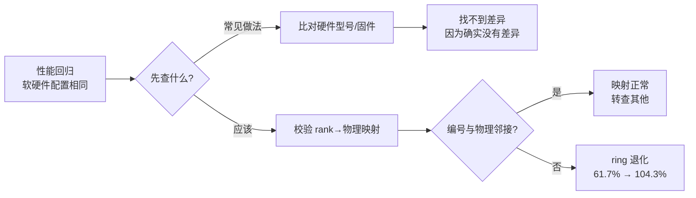
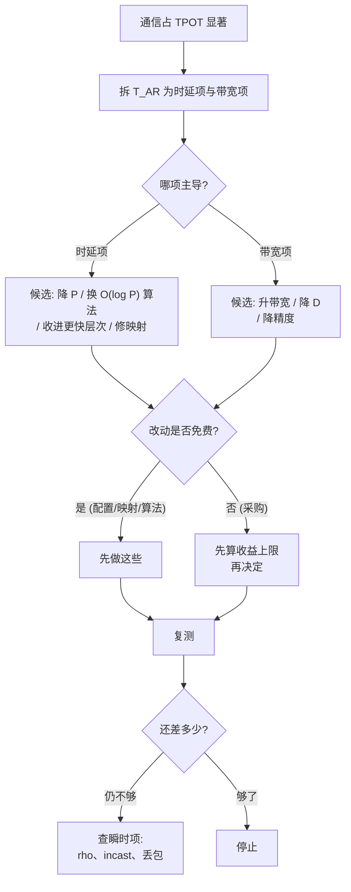

# 推理网络案例：五个走查

> 位置：[InferenceAtlas](../../INDEX.md) > [模块 08](README.md) > 当前文档
> 信息截至：2026-07-31 ｜ 最后核验：2026-07-31 ｜ 内容版本：v0.1
> 时效性等级：低
> 相关主题：[推理网络总览](01_inference_networking_overview.md)｜[集合通信与通信库](05_collectives_rdma_and_communication_libraries.md)｜[拥塞与 tail latency](10_network_congestion_tail_latency_and_qos.md)｜[网络可观测性](11_network_observability_and_debugging.md)

## 本章导读

前面几章给出了推理网络的模型、算法与排查方法。
这一章把它们用在五个具体场景上，
**每个场景都是「买了或改了正确的东西，但改的不是瓶颈那一项」的情形**。

五个案例覆盖五类典型错误：

| # | 症状 | 改错了什么 | 依据章节 |
|---:|---|---|---|
| 一 | 链路带宽翻两番，时延几乎没动 | 在时延主导区加带宽 | [第 1 章](01_inference_networking_overview.md) |
| 二 | 同样的软硬件，换一批机器慢一倍 | 映射而非拓扑 | [第 7 章](07_network_topologies_fat_tree_dragonfly_rail_optimized.md) |
| 三 | MoE 上线后出现偶发尖峰 | incast 而非带宽 | [第 10 章](10_network_congestion_tail_latency_and_qos.md) |
| 四 | 为省成本提高利用率，P99 崩了 | 利用率是时延的风险指标 | [第 10 章](10_network_congestion_tail_latency_and_qos.md) |
| 五 | 扩大 TP 度后通信时间失控 | 算法而非硬件 | [第 5 章](05_collectives_rdma_and_communication_libraries.md) |

**关于本章数字的说明**：五个案例中的全部参数
（链路时延、带宽、缓冲、利用率、丢包率）
**都是为演示推导而设定的假设值，不对应任何真实系统或产品**。
受当前环境的网络出口策略限制（详见 [AGENTS.md 第 11 节](../../AGENTS.md)），
本库无法核验任何厂商规格或真实部署数据，
**因此本章不引用任何外部数据，也不描述任何真实集群**。
这些假设值的作用是让每一步推导可以被完整走一遍并被读者复算，
**而推导方法本身与具体数值无关**。

**基准配置**（贯穿五个案例）：
$L = 80$ 层、TP 组 $P = 8$、$D = B d b_a = 512$ KiB（$B=32$、$d=8192$、fp16）、
TPOT 目标 20 ms、节点间 $\alpha = 5$ μs、$\beta = 50$ GB/s。
由 [第 1 章第 2.5 节](01_inference_networking_overview.md)，
基准的每 token 通信为 14.14 ms，占 TPOT 的 **70.7%**。

## 学习目标

读完本章后，读者应能够：

1. 判断一次带宽升级能带来多少收益，并在升级前就算出上限
2. 识别「拓扑正确但映射错误」，并说明它为什么比拓扑本身更常出问题
3. 把 MoE 的偶发尖峰追溯到 incast degree 与缓冲容量的关系
4. 说明为什么提高链路利用率对吞吐是收益、对时延是风险
5. 在扩大并行度前先确认集合通信算法的时延步数是 $O(P)$ 还是 $O(\log P)$

## 核心结论

- **在时延主导区加带宽的收益有明确上限**：算例中带宽翻两番只把 14.14 ms 降到 11.93 ms，因为 88.4 μs 里有 70.0 μs 是不随带宽变化的时延项。
- **映射错误可以让正确的拓扑完全失效**：编号与物理不邻接使 ring 从 61.7% 恶化到 104.3%，即直接不可行。
- **incast 的缓冲需求随 EP 度线性增长**，因此存在一个由交换机缓冲决定的专家并行度上界。
- **利用率从 0.5 提到 0.85 会额外付出 7.83 ms/token**，接近半个 TPOT 预算——**这是成本优化最容易踩的坑**。
- **算法的时延步数决定了 TP 度的可行上界**：$P=16$ 时 ring 已达 135.7%（不可行），RHD 只有 47.7%。
- **五个案例的共同结构是「先算瓶颈在哪一项，再决定改什么」**——每一个都可以被一次事前计算避免。

## 1. 问题定义、系统边界与工作负载

### 1.1 本章的体裁

不是新的方法，而是**方法的应用走查**。每个案例的结构固定为：

```text
场景与给定数字（假设值）
    ↓
采取的措施（看起来合理）
    ↓
实际结果（与预期不符）
    ↓
本应先做的那一个计算
    ↓
可推广的判据
```

**读者应把重点放在第四步**：
每个案例中真正起作用的都是**一次可以在动手之前完成的计算**，
而不是事后的分析。

### 1.2 边界

本章的全部案例都假定**通信确实占 TPOT 的显著比例**（基准是 70.7%）。
**若这个前提不成立，本章的一切都不适用**——
先按 [第 1 章第 6 节](01_inference_networking_overview.md) 的判据确认。

## 2. 原理、数学与性能模型

五个案例用到的关系已在前几章推导，此处集中列出以便复算：

| 关系 | 表达式 | 来源 |
|---|---|---|
| ring all-reduce | $2(P-1)\alpha + \frac{2(P-1)}{P}\frac{D}{\beta}$ | [第 5 章](05_collectives_rdma_and_communication_libraries.md) 2.2 |
| RHD all-reduce | $2\log_2 P\cdot\alpha + \frac{2(P-1)}{P}\frac{D}{\beta}$ | 同上 |
| 每 token 通信 | $2L \cdot T_{\text{AR}}$ | [第 1 章](01_inference_networking_overview.md) 2.5 |
| 排队放大 | $\frac{\rho}{1-\rho}$ | [第 10 章](10_network_congestion_tail_latency_and_qos.md) 2.1 |
| incast 突发量 | $(P-1)\cdot s_{\text{msg}}$ | [第 10 章](10_network_congestion_tail_latency_and_qos.md) 2.2 |
| 抖动放大 | $1-(1-p)^{2L}$ | [第 1 章](01_inference_networking_overview.md) 2.6 |

**基准分解**（$P=8$、$\alpha=5$ μs、$\beta=50$ GB/s、$D=512$ KiB）：

$$T_{\text{AR}} = \underbrace{2\times7\times5\ \mu s}_{70.0\ \mu s\ \text{时延项}} + \underbrace{\frac{14}{8}\times\frac{512\ \text{KiB}}{50\ \text{GB/s}}}_{18.4\ \mu s\ \text{带宽项}} = 88.4\ \mu s$$

**这个分解是本章五个案例的共同起点**：
**时延项占 79%，带宽项占 21%**。

## 3. 实现机制与系统设计

### 3.1 案例一：链路带宽翻两番，时延几乎没动

**场景**：通信占 TPOT 的 70.7%，判定网络是瓶颈。
采购决定把链路带宽从 50 GB/s 升级到 200 GB/s（四倍）。

**采取的措施**：升级链路。

**实际结果**：

| $\beta$ | 时延项 | 带宽项 | 单次 | 每 token | 占 TPOT |
|---:|---:|---:|---:|---:|---:|
| 50 GB/s | 70.0 μs | 18.4 μs | 88.4 μs | 14.14 ms | 70.7% |
| 100 GB/s | 70.0 μs | 9.2 μs | 79.2 μs | 12.67 ms | 63.3% |
| 200 GB/s | 70.0 μs | 4.6 μs | 74.6 μs | 11.93 ms | 59.7% |

**带宽翻两番，每 token 只从 14.14 ms 降到 11.93 ms，改善 15.6%**。

**本应先做的那一个计算**：
**把 $T_{\text{AR}}$ 拆成时延项与带宽项**（第 2 节）。

时延项 $2(P-1)\alpha = 70.0$ μs **完全不随 $\beta$ 变化**。
因此升级带宽的收益有一个明确上界：

$$\text{改善上限} = \frac{\text{带宽项}}{T_{\text{AR}}} = \frac{18.4}{88.4} = 20.8\%$$

**即使把带宽升到无穷大，也只能改善 20.8%**。
**这个数在采购之前就能算出来**。

**为什么落在时延侧**：由 [第 1 章第 2.2 节](01_inference_networking_overview.md)，
半功率尺寸 $n_{1/2} = \alpha\beta = 5\ \mu s \times 50\ \text{GB/s} = 244$ KiB，
而 ring 每步只传 $D/P = 64$ KiB——**远小于 $n_{1/2}$**。

**可推广的判据**：
**升级带宽前先算带宽项占 $T_{\text{AR}}$ 的比例，那就是收益上限**。
在时延主导区，**该改的是 $P$、算法或放置层次，不是 $\beta$**。

### 3.2 案例二：同样的软硬件，换一批机器慢一倍

**场景**：集群做了 rail 优化，TP 组的 8 个 rank 设计上应在同一条 rail，单跳（$\alpha = 4.2$ μs）。
换到另一批机器后，同样的镜像、同样的配置，通信时间显著变差。

**采取的措施**：怀疑硬件差异，比对交换机型号与固件——**未发现区别**。

**实际结果**：

| 情形 | 有效 $\alpha$ | 单次 | 每 token | 占 TPOT |
|---|---:|---:|---:|---:|
| 全部同 rail（设计意图） | 4.2 μs | 77.2 μs | 12.34 ms | 61.7% |
| 2/14 步跨 rail | — | 84.8 μs | 13.56 ms | 67.8% |
| **编号打乱，全部跨 rail** | 8.0 μs | 130.4 μs | 20.86 ms | **104.3%** |

**最后一行已经超过整个 TPOT 预算**。

**本应先做的那一个计算**：
**校验 rank 编号与物理拓扑的对应关系**，
而不是比对硬件型号。

由 [第 7 章第 3.5 节](07_network_topologies_fat_tree_dragonfly_rail_optimized.md)，
ring 算法假设编号相邻的 rank 物理上也相邻。
**调度器换一批机器时，若分配顺序变了，这个假设就不成立**——
硬件完全相同，映射不同。

**此时 ring 处于最差状态**：
它既没有 RHD 的 $O(\log P)$ 步数，
**又失去了自己「只用最近邻链路」的唯一优势**。

**可推广的判据**：
**拓扑投资的收益由映射兑现，而映射是每次部署都可能变的**。
因此：

1. **拓扑发现与映射校验必须是部署流程的一步**，不是一次性验收；
2. **性能回归时先查映射再查硬件**——
   映射是变量，硬件通常不是。



**图解读**：

1. **本图展示什么**：同一个症状下两条排查路径的分岔。
   **上路会得出「没有差异」这个正确但无用的结论**，
   因为差异确实不在硬件上。
2. **核心瓶颈**：瓶颈是 rank 到物理位置的映射，
   **它既不在镜像里也不在配置里，而是调度器每次分配的结果**。
   **它是这套系统里少数「每次都可能不同」的量**，
   因此也是回归时最该先查的。
3. **图中的 trade-off**：加入映射校验会延长部署流程，
   换来的是把一类隐蔽的回归挡在上线之前。
   **这个取舍划算，因为校验是一次性脚本而排查是人力**。
4. **面试如何引用**：可以说
   「软硬件都一样但性能不同，我会先查 rank 到物理位置的映射，
   **因为 ring 假设编号相邻的 rank 物理上也相邻**；
   映射一乱，ring 既没有 RHD 的低步数，
   **又失去了只用最近邻链路的优势，是最差的组合**」。

### 3.3 案例三：MoE 上线后出现偶发尖峰

**场景**：把稠密模型换成 MoE，专家并行度 EP = 32。
平均时延变化不大，**但 P99 显著恶化，且尖峰无规律**。

**采取的措施**：怀疑带宽不足，检查平均链路利用率——**不高**。

**实际结果**：问题不在平均带宽，在瞬时突发。

由 [第 10 章第 2.2 节](10_network_congestion_tail_latency_and_qos.md)，
all-to-all 在结构上是 degree $P-1$ 的 incast：

| EP | incast degree | 突发量（单条 64 KiB，假设值） |
|---:|---:|---:|
| 16 | 15 | 0.94 MiB |
| 32 | 31 | **1.94 MiB** |
| 64 | 63 | **3.94 MiB** |

**设交换机可用缓冲为 2 MiB（假设值）**：
EP=16 时突发 0.94 MiB，安全；
**EP=32 时 1.94 MiB 已逼近缓冲上限，瞬时抖动即溢出**。

溢出导致丢包，再经 $2L$ 放大：

| 丢包率 $p$ | 每 token 至少一次 |
|---:|---:|
| $10^{-4}$ | 1.6% |
| $10^{-3}$ | **14.8%** |

**这解释了「平均正常、P99 很差、且无规律」这三个特征的同时出现**：
突发是否溢出取决于瞬时的到达重叠，因而随机。

**本应先做的那一个计算**：
**在提高 EP 度之前，算 $(P-1)\cdot s_{\text{msg}}$ 并与交换机缓冲比较**。

**可推广的判据**：
**MoE 的专家并行度存在一个由缓冲决定的上界**，
它与算力、显存都无关。
提高 EP 度前应当同时检查这一项——
**这是一个通常不会被放进容量核算的约束**。

处理手段见 [第 10 章第 3.4 节](10_network_congestion_tail_latency_and_qos.md)：
降 EP 度、分阶段 all-to-all、发送侧错峰、层次化 all-to-all。
**注意后三者都是拿时延换缓冲压力**，
因此只在确实处于缓冲受限时才划算。

### 3.4 案例四：为省成本提高利用率，P99 崩了

**场景**：网络平均利用率长期在 0.5 左右，被认为「买多了」。
决定通过合并流量、减少冗余链路把利用率提到 0.85。

**采取的措施**：提高链路利用率以摊薄成本。

**实际结果**：吞吐指标改善，**但 P99 时延大幅恶化**。

由 [第 10 章第 2.1 节](10_network_congestion_tail_latency_and_qos.md)，
单条消息服务时间 $S = D/\beta = 10.5$ μs，
排队放大 $\frac{\rho}{1-\rho}$：

| $\rho$ | 每次排队 | 每 token 额外 | 占 TPOT |
|---:|---:|---:|---:|
| 0.50 | 10.5 μs | 1.68 ms | 8.4% |
| 0.70 | 24.5 μs | 3.91 ms | 19.6% |
| 0.85 | 59.4 μs | 9.51 ms | **47.5%** |

**从 0.5 提到 0.85，每 token 额外付出 7.83 ms**——
**接近半个 TPOT 预算**。

**本应先做的那一个计算**：
**把目标利用率代入 $\frac{\rho}{1-\rho}\cdot S\cdot 2L$，看它占 TPOT 多少**。

**这个计算的结论是反直觉的**：
**利用率对吞吐和成本是收益指标，对时延是风险指标**，
而 $\frac{\rho}{1-\rho}$ 在 0.8 以上迅速发散。

**还有一项常被漏掉的后果**（[第 10 章第 4.1 节](10_network_congestion_tail_latency_and_qos.md)）：
$\rho = 0.85$ 时若损失一部分容量，
**剩余部分的 $\rho$ 会跳到接近 1，排队时延爆炸**。
**高利用率同时放大了故障的后果**。

**可推广的判据**：
**推理网络的目标利用率应显著低于通用网络，这不是浪费而是时延预算的组成部分**。
把它写进容量规划，而不是事后发现。

### 3.5 案例五：扩大 TP 度后通信时间失控

**场景**：模型变大，需要把 TP 从 8 提到 16。
按「通信量 $D = Bdb_a$ 与 $P$ 无关」推断通信量不变，
预期通信时间大致持平。

**采取的措施**：直接把 TP 改成 16。

**实际结果**：

| $P$ | ring 单次 | 占 TPOT | RHD 单次 | 占 TPOT |
|---:|---:|---:|---:|---:|
| 8 | 88.4 μs | 70.7% | 48.4 μs | 38.7% |
| 16 | 169.7 μs | **135.7%** | 59.7 μs | 47.7% |
| 32 | 330.3 μs | **264.3%** | 70.3 μs | 56.3% |

**ring 在 $P=16$ 时已经不可行**（135.7% 超出整个预算）。

**推断错在哪里**：
「$D$ 与 $P$ 无关」是对的（[第 1 章第 2.3 节](01_inference_networking_overview.md)），
**但通信时间不只由 $D$ 决定**。
由 [第 5 章第 2.2 节](05_collectives_rdma_and_communication_libraries.md)，

$$T_{\text{AR}} = \underbrace{2(P-1)\alpha}_{\text{随 }P\text{ 线性}} + \underbrace{\frac{2(P-1)}{P}\frac{D}{\beta}}_{\text{系数收敛到 }2}$$

**字节数确实几乎不变（系数从 1.75 到 1.875），但时延项翻了一倍以上**。

**本应先做的那一个计算**：
**分别看两项随 $P$ 的变化**，而不是只看 $D$。

**修正手段**：换成 $O(\log P)$ 步的算法。
RHD 在 $P=16$ 时只有 47.7%，
**且移动的字节数与 ring 完全相同**。

**但这个手段有前提**（[第 7 章第 3.4 节](07_network_topologies_fat_tree_dragonfly_rail_optimized.md)）：
RHD 的远距离交换要求任意两点等价。
**在 rail 优化或全连接域内成立，在低维物理拓扑上可能反转**——
**因此这一步必须实测确认，不能按表推断**。

**可推广的判据**：
**扩大并行度前先确认集合通信的时延步数是 $O(P)$ 还是 $O(\log P)$**。
判断方法见 [第 5 章第 6 节](05_collectives_rdma_and_communication_libraries.md)：
**扫 $P$ 作图，看耗时是线性还是对数增长**——
这比读文档可靠。

## 4. 性能、成本、能耗与可靠性 trade-off

### 4.1 五个案例的共同结构

| 案例 | 改了什么 | 瓶颈实际在哪 | 事前该算什么 |
|---|---|---|---|
| 一 | 带宽 | **时延项**（占 79%） | 带宽项占 $T_{\text{AR}}$ 的比例 |
| 二 | 查硬件 | **映射** | rank 与物理的对应 |
| 三 | 查平均带宽 | **瞬时缓冲** | $(P-1)s_{\text{msg}}$ vs 缓冲 |
| 四 | 提利用率 | **排队** | $\frac{\rho}{1-\rho}S\cdot 2L$ |
| 五 | 并行度 | **算法步数** | 两项各自随 $P$ 的变化 |

**共同点是每一个都可以被一次事前计算避免**，
而那次计算的输入全部来自本模块前几章已经给出的公式。

**更深一层的共同点**：
**五个案例都是「把一个聚合量当成了它的某个分量」**：

| 案例 | 聚合量 | 实际起作用的分量 |
|---|---|---|
| 一 | $T_{\text{AR}}$ | 时延项与带宽项 |
| 二 | 「配置相同」 | 配置 vs 映射 |
| 三 | 平均利用率 | 瞬时突发 |
| 四 | 利用率 | 排队的非线性响应 |
| 五 | 通信量 $D$ | 字节数 vs 步数 |

**这与 [模块 10 第 9 章](../10_edge_and_on_device_inference/09_edge_deployment_case_studies.md)
案例四「聚合指标稀释局部退化」是同一类错误的不同表现**：
**聚合掩盖分量，而决策发生在分量上**。

### 4.2 成本方向

| 案例 | 花了钱吗 | 效果 |
|---|---|---|
| 一 | **是（升级带宽四倍）** | 改善 15.6%，上限 20.8% |
| 二 | 否 | 修映射是免费的 |
| 三 | 视手段而定 | 降 EP 度免费，换交换机贵 |
| 四 | **省了钱** | 但付出近半个 TPOT 预算 |
| 五 | 否 | 换算法是配置改动 |

**案例二与案例五的修复都不花钱**，
而案例一花了钱但收益有上限、案例四省了钱但代价巨大。
**这个分布不是巧合**：
**软件与配置层面的错配通常比硬件不足更常见，也更便宜修**。
**因此排查顺序应当是先软后硬**。

### 4.3 可靠性

| 案例 | 对可靠性的影响 |
|---|---|
| 三 | 丢包与重传直接进入尾部 |
| 四 | **高 $\rho$ 放大故障后果**：损失容量后 $\rho\to 1$ |
| 五 | 更大的 $P$ 意味着更大的同步范围与故障域 |

**案例四的这一条最值得强调**：
提高利用率不仅恶化正常状态的时延，
**还使系统在故障时从「降级」直接变成「不可用」**。

## 5. benchmark、真实案例或公开部署案例

**本章不描述任何真实集群、产品或部署配置**。

受当前环境的网络出口策略限制（详见 [AGENTS.md 第 11 节](../../AGENTS.md)），
本库无法核验厂商规格或公开部署资料，**因此无法引用任何真实案例**。
五个案例的全部数值都是为演示推导设定的假设值，已在导读中声明。

**读者应为自己的系统完成的五项事前计算**：

| # | 计算 | 你的值 | 用途 |
|---:|---|---|---|
| 1 | 带宽项 ÷ $T_{\text{AR}}$ | 待填 | **升级带宽的收益上限** |
| 2 | rank 编号与物理位置的对应 | 待填 | **回归时先查这一项** |
| 3 | $(P-1)\cdot s_{\text{msg}}$ vs 交换机缓冲 | 待填 | **EP 度的缓冲上界** |
| 4 | $\frac{\rho}{1-\rho}\cdot S\cdot 2L$ ÷ TPOT | 待填 | **目标利用率的时延代价** |
| 5 | 耗时随 $P$ 是线性还是对数 | 线性/对数 | **算法的时延步数量级** |

**这五项都可以在动手之前完成，总耗时以小时计**，
而五个案例中任何一个的排查成本都远高于此。

> 各项的详细方法见对应章节的第 5 节核查表：
> [第 1 章](01_inference_networking_overview.md)、
> [第 5 章](05_collectives_rdma_and_communication_libraries.md)、
> [第 7 章](07_network_topologies_fat_tree_dragonfly_rail_optimized.md)、
> [第 10 章](10_network_congestion_tail_latency_and_qos.md)、
> [第 11 章](11_network_observability_and_debugging.md)。

## 6. 设计决策框架



**图解读**：

1. **本图展示什么**：一条**先分解、再按代价排序**的决策路径。
   **入口是拆分 $T_{\text{AR}}$**，
   因为在不知道哪一项主导时，两条候选清单是互斥的。
2. **核心瓶颈**：判定点 F 是本图的实践核心。
   **免费的改动（映射、算法、并行度）应当在花钱之前全部试完**——
   案例二与案例五的修复都不花钱，而案例一花了钱只买到 15.6%。
3. **图中的 trade-off**：右下角的 K 代表瞬时项，
   它们不出现在 $T_{\text{AR}}$ 的平均值里，
   **因此只有在平均值已经优化到位后才会暴露**。
   **先平均后瞬时，是因为瞬时项的排查成本高得多**。
4. **面试如何引用**：可以说
   「我会先把 $T_{\text{AR}}$ 拆成时延项和带宽项，
   **因为两侧的手段完全不通用**；
   然后按代价排序——**映射、算法、并行度这些免费的先试完再谈采购**；
   最后如果平均值已经优化到位但 P99 仍差，
   **才去查 $\rho$、incast 和丢包这些瞬时项**」。

**判定标准**：

| 观察 | 结论 |
|---|---|
| 带宽项 ÷ $T_{\text{AR}}$ < 30% | **升级带宽的收益上限低**，先看别处 |
| 软硬件相同但性能不同 | **先查映射** |
| 平均正常但 P99 差且无规律 | **瞬时突发**，查 incast 与缓冲 |
| 目标 $\rho > 0.7$ | 先算排队占 TPOT 的比例 |
| 耗时随 $P$ 线性增长 | $O(P)$ 算法，扩 $P$ 前先换算法 |
| 以上都已处理但仍不达标 | 回到 [第 6 章](06_scale_up_vs_scale_out.md) 重新切分并行度 |

## 7. 常见失败模式与排查路径

| 症状 | 首先怀疑 | 检查 | 案例 |
|---|---|---|---|
| 升级硬件后改善远低于预期 | 改的不是主导项 | 拆时延项/带宽项 | 一 |
| 换机器后性能回归 | **映射** | rank 与物理对应 | 二 |
| 换 MoE 后 P99 恶化 | **incast** | 突发量 vs 缓冲 | 三 |
| 提高利用率后时延崩了 | **排队非线性** | $\frac{\rho}{1-\rho}$ | 四 |
| 扩大 TP 后通信时间翻倍 | **$O(P)$ 算法** | 扫 $P$ 作图 | 五 |
| 优化了通信但端到端没变 | 通信本就不是瓶颈 | [第 1 章](01_inference_networking_overview.md) 的百分比 | — |
| 改了很多但说不清哪个起作用 | 一次改多项 | **一次只改一项并复测** | — |

**最后一行是走查之外的一条纪律**：
**五个案例中每一个的定位都依赖「只有一个变量变化」**。
同时改动多项会使前面所有判据失效。

## 8. 关联面试主题

- 时延项与带宽项的分解 → [模块 17 系统设计题](../17_interview_prep/01_inference_system_design.md)
- 集合通信算法与并行度 → [模块 17 分布式与 MoE 题](../17_interview_prep/05_distributed_and_moe_questions.md)
- 排队与目标利用率 → [模块 17 serving 与 SLO 题](../17_interview_prep/03_serving_scheduling_and_slo_questions.md)
- 性能回归的归因 → [模块 17 调试与 benchmark 题](../17_interview_prep/07_debug_benchmark_and_reliability_questions.md)

## 9. 小结

五个案例的表面症状各不相同，
**但每一个都是「把聚合量当成了它的某个分量」**：

1. **带宽升级**：$T_{\text{AR}}$ 里时延项占 79%，
   带宽翻两番只改善 15.6%，**上限 20.8%**，且这个上限事前可算。
2. **映射错误**：软硬件完全相同，
   编号与物理不邻接使 ring 从 61.7% 恶化到 **104.3%**——
   **ring 此时既无低步数也无拓扑优势，是最差组合**。
3. **MoE 的 incast**：平均利用率不高，
   但 degree $P-1$ 的突发在 EP=32 时逼近缓冲上限，
   **溢出丢包经 $2L$ 放大后使近 15% 的 token 受影响**。
4. **利用率**：从 0.5 提到 0.85 额外付出 **7.83 ms/token**，
   接近半个 TPOT 预算；
   **且高 $\rho$ 使故障后果从「降级」变成「不可用」**。
5. **并行度**：$D$ 与 $P$ 无关是对的，
   **但时延项 $2(P-1)\alpha$ 随 $P$ 线性增长**；
   $P=16$ 时 ring 已达 135.7%，RHD 只有 47.7%。

**两条贯穿全章的纪律**：

- **先分解再决定**：时延侧与带宽侧的手段完全不通用，
  在不知道哪一项主导时，任何改动都是猜。
- **先软后硬**：案例二与案例五的修复不花钱，
  案例一花了钱只买到 15.6%。
  **软件与配置层面的错配通常比硬件不足更常见，也更便宜修**。

**最后回到前提**：
本章假定通信确实占 TPOT 的显著比例。
**若不成立，五个案例全部不适用**——
先按 [第 1 章第 6 节](01_inference_networking_overview.md) 算百分比。

## 关键术语

本章不引入新术语，所用概念均见前几章：
[第 1 章](01_inference_networking_overview.md)（$\alpha$-$\beta$、半功率尺寸、抖动放大）、
[第 5 章](05_collectives_rdma_and_communication_libraries.md)（ring、RHD、带宽下界）、
[第 7 章](07_network_topologies_fat_tree_dragonfly_rail_optimized.md)（争用因子、rail 优化、映射校验）、
[第 10 章](10_network_congestion_tail_latency_and_qos.md)（排队放大、incast degree）。

| 中文术语 | 英文 | 定义 | 单位/口径 | 关联文档 |
|---|---|---|---|---|
| 收益上限 | improvement ceiling | 某一项优化在其他项不变时的最大改善幅度 | % | 本章 3.1 |
| 事前计算 | pre-computation | 在动手之前即可完成的判定性计算 | — | 本章 5 |

## 延伸阅读

- [推理网络总览](01_inference_networking_overview.md)
- [集合通信、RDMA 与通信库](05_collectives_rdma_and_communication_libraries.md)
- [scale-up 与 scale-out 的决策框架](06_scale_up_vs_scale_out.md)
- [网络拓扑：fat-tree、dragonfly 与 rail 优化](07_network_topologies_fat_tree_dragonfly_rail_optimized.md)
- [拥塞控制、incast 与 tail latency](10_network_congestion_tail_latency_and_qos.md)
- [网络可观测性与排查](11_network_observability_and_debugging.md)
- [端侧部署案例：五个走查](../10_edge_and_on_device_inference/09_edge_deployment_case_studies.md)

## 主要来源

本章是 [模块 08](README.md) 第 1、5、7、10、11 章已推导结论的应用走查，
不引入新的模型或公式。

**不描述任何真实集群、产品或部署配置**。
受当前环境的网络出口策略限制，本库无法核验厂商规格或公开部署资料
（详见 [AGENTS.md 第 11 节](../../AGENTS.md)）。

| 类别 | 说明 | 披露标签 |
|---|---|---|
| 五个案例的全部数值 | **为演示推导设定的假设值，不对应任何真实系统** | — |
| 所用公式 | 见第 2 节的来源列，均由前几章推导 | — |
| 读者自身系统的五项事前计算 | 应自行完成 | `独立可复现实验` |
| 任何真实集群、产品或部署配置 | **本章未给出** | `待核实` |

## 更新记录

| 日期 | 版本 | 变更 | 核验人 |
|---|---|---|---|
| 2026-07-31 | v0.1 | 初稿：五个推理网络案例走查（带宽升级的收益上限、映射错误使 ring 退化、MoE 的 incast 与缓冲上界、利用率的排队代价、并行度与算法步数），全部数值为假设值并已复算 | — |
