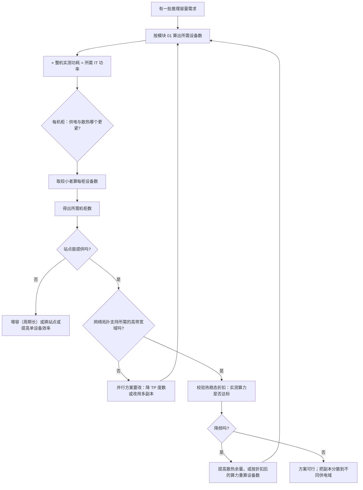

# AI 数据中心与传统数据中心的差异

> 位置：[InferenceAtlas](../../INDEX.md) > [模块 09](README.md) > 当前文档
> 信息截至：2026-07-29 ｜ 最后核验：2026-07-29 ｜ 内容版本：v0.1
> 时效性等级：低
> 相关主题：[AI 推理硬件总览](../07_hardware_and_server_architecture/01_ai_inference_hardware_overview.md)｜`02_rack_power_and_density.md`｜[能效与每 token 焦耳](../01_foundations_and_metrics/07_energy_efficiency_and_joules_per_token.md)

## 本章导读

AI 数据中心与传统数据中心的差异，可以归结为**一个量的变化引发的连锁反应**：
**单机柜功率密度大幅上升**。

这一个变化沿着物理链条向外传导：
更高的功率密度意味着更多的热量集中在更小的体积里，
**于是风冷在某个密度之后不再够用**；
液冷改变了机房的机械结构与运维方式；
更高的机柜功率改变了配电链路的电流，
**而配电损耗随电流平方增长**，于是配电架构也要改。

**这条链条是本章的主线**：密度 → 散热 → 配电 → 机械结构 → 运维。
理解它就能解释 AI 数据中心几乎所有与传统机房不同的设计选择。

第二条主线是**训练与推理对数据中心的要求不同**。
训练是长时间稳定的高负载，
**推理是随流量波动的、对时延敏感的、且需要弹性的负载**。
这个差异影响供电冗余、容量规划的口径、以及运维的响应速度要求。

**关于本章的一个重要说明**：受当前环境的网络出口策略限制
（详见 [AGENTS.md 第 11 节](../../AGENTS.md)），
本库无法访问任何数据中心标准文档、厂商规格或设施运营数据，
**因此本章不给出任何具体的功率密度、PUE、温度或成本数值**。
本章给出的是**物理关系、设计约束与推导方法**——
这些不依赖具体数值，且比任何具体数值都更耐用。

## 学习目标

读完本章后，读者应能够：

1. 说明功率密度上升如何沿「散热 → 配电 → 机械 → 运维」传导出一系列设计变化
2. 区分训练负载与推理负载对数据中心的不同要求
3. 解释为什么「机柜能装多少设备」通常由供电与散热而非机位数决定
4. 说明 IT 侧的效率提升如何被设施侧的 PUE 放大或抵消
5. 列出评估一个站点能否承载 AI 推理负载时必须核对的六项

## 核心结论

- **功率密度是 AI 数据中心一切差异的源头**：它沿散热、配电、机械结构、运维四条路径传导。
- **机柜的容量约束通常是供电与散热而非机位数**：高功耗设备会让电力先满而机位空着。
- **配电损耗随电流平方增长**，因此在功率上升时提高配电电压比加粗导体更有效。
- **推理负载与训练负载的差异在于波动性与时延敏感性**，这直接改变冗余设计与容量规划的口径。
- **设施效率（PUE）会放大或抵消 IT 侧的优化**：IT 侧省下的每一瓦，在设施侧对应 PUE 倍的节省。
- **散热能力不足的直接后果是降频**，即芯片跑不出规格——这让设施能力成为性能的隐性上界。

## 1. 问题定义、系统边界与工作负载

### 1.1 本章的系统边界

```text
                    ┌─────────────────────────────┐
   市电/变电  →  配电 →  机柜 → 服务器 → 芯片      │  ← 本章关注这一层
                    │         ↑                   │
   制冷设施  ←── 热量 ────────┘                   │
                    └─────────────────────────────┘
                             PUE 覆盖的边界
```

**本章关注的是「从市电到芯片」与「从芯片到环境」这两条链路**，
以及它们如何约束上层的部署决策。

**不涉及**：芯片内部的功耗管理（见 [模块 07 第 2 章](../07_hardware_and_server_architecture/02_gpu_architecture_for_inference.md)）、
具体的设施工程实现（属于设施工程范畴）。

### 1.2 为什么推理团队需要理解这一层

三个直接的影响：

| 设施层的事实 | 对推理系统的影响 |
|---|---|
| 散热能力不足 → 降频 | **芯片跑不出规格，容量规划系统性高估** |
| 机柜功率上限 | 决定单柜能放多少设备，从而决定网络拓扑 |
| 供电冗余等级 | 决定单点故障的影响面 |

**第一项最直接**：如果按标称算力做容量规划，
**而实际因散热受限降频，上线后就会容量不足且原因不明显**
（见 [Q083](../17_interview_prep/06_hardware_and_datacenter_questions.md)）。

### 1.3 训练与推理的负载差异

| 维度 | 训练 | 推理 |
|---|---|---|
| 负载形态 | 长时间稳定的高负载 | **随流量波动** |
| 时延敏感度 | 低（慢一点是成本问题） | **高（是 SLO 问题）** |
| 弹性需求 | 低（作业规模固定） | **高（需要快速扩缩容）** |
| 单作业规模 | 大且固定 | 小且数量多 |
| 故障容忍 | 可从检查点恢复 | **在飞请求受影响** |

**对设施的具体影响**：

1. **功率波动**：推理的功率随负载波动，
   **而配电与制冷系统需要能跟上这个波动**——
   一个按稳定负载设计的系统在快速波动下可能出现局部过热；
2. **冗余要求更高**：推理的故障直接影响用户，
   **所以供电与制冷的冗余等级通常需要高于纯训练集群**；
3. **容量规划的口径不同**：训练按「作业能否跑完」规划，
   **推理必须按「峰值时刻能否满足 SLO」规划**，
   而峰值远高于平均。

## 2. 原理、数学与性能模型

### 2.1 功率密度的传导链

设单机柜功率为 $P_{\text{rack}}$。它的上升沿四条路径传导：

**（一）散热**。机柜产生的热量必须被移走：

$$
\dot{Q} = P_{\text{rack}}
$$

（电能几乎全部转化为热）。风冷的移热能力受限于**风量与温差**：

$$
\dot{Q}_{\text{air}} = \dot{m} \cdot c_p \cdot \Delta T
$$

其中 $\dot m$ 是质量流量、$c_p$ 是空气比热、$\Delta T$ 是进出风温差。

**空气的比热容小，且 $\dot m$ 与 $\Delta T$ 都有实际上界**
（风量受风机功率与噪声限制，温差受设备进风温度要求限制），
**所以风冷有一个移热能力的天花板**。
超过它就必须换传热介质——这就是液冷的物理动因。

**液体的体积比热容远高于空气**，
**因此在同样的流量下能移走多得多的热量**，
这是液冷能支撑更高密度的根本原因。

**（二）配电**。功率一定时，电流与电压成反比：

$$
I = \frac{P}{V}
$$

**而配电链路的损耗随电流平方增长**：

$$
P_{\text{loss}} = I^2 R
$$

**这是本章最重要的一个式子**。它的推论：

- 功率翻倍而电压不变 → 电流翻倍 → **损耗变为四倍**；
- 电压翻倍而功率不变 → 电流减半 → **损耗降为四分之一**。

**所以在功率密度上升时，提高配电电压比加粗导体更有效**——
加粗导体（降低 $R$）的收益是线性的，
**而提高电压的收益是平方的**。
这解释了机柜内部转向更高直流配电电压的技术方向
（具体的电压标准应查官方文档，本章不给出）。

**（三）机械结构**。更高的功率密度带来：
更重的机柜（散热部件、更粗的导体）、
液冷带来的管路与漏液防护、
以及更严格的地板承重要求。

**（四）运维**。液冷系统的维护与风冷不同：
需要处理管路、冷却液、以及漏液的检测与响应。
**这改变了运维的技能要求与故障模式**。

### 2.2 机柜容量的三重约束

一个机柜能放多少设备，由三个约束中**最紧的那个**决定：

$$
N_{\text{rack}} = \min\left(
\underbrace{\frac{H_{\text{rack}}}{h_{\text{server}}}}_{\text{机位}},\;
\underbrace{\frac{P_{\text{rack,limit}}}{P_{\text{server}}}}_{\text{供电}},\;
\underbrace{\frac{\dot Q_{\text{cooling}}}{P_{\text{server}}}}_{\text{散热}}
\right)
$$

**对 AI 服务器，后两项通常远紧于第一项**：
一个装满机位的高功耗设备机柜会远超供电与散热上限。

**实践后果是「机柜里有空位但不能再装」**，
**而这在按机位数做的容量规划里完全不可见**。

**因此站点评估必须问的是「每机柜的供电与散热上限」而不是「机位数」**。

### 2.3 PUE 的放大效应

$$
P_{\text{facility}} = P_{\text{IT}} \times \text{PUE}
$$

**PUE 恒大于 1**，它包含制冷、配电损耗、照明等非 IT 消耗。

**关键推论：IT 侧省下的每一瓦，在设施侧对应 PUE 倍的节省**。

$$
\Delta P_{\text{facility}} = \Delta P_{\text{IT}} \times \text{PUE}
$$

**所以推理侧的效率优化（量化、更好的 kernel、提高利用率）
在设施层面的收益被 PUE 放大**。

**反过来也成立**：一个 PUE 较高的设施，
**它的 IT 侧优化收益也被同比放大**——
这意味着在能效差的设施里做 IT 优化的绝对收益反而更大。

**注意 PUE 本身随负载变化**：
设施的固定开销（照明、部分制冷）在低 IT 负载下占比更高，
**所以低利用率的设施 PUE 通常更差**——
**这与 [模块 11 第 5 章](../11_benchmarking_reliability_and_observability/05_power_energy_and_cost_benchmarks.md)
里「利用率低则摊薄能耗高」是同一个效应在设施层的体现**。

### 2.4 散热能力作为性能的隐性上界

芯片在温度或功耗超限时降频（见 [模块 07 第 2 章](../07_hardware_and_server_architecture/02_gpu_architecture_for_inference.md)）。

**因此**：

$$
\text{实际可用算力} = \text{标称算力} \times \eta_{\text{thermal}}
$$

其中 $\eta_{\text{thermal}} \le 1$ 由设施的散热能力决定。

**三个实践含义**：

1. **容量规划必须用热稳态下的实测值**，
   否则会系统性高估；
2. **同一批设备在不同位置的 $\eta_{\text{thermal}}$ 可能不同**——
   机柜上部、气流下游的设备散热条件更差，
   **表现为「某几台持续偏慢」**；
3. **提高设施散热能力是一种「性能优化」**，
   虽然它不在软件栈里。

## 3. 实现机制与系统设计

### 3.1 散热方式的选择

按移热能力从低到高：

| 方式 | 传热介质 | 适用密度 | 主要代价 |
|---|---|---|---|
| 风冷 | 空气 | 低到中 | 风量与噪声上限、密度天花板 |
| 冷板液冷 | 液体（接触发热部件） | 中到高 | 管路、漏液风险、运维复杂度 |
| 浸没式 | 液体（整机浸没） | 高 | 机械结构大改、维护方式改变 |

**选择的判据是「目标机柜功率密度」**，
**而不是「哪个更先进」**。

**三个常被低估的代价**：

1. **液冷改变了故障模式**：新增漏液这一类故障，
   需要检测与自动隔离；
2. **液冷改变了维护流程**：更换设备需要处理管路连接，
   **单机维护时间通常更长**；
3. **混合部署的复杂度**：如果同一机房既有风冷又有液冷设备，
   **两套系统要并存**。

**一个重要的架构判断**：散热方式一旦确定，
**它对机房的机械结构与运维体系有长期锁定效应**——
比服务器本身的生命周期长得多。
**所以它是一个应当按较长时间尺度考虑的决策**。

### 3.2 配电链路的设计要点

从市电到芯片经过多级转换，**每一级都有损耗**：

```text
市电 → 变压 → UPS/储能 → 机柜配电 → 服务器电源 → 板级供电 → 芯片
        ↑        ↑           ↑            ↑           ↑
      每一级都有转换损耗，且损耗计入 PUE（除最后两级计入 IT 功耗）
```

**三个设计要点**：

1. **减少转换级数**：每一级转换都有效率损失，
   **级数越少总效率越高**；
2. **提高配电电压**：由 $P_{\text{loss}} = I^2R$，
   提高电压的收益是平方的（见 2.1）；
3. **就近转换**：把低压大电流的路径缩到最短，
   **因为损耗正比于路径的电阻**。

**这三点共同指向「高压直流配电到机柜、机柜内就近降压」的方向**。
**具体的电压标准与效率数字应查设施与厂商的官方文档**，
本章不给出（原因见第 5 节）。

### 3.3 冗余等级与推理负载

供电与制冷的冗余设计要回答「单点故障时会发生什么」。

**对推理负载的特殊考虑**：

| 冗余不足的后果 | 对推理的影响 |
|---|---|
| 供电单点故障 → 一批机柜断电 | **该批次的全部在飞请求丢失** |
| 制冷单点故障 → 局部过热 | **降频而非停机**，容量悄悄下降 |
| 配电容量不足 → 无法扩容 | 弹性扩缩容失效 |

**第二行值得强调**：**制冷故障的表现是降频而不是停机**，
**所以它不会触发任何健康检查**——
系统「正常」运行但容量下降。
**这类问题只能靠监控芯片频率与温度发现**
（见 [模块 11 第 7 章](../11_benchmarking_reliability_and_observability/07_observability_metrics_logs_traces.md)）。

**因此推理集群的监控应当包含设施层信号**，
而不只是 IT 层指标。

### 3.4 站点评估的六项

评估一个站点能否承载 AI 推理负载，必须核对：

| 项 | 为什么 | 从哪里获取 |
|---|---|---|
| 每机柜供电上限 | 决定单柜设备数 | 设施方，标注 `官方披露` |
| 每机柜散热能力 | 通常比供电更紧 | 设施方 |
| 站点总可用容量与增容能力 | 决定扩容天花板 | 设施方 |
| 供电与制冷的冗余等级 | 决定故障影响面 | 设施方 |
| PUE 及其随负载的变化 | 影响总电力与成本 | 设施方 + 自行观测 |
| 网络接入与拓扑 | 决定并行方案可行性 | 设施方 + 网络团队 |

**最后一项常被遗漏**：
**机柜数够但网络拓扑不支持所需的高带宽域，
张量并行就无法按计划部署**
（见 [Q081](../17_interview_prep/06_hardware_and_datacenter_questions.md)）。

### 3.5 从推理需求反推设施需求

```text
目标 QPS 与 SLO
    ↓  （模块 01 第 8 章的容量模型）
所需的有效算力与显存
    ↓  （模块 07 的四轴评估）
所需的设备数
    ↓  × 整机功耗
所需的 IT 功率
    ↓  ÷ 每机柜功率上限
所需的机柜数
    ↓  × PUE
所需的设施总电力
    ↓
校验：站点能否提供？网络拓扑是否支持？
```

**两个校验点最容易被漏掉**：

1. **散热而非供电通常是更紧的约束**——
   要用两者中较小的那个算机柜数；
2. **网络拓扑的校验**——
   见 3.4 的最后一行。

## 4. 性能、成本、能耗与可靠性 trade-off

### 4.1 密度与成本

**高密度的收益**：单位面积的算力更高，
**从而摊薄机房空间与部分固定设施成本**。

**高密度的代价**：

| 代价 | 说明 |
|---|---|
| 散热方案升级 | 液冷的建设与运维成本 |
| 配电改造 | 更高电压、更粗导体或更多路数 |
| 故障影响面集中 | **一个机柜故障影响更多设备** |
| 机械结构要求 | 承重、管路空间 |

**第三行是一个容易被忽略的可靠性代价**：
**密度越高，单个故障域内的设备越多**，
**这与「副本分散」的放置原则直接冲突**
（见 [Q072](../17_interview_prep/05_distributed_and_moe_questions.md)）。

**因此高密度部署时更需要注意把不同副本放在不同机柜/不同供电域**。

### 4.2 PUE 与建设成本

降低 PUE 需要设施侧投入（更好的制冷、更少的转换级数）。

**判断投入是否值得的方法**：

$$
\text{年电力节省} = P_{\text{IT}} \times \Delta\text{PUE} \times 8760 \times \text{电价}
$$

与改造投入比较。

**注意 $P_{\text{IT}}$ 是平均值而不是峰值**，
**而平均值取决于利用率**——
**利用率低的集群，PUE 改造的绝对收益也低**。

### 4.3 散热余量与性能稳定性

**散热能力留余量的价值是性能可预测**：
在余量充足时芯片不降频，
**性能稳定从而可以被计入容量**。

**而余量不足时的性能是波动的**
（随环境温度、邻近设备负载变化），
**波动的性能无法被计入容量规划**
（见 [Q083](../17_interview_prep/06_hardware_and_datacenter_questions.md)）。

**所以散热余量不是浪费，它买的是「可保证的性能」**。

## 5. benchmark、真实案例或公开部署案例

**本章不给出任何具体的功率密度、PUE、温度、电压或成本数值**。

受当前环境的网络出口策略限制（详见 [AGENTS.md 第 11 节](../../AGENTS.md)），
本库无法访问数据中心标准文档、设施厂商规格或运营数据，
**因此无法核验任何一项**。
**在无可靠来源时写出这类数字属于本库明确禁止的行为**。

**读者应自行填充的站点评估表**：

| 项 | 你的值 | 来源与披露标签 |
|---|---|---|
| 每机柜供电上限 | 待填 | 设施方，`官方披露` |
| 每机柜散热能力 | 待填 | 设施方，`官方披露` |
| 上述两者哪个更紧 | 待填 | 计算得出 |
| 站点当前可用容量与增容周期 | 待填 | 设施方 |
| 供电冗余等级 | 待填 | 设施方 |
| 制冷冗余等级 | 待填 | 设施方 |
| PUE（满载与当前负载下各一个） | 待填 | 设施方 + 自行观测 |
| 你的整机功耗（实测，非 TDP） | 待填 | `独立可复现实验` |
| 由上述算出的每机柜设备数 | 待填 | 计算得出 |
| 热稳态下的实测算力折扣 $\eta_{\text{thermal}}$ | 待填 | **`独立可复现实验`** |
| 高带宽域能覆盖的设备数 | 待填 | 网络团队 |

**倒数第二行最有价值**：它把设施能力翻译成了 IT 侧可用的数字，
**而它只能实测**——
**多数团队从未测过自己设备在热稳态下相对标称的折扣**。

> 实验方法论要求见 [如何读推理 benchmark](../00_start_here/03_how_to_read_inference_benchmarks.md)。

## 6. 设计决策框架



**图解读**：

1. **本图展示什么**：从推理需求到设施可行性的完整校验链。
   注意三处回环（H、J、M 都回到 B），
   **说明设施约束会反过来改变 IT 侧的方案**。
2. **核心瓶颈**：瓶颈在 D 节点。
   **「供电与散热哪个更紧」这个检查最常被跳过**，
   而按机位数或只按供电算出的机柜数会偏乐观——
   **对 AI 服务器，散热往往是更紧的那个**。
3. **图中的 trade-off**：K→M 的回环意味着"降频"要以更多设备补偿，
   **成本上升**。而另一条路（提高散热余量）是设施投入。
   **两者应当被一起比较，而不是默认接受降频**。
4. **面试如何引用**：可以说
   「我会先算 IT 功率，然后用供电与散热中较紧的那个算机柜数，
   **再校验网络拓扑与热稳态下的实际算力**——
   因为降频会让按标称算的容量系统性偏高」。

**N 节点的最后一句不可省略**：
高密度部署把更多设备放进同一个故障域，
**所以副本分散比低密度时更重要**。

## 7. 常见失败模式与排查路径

| 症状 | 根因 | 修正 |
|---|---|---|
| 机柜有空位但不让装 | 供电或散热已达上限 | 按三重约束的最小值算 |
| 上线后容量低于规划 | 未考虑热稳态降频 | 用实测 $\eta_{\text{thermal}}$ 重算 |
| 某几台设备持续偏慢 | 位置散热条件差（上部、气流下游） | 按设备监控频率与温度；调整放置 |
| 制冷故障但没有告警 | 表现为降频而非停机 | **监控芯片频率与温度**，不只看健康检查 |
| 机柜数够但并行方案跑不起来 | 网络拓扑未校验 | 校验高带宽域覆盖的设备数 |
| 扩容周期远超预期 | 站点增容有长周期 | 提前规划；或用弹性溢出到外部容量 |
| 一次机柜故障影响面超预期 | 高密度使故障域内设备更多 | 副本分散到不同机柜与供电域 |

**排查顺序**：**先确认是设施约束还是 IT 约束**——
症状相似（容量不足）但修正完全不同。

## 8. 关联面试主题

1. 从 QPS 推导到机柜数——见 [Q084](../17_interview_prep/06_hardware_and_datacenter_questions.md)
2. 降频的机制与在监控上的表现——见 [Q083](../17_interview_prep/06_hardware_and_datacenter_questions.md)
3. 三级功耗口径与 PUE——见 [Q082](../17_interview_prep/06_hardware_and_datacenter_questions.md)
4. 互连层级对部署的约束——见 [Q081](../17_interview_prep/06_hardware_and_datacenter_questions.md)
5. 放置策略与故障域——见 [Q072](../17_interview_prep/05_distributed_and_moe_questions.md)

## 9. 小结

AI 数据中心与传统数据中心的差异源于**一个量的变化：单机柜功率密度**。
它沿四条路径传导：

**散热**——空气的比热容小且风量与温差都有上界，
**所以风冷有密度天花板**，超过它必须换传热介质；
**配电**——损耗随电流平方增长，
**所以功率上升时提高电压比加粗导体有效得多**（平方 vs 线性）；
**机械结构**与**运维**——液冷改变了故障模式与维护流程，
且这个改变有比服务器生命周期更长的锁定效应。

**三条对推理团队最直接的结论**：

**第一，机柜容量由供电与散热而非机位数决定**，
**而对 AI 服务器散热往往是最紧的那个**。
按机位数做的规划会系统性偏乐观。

**第二，散热能力是性能的隐性上界**。
散热不足的表现是降频而不是停机——
**它不触发任何健康检查，系统"正常"运行但容量悄悄下降**。
所以推理集群的监控必须包含芯片频率与温度这类设施层信号。

**第三，IT 侧的效率优化被 PUE 放大**。
省下的每一瓦在设施侧对应 PUE 倍的节省。
**而 PUE 本身随利用率变化**——低利用率的设施 PUE 更差，
这与「利用率低则摊薄能耗高」是同一效应在设施层的体现。

最后一条设计提醒：**高密度把更多设备放进同一个故障域**，
**这与「副本分散」的放置原则直接冲突**，
所以密度越高越需要有意识地把副本分散到不同机柜与供电域。

本章不给出任何具体的功率、PUE、温度或电压数值——当前环境无法核验。
第 5 节给出的是一份站点评估表模板，
**其中「热稳态下的实测算力折扣」是最值得优先测量的一项**。

## 关键术语

| 中文术语 | 英文 | 定义 | 单位/口径 | 关联文档 |
|---|---|---|---|---|
| 机柜功率密度 | rack power density | 单机柜的 IT 功率 | 瓦 | 本章 2.1 |
| 设施能效比 | PUE | 设施总电力与 IT 电力之比 | 无量纲 | 本章 2.3 |
| 三重约束 | triple constraint | 机位、供电、散热三者取最紧 | — | 本章 2.2 |
| 热折扣 | thermal derating | 热稳态下实际算力与标称之比 | 无量纲比例 | 本章 2.4 |
| 冷板液冷 | cold plate liquid cooling | 液体流经贴合发热部件的冷板 | — | 本章 3.1 |
| 浸没式散热 | immersion cooling | 整机浸没在冷却液中 | — | 本章 3.1 |

## 延伸阅读

- [AI 推理硬件总览](../07_hardware_and_server_architecture/01_ai_inference_hardware_overview.md)
- [面向推理的 GPU 架构](../07_hardware_and_server_architecture/02_gpu_architecture_for_inference.md)
- [能效与每 token 焦耳](../01_foundations_and_metrics/07_energy_efficiency_and_joules_per_token.md)
- [容量规划](../01_foundations_and_metrics/08_capacity_planning.md)
- [功耗、能耗与成本基准](../11_benchmarking_reliability_and_observability/05_power_energy_and_cost_benchmarks.md)
- [多节点服务拓扑](../06_distributed_and_moe_inference/09_multi_node_serving_topologies.md)

## 主要来源

本章由传热与配电的基本物理关系、
[模块 01 第 7–8 章](../01_foundations_and_metrics/07_energy_efficiency_and_joules_per_token.md) 的能耗与容量模型、
以及 [模块 07 第 1–2 章](../07_hardware_and_server_architecture/01_ai_inference_hardware_overview.md) 的硬件约束推导而成。

**不含任何需要外部核验的功率密度、PUE、温度、电压或成本数值**。
受当前环境的网络出口策略限制，本库无法访问数据中心标准文档或设施规格
（详见 [AGENTS.md 第 11 节](../../AGENTS.md)）。

| 类别 | 说明 | 披露标签 |
|---|---|---|
| 传热与配电的物理关系（$\dot m c_p \Delta T$、$I^2R$） | 基本物理 | — |
| 三重约束、PUE 放大、热折扣 | 由物理关系与模块 01、07 推导 | — |
| 读者自行填充的站点评估表 | 应查设施方文档与自行实测 | `官方披露` / `独立可复现实验` |
| 任何具体的功率密度、PUE、温度、电压与成本 | **本章未给出** | `待核实` |

## 更新记录

| 日期 | 版本 | 变更 | 核验人 |
|---|---|---|---|
| 2026-07-29 | v0.1 | 初稿：功率密度的四条传导路径、机柜三重约束、PUE 放大效应与热折扣 | — |
