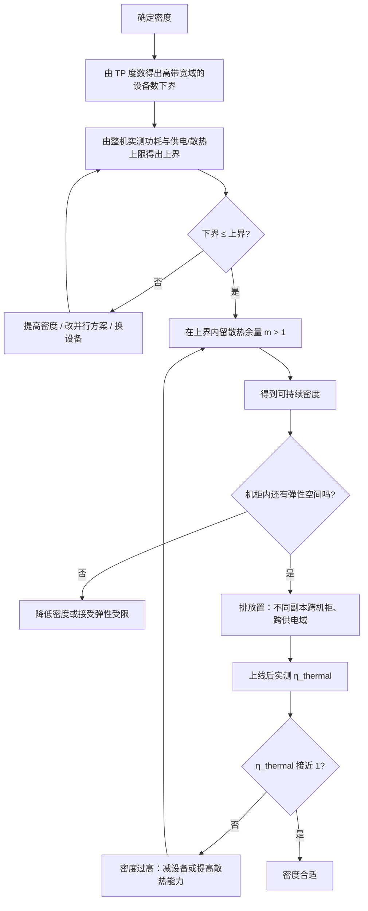

# 机架功率密度与扩容速度

> 位置：[InferenceAtlas](../../INDEX.md) > [模块 09](README.md) > 当前文档
> 信息截至：2026-07-29 ｜ 最后核验：2026-07-29 ｜ 内容版本：v0.1
> 时效性等级：低
> 相关主题：[AI 数据中心总览](01_ai_datacenter_overview.md)｜`03_power_delivery_48v_and_busbar.md`｜[容量规划](../01_foundations_and_metrics/08_capacity_planning.md)

## 本章导读

机架功率密度是一个**同时被四方拉扯的参数**：
性能想要它高（更多设备在同一个高带宽域内）、
成本想要它高（摊薄空间与固定设施）、
可靠性想要它低（故障域更小）、
设施能力限制它的上界。

本章要回答的核心问题是：**给定一个推理部署，密度该定在哪里**。

答案不是「越高越好」。有三个具体的反向力量：

**第一，故障域**。密度越高，一个机柜故障影响的设备越多，
**这与「副本分散」的放置原则直接冲突**。

**第二，散热余量**。跑在散热能力边缘会导致降频，
**而降频的性能是波动的，无法被计入容量规划**——
所以边缘运行的高密度反而可能不如留有余量的中密度。

**第三，扩容粒度**。高密度意味着扩容的最小单位更大
（一个机柜的建设与供电改造），
**这与推理负载需要的弹性直接冲突**。

本章给出**密度的三重约束与最优点的判断方法**、
**扩容的三个时间尺度**（这是推理弹性的真实边界）、
以及**密度与放置策略的联合设计**。

**关于数值的说明**：受出口策略限制，
本章不给出任何具体的功率密度、机柜规格或建设周期数值
（详见 [AGENTS.md 第 11 节](../../AGENTS.md)）。

## 学习目标

读完本章后，读者应能够：

1. 用三重约束算出一个机柜实际能放的设备数
2. 说明为什么「跑在散热能力边缘」的高密度可能不如留余量的中密度
3. 区分扩容的三个时间尺度，并说明各自对推理弹性的意义
4. 在密度与故障域之间做出有依据的权衡
5. 说明密度如何通过网络拓扑影响并行方案的可行性

## 核心结论

- **机柜容量由机位、供电、散热三者的最小值决定**，对 AI 服务器散热通常最紧。
- **跑在散热边缘的高密度会导致降频，而波动的性能无法计入容量**——留余量买的是「可保证的性能」。
- **扩容有三个时间尺度**：机柜内加设备（快）、机房内加机柜（中）、站点增容（慢），而推理弹性只能依赖第一个。
- **密度与故障域直接冲突**：同一机柜内的设备越多，单次故障影响面越大。
- **密度通过网络拓扑影响并行方案**：一个高带宽域能覆盖多少设备，决定了张量并行的上限。
- **最优密度不是最大密度**，而是「在散热余量、故障域与扩容粒度约束下的可持续密度」。

## 1. 问题定义、系统边界与工作负载

### 1.1 本章要回答的问题

**给定一个推理部署，机架密度该定在哪里**，
以及**这个选择如何影响扩容能力与故障影响面**。

**本章不涉及**：具体的机柜规格与建设工艺、
散热技术的实现细节（见下一章）。

### 1.2 四方拉扯

| 方向 | 想要 | 理由 |
|---|---|---|
| 性能 | **高密度** | 更多设备在同一高带宽域内 → 支持更高的 TP 度数 |
| 成本 | **高密度** | 摊薄空间与部分固定设施成本 |
| 可靠性 | **低密度** | 故障域更小 |
| 弹性 | **低密度** | 扩容粒度更细 |
| 设施 | 上界 | 供电与散热能力 |

**前两项与后两项方向相反**，这是本章的核心矛盾。

### 1.3 推理与训练在密度需求上的差异

| 维度 | 训练 | 推理 |
|---|---|---|
| 对高带宽域的需求 | 高（大规模并行） | **中（TP 度数受 $H_{kv}$ 等限制）** |
| 对弹性的需求 | 低 | **高** |
| 故障的代价 | 可从检查点恢复 | **在飞请求丢失** |

**推理对极高密度的需求弱于训练**：
张量并行的度数受通信占比与 $H_{kv}$ 可除性限制
（见 [Q061](../17_interview_prep/05_distributed_and_moe_questions.md)），
**所以「一个高带宽域要能放几十上百台」这样的需求在推理中不常见**。

**而推理对弹性与故障隔离的需求更强**。
**两者合起来意味着：推理场景的最优密度通常低于训练场景**。

## 2. 原理、数学与性能模型

### 2.1 三重约束

$$
N_{\text{rack}} = \min\left(
\underbrace{\left\lfloor \frac{H_{\text{rack}}}{h_{\text{server}}} \right\rfloor}_{\text{机位}},\;
\underbrace{\left\lfloor \frac{P_{\text{limit}}}{P_{\text{server}}} \right\rfloor}_{\text{供电}},\;
\underbrace{\left\lfloor \frac{\dot Q_{\text{cooling}}}{P_{\text{server}}} \right\rfloor}_{\text{散热}}
\right)
$$

**注意后两项的分母都是整机功耗**（见 [Q082](../17_interview_prep/06_hardware_and_datacenter_questions.md) 的三级口径），
**不是芯片功耗，也不是 TDP**。

**用 TDP 会低估设备数**（因为实际功耗常低于 TDP），
**用芯片功耗会高估**（漏掉主机部件）。
**正确的是整机实测功耗的高分位数**——
用高分位数而非均值，是因为供电与散热必须按峰值设计。

### 2.2 散热余量与热折扣

设散热能力为 $\dot Q_{\text{cooling}}$、实际热负荷为 $P_{\text{actual}}$，
定义余量比：

$$
m = \frac{\dot Q_{\text{cooling}}}{P_{\text{actual}}}
$$

**$m$ 与热折扣 $\eta_{\text{thermal}}$ 的定性关系**：

| 余量比 $m$ | 结果 |
|---|---|
| 明显大于 1 | 不降频，$\eta_{\text{thermal}} \approx 1$，**性能稳定可预测** |
| 接近 1 | **临界**：环境温度波动就可能触发降频 |
| 小于 1 | 持续降频，$\eta_{\text{thermal}} < 1$ 且随环境波动 |

**关键判断：有效算力是「设备数 × 热折扣」**：

$$
\text{有效算力} \propto N_{\text{rack}} \times \eta_{\text{thermal}}
$$

**所以把设备数推到散热极限不一定提高有效算力**——
多装的设备可能被降频抵消。**存在一个最优点**。

**更重要的是可预测性**：$m$ 接近 1 时 $\eta_{\text{thermal}}$ 随环境波动，
**而波动的性能无法被计入容量规划**
（容量按可保证的性能算，见 [Q083](../17_interview_prep/06_hardware_and_datacenter_questions.md)）。

**因此「留散热余量」买的不只是性能，更是性能的确定性**——
一个稳定输出 90% 标称性能的配置，
**在容量规划上优于一个在 70%–100% 之间波动的配置**。

### 2.3 扩容的三个时间尺度

| 尺度 | 动作 | 相对周期 | 对推理弹性的意义 |
|---|---|---|---|
| **快** | 机柜内加设备（有空位、有余量） | 短 | **弹性扩缩容可依赖** |
| **中** | 机房内加机柜（有电有冷有位） | 中 | 计划内扩容 |
| **慢** | 站点增容（供电、制冷改造） | **长** | 必须提前规划 |

**推理的弹性扩缩容只能依赖第一个尺度**——
后两个的周期远超任何流量波动的时间尺度。

**这给出一个重要的设计推论**：

$$
\text{弹性上限} = \text{已建成容量} - \text{当前使用容量}
$$

**即弹性的天花板是「已经建好但没用上的容量」**。

**而高密度会让这个余量更难留**：
如果机柜已经装到供电与散热的极限，
**机柜内就没有可用于快速扩容的空间**——
此时扩容必须走中或慢尺度。

**因此高密度与弹性直接冲突**，
**而推理对弹性的需求比训练强**。

### 2.4 密度与故障域

设单机柜 $N_{\text{rack}}$ 台设备，一次机柜级故障（供电或制冷）
影响的设备数就是 $N_{\text{rack}}$。

**对推理的影响**：

$$
\text{受影响的在飞请求} \approx N_{\text{rack}} \times C_{\text{per-server}}
$$

**与并行组的关系更关键**：
若一个并行组的成员全在同一机柜，
**机柜故障就是整组不可用**（张量并行是全或无）。

**所以密度上升时，「副本分散」需要更刻意的安排**：

| 密度 | 放置策略 |
|---|---|
| 低 | 一个机柜可能只放得下一个组，自然分散 |
| 高 | **一个机柜能放多个组 → 必须显式约束不同副本不同机柜** |

**高密度下如果不做这个约束，多个副本会被自然地放进同一机柜**，
**从而在一次机柜故障中一起丢失**。

### 2.5 密度与网络拓扑的耦合

高带宽域的覆盖范围决定张量并行的上限
（见 [Q081](../17_interview_prep/06_hardware_and_datacenter_questions.md)）。

**而高带宽域的物理范围通常与机柜相关**：
同机柜内的设备更容易被高带宽互连覆盖。

**因此**：

$$
P_{TP}^{\max} \le N_{\text{高带宽域}} \le N_{\text{rack}} \;(\text{通常})
$$

**推论**：如果模型需要的 TP 度数超过单机柜能容纳的设备数，
**要么提高密度，要么接受跨机柜的 TP（通信代价上升）**，
**要么改用其他并行方式**（PP 跨机柜、或多副本）。

**这是密度影响 IT 侧方案的最直接路径**。

## 3. 实现机制与系统设计

### 3.1 密度的选择流程

```text
1. 由推理需求算出所需的 TP 度数（模块 06）
       → 给出「一个高带宽域至少要覆盖几台」的下界
2. 由整机实测功耗（高分位数）与机柜供电/散热上限
       → 给出每柜设备数的上界
3. 检查下界 ≤ 上界？
       否 → 必须提高密度、或改并行方案、或换设备
       是 → 继续
4. 在上界内留散热余量：目标 m 明显大于 1
       → 得到「可持续密度」
5. 用可持续密度反算所需机柜数
6. 检查扩容余量：机柜内是否还留有快速扩容的空间
7. 安排放置：不同副本跨机柜、跨供电域
```

**第 4 步是本章的核心建议**：
**不要把设备数推到三重约束的上界，而要留散热余量**，
理由见 2.2——**波动的性能无法被计入容量**。

**第 6 步常被忽略**：装满的机柜没有弹性空间。

### 3.2 功耗取值的正确方式

供电与散热的分母应当取**整机功耗的高分位数**，而不是：

| 错误取值 | 后果 |
|---|---|
| 芯片功耗 | **严重高估设备数**（漏掉主机部件与供电损耗） |
| TDP | 低估设备数（实际功耗常低于 TDP） |
| 平均功耗 | **高估设备数**（峰值时会超限） |

**为什么用高分位数而不是峰值**：
瞬时峰值可能只持续极短时间，
**而配电与制冷有一定的短时过载能力**。
**但这个能力有多大必须向设施方确认**，
不能假设。

**保守的做法是用高分位数并留余量**。

### 3.3 混合密度部署

同一机房内不同机柜采用不同密度是常见的实践：

| 用途 | 密度 | 理由 |
|---|---|---|
| 需要大 TP 组的模型 | 高 | 一个高带宽域覆盖更多设备 |
| 多副本部署的小模型 | 中或低 | 不需要大高带宽域；分散更好 |
| 预留的弹性空间 | 低 | 留出快速扩容的余量 |

**混合部署的代价是运维复杂度**
（不同的散热方案、不同的配电）。

**但它的收益是让密度与用途匹配**，
而不是用一个密度服务所有场景。

### 3.4 密度对运维的影响

| 维度 | 高密度的影响 |
|---|---|
| 单次维护的影响面 | **更大**：动一个机柜影响更多设备 |
| 维护窗口 | 更难安排（要摘除更多流量） |
| 故障定位 | 更复杂（同柜设备互相影响，如热耦合） |
| 更换设备 | 液冷下更慢（需处理管路） |

**「热耦合」值得说明**：高密度下相邻设备的散热互相影响，
**一台设备的高负载可能让邻近设备温度上升从而降频**。
**这使得「某台设备慢」的根因可能在它的邻居**——
一个只有在高密度下才出现的故障模式。

### 3.5 监控上的要求

密度相关的监控项：

| 指标 | 为什么 |
|---|---|
| 每机柜的实际功率 | 与上限的距离；扩容余量 |
| 每机柜的进出风温差或冷却液温差 | 散热是否接近上限 |
| **按设备的芯片频率与温度** | 检测降频与位置差异 |
| 同机柜设备间的性能差异 | 检测热耦合 |

**第三项必须按设备而非按机柜聚合**——
**位置差异（上部 vs 下部、气流上游 vs 下游）只在逐设备的数据里可见**。

## 4. 性能、成本、能耗与可靠性 trade-off

### 4.1 密度的收益与代价总表

| 维度 | 高密度 | 低密度 |
|---|---|---|
| 高带宽域覆盖 | **好**：支持更高 TP | 差 |
| 空间成本摊薄 | **好** | 差 |
| 散热余量 | 差（易降频） | **好** |
| 故障域 | 差（影响面大） | **好** |
| 弹性空间 | 差（易装满） | **好** |
| 运维复杂度 | 差 | **好** |
| 建设成本（单柜） | 高（液冷、配电改造） | 低 |

**这张表的读法**：高密度只在前两项占优，
**而这两项恰好是最容易被看见的（性能与账面成本）**，
**其余五项的代价则是隐性的**。

**因此密度决策容易系统性偏高**——
除非有意识地把后五项也计入。

### 4.2 密度与总成本

高密度摊薄空间成本，**但增加了单柜的建设成本**（液冷、配电）。

**总成本的比较需要把两者放在一起**：

$$
C_{\text{total}} = N_{\text{rack}} \times C_{\text{rack,build}} + A_{\text{floor}} \times C_{\text{space}} + \dots
$$

**提高密度减少 $N_{\text{rack}}$ 与 $A_{\text{floor}}$，但提高 $C_{\text{rack,build}}$**。

**存在一个成本最优密度**，而它不一定是技术上的最大密度。
**具体位置依赖当地的空间成本与建设成本，必须按实际报价算**。

### 4.3 密度与能效

**高密度对 PUE 的影响是双向的**：

- **有利**：集中的热源更容易被高效移除（尤其液冷）；
- **不利**：接近散热上限时制冷系统需要更大的功率（更低的冷却液温度或更高的流量）。

**所以「高密度更节能」不是无条件成立的**——
它取决于是否留有足够的散热余量。
**跑在散热边缘的高密度可能同时损失性能（降频）与能效（制冷功耗上升）**。

## 5. benchmark、真实案例或公开部署案例

**本章不给出任何具体的功率密度、机柜规格、建设周期或成本数值**。

受当前环境的网络出口策略限制（详见 [AGENTS.md 第 11 节](../../AGENTS.md)），
本库无法访问设施规格或建设数据，**因此无法核验任何一项**。

**读者应自行填充的密度决策表**：

| 项 | 你的值 | 来源 |
|---|---|---|
| 所需 TP 度数 | 待填 | 由模块 06 算出 |
| 一个高带宽域覆盖的设备数 | 待填 | 网络团队，`官方披露` |
| 整机功耗（实测高分位数） | 待填 | **`独立可复现实验`** |
| 每机柜供电上限 | 待填 | 设施方，`官方披露` |
| 每机柜散热能力 | 待填 | 设施方，`官方披露` |
| 三重约束算出的上界 | 待填 | 计算 |
| 目标散热余量比 $m$ | 待填 | 由稳定性要求定 |
| **可持续密度**（留余量后） | 待填 | 计算 |
| 机柜内预留的弹性空间 | 待填 | 由弹性需求定 |
| 热稳态实测 $\eta_{\text{thermal}}$ | 待填 | **`独立可复现实验`** |
| 单机柜故障影响的并行组数 | 待填 | 由放置方案算 |

**「可持续密度」与「三重约束上界」的差值就是你为稳定性付的代价**，
**而 $\eta_{\text{thermal}}$ 会告诉你这个代价是否值得**——
若在上界密度下 $\eta_{\text{thermal}}$ 显著小于 1，
**那么上界密度的有效算力可能还不如可持续密度**。

> 实验方法论要求见 [如何读推理 benchmark](../00_start_here/03_how_to_read_inference_benchmarks.md)。

## 6. 设计决策框架



**图解读**：

1. **本图展示什么**：密度选择的完整流程。
   下界来自 IT 侧（TP 度数），上界来自设施侧，
   **中间要留余量，最后必须实测验证**。
2. **核心瓶颈**：瓶颈在 F 节点「留散热余量」。
   **这一步最容易被跳过**——
   把设备数推到上界看起来是「充分利用」，
   **实际上可能因降频而得不偿失，且性能变得不可预测**。
3. **图中的 trade-off**：H 节点的弹性空间检查会进一步降低密度。
   **代价是单柜利用率下降，收益是弹性扩缩容成为可能**——
   而对推理负载，弹性通常比单柜密度更有价值。
4. **面试如何引用**：可以说
   「密度的下界由 TP 度数决定，上界由供电与散热决定，
   **而我会在上界内留散热余量并预留弹性空间**——
   因为降频的性能是波动的，无法计入容量」。

**K→L 的实测验证不可省略**：
密度是否合适**只能在热稳态下实测**，
设计阶段的计算只是估计。

## 7. 常见失败模式与排查路径

| 症状 | 根因 | 修正 |
|---|---|---|
| 机柜有空位但不让装 | 供电或散热先达上限 | 按三重约束的最小值算 |
| 加了设备但总算力没同比增加 | 降频抵消了新增设备 | 实测 $\eta_{\text{thermal}}$；减密度或增散热 |
| 性能随季节或时段波动 | 散热余量不足，受环境温度影响 | 提高余量比 $m$ |
| 无法快速扩容 | 机柜已装满，只能走中/慢尺度 | 预留弹性空间 |
| 一次机柜故障影响多个副本 | 高密度下副本被放进同一机柜 | 显式约束副本跨机柜 |
| 某台设备持续慢于同柜其他设备 | 位置散热差或热耦合 | 逐设备监控频率与温度 |
| TP 组被迫跨机柜，通信占比高 | 密度不足以覆盖所需 TP 度数 | 提高密度或改并行方案 |
| 用芯片功耗算出的设备数装不下 | 功耗口径错 | 用整机实测功耗高分位数 |

**排查顺序**：**先确认功耗口径，再看三重约束，最后实测热折扣**。

## 8. 关联面试主题

1. 从 QPS 推导到机柜数——见 [Q084](../17_interview_prep/06_hardware_and_datacenter_questions.md)
2. 降频的检测与容量影响——见 [Q083](../17_interview_prep/06_hardware_and_datacenter_questions.md)
3. 互连层级与 TP 上限——见 [Q081](../17_interview_prep/06_hardware_and_datacenter_questions.md)
4. 放置策略：组内集中、副本分散——见 [Q072](../17_interview_prep/05_distributed_and_moe_questions.md)
5. TP 度数的四个限制——见 [Q061](../17_interview_prep/05_distributed_and_moe_questions.md)

## 9. 小结

机架密度是一个被四方拉扯的参数：
性能与成本想要它高，可靠性与弹性想要它低，设施能力给出上界。

**本章的四条核心判断**：

**第一，容量由三重约束的最小值决定**，
而对 AI 服务器散热通常最紧。
**分母必须是整机实测功耗的高分位数**——
用芯片功耗会严重高估设备数，用 TDP 会低估，用平均值会在峰值超限。

**第二，不要把密度推到上界**。
有效算力是「设备数 × 热折扣」，
**多装的设备可能被降频抵消**；
更重要的是**波动的性能无法被计入容量规划**，
所以留余量买的是性能的确定性而不只是性能本身。

**第三，高密度与弹性直接冲突**。
推理的弹性扩缩容只能依赖「机柜内加设备」这个快尺度，
**而它的天花板是已建成但未使用的容量**——
装满的机柜没有弹性。
**这一点对推理比对训练重要得多**。

**第四，高密度需要更刻意的副本分散**。
低密度时一个机柜可能只放得下一个并行组，分散是自然的；
**高密度下多个副本会被自然地放进同一机柜，从而在一次故障中一起丢失**。

一条容易被忽略的观察：**密度决策容易系统性偏高**，
因为高密度的收益（性能、账面成本）是显性的，
**而代价（散热余量、故障域、弹性、运维复杂度）是隐性的**。
**有意识地把后四项计入，是做出平衡决策的关键**。

本章不给出任何具体的密度、规格或周期数值——当前环境无法核验。
第 5 节给出的是一份决策表模板，
**其中「可持续密度」与「三重约束上界」的差值，就是你为稳定性付的价**。

## 关键术语

| 中文术语 | 英文 | 定义 | 单位/口径 | 关联文档 |
|---|---|---|---|---|
| 三重约束 | triple constraint | 机位、供电、散热三者取最紧 | 台 | 本章 2.1 |
| 散热余量比 | cooling margin ratio | 散热能力与实际热负荷之比 | 无量纲 | 本章 2.2 |
| 热折扣 | thermal derating | 热稳态下实际算力与标称之比 | 无量纲比例 | 本章 2.2 |
| 可持续密度 | sustainable density | 留足散热余量后的机柜设备数 | 台 | 本章 3.1 |
| 弹性空间 | headroom for elasticity | 已建成但未使用的机柜内容量 | 台 | 本章 2.3 |
| 热耦合 | thermal coupling | 相邻设备的散热互相影响 | — | 本章 3.4 |

## 延伸阅读

- [AI 数据中心总览](01_ai_datacenter_overview.md)
- [容量规划](../01_foundations_and_metrics/08_capacity_planning.md)
- [AI 推理硬件总览](../07_hardware_and_server_architecture/01_ai_inference_hardware_overview.md)
- [多节点服务拓扑](../06_distributed_and_moe_inference/09_multi_node_serving_topologies.md)
- [张量并行推理](../06_distributed_and_moe_inference/02_tensor_parallel_inference.md)

## 主要来源

本章由三重约束的算术关系、
[模块 01 第 8 章](../01_foundations_and_metrics/08_capacity_planning.md) 的容量模型、
以及 [模块 06 第 2、9 章](../06_distributed_and_moe_inference/02_tensor_parallel_inference.md) 的并行与放置约束推导而成。

**不含任何需要外部核验的功率密度、机柜规格、建设周期或成本数值**。
受当前环境的网络出口策略限制，本库无法访问设施规格数据
（详见 [AGENTS.md 第 11 节](../../AGENTS.md)）。

| 类别 | 说明 | 披露标签 |
|---|---|---|
| 三重约束、散热余量与热折扣、扩容三尺度 | 由算术关系与模块 01、06 推导 | — |
| 密度与故障域、网络拓扑的耦合 | 由模块 06 的放置模型推导 | — |
| 读者自行填充的密度决策表 | 应查设施方文档与自行实测 | `官方披露` / `独立可复现实验` |
| 任何具体的功率密度、规格、周期与成本 | **本章未给出** | `待核实` |

## 更新记录

| 日期 | 版本 | 变更 | 核验人 |
|---|---|---|---|
| 2026-07-29 | v0.1 | 初稿：三重约束、散热余量与热折扣、扩容三尺度、密度与故障域及拓扑的耦合 | — |
