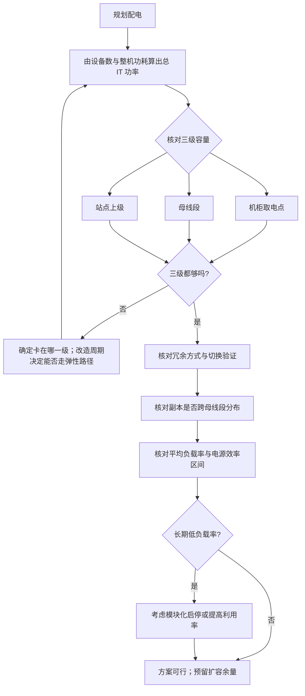

# 配电链路：电压、母线与转换损耗

> 位置：[InferenceAtlas](../../INDEX.md) > [模块 09](README.md) > 当前文档
> 信息截至：2026-07-29 ｜ 最后核验：2026-07-29 ｜ 内容版本：v0.1
> 时效性等级：低
> 相关主题：[机架功率密度](02_rack_power_and_density.md)｜[散热方式](04_cooling_air_direct_liquid_and_immersion.md)｜`05_power_usage_effectiveness_and_energy_modeling.md`

## 本章导读

配电链路的全部工程逻辑可以从一个式子推出：

$$
P_{\text{loss}} = I^2 R
$$

**损耗随电流平方增长**。而在功率一定时电流与电压成反比，
**所以提高配电电压的收益是平方级的，而加粗导体的收益只是线性的**。
这一条解释了为什么在机柜功率密度上升时，
业界的技术方向是提高机柜内的配电电压而不是简单地加粗铜排。

第二条主线是**转换级数**。从市电到芯片要经过多级电压转换，
**每一级都有效率损失，而效率是相乘的**。
$n$ 级各 $\eta_i$ 的总效率是 $\prod \eta_i$——
**所以减少级数比提升单级效率更有效**，
尤其当单级效率已经很高时（从 0.97 提到 0.98 的空间有限，
但去掉一级就直接省下该级的全部损耗）。

第三条主线是**配电与推理负载的相互作用**：
推理的功率随流量波动，
**而电源在低负载率下的效率通常低于额定点**，
所以**一个按峰值配置的供电系统在日常低负载时效率更差**——
这又一次把「利用率」与效率联系起来。

**关于数值的说明**：受出口策略限制
（详见 [AGENTS.md 第 11 节](../../AGENTS.md)），
本章不给出任何具体的电压标准、效率数值或设备规格，
**只给物理关系与设计约束**。文件名中的「48V」是本模块规划时的占位表述，
**具体的电压标准应查设施与厂商的官方文档并标注 `官方披露`**。

## 学习目标

读完本章后，读者应能够：

1. 用 $P_{\text{loss}} = I^2R$ 解释为什么提高配电电压优于加粗导体
2. 说明多级转换的效率相乘关系，并由此判断优化方向
3. 解释母线配电相比逐机柜布线的结构性优势
4. 说明电源效率随负载率变化如何与推理的波动负载相互作用
5. 列出评估一个配电方案时应当核对的项

## 核心结论

- **配电损耗随电流平方增长**，因此提高电压的收益是平方级、加粗导体是线性级。
- **多级转换的效率相乘**，所以减少级数通常比提升单级效率更有效。
- **母线配电把「每机柜独立布线」变成「共享干线 + 就近取电」**，提高了灵活性并减少了改造工作量。
- **电源在低负载率下效率通常低于额定点**，因此按峰值配置的系统在日常低负载时效率更差。
- **配电损耗计入 PUE 而非 IT 功耗**，这决定了它出现在成本核算的哪一侧。
- **配电容量是扩容的硬约束之一**，且它的改造周期属于「慢尺度」。

## 1. 问题定义、系统边界与工作负载

### 1.1 系统边界

```text
市电 → 变压 → 不间断供电/储能 → 机房配电 → 机柜配电（母线）
     → 服务器电源 → 板级转换 → 芯片供电
       └────── 计入 IT 功耗 ──────┘
└──────── 计入设施功耗（PUE 分子） ────────┘
```

**这条分界线很重要**：
**服务器电源之前的损耗计入设施侧（抬高 PUE），之后的计入 IT 功耗**。
**同一份损耗记在哪一侧，会改变 PUE 与「每 token 能耗」两个数字的表观值**，
所以比较不同设施时必须确认分界口径一致。

### 1.2 为什么推理团队需要理解这一层

| 配电层的事实 | 对推理的影响 |
|---|---|
| 机柜配电容量 | 三重约束之一，决定单柜设备数 |
| 配电改造周期长 | 扩容的「慢尺度」，必须提前规划 |
| 配电冗余等级 | 决定单点故障影响的机柜范围 |
| 电源效率随负载变化 | 低利用率时能效更差 |

## 2. 原理、数学与性能模型

### 2.1 损耗的平方律

导体损耗：

$$
P_{\text{loss}} = I^2 R
$$

功率一定时 $I = P/V$，代入：

$$
P_{\text{loss}} = \left(\frac{P}{V}\right)^2 R = \frac{P^2 R}{V^2}
$$

**两个推论**：

| 变化 | 损耗的变化 |
|---|---|
| 功率翻倍，电压不变 | **损耗变为四倍** |
| 电压翻倍，功率不变 | **损耗降为四分之一** |
| 电阻减半（加粗导体），其余不变 | 损耗减半 |

**对比第二行与第三行**：
**提高电压的收益是平方级，加粗导体是线性级**。

**而加粗导体还有实际限制**：
铜的成本、重量、弯曲半径、以及机柜内的空间。
**所以在功率密度上升时，提高电压是更可行的方向**。

### 2.2 损耗占比的相对形式

把损耗表示为传输功率的比例：

$$
\frac{P_{\text{loss}}}{P} = \frac{P R}{V^2}
$$

**这个形式说明：损耗占比正比于传输功率、反比于电压平方**。

**实践含义**：**同一套配电在功率密度上升后，损耗占比会同比上升**——
所以「现在的配电够用」不等于「密度翻倍后还够用」，
**不仅是容量问题，还是效率问题**。

### 2.3 多级转换的效率相乘

设 $n$ 级转换各自效率 $\eta_i$，总效率：

$$
\eta_{\text{total}} = \prod_{i=1}^{n} \eta_i
$$

**取对数看更清楚**：

$$
\ln \eta_{\text{total}} = \sum_i \ln \eta_i
$$

**即总损失是各级损失的累加**。

**两个优化方向的对比**：

| 方向 | 效果 |
|---|---|
| 提升单级效率 | 收益受限于该级的剩余空间 |
| **减少级数** | **直接消除该级的全部损失** |

**当各级效率已经较高时，减少级数的边际收益更大**——
因为把 0.97 提到 0.98 只赚回该级损失的三分之一，
**而去掉一级赚回它的全部**。

**这解释了「高压直流配电到机柜、机柜内就近降压」这一方向**：
它同时做了两件事——提高电压（平方律）与减少级数（相乘律）。

### 2.4 电源效率随负载率的变化

电源（以及各级转换器）的效率不是常数，
**它随负载率变化，通常在某个中高负载区间达到峰值，在低负载率下明显下降**。

**这与推理负载的相互作用**：

| 场景 | 负载率 | 电源效率 | 后果 |
|---|---|---|---|
| 流量高峰 | 高 | 接近峰值 | 效率好 |
| 日常 | 中 | 较好 | — |
| 低谷 | **低** | **明显下降** | **能效变差** |

**而供电系统是按峰值配置的**，
**所以它在大部分时间运行在低于额定的负载率上**。

**两个缓解方向**：

1. **提高平均利用率**（混合负载、弹性）——
   这与 [模块 11 第 5 章](../11_benchmarking_reliability_and_observability/05_power_energy_and_cost_benchmarks.md) 的结论一致：
   **利用率是能效的核心杠杆**，它在配电层同样成立；
2. **配电的模块化**：低负载时关闭部分供电模块，
   **让剩余模块运行在更高的负载率上**。

**第二点是配电层特有的手段**，
**它要求供电系统支持模块级的启停且不影响可靠性**。

### 2.5 冗余配置与效率的冲突

冗余供电意味着正常运行时每路的负载率更低，
**而低负载率意味着效率更差**（见 2.4）。

**这是一个直接的冲突**：

| 配置 | 可靠性 | 每路负载率 | 效率 |
|---|---|---|---|
| 无冗余 | 差 | 高 | **好** |
| 冗余 | **好** | 低 | 差 |

**缓解方式是「冗余但不均分」**：
让主路运行在高效率区间，备路待命，
**而不是让两路各承担一半**。
**代价是切换时的瞬态需要被妥善处理**。

**这个取舍应当被明确计算**：
冗余带来的可用性提升 vs 效率下降带来的持续电力成本。

## 3. 实现机制与系统设计

### 3.1 母线配电的结构优势

**逐机柜独立布线** vs **共享母线 + 就近取电**：

| 维度 | 独立布线 | 母线 |
|---|---|---|
| 扩容/改容 | 需重新布线 | **在母线上加取电点** |
| 容量分配 | 固定 | **可按需分配** |
| 施工工作量 | 大 | 小 |
| 单点影响面 | 单柜 | **母线故障影响该段全部** |

**母线的核心价值是灵活性**：
机柜功率需求变化时（换设备、加密度），
**不需要重新布线，只需调整取电配置**。

**代价是故障域**：一段母线的故障影响挂在其上的全部机柜。
**因此并行组的副本不应全部挂在同一段母线上**——
**这是「副本分散」原则在配电层的体现**，
且它比机柜级的分散更容易被忽略，因为母线的分段不像机柜那样直观可见。

### 3.2 三级容量的核对

扩容时必须核对三级配电容量，**任何一级不足都会卡住**：

| 级 | 约束 | 改造周期 |
|---|---|---|
| 机柜取电点 | 单柜功率上限 | 短 |
| 母线段 | 该段挂载的总功率 | 中 |
| 上级配电与站点 | 站点总容量 | **长** |

**常见的失误是只核对了第一级**：
单柜功率在上限内，**但整段母线已接近容量**，
**于是「机柜能装但整排不能同时满载」**。

**这类问题在按机柜规划的容量表里完全不可见**，
必须显式核对母线段与上级容量。

### 3.3 供电冗余与推理负载

| 冗余方式 | 单点故障的后果 | 对推理的影响 |
|---|---|---|
| 无冗余 | 该路全部断电 | **在飞请求全部丢失** |
| 双路供电 | 切换到另一路 | 通常无影响（若切换成功） |
| 双路 + 储能 | 覆盖切换瞬态 | 无影响 |

**对推理的特殊考虑**：

**断电是硬故障**——设备直接停机，
**在飞请求的 KV 全部丢失且无法恢复**
（见 [Q075](../17_interview_prep/05_distributed_and_moe_questions.md)）。
**恢复需要从持久化的 prompt 与已返回 token 重建**，
**而这会在接收方形成负载尖峰**。

**因此供电冗余的价值对推理高于对训练**：
训练可以从检查点恢复，
**推理的在飞请求是不可恢复的**。

### 3.4 配电的监控项

| 指标 | 为什么 |
|---|---|
| 每机柜实际功率 | 与上限的距离；扩容余量 |
| **每母线段的总功率** | **最容易被忽略的一级** |
| 各路负载率 | 效率与冗余状态 |
| 转换效率（若可测） | 识别劣化 |
| 供电切换事件 | 可靠性事件的记录 |

**第二行值得强调**：
**按机柜监控功率是常见做法，按母线段聚合则常被遗漏**，
**而后者才是扩容时真正卡住的那一级**。

### 3.5 配电与散热的联动

配电损耗最终也变成热量。
**机房内的配电损耗需要被制冷系统移走**，
**因此它同时消耗电力与散热能力**。

**一个容易被忽略的联动**：
提高配电效率不仅省电，**还减少了需要移走的热量**，
**从而释放了散热能力**——
在散热是紧约束的场景下，这是一个额外的收益。

## 4. 性能、成本、能耗与可靠性 trade-off

### 4.1 配电效率的经济性

$$
\text{年节省} = P_{\text{IT}} \times \Delta\left(\frac{1}{\eta_{\text{total}}} - 1\right) \times 8760 \times \text{电价}
$$

**注意 $P_{\text{IT}}$ 应取平均值而非峰值**，
**而平均值取决于利用率**——
**低利用率的集群，配电效率改造的绝对收益也低**。

**这与散热改造、PUE 改造是同一个结构**：
**所有设施侧的效率投入，其收益都被利用率缩放**。

### 4.2 冗余与效率

见 2.5。**决策建议**：

| 场景 | 建议 |
|---|---|
| 在线推理，SLO 严格 | 冗余优先，接受效率损失 |
| 离线批处理 | 效率优先，冗余可降低 |
| 混合 | **分区**：在线区高冗余，离线区高效率 |

**分区是同时满足两者的实用方式**，
它与 [第 2 章](02_rack_power_and_density.md) 3.3 的混合密度部署是同一个思路。

### 4.3 容量余量与扩容能力

配电容量留余量的价值与散热余量类似：
**它是弹性扩容的前提**。

**而配电改造属于「慢尺度」**（见 [第 2 章](02_rack_power_and_density.md) 2.3），
**所以配电余量不足会直接卡死弹性**——
即使有空闲机位与散热能力。

**因此三重约束的余量应当被一起规划**，
而不是只看其中一项。

## 5. benchmark、真实案例或公开部署案例

**本章不给出任何具体的电压标准、效率数值或设备规格**。

受当前环境的网络出口策略限制（详见 [AGENTS.md 第 11 节](../../AGENTS.md)），
本库无法访问配电标准文档或设备规格，**因此无法核验任何一项**。
**本章文件名中的「48V」是模块规划时的占位表述**，
具体的电压标准应查设施与厂商官方文档。

**读者应自行填充的配电核对表**：

| 项 | 你的值 | 来源 |
|---|---|---|
| 机柜取电点容量上限 | 待填 | 设施方，`官方披露` |
| **每母线段的容量上限与当前负载** | 待填 | 设施方，**最易被忽略** |
| 站点上级配电容量与余量 | 待填 | 设施方 |
| 配电电压等级与转换级数 | 待填 | 设施方 |
| 各级转换效率（若可得） | 待填 | 设施方，`官方披露` |
| 当前平均负载率 | 待填 | `独立可复现实验` |
| 供电冗余方式与切换验证记录 | 待填 | 设施方 + 演练 |
| 并行组副本是否跨母线段分布 | 待填 | 由放置方案核对 |
| 配电改造的周期 | 待填 | 设施方 |

**倒数第二行是本表最容易被遗漏的检查**：
机柜级的分散不等于母线级的分散，
**而母线段故障会同时影响挂在其上的全部机柜**。

> 实验方法论要求见 [如何读推理 benchmark](../00_start_here/03_how_to_read_inference_benchmarks.md)。

## 6. 设计决策框架



**图解读**：

1. **本图展示什么**：配电规划的核对链。
   核心是三级容量都要核对，
   而不是只看机柜级。
2. **核心瓶颈**：瓶颈在 E 节点「母线段」。
   **这一级最容易被漏掉**——
   单柜功率在上限内不代表整段母线能承载全部机柜同时满载，
   **而这类问题在按机柜规划的容量表里完全不可见**。
3. **图中的 trade-off**：J 节点（副本跨母线段）会限制放置的自由度，
   可能与「组内集中」的性能原则冲突。
   **处理方式与机柜级相同：组内集中在一段母线内，不同副本跨段**。
4. **面试如何引用**：可以说
   「配电要核对三级容量——机柜取电点、母线段、站点上级；
   **其中母线段最容易被漏掉**，
   而且副本的分散要做到母线段这一级而不只是机柜级」。

## 7. 常见失败模式与排查路径

| 症状 | 根因 | 修正 |
|---|---|---|
| 单柜功率没超但整排不能满载 | 母线段容量不足 | 按母线段聚合核对 |
| 扩容被卡住且周期很长 | 站点上级配电容量不足 | 提前规划；预留余量 |
| 一次配电故障影响多个副本 | 副本挂在同一段母线上 | 副本跨母线段分布 |
| 低谷期能效明显变差 | 电源在低负载率下效率下降 | 提高利用率或模块化启停 |
| 密度翻倍后配电损耗占比上升 | 损耗占比正比于功率 | 提高配电电压或减少级数 |
| PUE 比较不一致 | IT 与设施的分界口径不同 | 确认分界点一致 |
| 供电切换时仍有请求丢失 | 切换瞬态未被覆盖 | 检查储能与切换时间；演练 |

**排查顺序**：**先核对是哪一级容量卡住，再看冗余与分散，最后看效率**。

## 8. 关联面试主题

1. 三级功耗口径与 PUE——见 [Q082](../17_interview_prep/06_hardware_and_datacenter_questions.md)
2. 从 QPS 推导到机柜数——见 [Q084](../17_interview_prep/06_hardware_and_datacenter_questions.md)
3. 单机故障的影响与恢复——见 [Q075](../17_interview_prep/05_distributed_and_moe_questions.md)
4. 放置策略与故障域——见 [Q072](../17_interview_prep/05_distributed_and_moe_questions.md)
5. 利用率作为成本与能效的核心杠杆——见 [Q099](../17_interview_prep/08_company_paper_and_strategy_questions.md)

## 9. 小结

配电链路的工程逻辑由两个式子决定：

**$P_{\text{loss}} = I^2R$**——损耗随电流平方增长，
**所以提高电压的收益是平方级、加粗导体是线性级**。
这解释了机柜内配电电压上升的技术方向。
同时它给出一个容易被忽略的推论：
**损耗占比正比于传输功率**，
所以「现在的配电够用」不等于「密度翻倍后还够用」——
**不仅是容量问题，还是效率问题**。

**$\eta_{\text{total}} = \prod \eta_i$**——多级转换的效率相乘，
**所以减少级数通常比提升单级效率更有效**，
尤其在各级效率已经较高时。

**三条实践结论**：

**第一，必须核对三级容量**：机柜取电点、母线段、站点上级。
**其中母线段最容易被漏掉**——
单柜没超不代表整段能承载全部机柜同时满载，
**而这在按机柜规划的容量表里完全不可见**。

**第二，副本的分散要做到母线段这一级**。
机柜级的分散不够：一段母线的故障会同时影响挂在其上的全部机柜。
**这比机柜级分散更容易被忽略，因为母线分段不像机柜那样直观**。

**第三，电源效率随负载率变化，而供电按峰值配置**，
**所以系统大部分时间运行在低于额定的负载率上，效率更差**。
缓解方向有两个：提高平均利用率（与散热、PUE 的结论一致），
以及配电的模块化启停（配电层特有的手段）。

一个容易被忽略的联动：**配电损耗也变成热量**，
所以提高配电效率不仅省电，**还释放了散热能力**——
在散热是紧约束时这是一笔额外的收益。

本章不给出任何具体的电压、效率或规格数值——当前环境无法核验。
**文件名中的「48V」是规划时的占位表述**，具体标准应查官方文档。

## 关键术语

| 中文术语 | 英文 | 定义 | 单位/口径 | 关联文档 |
|---|---|---|---|---|
| 平方律损耗 | $I^2R$ loss | 导体损耗随电流平方增长 | 瓦 | 本章 2.1 |
| 转换级数 | conversion stages | 从市电到芯片的电压转换次数 | 级 | 本章 2.3 |
| 母线 | busbar | 共享的配电干线，机柜就近取电 | — | 本章 3.1 |
| 负载率 | load factor | 实际功率与额定功率之比 | 无量纲比例 | 本章 2.4 |
| 母线段 | busbar segment | 共享一段母线的机柜集合，构成一个故障域 | — | 本章 3.1 |

## 延伸阅读

- [AI 数据中心总览](01_ai_datacenter_overview.md)
- [机架功率密度与扩容速度](02_rack_power_and_density.md)
- [风冷、冷板液冷与浸没式散热](04_cooling_air_direct_liquid_and_immersion.md)
- [能效与每 token 焦耳](../01_foundations_and_metrics/07_energy_efficiency_and_joules_per_token.md)
- [容错与优雅降级](../06_distributed_and_moe_inference/10_fault_tolerance_and_graceful_degradation.md)

## 主要来源

本章由电路的基本关系（$P = I^2R$、效率相乘）、
[模块 01 第 7 章](../01_foundations_and_metrics/07_energy_efficiency_and_joules_per_token.md) 的功耗口径、
以及 [模块 06 第 9–10 章](../06_distributed_and_moe_inference/09_multi_node_serving_topologies.md) 的放置与容错原则推导而成。

**不含任何需要外部核验的电压标准、效率数值或设备规格**。
受当前环境的网络出口策略限制，本库无法访问配电标准或设备文档
（详见 [AGENTS.md 第 11 节](../../AGENTS.md)）。
**文件名中的「48V」为模块规划时的占位表述，本文未对其做任何事实性陈述**。

| 类别 | 说明 | 披露标签 |
|---|---|---|
| 平方律、效率相乘、负载率与效率的定性关系 | 基本电路与设备特性 | — |
| 三级容量核对、母线故障域、分散原则 | 由结构分析与模块 06 推导 | — |
| 读者自行填充的配电核对表 | 应查设施方文档 | `官方披露` |
| 任何具体的电压标准、效率与规格 | **本章未给出** | `待核实` |

## 更新记录

| 日期 | 版本 | 变更 | 核验人 |
|---|---|---|---|
| 2026-07-29 | v0.1 | 初稿：平方律与效率相乘、母线配电、三级容量核对、负载率与效率的相互作用 | — |
