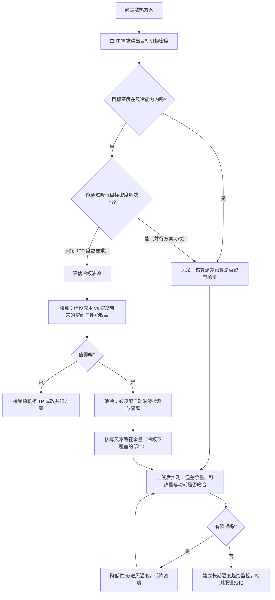

# 风冷、冷板液冷与浸没式散热

> 位置：[InferenceAtlas](../../INDEX.md) > [模块 09](README.md) > 当前文档
> 信息截至：2026-07-29 ｜ 最后核验：2026-07-29 ｜ 内容版本：v0.1
> 时效性等级：低
> 相关主题：[机架功率密度](02_rack_power_and_density.md)｜[AI 数据中心总览](01_ai_datacenter_overview.md)｜`05_power_usage_effectiveness_and_energy_modeling.md`

## 本章导读

散热方案的选择表面上是一个设施工程问题，
**实际上它直接决定了推理系统的两个关键量**：
**可达到的机柜密度**（从而决定高带宽域能覆盖多少设备）
与**芯片能否跑在标称频率**（从而决定容量规划是否成立）。

本章的物理主线只有一个式子：

$$
\dot Q = \dot m \cdot c_p \cdot \Delta T
$$

**移热能力 = 流量 × 比热容 × 温差**。
三个因子各有实际上界，
**而空气在「体积比热容」这一项上比液体差得多**——
这就是风冷存在密度天花板、而液冷能突破它的全部原因。

本章的第二条主线是**温差的分配**。
从芯片结温到最终排到环境，中间经过若干级热阻，
**每一级都要消耗一部分可用温差**。
理解这个「温差预算」能解释很多实践现象：
为什么进风温度提高一度就可能触发降频、
为什么冷却液温度是液冷系统最关键的运行参数、
以及为什么同一套散热方案在不同季节表现不同。

**关于数值的说明**：受出口策略限制
（详见 [AGENTS.md 第 11 节](../../AGENTS.md)），
本章不给出任何具体的温度、流量、热阻或散热能力数值，
**只给物理关系与设计约束**。

## 学习目标

读完本章后，读者应能够：

1. 用 $\dot Q = \dot m c_p \Delta T$ 解释风冷的密度天花板与液冷的优势来源
2. 说明「温差预算」如何在从芯片到环境的各级热阻之间分配
3. 比较三种散热方式在密度、运维、故障模式上的差异
4. 判断一个部署应当选哪种散热方式，以及切换的触发条件
5. 说明散热方案如何反过来约束推理系统的部署方案

## 核心结论

- **移热能力由「流量 × 比热容 × 温差」决定**，而空气的体积比热容远低于液体——这是风冷密度天花板的物理根源。
- **从芯片到环境的温差是一个预算**，各级热阻分掉它；任何一级恶化都会挤压芯片可用的温差，表现为降频。
- **液冷的核心收益不只是更高密度，还有更稳定的芯片温度**，从而让性能可预测、可计入容量。
- **液冷把故障模式从「风扇失效」变成「漏液与流量不足」**，两者的检测与响应方式完全不同。
- **散热方案有比服务器生命周期长得多的锁定效应**，因此应按更长的时间尺度决策。
- **进风或供液温度是最关键的运行参数**：它直接决定留给芯片的温差余量。

## 1. 问题定义、系统边界与工作负载

### 1.1 热链路的系统边界

```text
芯片结温 T_j
   │  ← 结到壳的热阻
芯片外壳
   │  ← 界面材料热阻
散热器 / 冷板
   │  ← 散热器到流体的热阻（对流）
流体（空气 / 冷却液）
   │  ← 流体输运（本章的 Q = ṁ c_p ΔT）
换热设备（CRAC / CDU / 换热器）
   │
最终排热（室外空气 / 冷却塔 / 水体）
```

**本章关注从散热器到最终排热的部分**，
**以及它如何反过来约束芯片的结温**。

**不涉及**：芯片封装内部的传热（属于芯片设计）、
具体的制冷设备工程（属于设施工程）。

### 1.2 为什么推理团队需要理解这一层

三条直接影响：

| 散热层的事实 | 对推理的影响 |
|---|---|
| 散热能力决定密度上限 | 决定高带宽域覆盖的设备数 → **TP 度数上限** |
| 温差余量不足 → 降频 | **容量规划系统性高估** |
| 散热方案决定运维方式 | 影响维护窗口与故障恢复速度 |

## 2. 原理、数学与性能模型

### 2.1 移热的基本关系

$$
\dot Q = \dot m \cdot c_p \cdot \Delta T
$$

其中 $\dot m$ 是质量流量、$c_p$ 是比热容、$\Delta T$ 是流体进出的温升。

**用体积流量表达更便于比较不同介质**：

$$
\dot Q = \dot V \cdot \rho \cdot c_p \cdot \Delta T
$$

**$\rho c_p$ 是体积比热容**，它是介质的固有属性。
**液体的体积比热容远高于空气**
（空气密度小是主要原因），
**因此在相同的体积流量与温升下，液体能移走多得多的热量**。

**这一条就解释了液冷的全部物理优势**。

### 2.2 三个因子各自的上界

| 因子 | 上界来源 | 提高的代价 |
|---|---|---|
| $\dot V$（流量） | 风机/泵功率、噪声、管路阻力 | **功率随流量约三次方增长**（风机定律） |
| $c_p \rho$（介质） | 介质本身的物性 | 换介质 = 换整套方案 |
| $\Delta T$（温差） | 设备进风/进液温度要求与最高允许出口温度 | 见 2.3 |

**第一行的三次方关系很关键**：
风机功率大致随流量的三次方增长，
**所以「加大风量」的代价上升极快**——
流量提高到某个点之后，风机自身的功耗与噪声就不可接受了。

**这是风冷天花板的工程原因**（物理原因是 $\rho c_p$ 小）。

### 2.3 温差预算

从芯片结温 $T_j$ 到最终排热环境温度 $T_{\text{amb}}$，
中间的温差被各级热阻分掉：

$$
T_j - T_{\text{amb}} = \dot Q \cdot \left( R_{jc} + R_{\text{TIM}} + R_{\text{hs-fluid}} \right) + \Delta T_{\text{fluid}} + \Delta T_{\text{HX}}
$$

其中前三项是从结到流体的热阻链，
$\Delta T_{\text{fluid}}$ 是流体自身的温升，
$\Delta T_{\text{HX}}$ 是最终换热环节的温差。

**把它重排成「预算」的形式**：

$$
\underbrace{T_{j,\max} - T_{\text{amb}}}_{\text{总预算（固定）}} = \underbrace{\dot Q \sum R}_{\text{热阻消耗}} + \underbrace{\Delta T_{\text{fluid}} + \Delta T_{\text{HX}}}_{\text{输运与换热消耗}}
$$

**这个式子给出五个重要推论**：

**（一）总预算是固定的**。$T_{j,\max}$ 由芯片规格决定，
$T_{\text{amb}}$ 由环境决定。
**两者之差就是全部可用的温差**。

**（二）功率上升会按比例吃掉预算**。
热阻消耗项正比于 $\dot Q$，
**所以同样的散热方案在更高功耗下留给其他环节的余量更少**。

**（三）环境温度上升直接挤压预算**。
夏季 $T_{\text{amb}}$ 上升，
**总预算变小，而各项消耗不变——于是余量减少甚至为负**。
**这解释了「性能随季节波动」这一现象**。

**（四）任何一级热阻恶化都会挤压芯片**。
灰尘堵塞、界面材料老化、冷板结垢——
**它们都增加 $\sum R$，从而在其他条件不变时抬高 $T_j$**。

**（五）降低供液/进风温度是最直接的补救**。
它等价于降低 $T_{\text{amb}}$ 的有效值，**直接增加总预算**——
**代价是制冷系统需要更多功率**（PUE 上升）。

**这就是「性能与能效的直接交换」在散热层的形式**。

### 2.4 液冷为什么让性能更稳定

除了更高的密度上限，液冷还有一个常被低估的收益：
**温度更稳定**。

**原因有两条**：

1. **液体的热容大**，因此对瞬时功率波动的缓冲能力强——
   **推理负载的功率是波动的**，而波动在液冷下被更好地平滑；
2. **供液温度可以被精确控制**，
   而风冷的进风温度受机房气流组织与邻近设备影响更大。

**性能稳定的价值在容量规划**：
稳定的性能可以被计入容量，**波动的不能**
（见 [第 2 章](02_rack_power_and_density.md) 2.2）。

**因此液冷的价值不只是「能装更多」，还有「装的每一台都能稳定输出」**。

### 2.5 部分液冷与热量分配

冷板液冷通常只覆盖主要发热部件，
**其余部件仍靠风冷**。此时热量被分成两路：

$$
\dot Q_{\text{total}} = \dot Q_{\text{liquid}} + \dot Q_{\text{air}}
$$

**设计要点是两路都要够**：
即使液冷路径能力充足，
**若风冷路径不足以处理剩余热量，那部分部件仍会过热**。

**一个常见的实践问题**：改造为液冷后风量被下调（因为主要热源已被液冷带走），
**但剩余的风冷部件可能因此散热不足**——
**需要重新核算风冷路径的余量，而不是简单地按比例下调**。

## 3. 实现机制与系统设计

### 3.1 三种方式的对比

| 维度 | 风冷 | 冷板液冷 | 浸没式 |
|---|---|---|---|
| 密度上限 | 低到中 | 中到高 | 高 |
| 传热介质 | 空气 | 液体（间接接触） | 液体（直接接触） |
| 覆盖范围 | 全部部件 | **主要发热件，其余靠风冷** | 全部部件 |
| 温度稳定性 | 一般 | 好 | 好 |
| 机械改造 | 无 | 中（管路、快接头） | **大（机柜形态改变）** |
| 新增故障模式 | 风扇失效 | **漏液、流量不足、结垢** | 液体劣化、维护方式改变 |
| 单机维护 | 快 | 中（需断开管路） | **慢（需吊出沥干）** |
| 与现有机房兼容 | 好 | 中 | 差 |

**「覆盖范围」这一行常被忽略**：
冷板液冷是**部分**液冷，
**它不消除风冷路径，只是把主要热源移走**（见 2.5）。

### 3.2 液冷系统的关键运行参数

| 参数 | 影响 | 监控要求 |
|---|---|---|
| **供液温度** | 直接决定留给芯片的温差预算 | **必须持续监控** |
| 流量 | 决定 $\Delta T_{\text{fluid}}$ 与移热能力 | 需监控；下降是结垢或泵故障的信号 |
| 进出液温差 | 反映实际移走的热量 | 与功率对照可验证系统工作正常 |
| 压差 | 反映管路阻力 | 上升指向堵塞或结垢 |

**第三行值得展开**：由 $\dot Q = \dot m c_p \Delta T$，
**已知流量与进出温差就能算出实际移走的热量**，
**把它与设备的实测功耗对照，可以验证散热系统是否正常工作**——
若移走的热量明显小于功耗，说明有热量走了其他路径（或测量有误）。

**这是一个便宜且有效的自检**。

### 3.3 故障模式与响应

**风冷的主要故障**：

| 故障 | 表现 | 响应 |
|---|---|---|
| 风扇失效 | 局部温度上升 → 降频 | 告警 + 更换 |
| 气流短路（冷热风混合） | 进风温度上升 → 普遍降频 | 检查盲板与气流组织 |
| 滤网堵塞 | 风量下降 | 定期维护 |

**液冷的主要故障**：

| 故障 | 表现 | 响应 |
|---|---|---|
| **漏液** | 可能损坏设备 | **必须自动检测 + 隔离** |
| 流量不足（泵故障、堵塞） | 温度上升 → 降频 | 告警 + 切换备泵 |
| 结垢/腐蚀 | 热阻缓慢上升 → 温度缓慢上升 | 定期水质维护 |

**两个关键差异**：

1. **漏液是液冷独有的、可能造成硬件损坏的故障**，
   **因此必须有自动检测与隔离**，不能靠人工巡检；
2. **结垢是缓慢劣化**，
   表现为「温度随月份缓慢上升」——
   **这类问题在短期监控里几乎不可见，需要长期趋势观察**。

**第二点对推理的含义**：
**性能会随时间缓慢下降而没有任何突发信号**，
所以监控应当包含**同一负载下芯片温度的长期趋势**。

### 3.4 从散热方案反推部署约束

散热方案确定后，它约束了：

```text
散热能力 → 每机柜设备数上限（三重约束之一）
              ↓
        高带宽域能覆盖的设备数
              ↓
        张量并行度数的上限
              ↓
        能部署的模型规模与时延下界
```

**这条链说明散热方案是一个 IT 侧的约束而不只是设施问题**。

**一个具体的判断**：如果所需的 TP 度数要求一个高带宽域覆盖 $N$ 台设备，
**而风冷的密度上限放不下 $N$ 台**，
**那么要么上液冷，要么接受跨机柜的 TP（通信代价上升），要么改并行方案**。

### 3.5 切换散热方案的触发条件

| 触发 | 说明 |
|---|---|
| 目标密度超过风冷天花板 | 最直接的物理触发 |
| 降频持续存在且提高风量无效 | 已到风冷能力边界 |
| 所需 TP 度数放不进单机柜 | IT 侧需求驱动 |
| 能效目标要求更低的制冷功耗 | 液冷通常在高密度下更省 |

**同时要评估的三个代价**（见 3.1）：
机械改造、新增故障模式、单机维护变慢。

**而最容易被低估的是「锁定效应」**：
散热方案对机房结构与运维体系的影响
**比服务器本身的生命周期长得多**，
**所以它应当按更长的时间尺度决策**——
按当前一代设备的需求选散热方案，可能在下一代就不够用。

## 4. 性能、成本、能耗与可靠性 trade-off

### 4.1 供液/进风温度：性能与能效的直接交换

降低供液温度 → 温差预算增加 → 芯片温度更低 → 不降频；
**但制冷系统需要更多功率 → PUE 上升**。

**这是一个可以定量权衡的交换**：

$$
\text{收益} = \Delta\eta_{\text{thermal}} \times \text{IT 算力价值}, \qquad
\text{代价} = \Delta P_{\text{cooling}} \times \text{电价} \times \text{时间}
$$

**注意收益侧还有一项不易量化但重要的部分**：
**性能的可预测性**。
**一个稳定的性能可以被计入容量，而波动的不能**——
所以适度降低供液温度买到的不只是平均性能，还有容量的可保证性。

### 4.2 液冷的成本结构

| 项 | 风冷 | 液冷 |
|---|---|---|
| 建设 | 低 | **高**（管路、CDU、防漏） |
| 运行电力 | 风机功耗高 | **泵功耗通常低于风机** |
| 维护 | 简单 | 复杂（水质、管路、漏液防护） |
| 单位密度的空间成本 | 高（密度低） | **低（密度高）** |

**液冷的经济性通常在高密度下才成立**：
建设成本是固定投入，**只有在密度足够高、
从而摊薄了空间与建设成本时才划算**。

**因此「该不该上液冷」的判据是目标密度而不是技术先进性**。

### 4.3 可靠性的双向影响

| 方向 | 说明 |
|---|---|
| **改善** | 温度更低更稳 → 器件寿命更长、降频更少 |
| **恶化** | 新增漏液这一类可能损坏硬件的故障 |

**净效果取决于漏液防护的完善程度**。
**这意味着液冷的可靠性收益不是自动获得的**——
它要求自动检测、自动隔离、以及相应的运维流程。

### 4.4 与推理负载波动的相互作用

推理的功率随负载波动。**两种散热方式的响应不同**：

| 方式 | 对功率波动的响应 |
|---|---|
| 风冷 | 热容小，温度跟随功率波动较快 |
| 液冷 | **热容大，波动被平滑** |

**对推理的含义**：在流量尖峰时，
**风冷系统的芯片温度上升更快，更容易触碰降频阈值**——
**即恰好在最需要性能的时刻性能下降**。

**液冷的缓冲能力在这种场景下是一个实际的优势**，
而它在按稳定负载评估的对比中不会显现。

## 5. benchmark、真实案例或公开部署案例

**本章不给出任何具体的温度、流量、热阻、散热能力或成本数值**。

受当前环境的网络出口策略限制（详见 [AGENTS.md 第 11 节](../../AGENTS.md)），
本库无法访问散热设备规格、设施标准或运营数据，
**因此无法核验任何一项**。

**读者应自行采集的散热画像**：

| 项 | 你的值 | 怎么得到 |
|---|---|---|
| 芯片最高允许温度 | 待填 | 厂商文档，`官方披露` |
| 当前芯片温度（热稳态，按设备） | 待填 | **`独立可复现实验`** |
| 两者之差（温差余量） | 待填 | 计算 |
| 进风或供液温度 | 待填 | 设施监控 |
| 进出温差与流量 | 待填 | 设施监控 |
| 由 $\dot m c_p \Delta T$ 算出的实际移热量 | 待填 | 计算 |
| 设备实测功耗 | 待填 | `独立可复现实验` |
| **上两行是否吻合** | 待填 | **散热系统的自检** |
| 是否观察到降频（频率随时间的曲线） | 待填 | `独立可复现实验` |
| 同一负载下芯片温度的月度趋势 | 待填 | **检测结垢等缓慢劣化** |

**倒数第三行是本表最有价值的一项**：
**移热量与功耗不吻合说明散热系统没有按预期工作**，
而这个检查只需要设施侧已有的流量与温差数据。

**最后一行检测的是缓慢劣化**——
它在短期监控里完全不可见。

> 实验方法论要求见 [如何读推理 benchmark](../00_start_here/03_how_to_read_inference_benchmarks.md)。

## 6. 设计决策框架



**图解读**：

1. **本图展示什么**：散热方案的选择流程。
   起点是 IT 侧的密度需求，
   中间是「能否降低需求」这个常被跳过的检查，
   终点是上线后的实测验证与长期趋势监控。
2. **核心瓶颈**：瓶颈在 E 节点。
   **「能不能通过改并行方案降低密度需求」这个检查最容易被跳过**——
   而它可能避免一次昂贵的散热改造。
   **散热方案应当由需求驱动，而不是由「更先进」驱动**。
3. **图中的 trade-off**：K 节点（核算风冷路径余量）容易被遗漏。
   冷板液冷只覆盖主要发热件，
   **改造后若按比例下调风量，剩余部件可能散热不足**。
4. **面试如何引用**：可以说
   「我会先看目标密度是否超出风冷能力，
   **并且先检查能不能通过改并行方案降低密度需求**；
   如果确实需要液冷，必须同时评估漏液防护与剩余风冷路径」。

**O 节点的长期趋势监控不可省略**：
结垢等缓慢劣化**只在月度尺度上可见**，
而它的后果是性能悄悄下降。

## 7. 常见失败模式与排查路径

| 症状 | 根因 | 修正 |
|---|---|---|
| 性能随季节变化 | 环境温度挤压温差预算 | 提高散热余量或降低供液温度 |
| 加大风量但温度没降 | 已到风冷能力边界（三次方代价） | 换散热方式或降密度 |
| 液冷改造后部分部件过热 | 风冷路径被过度下调 | 重新核算未被冷板覆盖部件的风量 |
| 温度随月份缓慢上升 | 结垢或界面材料劣化 | 长期趋势监控 + 定期维护 |
| 移热量与功耗对不上 | 散热系统未按预期工作或测量有误 | 用 $\dot m c_p \Delta T$ 自检 |
| 机柜内上部设备更慢 | 气流组织问题（热风上升） | 检查盲板与气流；逐设备监控 |
| 流量尖峰时降频 | 风冷热容小，跟随功率波动快 | 液冷缓冲；或降低稳态温度留余量 |
| 漏液导致设备损坏 | 无自动检测与隔离 | 补上自动检测与隔离 |

**排查顺序**：**先核对温差预算的各项，再用移热量自检，最后看长期趋势**。

## 8. 关联面试主题

1. 降频的机制与在监控上的表现——见 [Q083](../17_interview_prep/06_hardware_and_datacenter_questions.md)
2. 从 QPS 推导到机柜数——见 [Q084](../17_interview_prep/06_hardware_and_datacenter_questions.md)
3. 三级功耗口径与 PUE——见 [Q082](../17_interview_prep/06_hardware_and_datacenter_questions.md)
4. 互连层级与 TP 上限——见 [Q081](../17_interview_prep/06_hardware_and_datacenter_questions.md)
5. 可观测性中的设施层信号——见 [Q092](../17_interview_prep/07_debug_benchmark_and_reliability_questions.md)

## 9. 小结

散热方案的选择直接决定推理系统的两个关键量：
**可达密度**（从而决定 TP 度数上限）
与**芯片能否跑在标称频率**（从而决定容量规划是否成立）。

**四条核心结论**：

**第一，风冷的天花板有明确的物理与工程原因**。
物理上，空气的体积比热容远低于液体；
工程上，**风机功率随流量约三次方增长**，
所以「加大风量」的代价上升极快。
**液冷的优势完全来自 $\rho c_p$ 这一项**。

**第二，温差是一个固定的预算**。
$T_{j,\max}$ 与环境温度之差是全部可用的量，
**各级热阻、流体温升、换热温差依次分掉它**。
这个框架解释了一系列现象：
性能随季节波动（环境温度挤压预算）、
温度随月份缓慢上升（结垢增加热阻）、
以及为什么降低供液温度是最直接的补救（增加预算，代价是 PUE）。

**第三，液冷的价值不只是更高密度，还有更稳定的温度**。
液体热容大，**对推理负载的功率波动缓冲更好**——
而风冷在流量尖峰时温度上升更快，
**恰好在最需要性能的时刻更容易触碰降频阈值**。
稳定的性能能被计入容量规划，波动的不能。

**第四，冷板液冷是部分液冷**。
它不消除风冷路径，只是移走主要热源。
**改造后若按比例下调风量，未被冷板覆盖的部件可能散热不足**——
这是一个常见且容易被忽略的实施问题。

一条方法论建议：**用 $\dot Q = \dot m c_p \Delta T$ 做散热系统自检**。
已知流量与进出温差即可算出实际移走的热量，
**把它与设备实测功耗对照**——
不吻合就说明散热系统没有按预期工作。
**这个检查只需要设施侧已有的数据，却很少被做**。

本章不给出任何具体的温度、流量或散热能力数值——当前环境无法核验。
第 5 节给出的是一份散热画像模板。

## 关键术语

| 中文术语 | 英文 | 定义 | 单位/口径 | 关联文档 |
|---|---|---|---|---|
| 体积比热容 | volumetric heat capacity | 密度与比热的乘积 $\rho c_p$ | J/(m³·K) | 本章 2.1 |
| 温差预算 | thermal budget | 芯片最高温与环境温之差 | K | 本章 2.3 |
| 热阻 | thermal resistance | 单位热流引起的温升 | K/W | 本章 2.3 |
| 冷板液冷 | cold plate cooling | 液体流经贴合发热件的冷板 | — | 本章 3.1 |
| 浸没式散热 | immersion cooling | 整机浸没在冷却液中 | — | 本章 3.1 |
| 供液温度 | coolant supply temperature | 进入设备的冷却液温度 | °C | 本章 3.2 |
| 缓慢劣化 | gradual degradation | 结垢等导致热阻随时间上升 | — | 本章 3.3 |

## 延伸阅读

- [AI 数据中心总览](01_ai_datacenter_overview.md)
- [机架功率密度与扩容速度](02_rack_power_and_density.md)
- [面向推理的 GPU 架构](../07_hardware_and_server_architecture/02_gpu_architecture_for_inference.md)
- [能效与每 token 焦耳](../01_foundations_and_metrics/07_energy_efficiency_and_joules_per_token.md)
- [功耗、能耗与成本基准](../11_benchmarking_reliability_and_observability/05_power_energy_and_cost_benchmarks.md)

## 主要来源

本章由传热学的基本关系（$\dot Q = \dot m c_p \Delta T$、热阻串联、风机定律）、
[模块 07 第 2 章](../07_hardware_and_server_architecture/02_gpu_architecture_for_inference.md) 的降频机制、
以及本模块第 1–2 章的密度约束推导而成。

**不含任何需要外部核验的温度、流量、热阻、散热能力或成本数值**。
受当前环境的网络出口策略限制，本库无法访问散热设备规格或设施标准
（详见 [AGENTS.md 第 11 节](../../AGENTS.md)）。

| 类别 | 说明 | 披露标签 |
|---|---|---|
| 移热关系、温差预算、风机定律 | 基本传热与流体力学 | — |
| 三种方式的对比与故障模式 | 由物理关系与工程约束推导 | — |
| 读者自行采集的散热画像 | 应查厂商文档与自行实测 | `官方披露` / `独立可复现实验` |
| 任何具体的温度、流量、散热能力与成本 | **本章未给出** | `待核实` |

## 更新记录

| 日期 | 版本 | 变更 | 核验人 |
|---|---|---|---|
| 2026-07-29 | v0.1 | 初稿：移热关系与风冷天花板、温差预算框架、三种方式对比与散热系统自检 | — |
