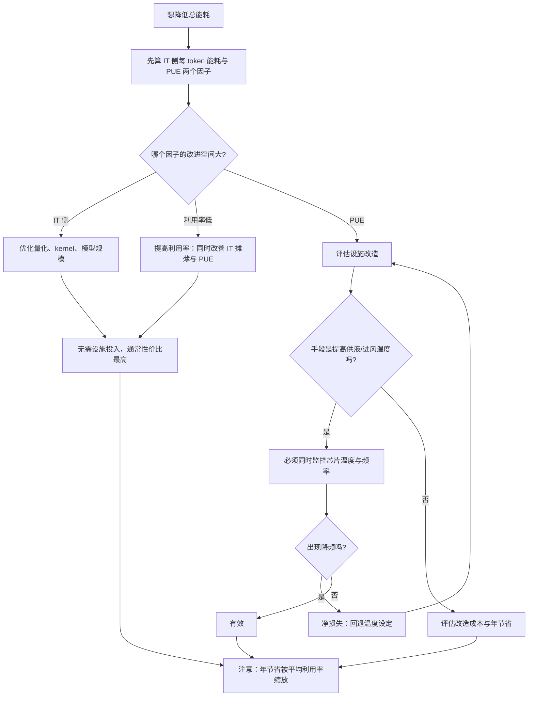

# PUE、WUE 与设施能耗建模

> 位置：[InferenceAtlas](../../INDEX.md) > [模块 09](README.md) > 当前文档
> 信息截至：2026-07-29 ｜ 最后核验：2026-07-29 ｜ 内容版本：v0.1
> 时效性等级：低
> 相关主题：[配电链路](03_power_delivery_48v_and_busbar.md)｜[散热方式](04_cooling_air_direct_liquid_and_immersion.md)｜`06_cluster_capacity_and_site_planning.md`

## 本章导读

PUE 是一个被广泛引用但**极易被误读**的指标。
本章要处理三个具体的误读：

**第一，PUE 不是一个常数**。它随 IT 负载率、
环境温度、以及设施的运行模式变化。
**一个「设计 PUE」与「实际年均 PUE」可以相差不小**，
而低利用率的设施 PUE 通常更差——
因为设施的固定开销被更少的 IT 功率分摊。

**第二，PUE 低不等于总能耗低**。
PUE 是一个**比值**：分母是 IT 功耗。
**如果 IT 侧效率很差（例如大量算力空转），
即使 PUE 很低，每 token 的总能耗仍然可能很高**。
**优化 PUE 与优化 IT 效率是两件独立的事，且后者通常杠杆更大**。

**第三，PUE 的边界可以被移动**。
把某些损耗记在 IT 侧还是设施侧，会直接改变 PUE 的表观值。
**因此跨设施比较 PUE 必须先确认边界一致**。

本章给出**PUE 的分解与它随负载的变化**、
**WUE 与水-电权衡**、
**从 IT 优化到设施节能的传导系数**、
以及**一个把 IT 侧与设施侧统一起来的能耗模型**。

**关于数值的说明**：受出口策略限制
（详见 [AGENTS.md 第 11 节](../../AGENTS.md)），
本章不给出任何具体的 PUE、WUE、温度或能耗数值。

## 学习目标

读完本章后，读者应能够：

1. 分解 PUE 的构成，并说明每一项随什么变化
2. 解释为什么低利用率的设施 PUE 更差，以及这与 IT 侧的摊薄效应是同一结构
3. 说明「PUE 低」与「每 token 能耗低」为什么不等价
4. 说明 WUE 与 PUE 之间的权衡，以及它如何受气候与水资源约束
5. 建立一个把 IT 侧优化传导到设施总电力的统一模型

## 核心结论

- **PUE 随 IT 负载率变化**：设施的固定开销被更少的 IT 功率分摊，因此低利用率下 PUE 更差。
- **PUE 是比值不是绝对量**：IT 侧效率差时，低 PUE 仍可能对应高的每 token 能耗。
- **IT 侧省下的每一瓦，设施侧对应 PUE 倍的节省**——这是设施层放大 IT 优化的传导系数。
- **PUE 的边界可移动**：损耗记在 IT 侧还是设施侧会改变表观值，跨设施比较必须先对齐边界。
- **WUE 与 PUE 通常此消彼长**：蒸发冷却省电但耗水，机械制冷省水但耗电。
- **优化顺序应当是「先 IT 效率、再利用率、最后 PUE」**，因为前两者的杠杆通常更大且不需要设施改造。

## 1. 问题定义、系统边界与工作负载

### 1.1 PUE 的定义与边界

$$
\text{PUE} = \frac{P_{\text{facility}}}{P_{\text{IT}}}
$$

**分子**是设施消耗的总电力，
**分母**是 IT 设备消耗的电力。**PUE 恒大于 1**。

**边界在哪里是关键**：

```text
市电 → 变压 → 不间断供电 → 机房配电 → 机柜配电
                                          ↓
                                    服务器电源  ← 常见的 IT/设施分界点
                                          ↓
                                    板级转换 → 芯片
```

**分界点的选择会改变 PUE 的表观值**：
把服务器电源的损耗记在 IT 侧，PUE 显得更低；
记在设施侧，PUE 显得更高。
**两种记法下的总电力相同，但比值不同**。

**因此跨设施比较 PUE 时必须先确认分界点一致**——
这与 [模块 11 第 5 章](../11_benchmarking_reliability_and_observability/05_power_energy_and_cost_benchmarks.md)
里「三级功耗口径」是同一类问题。

### 1.2 本章不涉及

具体的制冷工程设计、
具体的 PUE 数值或行业水平（本库无法核验，见第 5 节）、
每 token 能耗的核算方法（见 [模块 11 第 5 章](../11_benchmarking_reliability_and_observability/05_power_energy_and_cost_benchmarks.md)）。

## 2. 原理、数学与性能模型

### 2.1 PUE 的分解

设施的非 IT 功耗主要由三部分组成：

$$
P_{\text{facility}} = P_{\text{IT}} + P_{\text{cooling}} + P_{\text{power-loss}} + P_{\text{other}}
$$

于是

$$
\text{PUE} = 1 + \underbrace{\frac{P_{\text{cooling}}}{P_{\text{IT}}}}_{\text{制冷}} + \underbrace{\frac{P_{\text{power-loss}}}{P_{\text{IT}}}}_{\text{配电损耗}} + \underbrace{\frac{P_{\text{other}}}{P_{\text{IT}}}}_{\text{照明等}}
$$

**三项各自随什么变化**：

| 项 | 主要驱动 | 随 IT 负载 |
|---|---|---|
| 制冷 | 环境温度、散热方式、供液/进风温度 | **部分固定、部分随负载** |
| 配电损耗 | 电压、级数、负载率 | 随负载（损耗 $\propto I^2$，但占比随负载率变化） |
| 其他 | 照明、安防等 | **基本固定** |

**「部分固定」是理解 PUE 随负载变化的关键**（见 2.2）。

### 2.2 PUE 随负载率的变化

把非 IT 功耗拆成固定与可变两部分：

$$
P_{\text{non-IT}} = P_{\text{fix}} + k \cdot P_{\text{IT}}
$$

代入 PUE 定义：

$$
\text{PUE} = 1 + k + \frac{P_{\text{fix}}}{P_{\text{IT}}}
$$

**这个式子给出三个结论**：

**（一）PUE 随 IT 功率上升而下降**，
渐近于 $1 + k$。
**即满载时 PUE 最好，轻载时最差**。

**（二）低利用率的设施 PUE 更差**，
因为 $P_{\text{fix}}$ 被更少的 IT 功率分摊。

**（三）这与 IT 侧的「摊薄能耗」是同一个结构**
（见 [模块 11 第 5 章](../11_benchmarking_reliability_and_observability/05_power_energy_and_cost_benchmarks.md) 2.4）：
**固定开销 ÷ 实际产出**。
**只是一个发生在芯片层（静态功耗），一个发生在设施层（固定设施开销）**。

**两层的效应会叠加**：
一个低利用率的集群同时承受
「IT 侧静态功耗被少量 token 分摊」
与「设施固定开销被少量 IT 功率分摊」两重惩罚。

**因此提高利用率对总能耗的改善是双重的**，
这比只看其中一层估计的收益更大。

### 2.3 PUE 与总能耗的关系

**这是本章要澄清的核心误读**。每 token 的总电能：

$$
E_{\text{tok,total}} = \frac{P_{\text{IT}} \times \text{PUE}}{\text{有效 token 吞吐}}
$$

**PUE 只是其中一个因子**。
**若 IT 侧效率差（同样的吞吐需要更多的 $P_{\text{IT}}$），
即使 PUE 很低，$E_{\text{tok,total}}$ 仍然可能很高**。

**举例说明结构**（不涉及具体数值）：
两个设施 A 与 B，A 的 PUE 更低但 IT 侧每 token 功耗更高。
**总能耗的比较取决于两个因子的乘积，而不是单看 PUE**。

**实践含义**：

| 优化对象 | 影响 | 是否需要设施改造 |
|---|---|---|
| IT 侧每 token 功耗（量化、kernel、模型） | 直接减少 $P_{\text{IT}}$ | 否 |
| **利用率** | **同时改善 IT 摊薄与 PUE** | 否（调度问题） |
| PUE | 只改善转换系数 | **是** |

**因此优化顺序应当是「先 IT 效率、再利用率、最后 PUE」**——
前两者不需要设施改造且杠杆通常更大。

### 2.4 IT 优化的设施放大系数

IT 侧减少 $\Delta P_{\text{IT}}$，设施侧总电力的减少为：

$$
\Delta P_{\text{facility}} = \Delta P_{\text{IT}} \times \left(1 + k\right)
$$

**注意这里是 $1+k$ 而不是 PUE**。
原因是固定部分 $P_{\text{fix}}$ 不随 IT 功率变化，
**所以边际的放大系数是 $1+k$，而平均的比值才是 PUE**。

**$1 + k < \text{PUE}$**（当 $P_{\text{fix}} > 0$ 时）。

**这是一个容易出错的地方**：
用 PUE 作为边际放大系数会**高估** IT 优化的设施侧收益。
**正确的边际系数需要知道固定与可变部分的划分**。

**实用近似**：在满载附近 $P_{\text{fix}}/P_{\text{IT}}$ 较小，
两者接近；**在轻载时差别明显**。

### 2.5 WUE 与水-电权衡

$$
\text{WUE} = \frac{\text{年耗水量}}{\text{年 IT 用电量}}
$$

**制冷方式决定了水与电的分配**：

| 方式 | 耗电 | 耗水 |
|---|---|---|
| 机械制冷（压缩机） | **高** | 低 |
| 蒸发/绝热冷却 | 低 | **高** |
| 自然冷却（低温环境） | **最低** | 低 |

**因此 PUE 与 WUE 通常此消彼长**：
用蒸发冷却压低 PUE 的设施，WUE 通常更高。

**这意味着「只报 PUE」是不完整的**——
一个 PUE 很低的设施可能是用大量耗水换来的，
**而在水资源紧张的地区这是一个真实的约束**。

**对选址的影响**：气候（干球/湿球温度）与水资源可得性
**共同决定了哪种制冷方式可行**，
从而决定了 PUE 与 WUE 的可达范围。
**这是站点选择的核心输入之一**（见下一章）。

### 2.6 季节与时段变化

制冷功耗随环境温度变化，**因此 PUE 有季节性**：

| 季节 | 环境温度 | 制冷功耗 | PUE |
|---|---|---|---|
| 凉季 | 低 | 低（可用自然冷却） | **好** |
| 热季 | 高 | 高 | 差 |

**两个实践含义**：

1. **「PUE = 某个值」这句话必须说明是设计值、瞬时值还是年均值**；
2. **热季同时是 PUE 最差与降频风险最高的时候**
   （见 [第 4 章](04_cooling_air_direct_liquid_and_immersion.md) 2.3 的温差预算）——
   **即「最贵」与「最慢」同时发生**。

**第二点对容量规划的含义**：
容量应当按热季的可用算力规划，
**否则会在最需要容量的时候（如果流量也有季节性）出现不足**。

## 3. 实现机制与系统设计

### 3.1 统一的能耗模型

把 IT 侧与设施侧统一起来：

$$
E_{\text{tok,total}} = \underbrace{\frac{P_{\text{IT}}}{\Theta_{\text{eff}}}}_{\text{IT 侧每 token 能耗}} \times \underbrace{\text{PUE}}_{\text{设施系数}}
$$

其中 $\Theta_{\text{eff}}$ 是满足 SLO 的有效 token 吞吐（goodput）。

**进一步展开 IT 侧**（见 [模块 11 第 5 章](../11_benchmarking_reliability_and_observability/05_power_energy_and_cost_benchmarks.md)）：

$$
E_{\text{tok,total}} = \frac{P_{0} + \alpha \cdot \Theta_{\text{eff}}}{\Theta_{\text{eff}}} \times \left(1 + k + \frac{P_{\text{fix}}}{P_{\text{IT}}}\right)
$$

**其中 $P_0$ 是 IT 侧的静态功耗、$\alpha$ 是边际能耗**。

**这个式子把两层的固定开销都显式写了出来**：
$P_0$（IT 静态）与 $P_{\text{fix}}$（设施固定）。
**两者都被 $\Theta_{\text{eff}}$ 分摊**，
**所以吞吐（本质上是利用率）同时出现在两处**——
这就是 2.2 说的「双重惩罚」的数学形式。

### 3.2 测量与核算的要求

| 项 | 要求 |
|---|---|
| PUE 的测量点 | 明确分界；分子分母同期 |
| 采样周期 | 足够覆盖负载与环境的波动 |
| 报告口径 | 说明是设计值、瞬时值还是年均值 |
| **配套的 IT 侧数据** | **单独报 PUE 没有决策价值** |
| WUE | 与 PUE 一起报，否则不完整 |

**第四行是本章的核心建议**：
**PUE 必须与「IT 侧每 token 能耗」一起报**，
否则无法判断总能耗是好是坏。

### 3.3 降低 PUE 的手段与代价

| 手段 | 机制 | 代价 |
|---|---|---|
| 提高供液/进风温度 | 减少制冷功耗 | **挤压温差预算 → 降频风险** |
| 自然冷却 | 用环境低温直接换热 | 受气候限制；需要更大的换热面积 |
| 蒸发冷却 | 利用蒸发潜热 | **耗水（WUE 上升）** |
| 提高配电电压/减少级数 | 减少配电损耗 | 改造成本 |
| 液冷 | 更高效的传热 | 建设与运维成本 |
| **提高利用率** | 分摊固定开销 | **调度与产品问题，非设施改造** |

**第一行是最直接的 PUE 优化手段，但它与性能直接冲突**：
提高供液温度减少制冷功耗，
**但同时挤压了留给芯片的温差预算，可能触发降频**
（见 [第 4 章](04_cooling_air_direct_liquid_and_immersion.md) 2.3）。

**因此「优化 PUE」不能孤立进行**——
必须同时监控芯片温度与频率，
**否则可能出现「PUE 改善但有效算力下降」的净损失**。

**最后一行值得强调**：提高利用率同时改善 PUE 与 IT 侧摊薄，
**且不需要任何设施投入**——它通常是性价比最高的一项。

### 3.4 监控项

| 指标 | 为什么 |
|---|---|
| PUE（瞬时 + 滚动平均） | 反映当前与趋势 |
| IT 功率与设施功率（分别） | 便于分解 |
| 制冷功耗占比 | PUE 中最大且最可优化的一项 |
| 配电损耗占比 | 第二项 |
| WUE | 与 PUE 一起看 |
| **同期的 IT 侧每 token 能耗** | **单独的 PUE 无决策价值** |
| 环境温度 | 解释 PUE 的季节变化 |
| **芯片温度与频率** | **确认 PUE 优化没有以降频为代价** |

**最后一行是本节的重点**：
**PUE 优化与性能之间有直接的物理耦合**，
所以两者必须一起监控。

## 4. 性能、成本、能耗与可靠性 trade-off

### 4.1 PUE 与性能的耦合

见 3.3 第一行。**这是一个必须被明确权衡的交换**：

$$
\text{PUE 改善的电力节省} \quad \text{vs} \quad \Delta\eta_{\text{thermal}} \times \text{算力价值}
$$

**而算力价值一侧还有一个不易量化但重要的部分**：
**性能的可预测性**。
提高供液温度使芯片更接近降频阈值，
**从而让性能对环境波动更敏感**——
而波动的性能无法被计入容量规划
（见 [第 2 章](02_rack_power_and_density.md) 2.2）。

### 4.2 PUE 优化的投入产出

$$
\text{年节省} = P_{\text{IT,avg}} \times \Delta\text{PUE} \times 8760 \times \text{电价}
$$

**注意 $P_{\text{IT,avg}}$ 是平均值**，
**而它取决于利用率**——
**低利用率的设施，PUE 改造的绝对收益也低**。

**这与配电改造、散热改造是同一个结构**：
**所有设施侧的效率投入，其收益都被利用率缩放**。

**因此在利用率低时，「先提高利用率」不仅本身有收益，
还会提高后续所有设施改造的回报**。

### 4.3 水与电的选择

在水资源紧张的地区，**低 PUE 可能不可持续**。
**决策应当同时看 PUE 与 WUE**，
并结合当地的水价、水资源政策与长期可得性。

**一个结构性判断**：水与电的相对稀缺性因地区而异，
**所以「最优制冷方式」是地域相关的**，
不存在普适答案。

### 4.4 与可靠性的关系

**降低 PUE 的一些手段会减少余量**：
提高供液温度、减少制冷冗余、更激进的自然冷却使用。

**这些手段在正常条件下有效，但在极端条件下风险更高**：
热浪期间、制冷设备部分故障时，
**余量小的系统更容易触发大范围降频甚至停机**。

**因此 PUE 目标应当在「正常条件」与「极端条件」两个场景下分别评估**，
而不是只按年均条件优化。

## 5. benchmark、真实案例或公开部署案例

**本章不给出任何具体的 PUE、WUE、温度或能耗数值**。

受当前环境的网络出口策略限制（详见 [AGENTS.md 第 11 节](../../AGENTS.md)），
本库无法访问设施能效数据、行业报告或气候数据，
**因此无法核验任何一项**。

**读者应自行填充的能效画像**：

| 项 | 你的值 | 来源 |
|---|---|---|
| PUE 的分界点定义 | 待填 | 设施方，**比较前必须对齐** |
| PUE（瞬时、年均、设计值各一个） | 待填 | 设施方，`官方披露` |
| 当前 IT 平均负载率 | 待填 | `独立可复现实验` |
| 制冷功耗占非 IT 的比例 | 待填 | 设施方 |
| 配电损耗占非 IT 的比例 | 待填 | 设施方 |
| 固定部分 $P_{\text{fix}}$ 的估计 | 待填 | 由不同负载下的 PUE 反解 |
| 边际放大系数 $1+k$ | 待填 | 同上，**不要直接用 PUE** |
| WUE | 待填 | 设施方 |
| **IT 侧每 token 能耗** | 待填 | **`独立可复现实验`，与 PUE 一起才有意义** |
| 热季与凉季的 PUE 差异 | 待填 | 长期观测 |
| 热季是否观察到降频 | 待填 | **`独立可复现实验`** |

**倒数第三行是本表的关键**：
**没有它，PUE 这个数字无法支持任何决策**。

**$P_{\text{fix}}$ 与 $1+k$ 的反解方法**：
在两个不同的 IT 负载下测 PUE，
由 $\text{PUE} = 1 + k + P_{\text{fix}}/P_{\text{IT}}$ 联立求解。
**这是一个便宜且有用的测量**，
因为它给出了正确的边际系数。

> 实验方法论要求见 [如何读推理 benchmark](../00_start_here/03_how_to_read_inference_benchmarks.md)。

## 6. 设计决策框架



**图解读**：

1. **本图展示什么**：能耗优化的优先级决策。
   起点是把总能耗分解成 IT 与 PUE 两个因子，
   **终点统一提醒「收益被利用率缩放」**。
2. **核心瓶颈**：瓶颈在 C 节点的三分。
   **「利用率低」这一支最常被忽略**——
   人们倾向于把能耗问题当成技术问题（优化 kernel 或改造制冷），
   **而利用率同时改善两层的固定开销分摊，且不需要任何设施投入**。
3. **图中的 trade-off**：H→I→K 这条路径是 PUE 与性能的直接耦合。
   **提高供液温度是最直接的 PUE 优化手段，但它挤压温差预算**，
   所以必须验证没有触发降频——否则是净损失。
4. **面试如何引用**：可以说
   「我会先把每 token 总能耗分解成 IT 侧能耗与 PUE 两个因子，
   **看哪个空间大**；
   而如果利用率低，那通常是最优先的——
   **它同时改善两层的固定开销分摊且不需要设施改造**」。

## 7. 常见失败模式与排查路径

| 症状 | 根因 | 修正 |
|---|---|---|
| PUE 很低但电费仍然高 | IT 侧效率差或利用率低 | 分解成两个因子分别看 |
| 跨设施 PUE 比较结论矛盾 | 分界点不一致 | 先对齐边界 |
| 按 PUE 估算的 IT 优化收益偏高 | 用了 PUE 而非边际系数 $1+k$ | 反解 $P_{\text{fix}}$ 与 $k$ |
| PUE 改善但算力下降 | 提高供液温度触发降频 | 同时监控温度与频率 |
| PUE 随季节大幅波动 | 制冷功耗随环境温度变化 | 报告年均值并说明口径 |
| 低负载时 PUE 明显变差 | 固定开销被少量 IT 功率分摊 | 提高利用率或分区关停 |
| PUE 低但水资源紧张 | 用蒸发冷却换来的 | 同时看 WUE |
| 热浪期间大范围降频 | PUE 优化削减了余量 | 按极端条件而非年均条件评估 |

**排查顺序**：**先对齐边界，再分解两个因子，最后检查性能耦合**。

## 8. 关联面试主题

1. 每 token 能耗的口径与 PUE——见 [Q082](../17_interview_prep/06_hardware_and_datacenter_questions.md)
2. 每百万 token 成本的拆解——见 [Q085](../17_interview_prep/06_hardware_and_datacenter_questions.md)
3. 降频的检测与容量影响——见 [Q083](../17_interview_prep/06_hardware_and_datacenter_questions.md)
4. 成本下降的四条驱动线（利用率最大）——见 [Q099](../17_interview_prep/08_company_paper_and_strategy_questions.md)
5. 边际能耗与摊薄能耗——见 [模块 11 第 5 章](../11_benchmarking_reliability_and_observability/05_power_energy_and_cost_benchmarks.md)

## 9. 小结

PUE 是一个被广泛引用但极易被误读的指标。本章处理了三个误读：

**第一，PUE 不是常数**。把非 IT 功耗拆成固定与可变两部分，
得到 $\text{PUE} = 1 + k + P_{\text{fix}}/P_{\text{IT}}$——
**它随 IT 功率上升而下降，渐近于 $1+k$**。
**低利用率的设施 PUE 更差**，
而这与 IT 侧「静态功耗被少量 token 分摊」是同一个结构。
**两层效应叠加，所以提高利用率对总能耗的改善是双重的**。

**第二，PUE 低不等于总能耗低**。
每 token 总能耗是「IT 侧每 token 能耗 × PUE」的乘积，
**PUE 只是其中一个因子**。
**因此优化顺序应当是「先 IT 效率、再利用率、最后 PUE」**——
前两者不需要设施改造且杠杆通常更大。

**第三，PUE 的边界可以被移动**。
损耗记在 IT 侧还是设施侧会改变表观值，
**跨设施比较前必须先对齐分界点**。

**两个容易出错的技术细节**：

**（一）边际放大系数是 $1+k$ 而不是 PUE**。
用 PUE 作为 IT 优化的设施侧放大系数会**高估**收益，
因为固定部分不随 IT 功率变化。
**正确的做法是在两个负载点测 PUE 后反解 $P_{\text{fix}}$ 与 $k$**——
这是一个便宜且有用的测量。

**（二）PUE 优化与性能有直接的物理耦合**。
提高供液/进风温度是最直接的 PUE 手段，
**但它挤压温差预算，可能触发降频**——
所以必须同时监控芯片温度与频率，
否则可能出现「PUE 改善但有效算力下降」的净损失。

最后，**PUE 必须与 WUE 一起报**：
低 PUE 可能是用大量耗水换来的，
而水与电的相对稀缺性因地区而异——
**所以「最优制冷方式」是地域相关的，不存在普适答案**。

本章不给出任何具体的 PUE、WUE 或能耗数值——当前环境无法核验。
第 5 节给出的是一份画像模板，
**其中「IT 侧每 token 能耗」是让 PUE 这个数字变得有决策价值的必要配套**。

## 关键术语

| 中文术语 | 英文 | 定义 | 单位/口径 | 关联文档 |
|---|---|---|---|---|
| 设施能效比 | PUE | 设施总电力与 IT 电力之比 | 无量纲 | 本章 1.1 |
| 水利用效率 | WUE | 年耗水量与年 IT 用电量之比 | 升/千瓦时 | 本章 2.5 |
| 边际放大系数 | marginal amplification | IT 侧减一瓦对应设施侧减少的量 $1+k$ | 无量纲 | 本章 2.4 |
| 设施固定开销 | facility fixed load | 不随 IT 负载变化的非 IT 功耗 | 瓦 | 本章 2.2 |
| 自然冷却 | free cooling | 直接利用环境低温换热 | — | 本章 3.3 |

## 延伸阅读

- [配电链路：电压、母线与转换损耗](03_power_delivery_48v_and_busbar.md)
- [风冷、冷板液冷与浸没式散热](04_cooling_air_direct_liquid_and_immersion.md)
- [能效与每 token 焦耳](../01_foundations_and_metrics/07_energy_efficiency_and_joules_per_token.md)
- [功耗、能耗与成本基准](../11_benchmarking_reliability_and_observability/05_power_energy_and_cost_benchmarks.md)
- [成本建模与单位经济学](../01_foundations_and_metrics/06_cost_modeling_and_unit_economics.md)

## 主要来源

本章由 PUE 的定义式与固定/可变分解、
[模块 01 第 7 章](../01_foundations_and_metrics/07_energy_efficiency_and_joules_per_token.md) 的能耗口径、
以及本模块第 3–4 章的配电与散热关系推导而成。

**不含任何需要外部核验的 PUE、WUE、温度或能耗数值**。
受当前环境的网络出口策略限制，本库无法访问设施能效数据或行业报告
（详见 [AGENTS.md 第 11 节](../../AGENTS.md)）。

| 类别 | 说明 | 披露标签 |
|---|---|---|
| PUE 的分解、随负载的变化、边际系数 $1+k$ | 由定义式推导 | — |
| PUE 与性能的耦合、WUE 权衡 | 由本模块第 3–4 章推导 | — |
| 读者自行填充的能效画像 | 应查设施方数据与自行实测 | `官方披露` / `独立可复现实验` |
| 任何具体的 PUE、WUE、温度与能耗数值 | **本章未给出** | `待核实` |

## 更新记录

| 日期 | 版本 | 变更 | 核验人 |
|---|---|---|---|
| 2026-07-29 | v0.1 | 初稿：PUE 的分解与负载依赖、边际系数 $1+k$、PUE 与性能的耦合、WUE 权衡 | — |
