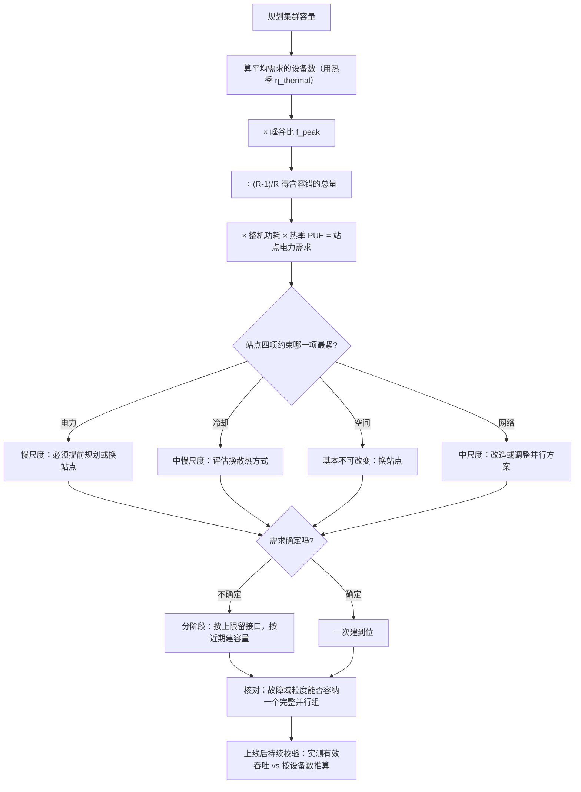

# 集群容量与选址规划

> 位置：[InferenceAtlas](../../INDEX.md) > [模块 09](README.md) > 当前文档
> 信息截至：2026-07-29 ｜ 最后核验：2026-07-29 ｜ 内容版本：v0.1
> 时效性等级：低
> 相关主题：[PUE 与能耗建模](05_power_usage_effectiveness_and_energy_modeling.md)｜[机架功率密度](02_rack_power_and_density.md)｜[容量规划](../01_foundations_and_metrics/08_capacity_planning.md)

## 本章导读

推理容量规划有一个与训练截然不同的特点：
**它的时间尺度是错配的**。

流量以分钟到小时的尺度波动，
机柜级扩容以周到月计，
**而站点级的供电与制冷增容以季度到年计**。
**规划的核心困难就是用慢变量去承接快变量**。

这个错配决定了本章的三条主线：

**第一，弹性只能来自已建成的余量**。
「按需扩容」在设施层不成立——
**推理的弹性上限就是「已经建好但没用上的容量」**。
因此容量规划实际上是在决定「预留多少永远闲置的余量」，
**而这个余量的成本是确定的、持续的**。

**第二，选址决定了一组硬约束的上界**。
气候决定可用的制冷方式与 PUE/WUE 的可达范围，
电力供应决定总容量与增容速度，
网络接入决定能部署什么并行方案。
**这些约束在选址之后就基本固定了，且改变它们的周期极长**。

**第三，多站点是弹性与容错的主要来源，但它有明确的容量代价**。
$R$ 个站点要容忍一个失效，整体利用率上限就是 $(R-1)/R$——
**站点越少，为容错预留的比例越大**。

**关于数值的说明**：受出口策略限制
（详见 [AGENTS.md 第 11 节](../../AGENTS.md)），
本章不给出任何具体的容量、周期、气候或成本数值。

## 学习目标

读完本章后，读者应能够：

1. 说明容量规划中三个时间尺度的错配，以及它对弹性设计的含义
2. 从推理需求完整推导到站点级的电力与空间需求，并标注每步的假设
3. 说明选址决定了哪些长期固定的约束
4. 用 $(R-1)/R$ 计算多站点部署为容错付出的利用率代价
5. 设计一个能容纳需求不确定性的分阶段建设方案

## 核心结论

- **三个时间尺度错配**：流量以分钟计、机柜扩容以周月计、站点增容以季年计；**用慢变量承接快变量是规划的核心困难**。
- **弹性上限 = 已建成容量 − 当前使用容量**，因此弹性的成本是「持续闲置的余量」。
- **选址固定了一组长期约束**：气候→制冷方式与 PUE/WUE 上界，电力→总容量与增容速度，网络→并行方案可行性。
- **$R$ 个站点容忍一个失效，利用率上限为 $(R-1)/R$**：站点越少，容错预留的比例越大。
- **容量规划必须按热季而非年均条件做**，因为热季同时是 PUE 最差与降频风险最高的时候。
- **需求不确定时应当分阶段建设**，把「预留接口」与「预留容量」分开——前者便宜，后者昂贵。

## 1. 问题定义、系统边界与工作负载

### 1.1 从推理需求到站点需求的链条

```text
目标 QPS、长度分布、SLO
    ↓  模块 01 第 8 章的容量模型
所需有效算力与 KV 显存
    ↓  模块 07 的四轴评估 + 热折扣
所需设备数
    ↓  × 整机实测功耗（高分位）
所需 IT 功率
    ↓  ÷ 每机柜可持续容量（三重约束）
所需机柜数
    ↓  × PUE（热季值）
所需设施电力
    ↓
站点：电力、空间、网络、冷却是否都够？
```

**本章关注最后三层**，前面几层见对应模块。

### 1.2 三个时间尺度

| 尺度 | 对象 | 相对周期 | 能承接什么 |
|---|---|---|---|
| **快** | 流量波动 | 分钟到小时 | — |
| **中** | 机柜内加设备 / 机房内加机柜 | 周到月 | 趋势性增长 |
| **慢** | 站点增容（供电、制冷、空间） | **季度到年** | 长期规划 |

**核心困难**：快尺度的波动只能被
**已经建成的容量**承接，
**而建成容量的调整是中慢尺度的**。

**这与云上弹性的直觉相反**：
云的弹性来自「别人已经建好的余量」，
**自建时这个余量必须是你自己的**。

### 1.3 推理与训练在规划上的差异

| 维度 | 训练 | 推理 |
|---|---|---|
| 负载可预测性 | 高（作业排期可控） | **低（外部流量驱动）** |
| 峰谷比 | 低 | **高** |
| 时延约束 | 无硬约束 | **有 SLO** |
| 容量不足的后果 | 作业排队 | **用户可见的失败** |

**推理必须按峰值规划而训练可以按平均规划**，
**这直接导致推理的平均利用率天然低于训练**——
从而单位成本更高（见 [第 5 章](05_power_usage_effectiveness_and_energy_modeling.md) 2.2 的双重摊薄惩罚）。

## 2. 原理、数学与性能模型

### 2.1 容量的层级约束

站点能承载的设备数受四个约束，取最小值：

$$
N_{\text{site}} = \min\left(
\frac{P_{\text{site}}}{P_{\text{server}} \cdot \text{PUE}},\;
\frac{\dot Q_{\text{site}}}{P_{\text{server}}},\;
\frac{A_{\text{site}}}{a_{\text{rack}}} \cdot N_{\text{rack}},\;
N_{\text{network}}
\right)
$$

**四项分别是电力、冷却、空间、网络**。

**注意第一项的分母含 PUE**：
站点的电力供应要同时覆盖 IT 与设施开销，
**所以 IT 可用的部分是站点总电力除以 PUE**。

**第四项常被遗漏**：
网络接入带宽与拓扑能支持的设备数
（见 [Q081](../17_interview_prep/06_hardware_and_datacenter_questions.md)）。

### 2.2 弹性上限

$$
\text{弹性上限} = N_{\text{built}} - N_{\text{in-use}}
$$

**即已建成但未使用的容量**。

**这个式子的三个推论**：

**（一）弹性有确定的持续成本**。
预留的容量在闲置时仍在折旧、占空间、消耗基础功率。
**「弹性」不是免费的选项，它是一笔持续支出**。

**（二）弹性与利用率直接冲突**。
$$
u = \frac{N_{\text{in-use}}}{N_{\text{built}}} \quad\Rightarrow\quad \text{弹性上限} = N_{\text{built}}(1-u)
$$
**利用率越高，弹性越小**。
**而利用率又直接决定单位成本**——
所以「弹性」与「成本」是一个直接的交换。

**（三）弹性的合理规模由流量的峰谷比决定**：

$$
N_{\text{built}} \ge N_{\text{peak}} = N_{\text{avg}} \times f_{\text{peak}}
$$

**于是稳态利用率上限约为 $1/f_{\text{peak}}$**。
**峰谷比是一个产品属性，它直接给出了利用率的天花板**。

**这解释了为什么「提高利用率」在推理场景下不能靠削减余量**——
余量是被峰谷比逼出来的。
**真正的手段是混合负载**：用离线任务填谷，
**使得同一份建成容量服务两种负载**。

### 2.3 多站点的容错代价

$R$ 个站点，要求容忍一个站点完全失效：

$$
(R-1)\cdot\kappa \ge D \quad\Longleftrightarrow\quad u \le \frac{R-1}{R}
$$

| 站点数 $R$ | 容忍一个失效时的利用率上限 |
|---|---|
| 2 | 50% |
| 3 | 约 67% |
| 4 | 75% |
| 6 | 约 83% |

**站点越少，为容错预留的比例越大**。
两站点部署意味着**一半的容量是为容错买的**。

**而这个代价与 2.2 的峰谷比余量是叠加的**：

$$
u \le \min\left(\frac{1}{f_{\text{peak}}},\; \frac{R-1}{R}\right)
$$

**两个约束取更紧的那个**。
**这个式子给出了推理集群利用率的结构性上界**，
它解释了为什么推理服务的利用率天然低于批处理系统。

### 2.4 按热季规划

由 [第 5 章](05_power_usage_effectiveness_and_energy_modeling.md) 2.6：
热季同时是 PUE 最差与降频风险最高的时候。

**因此容量规划的输入应当取热季值**：

$$
N_{\text{needed}} = \frac{\text{所需有效算力}}{\text{单机算力} \times \eta_{\text{thermal,hot}}}, \qquad
P_{\text{site}} \ge N_{\text{needed}} \times P_{\text{server}} \times \text{PUE}_{\text{hot}}
$$

**用年均值规划会在热季出现双重不足**：
算力因降频而下降，同时电力因 PUE 上升而更紧。

**如果流量本身也有季节性且与热季重合**，
**三重效应叠加**——这是一个应当被显式检查的场景。

### 2.5 需求不确定性的处理

推理需求的增长通常难以预测。
**分阶段建设的关键是区分两类预留**：

| 类型 | 内容 | 成本 | 建议 |
|---|---|---|---|
| **预留接口** | 电力引入容量、管路预埋、空间规划 | **相对低** | **尽量多留** |
| **预留容量** | 已建成的机柜、已装的设备 | **高（持续）** | 按峰谷比与容错要求留 |

**核心判断**：
**「预留接口」是便宜的期权，「预留容量」是昂贵的持有**。

**因此分阶段建设的做法是**：
按长期上限设计基础设施的接口（电力引入、管路、空间），
**按近期需求建设实际容量**。
**这样后续扩容走的是「中尺度」而不是「慢尺度」**——
因为最慢的那部分（站点级引入）已经预先做好了。

**这是应对需求不确定性最有效的结构性手段**。

## 3. 实现机制与系统设计

### 3.1 站点评估清单

| 类别 | 项 | 为什么 |
|---|---|---|
| 电力 | 当前可用容量 | 直接约束 |
| 电力 | **增容的可行性与周期** | 决定长期天花板 |
| 电力 | 供电冗余等级 | 故障影响面 |
| 冷却 | 可用的制冷方式（受气候约束） | 决定密度上限与 PUE |
| 冷却 | 水资源可得性 | 决定能否用蒸发冷却 |
| 空间 | 可用机位与承重 | 高密度机柜更重 |
| 网络 | 接入带宽与冗余 | 外部流量 |
| 网络 | **内部拓扑能覆盖的设备数** | **决定 TP 度数上限** |
| 环境 | 气候（干球/湿球温度分布） | 决定自然冷却可用时长 |
| 其他 | 数据驻留与合规要求 | 可能是硬约束 |

**倒数第三行最容易被推理团队遗漏**：
**站点电力充足但内部网络拓扑不支持所需的高带宽域，
并行方案就无法按计划部署**。

### 3.2 从需求到站点的完整推导

```text
输入：目标 QPS、输入/输出长度分布、SLO、峰谷比、容错要求

1. 算所需有效算力与 KV 容量            （模块 01 第 8 章）
2. 选设备并算所需设备数                 （模块 07）
   → 注意用热季的 η_thermal
3. 乘峰谷比 f_peak                      → N_peak
4. 除以 (R-1)/R                         → 含容错的 N_total
5. × 整机实测功耗（高分位）             → IT 功率
6. ÷ 每机柜可持续容量                   → 机柜数
   （三重约束的最小值，留散热余量）
7. × PUE_hot                            → 站点电力需求
8. 核对四项站点约束（电力/冷却/空间/网络）
9. 若不足：判断卡在哪一项，以及它的改造周期
```

**第 3 步与第 4 步是乘性叠加的**，
**这两项常常使最终数字远高于「按平均需求」的直觉**。

**第 9 步是关键**：
**卡在哪一项决定了应对方式**——
卡在电力（慢尺度）与卡在机柜（中尺度）的处理完全不同。

### 3.3 多站点的分配策略

**容量在站点间怎么分**：

| 策略 | 说明 | 适合 |
|---|---|---|
| 均分 | 每站点相同容量 | 简单；容错计算清晰 |
| 主备 | 一个主站点 + 较小的备用 | 成本低但容错不完整 |
| 按地域流量分 | 就近服务 | 时延优势；但容错需跨域余量 |

**推理的一个特殊考虑是时延**：
跨地域的请求路由会引入网络往返，
**而它直接计入用户可见的 TTFT**。

**所以「就近服务」与「容错时能互相接管」是有张力的**：
就近意味着分散，
**而分散的站点在互相接管时会引入额外的网络时延**。

**处理方式是分级**：
正常时就近服务，**故障时接受时延升高但保持可用**——
并且**在 SLO 中明确「降级模式下的时延目标」**。

### 3.4 站点内的放置

见 [Q072](../17_interview_prep/05_distributed_and_moe_questions.md) 的通则
（组内集中、副本分散）。**站点规划阶段需要确保**：

1. **有足够多的独立故障域**（不同供电域、不同母线段、不同机柜排）
   以支持副本分散；
2. **每个故障域内的高带宽域足够大**以支持组内集中。

**这两个要求可能冲突**：
更多的故障域意味着更细的划分，
**而更细的划分可能让单个故障域装不下一个完整的并行组**。

**因此故障域的粒度应当按「一个并行组的大小」来设计**——
**至少要能容纳一个完整的组**。

### 3.5 容量的持续校验

**建成的容量会漂移**：
部分设备降频、部分被其他负载占用、部分故障未修复。

**因此「我们有 $N$ 台设备」不等于「我们有 $N$ 台的算力」**。

**校验方法**：定期实测总的有效吞吐
（在满足 SLO 的约束下，见 [模块 11 第 4 章](../11_benchmarking_reliability_and_observability/04_throughput_concurrency_and_goodput.md)），
**与按设备数推算的值对比**。

**差距持续扩大是一个需要排查的信号**——
它可能指向降频、故障累积或配置漂移。

## 4. 性能、成本、能耗与可靠性 trade-off

### 4.1 利用率的结构性上界

由 2.2 与 2.3：

$$
u \le \min\left(\frac{1}{f_{\text{peak}}},\; \frac{R-1}{R}\right)
$$

**这个上界是结构性的，不是运营水平的问题**。

**提高它的三种真实手段**：

| 手段 | 机制 | 代价 |
|---|---|---|
| **混合负载** | 离线填谷，突破 $1/f_{\text{peak}}$ | 需要优先级隔离与可抢占的离线任务 |
| 增加站点数 | 提高 $(R-1)/R$ | 每站点规模变小，管理成本上升 |
| 峰值溢出到外部 | 峰值不必自建 | 需要两套路径；外部单位成本更高 |

**第一项是最有效的**，因为它不改变基础设施只改变调度。
**它也是 [Q099](../17_interview_prep/08_company_paper_and_strategy_questions.md) 里
「利用率是最大的成本杠杆」的具体实现方式**。

### 4.2 自建与租用的容量视角

**从容量规划的角度看两者的区别**：

| 维度 | 自建 | 租用/云 |
|---|---|---|
| 弹性来源 | **自己预留的余量** | 供应方的池化余量 |
| 峰值成本 | 持续持有 | 按用量付 |
| 增容周期 | 慢尺度 | 快（若供应方有货） |
| 单位成本（满载） | 低 | 高 |

**关键洞察**：**租用把「预留余量」的成本从你转移给了供应方**，
**而供应方通过池化多个客户的峰谷来降低这个成本**。

**所以「自建更便宜」成立的前提是你的负载足够稳定**
（$f_{\text{peak}}$ 小）**或规模足够大以自己实现池化**。

**这与 [Q098](../17_interview_prep/08_company_paper_and_strategy_questions.md) 的
「规模与可预测性两个轴」是同一个结论的容量视角表述**。

### 4.3 分阶段建设的期权价值

见 2.5。**预留接口相对于预留容量的价值可以用期权类比**：

- **预留接口** = 买了一个「未来能快速扩容」的权利，成本较低；
- **预留容量** = 现在就持有资产，成本高且持续。

**在需求不确定时，前者的性价比显著更高**。

**而它的关键是把「最慢的那部分」提前做掉**——
站点级的电力引入、管路预埋、空间规划。
**这样后续扩容就从慢尺度变成了中尺度**。

### 4.4 选址的长期锁定

选址决定的约束**改变周期极长**：

| 约束 | 由什么决定 | 可改变性 |
|---|---|---|
| 制冷方式上限 | 气候、水资源 | **不可改变** |
| 电力总容量 | 电网接入 | 可增容，周期长 |
| 网络拓扑 | 建设时的设计 | 可改造，周期中等 |
| 空间 | 建筑 | **基本不可改变** |

**因此选址应当按比当前需求更长的时间尺度评估**——
**按当前一代模型与流量选的站点，可能在两代之后就不够用**。

## 5. benchmark、真实案例或公开部署案例

**本章不给出任何具体的容量、周期、气候或成本数值**。

受当前环境的网络出口策略限制（详见 [AGENTS.md 第 11 节](../../AGENTS.md)），
本库无法访问设施容量数据、气候数据或建设周期信息，
**因此无法核验任何一项**。

**读者应自行填充的容量规划表**：

| 项 | 你的值 | 来源 |
|---|---|---|
| 目标 QPS 与 SLO | 待填 | 业务 |
| **峰谷比 $f_{\text{peak}}$** | 待填 | **历史流量数据；新服务是最大未知项** |
| 站点数 $R$ 与容错要求 | 待填 | 可用性目标 |
| 由两者算出的利用率上界 | 待填 | $\min(1/f_{\text{peak}}, (R-1)/R)$ |
| 热季 $\eta_{\text{thermal}}$ | 待填 | **`独立可复现实验`** |
| 热季 PUE | 待填 | 设施方 |
| 所需设备数（含峰值与容错余量） | 待填 | 计算 |
| 所需机柜数 | 待填 | 用可持续密度 |
| 所需站点电力 | 待填 | 计算 |
| 站点四项约束中最紧的一项 | 待填 | **决定应对方式** |
| 该项的改造周期 | 待填 | 设施方 |
| 已预留的接口（电力引入、管路、空间） | 待填 | **期权价值** |

**「峰谷比」是本表最重要也最不确定的输入**：
它直接决定利用率上界从而决定单位成本，
**而新服务没有历史数据——此时应当明确把它标为最大未知项，
并把方案设计成能快速调整**。

> 实验方法论要求见 [如何读推理 benchmark](../00_start_here/03_how_to_read_inference_benchmarks.md)。

## 6. 设计决策框架



**图解读**：

1. **本图展示什么**：从需求到站点的完整规划链。
   **C 与 D 两步是乘性叠加的**，
   它们使最终数字远高于按平均需求的直觉。
2. **核心瓶颈**：瓶颈在 F 节点的判断。
   **「卡在哪一项」决定了应对方式与时间尺度**——
   卡在电力是慢尺度（可能需要换站点），
   卡在网络是中尺度（可改造或调整并行方案）。
   **不做这个区分就无法判断问题能否在需要的时间内解决**。
3. **图中的 trade-off**：K→L 的分阶段建设牺牲了「一次到位」的规模效益，
   **换来的是应对需求不确定性的能力**。
   **关键是把最慢的部分（站点级引入）提前做掉**，
   使后续扩容从慢尺度降为中尺度。
4. **面试如何引用**：可以说
   「我会先算平均需求，**再乘峰谷比、再除以容错系数**——
   这两步是乘性叠加的；
   然后看站点的四项约束哪一项最紧，
   **因为它的改造周期决定了我们能不能在需要的时间内解决**」。

**O 节点的持续校验不可省略**：
建成容量会因降频、故障累积与配置漂移而缩水，
**「有 $N$ 台设备」不等于「有 $N$ 台的算力」**。

## 7. 常见失败模式与排查路径

| 症状 | 根因 | 修正 |
|---|---|---|
| 按平均需求规划，峰值时容量不足 | 漏乘峰谷比 | 按峰值规划 |
| 一个站点故障后整体容量不够 | 未按 $(R-1)/R$ 留容错余量 | 重算利用率上界 |
| 热季容量不足 | 用年均 $\eta_{\text{thermal}}$ 与 PUE 规划 | 改用热季值 |
| 电力够但并行方案跑不起来 | 未核对网络拓扑 | 补第四项约束 |
| 需要扩容时发现周期以季度计 | 卡在站点级（慢尺度） | 提前预留接口 |
| 实测有效吞吐低于按设备数推算 | 降频、故障累积或配置漂移 | 持续校验并排查 |
| 副本无法分散到足够多的故障域 | 故障域粒度设计不当 | 按并行组大小设计粒度 |
| 利用率始终上不去 | 受峰谷比与容错双重约束 | 混合负载填谷 |

**排查顺序**：**先确认是哪一项约束、它的时间尺度，再谈解决方案**。

## 8. 关联面试主题

1. 从 QPS 推导到机柜数——见 [Q084](../17_interview_prep/06_hardware_and_datacenter_questions.md)
2. 区域故障与全局容量不足的区别——见 [案例八](../17_interview_prep/09_mock_interview_cases.md)
3. 自建、云实例与 API 的选择——见 [Q098](../17_interview_prep/08_company_paper_and_strategy_questions.md)
4. 成本下降的四条驱动线（利用率最大）——见 [Q099](../17_interview_prep/08_company_paper_and_strategy_questions.md)
5. 放置策略与故障域——见 [Q072](../17_interview_prep/05_distributed_and_moe_questions.md)

## 9. 小结

推理的容量规划困难在于**三个时间尺度的错配**：
流量以分钟计、机柜扩容以周月计、站点增容以季年计。
**用慢变量承接快变量，只能靠预留余量**。

**四条核心结论**：

**第一，弹性上限就是已建成但未使用的容量**。
「按需扩容」在设施层不成立，
**所以弹性是一笔持续的支出而不是免费的选项**。

**第二，利用率有一个结构性上界**：

$$
u \le \min\left(\frac{1}{f_{\text{peak}}},\; \frac{R-1}{R}\right)
$$

**峰谷比与容错要求两个约束取更紧的那个**。
这解释了为什么推理集群的利用率天然低于批处理系统——
**它不是运营水平的问题，而是结构决定的**。
**突破它的唯一真实手段是混合负载**：用离线任务填谷，
让同一份建成容量服务两种负载。

**第三，规划必须按热季而非年均条件做**。
热季同时是 PUE 最差与降频风险最高的时候，
**用年均值规划会在热季出现双重不足**——
算力因降频下降，电力因 PUE 上升而更紧。
若流量本身也有季节性且与热季重合，三重效应叠加。

**第四，需求不确定时应当分阶段建设**，
**关键是区分「预留接口」与「预留容量」**：
前者是便宜的期权（电力引入、管路预埋、空间规划），
后者是昂贵的持有。
**把最慢的那部分提前做掉，后续扩容就从慢尺度降为中尺度**——
这是应对不确定性最有效的结构性手段。

一条容易被忽略的核对：**站点的四项约束里，网络最常被推理团队遗漏**。
电力与空间充足但内部拓扑不支持所需的高带宽域，
**并行方案就无法按计划部署**。

本章不给出任何具体的容量、周期或气候数值——当前环境无法核验。
第 5 节给出的是一份规划表模板，
**其中「峰谷比」是最重要也最不确定的输入**——
新服务没有历史数据时，应明确把它标为最大未知项。

## 关键术语

| 中文术语 | 英文 | 定义 | 单位/口径 | 关联文档 |
|---|---|---|---|---|
| 峰谷比 | peak-to-average ratio | 峰值需求与平均需求之比 | 无量纲 | 本章 2.2 |
| 弹性上限 | elasticity headroom | 已建成但未使用的容量 | 台 | 本章 2.2 |
| 容错利用率上限 | fault-tolerant utilization cap | 容忍一个站点失效时的利用率上界 | 无量纲比例 | 本章 2.3 |
| 预留接口 | provisioned interface | 电力引入、管路、空间等的预先准备 | — | 本章 2.5 |
| 故障域粒度 | failure domain granularity | 一个独立故障域覆盖的设备范围 | 台 | 本章 3.4 |

## 延伸阅读

- [AI 数据中心总览](01_ai_datacenter_overview.md)
- [机架功率密度与扩容速度](02_rack_power_and_density.md)
- [PUE、WUE 与设施能耗建模](05_power_usage_effectiveness_and_energy_modeling.md)
- [容量规划](../01_foundations_and_metrics/08_capacity_planning.md)
- [多节点服务拓扑](../06_distributed_and_moe_inference/09_multi_node_serving_topologies.md)
- [容错与优雅降级](../06_distributed_and_moe_inference/10_fault_tolerance_and_graceful_degradation.md)

## 主要来源

本章由 [模块 01 第 8 章](../01_foundations_and_metrics/08_capacity_planning.md) 的容量模型、
[模块 06 第 9–10 章](../06_distributed_and_moe_inference/09_multi_node_serving_topologies.md) 的放置与冗余模型、
以及本模块第 2、4、5 章的密度、散热与 PUE 关系推导而成。

**不含任何需要外部核验的容量、周期、气候或成本数值**。
受当前环境的网络出口策略限制，本库无法访问设施或气候数据
（详见 [AGENTS.md 第 11 节](../../AGENTS.md)）。

| 类别 | 说明 | 披露标签 |
|---|---|---|
| 三个时间尺度、弹性上限、利用率结构上界 | 由算术关系与模块 01、06 推导 | — |
| 分阶段建设与接口/容量的区分 | 由时间尺度分析推导 | — |
| 读者自行填充的容量规划表 | 应查设施方数据与自行实测 | `官方披露` / `独立可复现实验` |
| 任何具体的容量、周期、气候与成本 | **本章未给出** | `待核实` |

## 更新记录

| 日期 | 版本 | 变更 | 核验人 |
|---|---|---|---|
| 2026-07-29 | v0.1 | 初稿：三个时间尺度错配、利用率的结构性上界、按热季规划、分阶段建设的期权价值 | — |
