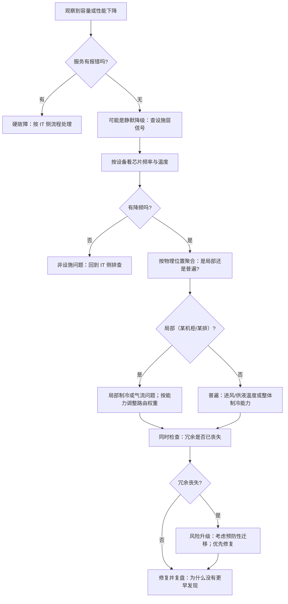

# 设施冗余、可维护性与 RAS

> 位置：[InferenceAtlas](../../INDEX.md) > [模块 09](README.md) > 当前文档
> 信息截至：2026-07-29 ｜ 最后核验：2026-07-29 ｜ 内容版本：v0.1
> 时效性等级：低
> 相关主题：[集群容量与选址](06_cluster_capacity_and_site_planning.md)｜[可靠性事故](../11_benchmarking_reliability_and_observability/09_reliability_incidents_and_capacity_failures.md)｜`08_storage_logging_and_data_plane.md`

## 本章导读

设施层的可靠性与 IT 层的可靠性有一个关键差异：
**设施故障的表现常常不是「停机」而是「变慢」**。

制冷能力下降 → 芯片降频 → 容量悄悄缩水，
**而健康检查全部通过**。
配电某一路失效 → 冗余路承担全部负载 → 效率下降且失去冗余，
**但服务完全正常**。

**这类「静默的能力下降」是设施层最危险的故障模式**，
因为它不触发任何 IT 侧的告警，
**却会让容量规划的前提悄悄失效**。

本章的第二条主线是**维护窗口与推理负载的冲突**。
设施维护（配电检修、制冷保养、母线扩容）
通常需要断电或降低冗余，
**而推理服务没有「维护窗口」这个概念**——
流量是持续的。
**因此维护必须靠容量冗余与流量迁移来吸收**，
而这两者都有成本。

本章给出**设施故障的三类表现与检测方法**、
**冗余等级与推理可用性的定量关系**、
**维护窗口的容量成本**、
以及**从设施信号到 IT 侧响应的联动设计**。

**关于数值的说明**：受出口策略限制
（详见 [AGENTS.md 第 11 节](../../AGENTS.md)），
本章不给出任何具体的可用性等级、MTBF 或维护周期数值。

## 学习目标

读完本章后，读者应能够：

1. 识别设施故障的三类表现，并说明为什么「静默降级」最危险
2. 把设施可用性与推理服务的可用性联系起来并做定量估算
3. 说明维护窗口对推理容量的实际要求
4. 设计从设施监控信号到 IT 侧自动响应的联动
5. 说明为什么「未演练过的设施故障响应应当假设它不工作」

## 核心结论

- **设施故障最危险的表现是「静默降级」**：能力下降但服务正常，不触发任何 IT 侧告警。
- **设施可用性会乘进服务可用性**：IT 侧再高的冗余也无法弥补设施层的单点。
- **冗余在正常时降低效率**（每路负载率更低），这是可靠性的持续成本。
- **推理没有维护窗口**：设施维护必须靠容量冗余与流量迁移吸收，两者都要预留。
- **设施信号必须接入 IT 侧监控**：芯片频率与温度是检测静默降级的主要途径。
- **未演练的故障响应应当假设它不工作**——这一点在设施层比 IT 层更成立，因为演练成本更高、频率更低。

## 1. 问题定义、系统边界与工作负载

### 1.1 设施故障的三类表现

| 类型 | 表现 | IT 侧可见性 | 危险程度 |
|---|---|---|---|
| **硬停机** | 断电、设备停机 | 高（健康检查立刻发现） | 中 |
| **静默降级** | 降频、容量缩水 | **低（服务正常）** | **高** |
| **冗余丧失** | 冗余路失效但主路正常 | **无** | **高（下次故障即停机）** |

**第二类与第三类的共同点是「服务看起来正常」**。

**第三类尤其隐蔽**：冗余的意义是「下一次故障时还能撑住」，
**而冗余丧失本身不产生任何服务侧的影响**——
它只是把系统从「能容忍一次故障」变成「不能容忍任何故障」。
**如果没有专门监控，这个状态可能持续很久**。

### 1.2 为什么推理团队要关心这一层

| 设施事实 | 对推理的影响 |
|---|---|
| 制冷能力下降 | **静默降频，容量规划前提失效** |
| 配电冗余丧失 | 下次故障将导致在飞请求全部丢失 |
| 维护需要断电 | 需要提前迁移流量并预留容量 |

**在飞请求不可恢复**（见 [Q075](../17_interview_prep/05_distributed_and_moe_questions.md)），
**这使得设施层的硬停机对推理的代价高于对训练**。

## 2. 原理、数学与性能模型

### 2.1 设施可用性乘进服务可用性

设服务的 IT 侧可用性为 $a_{\text{IT}}$、设施可用性为 $a_{\text{fac}}$，
**若两者独立**：

$$
a_{\text{service}} = a_{\text{IT}} \times a_{\text{fac}}
$$

**关键推论：设施可用性是服务可用性的上界**。

$$
a_{\text{service}} \le a_{\text{fac}}
$$

**IT 侧再多的副本也无法突破这个上界**——
**只要这些副本都在同一个设施故障域内**。

**这给出了多站点的根本理由**：
不是为了性能或就近，**而是为了让 $a_{\text{fac}}$ 不再是单点**。

### 2.2 冗余的效率代价

冗余供电或制冷意味着正常运行时每路的负载率更低，
**而设备效率在低负载率下通常更差**
（见 [第 3 章](03_power_delivery_48v_and_busbar.md) 2.4）。

**这是一个持续的成本**：

| 配置 | 可靠性 | 每路负载率 | 效率 |
|---|---|---|---|
| 无冗余 | 差 | 高 | **好** |
| 均分冗余 | 好 | **低** | 差 |
| 主备冗余 | 好 | 主路高 | **较好** |

**主备配置在效率上优于均分**，
代价是切换时的瞬态需要被妥善覆盖（储能或快速切换）。

**这个取舍应当被明确计算**：
冗余带来的可用性提升 vs 效率损失的持续电力成本。

### 2.3 维护窗口的容量成本

设施维护通常需要：
断开一路供电、停用部分制冷、或隔离一段母线。
**这在维护期间降低了可用容量**。

**推理服务没有维护窗口**——流量是持续的。
**因此维护期间的容量必须由冗余吸收**：

$$
N_{\text{built}} \ge \frac{N_{\text{peak}}}{1 - m_{\text{maint}}}
$$

其中 $m_{\text{maint}}$ 是维护期间不可用的容量比例。

**这个余量与容错余量的关系**：

- **如果维护可以安排在低谷期**，它可以部分复用容错余量；
- **如果维护必须在特定时段（如设施方的排期）**，
  **它可能与流量高峰重合，此时需要独立的余量**。

**因此「设施维护的排期灵活性」是一个应当在合同或 SLA 中明确的项**——
它直接影响需要预留多少容量。

### 2.4 静默降级的检测

**静默降级不产生服务侧信号，只能靠物理量检测**：

| 信号 | 检测什么 | 采集位置 |
|---|---|---|
| **芯片频率** | 降频（制冷或供电不足） | IT 侧（每设备） |
| **芯片温度** | 散热能力下降 | IT 侧（每设备） |
| 进出风/液温差与流量 | 制冷系统工作状态 | 设施侧 |
| 各路负载率 | 冗余是否丧失 | 设施侧 |
| 同负载下的实测吞吐趋势 | 综合能力下降 | IT 侧 |

**前两行是最直接的**，
**而它们必须按设备而非按机柜聚合**——
位置差异（机柜上部、气流下游）只在逐设备数据中可见
（见 [第 2 章](02_rack_power_and_density.md) 3.5）。

**最后一行是一个综合探针**：
在固定的工作点上定期测吞吐，
**趋势下降说明能力在缩水**，
即使找不到具体原因也是一个明确的告警信号。

### 2.5 冗余丧失的检测

**冗余丧失不影响服务，因此必须专门监控**：

| 冗余对象 | 丧失的信号 |
|---|---|
| 供电 | 某一路电流为零或负载率异常 |
| 制冷 | 某台设备停机或流量为零 |
| 网络 | 某条链路 down |

**关键设计要求**：
**冗余状态应当是一个显式的、被告警的指标**，
而不是「等到下次故障时才发现没有冗余了」。

**推荐做法**：把「当前冗余等级」导出为一个指标，
**并在它下降时告警**——
即使服务完全正常。

## 3. 实现机制与系统设计

### 3.1 设施信号到 IT 侧的联动

**多数组织里设施监控与 IT 监控是分离的**，
**而静默降级恰好需要两者结合才能诊断**。

**推荐的联动设计**：

```text
设施侧信号                      IT 侧信号
  制冷设备状态  ─────┐      ┌───  芯片温度（每设备）
  供液/进风温度 ─────┤      ├───  芯片频率（每设备）
  各路负载率    ─────┤      ├───  实测吞吐（固定工作点）
  冗余等级      ─────┘      └───  各实例单步时间 max/median
                     ↓      ↓
              统一的关联视图（按机柜/母线段/供电域打标签）
                     ↓
              自动响应：摘除受影响实例 / 降级 / 告警
```

**关键是「按物理位置打标签」**：
IT 侧的指标要能按机柜、母线段、供电域聚合，
**否则无法把「这几台变慢」与「那个制冷单元故障」关联起来**。

**这个标签体系应当在部署时就建立**，事后补很困难。

### 3.2 维护的流量迁移

设施维护前需要把受影响范围的流量迁走。**要点**：

1. **提前迁移而非断电时迁移**——
   给在飞请求留出自然完成的时间；
2. **限速迁移**，避免接收方被压垮
   （见 [模块 11 第 9 章](../11_benchmarking_reliability_and_observability/09_reliability_incidents_and_capacity_failures.md) 的恢复尖峰）；
3. **考虑缓存命中率的损失**：
   迁移过来的请求在新实例上没有前缀缓存，
   **prefill 负载高于按请求数估算的水平**；
4. **验证迁移完成**再断电——
   **确认目标范围内没有在飞请求**。

**第三点常被低估**：
**迁移的实际压力可能显著高于「请求数」暗示的水平**。

### 3.3 分级的设施响应

| 设施事件 | IT 侧自动响应 |
|---|---|
| 单路供电失效（冗余仍在） | 告警；**不动流量**（服务正常） |
| 冗余丧失 | 告警；**考虑预防性迁移**（下次故障将致命） |
| 制冷能力下降（降频） | 按降频幅度调整该范围的路由权重 |
| 制冷失效（温度快速上升） | **主动迁移并降低负载**，避免硬件损伤 |
| 断电预警 | 立即迁移；停止接受新请求 |

**第二行值得说明**：冗余丧失时服务正常，
**但风险等级已经改变**。
**是否要预防性迁移取决于修复时间与故障概率的乘积**——
若修复需要很久，**预防性降低该范围的流量权重是合理的**。

**第三行的「按降频幅度调整路由权重」**是一个实用的细粒度响应：
不必完全摘除，**而是按实际能力比例分配流量**——
这与 [模块 11 第 7 章](../11_benchmarking_reliability_and_observability/07_observability_metrics_logs_traces.md)
的 max/median 单步时间比是配套的。

### 3.4 可维护性设计

**设施与 IT 的可维护性要匹配**：

| 设计选择 | 可维护性影响 |
|---|---|
| 高密度 | **单次维护影响面大** |
| 液冷 | 单机更换更慢（需处理管路） |
| 母线配电 | 单柜维护不影响同段其他柜（若设计得当） |
| 故障域粒度细 | 维护影响面小，但管理复杂 |

**一个关键的设计判断**：
**故障域的粒度应当与「一次维护的最小单位」对齐**。
如果维护的最小单位是一段母线，
**那么故障域也应当按母线段划分**——
**否则一次计划内维护会跨越多个故障域，影响面超出预期**。

### 3.5 演练

**设施故障的演练成本高于 IT 故障**
（可能需要真实断电、真实停制冷），
**因此频率通常更低**。

**但这恰恰使「未演练的路径应当假设它不工作」在设施层更成立**。

**可以低成本演练的部分**：

| 演练 | 成本 | 能验证什么 |
|---|---|---|
| 摘除一个供电域的流量 | 低（不真断电） | 迁移流程、容量是否够 |
| 模拟降频（人为限功耗） | 低 | IT 侧的降频响应 |
| 冗余切换测试 | 中 | 切换是否成功、瞬态是否被覆盖 |
| 真实断电演练 | **高** | 完整路径 |

**前两项应当定期做**——
它们成本低但能验证最关键的部分：
**流量迁移与容量是否真的够**。

## 4. 性能、成本、能耗与可靠性 trade-off

### 4.1 冗余的三重成本

| 成本 | 说明 |
|---|---|
| 建设 | 冗余设备的投入 |
| **效率** | 低负载率下效率更差（持续） |
| **容量** | 冗余容量正常时闲置 |

**第二与第三项是持续成本**，
**而它们都被利用率放大**——
低利用率的集群，冗余的相对成本更高。

### 4.2 可用性目标的成本传导

提高一个可用性等级通常需要：
更多的冗余（成本）、更多的站点（见 [第 6 章](06_cluster_capacity_and_site_planning.md) 2.3 的 $(R-1)/R$）、
以及更快的响应（运维投入）。

**这些成本应当被明确计算并与业务的可用性需求对照**，
**而不是默认追求更高的等级**。

### 4.3 维护余量与容错余量能否复用

| 情形 | 能否复用 |
|---|---|
| 维护可安排在低谷期 | **能部分复用** |
| 维护排期固定且可能与高峰重合 | **不能，需独立余量** |
| 维护期间恰好发生故障 | **不能，需两者叠加** |

**第三行是一个应当被明确评估的场景**：
**维护期间的冗余是降低的**，
**此时发生故障的后果比平时严重**。

**因此维护窗口应当尽量短，且期间应当提高监控敏感度**。

## 5. benchmark、真实案例或公开部署案例

**本章不给出任何具体的可用性等级、MTBF、维护周期或成本数值**。

受当前环境的网络出口策略限制（详见 [AGENTS.md 第 11 节](../../AGENTS.md)），
本库无法访问设施可靠性标准或运营数据，**因此无法核验任何一项**。

**读者应自行填充的设施可靠性对照表**：

| 项 | 你的值/状态 | 备注 |
|---|---|---|
| 供电冗余方式与当前冗余状态 | 待填 | **冗余丧失是否被告警？** |
| 制冷冗余方式与当前冗余状态 | 待填 | 同上 |
| **芯片频率与温度是否按设备监控** | 是/否 | **检测静默降级的主要途径** |
| IT 指标是否带物理位置标签（机柜/母线段/供电域） | 是/否 | **关联诊断的前提** |
| 固定工作点的吞吐趋势监控 | 是/否 | 综合能力探针 |
| 维护期间不可用的容量比例 $m_{\text{maint}}$ | 待填 | 决定需预留多少 |
| 维护排期的灵活性 | 待填 | 能否安排在低谷 |
| 流量迁移是否限速 | 是/否 | 防恢复尖峰 |
| 迁移后缓存命中率损失是否被计入 | 是/否 | 常被低估 |
| 是否演练过：摘除一个供电域 | 是/否 | **低成本高价值** |
| 是否演练过：模拟降频响应 | 是/否 | 同上 |
| 故障域粒度是否与维护最小单位对齐 | 是/否 | 否则维护跨故障域 |

**第三、四行是本表最关键的两项**：
**没有逐设备的频率温度监控，静默降级不可见；
没有物理位置标签，无法把 IT 症状与设施原因关联**。

> 实验方法论要求见 [如何读推理 benchmark](../00_start_here/03_how_to_read_inference_benchmarks.md)。

## 6. 设计决策框架



**图解读**：

1. **本图展示什么**：从「性能下降但无报错」出发的设施层排查。
   **起点的判断（有没有报错）就把静默降级与硬故障分开了**。
2. **核心瓶颈**：瓶颈在 D→E。
   **多数团队的排查在「服务无报错」时会停在 IT 侧**，
   而不会去查设施层信号——
   **因为设施监控与 IT 监控通常是分离的系统**。
   打通它们是本章的核心建议。
3. **图中的 trade-off**：J 节点「按能力调整路由权重」
   比「直接摘除」保留了更多容量，
   **代价是路由逻辑更复杂**，且需要可靠的能力评估（max/median 比）。
4. **面试如何引用**：可以说
   「性能下降但服务无报错时我会查设施层——
   **按设备看芯片频率与温度**，
   **并且我们的 IT 指标带机柜与供电域标签**，
   这样能把症状与设施原因关联起来」。

**L 节点（检查冗余）在任何分支下都要走**：
**冗余丧失不影响当前服务，但它改变了风险等级**，
而它只能靠专门监控发现。

## 7. 常见失败模式与排查路径

| 症状 | 根因 | 修正 |
|---|---|---|
| 容量缓慢缩水但无告警 | 静默降级（降频） | 按设备监控频率与温度 |
| 一次故障导致停机，本以为有冗余 | 冗余已丧失但未被发现 | 把冗余等级导出为指标并告警 |
| 无法把 IT 症状与设施原因关联 | 指标缺物理位置标签 | 部署时建立标签体系 |
| 维护期间容量不足 | 未预留维护余量 | 按 $m_{\text{maint}}$ 预留 |
| 维护迁移导致目标端过载 | 未限速；未计缓存损失 | 限速；按无缓存估压力 |
| 演练时迁移流程失败 | 从未演练 | 定期做低成本演练 |
| 计划内维护影响面超预期 | 故障域粒度与维护单位不对齐 | 按维护最小单位划分故障域 |
| 冗余配置后能效明显变差 | 均分冗余使各路负载率低 | 考虑主备而非均分 |

**排查顺序**：**先判断有没有报错（区分硬故障与静默降级），
再按物理位置聚合，最后检查冗余状态**。

## 8. 关联面试主题

1. 降频的检测与容量影响——见 [Q083](../17_interview_prep/06_hardware_and_datacenter_questions.md)
2. 分布式单机故障的影响与恢复——见 [Q075](../17_interview_prep/05_distributed_and_moe_questions.md)
3. 可观测性中的设施层信号——见 [Q092](../17_interview_prep/07_debug_benchmark_and_reliability_questions.md)
4. 区域故障与容量不足的区别——见 [案例八](../17_interview_prep/09_mock_interview_cases.md)
5. 放置策略与故障域——见 [Q072](../17_interview_prep/05_distributed_and_moe_questions.md)

## 9. 小结

设施层可靠性与 IT 层的关键差异是：
**设施故障的表现常常不是「停机」而是「变慢」或「冗余悄悄没了」**。

**四条核心结论**：

**第一，静默降级是最危险的故障模式**。
制冷能力下降导致降频、容量缩水，
**而服务完全正常、健康检查全部通过**。
**它只能靠物理量检测**——
按设备（不是按机柜）监控芯片频率与温度，
**再加一个固定工作点的吞吐趋势作为综合探针**。

**第二，冗余丧失同样不产生服务侧信号**。
它把系统从「能容忍一次故障」变成「不能容忍任何故障」，
**而这个状态可能持续很久无人察觉**。
**因此冗余等级必须是一个显式的、被告警的指标**。

**第三，设施可用性乘进服务可用性且构成上界**。
IT 侧再多的副本也无法突破它——
**只要副本都在同一个设施故障域内**。
**这是多站点的根本理由**：不是性能，而是让设施不再是单点。

**第四，推理没有维护窗口**。
设施维护必须靠容量冗余与流量迁移吸收，
**而维护余量能否与容错余量复用，取决于维护排期的灵活性**——
这是一个应当在合同或 SLA 中明确的项。

两个实施上的关键要求：
**IT 指标必须带物理位置标签**（机柜、母线段、供电域），
否则无法把「这几台变慢」与「那个制冷单元故障」关联起来，
**而这个标签体系事后很难补**；
以及**定期做低成本演练**——
摘除一个供电域的流量、人为限功耗模拟降频，
**这两项成本很低却能验证最关键的部分：迁移流程与容量是否真的够**。

本章不给出任何具体的可用性等级、MTBF 或维护周期——当前环境无法核验。
第 5 节给出的是一份对照表。

## 关键术语

| 中文术语 | 英文 | 定义 | 单位/口径 | 关联文档 |
|---|---|---|---|---|
| 静默降级 | silent degradation | 能力下降但服务正常，无告警 | — | 本章 1.1 |
| 冗余丧失 | redundancy loss | 冗余路失效但主路正常 | — | 本章 1.1 |
| 维护余量 | maintenance headroom | 为维护期间容量下降预留的部分 | 无量纲比例 | 本章 2.3 |
| 物理位置标签 | topology labeling | IT 指标带机柜/母线段/供电域维度 | — | 本章 3.1 |
| 综合能力探针 | capability probe | 固定工作点的吞吐趋势监控 | token/s | 本章 2.4 |

## 延伸阅读

- [集群容量与选址规划](06_cluster_capacity_and_site_planning.md)
- [配电链路：电压、母线与转换损耗](03_power_delivery_48v_and_busbar.md)
- [风冷、冷板液冷与浸没式散热](04_cooling_air_direct_liquid_and_immersion.md)
- [可靠性事故与容量失效模式](../11_benchmarking_reliability_and_observability/09_reliability_incidents_and_capacity_failures.md)
- [容错与优雅降级](../06_distributed_and_moe_inference/10_fault_tolerance_and_graceful_degradation.md)

## 主要来源

本章由可用性的乘积关系、
[模块 06 第 10 章](../06_distributed_and_moe_inference/10_fault_tolerance_and_graceful_degradation.md) 的容错模型、
[模块 11 第 9 章](../11_benchmarking_reliability_and_observability/09_reliability_incidents_and_capacity_failures.md) 的失效模式、
以及本模块第 2–6 章的设施约束推导而成。

**不含任何需要外部核验的可用性等级、MTBF、维护周期或成本数值**。
受当前环境的网络出口策略限制，本库无法访问设施可靠性标准或运营数据
（详见 [AGENTS.md 第 11 节](../../AGENTS.md)）。

| 类别 | 说明 | 披露标签 |
|---|---|---|
| 三类故障表现、可用性乘积、维护余量 | 由概率关系与模块 06、11 推导 | — |
| 设施-IT 联动与演练建议 | 由结构分析整理 | — |
| 读者自行填充的可靠性对照表 | 应查设施方数据与自行演练 | `官方披露` / `独立可复现实验` |
| 任何具体的可用性等级、MTBF 与周期 | **本章未给出** | `待核实` |

## 更新记录

| 日期 | 版本 | 变更 | 核验人 |
|---|---|---|---|
| 2026-07-29 | v0.1 | 初稿：三类设施故障表现、静默降级与冗余丧失的检测、维护余量、设施-IT 联动 | — |
