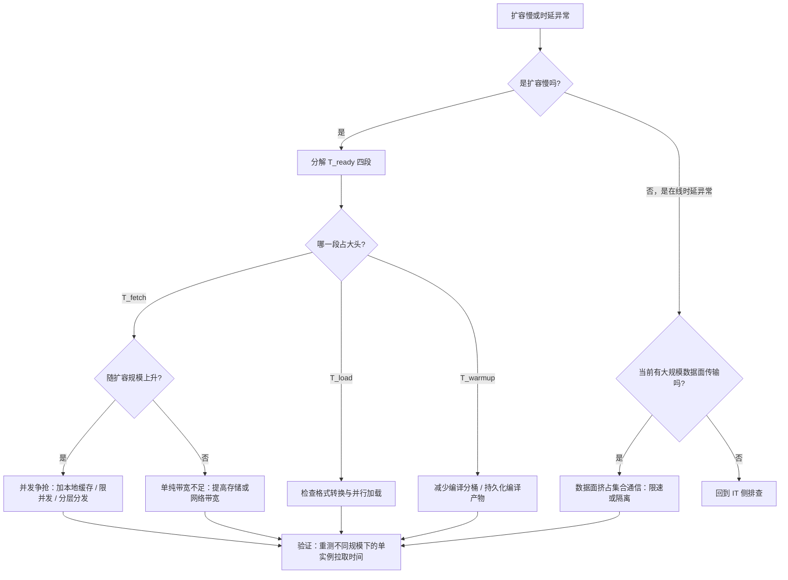

# 存储、日志与数据面

> 位置：[InferenceAtlas](../../INDEX.md) > [模块 09](README.md) > 当前文档
> 信息截至：2026-07-29 ｜ 最后核验：2026-07-29 ｜ 内容版本：v0.1
> 时效性等级：低
> 相关主题：[设施冗余与可维护性](07_reliability_redundancy_and_maintenance.md)｜[安全与租户隔离](../11_benchmarking_reliability_and_observability/10_safety_security_and_abuse_controls.md)｜`09_security_compliance_and_data_residency.md`

## 本章导读

推理服务的存储需求容易被低估，
因为「推理是无状态的」是一个流传很广但**只在最窄的意义上成立**的说法。
单次前向计算确实不改变模型权重，
**但一个真实的推理服务有大量状态**：

模型权重要被分发与加载、
前缀缓存与会话状态要被保存、
KV 在某些架构下要跨实例传输或换出、
日志与审计记录要被写入与保留、
金标准集与评测结果要被存档。

**这些数据流有一个共同特征：它们的规模与访问模式与「请求处理」完全不同**，
因此需要单独设计。

本章的三条主线：

**第一，权重分发是扩容路径上的关键环节**。
扩容时多个实例同时拉取同一份权重，
**并发争抢会让每个实例都更慢**——
**扩容规模越大，单实例就绪越慢**，这是一个反直觉但常见的现象。

**第二，日志是一个容易失控的量**。
推理的请求内容体积大（长上下文），
**而日志系统的防护通常弱于主服务**——
它同时是成本问题与安全问题。

**第三，KV 相关的数据面是推理特有的**。
PD 分离的 KV 传输、KV 换出到主机或远端、
跨实例的前缀缓存共享——
**这些流量的特征（大消息、带宽敏感、可与计算重叠）
与集合通信恰好相反**，因此需要不同的网络处理。

**关于数值的说明**：受出口策略限制
（详见 [AGENTS.md 第 11 节](../../AGENTS.md)），
本章不给出任何具体的存储规格、带宽或成本数值。

## 学习目标

读完本章后，读者应能够：

1. 列出推理服务的五类持久化状态，并说明各自的访问模式
2. 解释为什么扩容规模越大、单实例的权重加载越慢，并给出三种缓解手段
3. 说明日志的成本与安全双重约束，并给出分层保留策略
4. 区分推理数据面的两类流量（小消息延迟敏感 vs 大消息带宽敏感）
5. 为推理服务设计一个存储与数据面的容量估算

## 核心结论

- **「推理无状态」只在单次前向的意义上成立**：服务层有权重、缓存、会话、日志、评测五类状态。
- **权重分发的并发争抢使扩容规模越大、单实例就绪越慢**，这直接削弱弹性能力。
- **节点本地缓存与分层分发是权重分发最有效的两个手段**，而限制并发拉取在容量紧张时反而更快恢复服务能力。
- **日志同时是成本与安全问题**：请求内容体积大，而日志系统防护通常弱于主服务。
- **推理数据面有两类特征相反的流量**：集合通信是小消息延迟敏感，KV 传输是大消息带宽敏感。
- **存储的可用性会传导为服务的可用性**：权重拉取失败会阻塞扩容，日志写入阻塞可能拖慢请求处理。

## 1. 问题定义、系统边界与工作负载

### 1.1 推理服务的五类状态

| 类别 | 内容 | 规模 | 访问模式 |
|---|---|---|---|
| **模型权重** | 参数文件 | 大 | **读多写少；扩容时并发读** |
| **缓存与会话** | 前缀缓存、对话历史 | 中 | 高频读写；有生命周期 |
| **KV 数据面** | PD 传输、换出、跨实例共享 | **大且瞬时** | 点对点、带宽敏感 |
| **日志与审计** | 元数据、（可选的）内容 | **可能很大** | 只追加；长期保留 |
| **评测与金标准** | 固定输入、期望输出、历史结果 | 小 | 低频；版本化 |

**第三类是推理特有的**，
它不落盘（多数情况下）但占用网络与内存带宽，
**因此本章把它归入「数据面」而非「存储」**。

### 1.2 本章不涉及

具体存储产品的规格与选型（本库无法核验，见第 5 节）、
KV 传输的判据与设计（见 [模块 06 第 8 章](../06_distributed_and_moe_inference/08_kv_cache_transfer_and_remote_memory.md)）、
安全与合规的详细要求（见下一章与 [模块 11 第 10 章](../11_benchmarking_reliability_and_observability/10_safety_security_and_abuse_controls.md)）。

## 2. 原理、数学与性能模型

### 2.1 权重分发的并发争抢

设 $n$ 个实例同时从同一存储拉取大小为 $W$ 的权重，
存储侧总带宽为 $B_{\text{store}}$。

**若带宽被均分**，单实例的拉取时间为

$$
T_{\text{fetch}}(n) = \frac{W}{B_{\text{store}} / n} = \frac{n W}{B_{\text{store}}}
$$

**即单实例的拉取时间正比于并发实例数**。

**这是一个反直觉的结论**：
**扩容规模越大，每个实例就绪越慢**。

**而扩容恰恰发生在流量高峰**，
**所以这个效应出现在最不该出现的时候**——
并且它可能触发正反馈：
现有实例过载 → 触发更大规模扩容 → 每个实例更慢就绪 → 过载持续更久。

### 2.2 串行化反而更快恢复服务能力

**若限制并发拉取数为 $c < n$**，实例分批就绪。
**第 $k$ 批的就绪时间为**

$$
T_k = k \cdot \frac{c \cdot W}{B_{\text{store}}}
$$

**总时间与全并发接近**（都受限于总带宽 $B_{\text{store}}$ 与总数据量 $nW$），
**但前几批实例显著更早就绪**。

**在容量紧张时，「早点有一部分实例能服务」优于「所有实例同时就绪」**——
**因为它更早开始分担负载**。

**这是一个实用但常被忽略的调度优化**：
**限制并发拉取，在总时间不变的前提下改善了恢复曲线的形状**。

### 2.3 三种分发结构的对比

| 结构 | 单实例拉取时间 | 存储侧压力 | 复杂度 |
|---|---|---|---|
| 中心存储直拉 | $\propto n$ | **随 $n$ 线性** | 低 |
| 节点本地缓存 | **首次后接近零** | 只在缓存未命中时 | 中 |
| 分层/对等分发 | **随 $n$ 增长慢得多** | 低 | 高 |

**节点本地缓存是性价比最高的手段**：
如果权重已经在节点本地（上次运行留下的），
**重启或扩容时不需要重新拉取**。

**它的前提是节点有足够的本地存储且权重版本稳定**。

**分层/对等分发**把数据从少数已有节点扩散到其他节点，
**使得存储侧的压力不随实例数线性增长**——
代价是实现与运维复杂度。

### 2.4 就绪时间的完整分解

$$
T_{\text{ready}} = T_{\text{fetch}} + T_{\text{load}} + T_{\text{warmup}} + T_{\text{health}}
$$

（与 [模块 17 案例七](../17_interview_prep/09_mock_interview_cases.md) 一致。）

**本章关注前两项**：

| 段 | 瓶颈 | 优化 |
|---|---|---|
| $T_{\text{fetch}}$ | 存储/网络带宽；**并发争抢** | 本地缓存、分层分发、限并发 |
| $T_{\text{load}}$ | 本地盘带宽、主机到设备链路、格式转换 | 并行加载、内存映射、直接可映射的格式 |

**$T_{\text{load}}$ 中的「格式转换」常被低估**：
如果存储格式与设备内存布局不一致，
**加载时需要转换，而这可能占相当比例**。
**使用可直接映射的格式能显著缩短这一段**。

### 2.5 日志量的估算

日志量的量级由是否记录内容决定：

| 层 | 单请求数据量 | 相对规模 |
|---|---|---|
| 元数据（租户、时间、token 数、时延、状态） | 小且固定 | 基准 |
| 分段时间戳 | 小 | 与元数据同量级 |
| 逐 token 时间戳 | **正比于输出长度** | 可观 |
| **请求与输出内容** | **正比于输入+输出长度** | **最大** |

**关键观察**：**内容日志的量正比于 token 数**，
**而长上下文场景下输入可以很长**——
**所以内容日志的体积可能与推理本身处理的数据量同量级**。

**这使得「默认记录全部内容」在长上下文服务上是不可行的**，
既因为成本，也因为它是一个数据泄漏面
（见 [模块 11 第 10 章](../11_benchmarking_reliability_and_observability/10_safety_security_and_abuse_controls.md) 3.4）。

### 2.6 数据面的两类流量

**推理的网络流量有两类特征相反的**：

| 类别 | 消息大小 | 敏感于 | 是否在关键路径 | 例子 |
|---|---|---|---|---|
| 集合通信 | **小** | **延迟** | **是** | TP 的每层归约 |
| 数据面传输 | **大** | **带宽** | 否（可重叠） | KV 传输、权重分发 |

**两者的优化方向相反**：
前者要减少跳数与轮数，后者要提高带宽。

**因此理想的网络需要同时提供「低延迟的小消息路径」与「高带宽的大消息路径」**，
**而这两个需求可能需要不同的处理**（不同队列、优先级或物理路径）。

**一个实际的风险**：
**大消息的数据面流量可能挤占小消息的延迟敏感路径**——
例如一次大规模的权重分发或 KV 迁移
**恰好与在线请求的集合通信共享链路**，
**导致 TPOT 出现毛刺**。

**这是一个应当被隔离的场景**：
把数据面流量与集合通信在网络上分开（优先级或路径），
**否则运维动作（扩容、迁移）会直接影响在线服务的时延**。

## 3. 实现机制与系统设计

### 3.1 权重分发的设计

**推荐的组合**：

1. **节点本地缓存**为主——
   权重在节点上持久化，重启与扩容时优先用本地；
2. **限制并发拉取**——
   缓存未命中时排队而非全部同时拉（见 2.2）；
3. **权重版本化与完整性校验**——
   加载时校验哈希，**防止被替换或损坏的权重上线**
   （见 [模块 11 第 10 章](../11_benchmarking_reliability_and_observability/10_safety_security_and_abuse_controls.md) 3.5）；
4. **分层分发**作为大规模场景的进一步优化。

**第三点值得强调**：
**权重损坏或被替换的后果是模型输出异常，而这在运行时几乎无法被发现**——
除非有质量监控与金丝雀。
**加载时的哈希校验是最便宜的防线**。

### 3.2 日志的分层保留

| 层 | 内容 | 默认 | 保留期 | 访问控制 |
|---|---|---|---|---|
| 审计 | 元数据 + 工具调用记录 | **开** | 按合规要求 | **不可篡改** |
| 运行 | 错误与状态，不含内容 | **开** | 短 | 常规 |
| 分段轨迹 | 时间戳，采样 | 开（低采样） | 中 | 常规 |
| **内容** | 请求与输出 | **关** | — | **加密 + 限期 + 访问审计** |

**「访问审计」的含义**：
**谁查看了内容日志本身也要被记录**。

**开启内容日志的合理场景**：
质量分析、合规要求、事故排查。
**每一种都应当是「按需、限期、限范围」而不是「默认全量」**。

### 3.3 缓存与会话状态的存储

| 状态 | 存放位置 | 生命周期 | 注意 |
|---|---|---|---|
| 前缀缓存（KV） | **设备显存** | 随驱逐策略 | **缓存键必须含租户** |
| 会话历史（文本） | 外部存储或内存 | 按会话 TTL | 标识不可预测 + 校验归属 |
| 会话对应的 KV | 显存或换出 | 按活跃度 | 换出判据见模块 06 |

**三者的一致性问题**：
**如果会话历史被保留而对应的 KV 已被驱逐**，
下一轮请求需要重新 prefill——
**这是正常的，但要确保系统正确处理这种「历史在但 KV 不在」的状态**，
而不是假设两者同步。

### 3.4 数据面的隔离

见 2.6。**具体做法**：

| 手段 | 说明 |
|---|---|
| 优先级/队列 | 集合通信优先于数据面传输 |
| 限速 | 权重分发与 KV 迁移限速 |
| 时间错开 | 大规模分发避开流量高峰 |
| 物理隔离 | 若条件允许，分开的网络路径 |

**「限速」是最容易实施的一项**，
**而它的收益是防止运维动作影响在线时延**。

**一个具体建议**：
**把「权重分发正在进行」导出为一个指标**，
**使得在线时延异常时能立刻排除或确认这个原因**。

### 3.5 存储可用性传导为服务可用性

| 存储故障 | 对服务的影响 |
|---|---|
| 权重存储不可用 | **无法扩容与重启**（已运行的实例不受影响） |
| 会话存储不可用 | 多轮对话降级为单轮 |
| **日志写入阻塞** | **可能拖慢请求处理**（若同步写） |

**第三行是一个容易被忽略的风险**：
**如果日志是同步写入且写入阻塞，它会直接影响请求处理**。

**因此日志写入应当是异步且有界的**：
缓冲区满时丢弃（并计数）而不是阻塞请求。
**「日志的可用性不应高于服务的可用性要求」**——
换句话说，**丢一些日志优于拖慢服务**。

**这个判断需要被明确写进设计**，
否则默认的同步写会引入一个隐蔽的依赖。

## 4. 性能、成本、能耗与可靠性 trade-off

### 4.1 本地缓存的空间成本

节点本地缓存权重需要本地存储空间。

**权衡**：

| 方案 | 空间成本 | 扩容速度 |
|---|---|---|
| 不缓存 | 0 | 慢（每次拉取） |
| 缓存当前版本 | 一份权重 | **快** |
| 缓存多版本 | 多份 | 快且支持快速回滚 |

**缓存多版本的额外价值是回滚速度**：
**发布出问题时能立刻切回旧版本而不需要重新拉取**。
**这在事故场景下价值很高**，值得为它付出空间成本。

### 4.2 日志保留的成本与价值

| 保留 | 成本 | 价值 |
|---|---|---|
| 仅元数据 | 低 | 容量分析、审计 |
| + 采样轨迹 | 中 | **事故排查** |
| + 全量内容 | **高** | 质量分析；**但风险大** |

**推荐做法是「元数据全量 + 轨迹采样 + 内容按需」**，
**并且内容的采样应当是有偏的**
（保留异常与超时的请求，而非纯随机）——
这与 [模块 11 第 7 章](../11_benchmarking_reliability_and_observability/07_observability_metrics_logs_traces.md) 3.3 的 trace 采样策略一致。

### 4.3 数据面隔离的成本

物理隔离（独立网络路径）成本最高但效果最好；
优先级与限速成本低但需要正确配置。

**判断依据是「运维动作是否已经影响过在线时延」**——
如果有过，**隔离的投入就有明确的收益依据**。

## 5. benchmark、真实案例或公开部署案例

**本章不给出任何具体的存储规格、带宽、体积或成本数值**。

受当前环境的网络出口策略限制（详见 [AGENTS.md 第 11 节](../../AGENTS.md)），
本库无法访问存储产品文档或运营数据，**因此无法核验任何一项**。

**读者应自行填充的数据面与存储画像**：

| 项 | 你的值 | 备注 |
|---|---|---|
| 权重体积（每模型每版本） | 待填 | 决定分发时间 |
| **扩容时的并发拉取数与单实例拉取时间** | 待填 | **`独立可复现实验`；验证是否被争抢** |
| 是否有节点本地缓存 | 是/否 | 性价比最高的手段 |
| 是否限制并发拉取 | 是/否 | 改善恢复曲线形状 |
| 加载时是否校验权重哈希 | 是/否 | **防替换的最便宜防线** |
| $T_{\text{fetch}}$ / $T_{\text{load}}$ / $T_{\text{warmup}}$ 各自占比 | 待填 | 决定优化方向 |
| 日志层级与各层保留期 | 待填 | 成本与安全 |
| 内容日志是否默认关闭 | 是/否 | **默认应关** |
| 日志写入是同步还是异步 | 待填 | **同步写是隐蔽的可用性依赖** |
| 数据面流量与集合通信是否隔离 | 是/否 | 防运维动作影响在线时延 |
| 「权重分发进行中」是否导出为指标 | 是/否 | 便于排除时延异常的原因 |

**第二行是本表最值得实测的一项**：
**在不同扩容规模下测单实例的拉取时间**，
**若它随规模上升，说明存在并发争抢**，
此时限制并发或引入本地缓存会有明确收益。

> 实验方法论要求见 [如何读推理 benchmark](../00_start_here/03_how_to_read_inference_benchmarks.md)。

## 6. 设计决策框架

**图解读**：

1. **本图展示什么**：存储与数据面相关问题的分诊。
   两个入口——扩容慢与在线时延异常——
   **后者容易被完全忽略与数据面的关联**。
2. **核心瓶颈**：瓶颈在 E 节点的判断。
   **「拉取时间是否随扩容规模上升」这个检查能直接区分
   「并发争抢」与「单纯带宽不足」**，
   而两者的修正完全不同——
   前者靠本地缓存与限并发（不需要加带宽），后者才需要扩带宽。
3. **图中的 trade-off**：J→K 这条路径提醒
   **运维动作（权重分发、KV 迁移）会影响在线时延**。
   限速会拖慢运维动作，**但保住了在线 SLO**——
   这个优先级应当事先确定。
4. **面试如何引用**：可以说
   「扩容慢我会先分解就绪时间的四段；
   **如果是拉取段，我会看它是否随扩容规模上升**——
   若是，那是并发争抢，加本地缓存比加带宽更有效」。

## 7. 常见失败模式与排查路径

| 症状 | 根因 | 修正 |
|---|---|---|
| 扩容规模越大，实例就绪越慢 | 权重拉取并发争抢 | 本地缓存 / 限并发 / 分层分发 |
| 高峰扩容不及时，形成正反馈 | 就绪慢 + 过载触发更多扩容 | 缩短就绪时间；限速扩容 |
| 在线时延在运维动作时出现毛刺 | 数据面挤占集合通信 | 限速 / 优先级 / 隔离 |
| 日志成本失控 | 默认记录全量内容 | 分层保留；内容默认关 |
| 日志系统故障拖慢请求 | 同步写入 | 改异步且有界，满则丢弃并计数 |
| 模型输出异常查不出原因 | 权重损坏或版本错误 | 加载时校验哈希 + 金丝雀 |
| 回滚很慢 | 只缓存当前版本 | 缓存多版本 |
| 多轮对话行为异常 | 历史在但 KV 已驱逐，处理不当 | 明确处理这一状态 |

**排查顺序**：**先分解就绪时间或确认是否有并发数据面传输，再定位到具体段**。

## 8. 关联面试主题

1. 模型加载与权重分发瓶颈——见 [案例七](../17_interview_prep/09_mock_interview_cases.md)
2. KV 传输与远端内存的判据——见 [Q070](../17_interview_prep/05_distributed_and_moe_questions.md)
3. 推理与训练的网络需求差异——见 [Q073](../17_interview_prep/05_distributed_and_moe_questions.md)
4. 多租户的数据隔离与审计——见 [Q095](../17_interview_prep/07_debug_benchmark_and_reliability_questions.md)
5. serverless 与冷启动——见 [Q042](../17_interview_prep/03_serving_scheduling_and_slo_questions.md)

## 9. 小结

「推理是无状态的」只在单次前向的意义上成立。
服务层有五类状态：**权重、缓存与会话、KV 数据面、日志与审计、评测**。

**四条核心结论**：

**第一，权重分发的并发争抢使扩容规模越大、单实例就绪越慢**。
$T_{\text{fetch}} \propto n$——
**而扩容恰恰发生在流量高峰，可能形成正反馈**。
**节点本地缓存是性价比最高的手段**；
而在容量紧张时，**限制并发拉取反而更快恢复服务能力**——
总时间接近，但前几批实例显著更早就绪。

**第二，日志同时是成本与安全问题**。
内容日志的体积正比于 token 数，
**长上下文场景下它可能与推理处理的数据量同量级**；
而日志系统的防护通常弱于主服务。
**推荐「元数据全量 + 轨迹采样 + 内容按需」**，
且内容采样应当有偏（保留异常与超时的请求）。

**第三，推理数据面有两类特征相反的流量**：
集合通信是小消息延迟敏感且在关键路径，
KV 传输与权重分发是大消息带宽敏感但可重叠。
**两者共享链路时，运维动作会直接影响在线时延**——
**这是一个应当被隔离或限速的场景**。

**第四，存储可用性会传导为服务可用性**，
**其中最隐蔽的是同步日志写入**：
它会让日志系统的故障直接拖慢请求处理。
**日志写入应当异步且有界——丢一些日志优于拖慢服务**，
而这个判断需要被明确写进设计。

一个便宜且高价值的实践：**加载时校验权重哈希**。
权重损坏或被替换的后果是输出异常，
**而这在运行时几乎无法被发现**——
哈希校验是最便宜的防线。

本章不给出任何具体的存储规格、带宽或体积数值——当前环境无法核验。
第 5 节给出的是一份画像模板，
**其中「不同扩容规模下的单实例拉取时间」最值得实测**。

## 关键术语

| 中文术语 | 英文 | 定义 | 单位/口径 | 关联文档 |
|---|---|---|---|---|
| 并发争抢 | fetch contention | 多实例同时拉取导致单实例变慢 | — | 本章 2.1 |
| 节点本地缓存 | node-local cache | 权重在节点上持久化以避免重拉 | — | 本章 2.3 |
| 就绪时间 | time to ready | 从启动到可服务的总时间 | 秒 | 本章 2.4 |
| 数据面流量 | data-plane traffic | 权重分发、KV 传输等大消息流量 | — | 本章 2.6 |
| 有偏采样 | biased sampling | 优先保留异常与超时请求的记录 | — | 本章 4.2 |

## 延伸阅读

- [设施冗余、可维护性与 RAS](07_reliability_redundancy_and_maintenance.md)
- [KV cache 传输与远端内存](../06_distributed_and_moe_inference/08_kv_cache_transfer_and_remote_memory.md)
- [多节点服务拓扑](../06_distributed_and_moe_inference/09_multi_node_serving_topologies.md)
- [可观测性：指标、日志与 trace](../11_benchmarking_reliability_and_observability/07_observability_metrics_logs_traces.md)
- [安全、滥用防护与租户隔离](../11_benchmarking_reliability_and_observability/10_safety_security_and_abuse_controls.md)
- [serverless 与突发推理](../03_serving_engines_and_scheduling/11_serverless_and_burst_inference.md)

## 主要来源

本章由带宽共享的算术关系、
[模块 06 第 8–9 章](../06_distributed_and_moe_inference/08_kv_cache_transfer_and_remote_memory.md) 的数据面特征、
以及 [模块 11 第 7、10 章](../11_benchmarking_reliability_and_observability/07_observability_metrics_logs_traces.md) 的日志与安全约束推导而成。

**不含任何需要外部核验的存储规格、带宽、体积或成本数值**。
受当前环境的网络出口策略限制，本库无法访问存储产品文档
（详见 [AGENTS.md 第 11 节](../../AGENTS.md)）。

| 类别 | 说明 | 披露标签 |
|---|---|---|
| 并发争抢模型、就绪时间分解、日志量的量级关系 | 由算术关系推导 | — |
| 两类数据面流量的对比 | 由模块 06 的通信特征推导 | — |
| 读者自行填充的存储与数据面画像 | 应自行实测 | `独立可复现实验` |
| 任何具体的存储规格、带宽与成本 | **本章未给出** | `待核实` |

## 更新记录

| 日期 | 版本 | 变更 | 核验人 |
|---|---|---|---|
| 2026-07-29 | v0.1 | 初稿：五类状态、权重分发的并发争抢与限并发策略、日志分层、数据面两类流量的隔离 | — |
