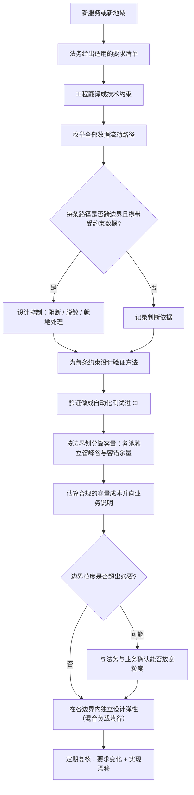

# 物理安全、合规与数据驻留

> 位置：[InferenceAtlas](../../INDEX.md) > [模块 09](README.md) > 当前文档
> 信息截至：2026-07-29 ｜ 最后核验：2026-07-29 ｜ 内容版本：v0.1
> 时效性等级：中
> 相关主题：[存储与数据面](08_storage_logging_and_data_plane.md)｜[安全与租户隔离](../11_benchmarking_reliability_and_observability/10_safety_security_and_abuse_controls.md)｜`10_operations_case_studies.md`

## 关于本章范围的说明

**本章不描述任何具体的法律、法规、认证标准或合规要求**。

受当前环境的网络出口策略限制（详见 [AGENTS.md 第 11 节](../../AGENTS.md)），
本库无法访问任何法规文本、标准文档或认证要求，
**因此无法核验任何一条具体的合规陈述**。
在无可靠来源时描述「某地区要求什么」「某认证包含哪些控制项」
属于本库明确禁止的行为。

**更重要的是：合规要求随地区与时间变化，而且它是法律问题不是工程问题**。
**任何具体的合规判断都必须由法务与合规部门给出，而不是从技术文档推断**。

**本章因此写的是另一件事**：
**合规约束如何转化为推理系统的架构约束**——
即「一旦法务告诉你某项要求成立，它在技术上意味着什么」。
这个映射关系不依赖具体法规，
**而且它是推理团队真正需要理解的部分**。

## 本章导读

数据驻留与合规对推理系统的影响有一个共同特征：
**它们通常是硬约束而不是优化目标**。

一个时延目标可以权衡（慢一点换省一点），
**而一条「数据不得离开某个边界」的要求不能权衡**——
它要么满足要么不满足。

**这个性质决定了合规约束应当在架构设计的最前面被处理**，
而不是在方案定型后再检查。
**因为它可能直接排除某些方案**：
排除跨区域的容量借用、
排除某些第三方 API、
排除跨边界的模型或数据传输。

本章的三条主线：

**第一，数据驻留把「容量池」切碎**。
如果不同边界的数据不能互相流动，
**那么每个边界就是一个独立的容量池**——
而 [第 6 章](06_cluster_capacity_and_site_planning.md) 已经说明，
**池越小，为峰谷与容错预留的比例越高**。
**合规的成本因此可以被定量估算**。

**第二，推理系统有一些不显眼的数据流动路径**。
前缀缓存、KV 传输、日志、模型权重、
甚至遥测指标——
**它们都可能跨越边界，而且比「请求内容」更容易被忽略**。

**第三，物理安全与逻辑安全要匹配**。
再好的逻辑隔离也无法防止对物理设备的直接访问，
**而推理服务的显存中驻留着用户数据（KV cache）**。

## 学习目标

读完本章后，读者应能够：

1. 说明合规约束为什么应当在架构设计的最前面处理
2. 定量估算数据驻留导致的容量池切分成本
3. 列出推理系统中容易被忽略的跨边界数据流动路径
4. 说明物理安全与逻辑隔离的关系，以及显存中的用户数据意味着什么
5. 设计一个把合规约束转化为技术约束的核对流程

## 核心结论

- **合规约束是硬约束不是优化目标**，因此必须在架构设计的最前面处理——它可能直接排除某些方案。
- **数据驻留把容量池切碎**，而小池的峰谷与容错预留比例更高——合规的容量成本可被定量估算。
- **推理有多条不显眼的跨边界路径**：前缀缓存、KV 传输、日志、权重、遥测，都比「请求内容」更容易被忽略。
- **显存中驻留着用户数据**（KV cache），因此物理访问控制与逻辑隔离同等重要。
- **合规判断必须来自法务而非技术推断**；工程侧的职责是把已确定的要求映射成技术约束并验证。
- **可验证性与合规同等重要**：无法证明满足的合规等同于不满足。

## 1. 问题定义、系统边界与工作负载

### 1.1 三类约束的区别

| 类型 | 特征 | 处理方式 |
|---|---|---|
| 性能目标 | 可权衡 | 优化 |
| 成本目标 | 可权衡 | 优化 |
| **合规约束** | **不可权衡** | **先满足，再在剩余空间内优化** |

**因此合规约束的正确位置是「设计输入」而不是「设计检查」**。

**一个常见的失误顺序**：
先按性能与成本设计出一个方案，
**再检查合规——然后发现方案不可行需要重做**。

**正确的顺序是先让法务给出约束清单，
把它翻译成技术约束，再在这些约束内做设计**。

### 1.2 本章的分工声明

| 谁 | 负责什么 |
|---|---|
| **法务与合规** | **确定哪些要求适用、要求的具体内容** |
| 工程 | 把已确定的要求映射成技术约束；实现；**证明满足** |

**本章只讨论第二行**。
**任何「某地区要求什么」的判断都不在本章范围内**（原因见开头的说明）。

## 2. 原理、数学与性能模型

### 2.1 数据驻留的容量成本

设合规要求把服务切成 $M$ 个独立的边界
（数据不得跨边界流动）。**每个边界成为一个独立的容量池**。

由 [第 6 章](06_cluster_capacity_and_site_planning.md) 2.2–2.3，
每个池的利用率上界为

$$
u \le \min\left(\frac{1}{f_{\text{peak}}},\; \frac{R-1}{R}\right)
$$

**关键在于：切分不改变这个上界的形式，但改变了它的实际取值**：

**（一）峰谷比会变差**。
小池服务的用户更少，
**而更少的用户意味着流量的相对波动更大**（大数定律）。
**因此 $f_{\text{peak}}$ 在小池上通常更高**，
从而 $1/f_{\text{peak}}$ 更低。

**（二）容错的相对成本上升**。
如果每个边界内都要独立满足容错要求，
**每个边界都需要自己的 $R$ 个站点**——
**总站点数是 $M \times R$ 而不是 $R$**。

**（三）无法互相借用容量**。
一个边界的低谷无法填另一个边界的高峰。

**综合结果**：切分后的总容量需求高于不切分时。
**这个差额就是数据驻留的容量成本，它可以被估算并向业务说明**。

**估算方法**：分别按各边界的实际流量算所需容量并求和，
**与「合并为一个池」的假想情形对比**。

### 2.2 边界的层级

数据边界可能出现在多个层级：

| 层级 | 例子 | 对架构的影响 |
|---|---|---|
| 地理 | 数据不得离开某地域 | 站点选址；跨域路由被禁 |
| 组织 | 不同客户的数据不得混合 | 租户隔离；可能要求物理隔离 |
| 网络 | 数据不得经过公网 | 网络路径设计 |
| 设备 | 数据不得驻留在共享设备上 | **可能要求专用硬件** |

**最后一行的影响最大**：
**如果要求专用硬件，那么该边界的容量池就是「一组专属设备」**，
**利用率通常会显著低于共享池**。

### 2.3 可验证性

**一个无法被证明满足的合规要求，等同于不满足**。

**因此每条技术约束都需要配一个验证方法**：

| 约束 | 验证方法 |
|---|---|
| 数据不出边界 | 网络策略 + 流量审计；**跨边界探测测试** |
| 租户数据不混合 | **跨租户缓存探测测试**（见 [模块 11 第 10 章](../11_benchmarking_reliability_and_observability/10_safety_security_and_abuse_controls.md) 3.3） |
| 访问被记录 | 审计日志的完整性检查 |
| 数据按期删除 | 删除流程的抽样验证 |

**「探测测试」应当在 CI 中自动运行**——
因为这些约束的实现（网络策略、缓存键）
**很容易在后续重构中被无声地破坏**。

**这一点与 [模块 11 第 10 章](../11_benchmarking_reliability_and_observability/10_safety_security_and_abuse_controls.md) 的结论一致**：
**不产生错误信号的问题只能靠自动化测试防守**。

## 3. 实现机制与系统设计

### 3.1 推理系统的跨边界数据流动路径

**这是本章对工程侧最有价值的部分**。
除了显而易见的「请求与响应内容」，
**推理系统还有多条容易被忽略的路径**：

| 路径 | 是否携带用户数据 | 容易被忽略的程度 |
|---|---|---|
| 请求与响应 | 是 | 低（显而易见） |
| **前缀缓存** | **是（KV 由用户内容计算得到）** | **高** |
| **KV 传输**（PD 分离、换出） | **是** | **高** |
| **会话状态** | 是 | 中 |
| **日志（若含内容）** | 是 | 中 |
| 模型权重 | 否（除非微调过用户数据） | — |
| **遥测与指标** | **可能（若标签含用户标识）** | **高** |
| 评测与金标准集 | 可能（若从生产采样） | 中 |
| **崩溃转储 / 调试快照** | **可能（含显存内容）** | **很高** |

**最后一行值得特别说明**：
**崩溃转储可能包含显存内容，而显存中驻留着 KV cache（用户数据）**。
**如果转储被自动上传到集中的诊断系统，它可能跨越了边界**——
**而这几乎从不会出现在合规检查清单里**。

**倒数第三行同样隐蔽**：
如果指标带用户或租户标识作为标签，
**而监控系统是跨边界集中部署的**，
**那么标识本身就跨越了边界**。

**工程侧的核对动作**：
**列出所有离开边界的数据流，逐条判断是否携带受约束的数据**，
而不只是检查「请求内容有没有出去」。

### 3.2 从合规要求到技术约束的映射

**这是本章建议的工作流程**：

```text
1. 法务给出适用的要求清单（本章不讨论内容）
        ↓
2. 工程把每条要求翻译成技术约束
        例：「数据不得离开地域 X」
        → 请求只能路由到 X 内的实例
        → 缓存不得跨 X 边界共享
        → 日志与指标不得导出到 X 外
        → 崩溃转储不得上传到 X 外
        ↓
3. 对每条技术约束设计实现与验证方法
        ↓
4. 把验证做成自动化测试（进 CI）
        ↓
5. 定期复核：要求是否变化、实现是否仍然满足
```

**第 2 步是工程侧的核心工作**，
**而它的质量取决于是否枚举了全部数据流动路径**（见 3.1）。

**第 5 步不可省略**：
**要求会变，实现也会在重构中漂移**。

### 3.3 物理安全与显存中的用户数据

**一个容易被忽略的事实**：
**推理服务运行时，用户数据（KV cache）驻留在设备显存中**。

**这意味着**：

1. **物理访问控制是数据保护的一部分**，
   不只是设备资产保护；
2. **设备退役与更换时需要考虑残留数据**；
3. **维护人员的访问权限需要与数据的敏感级别匹配**。

**对推理团队的具体含义**：
**如果某类数据有严格的物理隔离要求，
那么承载它的设备不能与其他租户共享**——
**这直接约束了部署方案**（回到 2.2 的「设备级边界」）。

### 3.4 多边界部署的架构模式

| 模式 | 说明 | 适合 |
|---|---|---|
| **完全独立** | 每边界一套完整部署 | 要求最严；成本最高 |
| **共享控制面 + 独立数据面** | 配置与调度共享，数据不跨界 | 中等要求；**注意控制面不得携带用户数据** |
| 逻辑隔离 | 同一物理设施内的软隔离 | 要求较松 |

**第二行的注意点很重要**：
**共享控制面时必须确认它不携带用户数据**——
包括指标标签、日志、以及调度决策中可能包含的请求特征。

**这是「共享控制面」这个模式最容易出问题的地方**。

### 3.5 合规对弹性的影响

由 2.1，切分后：

- **无法跨边界借用容量**——
  一个边界的高峰不能用另一个边界的空闲容量吸收；
- **峰值溢出到外部（如第三方 API）可能被禁止**；
- **每个边界都需要独立的余量**。

**因此合规约束下的弹性设计必须在每个边界内独立完成**，
**而小边界的弹性成本更高**（余量的绝对量小但相对比例高）。

**一个实用的缓解**：
**在边界内部做混合负载**（离线填谷）——
它不涉及跨边界流动，**因此通常是合规的**，
且是提高小池利用率的有效手段。

## 4. 性能、成本、能耗与可靠性 trade-off

### 4.1 合规的容量成本

见 2.1。**这个成本应当被明确计算并向业务说明**：

$$
\text{合规容量成本} = \sum_{m=1}^{M} N_m - N_{\text{合并假想}}
$$

**向业务说明的价值在于**：
它把「合规」从一个模糊的约束变成一个有价签的决定，
**从而可以讨论「这个边界划分是否必要」**——
**有时业务上可以接受更粗的划分，而这能显著降低成本**。

**注意这不是在质疑合规要求本身**（那是法务的判断），
**而是在确认「边界划分的粒度」是否超出了必要**。

### 4.2 就近服务与边界的冲突

数据驻留要求把请求限制在特定边界内，
**而用户可能不在该边界附近**——
**此时网络往返会计入 TTFT**。

**这是一个不可消除的冲突**：
**合规要求的是数据的位置，而时延取决于用户与数据的距离**。

**处理方式**：
在 SLO 中区分「边界内用户」与「跨边界用户」的时延目标，
**并明确后者的时延包含网络往返**。

### 4.3 物理隔离与利用率

设备级的隔离要求使得该边界的设备无法被其他负载使用，
**即使它们空闲**。

**这是利用率损失最大的一种边界形式**，
**因此它的成本应当被单独评估**——
可能比逻辑隔离高出很多。

## 5. benchmark、真实案例或公开部署案例

**本章不给出任何具体的法规、标准、认证要求或合规案例**（原因见开头的说明）。

**读者应自行完成的映射表**（内容由法务提供，工程填写右列）：

| 法务给出的要求 | 技术约束 | 实现 | 验证方法 |
|---|---|---|---|
| （由法务填写） | 待填 | 待填 | 待填 |

**工程侧应当自行核对的数据流动清单**：

| 路径 | 是否跨边界 | 是否携带受约束数据 | 已有控制 |
|---|---|---|---|
| 请求与响应 | 待填 | 待填 | 待填 |
| **前缀缓存** | 待填 | 待填 | 待填 |
| **KV 传输（PD 分离、换出）** | 待填 | 待填 | 待填 |
| 会话状态 | 待填 | 待填 | 待填 |
| 日志（元数据 / 内容分别） | 待填 | 待填 | 待填 |
| **遥测与指标（含标签）** | 待填 | 待填 | 待填 |
| 评测与金标准集 | 待填 | 待填 | 待填 |
| **崩溃转储 / 调试快照** | 待填 | 待填 | 待填 |
| 模型权重（若含微调） | 待填 | 待填 | 待填 |

**加粗的四项是最容易被遗漏的**。
**崩溃转储尤其值得检查**：它可能包含显存内容（即 KV cache），
**而自动上传到集中诊断系统是很常见的默认配置**。

**验证测试清单**（应进 CI）：

| 测试 | 内容 |
|---|---|
| 跨边界路由探测 | 尝试把边界 A 的请求路由到边界 B，应被拒绝 |
| 跨租户缓存探测 | 见 [模块 11 第 10 章](../11_benchmarking_reliability_and_observability/10_safety_security_and_abuse_controls.md) 3.3 |
| 指标标签检查 | 确认导出的指标不含受约束的标识 |
| 日志内容检查 | 确认默认不含请求内容 |

> 实验方法论要求见 [如何读推理 benchmark](../00_start_here/03_how_to_read_inference_benchmarks.md)。

## 6. 设计决策框架



**图解读**：

1. **本图展示什么**：从合规要求到技术实现的完整流程。
   **起点是法务而不是工程**——
   这个顺序本身就是本章的一个核心建议。
2. **核心瓶颈**：瓶颈在 D 节点「枚举全部数据流动路径」。
   **多数遗漏发生在这一步**——
   前缀缓存、KV 传输、遥测标签、崩溃转储
   **都比「请求内容」更容易被忽略**，
   而遗漏一条就意味着约束实际上没有被满足。
3. **图中的 trade-off**：K→L 这一步（估算成本并确认粒度）
   **不是在质疑合规要求，而是在确认边界划分的粒度是否超出必要**。
   **把成本算出来才能进行这个讨论**。
4. **面试如何引用**：可以说
   「合规是硬约束，所以我会把它放在设计输入而不是设计检查；
   **然后枚举所有数据流动路径**——
   前缀缓存、KV 传输、遥测标签、崩溃转储这几条最容易被漏掉；
   **每条约束都要配一个能进 CI 的验证测试**」。

**O 节点（定期复核）不可省略**：
**要求会变，而实现会在重构中漂移**——
两者都会让原本满足的约束失效。

## 7. 常见失败模式与排查路径

| 症状 | 根因 | 修正 |
|---|---|---|
| 方案定型后发现合规不可行 | 合规当成设计检查而非设计输入 | 前置到设计输入 |
| 请求内容合规但指标泄漏了标识 | 遥测路径未被枚举 | 补全数据流动清单 |
| 崩溃转储跨边界上传 | 转储含显存内容且默认上传 | 检查转储策略 |
| 跨租户缓存命中 | 缓存键未含租户 | 补租户维度 + CI 测试 |
| 重构后隔离失效且无人发现 | 无自动化验证测试 | 验证进 CI |
| 小边界的成本远高于预期 | 池切碎导致余量比例上升 | 估算并说明；确认粒度必要性 |
| 跨边界用户时延不达标 | 用了统一的时延 SLO | 分别定义边界内外的目标 |
| 合规状态无法证明 | 缺可验证的记录 | 为每条约束设计验证方法 |

**排查顺序**：**先确认数据流动路径是否被完整枚举，再检查每条路径的控制与验证**。

## 8. 关联面试主题

1. 多租户的数据隔离与审计——见 [Q095](../17_interview_prep/07_debug_benchmark_and_reliability_questions.md)
2. 推理服务的安全边界与分级防护——见 [Q094](../17_interview_prep/07_debug_benchmark_and_reliability_questions.md)
3. 端云协同中的隐私硬约束——见 [Q088](../17_interview_prep/06_hardware_and_datacenter_questions.md)
4. 自建、云与 API 的选择（数据边界会排除 API）——见 [Q098](../17_interview_prep/08_company_paper_and_strategy_questions.md)
5. 集群容量与利用率上界——见 [第 6 章](06_cluster_capacity_and_site_planning.md)

## 9. 小结

**本章不描述任何具体的法规或标准**——
当前环境无法核验它们，
**而且合规判断本来就应当由法务给出而不是从技术文档推断**。
本章写的是**合规约束如何转化为推理系统的架构约束**。

**四条核心结论**：

**第一，合规是硬约束，因此应当是设计输入而不是设计检查**。
它可能直接排除某些方案（跨区域容量借用、第三方 API、跨边界传输），
**先设计后检查的顺序会导致方案返工**。

**第二，数据驻留把容量池切碎，而这个成本可以被定量估算**。
小池的峰谷比通常更差（用户少则相对波动大），
容错需要在每个边界内独立满足（总站点数是 $M \times R$），
且无法跨边界借用容量。
**把这个成本算出来的价值在于：可以讨论边界划分的粒度是否超出必要**——
这不是质疑合规要求本身，而是确认技术实现的粒度。

**第三，推理系统有多条不显眼的跨边界路径**。
除了请求内容，还有前缀缓存（KV 由用户内容算出）、
KV 传输、会话状态、日志、**遥测标签**、
以及**崩溃转储（可能含显存内容即 KV cache）**。
**最后两条最容易被遗漏，而崩溃转储的自动上传是很常见的默认配置**。
**工程侧的核心动作是完整枚举数据流动路径，而不只是检查请求内容**。

**第四，可验证性与合规同等重要**。
无法证明满足的合规等同于不满足，
**而这些约束的实现（网络策略、缓存键、指标标签）
很容易在重构中被无声地破坏**——
**因此验证必须做成能进 CI 的自动化测试**。

一个容易被忽略的事实：**推理运行时用户数据驻留在显存中**（KV cache），
**所以物理访问控制是数据保护的一部分而不只是资产保护**。
如果某类数据有严格的物理隔离要求，
**承载它的设备就不能与其他租户共享**——
而这是利用率损失最大的一种边界形式。

## 关键术语

| 中文术语 | 英文 | 定义 | 单位/口径 | 关联文档 |
|---|---|---|---|---|
| 数据驻留 | data residency | 数据必须保持在特定地理或组织边界内 | — | 本章 2.1 |
| 容量池切分 | capacity pool fragmentation | 边界划分使容量无法互相调剂 | — | 本章 2.1 |
| 数据流动路径 | data egress path | 数据离开边界的所有途径 | — | 本章 3.1 |
| 可验证性 | verifiability | 能否证明约束确实被满足 | — | 本章 2.3 |
| 设备级边界 | device-level boundary | 要求专用硬件而非共享设备 | — | 本章 2.2 |

## 延伸阅读

- [存储、日志与数据面](08_storage_logging_and_data_plane.md)
- [集群容量与选址规划](06_cluster_capacity_and_site_planning.md)
- [安全、滥用防护与租户隔离](../11_benchmarking_reliability_and_observability/10_safety_security_and_abuse_controls.md)
- [多租户隔离与 QoS](../03_serving_engines_and_scheduling/06_multi_tenant_isolation_and_qos.md)
- [prompt 缓存与前缀缓存](../03_serving_engines_and_scheduling/08_prompt_caching_and_prefix_caching.md)

## 主要来源

本章为**方法论内容**，由容量池切分的算术关系、
[模块 11 第 10 章](../11_benchmarking_reliability_and_observability/10_safety_security_and_abuse_controls.md) 的隔离与泄漏路径分析、
以及本模块第 6、8 章的容量与数据面模型推导而成。

**不含任何具体的法规、标准、认证要求或合规案例**。
受当前环境的网络出口策略限制，本库无法访问法规文本或标准文档
（详见 [AGENTS.md 第 11 节](../../AGENTS.md)）。
**合规判断必须由法务与合规部门给出，本章不提供任何此类判断**。

| 类别 | 说明 | 披露标签 |
|---|---|---|
| 容量池切分的成本关系 | 由第 6 章的容量模型推导 | — |
| 数据流动路径清单 | 由本库的推理系统结构枚举 | — |
| 法务给出的具体要求 | 应由法务与合规部门提供 | — |
| 任何具体的法规、标准与认证要求 | **本章未给出** | `待核实` |

## 更新记录

| 日期 | 版本 | 变更 | 核验人 |
|---|---|---|---|
| 2026-07-29 | v0.1 | 初稿：合规作为设计输入、容量池切分成本、数据流动路径枚举、可验证性要求 | — |
