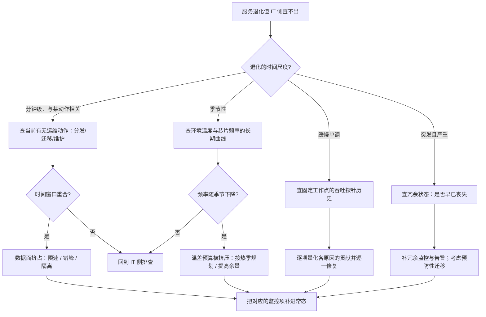

# 运维案例研究：五个设施层走查

> 位置：[InferenceAtlas](../../INDEX.md) > [模块 09](README.md) > 当前文档
> 信息截至：2026-07-29 ｜ 最后核验：2026-07-29 ｜ 内容版本：v0.1
> 时效性等级：低
> 相关主题：[设施冗余与 RAS](07_reliability_redundancy_and_maintenance.md)｜[benchmark 案例研究](../11_benchmarking_reliability_and_observability/11_benchmark_case_studies.md)｜[模块 09 总览](README.md)

## 本章导读

前九章给出了设施层的物理关系与设计约束。
这一章把它们用在五个具体场景上，
**每个场景都是「IT 侧查不出问题，但服务确实在退化」的情形**。

**这正是设施层问题的共同特征**：
症状出现在 IT 层（慢、容量不够、时延毛刺），
**而根因在设施层**——
**于是只在 IT 侧排查的团队会陷入死循环**。

五个案例覆盖五类典型情形：
**季节性降频**、**扩容的正反馈**、
**冗余悄悄丧失**、**运维动作打断在线服务**、
以及**容量缓慢缩水**。

**关于数值的说明**：五个案例中出现的所有参数
**都是为演示推导而设定的假设值**，不对应任何真实系统。
受当前环境的网络出口策略限制（详见 [AGENTS.md 第 11 节](../../AGENTS.md)），
本库无法核验任何真实的设施运营数据，
**因此本章不引用任何外部案例**。
**假设值的作用是让推导可以被完整走一遍并被读者复算**。

## 学习目标

读完本章后，读者应能够：

1. 识别「IT 侧查不出但设施层有根因」这类问题的共同特征
2. 用温差预算解释季节性的性能退化并给出定量估算
3. 识别扩容过程中的正反馈并说明打断它的手段
4. 说明为什么冗余丧失需要专门监控
5. 把运维动作对在线服务的影响纳入排查范围

## 核心结论

- **设施层问题的症状都出现在 IT 层**，因此只在 IT 侧排查会陷入死循环。
- **季节性退化的根因是温差预算被环境温度挤压**，而它的时间尺度是月而非分钟。
- **扩容存在正反馈**：过载触发扩容 → 并发拉取变慢 → 就绪更慢 → 过载持续更久。
- **冗余丧失不产生任何服务侧信号**，只能靠专门的冗余状态监控发现。
- **运维动作（权重分发、KV 迁移）会挤占在线流量的网络路径**，产生时延毛刺。
- **容量缓慢缩水的根因常在多处叠加**，因此需要一个「固定工作点的吞吐趋势」作为综合探针。

## 1. 问题定义、系统边界与工作负载

### 1.1 本章的体裁

与 [模块 11 第 11 章](../11_benchmarking_reliability_and_observability/11_benchmark_case_studies.md) 相同的走查体裁：

```text
场景与症状（IT 侧可见）
    ↓
IT 侧排查的结论（无发现或误判）
    ↓
指向设施层的那个检查
    ↓
根因与定量解释
    ↓
修正与防复发
```

**「指向设施层的那个检查」是每个案例的核心**——
它通常是一个 IT 团队不习惯做但成本很低的动作。

### 1.2 五个案例与依据章节

| 案例 | 类型 | 依据 |
|---|---|---|
| 一 | 季节性降频 | [第 4 章](04_cooling_air_direct_liquid_and_immersion.md) 温差预算 |
| 二 | 扩容正反馈 | [第 8 章](08_storage_logging_and_data_plane.md) 并发争抢 |
| 三 | 冗余丧失 | [第 7 章](07_reliability_redundancy_and_maintenance.md) |
| 四 | 运维动作影响在线 | [第 8 章](08_storage_logging_and_data_plane.md) 数据面隔离 |
| 五 | 容量缓慢缩水 | [第 7 章](07_reliability_redundancy_and_maintenance.md) 静默降级 |

## 2. 原理、数学与性能模型

本章用到的四个关系，均来自前面章节：

**（一）温差预算**（[第 4 章](04_cooling_air_direct_liquid_and_immersion.md) 2.3）：

$$
\underbrace{T_{j,\max} - T_{\text{amb}}}_{\text{总预算}} = \underbrace{\dot Q \sum R}_{\text{热阻消耗}} + \underbrace{\Delta T_{\text{fluid}} + \Delta T_{\text{HX}}}_{\text{输运与换热}}
$$

**（二）权重拉取的并发争抢**（[第 8 章](08_storage_logging_and_data_plane.md) 2.1）：

$$
T_{\text{fetch}}(n) = \frac{n W}{B_{\text{store}}}
$$

**（三）有效算力含热折扣**（[第 2 章](02_rack_power_and_density.md) 2.2）：

$$
\text{有效算力} \propto N \times \eta_{\text{thermal}}
$$

**（四）散热系统自检**（[第 4 章](04_cooling_air_direct_liquid_and_immersion.md) 3.2）：

$$
\dot Q_{\text{实际移走}} = \dot m \cdot c_p \cdot \Delta T \quad \text{应与设备实测功耗吻合}
$$

---

## 3. 实现机制与系统设计

### 3.1 案例一：每年夏天容量都不够

**症状**。服务在春秋两季运行正常，
**每年夏季都出现容量不足**，需要临时扩容。
IT 侧排查：代码无变化、流量增长与预期一致、
配置无调整。**结论是「流量增长导致的正常扩容需求」**。

**指向设施层的检查**：**按设备看芯片频率与温度的长期曲线**。

发现：**夏季芯片频率系统性低于春秋季**，
**而温度更高**。

**定量解释**。由温差预算：

$$
T_{j,\max} - T_{\text{amb}} = \dot Q \sum R + \Delta T_{\text{fluid}} + \Delta T_{\text{HX}}
$$

$T_{j,\max}$ 由芯片规格固定，
**夏季 $T_{\text{amb}}$ 上升 → 总预算变小**，
而右侧各项在功率不变时基本不变——
**于是余量被挤压，芯片被迫降频以降低 $\dot Q$**。

**由有效算力关系**：

$$
\text{有效算力} \propto N \times \eta_{\text{thermal}}
$$

**夏季 $\eta_{\text{thermal}} < 1$，所以同样的 $N$ 台设备提供更少的算力**。

**假设值示例**：若夏季 $\eta_{\text{thermal}} = 0.85$，
则需要 $1/0.85 \approx 1.18$ 倍的设备数才能提供同样的算力——
**这看起来就像「流量增长了 18%」，而实际上流量没变**。

**这解释了为什么 IT 侧查不出问题**：
所有 IT 指标都正常，**只是每台设备的产出变少了**。

**修正**：

| 手段 | 说明 |
|---|---|
| **按热季规划容量** | 见 [第 6 章](06_cluster_capacity_and_site_planning.md) 2.4 |
| 提高散热余量 | 降低供液/进风温度（代价是 PUE） |
| 降低密度 | 减少每柜设备数以增加余量 |

**防复发**：
**把「按设备的频率与温度」纳入常态监控**，
**并建立月度趋势视图**——
季节性效应的时间尺度是月，在分钟级的监控里完全不可见。

**本案例的教训**：
**设施层的一些效应有远长于 IT 监控窗口的时间尺度**，
**因此需要专门的长期趋势视图**。

### 3.2 案例二：扩容越急越慢

**症状**。流量突增触发自动扩容，
**扩容规模越大，新实例就绪越慢**，
导致过载持续时间远超预期。
IT 侧排查：调度正常、镜像正常、健康检查正常。

**指向设施层/数据面的检查**：
**在不同扩容规模下测单实例的权重拉取时间**。

发现：**拉取时间随并发实例数近似线性上升**。

**定量解释**。由并发争抢关系：

$$
T_{\text{fetch}}(n) = \frac{nW}{B_{\text{store}}}
$$

**存储侧总带宽被 $n$ 个实例分摊**，
**所以单实例的拉取时间正比于 $n$**。

**正反馈的结构**：

```text
流量突增 → 现有实例过载 → 触发扩容 n 台
    → 每台拉取时间 ∝ n（更慢）
    → 就绪延迟 → 过载持续
    → 可能触发更大规模的扩容
    → 拉取更慢 …
```

**这是一个典型的「代价随劣化而上升」的正反馈**
（与 [模块 11 第 9 章](../11_benchmarking_reliability_and_observability/09_reliability_incidents_and_capacity_failures.md)
的三个放大器同构）。

**修正**，按性价比排序：

| 手段 | 效果 |
|---|---|
| **节点本地缓存** | 命中时 $T_{\text{fetch}} \approx 0$，**从根本上消除争抢** |
| **限制并发拉取** | 总时间不变但前几批更早就绪（见 [第 8 章](08_storage_logging_and_data_plane.md) 2.2） |
| 分层/对等分发 | 存储侧压力不随 $n$ 线性增长 |
| 提高存储带宽 | 直接但成本高，且不改变 $\propto n$ 的形式 |

**注意第二项与第四项的区别**：
**限制并发不需要任何额外资源，只改变调度**，
**而它改善的是恢复曲线的形状**——
在容量紧张时，「早点有一部分实例能服务」比「所有实例同时就绪」更有价值。

**防复发**：
**把「权重分发进行中」与「当前并发拉取数」导出为指标**，
并在扩容流程中默认限制并发。

### 3.3 案例三：一次断电导致全面中断

**症状**。一次供电故障导致某个范围内的全部实例停机，
**在飞请求全部丢失**。
事后复盘：**该范围本应有冗余供电**。

**指向设施层的检查**：**查故障前的冗余状态历史**。

发现：**冗余路在故障发生前已经失效了相当长时间**，
**而这期间服务完全正常，没有任何告警**。

**为什么没有被发现**。由 [第 7 章](07_reliability_redundancy_and_maintenance.md) 1.1：

| 故障类型 | 服务侧表现 |
|---|---|
| 硬停机 | 立刻可见 |
| 静默降级 | 容量下降但服务正常 |
| **冗余丧失** | **完全无影响** |

**冗余的意义是「下一次故障时还能撑住」**，
**所以冗余丧失本身不产生任何服务侧信号**——
它只是把系统从「能容忍一次故障」变成「不能容忍任何故障」。

**修正**：

1. **把「当前冗余等级」导出为一个显式指标**；
2. **在它下降时告警**，即使服务完全正常；
3. **冗余丧失期间提高风险等级**：
   考虑预防性降低该范围的流量权重
   （见 [第 7 章](07_reliability_redundancy_and_maintenance.md) 3.3）。

**第三点的判据**：
**若修复需要很久，预防性迁移是合理的**——
因为此时该范围的实际可用性已经等同于无冗余。

**本案例的教训**：
**「不产生任何信号」的状态需要被主动监控**，
**而这在 IT 侧的监控哲学里是反直觉的**——
IT 监控通常以「症状」为起点，
**而冗余丧失没有症状**。

### 3.4 案例四：每次发布都有时延毛刺

**症状**。每次模型版本发布或大规模实例轮换时，
**在线服务的 TPOT 出现明显毛刺**，持续数分钟。
IT 侧排查：新旧版本性能一致、
调度正常、批大小正常、抢占率正常。

**指向数据面的检查**：
**把毛刺的时间窗口与权重分发的时间窗口对齐看**。

发现：**两者高度重合**。

**定量解释**。由 [第 8 章](08_storage_logging_and_data_plane.md) 2.6，
推理有两类特征相反的网络流量：

| 类别 | 消息 | 敏感于 | 在关键路径 |
|---|---|---|---|
| 集合通信（TP 归约） | **小** | **延迟** | **是** |
| 数据面（权重分发、KV 迁移） | **大** | 带宽 | 否 |

**当两者共享链路时，大消息的数据面流量会挤占小消息的延迟敏感路径**，
**导致集合通信的延迟上升，从而 TPOT 恶化**。

**这解释了为什么 IT 侧查不出**：
所有 IT 层的配置与指标都正常，
**问题在网络的共享上**。

**修正**，按实施难度排序：

| 手段 | 说明 |
|---|---|
| **限速分发** | 最容易实施；直接降低对在线的影响 |
| 时间错开 | 大规模分发避开流量高峰 |
| 优先级/队列 | 集合通信优先于数据面 |
| 物理隔离 | 效果最好但成本最高 |

**防复发**：
**把「权重分发正在进行」导出为指标**——
这样下次出现时延异常时，
**能在一分钟内确认或排除这个原因**，
而不是重新走一遍完整的排查。

**本案例的教训**：
**运维动作本身会影响在线服务**，
**因此排查在线时延异常时应当把「当前有没有运维动作在进行」作为一个常规检查项**。

### 3.5 案例五：容量在一年里悄悄少了

**症状**。同样的设备数、同样的模型与配置，
**一年后能承载的流量明显低于一年前**。
IT 侧排查：无配置变更、无版本回退、
单请求的时延指标看起来正常。

**指向设施层的检查**：
**在固定工作点上定期测的吞吐趋势**。

**如果这个探针不存在，就无法回答「什么时候开始下降的」**——
这本身是本案例最重要的一个教训。

假设该探针存在，发现：**吞吐呈缓慢单调下降**。

**根因的多重可能**（需要逐一排查）：

| 可能 | 检查 | 依据 |
|---|---|---|
| 散热劣化（结垢、滤网、界面材料） | 同负载下芯片温度的月度趋势 | [第 4 章](04_cooling_air_direct_liquid_and_immersion.md) 3.3 |
| 部分设备降频 | 按设备的频率分布 | [第 2 章](02_rack_power_and_density.md) 3.5 |
| 故障设备未修复而累积 | 实际可用设备数 vs 名义数 | [第 6 章](06_cluster_capacity_and_site_planning.md) 3.5 |
| 配置漂移 | 各实例配置的一致性 | — |
| KV 泄漏导致有效并发下降 | KV 占用 / 在飞请求数的比值 | [模块 11 第 9 章](../11_benchmarking_reliability_and_observability/09_reliability_incidents_and_capacity_failures.md) 3.1 |

**关键判断：多个原因可能同时存在且各自幅度不大**，
**叠加后才产生可观察的影响**。

**因此排查应当是「逐项量化」而不是「找到那一个根因」**：

$$
\text{总缩水} \approx 1 - \prod_i (1 - \delta_i)
$$

其中 $\delta_i$ 是各原因的独立贡献。

**修正**：逐项修复，**并在每项修复后重测探针**，
**确认该项的贡献确实被消除**。

**防复发**：

1. **建立固定工作点的吞吐探针并长期保留历史**——
   **这是本案例的核心，没有它就无法发现缓慢趋势**；
2. **建立「名义容量 vs 实测容量」的定期对账**
   （见 [第 6 章](06_cluster_capacity_and_site_planning.md) 3.5）；
3. **把散热的月度趋势纳入常态监控**。

**本案例的教训**：
**缓慢的劣化在任何短期监控里都不可见**，
**它需要一个专门设计的、长期保留的综合探针**。

---

## 4. 性能、成本、能耗与可靠性 trade-off

### 4.1 五个案例的共同结构

| 案例 | IT 侧的表象 | 设施层的根因 | 时间尺度 |
|---|---|---|---|
| 一 | 容量不足 | 环境温度挤压温差预算 | **月/季** |
| 二 | 扩容慢 | 权重拉取并发争抢 | 分钟 |
| 三 | 一次故障全面中断 | 冗余早已丧失 | **不定（可能很久）** |
| 四 | 时延毛刺 | 数据面挤占集合通信 | 分钟 |
| 五 | 容量缓慢缩水 | 多因素叠加 | **年** |

**两个共同点**：

**（一）症状全部出现在 IT 层**，
**因此只在 IT 侧排查会陷入死循环**——
所有 IT 指标都正常，但服务确实在退化。

**（二）三个案例的时间尺度远长于常规监控窗口**（一、三、五）。
**这类问题需要专门的长期趋势视图，而不是更细的实时监控**。

### 4.2 五个低成本的监控项

每个案例的「指向设施层的检查」都对应一个监控项：

| 案例 | 监控项 | 成本 |
|---|---|---|
| 一 | **按设备的芯片频率与温度（含月度趋势）** | 低 |
| 二 | 权重拉取时间 vs 并发实例数 | 低 |
| 三 | **当前冗余等级（显式指标 + 告警）** | 低 |
| 四 | 「权重分发进行中」标志 | 极低 |
| 五 | **固定工作点的吞吐探针（长期保留）** | 低 |

**五项的总成本很低，而它们覆盖的是最难排查的一类问题**。

**其中第一、三、五项最容易被遗漏**，
**因为它们防的都是「没有症状」或「症状极慢」的问题**。

### 4.3 IT 与设施监控的打通

五个案例都要求把设施层信号与 IT 层指标关联起来。
**前提是 IT 指标带物理位置标签**
（机柜、母线段、供电域，见 [第 7 章](07_reliability_redundancy_and_maintenance.md) 3.1）。

**这个标签体系应当在部署时建立**——
**事后补的难度远高于当初就带上**。

## 5. benchmark、真实案例或公开部署案例

**本章的全部数字都是为演示推导而设定的假设值**，
不对应任何真实系统或设施。

受当前环境的网络出口策略限制（详见 [AGENTS.md 第 11 节](../../AGENTS.md)），
本库无法访问任何真实的设施运营数据或事故报告，
**因此不引用任何外部案例**。

**读者应做的练习**：用自己的环境把五个案例各走一遍。

| 案例 | 你的检查结果 |
|---|---|
| 一：是否有按设备的频率/温度月度趋势？夏冬季 $\eta_{\text{thermal}}$ 差多少？ | 待填 |
| 二：不同扩容规模下的单实例拉取时间是否随规模上升？ | 待填 |
| 三：冗余等级是否是一个显式指标并被告警？ | 待填 |
| 四：在线时延毛刺是否与运维动作的时间窗口相关？ | 待填 |
| 五：是否有固定工作点的吞吐探针？历史保留多久？ | 待填 |

**第五行最值得优先建立**：
**没有它，缓慢的容量缩水只能靠「感觉变慢了」来发现**，
而那时通常已经积累了很久。

> 实验方法论要求见 [如何读推理 benchmark](../00_start_here/03_how_to_read_inference_benchmarks.md)。

## 6. 设计决策框架



**图解读**：

1. **本图展示什么**：从「IT 侧查不出」出发的设施层分诊。
   **第一个分叉是时间尺度**，
   因为不同尺度的问题对应完全不同的根因与检查方式。
2. **核心瓶颈**：瓶颈在 B 节点。
   **「退化的时间尺度是多少」这个问题最常被跳过**——
   而它是最有效的分类维度：
   **分钟级指向运维动作，季节性指向温差预算，
   缓慢单调指向多因素叠加，突发严重指向冗余丧失**。
3. **图中的 trade-off**：E 分支（查吞吐探针历史）
   **要求这个探针事先就存在且历史被保留**。
   **如果没有，这条路径走不通**——
   这是一个典型的「事后无法补救的设计选择」。
4. **面试如何引用**：可以说
   「服务退化但 IT 侧查不出时，我会先问退化的时间尺度——
   **分钟级看运维动作，季节性看温度，缓慢单调看长期探针**；
   而这要求 IT 指标带物理位置标签才能与设施信号关联」。

**N 节点（把监控项补进常态）不可省略**：
**五个案例的根本教训都是「当时缺少那个信号」**，
所以复盘的首要产出应当是补上它。

## 7. 常见失败模式与排查路径

| 症状 | 案例 | 第一个检查 |
|---|---|---|
| 每年同一季节容量不足 | 一 | 按设备的频率与温度月度曲线 |
| 扩容规模越大越慢 | 二 | 拉取时间 vs 并发实例数 |
| 本以为有冗余但一次故障即中断 | 三 | 冗余状态的历史记录 |
| 发布或轮换时出现时延毛刺 | 四 | 毛刺窗口与运维动作窗口对齐 |
| 容量比一年前明显下降 | 五 | 固定工作点的吞吐探针历史 |
| 无法把 IT 症状关联到设施 | 全部 | IT 指标是否带物理位置标签 |
| 无法回答「什么时候开始的」 | 一、五 | **缺长期趋势视图** |

**排查顺序**：**先确定时间尺度，再按尺度选择检查方向**。

## 8. 关联面试主题

1. 降频的机制与在监控上的表现——见 [Q083](../17_interview_prep/06_hardware_and_datacenter_questions.md)
2. 模型加载与权重分发瓶颈——见 [案例七](../17_interview_prep/09_mock_interview_cases.md)
3. 可观测性的最小指标集——见 [Q092](../17_interview_prep/07_debug_benchmark_and_reliability_questions.md)
4. 线上时延恶化的排查顺序——见 [Q091](../17_interview_prep/07_debug_benchmark_and_reliability_questions.md)
5. 从 QPS 推导到机柜数——见 [Q084](../17_interview_prep/06_hardware_and_datacenter_questions.md)

## 9. 小结

五个案例的共同特征是：
**症状出现在 IT 层，根因在设施层**——
**因此只在 IT 侧排查会陷入死循环**，
因为所有 IT 指标都正常而服务确实在退化。

**最有效的分类维度是「退化的时间尺度」**：

| 尺度 | 指向 |
|---|---|
| 分钟级、与某动作相关 | **运维动作挤占在线路径** |
| 季节性 | **温差预算被环境温度挤压** |
| 缓慢单调 | **多因素叠加的容量缩水** |
| 突发且严重 | **冗余早已丧失** |

**三个案例的时间尺度远长于常规监控窗口**（季节性、缓慢缩水、冗余丧失）。
**这类问题需要的不是更细的实时监控，而是专门的长期趋势视图**。

**五个低成本监控项**覆盖了这五类问题：
按设备的频率与温度（含月度趋势）、
拉取时间 vs 并发规模、
**冗余等级的显式指标与告警**、
「运维动作进行中」标志、
以及**固定工作点的吞吐探针（长期保留）**。

**其中第三项与第五项最容易被遗漏**，
因为它们防的分别是「完全没有症状」（冗余丧失）
与「症状极慢」（容量缩水）的问题——
**而 IT 监控的哲学通常以症状为起点**。

**一个贯穿五个案例的前提**：
**IT 指标必须带物理位置标签**（机柜、母线段、供电域），
否则无法把「这几台变慢」与「那个制冷单元故障」关联起来。
**这个标签体系应当在部署时建立，事后补的难度大得多**。

本章全部数字为假设值，用于让推导可被完整走一遍——
当前环境无法核验任何真实的设施运营数据。
**建议读者用自己的环境把五个案例各走一遍**，
其中「建立固定工作点的吞吐探针」最值得优先做。

## 关键术语

| 中文术语 | 英文 | 定义 | 单位/口径 | 关联文档 |
|---|---|---|---|---|
| 综合能力探针 | capability probe | 固定工作点上定期测的吞吐 | token/s | 本章 3.5 |
| 热折扣 | thermal derating | 热稳态下实际算力与标称之比 | 无量纲比例 | [第 2 章](02_rack_power_and_density.md) |
| 并发争抢 | fetch contention | 多实例同时拉取导致单实例变慢 | — | [第 8 章](08_storage_logging_and_data_plane.md) |
| 冗余丧失 | redundancy loss | 冗余路失效但主路正常，无服务影响 | — | [第 7 章](07_reliability_redundancy_and_maintenance.md) |
| 物理位置标签 | topology labeling | IT 指标带机柜/母线段/供电域维度 | — | [第 7 章](07_reliability_redundancy_and_maintenance.md) |

## 延伸阅读

- [AI 数据中心总览](01_ai_datacenter_overview.md)
- [机架功率密度与扩容速度](02_rack_power_and_density.md)
- [风冷、冷板液冷与浸没式散热](04_cooling_air_direct_liquid_and_immersion.md)
- [设施冗余、可维护性与 RAS](07_reliability_redundancy_and_maintenance.md)
- [存储、日志与数据面](08_storage_logging_and_data_plane.md)
- [benchmark 案例研究](../11_benchmarking_reliability_and_observability/11_benchmark_case_studies.md)

## 主要来源

本章为**方法应用走查**，全部推导基于本模块第 2、4、6、7、8 章
与 [模块 11 第 9 章](../11_benchmarking_reliability_and_observability/09_reliability_incidents_and_capacity_failures.md) 的失效模式。

**本章全部数字均为演示推导而设定的假设值，不对应任何真实系统或设施**。
受当前环境的网络出口策略限制，本库无法访问真实的设施运营数据或事故报告
（详见 [AGENTS.md 第 11 节](../../AGENTS.md)）。

| 类别 | 说明 | 披露标签 |
|---|---|---|
| 五个案例的推导方法 | 由本模块第 2–8 章推导 | — |
| 案例中的全部数字 | **假设值**，为演示推导而设定 | — |
| 读者用自己环境完成的练习 | 应自行测量 | `独立可复现实验` |
| 任何真实的设施运营数据与事故 | **本章未给出** | `待核实` |

## 更新记录

| 日期 | 版本 | 变更 | 核验人 |
|---|---|---|---|
| 2026-07-29 | v0.1 | 初稿：五个设施层走查（季节性降频、扩容正反馈、冗余丧失、运维影响在线、容量缓慢缩水），全部数字为假设值 | — |
