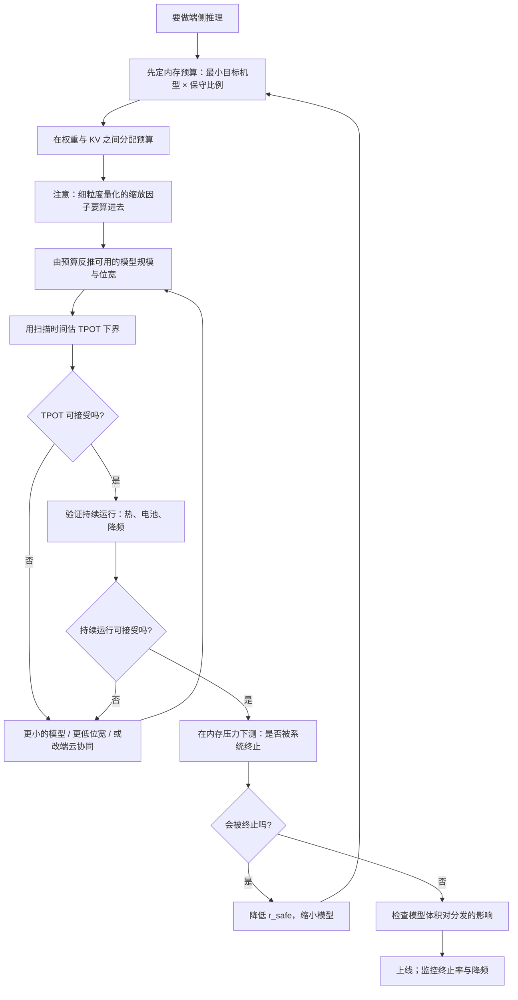

# 边缘推理的约束条件与价值主张

> 位置：[InferenceAtlas](../../INDEX.md) > [模块 10](README.md) > 当前文档
> 信息截至：2026-07-29 ｜ 最后核验：2026-07-29 ｜ 内容版本：v0.1
> 时效性等级：低
> 相关主题：[AI 推理硬件总览](../07_hardware_and_server_architecture/01_ai_inference_hardware_overview.md)｜`02_mobile_npu_soc_and_memory_constraints.md`｜[端云协同](../17_interview_prep/06_hardware_and_datacenter_questions.md)

## 本章导读

端侧推理与云端推理的差异，**不在于技术手段的不同，而在于约束顺序的不同**。

云端的约束顺序通常是：成本 → 时延 → 容量。
**端侧的顺序是：内存容量 → 功耗与热 → 算力 → 存储**。

这个顺序的反转导致很多云端的直觉在端侧失效：
「加一块卡」这个选项不存在；
「增大批」这个杠杆不存在（端侧几乎总是批为 1）；
**而「内存」从一个可以扩的资源变成了一个与整个系统共享的、随时可能被回收的软上限**。

第二个本质差异是**资源不是你独占的**。
云端的实例是你的，端侧的内存、算力、电池
**要与操作系统和其他应用共享**——
用得太多的后果不是变慢，而是**进程被系统终止**，
**这比慢得多要糟糕**。

第三个差异是**成本结构的根本不同**：
端侧的算力由用户设备提供，
**对服务方的边际成本为零**——
这是端侧最大的价值，也是它在成本模型上无法被云端匹敌的地方。

本章给出**四个约束的顺序与各自的物理来源**、
**端侧独有的三个价值**、
**批为 1 这个工作点的全部后果**、
以及**端侧的设计顺序为什么与云端相反**。

**关于数值的说明**：受出口策略限制
（详见 [AGENTS.md 第 11 节](../../AGENTS.md)），
本章不给出任何具体设备的内存容量、带宽、算力或功耗数值。

## 学习目标

读完本章后，读者应能够：

1. 按正确顺序列出端侧的四个约束，并说明每个的物理来源
2. 解释为什么端侧内存是「与系统共享的软上限」而非固定配额
3. 说明批为 1 这个工作点带来的全部后果
4. 列出端侧独有的三个价值，并说明各自的适用场景
5. 说明端侧的设计顺序为什么与云端相反

## 核心结论

- **端侧的约束顺序是内存 > 功耗与热 > 算力 > 存储**，与云端的成本/时延优先完全不同。
- **端侧内存是与操作系统和其他应用共享的软上限**，超用的后果是进程被终止而不是变慢。
- **端侧几乎总是批为 1**，因此永远带宽受限，且失去了「增大批摊薄权重读取」这个云端的核心杠杆。
- **端侧的三个独有价值**：数据不出设备、无网络往返、边际成本为零。
- **「能跑」与「能持续跑」是两件事**：端侧热容极小，降频发生得比服务器快得多。
- **设计顺序与云端相反**：云端先定 SLO 再选硬件，端侧硬件给定，必须从内存预算反推模型。

## 1. 问题定义、系统边界与工作负载

### 1.1 「端侧」涵盖的范围

| 类别 | 特征 | 本模块的覆盖 |
|---|---|---|
| 移动设备 | 内存最紧、功耗预算最小、与系统共享 | 主要对象 |
| 个人电脑 | 内存较宽松、有主动散热 | `04_pc_ai_inference.md` |
| 车载与机器人 | 有实时性与安全要求 | `05_automotive_robotics_and_embedded_inference.md` |
| 嵌入式 | 资源最紧、通常是专用任务 | 同上 |

**四者的共同点是「资源固定且无法扩展」**，
**差异在于资源的绝对量与是否有实时性要求**。

### 1.2 与云端的系统边界差异

```text
云端：                        端侧：
  你控制整台机器                你是系统中的一个应用
  资源是你的                    资源与 OS 和其他应用共享
  可以横向扩展                  不能扩展
  批可以增大                    批恒为 1
  成本由你承担                  算力成本由用户承担
```

**第二行是最本质的差异**，它导致后面三行。

### 1.3 本章不涉及

具体设备平台的能力（见 `03_qualcomm_apple_mediatek_google_samsung_platforms.md`，
**该章受出口策略限制无法完成，见第 5 节说明**）、
具体的压缩技术（见 `07_quantization_distillation_and_pruning_for_edge.md`）。

## 2. 原理、数学与性能模型

### 2.1 四个约束的顺序与来源

**（一）内存容量——第一约束**

模型权重加 KV 必须驻留在设备内存里：

$$
M_{\text{weight}}(b_w) + S_{\max} \cdot m_{\text{tok}}(b_{kv}) + M_{\text{act}} \le M_{\text{budget}}
$$

**而 $M_{\text{budget}}$ 有三个端侧特有的性质**：

1. **它远小于服务器**；
2. **它与操作系统和其他应用共享**——
   **不是一个固定配额，而是一个随系统状态变化的软上限**；
3. **在统一内存架构上，CPU 与加速器共享同一个内存与带宽池**——
   **这意味着你与整个系统争带宽**。

**第二点的后果最严重**：
**超用的结果不是变慢，而是进程被系统终止**。
**从用户角度看，「应用崩溃」比「应用慢」糟糕得多**，
**所以内存预算必须保守**。

**（二）功耗与热——第二约束**

端侧靠电池供电且散热能力有限。三个后果：

| 后果 | 说明 |
|---|---|
| **降频快** | 热容极小，持续负载下很快触发降频 |
| **电池可感知** | 发烫掉电快的功能会被用户关掉 |
| **预算动态变化** | 低电量模式、后台限制会进一步压缩 |

**「能跑」与「能持续跑」是两件事**——
**一个短时演示能跑通的配置，在持续使用下可能完全不可接受**。

**（三）算力——第三约束**

端侧算力远低于服务器，
**但它通常不是第一个撞墙的**——
因为在内存约束下能跑的模型本来就不大。

**（四）存储与分发——第四约束**

模型文件占用设备存储，且要通过网络分发。
**它影响安装包大小与更新成本**——
**这是一个云端完全不存在的产品层面约束**。

### 2.2 批为 1 的全部后果

端侧几乎总是**一个用户、一个请求**，因此批恒为 1。

**后果一：永远带宽受限**。

线性层的算术强度约 $2B/b_w$。$B = 1$ 时它是一个很小的常数，
**远低于任何设备的临界算术强度**。

**所以端侧优化的核心是减少每步要读的字节数**——
**权重量化是最直接有效的手段**。

**后果二：失去了摊薄权重读取的杠杆**。

云端可以靠增大批把权重读取摊薄到多个请求上：

$$
\text{每 token 的权重读取} = \frac{M_{\text{weight}}}{B}
$$

**$B = 1$ 时这个摊薄完全不存在**。

**因此端侧的每 token 能耗天然高于云端的大批场景**——
**端侧的优势不在效率，而在这个成本由用户承担且没有基础设施开销**。

**后果三：TPOT 由扫描时间直接决定**。

$$
\tau_{\text{step}} \ge \frac{M_{\text{weight}} + M_{\text{KV,read}}}{\text{BW}}
$$

**没有批可以摊薄，所以这个下界就是实际的 TPOT 量级**。

**这给出端侧最重要的一个估算**：
**知道模型大小、量化位宽与设备带宽，就能估出 TPOT 的下界**——
而它往往是端侧体验的决定因素。

**后果四：某些云端优化在端侧无效或收益不同**。

| 优化 | 云端 | 端侧 |
|---|---|---|
| 连续批处理 | 核心机制 | **无意义（只有一个请求）** |
| 前缀缓存 | 跨请求复用 | **只能在同一会话内复用** |
| 权重量化 | 小批有效 | **总是有效（且常常是「能否跑」的问题）** |
| 投机解码 | 小批收益大 | **收益大**（算力相对富余） |

**最后一行值得注意**：端侧是带宽受限而算力相对富余的典型场景，
**这正是投机解码收益最大的工作点**。

### 2.3 三个独有价值

| 价值 | 机制 | 什么时候是决定性的 |
|---|---|---|
| **数据不出设备** | 无需上传 | 隐私是硬需求时 |
| **无网络往返** | 本地计算 | 离线可用；**TTFT 不含网络时间** |
| **边际成本为零** | 算力由用户设备提供 | **规模大时成本结构的根本优势** |

**第二项有一个微妙之处**：
端侧没有网络往返，**所以首 token 可能更快**；
**但端侧带宽有限，后续 token 的速度可能不如云端**。

**所以「端侧更快」是不一定的，取决于输出长度**：

$$
T_{\text{e2e}}^{\text{端}} = \text{TTFT}_{\text{local}} + (N-1)\tau_{\text{step}}^{\text{端}}
$$
$$
T_{\text{e2e}}^{\text{云}} = T_{\text{net}} + \text{TTFT}_{\text{cloud}} + (N-1)\tau_{\text{step}}^{\text{云}}
$$

**短输出时端侧的无网络往返占优，长输出时云端更快的 $\tau_{\text{step}}$ 占优**。
**存在一个交叉的输出长度**——
**这个非单调性是端云分流设计的一个实际考虑**
（见 [Q088](../17_interview_prep/06_hardware_and_datacenter_questions.md)）。

**第三项是端侧最不可替代的价值**：
**服务方的边际成本为零**。
这在成本模型上是云端无法匹敌的——
**但代价是把成本转移给了用户的电池与设备资源**。

### 2.4 设计顺序的反转

| 步骤 | 云端 | 端侧 |
|---|---|---|
| 1 | 定 SLO | **定内存预算**（保守取值） |
| 2 | 选硬件 | 硬件已给定 |
| 3 | 算容量 | **由预算反推模型规模与量化方案** |
| 4 | 优化 | 检查 TPOT 是否可接受（用扫描时间估） |
| 5 | — | **检查持续运行的热与电池** |
| 6 | — | **检查模型体积对分发的影响** |

**关键差异是第 1–3 步**：
**云端从需求出发选硬件，端侧硬件固定必须从资源出发反推需求**。

**因此端侧的第一个动作是确定内存预算，而不是确定质量目标**——
**这与云端的思维方式恰好相反，也是云端背景的工程师最容易搞错的地方**。

## 3. 实现机制与系统设计

### 3.1 内存预算的确定

$$
M_{\text{budget}} = M_{\text{device,available}} \times r_{\text{safe}}
$$

**$r_{\text{safe}}$ 必须保守**，理由：

1. **其他应用也需要内存**；
2. **系统在内存压力下会终止你的进程**；
3. **应当按最差情况取值**：
   目标机型中内存最小的那一款，且有其他应用在运行时。

**「被系统杀掉是最差的用户体验」**——
比慢得多更糟，因为它意味着功能完全不可用且状态丢失。

**因此保守取值的代价（模型更小）远低于激进取值的风险**。

### 3.2 预算在权重与 KV 之间的分配

$$
M_{\text{budget}} \ge M_{\text{weight}}(b_w) + S_{\max}\cdot m_{\text{tok}}(b_{kv}) + M_{\text{act}}
$$

**这是一个直接的取舍**：
**权重位宽降低省出的空间可以用于更长的上下文，反之亦然**。

**因此「支持多长的上下文」与「用多少位宽」是同一个决策的两面**，
必须一起决定（详见 [Q087](../17_interview_prep/06_hardware_and_datacenter_questions.md)）。

**一个容易被忽略的细节**：
细粒度量化的缩放因子要额外存储，
**有效位宽是 $b_w + b_s/g$ 而非标称的 $b_w$**——
**在内存是硬约束的端侧，这个开销必须被算进预算**。

### 3.3 持续运行的验证

**短时测试会系统性高估端侧性能**，因为：

1. **热容小，降频发生得快**；
2. **电池状态会影响功耗预算**；
3. **系统的内存压力随使用时间累积**。

**因此验证必须包含**：

| 验证 | 内容 |
|---|---|
| 持续运行 | 跑足够长时间，观察频率与温度 |
| 电池消耗 | 单位时间的电量消耗 |
| 内存压力下的行为 | 有其他应用运行时是否被终止 |
| 冷启动 | 首次加载的等待时间 |

**第三项最容易被遗漏**：
**在干净的测试设备上不会触发的问题，在真实用户的设备上很常见**。

### 3.4 模型加载与分发

**两个端侧特有的工程问题**：

**（一）加载时间是可感知的等待**。
首次启动要把权重读进内存。
缓解手段：内存映射（按需分页）、
**把加载与用户的其他等待重叠**。

**注意内存映射会让「已占用内存」的统计变模糊**，
**但它不改变实际的内存压力**——
系统仍然可能在压力下回收这些页。

**（二）多个模型共存**。
如果设备上有多个使用模型的功能，
**它们争同一份内存预算**，
需要应用层的协调（按需加载卸载），
**而卸载再加载的代价就是上面的加载时间**。

### 3.5 端侧的可观测性

端侧无法像云端那样持续采集详细指标
（隐私、流量、电量成本），**因此监控必须极度精简**：

| 指标 | 为什么 |
|---|---|
| 首 token 时延与 TPOT | 体验的直接量 |
| 加载时间 | 首次使用的等待 |
| **进程被终止的次数** | **最严重的失败模式** |
| 降频/热限制的发生 | 持续运行的可用性 |
| 模型加载失败率 | 存储或完整性问题 |

**第三行是端侧特有且最重要的**：
**它直接对应「功能不可用」**。

**采集必须遵守隐私边界**：
**只上报聚合的技术指标，不上报任何请求内容**。

## 4. 性能、成本、能耗与可靠性 trade-off

### 4.1 三方竞争

端侧的核心权衡是三方的：

$$
\text{模型质量} \quad\leftrightarrow\quad \text{内存占用} \quad\leftrightarrow\quad \text{电池与热}
$$

**没有「加一块卡」这个出口**，
**所以三者只能在固定的预算内互相交换**。

| 想改善 | 代价 |
|---|---|
| 质量 | 更大的模型 → 更多内存 + 更高功耗 |
| 内存 | 更激进的量化或更小的模型 → 质量 |
| 电池 | 更小的模型或更低的频率 → 质量或速度 |

### 4.2 端侧与云端的成本结构对比

| 维度 | 端侧 | 云端 |
|---|---|---|
| 服务方的边际成本 | **零** | 按 token |
| 服务方的固定成本 | 模型分发与维护 | 基础设施 |
| **用户承担的成本** | **电池、内存、存储** | 无 |
| 每 token 的能耗效率 | **差**（批为 1） | 好（可大批） |

**第三行是端侧成本优势的真实来源**：
**它不是更高效，而是成本被转移了**。

**这个转移有一个隐含的限制**：
**如果端侧推理让用户的设备发烫、掉电快、卡顿，
用户会关掉这个功能**——
**所以「用户承担的成本」有一个可接受的上界**，
而这个上界是产品设计必须尊重的。

### 4.3 与云端的质量差距

在内存约束下，端侧能跑的模型规模远小于云端。
**因此端侧的质量通常低于云端**。

**处理方式有三种**：

| 方式 | 说明 |
|---|---|
| 接受差距 | 端侧只做质量要求不高的任务 |
| **端云协同** | 简单任务端侧、复杂任务云端（见 [Q088](../17_interview_prep/06_hardware_and_datacenter_questions.md)） |
| 任务特化 | 用针对特定任务优化的小模型缩小差距 |

**第三种在窄任务上有效**：
一个针对特定任务微调的小模型，
**在该任务上可能接近甚至超过通用大模型**——
**代价是它只在这个任务上有效**。

## 5. benchmark、真实案例或公开部署案例

**本章不给出任何具体设备的内存、带宽、算力或功耗数值**。

受当前环境的网络出口策略限制（详见 [AGENTS.md 第 11 节](../../AGENTS.md)），
本库无法访问任何设备厂商的规格文档，
**因此无法核验任何一项**。

**关于本模块第 3 章的说明**：
模块规划中的 `03_qualcomm_apple_mediatek_google_samsung_platforms.md`
是一篇**厂商平台能力对比**，
**它的内容本体就是需要外部核验的产品规格**。
**在无法访问厂商文档的情况下，写这一章只能靠编造**，
**而这是本库明确禁止的**。
**因此该章在网络策略放开之前不会被撰写**——
这是一个明确的、有理由的缺口，而不是遗漏。

**读者应自行填充的端侧画像**：

| 项 | 你的值 | 来源 |
|---|---|---|
| 目标机型中最小的设备内存 | 待填 | 厂商文档，`官方披露` |
| 安全预算比例 $r_{\text{safe}}$ | 待填 | 由内存压力测试确定 |
| 由预算算出的可用模型规模（给定位宽） | 待填 | 计算 |
| 设备内存带宽 | 待填 | 厂商文档，`官方披露` |
| 由扫描时间估的 TPOT 下界 | 待填 | 计算 |
| **实测 TPOT（持续运行下）** | 待填 | **`独立可复现实验`** |
| 持续运行时的降频情况 | 待填 | `独立可复现实验` |
| 单位时间电量消耗 | 待填 | `独立可复现实验` |
| **有其他应用运行时的进程终止率** | 待填 | **最重要的可靠性指标** |
| 模型加载时间 | 待填 | `独立可复现实验` |
| 模型文件体积与其对安装包的影响 | 待填 | — |

**倒数第三行是本表最关键的一项**：
**它直接对应「功能是否可用」，而它只有在真实的内存压力下才能测出来**。

> 实验方法论要求见 [如何读推理 benchmark](../00_start_here/03_how_to_read_inference_benchmarks.md)。

## 6. 设计决策框架



**图解读**：

1. **本图展示什么**：端侧的设计流程。
   **起点是内存预算而不是质量目标**——
   这是与云端最大的差异。
2. **核心瓶颈**：瓶颈在 K 节点「在内存压力下测是否被终止」。
   **这一步最常被跳过**，
   因为在干净的测试设备上不会触发；
   **而它对应的是最严重的失败模式——功能完全不可用**。
3. **图中的 trade-off**：G 与 J 两个检查失败时都回到「缩小模型」，
   **而这直接损失质量**。
   **端侧的三方竞争（质量、内存、电池）在这两个回环里体现得最直接**。
4. **面试如何引用**：可以说
   「端侧我会从内存预算开始反推模型，
   **而不是像云端那样先定 SLO 再选硬件**；
   验证必须包含持续运行与内存压力下的行为——
   **被系统终止比慢糟糕得多**」。

## 7. 常见失败模式与排查路径

| 症状 | 根因 | 修正 |
|---|---|---|
| 演示能跑但用户反馈崩溃 | 未在内存压力下测试 | 降低 $r_{\text{safe}}$；真实场景测试 |
| 短时快但用久了变慢 | 热容小，降频快 | 跑到热稳态测；降低工作强度 |
| 内存估算与实际不符 | 忽略了量化缩放因子的开销 | 按有效位宽 $b_w + b_s/g$ 算 |
| 首次使用等待很久 | 模型加载时间 | 内存映射；与其他等待重叠 |
| 用户关掉了这个功能 | 发烫或掉电快 | 降低持续负载；提供开关 |
| 多个功能互相挤占内存 | 无应用层协调 | 按需加载卸载 |
| 云端的优化搬过来没效果 | 端侧批为 1，机制不同 | 按端侧工作点重新评估 |
| 长输出时端侧比云端慢 | 端侧 $\tau_{\text{step}}$ 更大 | 按输出长度分流（端云协同） |

**排查顺序**：**先确认内存预算是否保守，再看持续运行，最后看具体性能**。

## 8. 关联面试主题

1. 端侧约束顺序与云端的差异——见 [Q086](../17_interview_prep/06_hardware_and_datacenter_questions.md)
2. 端侧的内存与量化策略——见 [Q087](../17_interview_prep/06_hardware_and_datacenter_questions.md)
3. 端云协同的判据与失败路径——见 [Q088](../17_interview_prep/06_hardware_and_datacenter_questions.md)
4. 临界批大小与带宽受限——见 [Q045](../17_interview_prep/04_compiler_kernel_and_quantization_questions.md)
5. 量化的三个维度——见 [Q050](../17_interview_prep/04_compiler_kernel_and_quantization_questions.md)

## 9. 小结

端侧与云端的差异不在技术手段，**而在约束的顺序**：
**内存容量 > 功耗与热 > 算力 > 存储**。

**四条核心结论**：

**第一，端侧内存是与系统共享的软上限而非固定配额**。
超用的后果不是变慢，**而是进程被系统终止**——
**从用户角度看这比慢糟糕得多**，
所以预算必须按最差情况（最小机型 + 有其他应用运行）保守取值。

**第二，批恒为 1 带来四个后果**：
永远带宽受限、失去摊薄权重读取的杠杆、
TPOT 由扫描时间直接决定、
以及部分云端优化失效（连续批处理）而另一些收益更大（投机解码）。
**「知道模型大小、位宽与设备带宽就能估出 TPOT 下界」
是端侧最有用的一个估算**。

**第三，端侧的三个独有价值是数据不出设备、无网络往返、边际成本为零**。
**其中第二项有一个非单调性**：
端侧首 token 可能更快（无网络往返）但后续 token 可能更慢（带宽有限），
**所以存在一个交叉的输出长度**——这是端云分流设计的实际考虑。
**第三项是端侧最不可替代的价值，但它的本质是成本被转移给了用户**，
**而用户承担的成本有一个可接受的上界**。

**第四，设计顺序与云端相反**。
云端先定 SLO 再选硬件，
**端侧硬件给定，必须从内存预算反推模型规模与量化方案**。
**这是云端背景的工程师最容易搞错的地方**。

一条验证上的关键要求：**必须在真实的内存压力下测试**。
在干净的测试设备上不会触发的终止问题，
**在有其他应用运行的真实设备上很常见**——
而它对应的是最严重的失败模式。

**关于本模块第 3 章**：厂商平台能力对比因出口策略无法核验而不会被撰写
（详见第 5 节）——**这是一个有明确理由的缺口而非遗漏**。

## 关键术语

| 中文术语 | 英文 | 定义 | 单位/口径 | 关联文档 |
|---|---|---|---|---|
| 内存预算 | memory budget | 应用可安全使用的设备内存上限 | 字节 | 本章 3.1 |
| 安全比例 | safety ratio | 预算占可用内存的保守比例 | 无量纲 | 本章 3.1 |
| 统一内存 | unified memory | CPU 与加速器共享同一内存与带宽池 | — | 本章 2.1 |
| 有效位宽 | effective bit width | 含量化缩放因子开销的实际位宽 | 位 | 本章 3.2 |
| 进程终止 | process termination | 系统在内存压力下杀死应用 | 次/时段 | 本章 3.5 |

## 延伸阅读

- [AI 推理硬件总览](../07_hardware_and_server_architecture/01_ai_inference_hardware_overview.md)
- [内存带宽与算术强度](../01_foundations_and_metrics/05_memory_bandwidth_and_arithmetic_intensity.md)
- [KV cache 容量与内存模型](../02_transformer_and_kv_cache/05_kv_cache_capacity_and_memory_models.md)
- [量化 kernel](../04_compilers_runtimes_and_kernels/09_quantization_kernels.md)
- [面试题组：硬件、HBM、数据中心与 edge](../17_interview_prep/06_hardware_and_datacenter_questions.md)

## 主要来源

本章由 [模块 01 第 5 章](../01_foundations_and_metrics/05_memory_bandwidth_and_arithmetic_intensity.md) 的算术强度模型、
[模块 02 第 5 章](../02_transformer_and_kv_cache/05_kv_cache_capacity_and_memory_models.md) 的 KV 容量模型、
以及 [模块 07 第 1 章](../07_hardware_and_server_architecture/01_ai_inference_hardware_overview.md) 的四轴框架推导而成。

**不含任何需要外部核验的设备规格数值**。
受当前环境的网络出口策略限制，本库无法访问设备厂商文档
（详见 [AGENTS.md 第 11 节](../../AGENTS.md)）。
**本模块第 3 章（厂商平台对比）因同样原因不会被撰写**，见第 5 节。

| 类别 | 说明 | 披露标签 |
|---|---|---|
| 四个约束的顺序、批为 1 的后果、扫描时间下界 | 由模块 01、02、07 推导 | — |
| 端云时延的非单调性 | 由时延分解推导 | — |
| 读者自行填充的端侧画像 | 应查厂商文档与自行实测 | `官方披露` / `独立可复现实验` |
| 任何具体设备的内存、带宽、算力与功耗 | **本章未给出** | `待核实` |

## 更新记录

| 日期 | 版本 | 变更 | 核验人 |
|---|---|---|---|
| 2026-07-29 | v0.1 | 初稿：四个约束的顺序、批为 1 的四个后果、三个独有价值、设计顺序的反转 | — |
