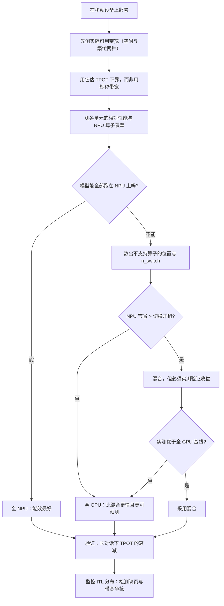

# 移动 SoC、NPU 与内存约束

> 位置：[InferenceAtlas](../../INDEX.md) > [模块 10](README.md) > 当前文档
> 信息截至：2026-07-29 ｜ 最后核验：2026-07-29 ｜ 内容版本：v0.1
> 时效性等级：低
> 相关主题：[边缘推理总览](01_edge_inference_overview.md)｜[AI PC 的推理路径](04_pc_ai_inference.md)｜[AI 推理硬件总览](../07_hardware_and_server_architecture/01_ai_inference_hardware_overview.md)

## 本章导读

移动 SoC 与服务器加速器最本质的结构差异是**统一内存**：
CPU、GPU、NPU 共享同一块物理内存与同一条内存带宽。

这一个结构差异带来三个后果，它们构成了本章的主线：

**第一，你与整个系统争带宽**。
服务器上的显存带宽是你独占的，
**而移动设备上，系统 UI、其他应用、以及你自己的前后处理都在消耗同一条带宽**。
**所以「标称带宽」与「你实际能拿到的带宽」之间有一个不可忽略且随系统状态变化的折扣**。

**第二，「零拷贝」是真的，但它不等于免费**。
统一内存下 CPU 与加速器之间不需要显式传输，
**但内存本身的读写仍然消耗同一条带宽**——
**省掉的是拷贝，不是访存**。

**第三，NPU 与 GPU 的选择不只是性能问题**。
NPU 通常能效更好但灵活性更差
（算子覆盖有限、精度支持受限、动态形状支持弱），
**而 LLM 推理恰好有大量动态形状与非标准算子**。
**因此「设备上有 NPU」不等于「你的模型能跑在 NPU 上」**。

本章给出**统一内存的三个后果与定量影响**、
**NPU/GPU/CPU 三者的分工判据**、
**移动内存层次与它对 KV 访问的影响**、
以及**如何在无法核验厂商规格的情况下用实测建立自己的性能模型**。

**关于数值的说明**：受出口策略限制
（详见 [AGENTS.md 第 11 节](../../AGENTS.md)），
本章不给出任何具体 SoC 的规格数值。
**本章给出的是结构关系与实测方法**——
读者应当用这些方法在自己的目标设备上建立性能模型。

## 学习目标

读完本章后，读者应能够：

1. 说明统一内存架构的三个后果，并解释「零拷贝不等于免费」
2. 估算实际可用带宽与标称带宽的差距，并说明它为什么随系统状态变化
3. 给出 NPU、GPU、CPU 三者的分工判据，并说明为什么有 NPU 不等于能用 NPU
4. 说明移动内存层次对 KV 访问的影响
5. 设计一组实测来建立目标设备的性能模型，而不依赖厂商规格

## 核心结论

- **统一内存意味着与整个系统争带宽**，因此实际可用带宽显著低于标称且随系统状态变化。
- **零拷贝省掉的是拷贝，不是访存**：内存读写仍然消耗同一条带宽。
- **有 NPU 不等于能用 NPU**：LLM 推理有大量动态形状与非标准算子，而 NPU 的算子覆盖与形状灵活性通常有限。
- **回退到 CPU/GPU 的代价可能超过 NPU 的收益**：一个部分算子回退的模型可能比全部跑在 GPU 上更慢。
- **TPOT 的下界由实际可用带宽而非标称带宽决定**，因此必须实测。
- **在无法核验厂商规格时，正确的做法是用实测建立自己的模型**，而不是引用不可靠的数字。

## 1. 问题定义、系统边界与工作负载

### 1.1 移动 SoC 的结构

```text
        ┌─────────────────────────────────────┐
        │  CPU 集群   GPU   NPU   ISP  其他   │
        └───┬─────────┬─────┬─────┬──────┬────┘
            └─────────┴──┬──┴─────┴──────┘
                         │  ← 共享的内存控制器与带宽
                  ┌──────┴──────┐
                  │  统一内存    │  ← 与 OS 和全部应用共享
                  └─────────────┘
```

**与服务器的对比**：

| 维度 | 服务器加速器 | 移动 SoC |
|---|---|---|
| 内存 | 独立显存 | **统一，与 CPU 共享** |
| 带宽 | 独占 | **与整个系统共享** |
| 主机-设备传输 | 显式，经链路 | **无需传输（零拷贝）** |
| 计算单元 | 通用（GPU） | **异构（CPU/GPU/NPU）** |

**第二行与第四行是本章的两条主线**。

### 1.2 本章不涉及

具体厂商平台的能力对比
（原计划的 `03_qualcomm_apple_mediatek_google_samsung_platforms.md`
**因内容本体是需核验的厂商规格、在出口策略下无法撰写**，
见 [第 1 章](01_edge_inference_overview.md) 第 5 节）、
具体的压缩技术（见 `07_quantization_distillation_and_pruning_for_edge.md`）。

## 2. 原理、数学与性能模型

### 2.1 统一内存的三个后果

**（一）带宽是共享的**

设标称内存带宽为 $\text{BW}_{\text{nominal}}$，
你的应用实际能拿到的为

$$
\text{BW}_{\text{effective}} = \text{BW}_{\text{nominal}} \times \beta_{\text{share}} \times \beta_{\text{eff}}
$$

其中：

- **$\beta_{\text{share}} < 1$** 是与系统其他部分共享的折扣——
  **它随系统状态变化**（有无其他应用在跑、UI 是否在动画）；
- **$\beta_{\text{eff}} < 1$** 是访存效率折扣（与服务器上的含义相同）。

**关键差异在 $\beta_{\text{share}}$**：
**服务器上它接近 1（独占），移动设备上它显著小于 1 且不稳定**。

**这直接影响 TPOT 的下界**：

$$
\tau_{\text{step}} \ge \frac{M_{\text{weight}} + M_{\text{KV,read}}}{\text{BW}_{\text{effective}}}
$$

**用标称带宽估会系统性乐观**，
**而且乐观的幅度随系统繁忙程度变化**——
**这解释了「同一个模型在同一台设备上时快时慢」这一常见现象**。

**（二）零拷贝省掉的是拷贝，不是访存**

统一内存下 CPU 与加速器可以访问同一块内存，
**不需要显式的传输**。这确实省掉了服务器上的主机-设备拷贝。

**但要注意**：

| 省掉了 | 没省掉 |
|---|---|
| 显式拷贝的传输时间 | **内存本身的读写带宽** |
| 双份内存占用 | 缓存一致性开销 |

**所以「统一内存所以没有传输开销」这个说法只对了一半**：
**数据仍然要被读出来送进计算单元，这仍然占带宽**。

**在带宽已经是瓶颈的端侧，这一点尤其重要**——
零拷贝不改变「decode 受带宽限制」这个根本事实。

**（三）内存压力是系统级的**

见 [第 1 章](01_edge_inference_overview.md) 3.1。
统一内存意味着**你占用的内存直接减少了系统其他部分可用的量**，
**因此内存压力的反馈更直接、更快**。

### 2.2 异构计算单元的分工

| 单元 | 相对能效 | 灵活性 | 典型限制 |
|---|---|---|---|
| CPU | 最低 | **最高** | 算力最低 |
| GPU | 中 | 高 | 功耗高于 NPU |
| **NPU** | **最高** | **最低** | **算子覆盖、精度支持、动态形状** |

**「有 NPU 不等于能用 NPU」的三个原因**：

**（一）算子覆盖**。
NPU 通常为特定的算子集合优化，
**而 LLM 有一些非标准算子**
（特定的归一化、位置编码变体、注意力变体、采样）。
**不被覆盖的算子必须回退到 CPU 或 GPU**。

**（二）动态形状**。
NPU 通常偏好固定形状，
**而 LLM 推理的序列长度每步都在变**（KV 长度递增）。
**这与 [模块 04 第 2 章](../04_compilers_runtimes_and_kernels/02_graph_compilers_and_ir.md)
讨论的编译器动态形状问题同源**，
**但在 NPU 上约束通常更硬**。

**（三）精度支持**。
NPU 的低精度支持可能与你需要的量化方案不匹配
（位宽、粒度、是否支持非对称）。

### 2.3 回退的代价

**这是本章最重要的一个定量结论**。

设模型的一部分（占比 $f$）能跑在 NPU 上、其余回退到 GPU。
**朴素的期望是加速比按 Amdahl 计算**，
**但实际上还有一项额外开销：切换**。

每次在 NPU 与 GPU 之间切换，需要：
同步、可能的数据布局转换、以及调度开销。
设单次切换开销为 $\epsilon_{\text{switch}}$、切换次数为 $n_{\text{switch}}$：

$$
T_{\text{hybrid}} = f \cdot \frac{T_{\text{GPU}}}{s_{\text{NPU}}} + (1-f)\cdot T_{\text{GPU}} + n_{\text{switch}} \cdot \epsilon_{\text{switch}}
$$

其中 $s_{\text{NPU}}$ 是 NPU 相对 GPU 的加速比。

**关键观察：$n_{\text{switch}}$ 可能很大**。
如果不被支持的算子**分散在网络各层之间**（而不是集中在开头或结尾），
**每一层都要切换一次或多次**——
**于是 $n_{\text{switch}}$ 与层数同阶**。

**由此得到一个实用判据**：

$$
\text{混合方案值得} \iff f\left(1 - \frac{1}{s_{\text{NPU}}}\right) T_{\text{GPU}} > n_{\text{switch}}\cdot\epsilon_{\text{switch}}
$$

**左边是 NPU 带来的节省，右边是切换的代价**。

**当不支持的算子分散时，右边可能超过左边**——
**此时「全部跑在 GPU 上」比「混合」更快**。

**这解释了一个常见的困惑**：
为什么启用 NPU 后性能反而下降。
**答案通常不是 NPU 慢，而是切换太频繁**。

### 2.4 移动内存层次与 KV 访问

移动 SoC 的缓存层次比服务器浅，
**且缓存容量相对模型与 KV 的规模极小**。

**对 decode 的影响**：

| 数据 | 每步访问 | 缓存友好性 |
|---|---|---|
| 权重 | **全部读一遍** | 差（远大于缓存） |
| KV | **全部读一遍**（该请求的） | 差（随上下文增长） |
| 激活 | 小 | 好 |

**权重与 KV 都远大于缓存，因此每步都要从主存读**——
**这就是端侧 decode 受带宽限制的直接原因**。

**一个端侧特有的考虑**：
由于批为 1，**KV 的读取无法被多个请求摊薄**，
**所以随着上下文增长，KV 读取在单步中的占比会持续上升**：

$$
\frac{M_{\text{KV,read}}}{M_{\text{weight}} + M_{\text{KV,read}}} = \frac{S\cdot m_{\text{tok}}}{M_{\text{weight}} + S\cdot m_{\text{tok}}}
$$

**当 $S \cdot m_{\text{tok}}$ 接近 $M_{\text{weight}}$ 时，KV 读取占了单步的一半**。

**这给出一个端侧特有的判断**：
**长上下文在端侧不仅是内存容量问题，还是持续的带宽问题**——
**TPOT 会随对话进行而逐渐变慢**，
而这是用户可感知的。

**因此端侧的 KV 量化不只省容量，还直接改善长对话的 TPOT**。

## 3. 实现机制与系统设计

### 3.1 用实测建立性能模型

**在无法核验厂商规格时，正确的做法是自己测**。

**四个必测的量**：

| 量 | 怎么测 | 用途 |
|---|---|---|
| **实际可用带宽** | 大块内存的顺序读写吞吐 | TPOT 下界的分母 |
| 带宽随系统负载的变化 | 在有/无其他应用时分别测 | $\beta_{\text{share}}$ 的范围 |
| 各计算单元的相对性能 | 同一算子在 CPU/GPU/NPU 上计时 | 分工决策 |
| **算子覆盖情况** | 逐算子尝试在 NPU 上执行 | 判断回退点 |

**第一项的测法**：
用一个远大于缓存的连续内存块做读取，
**测得的吞吐就是你实际能拿到的带宽**。
**这个数比任何标称值都更有用**，因为它已经包含了两个折扣。

**第四项最关键也最费时**：
**必须知道哪些算子会回退，以及它们在网络中的位置**——
**位置决定了 $n_{\text{switch}}$**。

### 3.2 分工决策流程

```text
1. 测出各单元的相对性能与算子覆盖
2. 确定不被 NPU 支持的算子及其位置
3. 数出 n_switch（若全用 NPU 能跑的部分）
4. 用 2.3 的判据判断混合是否值得
5. 若不值得 → 全部跑在 GPU（或 CPU）
   若值得 → 混合，但要验证实际收益
6. 实测验证：混合方案 vs 单一单元方案
```

**第 5 步的「若不值得就全部跑在 GPU」是一个应当被认真考虑的选项**，
**而它常常被「设备有 NPU 就该用」的直觉排除**。

**第 6 步不可省略**：
切换开销难以精确估计，**必须实测对比**。

### 3.3 减少切换的两个方向

若确定用混合方案：

| 方向 | 做法 | 效果 |
|---|---|---|
| **改模型** | 用 NPU 支持的算子替代不支持的 | **从根本上减少 $n_{\text{switch}}$** |
| 改划分 | 把连续的可支持段合并执行 | 减少切换但受算子位置限制 |

**第一项的价值最大但需要在训练阶段介入**——
**这意味着「端侧部署」应当在模型设计阶段就被考虑**，
而不是训练完再想办法。

**这是端侧与云端的又一个差异**：
云端可以用编译器与 kernel 适配几乎任何模型结构，
**端侧的硬件约束更硬，因此模型结构需要向硬件妥协**。

### 3.4 内存带宽的争抢管理

由于带宽与系统共享，**你的推理会影响系统的流畅度**，
**反过来系统的活动也会影响你的 TPOT**。

**三个实用做法**：

1. **避免与 UI 动画等高带宽活动重叠**——
   例如在动画期间降低生成速度或暂停；
2. **提供可中断的生成**——
   用户切换到其他应用时应当能暂停而不是继续消耗带宽；
3. **监控实际达到的 TPOT 分布而非平均值**——
   **带宽争抢表现为 TPOT 的方差而非均值上升**。

**第三点很重要**：
**如果只看平均 TPOT，带宽争抢的影响会被掩盖**，
**而用户感知到的是卡顿（即方差）**。

### 3.5 与统一内存相关的一个陷阱

**内存映射与实际驻留的区别**。

使用内存映射加载权重时，
**「已映射」不等于「已驻留在物理内存」**。
系统可能在压力下回收这些页，
**导致下次访问时发生缺页，产生一次可感知的停顿**。

**对生成过程的影响**：
**如果权重页在生成过程中被回收，会出现单个 token 的异常延迟**——
表现为 ITL 序列中的尖峰。

**缓解**：
在关键路径上使用能防止被回收的分配方式（若平台支持），
**或者接受并监控这类尖峰**。

**这与 [模块 11 第 3 章](../11_benchmarking_reliability_and_observability/03_ttft_tpot_itl_and_end_to_end_latency.md)
关于 ITL 异常间隔的讨论一致**：
**平均值掩盖了这类问题，必须看 ITL 的分布**。

## 4. 性能、成本、能耗与可靠性 trade-off

### 4.1 NPU 的能效优势与灵活性代价

| 选择 | 能效 | 风险 |
|---|---|---|
| 全 GPU | 中 | 低（灵活、可预测） |
| 全 NPU（若可行） | **最好** | 低（若真的全部支持） |
| **混合** | 取决于切换开销 | **高（可能比全 GPU 还慢）** |

**混合方案的风险最高**，
**因为它的收益依赖一个难以事先精确估计的量（切换开销）**。

**因此推荐的顺序是**：
先测全 GPU 作为基线 → 测是否能全 NPU →
**只有在两者都不满足时才考虑混合，且必须实测验证**。

### 4.2 电池与带宽的联动

内存访问本身消耗能量。
**在带宽受限的端侧 decode 中，能耗很大一部分来自内存访问而非计算**。

**因此减少字节搬运的优化（量化、更小的模型）
同时改善速度与电池**——
**这两个目标在端侧是一致的，而不是冲突的**。

**这与云端不同**：云端在算力受限时，
**减少访存不一定改善速度**。

### 4.3 长对话的性能衰减

由 2.4，KV 读取占比随上下文增长而上升，
**因此 TPOT 会随对话进行而变慢**。

**这是一个用户可感知的体验问题**，处理方式：

| 手段 | 效果 | 代价 |
|---|---|---|
| KV 量化 | 直接减少 $m_{\text{tok}}$ | 精度（且误差累积） |
| 滑动窗口 | 上限住 $S$ | **功能限制：超出窗口的内容不可见** |
| 定期摘要 | 压缩历史 | 额外计算；信息损失 |

**第二项必须让产品层知晓**——
**它是一个功能上的限制而不只是性能优化**。

## 5. benchmark、真实案例或公开部署案例

**本章不给出任何具体 SoC 的规格数值**。

受当前环境的网络出口策略限制（详见 [AGENTS.md 第 11 节](../../AGENTS.md)），
本库无法访问任何 SoC 厂商的技术文档，
**因此无法核验任何一项规格**。

**本章的立场是：在这种情况下，正确的做法不是引用不可靠的数字，
而是给出实测方法让读者自己建立模型**。

**读者应自行实测的性能画像**：

| 项 | 你的值 | 测法 |
|---|---|---|
| **实际可用内存带宽（空闲时）** | 待填 | 大块连续内存的读吞吐 |
| **实际可用内存带宽（有其他应用时）** | 待填 | 同上，制造系统负载 |
| 两者之比（即 $\beta_{\text{share}}$ 的范围） | 待填 | 计算 |
| 同一算子在 CPU/GPU/NPU 上的耗时 | 待填 | 逐单元计时 |
| **不被 NPU 支持的算子及其在网络中的位置** | 待填 | **逐算子尝试；决定 $n_{\text{switch}}$** |
| 单次 NPU↔GPU 切换的开销 | 待填 | 构造对比实验 |
| 全 GPU 方案的 TPOT | 待填 | **基线** |
| 混合方案的 TPOT | 待填 | 与基线对比 |
| TPOT 随上下文长度的变化曲线 | 待填 | 长对话下测 |
| ITL 的分布（尤其尖峰） | 待填 | 检测缺页与带宽争抢 |

**倒数第四行与倒数第三行的对比是本表最关键的一组**：
**它直接回答「用 NPU 到底值不值」这个问题**，
**而这个答案不能从规格表推断，只能实测**。

> 实验方法论要求见 [如何读推理 benchmark](../00_start_here/03_how_to_read_inference_benchmarks.md)。

## 6. 设计决策框架



**图解读**：

1. **本图展示什么**：移动端的部署决策流。
   **起点是实测带宽而不是查规格**——
   这是本章的核心方法论主张。
2. **核心瓶颈**：瓶颈在 H 节点。
   **「NPU 的节省是否超过切换开销」这个判断最容易被跳过**——
   而「设备有 NPU 就该用」的直觉会直接跳到混合方案，
   **结果可能比全 GPU 还慢**。
3. **图中的 trade-off**：I 分支（全 GPU）放弃了 NPU 的能效优势，
   **换来的是更快且更可预测的性能**。
   **在切换频繁时这是正确的交换**。
4. **面试如何引用**：可以说
   「移动端我会先实测实际可用带宽——
   **因为统一内存下它与系统共享，显著低于标称**；
   然后看 NPU 的算子覆盖，
   **如果不支持的算子分散在各层，切换开销可能超过 NPU 的收益**」。

**M→N 的验证不可省略**：
长对话的 TPOT 衰减与 ITL 尖峰
**都是短时测试发现不了的端侧特有问题**。

## 7. 常见失败模式与排查路径

| 症状 | 根因 | 修正 |
|---|---|---|
| 实际 TPOT 远高于按标称带宽的估算 | 用了标称而非实际可用带宽 | 实测带宽 |
| 同一设备上时快时慢 | 带宽与系统共享，$\beta_{\text{share}}$ 变化 | 看 TPOT 分布而非均值 |
| 启用 NPU 后反而变慢 | 切换开销超过收益 | 数 $n_{\text{switch}}$；考虑全 GPU |
| 对话越长越慢 | KV 读取占比随上下文上升 | KV 量化；滑动窗口 |
| ITL 出现孤立尖峰 | 内存映射的页被回收导致缺页 | 检查分配方式；监控 ITL 分布 |
| 认为零拷贝消除了传输开销 | 混淆了拷贝与访存 | 访存仍占带宽 |
| 模型改结构后 NPU 覆盖变差 | 新算子不被支持 | 端侧约束应在模型设计阶段介入 |
| 推理时系统 UI 卡顿 | 争抢内存带宽 | 避免与高带宽活动重叠；可中断 |

**排查顺序**：**先确认用的是实测带宽还是标称带宽，
再看是否有 NPU 切换，最后看 ITL 分布**。

## 8. 关联面试主题

1. 端侧的约束顺序与云端的差异——见 [Q086](../17_interview_prep/06_hardware_and_datacenter_questions.md)
2. 端侧的内存与量化策略——见 [Q087](../17_interview_prep/06_hardware_and_datacenter_questions.md)
3. 四轴硬件评估——见 [Q077](../17_interview_prep/06_hardware_and_datacenter_questions.md)
4. 临界批大小与带宽受限——见 [Q045](../17_interview_prep/04_compiler_kernel_and_quantization_questions.md)
5. 动态形状与编译的矛盾——见 [Q057](../17_interview_prep/04_compiler_kernel_and_quantization_questions.md)

## 9. 小结

移动 SoC 与服务器加速器最本质的结构差异是**统一内存**，
它带来三个后果：

**第一，你与整个系统争带宽**。
实际可用带宽是标称值乘两个折扣，
**其中共享折扣显著小于 1 且随系统状态变化**——
**这解释了「同一设备上时快时慢」，
也意味着 TPOT 的下界必须用实测带宽而非标称带宽估算**。

**第二，零拷贝省掉的是拷贝，不是访存**。
数据仍然要被读进计算单元，仍然占同一条带宽。
**在带宽已经是瓶颈的端侧，这一点决定了统一内存并不改变「decode 受带宽限制」这个事实**。

**第三，有 NPU 不等于能用 NPU**。
LLM 有大量动态形状与非标准算子，
**而 NPU 的算子覆盖、形状灵活性与精度支持通常有限**。
**更关键的是回退的代价**：
如果不被支持的算子分散在各层之间，
**切换次数与层数同阶，切换开销可能超过 NPU 的全部收益**——
**此时全部跑在 GPU 上反而更快且更可预测**。
**「启用 NPU 后性能反而下降」的答案通常不是 NPU 慢，而是切换太频繁**。

**一个端侧特有的性能现象**：
由于批为 1，KV 读取无法被摊薄，
**所以 KV 在单步访存中的占比随上下文持续上升**——
**TPOT 会随对话进行而逐渐变慢，且这是用户可感知的**。
**因此端侧的 KV 量化不只省容量，还直接改善长对话体验**。

**本章的方法论主张**：
在无法核验厂商规格的情况下，
**正确的做法不是引用不可靠的数字，而是用实测建立自己的性能模型**。
第 5 节给出了十项应当实测的量，
**其中「全 GPU 基线」与「混合方案」的对比最关键**——
它直接回答「用 NPU 到底值不值」，而这个答案不能从规格表推断。

## 关键术语

| 中文术语 | 英文 | 定义 | 单位/口径 | 关联文档 |
|---|---|---|---|---|
| 统一内存 | unified memory | CPU 与加速器共享同一物理内存与带宽 | — | 本章 2.1 |
| 共享折扣 | sharing derate | 实际可用带宽与标称带宽之比中的共享因子 | 无量纲 | 本章 2.1 |
| 切换开销 | switch overhead | 计算单元之间切换的同步与转换代价 | 秒/次 | 本章 2.3 |
| 算子覆盖 | operator coverage | NPU 能原生执行的算子集合 | — | 本章 2.2 |
| 回退 | fallback | 不被支持的算子改由 CPU/GPU 执行 | — | 本章 2.3 |

## 延伸阅读

- [边缘推理的约束条件与价值主张](01_edge_inference_overview.md)
- [AI 推理硬件总览](../07_hardware_and_server_architecture/01_ai_inference_hardware_overview.md)
- [内存带宽与算术强度](../01_foundations_and_metrics/05_memory_bandwidth_and_arithmetic_intensity.md)
- [图编译器与 IR](../04_compilers_runtimes_and_kernels/02_graph_compilers_and_ir.md)
- [时延指标的精确定义](../11_benchmarking_reliability_and_observability/03_ttft_tpot_itl_and_end_to_end_latency.md)

## 主要来源

本章由统一内存的结构关系、
[模块 01 第 5 章](../01_foundations_and_metrics/05_memory_bandwidth_and_arithmetic_intensity.md) 的带宽模型、
以及 [模块 04 第 2 章](../04_compilers_runtimes_and_kernels/02_graph_compilers_and_ir.md) 的动态形状分析推导而成。

**不含任何需要外部核验的 SoC 规格数值**。
受当前环境的网络出口策略限制，本库无法访问 SoC 厂商文档
（详见 [AGENTS.md 第 11 节](../../AGENTS.md)）。
**本章因此给出实测方法而非规格数字**。

| 类别 | 说明 | 披露标签 |
|---|---|---|
| 统一内存的三个后果、切换开销判据、KV 占比关系 | 由结构关系与模块 01、04 推导 | — |
| 读者自行实测的性能画像 | 应自行测量 | `独立可复现实验` |
| 任何具体 SoC 的规格数值 | **本章未给出** | `待核实` |

## 更新记录

| 日期 | 版本 | 变更 | 核验人 |
|---|---|---|---|
| 2026-07-29 | v0.1 | 初稿：统一内存的三个后果、NPU 回退的切换开销判据、KV 占比随上下文上升、实测建模方法 | — |
