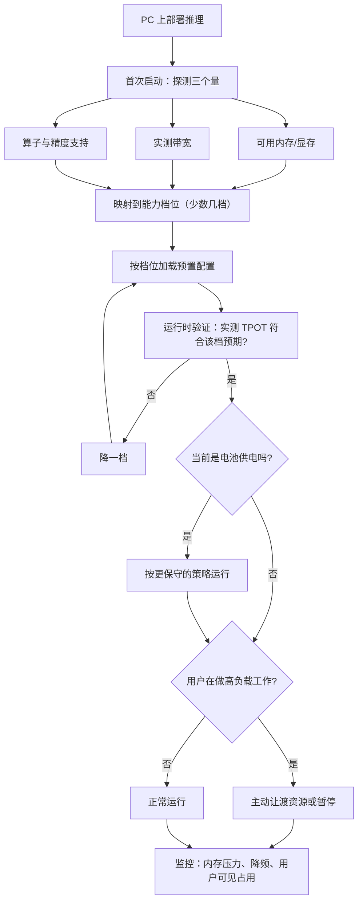

# AI PC 的推理路径

> 位置：[InferenceAtlas](../../INDEX.md) > [模块 10](README.md) > 当前文档
> 信息截至：2026-07-29 ｜ 最后核验：2026-07-29 ｜ 内容版本：v0.1
> 时效性等级：低
> 相关主题：[移动 SoC 与内存约束](02_mobile_npu_soc_and_memory_constraints.md)｜[车载与嵌入式推理](05_automotive_robotics_and_embedded_inference.md)｜[云-边混合架构](08_private_hybrid_cloud_edge_architectures.md)

## 本章导读

PC 在端侧的谱系里处于一个特殊位置：
**它的资源比手机宽松得多，但比服务器紧得多，
而且它的硬件构型是碎片化的**。

**这三点各自带来一类问题**：

**资源更宽松**意味着能跑的模型更大、上下文更长——
**因此 PC 是「端侧能做真正有用的事」的第一个层级**。

**仍然比服务器紧**意味着 [第 1 章](01_edge_inference_overview.md) 的约束顺序
（内存 > 功耗热 > 算力 > 存储）依然成立，
**只是每一项的绝对量更大**。

**硬件碎片化**是 PC 特有的困难：
同一个应用要面对**独立显卡、集成显卡、NPU、以及只有 CPU** 的多种构型，
**每种的内存模型与性能差异巨大**。
**这使得「一套配置适配所有设备」不可行**，
**而必须有一个运行时的能力探测与方案选择机制**。

本章给出**PC 相对手机与服务器的定位**、
**独显与集显在内存模型上的根本差异**、
**碎片化下的分级适配策略**、
以及**PC 特有的两个工程问题：后台运行与用户可见的资源占用**。

**关于数值的说明**：受出口策略限制
（详见 [AGENTS.md 第 11 节](../../AGENTS.md)），
本章不给出任何具体设备的规格数值。

## 学习目标

读完本章后，读者应能够：

1. 说明 PC 在端侧谱系中的定位及其带来的能力变化
2. 区分独立显存与统一内存两种构型在内存模型上的根本差异
3. 设计碎片化硬件下的分级适配策略与能力探测流程
4. 说明 PC 特有的后台运行与资源占用可见性问题
5. 判断一个功能应当放在 PC 端侧还是云端

## 核心结论

- **PC 是「端侧能做真正有用的事」的第一个层级**，因为内存预算允许更大的模型与更长的上下文。
- **独显与集显的内存模型根本不同**：前者有独立显存且需显式传输，后者是统一内存与系统共享。
- **硬件碎片化使「一套配置适配所有设备」不可行**，必须有运行时能力探测与分级方案。
- **分级的正确做法是「按实测能力分档」而非「按硬件型号分档」**，因为型号列表会过时且无法穷尽。
- **PC 特有的问题是资源占用对用户可见**：任务管理器里的内存与功耗是用户会看到并评判的。
- **后台运行需要明确的资源让渡策略**，否则会损害用户对整机的体验。

## 1. 问题定义、系统边界与工作负载

### 1.1 PC 在端侧谱系中的位置

| 维度 | 手机 | **PC** | 服务器 |
|---|---|---|---|
| 内存预算 | 最紧 | **中等** | 宽松 |
| 散热 | 被动或微弱主动 | **主动散热** | 强主动散热 |
| 供电 | 电池 | **电池或市电** | 市电 |
| 硬件一致性 | 较高（平台数量有限） | **最低（碎片化）** | 高（可控） |
| 资源可见性 | 低 | **高（任务管理器）** | 无关 |

**第四行与第五行是 PC 特有的**，构成本章的两条主线。

### 1.2 三种典型构型

| 构型 | 内存模型 | 特点 |
|---|---|---|
| **独立显卡** | 独立显存 + 系统内存 | 显存独占；**需显式传输** |
| **集成显卡 / 统一内存** | 与 CPU 共享 | 零拷贝；**与系统争带宽** |
| **仅 CPU** | 系统内存 | 最慢但最通用 |

**三者的差异不只是性能，而是内存模型的根本不同**——
**这意味着同一份代码在三者上的最优策略不同**。

### 1.3 本章不涉及

具体硬件型号的能力（本库无法核验，见第 5 节）、
移动端的约束（见 [第 2 章](02_mobile_npu_soc_and_memory_constraints.md)）。

## 2. 原理、数学与性能模型

### 2.1 内存预算的放宽与它带来的变化

PC 的内存预算显著大于手机，**这带来三个能力变化**：

$$
P_{\text{model}} \times b_{\text{eff}} + S_{\max}\cdot m_{\text{tok}} \le M_{\text{budget}}^{\text{PC}}
$$

**预算增大后，解空间扩大**：

| 变化 | 后果 |
|---|---|
| 可用模型规模上升 | **通用能力显著改善**，窄任务的限制放宽 |
| 可用上下文长度上升 | 多轮对话与文档处理成为可能 |
| 可用位宽上升 | 不必用最激进的量化，质量风险下降 |

**第一行是质变而非量变**：
**在手机上必须做窄的任务，在 PC 上可能可以做得更通用**
（见 [第 6 章](06_small_language_models_and_on_device_agents.md) 2.2 的任务宽度分析）。

### 2.2 独显与集显的内存模型差异

**（一）独立显卡**

```text
系统内存 ──显式传输──> 显存 ──> GPU 计算单元
   ↑                     ↑
 CPU 用                独占，不与系统争
```

**特点**：

| 方面 | 说明 |
|---|---|
| 带宽 | **独占**，接近服务器的情形 |
| 容量 | **独立且通常小于系统内存** |
| 传输 | **需要显式的主机-设备传输** |
| 模型加载 | 从磁盘 → 系统内存 → 显存，**两跳** |

**关键约束是显存容量**：
**模型必须装进显存，而显存通常小于系统内存**——
**因此独显的实际约束可能比「设备总内存」暗示的更紧**。

**（二）集成显卡 / 统一内存**

与移动 SoC 同构（见 [第 2 章](02_mobile_npu_soc_and_memory_constraints.md) 2.1）：
零拷贝、但与系统共享带宽。

**（三）两者的策略差异**

| 决策 | 独显 | 集显 |
|---|---|---|
| 模型规模上限由什么定 | **显存容量** | 系统内存预算 |
| 是否需要考虑传输开销 | **是**（加载时） | 否 |
| 带宽是否与系统共享 | 否 | **是** |
| 部分卸载到 CPU 是否可行 | 可行但有传输代价 | **更自然** |

**最后一行值得说明**：
统一内存下，把一部分层放在 CPU 执行不需要数据搬运，
**因此「CPU + GPU 混合执行」在集显上的代价更低**——
**而在独显上，跨设备的层间传输可能抵消收益**。

### 2.3 碎片化的量化描述

设应用要支持 $K$ 种硬件构型，
**每种构型的最优配置（模型规模、位宽、执行后端）可能不同**。

**朴素做法是为每种构型准备一套配置**，
**但 $K$ 在 PC 上很大且不断增长**——
**穷举不可行**。

**正确的做法是按「能力维度」而非「型号」分档**：

$$
\text{构型} \longrightarrow (\text{可用内存},\ \text{可用带宽},\ \text{支持的算子与精度}) \longrightarrow \text{档位}
$$

**即先把硬件映射到少数几个能力维度，再按维度分档**。

**这样档位数是固定的，而不随硬件型号数增长**。

**关键设计判断**：
**档位应当由运行时探测的实测能力决定，而不是由型号列表决定**——
**因为型号列表会过时，且无法穷尽**（新硬件、虚拟化环境、异常配置）。

### 2.4 能力探测的三个量

**运行时应当探测的最小集合**：

| 量 | 怎么测 | 决定什么 |
|---|---|---|
| **可用内存**（显存或系统内存预算） | 查询 + 保守折扣 | **模型规模上限** |
| **实际可用带宽** | 小规模基准测试 | **TPOT 下界** |
| **算子与精度支持** | 尝试执行关键算子 | 量化方案与后端选择 |

**第二项在 PC 上尤其重要**，因为构型差异极大：
**同样标称的设备在不同的系统配置下实际带宽可能差很多**。

**探测的成本**：
它发生在首次启动或硬件变化时，
**应当被缓存**，**但要在硬件或驱动变化时失效**。

**一个实用的做法**：
把探测结果与硬件标识、驱动版本一起缓存，
**任一变化则重新探测**。

### 2.5 PC 的散热与持续性能

PC 有主动散热，**因此降频问题弱于手机但仍然存在**：

| 形态 | 散热能力 | 持续性能 |
|---|---|---|
| 台式机 | 强 | **接近稳定** |
| 高性能笔记本 | 中 | 长时间负载下会降频 |
| 轻薄笔记本 | **弱** | **降频明显，接近手机的情形** |

**因此「PC」不是一个统一的类别**——
**轻薄本的持续性能可能更接近手机而非台式机**。

**这又一次说明按实测能力分档优于按类别分档**：
**「是不是 PC」这个分类本身信息量不足**。

## 3. 实现机制与系统设计

### 3.1 分级适配策略

```text
探测（首次启动或硬件变化）
    ↓
映射到能力档位（例如三到四档）
    ↓
每档对应一套预置配置：
    模型规模 / 量化位宽 / 上下文上限 / 执行后端
    ↓
运行时验证：实测 TPOT 是否符合该档预期
    ↓
不符合 → 降一档
```

**「运行时验证并可降档」是这个设计的关键**：
**探测可能不准（虚拟化、共享环境、后台负载），
所以需要一个基于实际表现的修正**。

**降档的触发条件**：

| 条件 | 说明 |
|---|---|
| 实测 TPOT 显著差于该档预期 | 能力探测偏乐观 |
| 内存分配失败 | 预算估计偏高 |
| 持续运行下明显降频 | 散热能力不足（轻薄本） |

### 3.2 独显构型的加载路径

**模型从磁盘到显存要经过两跳**，
**因此加载时间比统一内存构型更长**。

**优化方向**：

| 手段 | 说明 |
|---|---|
| 直接传输 | 若平台支持，绕过中间拷贝 |
| 并行加载 | 边读磁盘边传输 |
| **分层加载** | 先加载前几层就开始计算 |

**第三项的价值在于缩短首次响应的等待**，
**但它要求执行引擎支持部分加载的状态**。

### 3.3 后台运行与资源让渡

**这是 PC 特有的一个问题**：
PC 上的推理应用常常需要在后台运行
（作为系统级助手或其他应用的支撑），
**而它占用的资源会影响用户正在做的其他事**。

**必须设计的三个行为**：

| 场景 | 行为 |
|---|---|
| 用户在做高负载工作（游戏、渲染、编译） | **主动降低资源占用或暂停** |
| 系统内存压力上升 | **释放模型或降档** |
| 用户切走 | 可暂停生成 |

**第二行在 PC 上比手机更复杂**：
**手机的系统会直接终止进程，而 PC 通常不会**——
**它会开始交换到磁盘，导致整机严重卡顿**。

**「整机变卡」的用户感知比「这个应用被关掉」更差**，
**因为用户不一定知道原因**。

**因此 PC 上的内存策略应当是主动让渡而非等待系统处理**。

### 3.4 资源占用的可见性

**PC 用户可以看到任务管理器**，
**因此内存占用、显存占用、功耗都是用户会评判的对象**。

**这带来两个设计考虑**：

1. **占用应当与提供的价值相称**——
   一个占用大量内存但只提供边缘功能的应用会被用户关掉；
2. **占用应当是可解释的**——
   若可能，提供「为什么占这么多」的说明与调整入口。

**这是一个产品问题而非技术问题**，
**但它会反过来约束技术方案**：
**技术上可行的最大配置不一定是产品上可接受的**。

### 3.5 与云端的关系

PC 的能力更强，**因此端云分流的平衡点与手机不同**：

| 维度 | 手机 | PC |
|---|---|---|
| 端侧承载比例 | 低（能力受限） | **高** |
| 交叉输出长度 $N^{*}$ | 较小（$\tau^{\text{端}}$ 大） | **较大**（$\tau^{\text{端}}$ 更接近云端） |
| 需要云端的场景 | 多 | 少 |

**第二行的含义**（用 [第 8 章](08_private_hybrid_cloud_edge_architectures.md) 2.2 的公式）：
**PC 的 $\tau^{\text{端}}$ 更接近 $\tau^{\text{云}}$，
因此分母 $\tau^{\text{端}} - \tau^{\text{云}}$ 更小，$N^{*}$ 更大**——
**即端侧占优的输出长度范围更宽**。

**所以 PC 上的端侧优先策略比手机上更容易成立**。

## 4. 性能、成本、能耗与可靠性 trade-off

### 4.1 配置激进程度与用户体验

| 配置 | 质量 | 风险 |
|---|---|---|
| 保守（小模型、低占用） | 一般 | 低 |
| 激进（大模型、高占用） | **好** | **整机卡顿、用户反感** |

**PC 上的风险与手机不同**：
**手机是进程被杀（明确的失败），
PC 是整机变卡（弥散的、用户难以归因的劣化）**。

**后者对产品口碑的伤害可能更大**，
**因为用户会把「电脑变慢了」归因于整个产品而不是某个功能**。

**因此 PC 上的配置应当偏保守，并提供用户可调的档位**。

### 4.2 台式机与笔记本的差异

| 维度 | 台式机 | 笔记本 |
|---|---|---|
| 持续性能 | 稳定 | **可能降频** |
| 电池 | 无关 | **可感知** |
| 用户对资源占用的敏感度 | 较低 | **较高** |

**在电池供电时，笔记本的行为应当更接近手机**——
**降低资源占用、缩短生成、或提示用户接入电源**。

**这意味着 PC 应用需要感知供电状态并相应调整**，
**而这在手机上是标准做法但在 PC 上常被忽略**。

### 4.3 碎片化的维护成本

支持更多构型意味着更多的测试组合。

**控制成本的方法**：
**按能力档位测试而非按型号测试**——
**档位数固定，因此测试成本不随硬件型号增长**。

**这是 2.3 的分档策略在测试层面的收益**，
也是它相对「按型号配置」的一个额外优势。

## 5. benchmark、真实案例或公开部署案例

**本章不给出任何具体硬件型号的规格或性能数值**。

受当前环境的网络出口策略限制（详见 [AGENTS.md 第 11 节](../../AGENTS.md)），
本库无法访问硬件厂商文档，**因此无法核验任何一项**。

**读者应自行建立的能力档位表**：

| 档位 | 可用内存/显存 | 实测带宽 | 支持的量化 | 对应配置 |
|---|---|---|---|---|
| 高 | 待填 | 待填 | 待填 | 模型规模/位宽/上下文上限 |
| 中 | 待填 | 待填 | 待填 | 同上 |
| 低 | 待填 | 待填 | 待填 | 同上 |
| **仅 CPU 兜底** | 待填 | 待填 | 待填 | 最小可用配置 |

**每档还应实测**：

| 项 | 你的值 |
|---|---|
| 该档的实测 TPOT | 待填 |
| 持续运行下是否降频（尤其轻薄本） | 待填 |
| 模型加载时间（独显构型注意两跳） | 待填 |
| 电池供电时的行为差异 | 待填 |
| 任务管理器中显示的占用 | 待填 |

**最后一行是 PC 特有的**：
**它是用户会看到并评判的数字**。

**关于第 3 章的说明**：
本模块规划中的 `03_qualcomm_apple_mediatek_google_samsung_platforms.md`
因内容本体是需核验的厂商规格，
**在出口策略下无法撰写**
（见 [第 1 章](01_edge_inference_overview.md) 第 5 节）。
**本章的分档方法正是针对这种情况设计的**：
**按实测能力分档不依赖任何厂商规格表**。

> 实验方法论要求见 [如何读推理 benchmark](../00_start_here/03_how_to_read_inference_benchmarks.md)。

## 6. 设计决策框架



**图解读**：

1. **本图展示什么**：PC 上从探测到运行的完整流程。
   **核心是「按实测能力分档」而非按型号**，
   以及运行时的验证与降档。
2. **核心瓶颈**：瓶颈在 F 节点的分档设计。
   **档位数必须固定且少**，
   否则碎片化的维护与测试成本会失控——
   **而这正是「按能力维度而非型号」分档的价值**。
3. **图中的 trade-off**：M 节点的主动让渡会降低推理性能，
   **但它避免了「整机变卡」这个对产品口碑伤害更大的后果**。
   **PC 上这个交换值得做**。
4. **面试如何引用**：可以说
   「PC 的困难是硬件碎片化，
   **所以我会按运行时探测的能力分档而不是按型号**——
   档位数固定，测试与维护成本才不随硬件型号增长」。

## 7. 常见失败模式与排查路径

| 症状 | 根因 | 修正 |
|---|---|---|
| 某些机器上性能远低于预期 | 按型号分档，未覆盖该型号 | 改按实测能力分档 |
| 独显机器上模型装不下 | 用系统内存而非显存估算 | 独显的约束是显存容量 |
| 整机变卡而非应用报错 | PC 内存压力导致交换 | 主动让渡而非等系统处理 |
| 轻薄本长时间使用后变慢 | 散热不足导致降频 | 按持续性能而非峰值分档 |
| 电池供电时耗电快 | 未感知供电状态 | 电池供电时切保守策略 |
| 用户因占用高而关闭功能 | 占用与价值不相称 | 提供可调档位；说明占用 |
| 硬件或驱动更新后行为异常 | 探测结果被缓存未失效 | 按硬件标识+驱动版本缓存 |
| 支持的构型越多测试越难 | 按型号测试 | 按档位测试 |

**排查顺序**：**先确认分档是按能力还是按型号，
再看内存估算用的是显存还是系统内存，最后看持续性能**。

## 8. 关联面试主题

1. 端侧的约束顺序与云端的差异——见 [Q086](../17_interview_prep/06_hardware_and_datacenter_questions.md)
2. 端侧的内存与量化策略——见 [Q087](../17_interview_prep/06_hardware_and_datacenter_questions.md)
3. 端云协同的判据——见 [Q088](../17_interview_prep/06_hardware_and_datacenter_questions.md)
4. 降频的检测与影响——见 [Q083](../17_interview_prep/06_hardware_and_datacenter_questions.md)
5. 四轴硬件评估——见 [Q077](../17_interview_prep/06_hardware_and_datacenter_questions.md)

## 9. 小结

PC 在端侧谱系中处于手机与服务器之间，
**它的三个特征各自带来一类问题**。

**第一，资源更宽松使 PC 成为「端侧能做真正有用的事」的第一个层级**。
内存预算允许更大的模型、更长的上下文、更温和的量化——
**在手机上必须做窄的任务，在 PC 上可能可以做得更通用**。
**由此端云的交叉输出长度 $N^{*}$ 也更大**，
即端侧占优的范围更宽，**端侧优先策略更容易成立**。

**第二，硬件碎片化是 PC 特有的核心困难**。
独显、集显、仅 CPU 三种构型的**内存模型根本不同**——
独显的约束是显存容量且需要显式传输，
集显与移动 SoC 同构（零拷贝但与系统争带宽）。
**「一套配置适配所有设备」不可行**，
**而正确的做法是按运行时探测的实测能力分档，而不是按型号分档**——
因为型号列表会过时且无法穷尽，
**且按能力分档使档位数固定，测试与维护成本才不随硬件型号增长**。

**第三，资源占用对用户可见**。
PC 上的失败方式与手机不同：
**手机是进程被杀（明确），PC 是整机变卡（弥散且用户难以归因）**——
**后者对产品口碑的伤害可能更大**。
**因此 PC 上的内存策略应当是主动让渡而非等待系统处理**，
配置也应当偏保守并提供用户可调的档位。

一个容易被忽略的点：**「PC」不是一个统一的类别**。
轻薄本的持续性能可能更接近手机而非台式机，
**而电池供电时的行为也应当更保守**——
**这又一次说明按实测能力分档优于按类别分档**。

**本章的分档方法有一个额外价值**：
它**不依赖任何厂商规格表**，
**因此在无法核验厂商文档的情况下（如本库当前的处境）依然可用**。

## 关键术语

| 中文术语 | 英文 | 定义 | 单位/口径 | 关联文档 |
|---|---|---|---|---|
| 能力档位 | capability tier | 按实测能力而非型号划分的配置档 | — | 本章 2.3 |
| 能力探测 | capability probing | 运行时测出内存、带宽与算子支持 | — | 本章 2.4 |
| 独立显存 | discrete VRAM | 与系统内存分离、需显式传输的显存 | 字节 | 本章 2.2 |
| 资源让渡 | resource yielding | 用户高负载时主动降低占用 | — | 本章 3.3 |
| 降档 | tier downgrade | 实测不符预期时切换到更低配置 | — | 本章 3.1 |

## 延伸阅读

- [边缘推理的约束条件与价值主张](01_edge_inference_overview.md)
- [移动 SoC、NPU 与内存约束](02_mobile_npu_soc_and_memory_constraints.md)
- [面向端侧的模型压缩](07_quantization_distillation_and_pruning_for_edge.md)
- [云-边混合与隐私优先架构](08_private_hybrid_cloud_edge_architectures.md)
- [AI 推理硬件总览](../07_hardware_and_server_architecture/01_ai_inference_hardware_overview.md)

## 主要来源

本章由内存与带宽的结构关系、
本模块第 1–2 章的端侧约束、
以及 [第 8 章](08_private_hybrid_cloud_edge_architectures.md) 的端云时延模型推导而成。

**不含任何需要外部核验的硬件型号规格或性能数值**。
受当前环境的网络出口策略限制，本库无法访问硬件厂商文档
（详见 [AGENTS.md 第 11 节](../../AGENTS.md)）。
**本章的分档方法正是为这种情况设计的：按实测能力分档不依赖厂商规格表**。

| 类别 | 说明 | 披露标签 |
|---|---|---|
| 两种内存模型的差异、分档策略、探测的三个量 | 由结构关系与本模块前几章推导 | — |
| 读者自行建立的能力档位表 | 应自行探测与实测 | `独立可复现实验` |
| 任何具体硬件型号的规格与性能 | **本章未给出** | `待核实` |

## 更新记录

| 日期 | 版本 | 变更 | 核验人 |
|---|---|---|---|
| 2026-07-29 | v0.1 | 初稿：PC 的定位、独显与集显的内存模型差异、按能力分档策略、资源让渡与可见性 | — |
