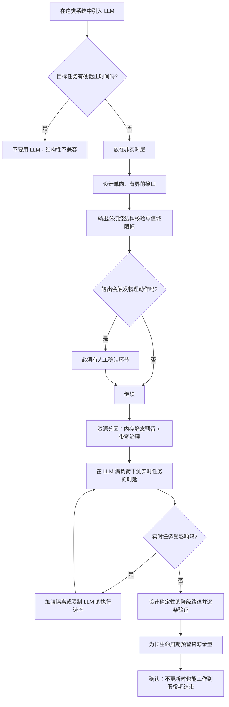

# 车载、机器人与嵌入式推理

> 位置：[InferenceAtlas](../../INDEX.md) > [模块 10](README.md) > 当前文档
> 信息截至：2026-07-29 ｜ 最后核验：2026-07-29 ｜ 内容版本：v0.1
> 时效性等级：低
> 相关主题：[AI PC 的推理路径](04_pc_ai_inference.md)｜[小模型与端侧 agent](06_small_language_models_and_on_device_agents.md)｜`09_edge_deployment_case_studies.md`

## 本章导读

车载、机器人与嵌入式场景在端侧谱系里引入了一个**前面几章都没有的约束**：
**实时性**。

手机与 PC 上，「慢」是体验问题；
**在控制回路里，「慢」可能是安全问题**。
这个差异改变了几乎所有的设计判断：

**第一，约束从「平均」变成「最坏情况」**。
手机上关心 TPOT 的 P99，
**控制回路关心的是「有没有一次超过截止时间」**——
**一次超时的代价可能远大于一千次正常**。

**第二，「尽力而为」不再可接受**。
云端与手机的推理可以在资源紧张时降级、排队、变慢；
**而一个有截止时间的任务要么按时完成，要么就是失败**——
**必须有明确的超时行为，而不是让它慢慢跑**。

**第三，LLM 类模型通常不在控制回路里**。
这是本章要澄清的一个重要边界：
**大语言模型的生成是自回归的、长度不确定的、时延方差大的**，
**这些性质与硬实时要求根本不兼容**。
**因此 LLM 在这类系统中的正确位置是「非实时的辅助层」**，
而不是控制回路本身。

本章给出**实时性约束的分级与它对推理的要求**、
**LLM 在这类系统中的正确位置**、
**资源分区与干扰隔离**、
以及**长生命周期设备带来的维护约束**。

**关于数值的说明**：受出口策略限制
（详见 [AGENTS.md 第 11 节](../../AGENTS.md)），
本章不给出任何具体平台的规格、时序或认证要求数值。
**安全相关的具体要求必须由相应的工程与合规流程确定，本章不提供此类判断**。

## 学习目标

读完本章后，读者应能够：

1. 区分硬实时、软实时与非实时三类任务，并说明各自对推理的要求
2. 说明为什么自回归 LLM 与硬实时要求根本不兼容
3. 给出 LLM 在这类系统中的正确位置与边界
4. 设计资源分区以防止非实时负载干扰实时任务
5. 说明长生命周期设备对模型更新与维护的约束

## 核心结论

- **实时性把关注点从「平均」变成「最坏情况」**：一次超时的代价可能远大于一千次正常。
- **自回归 LLM 与硬实时根本不兼容**：输出长度不确定、时延方差大、且无法给出可靠的最坏情况上界。
- **LLM 在这类系统中的正确位置是非实时的辅助层**，与控制回路之间必须有明确的隔离。
- **资源分区是必需的**：非实时负载必须无法抢占实时任务的算力、内存与带宽。
- **长生命周期设备使模型更新成为一个跨越数年的问题**，与消费电子的迭代节奏完全不同。
- **降级路径必须是确定性的**：不能靠「资源不够就慢一点」，而要有明确定义的退化行为。

## 1. 问题定义、系统边界与工作负载

### 1.1 三类实时性要求

| 类型 | 定义 | 超时的后果 | 例子特征 |
|---|---|---|---|
| **硬实时** | 必须在截止时间内完成 | **系统失效** | 控制回路 |
| **软实时** | 应当在截止时间内完成 | 质量下降 | 感知融合的部分环节 |
| **非实时** | 无严格截止时间 | 体验下降 | 语音交互、诊断、规划辅助 |

**本模块前几章讨论的都是第三类**。
**本章的新内容是前两类，以及它们与第三类如何共存**。

### 1.2 这类系统的三个共同特征

| 特征 | 说明 |
|---|---|
| **混合负载** | 实时任务与非实时任务在同一设备上 |
| **长生命周期** | 设备服役数年，远长于消费电子 |
| **受限的更新能力** | 更新可能需要特定条件（停机、连接、授权） |

**三者共同导致「一次部署要管很久」**，
**因此设计上的保守程度应当高于消费场景**。

### 1.3 本章的范围声明

**本章不涉及任何具体的安全认证要求、功能安全等级或行业标准**。

受当前环境的网络出口策略限制（详见 [AGENTS.md 第 11 节](../../AGENTS.md)），
本库无法访问任何标准文本，
**因此无法核验任何一条此类陈述**。
**更重要的是：安全相关的判断必须由相应的工程与合规流程给出，
而不是从技术文档推断**——
这与 [模块 09 第 9 章](../09_datacenter_power_thermal_and_operations/09_security_compliance_and_data_residency.md)
对合规问题的立场一致。

**本章讨论的是推理系统的结构性约束**，
**即「一旦实时性要求被确定，它在技术上意味着什么」**。

## 2. 原理、数学与性能模型

### 2.1 实时性把关注点从分布移到上界

**非实时系统关心分布**：

$$
\text{目标}: \quad P_{99}(\text{时延}) \le \tau
$$

**硬实时系统关心上界**：

$$
\text{目标}: \quad \max(\text{时延}) \le \tau \quad \text{（在所有可能的输入与状态下）}
$$

**两者的差异是根本性的**：

| 维度 | 分位数目标 | 上界目标 |
|---|---|---|
| 可否用统计保证 | **可以** | **不可以** |
| 需要什么 | 足够的样本 | **对最坏情况的分析** |
| 尾部的处理 | 允许少量超出 | **不允许任何超出** |

**「不允许任何超出」意味着需要一个可分析的最坏执行时间**，
**而不是一个测出来的分位数**。

### 2.2 为什么自回归 LLM 与硬实时不兼容

**三个结构性原因**：

**（一）输出长度不确定**

$$
T_{\text{total}} = \text{TTFT} + (N-1)\cdot\text{TPOT}
$$

**$N$ 由模型决定且事先未知**——
**因此 $T_{\text{total}}$ 没有一个由输入决定的上界**。

**可以强制截断到 $N_{\max}$**，
**但截断的输出可能是不完整的、无意义的**——
**这不是「降级」而是「失败」**。

**（二）单步时延本身有方差**

即使固定 $N$，每步的时延也受
内存访问模式、系统其他活动、频率状态影响。
**在共享内存的平台上，方差来源更多**（见 [第 2 章](02_mobile_npu_soc_and_memory_constraints.md) 2.1）。

**（三）最坏情况难以分析**

硬实时要求对最坏执行时间有可信的分析。
**而 LLM 推理涉及大量的动态行为**
（KV 增长、缓存命中变化、可能的内存回收），
**使得「最坏情况」的分析极其困难甚至不可行**。

**结论**：
**LLM 不应当被放在硬实时路径上**。
**这不是工程能力问题，而是模型的结构性质决定的**。

### 2.3 LLM 的正确位置

```text
┌──────────────────────────────────────┐
│  硬实时层：控制回路                    │  ← 确定性算法；不含 LLM
│    截止时间严格；最坏情况可分析          │
└──────────────┬───────────────────────┘
               │  单向、有界的接口
┌──────────────┴───────────────────────┐
│  软实时层：感知与融合                  │  ← 可能含专用小模型
│    有截止时间但可降级                   │
└──────────────┬───────────────────────┘
               │  单向、异步
┌──────────────┴───────────────────────┐
│  非实时层：交互、诊断、规划辅助          │  ← LLM 在这里
│    无严格截止时间；资源可被抢占          │
└──────────────────────────────────────┘
```

**三个设计要求**：

1. **接口是单向且有界的**——
   非实时层的输出进入上层时必须经过校验与限幅，
   **不能让 LLM 的输出直接成为控制指令**；
2. **资源不可反向抢占**——
   非实时层不能占用实时层需要的资源（见 2.4）；
3. **非实时层的失败不影响上层**——
   LLM 不可用时，实时层必须仍能正常工作。

**第一点是安全上最关键的**：
**LLM 输出必须被当作不可信输入**
（与 [模块 11 第 10 章](../11_benchmarking_reliability_and_observability/10_safety_security_and_abuse_controls.md)
的原则一致，但在这类系统里后果更严重）。

### 2.4 资源分区

**混合负载下必须保证实时任务的资源**：

| 资源 | 分区手段 | 若不分区的后果 |
|---|---|---|
| 算力 | 核心/单元的静态划分或优先级 | 实时任务被推迟 |
| **内存** | **静态预留** | 实时任务分配失败 |
| **内存带宽** | **限流或专用通道** | **最隐蔽：实时任务变慢但资源"够"** |
| 缓存 | 分区（若硬件支持） | 实时任务的缓存被冲刷 |

**第三行是最容易被忽略的**：
**LLM 推理是带宽密集的**（见 [第 1 章](01_edge_inference_overview.md) 2.2），
**它会大量消耗共享的内存带宽**，
**从而让实时任务的访存变慢——而这在「算力与内存都够」的表象下发生**。

**因此在这类系统上部署 LLM，必须评估它对实时任务访存的影响**，
**而不只是评估它自己的资源占用**。

**第四行同理**：
LLM 的大量数据流会冲刷共享缓存，
**使实时任务的缓存命中率下降**。

### 2.5 长生命周期的影响

设备服役期远长于消费电子，**这带来三个约束**：

| 约束 | 说明 |
|---|---|
| **模型更新跨越数年** | 部署时的模型可能在服役中期已过时 |
| **硬件不变** | 无法靠换硬件解决性能问题 |
| **更新窗口受限** | 可能需要特定条件才能更新 |

**第一项的后果**：
**必须设计模型的可更新性**——
包括更新的分发、验证、回滚，
**以及「不更新也能继续工作」的保证**。

**第二项的后果**：
**部署时的资源规划必须留出未来的余量**——
**因为未来的模型可能更大**，
而硬件不会变。

**这与消费电子的思路相反**：
手机上可以假设「用户会换新设备」，
**这类系统必须假设「硬件就是这样了」**。

## 3. 实现机制与系统设计

### 3.1 非实时层的资源治理

**LLM 所在的非实时层必须有明确的资源上限**：

| 上限 | 防止什么 |
|---|---|
| 内存上限（静态预留） | 挤占实时任务 |
| **带宽配额** | **拖慢实时任务的访存** |
| 最大生成长度 | 无界的资源占用 |
| 最大并发任务数 | 累积占用 |

**「带宽配额」在实现上最困难**，
**因为多数平台不直接提供带宽的分区能力**。

**实用的替代做法**：

1. **限制 LLM 的执行速率**（例如插入空闲间隔），
   **间接降低它的带宽占用**；
2. **在实时任务的关键时段暂停 LLM**——
   **需要与调度层协同**；
3. **把 LLM 放在带宽影响较小的执行单元上**（若平台允许）。

**第二项最可靠但需要系统级的协调**。

### 3.2 接口的校验与限幅

**LLM 输出进入上层前必须经过**：

| 检查 | 说明 |
|---|---|
| **结构校验** | 输出必须符合预定义的结构（用约束解码保证） |
| **值域限幅** | 数值参数必须在安全范围内 |
| **语义校验** | 若可能，用规则验证输出的合理性 |
| **人工确认** | 对影响安全的操作，必须有人工环节 |

**第四行是一个应当被默认采用的原则**：
**在这类系统中，LLM 的输出不应当直接触发有物理后果的动作**。

**这与 [模块 11 第 10 章](../11_benchmarking_reliability_and_observability/10_safety_security_and_abuse_controls.md)
的「工具调用需要独立确认」是同一个原则，
但在这里的后果更严重**——
**因为物理动作不可撤销**。

### 3.3 确定性的降级

**「资源不够就慢一点」在这类系统里不可接受**，
**必须有明确定义的降级行为**：

| 触发 | 降级行为 |
|---|---|
| 非实时层资源超限 | **明确终止当前任务并返回确定的状态** |
| 生成超过长度上限 | 触发收尾或返回「无法完成」 |
| 实时任务需要资源 | **立即让渡，非实时任务被暂停或取消** |

**关键是「确定的状态」**：
**上层必须能知道非实时层的当前状态**，
**而不是等待一个可能永远不返回的结果**。

**因此非实时层的接口应当是「带超时的异步调用」**，
**而不是同步阻塞**。

### 3.4 模型更新的设计

**长生命周期设备的更新需要**：

| 要求 | 说明 |
|---|---|
| **原子性** | 更新失败必须能回滚到可工作状态 |
| **完整性校验** | 加载前校验权重哈希（见 [模块 09 第 8 章](../09_datacenter_power_thermal_and_operations/08_storage_logging_and_data_plane.md)） |
| **兼容性** | 新模型必须与既有接口兼容 |
| **可离线** | 不能假设总有网络 |
| **不更新也能工作** | **最重要**：更新是可选的增强而非必需 |

**最后一项是长生命周期设备的核心设计原则**：
**必须假设有相当比例的设备长期不更新**，
**因此当前部署的版本必须能独立工作到服役期结束**。

### 3.5 验证要求

这类系统的验证比消费场景严格得多：

| 验证 | 内容 |
|---|---|
| **最坏情况下的资源占用** | 而非平均占用 |
| **对实时任务的干扰** | **在 LLM 满负荷时测实时任务的时延** |
| 长时间运行 | 数天或更久的稳定性 |
| 极端环境 | 温度、供电波动 |
| **降级路径** | 每条降级路径都要被验证 |

**第二行是本章最需要强调的验证项**：
**必须在「LLM 满负荷」的条件下测实时任务的表现**，
**而不是分别测两者**——
**因为干扰只在共存时出现**。

## 4. 性能、成本、能耗与可靠性 trade-off

### 4.1 隔离强度与资源利用率

| 隔离方式 | 安全性 | 利用率 |
|---|---|---|
| **物理隔离**（独立芯片） | **最高** | 最低（资源不能互相调剂） |
| 静态分区 | 高 | 中 |
| 动态优先级 | 中 | **高** |

**在有安全要求的系统中，通常倾向更强的隔离**，
**即使它牺牲利用率**——
**因为「利用率」的收益与「安全」的代价不在一个量级**。

**这与云端的判断相反**：
云端把利用率当作核心优化目标，
**这类系统把确定性当作核心目标**。

### 4.2 模型能力与资源预留

由 2.5，长生命周期要求为未来留余量。

**这导致一个取舍**：

| 策略 | 当前能力 | 未来空间 |
|---|---|---|
| 用满当前资源 | **好** | **无** |
| 保守使用 | 一般 | **有** |

**在硬件不可更换的前提下，保守策略通常更合理**——
**因为「未来无法升级」的代价可能是整个功能在服役中期失去竞争力**。

### 4.3 更新能力与风险

**更多的更新能力意味着更多的风险面**：
一个可被远程更新的模型也是一个可被攻击的入口。

**因此更新通道的安全要求应当高于功能本身**：
签名校验、完整性验证、以及回滚能力
（见 [模块 11 第 10 章](../11_benchmarking_reliability_and_observability/10_safety_security_and_abuse_controls.md) 3.5）。

## 5. benchmark、真实案例或公开部署案例

**本章不给出任何具体平台的规格、时序或安全要求数值**。

受当前环境的网络出口策略限制（详见 [AGENTS.md 第 11 节](../../AGENTS.md)），
本库无法访问任何平台文档或标准文本，
**因此无法核验任何一项**。

**更重要的是：安全相关的判断必须由相应的工程与合规流程给出**，
**本章不提供任何此类判断**。

**读者应自行完成的评估表**：

| 项 | 你的值 | 备注 |
|---|---|---|
| 系统中各任务的实时性分级 | 待填 | **由系统工程给出** |
| LLM 所在的层级 | 待填 | **应为非实时层** |
| LLM 与实时任务的隔离方式 | 待填 | 物理/静态分区/优先级 |
| **LLM 满负荷时实时任务的时延** | 待填 | **`独立可复现实验`；最关键的验证** |
| LLM 的内存上限（静态预留） | 待填 | — |
| LLM 的带宽影响 | 待填 | **最隐蔽的干扰** |
| 缓存干扰的测量 | 待填 | 实时任务的缓存命中率变化 |
| 每条降级路径的验证结果 | 待填 | 逐条 |
| 设备服役期与预期的模型更新次数 | 待填 | 决定余量 |
| 为未来预留的资源比例 | 待填 | 硬件不可更换 |
| **不更新时当前版本能否工作到服役期结束** | 是/否 | **核心设计原则** |
| 更新通道的签名与回滚机制 | 待填 | 安全要求高于功能 |

**第四行是本表最关键的一项**：
**干扰只在共存时出现，分别测两者会完全错过它**。

> 实验方法论要求见 [如何读推理 benchmark](../00_start_here/03_how_to_read_inference_benchmarks.md)。

## 6. 设计决策框架



**图解读**：

1. **本图展示什么**：在有实时性要求的系统中引入 LLM 的完整流程。
   **第一个判断就排除了硬实时路径**——
   这不是保守，而是结构性不兼容。
2. **核心瓶颈**：瓶颈在 K 节点。
   **「在 LLM 满负荷下测实时任务」这个验证最容易被跳过**，
   因为分别测两者都正常。
   **而带宽与缓存的干扰只在共存时出现**——
   **它在「算力与内存都够」的表象下发生**。
3. **图中的 trade-off**：M 分支加强隔离会降低资源利用率。
   **在这类系统中这个交换值得做**——
   利用率的收益与确定性的代价不在一个量级。
4. **面试如何引用**：可以说
   「有硬截止时间的路径上我不会放 LLM——
   **输出长度不确定、时延方差大、最坏情况难以分析**；
   LLM 应当在非实时层，
   **而且必须在它满负荷时验证实时任务不受带宽与缓存干扰**」。

**P 节点不可省略**：
**必须假设有相当比例的设备长期不更新**。

## 7. 常见失败模式与排查路径

| 症状 | 根因 | 修正 |
|---|---|---|
| 实时任务偶发超时 | LLM 占用带宽或冲刷缓存 | 在共存条件下测；加强隔离 |
| 分别测都正常，集成后有问题 | 干扰只在共存时出现 | **必须做共存验证** |
| LLM 输出导致异常动作 | 输出未经校验直接使用 | 结构校验 + 限幅 + 人工确认 |
| 资源不够时系统行为不确定 | 无确定性的降级路径 | 定义明确的降级行为 |
| 服役中期模型能力不足 | 部署时用满了资源 | 预留未来余量 |
| 部分设备长期未更新导致功能失效 | 假设了设备会更新 | 当前版本须能独立工作到期 |
| 更新失败后设备不可用 | 更新非原子 | 原子更新 + 回滚 |
| LLM 不可用时实时功能也受影响 | 层间隔离不足 | 非实时层的失败不应影响上层 |

**排查顺序**：**先确认是否做过共存验证，
再看隔离方式，最后看降级路径是否确定**。

## 8. 关联面试主题

1. 端侧的约束顺序与云端的差异——见 [Q086](../17_interview_prep/06_hardware_and_datacenter_questions.md)
2. 工具调用的安全设计与人工确认——见 [Q094](../17_interview_prep/07_debug_benchmark_and_reliability_questions.md)
3. 结构化输出与约束解码——见 [模块 05 第 9 章](../05_decoding_and_generation_algorithms/09_structured_output_and_grammar_constrained_decoding.md)
4. 权重完整性校验——见 [模块 09 第 8 章](../09_datacenter_power_thermal_and_operations/08_storage_logging_and_data_plane.md)
5. 小模型的任务边界——见 [第 6 章](06_small_language_models_and_on_device_agents.md)

## 9. 小结

车载、机器人与嵌入式场景引入了前几章没有的约束：**实时性**。
它把关注点**从「分布」移到「最坏情况的上界」**——
而这个转变改变了几乎所有的设计判断。

**四条核心结论**：

**第一，自回归 LLM 与硬实时根本不兼容**，
原因是结构性的：输出长度不确定（因此总时延没有由输入决定的上界）、
单步时延本身有方差、
**且最坏执行时间难以做可信的分析**。
**这不是工程能力问题，因此不应当试图「优化到能用」**。

**第二，LLM 的正确位置是非实时的辅助层**，
与实时层之间需要三重保证：
单向有界的接口、资源不可反向抢占、
以及**非实时层的失败不影响上层**。
**LLM 的输出必须被当作不可信输入**——
而在这类系统里，后果比云端严重得多，
**因为物理动作不可撤销**。

**第三，最容易被忽略的干扰是带宽与缓存**。
LLM 推理是带宽密集的，
**它会在「算力与内存都够」的表象下拖慢实时任务的访存**。
**因此验证必须在「LLM 满负荷」的条件下测实时任务**——
**分别测两者会完全错过这个问题**。

**第四，长生命周期改变了资源规划的逻辑**。
硬件不可更换、服役期远长于消费电子、
**且必须假设有相当比例的设备长期不更新**——
**因此当前部署的版本必须能独立工作到服役期结束**，
且资源规划要为未来的模型留出余量。
**这与消费电子「用户会换设备」的假设完全相反**。

**关于安全**：本章**不提供任何具体的安全认证、
功能安全等级或标准要求的判断**——
这些必须由相应的工程与合规流程给出。
**本章讨论的只是「一旦实时性要求被确定，它在技术上意味着什么」**。

## 关键术语

| 中文术语 | 英文 | 定义 | 单位/口径 | 关联文档 |
|---|---|---|---|---|
| 硬实时 | hard real-time | 必须在截止时间内完成，否则系统失效 | — | 本章 1.1 |
| 最坏执行时间 | worst-case execution time | 所有输入与状态下的时延上界 | 秒 | 本章 2.1 |
| 资源分区 | resource partitioning | 静态划分算力、内存、带宽 | — | 本章 2.4 |
| 确定性降级 | deterministic degradation | 明确定义的退化行为而非「慢一点」 | — | 本章 3.3 |
| 共存验证 | co-existence validation | 在非实时负载满负荷时验证实时任务 | — | 本章 3.5 |

## 延伸阅读

- [边缘推理的约束条件与价值主张](01_edge_inference_overview.md)
- [移动 SoC、NPU 与内存约束](02_mobile_npu_soc_and_memory_constraints.md)
- [小模型与端侧 agent](06_small_language_models_and_on_device_agents.md)
- [结构化输出与语法约束解码](../05_decoding_and_generation_algorithms/09_structured_output_and_grammar_constrained_decoding.md)
- [安全、滥用防护与租户隔离](../11_benchmarking_reliability_and_observability/10_safety_security_and_abuse_controls.md)

## 主要来源

本章由实时性要求的结构分析、
本模块第 1–2 章的端侧约束、
以及 [模块 11 第 10 章](../11_benchmarking_reliability_and_observability/10_safety_security_and_abuse_controls.md) 的输出校验原则推导而成。

**不含任何具体平台的规格、时序、安全认证或标准要求**。
受当前环境的网络出口策略限制，本库无法访问平台文档或标准文本
（详见 [AGENTS.md 第 11 节](../../AGENTS.md)）。
**安全相关的判断必须由相应的工程与合规流程给出，本章不提供此类判断**。

| 类别 | 说明 | 披露标签 |
|---|---|---|
| 实时性分级、LLM 的不兼容性、资源分区与干扰 | 由结构分析与本模块前几章推导 | — |
| 读者自行完成的评估与共存验证 | 应自行实测 | `独立可复现实验` |
| 任何具体平台规格、时序与安全要求 | **本章未给出** | `待核实` |

## 更新记录

| 日期 | 版本 | 变更 | 核验人 |
|---|---|---|---|
| 2026-07-29 | v0.1 | 初稿：实时性分级、LLM 与硬实时的结构性不兼容、分层架构、带宽与缓存干扰、长生命周期约束 | — |
