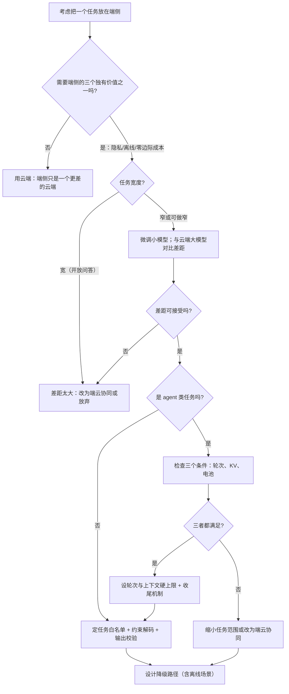

# 小模型与端侧 agent

> 位置：[InferenceAtlas](../../INDEX.md) > [模块 10](README.md) > 当前文档
> 信息截至：2026-07-29 ｜ 最后核验：2026-07-29 ｜ 内容版本：v0.1
> 时效性等级：低
> 相关主题：[端侧压缩](07_quantization_distillation_and_pruning_for_edge.md)｜`08_private_hybrid_cloud_edge_architectures.md`｜[工具使用与 Agent 推理](../05_decoding_and_generation_algorithms/08_tool_use_and_agent_inference.md)

## 本章导读

端侧模型的能力边界是一个**产品问题伪装成的技术问题**。

技术上的事实很清楚：在内存预算约束下，端侧能跑的模型规模有上界，
**因此它的通用能力必然弱于云端**。
**但「弱」不等于「不可用」**——
关键在于**任务是否落在小模型的能力范围内**。

本章的核心判断是：
**端侧小模型的正确用法不是「做一个更小的通用助手」，
而是「做一组明确定义的窄任务」**。

这个判断有三个依据：

**第一，窄任务上的差距远小于通用任务**。
一个针对特定任务微调的小模型，
**在该任务上可能接近甚至超过通用大模型**——
因为它把有限的容量全部用在了这个任务上。

**第二，端侧的独有价值只在特定场景兑现**。
数据不出设备、离线可用、边际成本为零——
**这三项都不是普遍需求，而是特定场景的硬需求**。
**在不需要它们的场景下，端侧只是一个更差的云端**。

**第三，agent 场景放大了小模型的弱点**。
多步推理、工具调用、长上下文——
**这些恰好是小模型最弱的地方**，
而端侧 agent 还要额外承受 KV 累积与电池的约束。

本章给出**小模型能力边界的结构性来源**、
**窄任务与通用任务的差距对比**、
**端侧 agent 的三个特有困难与应对**、
以及**判断一个任务该不该放在端侧的决策框架**。

**关于数值的说明**：受出口策略限制
（详见 [AGENTS.md 第 11 节](../../AGENTS.md)），
本章不给出任何具体模型的规模、能力或评测数值。

## 学习目标

读完本章后，读者应能够：

1. 说明小模型能力受限的结构性来源，以及为什么窄任务上的差距更小
2. 判断一个任务是否适合放在端侧，并给出依据
3. 列出端侧 agent 的三个特有困难及各自的应对
4. 说明多步 agent 在端侧的 KV 与电池代价如何随步数增长
5. 设计端侧小模型的任务边界与失败时的降级路径

## 核心结论

- **端侧小模型的正确用法是「一组明确定义的窄任务」而非「更小的通用助手」**。
- **窄任务上的能力差距远小于通用任务**：微调的小模型把有限容量全部用在目标任务上。
- **端侧的三个独有价值不是普遍需求**：在不需要隐私、离线、零边际成本的场景下，端侧只是一个更差的云端。
- **agent 场景放大小模型的弱点**：多步推理、工具调用、长上下文恰好是它最弱的地方。
- **端侧多步 agent 的 KV 占用随步数单调增长**，而端侧没有「换出到别处」这个选项。
- **必须设计明确的能力边界与降级路径**：小模型在边界外的失败方式是「流畅地给出错误答案」。

## 1. 问题定义、系统边界与工作负载

### 1.1 「小模型」在本章的含义

**本章不按参数量定义「小」**，
而按**能装进端侧内存预算**定义
（见 [第 1 章](01_edge_inference_overview.md) 3.1）。

**因此「小」是相对于目标设备的**：
同一个模型在 PC 上可能是「中等」，在手机上是「大」。

### 1.2 端侧任务的三种类型

| 类型 | 例子特征 | 小模型的适配度 |
|---|---|---|
| **窄任务** | 输入输出格式固定、领域明确 | **好** |
| 半开放任务 | 有明确目标但表达自由 | 中 |
| **通用助手** | 任意问题、任意领域 | **差** |

**本章的核心主张是端侧应当聚焦第一类**。

### 1.3 本章不涉及

模型训练与微调的方法（属于训练范畴）、
具体模型的能力评测（本库无法核验，见第 5 节）、
端云分流的架构（见 `08_private_hybrid_cloud_edge_architectures.md`）。

## 2. 原理、数学与性能模型

### 2.1 能力受限的结构性来源

端侧模型规模的上界由内存预算给出：

$$
P_{\text{model}} \le \frac{M_{\text{budget}} - S_{\max}\cdot m_{\text{tok}} - M_{\text{act}}}{b_{\text{eff}}}
$$

**这是一个硬约束**（见 [第 7 章](07_quantization_distillation_and_pruning_for_edge.md) 3.1）。

**而模型的通用能力与规模正相关**——
**因此端侧的通用能力有一个由硬件决定的天花板**。

**但这个约束作用在「通用能力」上，而不是「特定任务的能力」上**：

| 能力类型 | 与规模的关系 | 端侧的可达性 |
|---|---|---|
| 通用知识与推理 | 强相关 | **受限明显** |
| **特定任务的模式匹配与格式遵循** | 弱相关 | **可达** |
| 长上下文的信息整合 | 强相关（且受 KV 约束） | 受限明显 |

**第二行是端侧的机会所在**：
**很多实用任务的本质是模式匹配与格式转换，而不是开放推理**。

### 2.2 窄任务与通用任务的差距

**一个定性但重要的判断**：

设通用大模型在任务 $T$ 上的表现为 $Q_{\text{large}}(T)$，
端侧小模型（针对 $T$ 微调）为 $Q_{\text{small,ft}}(T)$，
端侧小模型（未微调）为 $Q_{\text{small}}(T)$。

**通常有**：

$$
Q_{\text{small}}(T) \ll Q_{\text{small,ft}}(T) \le Q_{\text{large}}(T)
$$

**而关键在于第二个不等号的紧密程度取决于任务的宽度**：

| 任务宽度 | $Q_{\text{small,ft}}$ 与 $Q_{\text{large}}$ 的差距 |
|---|---|
| 窄（格式固定、领域单一） | **小** |
| 中 | 中 |
| 宽（开放问答） | **大** |

**因此端侧的设计策略是「把任务做窄」**：
**不是让小模型去做大模型的事，
而是重新定义任务使它落在小模型的能力范围内**。

**这是一个产品设计动作而不只是技术动作**。

**注意这个结论的限定**：
它说的是「针对该任务微调的小模型」，
**而微调需要该任务的数据与训练流程**——
**这是一个真实的工程成本**，
且它随任务数量线性增长（每个窄任务一个模型或一组适配参数）。

### 2.3 端侧 agent 的三个特有困难

**agent = 多步推理 + 工具调用 + 状态维护**。三者在端侧都更难。

**（一）多步推理消耗的 KV 单调增长**

由 [模块 05 第 8 章](../05_decoding_and_generation_algorithms/08_tool_use_and_agent_inference.md)，
agent 的每一轮都把上一轮的结果追加进上下文：

$$
S_r = S_0 + \sum_{i=1}^{r}\Delta_i
$$

**KV 占用随轮次单调增长**：

$$
M_{\text{KV}}(r) = S_r \cdot m_{\text{tok}}
$$

**在云端，KV 压力可以靠换出、抢占或扩容缓解**；
**端侧没有这些选项**——
**内存预算是固定的，超出就是失败**。

**因此端侧 agent 必须有一个硬性的轮次或上下文上限**，
**而这直接限制了它能完成的任务复杂度**。

**（二）工具调用的等待期占着内存**

agent 等待工具返回时，
**它的 KV 仍然占着内存**（见 [Q070](../17_interview_prep/05_distributed_and_moe_questions.md) 的空闲占用讨论）。

**云端的应对是把等待中请求的 KV 换出**；
**端侧只有一个会话，换出到哪里是一个问题**——
**换到存储的代价可能超过重算**。

**而端侧的工具调用往往涉及网络**（查询、API），
**等待时间可能不短**。

**（三）小模型的工具调用可靠性更低**

工具调用要求模型输出符合特定格式的结构化内容，
**并正确选择工具与参数**。
**这是一个对格式遵循与判断力都有要求的任务**，
**而小模型在后者上更弱**。

**后果是**：
调用错误的工具、参数格式错误、
或者在应该调用工具时没有调用。

**应对是约束解码**（见 [模块 05 第 9 章](../05_decoding_and_generation_algorithms/09_structured_output_and_grammar_constrained_decoding.md)）：
**用语法约束保证格式一定正确**，
**从而把问题从「格式 + 选择」缩小为「选择」**。

**这在端侧尤其有价值**，因为：
格式错误导致的重试在端侧代价更高（时延与电池），
**而约束解码几乎消除了这一类失败**。

### 2.4 多步的电池代价

每一轮 agent 的计算量约为

$$
\text{计算}_r \approx \underbrace{\text{prefill}(\Delta_{r})}_{\text{新增部分}} + \underbrace{\text{decode}(L_r)}_{\text{本轮输出}}
$$

（假设前面轮次的 KV 被保留，无需重算。）

**而每一轮的 decode 都要读全部权重与已累积的 KV**：

$$
\text{访存}_r \approx L_r \times (M_{\text{weight}} + S_r \cdot m_{\text{tok}})
$$

**由于 $S_r$ 单调增长，后面的轮次每 token 的访存更多**——
**因此电池消耗随轮次超线性增长**。

**这给出一个端侧特有的设计约束**：
**多步 agent 的轮次上限不只受内存限制，还受电池限制**，
**而后者是用户可感知的**。

**实践建议**：
**把「预期轮次」作为端侧 agent 任务筛选的一个显式条件**——
需要很多轮的任务不适合端侧。

## 3. 实现机制与系统设计

### 3.1 任务边界的定义

**端侧小模型必须有明确的能力边界**，理由：

**小模型在边界外的失败方式是「流畅地给出错误答案」**——
**它不会说「我不知道」，而是生成一个看起来合理的错误内容**。

**这比崩溃更危险**，因为用户无法察觉。

**三种定义边界的方式**：

| 方式 | 做法 | 可靠性 |
|---|---|---|
| **任务类型白名单** | 产品逻辑只在特定入口调用端侧模型 | **最高** |
| 输入特征判断 | 按长度、领域关键词等路由 | 中 |
| 模型自身的置信度 | 用输出的不确定性判断 | **较低（小模型的置信度校准通常更差）** |

**第一种最可靠且应当是主要手段**：
**由产品逻辑决定「这个入口用端侧模型」，
而不是让模型自己判断能不能做**。

**第三种要谨慎**：
**小模型的置信度校准通常更差**——
它可能对错误答案给出高置信度。

### 3.2 降级路径

**边界外的处理必须被设计，而不是留给模型**：

| 情形 | 处理 |
|---|---|
| 输入超出端侧上下文上限 | 走云端或提示用户缩短 |
| 任务类型不在白名单 | 走云端 |
| 输出结构校验失败 | 重试一次，仍失败则走云端 |
| 用户对结果不满意 | 提供「用更强的模型重试」入口 |

**最后一行是一个有价值的产品设计**：
**它把「边界判断」的一部分交给用户**，
**而用户的判断在很多场景下比任何自动判据都准**。

**代价是它需要云端可用**——
**离线场景下这个降级路径不存在**，
此时必须靠更保守的任务边界。

### 3.3 端侧 agent 的资源治理

由 2.3 与 2.4，端侧 agent 需要三个硬性上限：

| 上限 | 防止什么 |
|---|---|
| **最大轮次** | KV 增长与电池消耗 |
| **最大上下文长度** | 内存超限 |
| **单次任务的总 token 预算** | 综合的资源消耗 |

**超限时的行为设计**：

**不应当直接截断**（会得到一个没有结论的中间状态），
**而应当触发「收尾」**——
提示模型基于当前信息给出最好的答案
（与 [Q097 的 test-time 预算治理](../17_interview_prep/08_company_paper_and_strategy_questions.md) 同构）。

**这个机制的存在与否直接决定了超限任务是否可用**。

### 3.4 上下文管理

由于端侧的上下文上限较紧，
**多轮 agent 需要主动管理上下文**：

| 手段 | 做法 | 代价 |
|---|---|---|
| 滑动窗口 | 只保留最近若干轮 | **早期信息丢失** |
| 摘要压缩 | 定期把历史压缩成摘要 | 额外计算；信息损失 |
| 结构化状态 | 把关键信息提取成结构化字段而非保留原文 | 需要设计；但**压缩比最高** |

**第三项在窄任务上特别有效**：
如果任务的状态可以用少数几个字段描述
（例如一个表单填写任务），
**就不需要保留完整的对话历史**——
**只保留结构化状态即可**。

**这又一次说明「把任务做窄」的价值**：
**窄任务的状态可以被结构化，从而绕开上下文长度的约束**。

### 3.5 多个小模型 vs 一个通用小模型

**端侧的一个架构选择**：

| 方案 | 内存 | 质量 | 复杂度 |
|---|---|---|---|
| 一个通用小模型 | 一份 | 各任务上都一般 | 低 |
| **多个专用小模型** | **多份（除非分时加载）** | **各自任务上更好** | 高 |
| 一个基座 + 多组适配参数 | 一份基座 + 若干小的适配 | 接近专用 | 中 |

**第三种在内存受限的端侧最有吸引力**：
**基座只加载一份，切换任务时只换适配参数**。

**它的前提是适配参数足够小**，
**且切换的开销可接受**。

**第二种的问题是内存**：
除非分时加载（而加载有可感知的等待，
见 [第 1 章](01_edge_inference_overview.md) 3.4），
**否则多份模型无法同时驻留**。

## 4. 性能、成本、能耗与可靠性 trade-off

### 4.1 窄任务的收益与成本

| 维度 | 收益 | 成本 |
|---|---|---|
| 质量 | **窄任务上接近大模型** | 只在该任务上有效 |
| 工程 | — | **每个任务需要数据与微调流程** |
| 维护 | — | **随任务数线性增长** |

**第二行与第三行是「把任务做窄」的真实代价**：
**它把一个模型问题变成了 $N$ 个模型问题**。

**因此窄任务策略的适用条件是「任务数不多且稳定」**——
如果产品需要支持大量且不断变化的任务，
**这个策略的维护成本会失控**。

**「一个基座 + 多组适配参数」是缓解这个问题的主要手段**（见 3.5）。

### 4.2 端侧 agent 的可行性边界

综合 2.3 与 2.4：

$$
\text{端侧 agent 可行} \iff
\begin{cases}
\text{预期轮次} \le r_{\max} \\
S_{r_{\max}} \cdot m_{\text{tok}} \le \text{KV 预算} \\
\text{总电池消耗可接受}
\end{cases}
$$

**三个条件中最紧的那个决定了可行性**。

**实践含义**：
**端侧 agent 适合「少步、状态可结构化、工具调用简单」的任务**，
**不适合需要多轮探索的开放任务**。

### 4.3 可靠性：流畅的错误

**小模型最危险的失败方式是「流畅地给出错误答案」**。

**它与 [模块 11 第 10 章](../11_benchmarking_reliability_and_observability/10_safety_security_and_abuse_controls.md)
讨论的质量问题同构**：不产生任何错误信号。

**在端侧这更难被发现**，因为：

1. 无法像云端那样持续采集输出做质量分析（隐私与流量）；
2. 用户反馈稀疏且延迟长。

**因此端侧的应对必须以「预防」为主**：

| 手段 | 作用 |
|---|---|
| **任务白名单** | 从源头限制在能力范围内 |
| **约束解码** | 保证格式正确 |
| **可验证的输出** | 若任务允许，做结构或规则校验 |
| 用户可发起的云端重试 | 把判断交给用户 |

**第三项在窄任务上尤其可行**：
**格式固定的任务通常有可自动校验的结构**——
**这是窄任务的又一个优势**。

## 5. benchmark、真实案例或公开部署案例

**本章不给出任何具体模型的规模、能力或评测数值**。

受当前环境的网络出口策略限制（详见 [AGENTS.md 第 11 节](../../AGENTS.md)），
本库无法核验任何模型的公开评测结果，
**因此不引用任何此类数字**。

**读者应自行完成的任务适配评估**：

| 项 | 你的值 | 备注 |
|---|---|---|
| 端侧可用的模型规模上界 | 待填 | 由内存预算算出 |
| **目标任务的宽度**（窄/中/宽） | 待填 | **决定可行性** |
| 未微调的小模型在该任务上的表现 | 待填 | 基线 |
| **微调后的小模型在该任务上的表现** | 待填 | **与云端大模型对比** |
| 云端大模型在该任务上的表现 | 待填 | 上界参照 |
| 上面两者的差距 | 待填 | **决定是否可接受** |
| 该任务的预期 agent 轮次 | 待填 | 端侧可行性的条件之一 |
| 最大轮次下的 KV 占用 | 待填 | 与预算对比 |
| 一次完整任务的电池消耗 | 待填 | **`独立可复现实验`** |
| 该任务的输出能否被自动校验 | 是/否 | 窄任务的优势 |
| 是否有明确的任务白名单 | 是/否 | **最可靠的边界手段** |
| 离线时的降级路径 | 待填 | 无云端可用时怎么办 |

**第四行与第六行是本表最关键的一组**：
**它直接回答「这个任务能不能放在端侧」**，
**而答案取决于差距是否可接受，这是一个产品判断而非技术判断**。

> 实验方法论要求见 [如何读推理 benchmark](../00_start_here/03_how_to_read_inference_benchmarks.md)。

## 6. 设计决策框架

**图解读**：

1. **本图展示什么**：任务是否适合端侧的决策流。
   **第一个判断就是「需不需要端侧的独有价值」**——
   这个问题排除了大量本该在云端的任务。
2. **核心瓶颈**：瓶颈在 B 节点。
   **「不需要隐私、离线或零边际成本时，端侧只是一个更差的云端」**——
   这个判断能避免把资源投在没有价值的端侧化上。
3. **图中的 trade-off**：D→F 的「把任务做窄」需要微调，
   **而微调的成本随任务数线性增长**。
   **这是窄任务策略的真实代价，且它决定了这个策略的适用规模**。
4. **面试如何引用**：可以说
   「我会先问这个任务是否需要端侧的三个独有价值之一——
   **不需要的话端侧只是一个更差的云端**；
   需要的话再看任务能不能做窄，
   **因为窄任务上小模型与大模型的差距小得多**」。

**N 节点（降级路径含离线场景）不可省略**：
**离线时云端降级路径不存在，此时只能靠更保守的任务边界**。

## 7. 常见失败模式与排查路径

| 症状 | 根因 | 修正 |
|---|---|---|
| 端侧模型输出流畅但内容错误 | 任务超出能力边界 | 任务白名单；输出校验 |
| 用置信度做边界判断不可靠 | 小模型的置信度校准差 | 改用产品逻辑的白名单 |
| agent 跑几轮后内存超限 | KV 随轮次单调增长 | 设轮次与上下文硬上限 |
| 任务被截断在中间状态 | 超限时直接截断 | 改为触发「收尾」 |
| 电池消耗超预期 | 后面轮次的每 token 访存更多 | 限制轮次；筛选任务 |
| 工具调用格式错误频繁 | 小模型的格式遵循更弱 | 约束解码 |
| 支持的任务越多维护越难 | 每任务一个模型 | 改为基座 + 适配参数 |
| 离线时功能完全不可用 | 降级路径依赖云端 | 设计离线的保守边界 |

**排查顺序**：**先确认任务是否在能力边界内，
再看资源上限，最后看格式与校验**。

## 8. 关联面试主题

1. 端云协同的判据与失败路径——见 [Q088](../17_interview_prep/06_hardware_and_datacenter_questions.md)
2. 工具使用与 agent 推理的资源模型——见 [Q044](../17_interview_prep/03_serving_scheduling_and_slo_questions.md)
3. 结构化输出与约束解码——见 [模块 05 第 9 章](../05_decoding_and_generation_algorithms/09_structured_output_and_grammar_constrained_decoding.md)
4. 端侧的内存与量化策略——见 [Q087](../17_interview_prep/06_hardware_and_datacenter_questions.md)
5. 输出质量回归的检测——见 [Q093](../17_interview_prep/07_debug_benchmark_and_reliability_questions.md)

## 9. 小结

端侧小模型的能力边界是一个**产品问题伪装成的技术问题**。
技术事实很清楚：内存预算给出模型规模的上界，
**因此通用能力必然弱于云端**。
**但关键在于任务是否落在能力范围内**。

**四条核心结论**：

**第一，端侧小模型的正确用法是「一组明确定义的窄任务」**，
而不是「一个更小的通用助手」。
**窄任务上，针对性微调的小模型与云端大模型的差距远小于通用任务**——
因为它把有限容量全部用在了目标任务上。
**代价是每个任务需要数据与微调流程，维护成本随任务数线性增长**——
「一个基座 + 多组适配参数」是缓解这个问题的主要手段。

**第二，端侧的三个独有价值不是普遍需求**。
**在不需要隐私、离线或零边际成本的场景下，端侧只是一个更差的云端**。
**这个判断应当是决策的第一步**，它能避免大量无价值的端侧化投入。

**第三，agent 场景放大小模型的弱点**，且有三个端侧特有的困难：
KV 随轮次单调增长而端侧没有换出选项、
工具等待期占着内存而无处可换、
以及小模型的工具调用可靠性更低（用约束解码缓解）。
**电池消耗还随轮次超线性增长**，因为后面轮次的每 token 访存更多。
**因此端侧 agent 适合「少步、状态可结构化、工具调用简单」的任务**。

**第四，小模型最危险的失败方式是「流畅地给出错误答案」**——
不产生任何错误信号，而端侧的检测能力又比云端弱得多。
**因此应对必须以预防为主**：
**任务白名单（最可靠）**、约束解码、可验证的输出、
以及用户可发起的云端重试。
**不要用模型自身的置信度做边界判断**——小模型的置信度校准通常更差。

一个值得注意的协同：**「把任务做窄」不只改善质量，还绕开了上下文约束**——
窄任务的状态往往可以被结构化成少数字段，
**从而不需要保留完整的对话历史**。

本章不给出任何具体模型的规模或评测数值——当前环境无法核验。
第 5 节给出的是一份任务适配评估表，
**其中「微调小模型与云端大模型的差距是否可接受」是一个产品判断而非技术判断**。

## 关键术语

| 中文术语 | 英文 | 定义 | 单位/口径 | 关联文档 |
|---|---|---|---|---|
| 任务宽度 | task breadth | 任务的领域与表达自由度 | — | 本章 1.2 |
| 任务白名单 | task allowlist | 由产品逻辑限定端侧模型的调用入口 | — | 本章 3.1 |
| 收尾机制 | forced wrap-up | 预算用尽时提示模型给出当前最好答案 | — | 本章 3.3 |
| 结构化状态 | structured state | 用少数字段替代完整对话历史 | — | 本章 3.4 |
| 适配参数 | adapter | 在共享基座上切换任务的小参数集 | — | 本章 3.5 |

## 延伸阅读

- [边缘推理的约束条件与价值主张](01_edge_inference_overview.md)
- [面向端侧的模型压缩](07_quantization_distillation_and_pruning_for_edge.md)
- [工具使用与 Agent 推理](../05_decoding_and_generation_algorithms/08_tool_use_and_agent_inference.md)
- [结构化输出与语法约束解码](../05_decoding_and_generation_algorithms/09_structured_output_and_grammar_constrained_decoding.md)
- [模型路由与级联系统](../03_serving_engines_and_scheduling/07_model_routing_and_cascade_systems.md)

## 主要来源

本章由内存预算约束、
[模块 05 第 8–9 章](../05_decoding_and_generation_algorithms/08_tool_use_and_agent_inference.md) 的 agent 与约束解码模型、
以及本模块第 1、7 章的端侧约束推导而成。

**不含任何需要外部核验的模型规模、能力或评测数值**。
受当前环境的网络出口策略限制，本库无法核验任何模型的公开评测结果
（详见 [AGENTS.md 第 11 节](../../AGENTS.md)）。

| 类别 | 说明 | 披露标签 |
|---|---|---|
| 能力边界的结构来源、agent 的三个困难、电池的超线性增长 | 由模块 05 与本模块推导 | — |
| 任务宽度与差距的定性关系 | 由容量分配的结构分析推导 | — |
| 读者自行完成的任务适配评估 | 应自行实测与判断 | `独立可复现实验` |
| 任何具体模型的规模、能力与评测数值 | **本章未给出** | `待核实` |

## 更新记录

| 日期 | 版本 | 变更 | 核验人 |
|---|---|---|---|
| 2026-07-29 | v0.1 | 初稿：窄任务策略、agent 的三个端侧困难、电池的超线性增长、任务边界与降级路径 | — |
