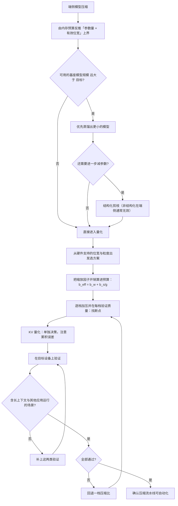

# 面向端侧的模型压缩：量化、蒸馏与剪枝

> 位置：[InferenceAtlas](../../INDEX.md) > [模块 10](README.md) > 当前文档
> 信息截至：2026-07-29 ｜ 最后核验：2026-07-29 ｜ 内容版本：v0.1
> 时效性等级：低
> 相关主题：[移动 SoC 与内存约束](02_mobile_npu_soc_and_memory_constraints.md)｜[量化 kernel](../04_compilers_runtimes_and_kernels/09_quantization_kernels.md)｜`06_small_language_models_and_on_device_agents.md`

## 本章导读

模型压缩在云端与端侧的目标不同，**这个差异决定了技术选择**：

**云端的压缩是为了「更快、更便宜」**——
它是一个优化问题，不压缩也能跑。

**端侧的压缩常常是为了「能不能跑」**——
它是一个可行性问题。
**在内存预算之下，未压缩的模型根本装不进去**。

这个差异有两个直接后果：

**第一，端侧能接受更激进的压缩**。
云端会为了保住质量而选择保守的位宽，
**端侧的替代方案是「这个功能做不了」**——
**所以可接受的质量损失阈值不同**。

**第二，三种手段的关系不同**。
云端的量化、蒸馏、剪枝大体是可选的替代方案；
**端侧它们通常需要叠加使用**，
**而叠加的效果不是简单相乘**——
**先蒸馏出一个小模型再量化，通常优于把大模型激进量化**。

本章给出**三种手段的作用机制与它们在端侧的组合顺序**、
**为什么「先蒸馏再量化」通常优于「激进量化大模型」**、
**端侧量化相对云端的三个额外约束**、
以及**端侧压缩的验证要求**。

**关于数值的说明**：受出口策略限制
（详见 [AGENTS.md 第 11 节](../../AGENTS.md)），
本章不给出任何具体的压缩比、精度损失或模型规格数值——
**这些必须在自己的任务与目标设备上实测**。

## 学习目标

读完本章后，读者应能够：

1. 说明端侧压缩与云端压缩在目标上的根本差异及其后果
2. 比较量化、蒸馏、剪枝三种手段的作用机制与各自省下的资源
3. 解释为什么「先蒸馏再量化」通常优于「激进量化大模型」
4. 列出端侧量化相对云端的三个额外约束
5. 设计端侧压缩的验证方案，并说明为什么必须在目标设备上验证

## 核心结论

- **端侧压缩常是可行性问题而非优化问题**，因此可接受的质量损失阈值高于云端。
- **三种手段省的资源不同**：量化省位宽、剪枝省参数量、蒸馏省的是模型规模本身。
- **「先蒸馏再量化」通常优于「激进量化大模型」**：小模型的每个参数承载更多信息，但它在低位宽下的相对鲁棒性通常更好，因为压缩是分两步各自在合适的维度上做的。
- **端侧量化有三个额外约束**：硬件支持的位宽与粒度有限、缩放因子的存储开销不可忽略、以及 KV 量化的误差在长对话中累积。
- **压缩必须在目标设备上验证**，因为硬件的算子与精度支持决定了方案是否真的可用。
- **压缩后的质量验证必须包含长上下文场景**，因为 KV 量化的误差随生成累积。

## 1. 问题定义、系统边界与工作负载

### 1.1 端侧压缩的目标

$$
M_{\text{weight}}(b_w) + S_{\max}\cdot m_{\text{tok}}(b_{kv}) + M_{\text{act}} \le M_{\text{budget}}
$$

**压缩的作用是让这个不等式成立**。

**与云端的目标对比**：

| 维度 | 云端 | 端侧 |
|---|---|---|
| 主要目标 | 更快、更便宜 | **能否装下** |
| 不压缩的后果 | 成本高 | **功能不可用** |
| 可接受的质量损失 | 较低 | **较高**（替代方案是没有这个功能） |
| 位宽选择的驱动 | 收益 vs 风险 | **预算的硬约束** |

**第二行是根本差异**，它导致第三行。

### 1.2 本章不涉及

压缩的训练侧细节（属于模型训练范畴）、
量化 kernel 的实现（见 [模块 04 第 9 章](../04_compilers_runtimes_and_kernels/09_quantization_kernels.md)）、
小模型的能力边界（见 `06_small_language_models_and_on_device_agents.md`）。

## 2. 原理、数学与性能模型

### 2.1 三种手段省的资源不同

| 手段 | 机制 | 直接省下 | 对 TPOT 的影响 |
|---|---|---|---|
| **量化** | 降低每个参数的位宽 | **字节数** | 直接（带宽受限下线性） |
| **剪枝** | 去掉部分参数或结构 | **参数数量** | 取决于是否结构化 |
| **蒸馏** | 训练一个更小的模型 | **模型规模本身** | 直接 |

**关键区分在「剪枝」这一行**：

- **非结构化剪枝**（去掉单个权重）在理论上减少参数量，
  **但如果硬件不支持稀疏计算，实际的内存占用与访存量可能不下降**——
  因为稀疏矩阵仍需存储索引，且访存不规则；
- **结构化剪枝**（去掉整个注意力头、整层、或整个中间维度）
  **直接减少了实际的张量尺寸**，
  **因此在任何硬件上都能兑现收益**。

**在端侧，结构化剪枝几乎总是唯一实用的选择**，
**因为端侧硬件对稀疏计算的支持通常有限**。

**这是一个端侧特有的判断**：
云端可以指望专用的稀疏 kernel，端侧通常不能。

### 2.2 为什么「先蒸馏再量化」通常更好

**这是本章最重要的一个判断**。

考虑两条路径达到同样的内存占用：

| 路径 | 做法 |
|---|---|
| A | 把大模型激进量化到很低的位宽 |
| B | **先蒸馏出小模型，再用较温和的位宽量化** |

**两条路径的内存占用可以相同**：

$$
M_A = P_{\text{large}} \times b_{\text{aggressive}} \approx P_{\text{small}} \times b_{\text{moderate}} = M_B
$$

**但质量通常不同，且 B 往往更好**。三个原因：

**（一）量化误差随位宽下降是非线性的**。
存在一个位宽，低于它之后误差从「可忽略」跳到「任务失败」
（见 [模块 04 第 9 章](../04_compilers_runtimes_and_kernels/09_quantization_kernels.md)）。
**路径 A 更可能越过这个断点，而路径 B 停留在安全区**。

**（二）蒸馏是有监督的压缩，量化是无监督的**。
蒸馏在训练中优化「小模型模仿大模型」这个目标，
**因此它可以选择保留哪些能力**；
**而量化是对已有权重的均匀降精度，无法做这种选择**。

**（三）两步分别在合适的维度上做**。
蒸馏减少的是「参数的数量」，
量化减少的是「每个参数的精度」——
**两者作用在不同维度，因此可以各自停在安全范围内**，
**而不是把单一维度推到极限**。

**这个判断的实践含义**：
**如果端侧的目标模型规模远小于可用的大模型，
应当优先考虑蒸馏而不是把大模型量化到极限**。

**但要注意 B 的代价**：
**蒸馏需要训练资源与时间**，
**而量化通常可以在部署阶段完成**。
**所以 B 在工程流程上重得多**——
这是一个真实的权衡而不是无条件的优选。

### 2.3 端侧量化的三个额外约束

**（一）硬件支持的位宽与粒度有限**

云端可以为任意量化方案写 kernel；
**端侧受限于平台已有的算子实现**。

**因此端侧量化方案的选择应当从「硬件支持什么」出发**，
**而不是从「哪个方案理论上最好」出发**——
**一个没有高效 kernel 的量化方案在端侧等于不可用**
（这与 [模块 02 第 2 章](02_mobile_npu_soc_and_memory_constraints.md) 的算子覆盖问题同源）。

**（二）缩放因子的存储开销不可忽略**

细粒度分组量化的有效位宽是

$$
b_{\text{eff}} = b_w + \frac{b_s}{g}
$$

**在内存是硬约束的端侧，这个额外开销必须被算进预算**。

**举例说明量级**（不涉及具体设备）：
若 $b_s = 16$、$g = 32$，则额外 0.5 位/参数；
**对 4 位量化，有效位宽是 4.5 位——即多了 12.5% 的内存**。
**若 $g = 16$，额外 1 位，有效位宽 5 位，多了 25%**。

**因此组大小的选择在端侧是一个内存预算问题，
而不只是精度问题**。

**（三）KV 量化的误差在长对话中累积**

权重量化的误差是静态的、一次性的；
**KV 量化的误差会累积**——
早期 token 的 KV 被量化后，
**所有后续 token 都在读这个有误差的表示**。

**在端侧这一点尤其重要**，因为：

1. 端侧的 KV 量化通常更激进（内存更紧）；
2. **端侧的长对话场景很常见**（个人助手类应用）；
3. **而累积误差只在长对话下才显现**——
   **短时测试发现不了**。

**缓解方式是保留最近若干 token 的 KV 为高精度**
（见 [模块 02 第 8 章](../02_transformer_and_kv_cache/08_kv_cache_compression_quantization_and_eviction.md)）。

### 2.4 压缩的组合效应

三种手段可以叠加，**但收益不是简单相乘**：

$$
\text{压缩比}_{\text{总}} \le \text{压缩比}_{\text{蒸馏}} \times \text{压缩比}_{\text{剪枝}} \times \text{压缩比}_{\text{量化}}
$$

**取「小于等于」的原因**：

1. **一个已经蒸馏过的小模型，冗余更少，因此剪枝空间更小**；
2. **一个已经剪枝过的模型，权重分布可能更集中，量化的相对误差可能更大**；
3. **缩放因子等开销在小模型上占比更高**。

**因此实践中的顺序建议是**：

```text
1. 先确定内存预算与目标模型规模        （预算反推）
2. 蒸馏或选择合适规模的基座模型         （减少参数量）
3. 结构化剪枝（若还需要且有空间）       （进一步减参数）
4. 量化到硬件支持的、精度安全的位宽     （减位宽）
5. KV 量化（单独决策，注意累积误差）    （减 KV）
6. 在目标设备上验证                     （必须）
```

**第 1 步在最前面是端侧的特征**
（见 [第 1 章](01_edge_inference_overview.md) 2.4 的设计顺序反转）。

**第 5 步单独列出**是因为 KV 量化的风险性质与权重量化不同
（累积 vs 静态）。

## 3. 实现机制与系统设计

### 3.1 从预算反推压缩目标

$$
P_{\text{model}} \times b_{\text{eff}} \le M_{\text{budget}} - S_{\max}\cdot m_{\text{tok}} - M_{\text{act}}
$$

**给定预算与目标上下文长度，这个式子给出「参数量 × 有效位宽」的上界**。

**它有多个解**，例如：

| 方案 | 参数量 | 有效位宽 |
|---|---|---|
| 大模型激进量化 | 大 | 很低 |
| **中等模型温和量化** | 中 | 中 |
| 小模型高精度 | 小 | 高 |

**由 2.2，中间的方案通常质量最好**——
**因为它避开了两个维度各自的极限**。

**因此这个式子的正确用法不是「取一个极端解」，
而是「在解空间中找一个两个维度都在安全区的点」**。

### 3.2 端侧压缩的验证要求

**必须在目标设备上验证，而不只是在服务器上模拟**。三个理由：

| 理由 | 说明 |
|---|---|
| **算子支持** | 服务器上能跑的量化方案，端侧可能没有 kernel |
| **实际性能** | 端侧带宽与算力不同，收益比例不同 |
| **持续运行** | 降频、内存压力只在真实设备上出现 |

**验证清单**：

| 项 | 为什么 |
|---|---|
| 模型能否加载（内存是否够） | 最基本 |
| **在有其他应用运行时能否加载** | **真实场景** |
| TPOT 是否可接受 | 体验 |
| **长对话下的 TPOT 衰减** | KV 占比上升 |
| 任务质量（在目标任务上） | 压缩的代价 |
| **长上下文下的质量** | **KV 量化的累积误差** |
| 持续运行的热与电池 | 可持续性 |

**加粗的三项是端侧特有且最容易被遗漏的**。

### 3.3 质量验证的设计

**压缩后的质量验证有一个端侧特有的困难**：
**目标设备上跑完整评测集的成本很高**（慢、耗电）。

**实用的分层方案**：

| 层 | 在哪跑 | 内容 |
|---|---|---|
| 快速筛选 | 服务器（模拟量化） | 全量评测集 |
| **确认** | **目标设备** | **缩减的关键子集** |
| 长上下文专项 | 目标设备 | **长对话样本**（KV 累积误差） |

**第二层的关键是「子集要有代表性」**：
**应当包含服务器上表现最差的那些样本**，
**因为它们最可能在端侧的实际实现下进一步劣化**。

**第三层不可省略**——
**它检测的是短样本上完全不显现的问题**。

### 3.4 压缩与硬件的协同

由 [第 2 章](02_mobile_npu_soc_and_memory_constraints.md) 3.3：
**端侧的硬件约束更硬，因此模型结构需要向硬件妥协**。

**这对压缩的含义**：

1. **结构化剪枝的粒度应当与硬件的分块对齐**——
   剪掉的维度若不对齐，实际收益会打折；
2. **量化的位宽与粒度应当从硬件支持出发**；
3. **蒸馏时的目标结构应当考虑算子覆盖**——
   **一个用了 NPU 不支持的算子的小模型，
   可能比一个稍大但全部被支持的模型更慢**
   （见 [第 2 章](02_mobile_npu_soc_and_memory_constraints.md) 2.3 的切换开销）。

**第三点是一个反直觉但重要的判断**：
**「更小」不一定「更快」，要看它能不能跑在高效的单元上**。

### 3.5 压缩方案的可维护性

**端侧压缩的一个工程代价是它与模型迭代的耦合**：

| 变化 | 需要重做什么 |
|---|---|
| 基座模型更新 | **蒸馏要重做**（成本最高） |
| 量化方案调整 | 重新量化 + 重新验证 |
| 目标设备变化 | **可能全部重来**（算子支持不同） |

**因此端侧压缩的流水线应当是自动化的**，
**否则每次模型更新都会成为一个大工程**。

**这也是「先蒸馏再量化」路径的一个隐含代价**（见 2.2）：
**它把最重的一步（蒸馏）放进了迭代循环**。

## 4. 性能、成本、能耗与可靠性 trade-off

### 4.1 压缩程度与质量的非线性

**压缩比与质量损失的关系不是线性的**：
在某个范围内质量几乎不变，
**超过某个点后迅速劣化**。

**端侧的困难在于这个点的位置依赖模型、任务与量化粒度，
必须实测**。

**实践建议**：
**从保守方案开始，逐步加压并在每一档验证**，
**而不是直接跳到目标压缩比**。
**这样能找到那个断点的位置，而不是越过它之后才发现**。

### 4.2 内存、速度与电池的一致性

在端侧的带宽受限工作点下：

$$
\tau_{\text{step}} \propto M_{\text{weight}} + M_{\text{KV,read}}
$$

**压缩同时减少了内存占用、单步时延与内存访问能耗**——
**三个目标在端侧是一致的**。

**这与云端不同**：云端在算力受限时，
减少访存不一定改善速度。

**因此端侧的压缩收益是「三合一」的**，
这提高了压缩投入的性价比。

### 4.3 激进压缩的可靠性风险

**质量的劣化不是均匀的**：
压缩后模型可能在多数输入上表现正常，
**而在少数输入上明显失败**。

**这类失败的特征是**：
不产生错误、输出仍然流畅、**只是内容变差**——
**与 [模块 11 第 7 章](../11_benchmarking_reliability_and_observability/07_observability_metrics_logs_traces.md)
讨论的质量回归同构**。

**在端侧检测它更困难**，因为：

1. 无法像云端那样持续采集输出做质量分析（隐私与流量）；
2. 用户反馈的延迟更长、更稀疏。

**因此端侧的质量验证必须在发布前做得更充分**，
**因为发布后的检测能力弱得多**。

**这是端侧与云端在质量保障上的一个结构性差异**。

## 5. benchmark、真实案例或公开部署案例

**本章不给出任何具体的压缩比、精度损失或模型规格数值**。

受当前环境的网络出口策略限制（详见 [AGENTS.md 第 11 节](../../AGENTS.md)），
本库无法核验任何公开的压缩效果数据，
**因此不引用任何此类数字**。
**而且这类数字高度依赖模型、任务与硬件，本来也不能直接迁移**。

**读者应自行完成的压缩验证表**：

| 项 | 你的值 | 备注 |
|---|---|---|
| 内存预算（见 [第 1 章](01_edge_inference_overview.md)） | 待填 | 保守取值 |
| 目标上下文长度与由此算出的 KV 占用 | 待填 | — |
| 由预算反推的「参数量 × 有效位宽」上界 | 待填 | 计算 |
| 目标设备支持的量化位宽与粒度 | 待填 | **实测：有无高效 kernel** |
| 选定的组大小 $g$ 与有效位宽 $b_w + b_s/g$ | 待填 | **额外开销必须算进预算** |
| **不同压缩档位下的质量（逐档验证）** | 待填 | **找出断点位置** |
| **长上下文下的质量** | 待填 | **KV 累积误差** |
| 在目标设备上的 TPOT | 待填 | `独立可复现实验` |
| 长对话下 TPOT 的衰减 | 待填 | KV 占比上升 |
| 有其他应用运行时能否加载 | 待填 | **真实场景** |
| 压缩流水线是否自动化 | 是/否 | 决定迭代成本 |

**倒数第五行与倒数第四行是本表最关键的两项**：
**逐档验证能找到质量断点的位置，
而长上下文验证检测的是短样本完全不显现的问题**。

> 实验方法论要求见 [如何读推理 benchmark](../00_start_here/03_how_to_read_inference_benchmarks.md)。

## 6. 设计决策框架



**图解读**：

1. **本图展示什么**：端侧压缩的决策与验证流程。
   **起点是预算反推，终点是可自动化**——
   后者决定了模型迭代的成本。
2. **核心瓶颈**：瓶颈在 C 节点。
   **「基座模型是否远大于目标」这个判断决定了要不要蒸馏**——
   而蒸馏是最重的一步（需要训练资源且进入迭代循环）。
   **如果规模差距不大，直接量化在工程上轻得多**。
3. **图中的 trade-off**：J 节点的逐档验证比直接跳到目标压缩比慢，
   **但它能找到质量断点的位置**——
   **而直接跳过去可能已经越过断点却不自知**。
4. **面试如何引用**：可以说
   「端侧压缩我会从内存预算反推『参数量 × 有效位宽』的上界；
   **如果基座远大于目标，先蒸馏再温和量化通常优于激进量化大模型**——
   因为两步分别在不同维度上做，各自都能停在安全区」。

**M 节点的两类验证不可省略**：
长上下文（KV 累积误差）与有其他应用运行（内存压力）
**都是短时干净测试发现不了的**。

## 7. 常见失败模式与排查路径

| 症状 | 根因 | 修正 |
|---|---|---|
| 按标称位宽算内存够，实际装不下 | 漏算缩放因子开销 | 用 $b_w + b_s/g$ |
| 服务器上验证通过，端侧跑不了 | 硬件无对应的量化 kernel | 从硬件支持出发选方案 |
| 短对话正常，长对话质量下降 | KV 量化误差累积 | 保留最近 token 高精度；补长上下文验证 |
| 剪枝后内存没减少 | 非结构化剪枝，硬件不支持稀疏 | 改结构化剪枝 |
| 更小的模型反而更慢 | 用了 NPU 不支持的算子，回退 | 蒸馏时考虑算子覆盖 |
| 质量突然大幅下降 | 越过了量化的断点 | 逐档验证找断点；回退一档 |
| 每次模型更新都要重做大工程 | 压缩流水线未自动化 | 自动化 |
| 发布后才发现质量问题 | 端侧检测能力弱 | 发布前验证要更充分 |

**排查顺序**：**先确认有效位宽算对了，
再确认硬件支持，最后看质量是否越过断点**。

## 8. 关联面试主题

1. 量化的三个维度与各自省什么——见 [Q050](../17_interview_prep/04_compiler_kernel_and_quantization_questions.md)
2. 量化粒度与有效位宽——见 [Q051](../17_interview_prep/04_compiler_kernel_and_quantization_questions.md)
3. 量化精度回退的分层定位——见 [Q053](../17_interview_prep/04_compiler_kernel_and_quantization_questions.md)
4. 端侧的内存与量化策略——见 [Q087](../17_interview_prep/06_hardware_and_datacenter_questions.md)
5. 输出质量回归的检测——见 [Q093](../17_interview_prep/07_debug_benchmark_and_reliability_questions.md)

## 9. 小结

端侧压缩与云端压缩的根本差异是**目标不同**：
云端是优化问题（不压缩也能跑），
**端侧常是可行性问题（不压缩装不下）**。
**因此端侧可接受的质量损失阈值更高**——
替代方案是「这个功能做不了」。

**四条核心结论**：

**第一，三种手段省的资源不同**：
量化省位宽、剪枝省参数量、蒸馏省模型规模本身。
**其中剪枝在端侧几乎只有结构化的才实用**——
非结构化剪枝依赖硬件的稀疏支持，而端侧通常没有。

**第二，「先蒸馏再量化」通常优于「激进量化大模型」**。
两条路径可以达到相同的内存占用，
**但前者把压缩分摊在两个维度上，各自都停在安全区**，
而后者把单一维度推到极限、更可能越过质量断点。
**代价是蒸馏需要训练资源且进入模型迭代循环**——
所以这是一个真实的权衡而非无条件的优选。

**第三，端侧量化有三个额外约束**：
硬件支持的位宽与粒度有限（**没有高效 kernel 的方案等于不可用**）、
缩放因子的存储开销必须算进预算（$b_{\text{eff}} = b_w + b_s/g$）、
以及 **KV 量化的误差在长对话中累积**——
而端侧的长对话场景恰恰很常见，**且短时测试发现不了**。

**第四，压缩收益在端侧是「三合一」的**：
带宽受限下，减少字节同时改善内存占用、单步时延与访存能耗。
**三个目标一致，这提高了压缩投入的性价比**——
而云端在算力受限时不具备这个性质。

**两条验证上的要求**：
**必须在目标设备上验证**（算子支持、实际性能、持续运行都只在真实设备上体现），
**且必须包含长上下文与「有其他应用运行」两类场景**——
它们分别检测 KV 累积误差与内存压力，**都是短时干净测试发现不了的**。

一个反直觉的判断：**「更小」不一定「更快」**——
一个用了硬件不支持的算子的小模型，
**可能因为频繁回退而比稍大但全部被支持的模型更慢**。
**因此蒸馏时的目标结构应当考虑算子覆盖**。

本章不给出任何具体的压缩比或精度损失数值——
当前环境无法核验，**而且这类数字高度依赖模型、任务与硬件，本来也不能直接迁移**。

## 关键术语

| 中文术语 | 英文 | 定义 | 单位/口径 | 关联文档 |
|---|---|---|---|---|
| 结构化剪枝 | structured pruning | 去掉整个头/层/维度，直接减小张量尺寸 | — | 本章 2.1 |
| 非结构化剪枝 | unstructured pruning | 去掉单个权重，依赖稀疏支持 | — | 本章 2.1 |
| 蒸馏 | distillation | 训练小模型模仿大模型的行为 | — | 本章 2.2 |
| 有效位宽 | effective bit width | 含缩放因子开销的实际位宽 $b_w + b_s/g$ | 位 | 本章 2.3 |
| 质量断点 | quality cliff | 低于某位宽后质量迅速劣化的点 | 位 | 本章 4.1 |

## 延伸阅读

- [边缘推理的约束条件与价值主张](01_edge_inference_overview.md)
- [移动 SoC、NPU 与内存约束](02_mobile_npu_soc_and_memory_constraints.md)
- [量化 kernel](../04_compilers_runtimes_and_kernels/09_quantization_kernels.md)
- [KV cache 压缩、量化与驱逐](../02_transformer_and_kv_cache/08_kv_cache_compression_quantization_and_eviction.md)
- [面试题组：Compiler、kernel、量化与 runtime](../17_interview_prep/04_compiler_kernel_and_quantization_questions.md)

## 主要来源

本章由 [模块 04 第 9 章](../04_compilers_runtimes_and_kernels/09_quantization_kernels.md) 的量化误差与粒度模型、
[模块 02 第 8 章](../02_transformer_and_kv_cache/08_kv_cache_compression_quantization_and_eviction.md) 的 KV 量化分析、
以及本模块第 1–2 章的端侧约束推导而成。

**不含任何需要外部核验的压缩比、精度损失或模型规格数值**。
受当前环境的网络出口策略限制，本库无法核验公开的压缩效果数据
（详见 [AGENTS.md 第 11 节](../../AGENTS.md)）。
**且这类数字高度依赖模型、任务与硬件，不能直接迁移**。

| 类别 | 说明 | 披露标签 |
|---|---|---|
| 三种手段的机制、组合顺序、有效位宽关系 | 由模块 02、04 推导 | — |
| 「先蒸馏再量化」的三个理由 | 由压缩机制分析推导 | — |
| 读者自行完成的压缩验证 | 应在目标设备上实测 | `独立可复现实验` |
| 任何具体的压缩比与精度损失数值 | **本章未给出** | `待核实` |

## 更新记录

| 日期 | 版本 | 变更 | 核验人 |
|---|---|---|---|
| 2026-07-29 | v0.1 | 初稿：三种手段的资源区分、先蒸馏再量化的理由、端侧量化的三个额外约束、目标设备验证要求 | — |
