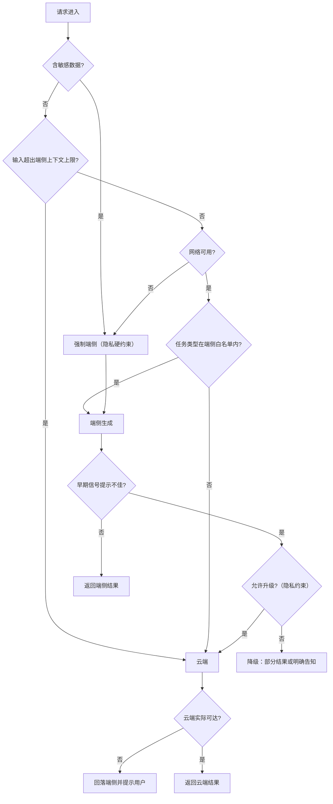

# 云-边混合与隐私优先架构

> 位置：[InferenceAtlas](../../INDEX.md) > [模块 10](README.md) > 当前文档
> 信息截至：2026-07-29 ｜ 最后核验：2026-07-29 ｜ 内容版本：v0.1
> 时效性等级：低
> 相关主题：[小模型与端侧 agent](06_small_language_models_and_on_device_agents.md)｜`09_edge_deployment_case_studies.md`｜[模型路由与级联系统](../03_serving_engines_and_scheduling/07_model_routing_and_cascade_systems.md)

## 本章导读

端云混合架构的设计困难不在于「怎么分流」，
**而在于「分流会判断错」这个前提如何被系统性地处理**。

任何分流规则都基于对请求的预判——
而预判必然有错。**因此一个只有分流规则的系统是不完整的**，
它必须同时具备：

**事后升级路径**（端侧做完发现不满意，升级到云端）、
**云端不可达时的回落**（离线或网络故障时仍然可用）、
以及**分流器本身的可评测性**（否则无法知道它有多准）。

本章的第二条主线是**隐私约束改变了整个架构的性质**。
在隐私是硬需求的场景下，
**「哪些数据可以出设备」不是一个可以权衡的优化目标，而是一个硬边界**——
它可能直接排除事后升级这条路径
（因为升级意味着把内容发到云端）。

**这个冲突是本章最需要说清的部分**：
**隐私优先的架构与「端侧兜底、云端补强」的架构在结构上是不同的**。

本章给出**分流的四类判据与它们的可靠性排序**、
**事后升级与并行发起的取舍**、
**隐私硬约束下架构的变形**、
以及**分流器作为一个可评测组件的设计**。

**关于数值的说明**：受出口策略限制
（详见 [AGENTS.md 第 11 节](../../AGENTS.md)），
本章不给出任何具体的模型能力、时延或成本数值。

## 学习目标

读完本章后，读者应能够：

1. 列出分流的四类判据并按可靠性排序
2. 说明为什么端云时延的优劣随输出长度非单调，以及它对分流的影响
3. 设计事后升级路径，并比较「早决定」与「并行发起」的取舍
4. 说明隐私硬约束如何改变架构，尤其是它与事后升级的冲突
5. 把分流器当作一个可评测组件来设计，并说明两类错误的代价不对称

## 核心结论

- **分流会判断错，因此系统必须有事后升级与云端不可达的回落两条修正路径**。
- **判据的可靠性排序是：隐私标记（硬约束）> 容量约束（上下文上限）> 任务类型 > 模型置信度**。
- **端云的时延优劣随输出长度非单调**：短输出端侧占优（无网络往返），长输出云端占优（更快的 TPOT）。
- **隐私硬约束会排除事后升级路径**，因为升级意味着内容出设备——这使隐私优先架构在结构上不同。
- **分流器是一个需要独立评测的组件**，且两类错误的代价不对称，因此阈值应按代价加权。
- **离线场景下没有云端降级路径**，此时只能靠更保守的端侧任务边界。

## 1. 问题定义、系统边界与工作负载

### 1.1 混合架构要解决的问题

**端侧与云端各有不可替代的优势**：

| 优势 | 端侧 | 云端 |
|---|---|---|
| 模型能力 | 弱 | **强** |
| 隐私 | **数据不出设备** | 需上传 |
| 离线可用 | **是** | 否 |
| 边际成本 | **零** | 按 token |
| 长输出的速度 | 慢 | **快** |

**混合架构的目标是「在每个请求上取到合适的那一侧」**。

### 1.2 三种混合形态

| 形态 | 结构 | 适合 |
|---|---|---|
| **端侧优先，云端补强** | 默认端侧，不足时升级 | 成本敏感；隐私要求不硬 |
| **云端优先，端侧兜底** | 默认云端，离线时端侧 | 质量优先；需要离线可用 |
| **隐私优先** | 敏感数据强制端侧，其余可云端 | **隐私是硬需求** |

**第三种在结构上与前两种不同**（见 2.4），
**因为它的边界不是性能判断而是硬约束**。

### 1.3 本章不涉及

具体的模型能力对比（本库无法核验）、
端侧模型的任务边界（见 [第 6 章](06_small_language_models_and_on_device_agents.md)）、
云端的路由与级联（见 [模块 03 第 7 章](../03_serving_engines_and_scheduling/07_model_routing_and_cascade_systems.md)）。

## 2. 原理、数学与性能模型

### 2.1 四类分流判据与可靠性排序

| 判据 | 性质 | 可靠性 | 说明 |
|---|---|---|---|
| **隐私标记** | **硬约束** | **最高** | 不可权衡；由数据分类决定 |
| **容量约束** | **硬约束** | **高** | 输入超出端侧上下文上限则必须云端 |
| 任务类型 | 启发式 | 中 | 由产品逻辑给出，比模型判断可靠 |
| 网络与电量状态 | 环境 | 中 | 无网络只能端侧；低电量倾向云端 |
| **模型置信度** | 启发式 | **最低** | **小模型的置信度校准通常更差** |

**排序的实践含义**：
**硬约束应当在最前面被检查**（它们不需要判断，只需要查询），
**启发式判断放在后面且必须配修正路径**。

**最后一行的警示**：
**不要把模型自身的置信度作为主要判据**
（见 [第 6 章](06_small_language_models_and_on_device_agents.md) 3.1）。

**网络与电量这一行有一个内部矛盾**：
**低电量倾向云端（省电池），而这与省成本的方向相反**——
**这是一个产品取舍而非技术判断**。

### 2.2 时延的非单调性

由 [第 1 章](01_edge_inference_overview.md) 2.3：

$$
T^{\text{端}} = \text{TTFT}_{\text{local}} + (N-1)\,\tau^{\text{端}}
$$
$$
T^{\text{云}} = T_{\text{net}} + \text{TTFT}_{\text{cloud}} + (N-1)\,\tau^{\text{云}}
$$

**端侧没有 $T_{\text{net}}$ 但 $\tau^{\text{端}} > \tau^{\text{云}}$**。

令两者相等，解出**交叉输出长度**：

$$
N^{*} = 1 + \frac{T_{\text{net}} + \text{TTFT}_{\text{cloud}} - \text{TTFT}_{\text{local}}}{\tau^{\text{端}} - \tau^{\text{云}}}
$$

**读法**：

- **$N < N^{*}$：端侧更快**（网络往返的固定开销占主导）；
- **$N > N^{*}$：云端更快**（更快的 TPOT 累积起来超过了网络开销）。

**三个实践含义**：

1. **「端侧更快」不是无条件的**，
   **它取决于输出长度**；
2. **$N^{*}$ 可以被估算**：
   已知网络往返、两侧的 TPOT，就能算出来——
   **而这给出了一个基于输出长度的分流判据**；
3. **但输出长度事先未知**——
   **这正是分流困难的一个具体来源**，
   也是事后升级路径存在的理由之一。

**注意 $N^{*}$ 随网络质量变化**：
网络差时 $T_{\text{net}}$ 大，$N^{*}$ 上升，端侧的优势范围扩大。
**因此分流判据应当考虑当前的网络状况**。

### 2.3 事后升级：早决定 vs 并行发起

**分流判断错时需要修正**。两种做法：

| 做法 | 机制 | 用户体验 | 成本 |
|---|---|---|---|
| **早决定升级** | 端侧生成早期就判断是否升级 | 一次等待 + 部分重来 | 低 |
| **并行发起** | 端侧与云端同时开始，择优 | **最快** | **高（部分请求白算）** |

**并行发起的成本模型**：

设并行比例为 $p$（多少比例的请求走并行），
云端单请求成本为 $c_{\text{cloud}}$，
则额外成本为

$$
\Delta C = p \cdot c_{\text{cloud}} \times (\text{云端结果未被采用的比例})
$$

**即使云端结果被采用，端侧的计算也白做了**（但端侧边际成本为零，可忽略）；
**云端结果未被采用时，那次云端调用是纯浪费**。

**因此并行发起只对高价值场景合理**，
**而「高价值」需要被产品明确定义**。

**早决定升级的关键是「早」**：
**在生成的前若干个 token 就判断，而不是全部生成完再判断**——
**否则用户会经历两次完整的等待**。

**可用于早期判断的信号**：

| 信号 | 说明 |
|---|---|
| 结构校验失败 | 结构化输出场景下最可靠 |
| 输出的早期特征 | 例如立刻开始重复、或明显偏离主题 |
| 显式的能力声明 | 模型被训练成在不确定时输出特定标记 |

**第三项需要在训练阶段介入**，但它是最可控的。

### 2.4 隐私硬约束下的架构变形

**这是本章最需要说清的一点**。

**在隐私是硬需求的场景下**：

```text
普通混合架构：
  端侧尝试 → 不满意 → 升级到云端 ✓

隐私优先架构：
  端侧尝试 → 不满意 → 升级到云端 ✗（内容不能出设备）
                    → 只能：降低期望 / 提示用户 / 用户显式授权
```

**因此隐私优先架构失去了「事后升级」这条修正路径**。

**它的后果是**：

1. **端侧的任务边界必须更保守**——
   因为没有兜底；
2. **降级路径必须是「向下」而不是「向外」**——
   例如给出部分结果、或明确告知无法完成；
3. **如果要保留升级选项，必须由用户显式授权**——
   **而这个授权应当是逐次的还是一次性的，是一个产品与合规判断**。

**一个中间方案是「脱敏后升级」**：
把敏感部分去除或替换后再送云端。
**但它的可靠性取决于脱敏的完备性**——
**而自然语言的脱敏很难做到完备**，
**因此它不应当被当作等同于「数据不出设备」的保证**。

**这一点必须向产品与合规明确说明**，
**不能把「脱敏后上传」表述成「数据不出设备」**。

### 2.5 分流器的两类错误

| 错误 | 后果 | 代价 |
|---|---|---|
| **本该云端却留在端侧** | 质量差 | **用户可感知，且可能不自知** |
| 本该端侧却送到云端 | 成本浪费；隐私暴露（若适用） | 成本可量化 |

**两类错误的代价不对称**，因此：

$$
\text{阈值应按代价加权，而非取对称}
$$

**而权重取决于场景**：

| 场景 | 哪类错误更严重 |
|---|---|
| 隐私敏感 | **第二类**（不该出设备的出去了） |
| 质量敏感 | **第一类**（该用大模型的没用） |
| 成本敏感 | 第二类 |

**因此分流阈值不是一个技术常数，而是一个由场景决定的产品参数**。

## 3. 实现机制与系统设计

### 3.1 分流的分层结构



**图解读**：

1. **本图展示什么**：分层的分流决策。
   **硬约束（隐私、容量、网络）在前，启发式（任务类型）在后**，
   **最后是两条修正路径：早期升级与云端不可达回落**。
2. **核心瓶颈**：瓶颈在 J 节点。
   **「允许升级吗」这个判断是隐私优先架构与普通混合架构的分界**——
   在隐私硬约束下这条路被切断，
   **此时只能向下降级（K 分支），而不能向外升级**。
3. **图中的 trade-off**：I 节点的早期判断越早，
   重来的代价越小但判断越不准。
   **这是「早决定」路径的核心取舍**。
4. **面试如何引用**：可以说
   「我会把硬约束放在最前面——隐私、上下文上限、网络可用性；
   启发式判断放后面并配两条修正路径：
   **早期升级与云端不可达的回落**；
   **而隐私硬约束会切断升级这条路，使架构在结构上不同**」。

**M→N 分支不可省略**：
**云端不可达时必须回落而不是报错**，
**且应当明确告知用户结果来自较弱的模型**——
静默降级会让用户对质量下降感到困惑。

### 3.2 分流器的评测

**分流器是一个独立的组件，必须被独立评测**。

**评测指标**：

| 指标 | 定义 |
|---|---|
| 第一类错误率 | 本该云端却留在端侧的比例 |
| 第二类错误率 | 本该端侧却送云端的比例 |
| **加权错误代价** | 两者按场景权重加权 |
| 端侧承载比例 | 实际走端侧的比例（成本相关） |

**评测的困难在于「本该」的标注**：
**需要一组标注数据说明每个请求的正确归属**，
**而这个标注本身需要人工判断或用云端结果作为参照**。

**实用做法**：
**采样一部分请求同时在两侧运行，比较结果质量**——
**这既产出了评测数据，也直接量化了差距**。
**代价是这部分请求的云端成本**。

### 3.3 一致性问题

端侧与云端是不同的模型，**因此同一输入的输出不同**。三个后果：

**（一）多轮对话跨端云切换时风格与能力跳变**。

缓解方式是把对话历史完整传递，
**但这与隐私目标冲突**——
**在隐私优先架构下，历史可能不能出设备**，
**从而云端无法获得完整上下文**。

**这是一个真实的冲突，需要明确取舍**：
要么接受跳变，要么在隐私边界内限制跨端云的多轮场景。

**（二）不能用端侧结果做云端的缓存**（它们不等价）。

**（三）评测必须分别做**，
**而且要评测分流决策本身的正确率**，
而不只是两个模型各自的质量（见 3.2）。

### 3.4 离线场景的特殊处理

**离线时云端的全部路径都不可用**：
没有升级、没有回落、没有兜底。

**因此离线场景需要**：

| 要求 | 说明 |
|---|---|
| **更保守的任务边界** | 没有兜底，边界外即失败 |
| 明确的能力说明 | 让用户知道离线时能做什么 |
| **可排队的任务** | 非实时任务可等网络恢复 |

**第三项在某些场景下很有价值**：
**把「现在做不了」变成「稍后自动完成」**，
**这比直接失败的体验好得多**。

### 3.5 成本核算

混合架构的成本是两侧的组合：

$$
C_{\text{total}} = \underbrace{0}_{\text{端侧边际}} + \underbrace{p_{\text{cloud}}\cdot c_{\text{cloud}}}_{\text{云端}} + \underbrace{C_{\text{fixed}}}_{\text{端侧模型的分发与维护}}
$$

**三项的性质不同**：

| 项 | 性质 |
|---|---|
| 端侧边际成本 | **零**（用户承担算力） |
| 云端成本 | 随端侧承载比例下降而下降 |
| **端侧固定成本** | **模型分发、微调流程、多设备适配** |

**第三项常被低估**：
**端侧不是免费的，它把成本从「按 token」变成了「固定投入」**。

**因此混合架构的成本优势需要规模才能兑现**——
**固定成本被足够多的请求摊薄之后才划算**。

**这与 [Q098](../17_interview_prep/08_company_paper_and_strategy_questions.md) 的
「自建 vs 云」是同一个结构**：
**固定成本 vs 变动成本，交叉点由规模决定**。

## 4. 性能、成本、能耗与可靠性 trade-off

### 4.1 分流阈值的调节

**放宽端侧（更多请求走端侧）**：
成本下降、隐私更好、**质量下降**。

**收紧端侧**：
质量上升、**成本上升**、隐私暴露面扩大。

**这个调节应当按 2.5 的加权代价来做**，
**而不是取一个「平衡」的中间值**——
**因为两类错误的代价本来就不对称**。

### 4.2 并行发起的适用边界

由 2.3，并行发起的成本是「云端调用中未被采用的部分」。

**适用条件**：

| 条件 | 说明 |
|---|---|
| 单请求价值高 | 浪费的云端成本相对可接受 |
| 时延极敏感 | 不能承受二次等待 |
| **隐私允许** | **并行意味着内容一定出设备** |

**第三行是一个容易被忽略的约束**：
**并行发起在隐私优先架构下是不可用的**——
它比事后升级更激进，因为它无条件地把内容送到云端。

### 4.3 用户感知的一致性

跨端云的质量与风格差异会被用户感知。
**两种处理姿态**：

| 姿态 | 做法 | 适合 |
|---|---|---|
| 透明 | 明确告知结果来自哪一侧 | 质量差异明显时 |
| 无缝 | 不告知，尽量让差异不可见 | 差异小时 |

**在离线回落场景下应当选择透明**——
**否则用户会对质量下降感到困惑并归因于「产品变差了」**。

## 5. benchmark、真实案例或公开部署案例

**本章不给出任何具体的模型能力、时延或成本数值**。

受当前环境的网络出口策略限制（详见 [AGENTS.md 第 11 节](../../AGENTS.md)），
本库无法核验任何相关数据，**因此不引用任何此类数字**。

**读者应自行完成的混合架构评估**：

| 项 | 你的值 | 备注 |
|---|---|---|
| 隐私分类：哪些数据不能出设备 | 待填 | **由法务/合规给出，见模块 09 第 9 章** |
| 端侧上下文上限 | 待填 | 由内存预算算出 |
| 端侧与云端的 TPOT | 待填 | `独立可复现实验` |
| 网络往返时间 | 待填 | `独立可复现实验` |
| **由上三行算出的交叉输出长度 $N^{*}$** | 待填 | **基于长度的分流判据** |
| 端侧任务白名单 | 待填 | 见第 6 章 |
| **分流器的两类错误率** | 待填 | **需要标注数据** |
| 两类错误的代价权重 | 待填 | **产品判断** |
| 端侧承载比例 | 待填 | 决定云端成本 |
| 端侧的固定成本（分发、微调、适配） | 待填 | **常被低估** |
| 是否允许事后升级（隐私约束下） | 是/否 | **架构分界** |
| 离线时的能力边界与排队机制 | 待填 | 无兜底场景 |

**倒数第二行是架构的分界点**：
**它决定了你在设计的是「端侧兜底、云端补强」还是「隐私优先」架构**，
**而两者在结构上不同**。

> 实验方法论要求见 [如何读推理 benchmark](../00_start_here/03_how_to_read_inference_benchmarks.md)。

## 6. 设计决策框架

见 3.1 的分层分流图。**补充一个用于架构选型的判断顺序**：

1. **有隐私硬约束吗**？
   有 → 隐私优先架构（**无事后升级、无并行发起**）；
   无 → 继续。
2. **需要离线可用吗**？
   需要 → 端侧必须能独立完成核心任务；
   不需要 → 端侧可以只做优化路径。
3. **成本压力大吗**？
   大 → 端侧优先、云端补强；
   小 → 云端优先、端侧兜底。
4. **规模足够摊薄端侧固定成本吗**？
   不够 → **可能不该做端侧**（见 3.5）。

**第 4 步最容易被忽略**：
**端侧的边际成本为零，但固定成本不为零**——
**规模不够时，混合架构的总成本可能高于纯云端**。

## 7. 常见失败模式与排查路径

| 症状 | 根因 | 修正 |
|---|---|---|
| 端侧结果质量差但用户不自知 | 无升级路径或早期信号 | 加早期判断与升级入口 |
| 离线时功能完全不可用 | 降级路径依赖云端 | 设计离线的保守边界与排队 |
| 隐私架构下仍有内容出设备 | 事后升级或并行发起未被禁用 | 按隐私约束切断这两条路径 |
| 「脱敏后上传」被当成数据不出设备 | 脱敏完备性被高估 | 明确说明两者不等价 |
| 分流阈值调不好 | 按对称取值而非按代价加权 | 用两类错误的代价权重 |
| 多轮对话跨端云跳变 | 历史未传递或不能传递 | 明确取舍；或限制跨端云的多轮 |
| 混合架构总成本高于纯云端 | 规模不足以摊薄端侧固定成本 | 重新评估是否该做端侧 |
| 用置信度分流不准 | 小模型置信度校准差 | 改用硬约束 + 产品逻辑 |

**排查顺序**：**先确认硬约束是否被正确执行，
再看修正路径是否存在，最后看阈值是否按代价加权**。

## 8. 关联面试主题

1. 端云协同的判据与失败路径——见 [Q088](../17_interview_prep/06_hardware_and_datacenter_questions.md)
2. 模型路由与级联的经济性——见 [Q039](../17_interview_prep/03_serving_scheduling_and_slo_questions.md)
3. 合规约束转化为技术约束——见 [模块 09 第 9 章](../09_datacenter_power_thermal_and_operations/09_security_compliance_and_data_residency.md)
4. 小模型的任务边界——见 [第 6 章](06_small_language_models_and_on_device_agents.md)
5. 自建、云与 API 的规模判据——见 [Q098](../17_interview_prep/08_company_paper_and_strategy_questions.md)

## 9. 小结

端云混合架构的设计困难不在于「怎么分流」，
**而在于「分流会判断错」这个前提如何被系统性地处理**。

**四条核心结论**：

**第一，任何分流规则都需要两条修正路径**：
事后升级（端侧不满意时转云端）
与云端不可达时的回落。
**只有分流规则的系统是不完整的**。

**第二，判据有明确的可靠性排序**：
隐私标记（硬约束）> 容量约束 > 任务类型 > **模型置信度（最低）**。
**硬约束应当在最前面被检查**，
**而不要把小模型的置信度当作主要判据**——它的校准通常更差。

**第三，端云的时延优劣随输出长度非单调**，
存在一个可以算出来的交叉长度 $N^{*}$：
短输出端侧占优（无网络往返），长输出云端占优（更快的 TPOT）。
**而输出长度事先未知——这正是分流困难的一个具体来源**，
也是事后升级路径存在的理由之一。
**注意 $N^{*}$ 随网络质量变化**，因此判据应考虑当前网络状况。

**第四，隐私硬约束会改变架构的结构**。
它切断了事后升级这条路径（升级意味着内容出设备），
**也排除了并行发起**（后者更激进，无条件上传）。
**因此隐私优先架构的端侧边界必须更保守，
且降级只能「向下」（部分结果、明确告知）而不能「向外」**。
**一个必须说清的点是：「脱敏后上传」不等同于「数据不出设备」**——
自然语言的脱敏很难做到完备，不应被当作等价保证。

两个容易被忽略的实践要点：
**分流器是一个需要独立评测的组件**，
且两类错误的代价不对称，**阈值应按场景权重加权而非取对称中值**；
以及**端侧的边际成本为零但固定成本不为零**——
模型分发、微调流程、多设备适配都是持续投入，
**规模不够时混合架构的总成本可能高于纯云端**。

本章不给出任何具体的能力、时延或成本数值——当前环境无法核验。
第 5 节给出的是一份评估表，
**其中「是否允许事后升级」是架构的分界点**。

## 关键术语

| 中文术语 | 英文 | 定义 | 单位/口径 | 关联文档 |
|---|---|---|---|---|
| 交叉输出长度 | crossover length | 端云时延相等时的输出长度 $N^{*}$ | token 数 | 本章 2.2 |
| 事后升级 | post-hoc escalation | 端侧结果不佳时转到云端 | — | 本章 2.3 |
| 并行发起 | parallel dispatch | 端云同时开始，择优返回 | — | 本章 2.3 |
| 隐私优先架构 | privacy-first architecture | 敏感数据强制端侧且无升级路径 | — | 本章 2.4 |
| 加权错误代价 | weighted error cost | 两类分流错误按场景权重的加权 | — | 本章 2.5 |

## 延伸阅读

- [边缘推理的约束条件与价值主张](01_edge_inference_overview.md)
- [小模型与端侧 agent](06_small_language_models_and_on_device_agents.md)
- [模型路由与级联系统](../03_serving_engines_and_scheduling/07_model_routing_and_cascade_systems.md)
- [物理安全、合规与数据驻留](../09_datacenter_power_thermal_and_operations/09_security_compliance_and_data_residency.md)
- [安全、滥用防护与租户隔离](../11_benchmarking_reliability_and_observability/10_safety_security_and_abuse_controls.md)

## 主要来源

本章由端云时延的分解、
[模块 03 第 7 章](../03_serving_engines_and_scheduling/07_model_routing_and_cascade_systems.md) 的路由与级联模型、
[模块 09 第 9 章](../09_datacenter_power_thermal_and_operations/09_security_compliance_and_data_residency.md) 的合规映射、
以及本模块第 1、6 章的端侧约束推导而成。

**不含任何需要外部核验的模型能力、时延或成本数值**。
受当前环境的网络出口策略限制，本库无法核验相关数据
（详见 [AGENTS.md 第 11 节](../../AGENTS.md)）。

| 类别 | 说明 | 披露标签 |
|---|---|---|
| 四类判据的排序、交叉长度、两类错误的不对称 | 由时延分解与结构分析推导 | — |
| 隐私硬约束下的架构变形 | 由模块 09 第 9 章的合规映射推导 | — |
| 读者自行完成的架构评估 | 应自行实测与判断 | `独立可复现实验` |
| 任何具体的模型能力、时延与成本 | **本章未给出** | `待核实` |

## 更新记录

| 日期 | 版本 | 变更 | 核验人 |
|---|---|---|---|
| 2026-07-29 | v0.1 | 初稿：四类判据的可靠性排序、交叉输出长度、事后升级与并行发起的取舍、隐私硬约束下的架构变形 | — |
