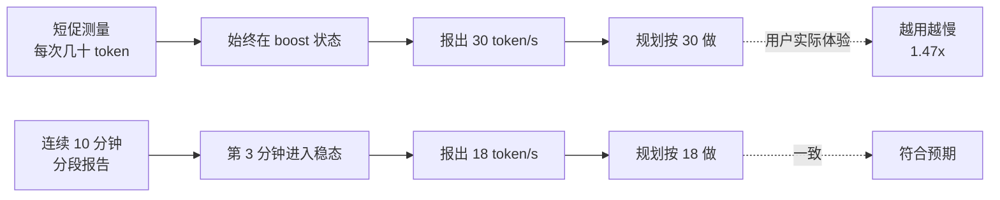
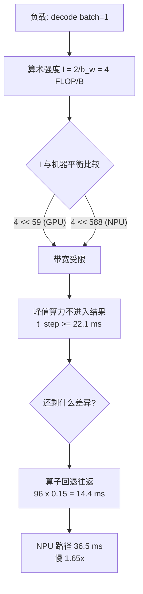
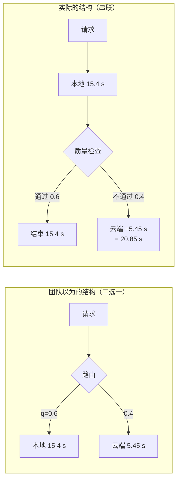
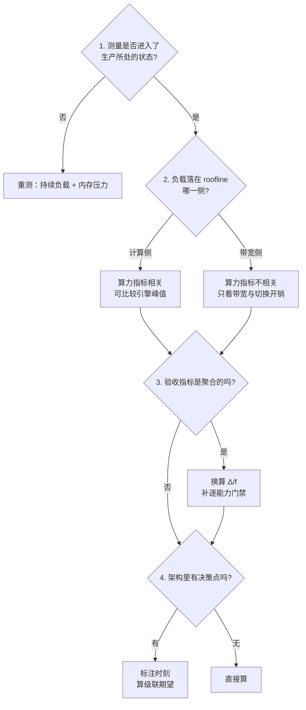

# 端侧部署案例：五个走查

> 位置：[InferenceAtlas](../../INDEX.md) > [模块 10](README.md) > 当前文档
> 信息截至：2026-07-31 ｜ 最后核验：2026-07-31 ｜ 内容版本：v0.1
> 时效性等级：低
> 相关主题：[移动 SoC 与内存约束](02_mobile_npu_soc_and_memory_constraints.md)｜[面向端侧的模型压缩](07_quantization_distillation_and_pruning_for_edge.md)｜[云-边混合架构](08_private_hybrid_cloud_edge_architectures.md)｜[benchmark 案例研究](../11_benchmarking_reliability_and_observability/11_benchmark_case_studies.md)

## 本章导读

本模块前八章给出了端侧推理的约束与机制。
这一章把它们用在五个具体场景上，
**每个场景都是「在开发机上验证通过、在用户设备上不成立」的情形**。

**关于本章数字的说明**：五个案例中出现的全部参数
（内存容量、带宽、吞吐、时延、功耗、成功率）
**都是为演示推导而设定的假设值，不对应任何真实设备或产品**。
受当前环境的网络出口策略限制（详见 [AGENTS.md 第 11 节](../../AGENTS.md)），
本库无法核验任何厂商规格或第三方测试结果，
**因此本章不引用任何外部数据**。
这些假设值的作用是让每一步推导可以被完整走一遍并被读者复算，
**而推导方法本身与具体数值无关**：
换成读者自己设备的实测值，同样的算式依然成立。

五个案例覆盖五类典型错误：

| # | 症状 | 被误用的量 | 依据章节 |
|---:|---|---|---|
| 一 | 演示流畅，用户用一会儿就变慢 | 峰值吞吐当作持续吞吐 | [第 2 章](02_mobile_npu_soc_and_memory_constraints.md) |
| 二 | 模型装得下，但切后台就被杀 | 设备总内存当作可用内存 | [第 2 章](02_mobile_npu_soc_and_memory_constraints.md) |
| 三 | NPU 的 TOPS 高得多，端到端反而慢 | 峰值算力当作端到端能力 | [第 2 章](02_mobile_npu_soc_and_memory_constraints.md)、[第 4 章](04_pc_ai_inference.md) |
| 四 | 困惑度只涨 2.6%，但功能坏了 | 聚合指标当作逐任务行为 | [第 7 章](07_quantization_distillation_and_pruning_for_edge.md) |
| 五 | 上了云边混合，总时延反而升高 | 分支时延当作级联时延 | [第 8 章](08_private_hybrid_cloud_edge_architectures.md) |

## 学习目标

读完本章后，读者应能够：

1. 设计一次能暴露热降频的持续负载测量，并解释为什么降频后每 token 能耗通常反而下降
2. 把内存预算建立在「系统内存压力下本应用的可驻留量」上，而不是设备标称容量
3. 用 roofline 判断某个加速器的算力优势在 decode 阶段是否可能兑现
4. 估算一个聚合指标能掩盖多大的局部退化，并据此设计验收门禁与样本量
5. 写出级联回退架构的期望时延与盈亏平衡条件，并判断本地优先是否真是时延优化

## 核心结论

- **端侧的每个约束都是硬上界，而开发环境系统性地放松了其中之一**：这是五个案例的共同结构。
- **热降频后每 token 能耗通常下降而非上升**，因为峰值频率点在能效拐点之外；追求峰值频率不是续航策略。
- **可用内存是被系统内存压力决定的动态量**，把权重做成只读映射能把「被杀」变成「重新缺页」。
- **decode 阶段是带宽受限的，因此峰值算力的差距在 decode 上不兑现**；异构切分应按阶段而非按算子。
- **聚合指标把集中的损伤稀释了大约「受影响 token 占比的倒数」倍**：2.6% 的困惑度变化可以对应关键 token 上 3.5 倍的概率坍塌。
- **事后检测的回退把两条路径的成本相加**，因此本地优先只有在本地本身就更快时才是时延优化。

## 1. 问题定义、系统边界与工作负载

### 1.1 本章的体裁

不是新的方法，而是**方法的应用走查**。每个案例的结构固定为：

```text
场景与给定数字（假设值）
    ↓
表面结论（看起来合理但错误）
    ↓
发现问题的那一个检查
    ↓
修正后的计算
    ↓
可推广的判据
```

**读者应把重点放在第三步**：
每个案例中真正起作用的都是一个具体的、可以当场执行的检查，
而不是事后的解释。

### 1.2 边界

本章讨论的全部是**已经选定模型与设备之后的部署阶段问题**。
选型阶段的问题（该用多大的模型、该不该上端侧）见
[第 1 章](01_edge_inference_overview.md) 与 [第 6 章](06_small_language_models_and_on_device_agents.md)。

本章不涉及安全认证、合规判断或任何具体平台的规格，
理由见 [第 5 章第 5 节](05_automotive_robotics_and_embedded_inference.md)。

## 2. 原理、数学与性能模型

五个案例用到的量化关系集中列在这里，案例中直接引用。

### 2.1 持续吞吐与能效点

设峰值状态功耗 $P_b$、吞吐 $r_b$，热稳态下功耗 $P_s$、吞吐 $r_s$。
每 token 能耗为 $E = P / r$，因此

$$\frac{E_s}{E_b} = \frac{P_s / r_s}{P_b / r_b} = \frac{P_s}{P_b}\cdot\frac{r_b}{r_s}$$

**降频同时降低了分子（功耗）和分母（吞吐）**，
方向取决于两者哪个降得多。
由于动态功耗大致随 $V^2 f$ 变化而吞吐大致随 $f$ 变化，
且高频状态需要更高的电压，**峰值点的能效通常劣于稳态点**，
即 $E_s < E_b$。
这个方向应当实测确认，但它解释了为什么「让 SoC 一直跑在最高频」不是省电的做法。

### 2.2 可用内存

设备标称内存 $M_{\text{dev}}$ 不是预算的依据。可用的是

$$M_{\text{avail}} = M_{\text{dev}} - M_{\text{os}} - M_{\text{other}} - M_{\text{headroom}}$$

其中 $M_{\text{other}}$ 随用户行为变化，$M_{\text{headroom}}$ 是系统为避免抖动保留的余量。
**$M_{\text{avail}}$ 是一个随时间变化的量，而模型占用是一个常量**，
因此「装得下」必须理解为「在 $M_{\text{avail}}$ 的低分位下仍装得下」。

内存占用本身则是三项之和：

$$M = \underbrace{N_{\text{param}} \cdot b_w}_{\text{权重}} + \underbrace{2 L n_{kv} d_h b_{kv} \cdot S}_{\text{KV cache}} + \underbrace{M_{\text{act}} + M_{\text{rt}}}_{\text{激活与运行时}}$$

### 2.3 decode 阶段的 roofline

batch = 1 的 decode 每步必须读一遍全部权重，因此

$$t_{\text{step}} \ge \frac{N_{\text{param}} \cdot b_w}{\text{BW}}, \qquad r_{\max} = \frac{\text{BW}}{N_{\text{param}} \cdot b_w}$$

算术强度为

$$I = \frac{2 N_{\text{param}}}{N_{\text{param}} \cdot b_w} = \frac{2}{b_w}$$

**这个值只由权重位宽决定，与模型大小无关**：
4 bit 权重给出 $I = 4$ FLOP/B。
只要设备的机器平衡 $\text{FLOPS}/\text{BW}$ 远大于 4——这对任何 AI 加速器都成立——
decode 就是带宽受限的，**峰值算力不进入结果**。

异构执行的切换判据（见 [第 2 章](02_mobile_npu_soc_and_memory_constraints.md)）：
把一个子图搬到另一个引擎上，只有当

$$t_{\text{src}}(\text{子图}) - t_{\text{dst}}(\text{子图}) > 2\,t_{\text{switch}}$$

时才划算。**在带宽受限区间左边接近 0**，因此几乎没有 decode 子图能通过这个判据。

### 2.4 聚合指标的稀释倍数

困惑度是逐 token 负对数似然的指数平均：$\text{PPL} = \exp(\overline{\text{NLL}})$。
设量化使平均 NLL 上升 $\Delta$，而退化全部集中在占比 $f$ 的一类 token 上，
则这类 token 的局部 NLL 上升为

$$\Delta_{\text{local}} = \frac{\Delta}{f}$$

对应的概率变为原来的 $e^{-\Delta/f}$。
**聚合指标把集中的损伤稀释了 $1/f$ 倍**，
所以「聚合指标只动了一点点」与「某类能力坍塌」并不矛盾。

序列级后果是逐 token 概率的连乘：$k$ 个格式关键 token 全对的概率为 $p^k$，
**$k$ 越大，同样的单 token 退化被放大得越厉害**。

### 2.5 级联回退的期望时延

设本地成功率 $q$，本地耗时 $T_l$，云端耗时 $T_c$。
**回退决策的时刻决定了代价结构**：

| 决策时刻 | 期望时延 |
|---|---|
| 事前（看 prompt 判断） | $q T_l + (1-q) T_c + t_r$ |
| 事后（看输出判断） | $q T_l + (1-q)(T_l + T_c) = T_l + (1-q) T_c$ |

事后回退优于「总是走云端」的条件是 $T_l + (1-q)T_c < T_c$，即

$$\boxed{T_l < q \, T_c}$$

**注意 $q \le 1$，所以这个条件比 $T_l < T_c$ 更严**：
**事后回退永远救不了一个本身就慢的本地路径**。

本地与云端的交叉输出长度（令两条路径耗时相等）：

$$n^{*} = \frac{\text{RTT} + \text{TTFT}_c - \text{TTFT}_l}{1/r_l - 1/r_c}$$

当 $r_l > r_c$ 时分母为负，本地在任意长度上都更快；
当 $r_l < r_c$ 时 $n^{*}$ 是**本地占优的输出长度上界**，且随 RTT 线性增长。

**与第 8 章的记法对照**：
[第 8 章第 2.2 节](08_private_hybrid_cloud_edge_architectures.md) 给出的是同一个量，
写作 $N^{*} = 1 + (\cdots)/(\tau^{\text{端}} - \tau^{\text{云}})$。
两者的关系是 $\tau = 1/r$ 且 $N^{*} = n^{*} + 1$：
**差别只在首 token 记在 TTFT 里还是记在生成速率里**。
第 8 章把首 token 计入 TTFT，故总时长为 $\text{TTFT} + (N-1)\tau$；
本章把 $n$ 个 token 全部按速率计，故总时长为 $\text{TTFT} + n/r$。
**两种口径都可用，但同一次分析内不能混用**；
本章统一采用后者，因此下文出现的 $n^{*}$ 比第 8 章的 $N^{*}$ 小 1。

## 3. 实现机制与系统设计

### 3.1 案例一：演示流畅，用户用一会儿就变慢

**场景（假设值）**：
端侧 3B 模型，在开发机上反复测量 decode 吞吐，稳定在 **30 token/s**。
产品按此规划：一轮回答 500 token，约 16.7 s，可以接受。

**表面结论**：吞吐 30 token/s，体验达标。

**发现问题的那一个检查**：
**把同一个 benchmark 连续跑 10 分钟，按分钟分段报告，而不是取平均或取最好值**。

分段结果（假设值）：前 1 分钟 30 token/s，第 3 分钟起稳定在 **18 token/s**。
降频比 $18/30 = 0.6$。
原先的测量之所以没发现，是因为每次只跑几十个 token（不到 1 秒）就重新开始，
**SoC 从来没有进入热稳态**。

**修正后的计算**：
一次 10 轮的会话，每轮 500 token。

| | 每轮耗时 | 总时长 |
|---|---|---|
| 按峰值规划 | 500/30 = 16.7 s | 167 s |
| 实际（前 3 轮峰值，之后稳态） | 16.7 s → 27.8 s | 3×16.7 + 7×27.8 = **244 s** |

**实际是规划值的 1.47 倍**，且用户感受到的是「越用越慢」——
这比「一直慢」更容易被判定为故障。

**能耗方向**：设峰值功耗 12 W、稳态 5 W（均为 SoC chip 级，假设值）。

$$E_b = \frac{12}{30} = 0.40\ \text{J/token}, \qquad E_s = \frac{5}{18} = 0.28\ \text{J/token}$$

**稳态每 token 能耗是峰值的 0.69 倍**。
降频降低了吞吐，却提高了能效——
因为峰值 boost 状态位于能效拐点之外（第 2.1 节）。
**这意味着「主动限频到稳态点」几乎不损失什么**：
反正持续负载下都会降到那里，主动限频还能避免开头那段忽快忽慢。

**可推广的判据**：
**端侧吞吐的验收值应取热稳态值**，
测量协议必须包含「连续负载时长」与「环境温度」两个条件，
且报告必须是分段曲线而非单一数字。



**图解读**：

1. **本图展示什么**：同一系统的两种测量协议给出相差 1.67 倍的吞吐。
   **差别不在被测对象，而在是否让被测对象进入了它在生产中所处的状态**。
   上半支的每一步单看都没有错，错在最后一步的外推。
2. **核心瓶颈**：瓶颈在散热而非算力或带宽。
   **短促测量之所以看不见这个瓶颈，是因为热量的积累需要时间**——
   这是端侧唯一一个「需要等待才会出现」的约束，
   也因此是最容易被测量协议漏掉的一个。
3. **图中的 trade-off**：主动限频到稳态点会损失开头那几十秒的峰值吞吐，
   换来的是可预测的体验与更低的每 token 能耗（0.69 倍）。
   **在持续负载下这个取舍几乎是单向有利的**，
   因为峰值吞吐反正保不住。
4. **面试如何引用**：可以说
   「端侧吞吐我会报稳态值并给出分段曲线，
   测量协议要写明连续负载时长和环境温度；
   **另外降频后每 token 能耗通常是下降的**——
   因为峰值 boost 点在能效拐点之外，
   **所以追求峰值频率不是续航策略**」。

### 3.2 案例二：模型装得下，但切后台就被杀

**场景（假设值）**：
设备 8 GB 内存。选用 3B 模型、4 bit 权重，上下文 4096。
配置为 $L = 32$ 层、$n_{kv} = 4$（GQA）、$d_h = 80$、KV 用 fp16。

**表面结论**：算一下占用，8 GB 装得下，绰绰有余。

$$M_{\text{weight}} = 3\times10^9 \times 0.5\ \text{B} = 1.50\ \text{GB}$$

每 token KV：$2 \times 32 \times 4 \times 80 \times 2\ \text{B} = 40{,}960\ \text{B} = 40\ \text{KiB}$

$$M_{\text{KV}} = 40\ \text{KiB} \times 4096 = 160\ \text{MiB} \approx 0.17\ \text{GB}$$

加上激活与运行时约 0.30 GB，**合计约 1.97 GB**，占 8 GB 的四分之一。

**发现问题的那一个检查**：
**在后台先打开若干典型应用造成内存压力，再测「本应用能稳定驻留多少」**，
而不是用「设备总内存减去当前占用」。

结果（假设值）：系统与常驻服务约 2.5 GB，用户常开的其他应用约 3 GB，
系统为避免抖动保留余量，**留给本应用的稳定驻留额度约 1.8 GB**。
1.97 GB 超出了这个额度。

**后果不是 OOM 崩溃，而是「切后台再切回来时被重启」**：
用户切去回一条消息，回来时模型需要重新加载。
按 1.5 GB 权重、存储读取 200 MB/s 计，**重新加载需要 7.5 s**。
用户看到的是「每次回来都要等 7 秒」，通常报告为「卡死」而非「内存不足」。

**修正后的计算**：预算必须对着 1.8 GB 而不是 8 GB。可选的调整：

| 调整 | 节省 | 代价 |
|---|---|---|
| 换 1.5B 模型（4 bit） | 权重 1.50 → 0.75 GB | 能力下降，需按 [第 6 章](06_small_language_models_and_on_device_agents.md) 评估 |
| 上下文 4096 → 2048 | KV 0.17 → 0.08 GB | 节省有限，KV 本来就不是大头 |
| KV 量化到 int8 | KV 0.17 → 0.08 GB | 同上 |
| **权重改为只读文件映射** | 常驻不变，**但可被回收后重新缺页** | 首次访问有缺页开销 |

**第四项与前三项性质不同，值得单独说明**：
把权重做成只读映射之后，这部分页是**干净页**，
系统在内存压力下可以直接丢弃并在需要时从存储重新读入，
而不必杀掉整个进程。
**这把「被杀 + 7.5 s 全量重载」变成了「部分缺页 + 按需读入」**，
恢复成本从固定的 7.5 s 变成与实际被回收比例成正比。
注意这不减少总占用，**它改变的是超出额度时发生什么**。

**可推广的判据**：
端侧内存预算的分母是**系统内存压力下的可驻留额度的低分位**，
不是设备标称容量；
且设计时必须回答「超出额度时发生什么」，
而不只是「有没有超」。

### 3.3 案例三：NPU 的 TOPS 高得多，端到端反而慢

**场景（假设值）**：
同一 SoC 上，NPU 标称 40 TOPS INT8（dense，不含稀疏加速），
GPU 标称 4 TFLOPS FP16（dense），
LPDDR 带宽 68 GB/s，两者共享同一条带宽。
模型仍是 3B、4 bit 权重、权重体积 1.5 GB（十进制）。

**表面结论**：NPU 算力是 GPU 的 10 倍，把推理放到 NPU 上。

**这个「10 倍」本身就已经有问题**：
40 TOPS 是 INT8 口径，4 TFLOPS 是 FP16 口径，
**两者不是同一个量，相除没有意义**。
本案例保留这个比较，是因为它在实践中确实被这样使用；
**但即使把口径对齐，下面的结论也不会改变**——
理由见下一步。

**发现问题的那一个检查**：
**先算 decode 的算术强度，再看它落在 roofline 的哪一侧**（第 2.3 节）。

每 token 计算量 $\approx 2 N_{\text{param}} = 6$ GFLOP，
每 token 必须读 1.5 GB 权重，所以

$$I = \frac{6\ \text{GFLOP}}{1.5\ \text{GB}} = 4\ \text{FLOP/B}$$

两个引擎的机器平衡：

| 引擎 | 峰值 | 机器平衡 $\text{FLOPS}/\text{BW}$ | 每 token 计算耗时 |
|---|---|---|---|
| GPU | 4 TFLOPS FP16 dense | 59 FLOP/B | 1.50 ms |
| NPU | 40 TOPS INT8 dense | 588 FLOP/B | 0.15 ms |

**两者的机器平衡都远大于 4**，decode 在两个引擎上都是带宽受限的。
带宽给出的上界：

$$t_{\text{step}} \ge \frac{1.5\ \text{GB}}{68\ \text{GB/s}} = 22.1\ \text{ms} \quad\Rightarrow\quad r_{\max} = 45\ \text{token/s}$$

**计算耗时（1.50 ms 或 0.15 ms）都被 22.1 ms 掩盖了**，
所以那个算力差在 decode 上兑现不了任何东西。

**这里也可以看出为什么口径问题不影响结论**：
两个引擎的机器平衡分别是 59 和 588 FLOP/B，
而负载强度是 4 FLOP/B。
**只要机器平衡远大于 4，两者就都在带宽侧**，
**它们相差 10 倍还是 3 倍都不改变这一点**——
所以对齐口径不会救回这个方案。

**那为什么 NPU 反而更慢**：算子回退。
假设该模型每层有 3 个算子不被 NPU 支持，需要切回 CPU/GPU 执行再切回来，
32 层共 **96 次往返**，每次含同步与可能的布局转换，按 0.15 ms 计：

$$96 \times 0.15\ \text{ms} = 14.4\ \text{ms}$$

$$t_{\text{NPU}} = 22.1 + 14.4 = 36.5\ \text{ms} \quad\Rightarrow\quad 27\ \text{token/s}$$

**NPU 路径比 GPU 路径慢 1.65 倍**：
算力优势为零，切换开销为正，净结果必然是负的。

**用切换判据复核**（第 2.3 节）：
把 decode 子图搬到 NPU，节省的计算时间是 $1.50 - 0.15 = 1.35$ ms，
而两次切换的开销按上面的假设是 $0.30$ ms 每对——
表面上还划算。
**但这个比较用错了量**：
节省的 1.35 ms 处在带宽阴影里，**并不缩短 $t_{\text{step}}$**，
实际节省是 0。判据左边为 0，右边为正，**任何 decode 子图都不该搬**。

**修正后的方案：按阶段切分而不是按算子切分**。

| 阶段 | 强度 | 瓶颈 | 适合的引擎 |
|---|---|---|---|
| prefill | 随批量与序列长度上升，可远大于 4 | 计算 | **NPU**：算力优势在此兑现 |
| decode（batch = 1） | 固定 $2/b_w = 4$ | 带宽 | **GPU/CPU**：避免回退往返 |

**这个切分之所以成立，是因为两个阶段落在 roofline 的两侧**，
而不是因为某一侧的引擎「更好」。

**可推广的判据**：
**在拿任何两个引擎的峰值指标做比较之前，先确定负载落在 roofline 的哪一侧**。
落在带宽侧时，算力指标不进入结果，
此时唯一还起作用的差异是**切换与回退开销**，而它的符号总是不利的。



**图解读**：

1. **本图展示什么**：一条判定链，而不是一次比较。
   **先确定瓶颈侧，才知道哪些指标是相关的**；
   先比指标再找解释，会一路合理地走到错误结论。
2. **核心瓶颈**：瓶颈是内存带宽，且两个引擎共享同一条带宽。
   **这意味着换引擎不改变分母**——
   $t_{\text{step}} \ge 22.1$ ms 对两者同时成立，
   **所以标称算力的差距没有任何兑现的通道**。
3. **图中的 trade-off**：把子图搬到专用引擎，
   用「更快的计算」换「切换与布局转换开销」。
   **这个取舍只在计算受限时为正**；
   在带宽受限侧左边为 0 而右边为正，取舍变成纯损失。
4. **面试如何引用**：可以说
   「decode 在 batch=1 时算术强度固定是 $2/b_w$，
   只由权重位宽决定、与模型大小无关；
   4 bit 就是 4 FLOP/B，**远低于任何 AI 加速器的机器平衡**，
   所以我会先确认瓶颈侧再谈选型，
   **而在带宽侧唯一还起作用的差异是回退开销，它的符号总是不利的**」。

### 3.4 案例四：困惑度只涨 2.6%，但功能坏了

**场景（假设值）**：
把端侧模型从 fp16 量化到 4 bit。验收门禁是「困惑度上升不超过 5%」。
测得 fp16 困惑度 8.20，4 bit 为 8.41，**上升 2.6%**，通过，发布。

**表面结论**：退化在可接受范围内。

上线后收到的反馈是：模型的工具调用经常生成不合法的 JSON，
而普通对话「感觉没什么变化」。

**发现问题的那一个检查**：
**把聚合指标的变化换算成「如果损伤集中在某一类 token 上，那类 token 退化了多少」**（第 2.4 节）。

$$\Delta = \ln 8.41 - \ln 8.20 = 2.129 - 2.104 = 0.0253\ \text{nat}$$

假设格式关键 token（括号、引号、字段名、分隔符）占全部 token 的 $f = 2\%$，
且退化集中在它们身上：

$$\Delta_{\text{local}} = \frac{0.0253}{0.02} = 1.26\ \text{nat}$$

$$\text{概率倍数} = e^{-1.26} = 0.28$$

**这类 token 的正确概率降到原来的 0.28，即错误概率放大约 3.5 倍**。
一个 2.6% 的聚合变化与一个 3.5 倍的局部坍塌完全相容——
**因为聚合把它稀释了 $1/f = 50$ 倍**。

**修正后的计算：序列级后果**。
设一次工具调用含 30 个格式关键 token，基线单 token 正确率 0.995：

| | 单 token 正确率 | 30 token 全对 |
|---|---|---|
| fp16 | 0.9950 | $0.995^{30} = 0.860$ |
| 4 bit | $1 - 0.005\times3.5 = 0.9823$ | $0.9823^{30} = 0.585$ |

**工具调用成功率从 86% 降到 59%，掉了 28 个百分点**，
而门禁看到的是 2.6%。
**连乘把单 token 的退化又放大了一次**：$k$ 越大放大越厉害。

**门禁应该怎么改**：
换成任务级通过率，并且**样本量要够**。
若要以 80% 把握、5% 显著性检出 86% → 81% 这样 5 个百分点的下降，
两组各需约 **864 个样本**：

$$n \approx \frac{(z_{\alpha/2} + z_\beta)^2 \cdot 2\bar p(1-\bar p)}{(p_1 - p_2)^2} = \frac{(1.96+0.84)^2 \times 2 \times 0.835 \times 0.165}{0.05^2} \approx 864$$

**用 30 个样本跑一遍「看起来还行」，没有任何统计意义**——
这是量化验收中最常见的做法，也是最常见的漏检来源。

**可推广的判据**：
**聚合指标的稀释倍数是受影响 token 占比的倒数**，
所以聚合指标只能用来排除大范围退化，**不能用来接受**。
验收门禁必须逐能力设置，并按可检出效应量倒推样本量。
本条与 [第 7 章](07_quantization_distillation_and_pruning_for_edge.md) 的压缩验收流程是同一条要求的两种表述。

### 3.5 案例五：上了云边混合，总时延反而升高

**场景（假设值）**：
本地优先架构：先在端侧生成，若质量检查不通过则改用云端重做。

| | TTFT | decode 速率 |
|---|---|---|
| 本地 | 0.4 s | 20 token/s |
| 云端 | 0.3 s（另加 RTT 0.15 s） | 60 token/s |

回答长度 300 token，本地质量检查通过率 $q = 0.6$。

**表面结论**：60% 的请求在本地完成，只有 40% 走云端，应该更快也更省。

$$T_l = 0.4 + \frac{300}{20} = 15.40\ \text{s}, \qquad T_c = 0.15 + 0.3 + \frac{300}{60} = 5.45\ \text{s}$$

团队算的是 $0.6 \times 15.40 + 0.4 \times 5.45 = 11.42$ s。
这个数已经比「总是走云端」的 5.45 s 差，
**但团队把它归因于「用隐私换时延」而接受了**。

**发现问题的那一个检查**：
**问「回退决策是在什么时刻做出的」**（第 2.5 节）。

质量检查看的是**输出**，所以它只能在本地生成完成之后进行。
**那 40% 的请求付了本地的 15.40 s 之后，才开始付云端的 5.45 s**：

$$\mathbb{E}[T] = 0.6 \times 15.40 + 0.4 \times (15.40 + 5.45) = 9.24 + 8.34 = 17.58\ \text{s}$$

**是「总是走云端」的 3.2 倍**，而不是团队以为的 2.1 倍。
差别全部来自 $(1-q)$ 那一支被记成了 $T_c$ 而不是 $T_l + T_c$。

**修正后的分析**。事后回退的盈亏平衡条件是 $T_l < q T_c$（第 2.5 节）：

$$T_l < 0.6 \times 5.45 = 3.27\ \text{s}$$

而 $T_l = 15.40$ s，**差了近 5 倍，提高 $q$ 也救不回来**：
即使 $q = 1$，条件也要求 $T_l < 5.45$ s。
**结论是这个架构在当前参数下不可能是时延优化**。

**那本地优先什么时候在时延上成立**：用交叉长度公式（第 2.5 节）

$$n^{*} = \frac{\text{RTT} + 0.3 - 0.4}{1/20 - 1/60} = \frac{\text{RTT} - 0.1}{0.0333}$$

| RTT | $n^{*}$（本地占优的输出长度上界） |
|---|---|
| 0.15 s（良好网络） | 1 token |
| 0.5 s | 12 token |
| 1.0 s | 27 token |
| 1.5 s（弱网） | 42 token |
| 3.0 s（很差） | 87 token |

**本地占优的区间是「短输出 + 高 RTT」**，
且这个区间随 RTT 线性扩大。
本例的 300 token 回答在任何合理 RTT 下都不在区间内。

**这不等于本地优先没有价值**——
它的价值在隐私、离线可用与云端成本，
而这三项都不是时延（见 [第 8 章](08_private_hybrid_cloud_edge_architectures.md)）。
**错在把它当成时延优化来验收**。

**如果仍要保留本地优先，可行的修正**：

| 修正 | 效果 | 依据 |
|---|---|---|
| 改为事前路由（看 prompt 分流） | $(1-q)$ 支回到 $T_c$，期望降到 11.42 s + 路由成本 | 第 2.5 节 |
| 按输出长度预估分流，短的走本地 | 落进 $n < n^{*}$ 区间 | 交叉长度公式 |
| 弱网或离线时才走本地 | RTT 大时 $n^{*}$ 扩大 | 同上 |
| 本地先出草稿、云端并行接管 | 首 token 由本地给出，总时长取两者较小 | 用并行换重复计算 |

**最后一项要注意**：并行会同时占用端侧与云端资源，
**它买到的是时延，付出的是能耗与成本**，在电池设备上未必划算。

**可推广的判据**：
**画出级联架构时，先标注每个决策点在时间轴上的位置**。
决策点越靠后，被否决的那一支已经付出的代价越大；
**事后检测的回退把两条路径的成本相加，而不是二选一**。



**图解读**：

1. **本图展示什么**：同一套组件、两种拓扑。
   **决策点的位置决定了它是分支还是串联**，
   期望时延的算式随之从加权平均变成「本地成本 + 加权云端成本」。
   **左图从未在系统里存在过，它只存在于架构图上**。
2. **核心瓶颈**：瓶颈是质量检查所需的输入。
   **检查看的是输出，所以它不可能早于生成**——
   这不是实现问题而是信息依赖，
   换更快的检查器不改变结论。
3. **图中的 trade-off**：事前路由用判断准确率换掉了重复生成的代价；
   事后检测用重复生成的代价换来了更准的判断。
   **$T_l \ll T_c$ 时后者可接受，$T_l \gg T_c$ 时前者是唯一选择**。
4. **面试如何引用**：可以说
   「级联架构我会先标注每个决策点在时间轴上的位置；
   事后回退的盈亏平衡是 $T_l < q T_c$，
   **比 $T_l < T_c$ 更严，所以回退救不了一个本身就慢的本地路径**；
   而本地优先在这种参数下的价值在隐私、离线与成本，
   **不应该拿时延来验收它**」。

## 4. 性能、成本、能耗与可靠性 trade-off

### 4.1 五个案例的共同结构

| 案例 | 开发环境放松的约束 | 用户设备上的真实上界 |
|---|---|---|
| 一 | 热预算（短测量不进入稳态） | 稳态散热能力 |
| 二 | 内存（开发机上没有内存压力） | 系统压力下的驻留额度 |
| 三 | 无（指标本身没错，外推错了） | 内存带宽 |
| 四 | 无（测量本身没错，聚合掩盖了） | 逐能力的正确率 |
| 五 | 无（分支时延没错，拓扑错了） | 级联的累加成本 |

**前两个是「环境不同」，后三个是「同一份数据被外推到了它不支持的结论」**。
第二类更危险，因为**数据本身是对的**，
所以复测不会发现问题——只有换一个提问方式才会。

**统一的表述**：
每个案例里都有一次从局部量到全局量的外推，
而外推所需的条件在端侧不成立：

| 案例 | 外推 | 不成立的条件 |
|---|---|---|
| 一 | 短时吞吐 → 持续吞吐 | 需要功耗不受限 |
| 二 | 总容量 → 可用容量 | 需要独占设备 |
| 三 | 峰值算力 → 端到端吞吐 | 需要计算受限 |
| 四 | 平均 NLL → 逐能力正确率 | 需要退化均匀分布 |
| 五 | 分支时延 → 级联时延 | 需要决策在生成之前 |

### 4.2 成本与能耗方向

端侧没有「加机器」这个选项，所以这五类错误的代价形式与云端不同：

| | 云端 | 端侧 |
|---|---|---|
| 容量不足 | 扩容，成本上升 | **无法扩容**，只能降配置或降能力 |
| 时延超标 | 加副本降排队 | **单请求即上界**，只能改模型或改架构 |
| 发现时机 | 压测可复现 | **依赖设备多样性**，开发机上不出现 |
| 回滚成本 | 秒级 | **依赖用户更新**，长尾可能永远留在旧版本 |

**最后一行是端侧最重的约束**：
[第 5 章](05_automotive_robotics_and_embedded_inference.md) 在车载场景下已经讨论过，
在消费设备上同样成立——
**已发布的版本必须在不更新的前提下可用**。

### 4.3 五个低成本的检查项

这五项都不需要新的基础设施，可以直接加进现有流程：

| 检查 | 成本 | 能挡住 |
|---|---|---|
| 连续 10 分钟分段吞吐 | 一次测量 | 案例一 |
| 在人为内存压力下测驻留 | 几个后台应用 | 案例二 |
| 算一次 $I = 2/b_w$ 并与机器平衡比较 | 一次心算 | 案例三 |
| 把 $\Delta_{\text{PPL}}$ 换算成 $\Delta/f$ | 一次心算 | 案例四 |
| 在架构图上标注决策点的时刻 | 一次画图 | 案例五 |

**其中三项是心算或画图**，
这说明这类错误的主要来源不是测量能力不足，
**而是没有问那个问题**。

## 5. benchmark、真实案例或公开部署案例

**本章不引用任何真实设备、产品或第三方测试结果**。

受当前环境的网络出口策略限制（详见 [AGENTS.md 第 11 节](../../AGENTS.md)），
本库无法访问厂商文档或独立测试数据，**因此无法核验任何一项**。
本章的全部数值都是为演示推导设定的假设值，已在导读中声明。

**读者应在自己的设备上完成的测量**：

| 项 | 你的值 | 方法 | 披露标签 |
|---|---|---|---|
| 峰值吞吐 | 待填 | 冷机短测 | `独立可复现实验` |
| **热稳态吞吐** | 待填 | **连续 ≥10 分钟，分段报告** | `独立可复现实验` |
| 峰值/稳态功耗 | 待填 | 与吞吐同步采样 | `独立可复现实验` |
| 每 token 能耗（两种状态） | 待填 | $P/r$ | 由上两行推出 |
| 设备标称内存 | 待填 | 规格 | `官方披露` |
| **内存压力下的驻留额度** | 待填 | **先开若干后台应用再测** | `独立可复现实验` |
| 权重是否只读映射 | 是/否 | 代码检查 | `开源代码/配置披露` |
| 内存带宽 | 待填 | 规格或实测 | `官方披露` / `独立可复现实验` |
| decode 算术强度 $2/b_w$ | 待填 | 心算 | 由权重位宽推出 |
| 各引擎机器平衡 | 待填 | 峰值 ÷ 带宽 | 由规格推出 |
| 算子回退次数与单次开销 | 待填 | profile | `独立可复现实验` |
| 量化前后困惑度 | 待填 | 同一评测集 | `独立可复现实验` |
| **逐能力任务通过率** | 待填 | **按可检出效应量定样本量** | `独立可复现实验` |
| 本地/云端 TTFT 与速率 | 待填 | 分别实测 | `独立可复现实验` |
| **回退决策的时刻** | 事前/事后 | **读代码，不要读架构图** | `开源代码/配置披露` |

**加粗的五行是五个案例各自的关键项**，
其余各行是推导它们所需的输入。

> 测量方法论的通用要求见
> [如何读推理 benchmark](../00_start_here/03_how_to_read_inference_benchmarks.md)
> 与 [推理 benchmark 方法论](../11_benchmarking_reliability_and_observability/01_inference_benchmarking_methodology.md)。

## 6. 设计决策框架

按提问顺序组织，**顺序本身是框架的一部分**：



**图解读**：

1. **本图展示什么**：四个问题的固定提问顺序。
   **跳过第 1 问，后面三问都建立在错误的数上**；
   跳过第 2 问，会用不相关的指标做选型。
2. **核心瓶颈**：瓶颈在第 1 问。
   **它决定了后面所有数字是否有意义**，
   而它恰恰是最容易被跳过的一问——
   因为开发机上的测量看起来完全正常。
3. **图中的 trade-off**：每一问都要额外的测量或计算成本，
   换来的是把错误挡在发布之前。
   **在端侧这个取舍是不对称的**：
   四问的成本以小时计（其中两项只是心算），
   而漏检的代价是一次依赖用户更新的召回。
4. **面试如何引用**：可以说
   「我会按状态、瓶颈侧、指标、拓扑四个顺序提问，
   **顺序本身是框架的一部分**——
   它的作用是把『先比数字再找解释』倒过来，
   **因为端侧不能扩容也不能秒级回滚，检查必须发生在发布之前**」。

**逐项的判定标准**：

| 问题 | 通过标准 | 不通过时 |
|---|---|---|
| 1. 状态 | 测量含热稳态与内存压力两个条件 | 重测，不要外推 |
| 2. 瓶颈侧 | 算出 $I$ 并与机器平衡比较过 | 先算再选型 |
| 3. 指标 | 每项要保的能力有独立门禁与足够样本 | 补门禁，按效应量定 $n$ |
| 4. 拓扑 | 每个决策点在时间轴上的位置已标注 | 重画，按第 2.5 节算 |

**这四问覆盖了本章五个案例**，
但它不是完备的清单——
它的作用是把「先比数字再找解释」的顺序倒过来。

## 7. 常见失败模式与排查路径

| 症状 | 首先怀疑 | 检查 | 对应案例 |
|---|---|---|---|
| 越用越慢 | 热降频 | 分段吞吐曲线 | 一 |
| 切回来要重新加载 | 被系统回收 | 内存压力下的驻留额度 | 二 |
| 换了更强的加速器没变快 | 带宽受限 | $I$ 与机器平衡 | 三 |
| 加速器上反而更慢 | 算子回退往返 | profile 引擎切换次数 | 三 |
| 聚合指标正常但用户投诉 | 集中退化 | $\Delta/f$ 换算 + 逐能力测试 | 四 |
| 改进「测出来有效」但线上无感 | 样本量不足 | 按效应量倒推 $n$ | 四 |
| 加了本地路径总时延升高 | 事后回退 | 决策点时刻 | 五 |
| 弱网下体验反而更好 | 交叉长度变化 | 按 RTT 算 $n^{*}$ | 五 |

**倒数第二行值得注意**：
「弱网下更好」听上去不合理，但按 $n^{*}$ 公式它是预期之内的——
RTT 上升扩大了本地占优区间。
**一个模型能解释反直觉的观测，是它成立的证据**。

## 8. 关联面试主题

- 峰值与持续吞吐的差别、热降频对能效的影响方向 → [模块 17 硬件与数据中心题](../17_interview_prep/06_hardware_and_datacenter_questions.md)
- batch = 1 decode 的 roofline 判定 → [模块 17 系统设计题](../17_interview_prep/01_inference_system_design.md)
- 聚合指标与逐能力验收、样本量 → [模块 17 调试与 benchmark 题](../17_interview_prep/07_debug_benchmark_and_reliability_questions.md)
- 级联架构的期望时延与盈亏平衡 → [模块 17 案例走查](../17_interview_prep/09_mock_interview_cases.md)

## 9. 小结

五个案例的表面症状各不相同，
但每一个都可以归结为**一次条件不成立的外推**：

1. **短时吞吐 → 持续吞吐**：需要功耗不受限，端侧不成立。
   实测 1.47 倍偏差，且降频后每 token 能耗反而降到 0.69 倍。
2. **总容量 → 可用容量**：需要独占设备，端侧不成立。
   1.97 GB 的配置在 1.8 GB 额度下被回收，恢复成本 7.5 s；
   只读映射把「被杀」变成「重新缺页」。
3. **峰值算力 → 端到端吞吐**：需要计算受限，decode 不成立。
   $I = 4$ FLOP/B 远低于两个引擎的机器平衡，标称算力差兑现为 0，
   而 96 次回退往返使 NPU 路径慢 1.65 倍。
4. **平均 NLL → 逐能力正确率**：需要退化均匀，量化不成立。
   2.6% 的困惑度变化对应 2% 关键 token 上 3.5 倍的错误率放大，
   工具调用成功率从 86% 掉到 59%。
5. **分支时延 → 级联时延**：需要决策在生成之前，事后检测不成立。
   期望时延是 17.58 s 而非 11.42 s，
   且盈亏平衡要求 $T_l < q T_c$，比 $T_l < T_c$ 更严。

**共同的纠正动作只有一个：在做外推之前，把外推所依赖的条件写出来**。
本章第 4.1 节的两张表就是这些条件的清单，
第 6 节的四问是它们的提问形式。

**端侧的特殊之处在于纠错成本**：
云端可以扩容、可以秒级回滚，
端侧不能扩容，回滚依赖用户更新，
**因此上述检查必须发生在发布之前，而不是发布之后**。

## 关键术语

| 中文术语 | 英文 | 定义 | 单位/口径 | 关联文档 |
|---|---|---|---|---|
| 热稳态吞吐 | sustained throughput | 进入热平衡后的持续吞吐，区别于峰值 | token/s | 本章 2.1 |
| 能效拐点 | efficiency knee | 每操作能耗最低的频率-电压点 | — | 本章 2.1 |
| 驻留额度 | resident allowance | 系统内存压力下应用可稳定保持的内存 | GB | 本章 2.2 |
| 只读映射 | read-only mapping | 权重以干净页映射，可被回收后重新缺页 | — | 本章 3.2 |
| 稀释倍数 | dilution factor | 聚合指标掩盖局部退化的倍数，等于 $1/f$ | — | 本章 2.4 |
| 交叉输出长度 | crossover length | 本地与云端耗时相等的输出长度 $n^{*}$ | token | 本章 2.5 |

## 延伸阅读

- [移动 SoC、NPU 与内存约束](02_mobile_npu_soc_and_memory_constraints.md)
- [AI PC 的推理路径](04_pc_ai_inference.md)
- [面向端侧的模型压缩](07_quantization_distillation_and_pruning_for_edge.md)
- [云-边混合与隐私优先架构](08_private_hybrid_cloud_edge_architectures.md)
- [benchmark 案例研究：五个走查](../11_benchmarking_reliability_and_observability/11_benchmark_case_studies.md)
- [如何读推理 benchmark](../00_start_here/03_how_to_read_inference_benchmarks.md)

## 主要来源

本章由本模块第 1–8 章的端侧约束、
[模块 11 第 1 章](../11_benchmarking_reliability_and_observability/01_inference_benchmarking_methodology.md) 的测量方法论、
以及 roofline 与级联期望时延的推导组合而成。

**不含任何真实设备、产品或第三方测试数据**。
受当前环境的网络出口策略限制，本库无法核验此类数据
（详见 [AGENTS.md 第 11 节](../../AGENTS.md)）。

| 类别 | 说明 | 披露标签 |
|---|---|---|
| 五个案例中的全部数值 | **为演示推导设定的假设值，不对应任何真实设备** | — |
| 推导本身（能效比、roofline、稀释倍数、级联期望、交叉长度） | 由定义与代数推出，与数值无关 | — |
| 读者在自身设备上的测量 | 应自行实测 | `独立可复现实验` |
| 任何真实设备规格与第三方测试结果 | **本章未给出** | `待核实` |

## 更新记录

| 日期 | 版本 | 变更 | 核验人 |
|---|---|---|---|
| 2026-07-31 | v0.1 | 初稿：五个端侧部署案例走查（热降频、内存驻留、NPU roofline、量化聚合指标、级联回退），全部数值为假设值并已复算 | — |
