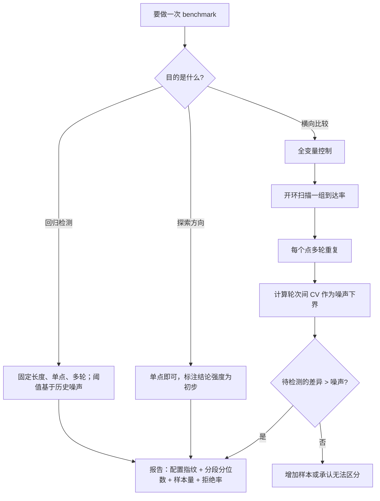

# 推理 benchmark 方法论

> 位置：[InferenceAtlas](../../INDEX.md) > [模块 11](README.md) > 当前文档
> 信息截至：2026-07-29 ｜ 最后核验：2026-07-29 ｜ 内容版本：v0.1
> 时效性等级：低
> 相关主题：[如何读推理 benchmark](../00_start_here/03_how_to_read_inference_benchmarks.md)｜`02_mlperf_inference.md`｜[时延、吞吐与 SLO](../01_foundations_and_metrics/02_latency_throughput_and_slo.md)

## 本章导读

推理 benchmark 的困难不在于测量本身，而在于**同一个系统可以合法地报出相差数倍的数字**。
把批大小从 8 调到 512，吞吐可能上升数倍而 TPOT 同步恶化；
换一组更短的输出长度，端到端时延的分位数会大幅下降；
用重复度高的 prompt，前缀缓存会让 prefill 成本几乎消失。
**这些都不是作弊，它们只是不同的工作点**——
而如果报告不声明工作点，读者就无法知道自己看到的是哪一个。

因此本章的核心不是「怎么把系统跑快」，而是**「怎么让一个数字可被他人复现与比较」**。
这两件事的区别在于：前者只需要一次成功的测量，
**后者需要把测量的全部输入固定并记录下来**。

本章给出三样东西：**一份口径清单**（哪些变量必须被声明）、
**一套负载发生方法**（为什么开环压测是必需的）、
以及**一个可复现性检查表**（半年后还能不能重跑出同样的数字）。
其中开环与闭环的区别是最容易被忽略也最容易导致系统性错误的一点——
**闭环压测在系统变慢时自动降低发压速率，因此结构性地测不出排队恶化**，
而排队恶化恰恰是生产中最常见的时延问题。

## 学习目标

读完本章后，读者应能够：

1. 列出一份推理性能报告必须声明的口径，并说明每一项不一致会导致什么后果
2. 区分开环与闭环负载发生器，并解释为什么生产流量更接近开环
3. 设计一个可复现的压测：包括预热、多轮重复与噪声下界的确定
4. 识别三种常见的口径操纵手法，并说出破解每一种需要索取什么信息
5. 判断一次性能改进是否超过测量噪声，而不是把噪声当成改进

## 核心结论

- **任何推理性能数字不声明工作点都是无意义的**：模型、量化、输入输出长度、并发、分位数、样本量，缺一项就不可跨来源比较。
- **吞吐与时延必须配对报告**，因为吞吐可以通过增大批任意提高，而这必然恶化 TPOT；唯一可比的量是「时延约束下的最大吞吐」。
- **闭环压测测不出排队恶化**：系统变慢时它自动降速，队列不会积压；生产流量更接近开环，因此只做闭环会系统性低估线上的时延尾部。
- **必须多轮重复并报告轮次间差异**，这个差异就是测量噪声的下界——任何小于它的「改进」都不成立。
- **被拒绝与超时的请求必须计入结果**，否则「只统计成功请求的时延」会给出一个虚假的好数字。
- **测试必须跑到热稳态**，否则短时测试可能完全跑在降频发生之前，从而系统性高估生产性能。

## 1. 问题定义、系统边界与工作负载

### 1.1 本章要解决的问题

一份推理性能报告的读者要回答两个问题：
**「这个数字在我的场景下意味着什么」**，以及**「我能不能复现它」**。
本章给出让这两个问题可回答的最小充分条件。

**本章不涉及**：具体 benchmark 套件的结果（见第 2 章的说明与限制）、
具体框架或硬件的性能数字（本库无法核验，见第 5 节）。

### 1.2 为什么推理比传统系统更难 benchmark

三个结构性原因：

**（一）性能是二维的，且两维互相交换**。
传统服务可以用「QPS + 时延」描述，而推理的时延本身是两个量
（TTFT 与 TPOT），**且它们与吞吐的关系方向相反**：
增大批提高吞吐、恶化 TPOT，但可能改善或恶化 TTFT（取决于调度）。
**所以推理的性能是一个曲面而不是一个点**，
报单点数字必然丢失信息。

**（二）工作负载的维度多且每一维都显著影响结果**。

| 维度 | 影响 | 变化一档的典型后果 |
|---|---|---|
| 输入长度 | prefill 计算量、KV 占用 | 线性影响 prefill 成本 |
| 输出长度 | decode 步数、KV 增长 | 线性影响端到端时延 |
| 并发/批大小 | 算术强度、KV 压力 | **吞吐与时延反向变化** |
| 前缀重复度 | 缓存命中率 | 可让 prefill 成本大幅下降 |
| 长度分布的形状 | 批组成的稳定性 | 重尾分布使尾部时延显著恶化 |

**（三）系统有状态**。
前缀缓存、编译缓存、KV 内存的碎片状态、
甚至芯片温度都会随测试进行而变化。
**因此「第一分钟」与「第三十分钟」的性能可以显著不同**。

### 1.3 三类 benchmark 的目的不同

| 类型 | 目的 | 对严谨性的要求 |
|---|---|---|
| **探索性** | 快速判断量级、排除明显错误的方向 | 低：单次测量即可，但结论强度必须被标注 |
| **回归性** | 检测变更是否引入性能退化 | 中：方差要小，因此用固定长度的「干净」配置 |
| **比较性** | 横向比较两个系统或两种配置 | **最高：全部变量必须被控制** |

**混淆这三类是常见错误**。
用探索性测量的结果做比较性结论（「我跑了一次，A 比 B 快三成」）
是这一章要防止的主要问题。
**探索性测量本身没有错，错的是把它的结论强度说得太满**。

## 2. 原理、数学与性能模型

### 2.1 吞吐与时延的交换关系

设批大小 $B$。吞吐随 $B$ 上升（更好的算术强度），
而单步时间也随 $B$ 上升（更多的计算与 KV 读取）。
每请求的 TPOT 近似为单步时间，于是：

$$
\text{Throughput}(B) = \frac{B}{\tau_{\text{step}}(B)}, \qquad \text{TPOT}(B) = \tau_{\text{step}}(B)
$$

在带宽受限区，$\tau_{\text{step}}$ 随 $B$ 增长得比线性慢
（权重读取被摊薄），所以吞吐上升；
进入算力受限区后 $\tau_{\text{step}}$ 近似线性增长，吞吐趋于饱和。

**由此得到唯一可比的性能量**：

$$
T^{*} = \max\{\,\text{Throughput}(B) \;:\; \text{TPOT}_{p99}(B) \le \text{SLO}\,\}
$$

**读法**：先固定时延约束，再求该约束下的最大吞吐。
**单独报吞吐等价于把 SLO 设为无穷大**，
而单独报时延等价于把吞吐设为极小——两者都不描述一个可运营的工作点。

### 2.2 开环与闭环的结构性差异

**闭环**（固定并发 $C$）：系统中始终有 $C$ 个在飞请求，
一个完成后立刻发下一个。此时到达率是**系统性能的因变量**：

$$
\lambda_{\text{closed}} = \frac{C}{T_{\text{response}}}
$$

**系统变慢 → $T$ 上升 → $\lambda$ 自动下降 → 队列不积压**。

**开环**（固定到达率 $\lambda$）：请求按设定的过程到达，
与系统状态无关。此时排队长度由 $\lambda$ 与服务能力的关系决定，
在 $\lambda$ 接近容量时按 $\rho/(1-\rho)$ 形式急剧恶化
（见 [模块 01 第 3 章](../01_foundations_and_metrics/03_queueing_theory_for_inference.md)）。

**这个差异的后果是结构性的**：

| | 闭环 | 开环 |
|---|---|---|
| 到达率 | 因变量 | 自变量 |
| 队列 | 长度上界为 $C$ | 可无界增长 |
| 能测出排队恶化吗 | **不能** | 能 |
| 与生产流量的相似度 | 低（除非客户端确实是固定并发） | **高** |

**因此**：闭环适合测「系统在某个固定负载点的能力」，
开环适合测「系统在多大的到达率下仍满足 SLO」。
**后者才是容量规划需要的数字**。

**开环压测的一个必须处理的陷阱**：
如果 $\lambda$ 超过系统容量，队列无界增长、时延永不收敛。
所以必须设置队列上界与超时，
**并把被拒绝与超时的请求计入结果**——
否则你会得到「只统计跑完的请求」这样一个自我选择的样本，
**它的时延分布必然偏乐观**。

### 2.3 噪声下界与最小可检测改进

设同一配置重复 $n$ 轮，第 $i$ 轮的指标为 $x_i$。
定义相对离散度

$$
\text{CV} = \frac{s}{\bar{x}}, \qquad s = \sqrt{\frac{1}{n-1}\sum_i (x_i - \bar{x})^2}
$$

**任何小于该量级的「改进」都不能被这套测量方法区分**。
一个实用的判断规则是：**改进幅度应至少是轮次间标准差的若干倍**，
且改进方向在每一轮中都一致。

**这一条是本章最具操作性的内容**。
它把「这个优化有没有用」从一个主观判断变成一个可计算的比较，
而**多数团队从未测过自己的噪声水平**，
因此无法判断一个小幅改进是真实的还是随机的。

### 2.4 分位数需要多少样本

分位数的估计精度随样本量提高。直观地说，
估计 $p$ 分位数时，落在该分位数附近的样本数约为 $n(1-p)$——
**所以 P99 的有效样本只有总样本的 1%**。

**实践后果**：

- 报 P99 时**必须同时报样本量与观测窗口**；
- **小样本下的 P99 波动可能大于你想检测的改进**；
- **分位数不能跨窗口平均**——
  「过去一天的平均 P99」不是任何分布的分位数，没有统计意义。
  要合并多个窗口，应保留直方图或原始样本后重新计算。

## 3. 实现机制与系统设计

### 3.1 完整的口径清单

一份可比较的报告必须声明下面九类。
**缺任何一项，比较就失效**：

| 类别 | 必须声明 | 不声明的后果 |
|---|---|---|
| 模型 | 名称、版本、权重哈希 | 完全不可比 |
| 量化 | 权重/激活/KV 各自的位宽与粒度 | 数倍差异 |
| 输入 | 长度分布（不只是均值）、前缀重复度 | 数倍差异 |
| 输出 | 长度分布、是否强制固定长度 | 数倍差异 |
| 负载 | 开环还是闭环、到达过程、到达率或并发数 | **决定能否测出排队** |
| 指标 | TTFT/TPOT/ITL/端到端的精确定义 | 概念混淆 |
| 统计 | 分位数、样本量、观测窗口、是否含失败请求 | 可任意操纵 |
| 环境 | 硬件、驱动与固件版本、软件版本、是否独占 | 数倍差异 |
| 状态 | 缓存是否预热、是否达到热稳态、测试时长 | 系统性偏差 |

### 3.2 负载发生器的设计

**（一）到达过程**。三种选择：

| 过程 | 特征 | 适用 |
|---|---|---|
| 固定间隔 | 方差最小 | 回归测试（噪声小） |
| 泊松 | 有突发，接近真实到达 | 容量测试 |
| 回放真实轨迹 | 最贴近生产 | 上线前的最终验证 |

**泊松过程是容量测试的默认选择**，
因为它的突发性会暴露固定间隔测不出的排队问题。

**（二）扫描而不是单点**。
应当扫一组到达率，得到「到达率 vs 时延分位数」的曲线。
**曲线的膝点就是系统的实际容量**——
这比任何单点数字都有信息量。

**（三）输出长度的控制**。
两种模式，用途不同：

- **自然生成**（模型自己决定何时停止）：贴近生产，
  **但长度的随机性引入很大方差**；
- **强制固定长度**（忽略结束符生成到指定长度）：
  方差小，**适合回归测试**，因为它能检测出更小的性能变化。

**回归测试应该用固定长度，容量测试应该用生产分布**。
**用错会导致要么检测不出小回归，要么得到不真实的容量估计**。

### 3.3 分段打点

每个请求至少记录六个时间戳：

$$
t_{\text{arrive}} \to t_{\text{admit}} \to t_{\text{prefill start}} \to t_{\text{first token}} \to \{t_i\} \to t_{\text{end}}
$$

由此导出：排队时间、prefill 时间、TTFT、ITL 序列、TPOT。

**还必须记录三个标记**：

1. **该请求是否被抢占过**——
   被抢占的请求应在 SLO 统计中被标记，否则它们污染 P99 的解读；
2. **前缀缓存是否命中、命中长度多少**——
   否则无法解释 prefill 时间的分布；
3. **该请求所在批的大小**——
   否则无法把时延与工作点关联起来。

**没有这三个标记，测出来的数字只能说明「慢」，不能说明「为什么慢」**。

### 3.4 压测 harness 的伪代码

```text
function run_benchmark(config):
    # 1. 预热：编译、缓存、热稳态
    warmup_until(config.warmup_duration)
    discard_all_collected_metrics()

    # 2. 多轮重复，用于确定噪声下界
    results = []
    for round in 1..config.n_rounds:
        reset_stateful_components(config.reset_policy)   # 缓存是否清空要显式声明
        r = run_one_round(config)
        results.append(r)

    # 3. 报告：既报聚合值也报轮次间差异
    return {
        "per_round": results,
        "median_of_rounds": median(results),
        "round_to_round_cv": cv(results),      # 噪声下界
        "config_fingerprint": hash(config),    # 可复现性
    }

function run_one_round(config):
    scheduler = OpenLoopArrivalProcess(config.rate, config.process)
    inflight, done, rejected = {}, [], 0
    while now() < config.duration:
        for req in scheduler.due_requests(now()):
            if queue_depth() >= config.max_queue:
                rejected += 1                  # 必须计入结果
                continue
            req.t_arrive = now()
            submit(req)
        for req in poll_completed():
            done.append(req)                   # 含全部分段时间戳与三个标记
    return summarize(done, rejected, config)   # 分位数必须带样本量
```

**三个设计点值得指出**：

1. **`discard_all_collected_metrics()` 在预热之后**——
   预热期的数据必须被丢弃，而不是被平均进结果；
2. **`reset_stateful_components` 的策略必须被显式声明**——
   「每轮清空缓存」与「保留缓存」会给出完全不同的数字，
   两者都合理，但必须说明是哪一个；
3. **`rejected` 计数与 `done` 一起返回**——
   报告必须能算出拒绝率。

### 3.5 可复现性检查表

一次测量在半年后仍能被重跑，需要记录：

| 类别 | 记录项 |
|---|---|
| 被测系统 | 引擎版本、完整配置文件内容、启动参数 |
| 模型 | 名称、版本、权重哈希、量化方案 |
| 工作负载 | 输入集的版本或哈希、长度分布、输出长度策略 |
| 负载 | 到达过程与参数、时长、队列上界、超时设置 |
| 环境 | 硬件型号、驱动与固件版本、是否独占、预热时长 |
| 结果 | 分段时延的完整分位数、吞吐、拒绝率、**样本量** |
| 元数据 | 时间、执行人、轮次间差异 |

**「输入集的哈希」这一项常被忽略**，
而输入集的微小变化（例如换了一批 prompt）
足以改变前缀命中率从而改变全部数字。

## 4. 性能、成本、能耗与可靠性 trade-off

### 4.1 严谨性与速度

| 场景 | 严谨的做法 | 快的做法 | 何时可以用快的 |
|---|---|---|---|
| 探索方向 | 全变量控制 + 多轮 | 跑一次看量级 | **可以**，但结论只用于排除方向 |
| 回归检测 | 固定配置 + 多轮 + 阈值基于历史噪声 | 跑一次比上次 | 不可以：会把噪声当回归 |
| 横向比较 | 全部变量控制 + 两边同等调优 | 用对方公布的数字 | **不可以** |

**快的做法不是错的，错的是把它的结论强度说得太满**。
「我跑了一次，看起来快了大概三成，还没做多轮验证」
是一个完全合格的陈述。

### 4.2 测试成本

完整的开环扫描 + 多轮重复的成本不低：
若扫 8 个到达率、每个 3 轮、每轮 10 分钟，
就是 4 小时的独占机器时间。

**因此实践中的分层是必要的**：

| 层 | 频率 | 配置 |
|---|---|---|
| CI 回归 | 每次变更 | 单点、固定长度、短时长、方差小 |
| 周期性容量测试 | 每周或每次大变更 | 开环扫描、生产长度分布 |
| 选型比较 | 按需 | 完整方法论 + 长时稳定性 |

**CI 层的关键是方差小而不是贴近生产**——
它的任务是检测回归，不是估计容量。

### 4.3 能耗与成本的测量

把能耗纳入 benchmark 需要额外的口径（见 [模块 01 第 7 章](../01_foundations_and_metrics/07_energy_efficiency_and_joules_per_token.md)）：

$$
E_{\text{tok}} = \frac{P}{\text{吞吐}}
$$

**分子分母的口径必须一致**，并且**必须与时延配对报告**——
因为每 token 能耗在大批时最优，
**可以通过牺牲时延任意压低**。

**一个额外的陷阱**：如果用 TDP 而不是实测功耗，
会系统性高估能耗，因为实际功耗常低于 TDP 上限。

### 4.4 可靠性维度的测量

性能 benchmark 通常在理想条件下进行，
而生产中系统会遇到故障与降级。**因此完整的评估还应包括**：

1. **过载行为**：到达率超过容量时，系统是优雅拒绝还是全面劣化？
2. **故障恢复**：注入一次实例故障，测恢复时间与对其他请求的影响；
3. **长时稳定性**：多小时运行后性能是否漂移（内存泄漏、碎片、降频）。

**第三项最容易被跳过，也最容易在生产中暴露**。

## 5. benchmark、真实案例或公开部署案例

**本章不引用任何具体 benchmark 的结果或数字**。

受当前环境的网络出口策略限制（详见 [AGENTS.md 第 11 节](../../AGENTS.md)），
本库无法访问任何 benchmark 套件的方法文档、
提交结果或厂商公布的性能数据，
**因此无法核验任何一条此类陈述**。
**在无可靠来源的情况下写出具体性能数字属于本库明确禁止的行为**。

**本章因此采用方法 + 模板的形式**。读者应自行产出下面这份报告并保存：

| 项 | 你的值 | 备注 |
|---|---|---|
| 模型与量化方案 | 待填 | 含权重哈希 |
| 输入长度分布（P50/P90/P99） | 待填 | 生产采样得到 |
| 输出长度分布（P50/P90/P99） | 待填 | 生产采样得到 |
| 前缀重复度 / 缓存命中率 | 待填 | 影响 prefill 成本 |
| SLO 约束下的最大吞吐 $T^{*}$ | 待填 | **这是唯一可横向比较的数字** |
| 该工作点的 TTFT / TPOT 分位数 | 待填 | 必须带样本量 |
| 拒绝率与超时率 | 待填 | 不可省略 |
| 轮次间相对差异 CV | 待填 | **你的噪声下界** |
| 预热时长与是否达热稳态 | 待填 | 说明判断依据 |

**倒数第二行是这份表里最有价值的一项**，
因为它决定了你能相信多小的改进。
**多数团队没有这个数字**。

> 实验方法论要求见 [如何读推理 benchmark](../00_start_here/03_how_to_read_inference_benchmarks.md)。

## 6. 设计决策框架



**图解读**：

1. **本图展示什么**：从「目的」出发选择方法的分叉。
   三种目的对应三种严谨程度，
   终点统一到「报告必须包含什么」。
2. **核心瓶颈**：瓶颈在 I 节点的判断。
   **「待检测的差异是否超过噪声」这一步最常被跳过**，
   而跳过它意味着后续所有基于该结论的决策都建立在可能是随机波动的基础上。
3. **图中的 trade-off**：走完整的 E→F→G→H 路径成本很高（数小时机器时间），
   所以不是每次都要走。
   **关键是走了简化路径时明确标注结论强度**，而不是假装走了完整路径。
4. **面试如何引用**：可以说「我会先问这次测量的目的——
   探索、回归还是比较，三者的严谨度要求不同；
   如果是比较，我会开环扫描并多轮重复，
   **先确定噪声下界再判断差异是否成立**」。

**最后一步的报告内容不可裁剪**：
配置指纹保证可复现，分段分位数保证可解释，
样本量保证可判断可信度，拒绝率保证没有自我选择偏差。

## 7. 常见失败模式与排查路径

| 症状 | 根因 | 修正 |
|---|---|---|
| 两次测量差异很大，找不到原因 | 未控制某个变量（常见是缓存状态或热稳态） | 补齐口径清单，显式声明缓存策略 |
| 报告的性能在生产中达不到 | 测试用闭环或短时长 | 改开环、跑到热稳态 |
| 「成功请求的时延很好」但用户抱怨 | 拒绝与超时未计入 | 把失败请求计入结果并报拒绝率 |
| 小幅改进无法复现 | 幅度低于噪声 | 先测轮次间 CV，再判断 |
| P99 抖动剧烈 | 样本量不足 | 报样本量；必要时延长观测窗口 |
| CI 中回归检测频繁误报 | 用了生产长度分布（方差大） | 回归测试改用固定长度配置 |
| 缓存命中率与生产不符 | 输入集的前缀重复度未控制 | 记录输入集哈希与重复度 |

**排查顺序**：任何 benchmark 异常都应先检查**口径与状态**
（缓存、热稳态、独占性），再检查系统本身。
**多数「性能不一致」的问题根因在测量方法而不在被测系统**。

## 8. 关联面试主题

1. 读一份性能报告要核对哪九项口径——见 [Q089](../17_interview_prep/07_debug_benchmark_and_reliability_questions.md)
2. 怎么设计一个可复现的压测——见 [Q090](../17_interview_prep/07_debug_benchmark_and_reliability_questions.md)
3. 为什么吞吐必须与时延配对报告——见 [Q002](../17_interview_prep/01_inference_system_design.md)
4. 闭环与开环的区别及其对排队的影响——见 [Q006](../17_interview_prep/01_inference_system_design.md)
5. 分位数为什么需要样本量——见 [E8](../17_interview_prep/10_coding_exercises.md)

## 9. 小结

推理 benchmark 的核心困难是**同一个系统可以合法地报出相差数倍的数字**，
因为性能是一个随工作点变化的曲面而不是一个点。
本章给出的解决办法有三层：

**第一层是口径**。九类变量必须被声明，
其中批大小与分位数最容易被用来操纵结果。
**唯一真正可横向比较的量是「时延约束下的最大吞吐」**，
因为它把两个互相交换的维度绑定在一起。

**第二层是方法**。开环负载发生器是容量测试的必需品——
闭环压测在系统变慢时自动降速，
**因此结构性地测不出排队恶化**。
同时，被拒绝与超时的请求必须计入结果，
否则得到的是一个自我选择的乐观样本。

**第三层是不确定性**。多轮重复并计算轮次间差异，
**这个差异就是你能相信的最小改进幅度**。
多数团队从未测过这个数字，
因此无法区分真实改进与随机波动——
**而这可能是本章最有操作价值的一条建议**。

最后需要明确的是本章的限制：
**它不包含任何具体 benchmark 的结果**，
因为当前环境无法核验它们。
第 5 节给出的是一份读者应自行填充的模板，
**其中「轮次间相对差异」一项是最值得优先测量的**。

## 关键术语

| 中文术语 | 英文 | 定义 | 单位/口径 | 关联文档 |
|---|---|---|---|---|
| 开环压测 | open-loop load generation | 按固定到达率发压，与系统状态无关 | 请求/秒 | 本章 2.2 |
| 闭环压测 | closed-loop load generation | 固定在飞请求数，完成一个才发下一个 | 并发数 | 本章 2.2 |
| 时延约束下的最大吞吐 | throughput under SLO | 满足时延目标前提下的最大吞吐 | token/s | 本章 2.1 |
| 噪声下界 | measurement noise floor | 同配置多轮之间的相对差异 | 无量纲比例 | 本章 2.3 |
| 热稳态 | thermal steady state | 温度与频率不再随时间变化的状态 | — | [模块 07 第 2 章](../07_hardware_and_server_architecture/02_gpu_architecture_for_inference.md) |
| 配置指纹 | config fingerprint | 唯一标识一次测量全部输入的摘要 | — | 本章 3.5 |
| 拒绝率 | rejection rate | 被准入控制拒绝或超时的请求占比 | 无量纲比例 | 本章 3.4 |

## 延伸阅读

- [如何读推理 benchmark](../00_start_here/03_how_to_read_inference_benchmarks.md)
- [时延、吞吐与 SLO](../01_foundations_and_metrics/02_latency_throughput_and_slo.md)
- [推理排队论](../01_foundations_and_metrics/03_queueing_theory_for_inference.md)
- [推理指标速查](../01_foundations_and_metrics/09_inference_metrics_cheat_sheet.md)
- [服务事故排查手册](../03_serving_engines_and_scheduling/12_serving_incident_playbook.md)
- [面试题组：Debug、benchmark、可靠性与安全](../17_interview_prep/07_debug_benchmark_and_reliability_questions.md)

## 主要来源

本章由 [模块 01 第 2–3、9 章](../01_foundations_and_metrics/02_latency_throughput_and_slo.md) 的指标与排队模型、
以及 [模块 00 第 3 篇](../00_start_here/03_how_to_read_inference_benchmarks.md) 的口径分析推导而成。

**不含任何需要外部核验的 benchmark 结果或厂商性能数据**。
受当前环境的网络出口策略限制，本库无法访问任何 benchmark 套件的方法文档或提交结果
（详见 [AGENTS.md 第 11 节](../../AGENTS.md)），
因此第 5 节给出的是读者应自行填充的模板。

| 类别 | 说明 | 披露标签 |
|---|---|---|
| 吞吐时延交换、开闭环、噪声下界、分位数样本量四个模型 | 由模块 01 推导 | — |
| 口径清单与可复现性检查表 | 由本库的编撰规范整理 | — |
| 读者自行产出的测量报告 | 应自行测量 | `独立可复现实验` |
| 任何具体 benchmark 的结果与厂商性能数据 | **本章未给出** | `待核实` |

## 更新记录

| 日期 | 版本 | 变更 | 核验人 |
|---|---|---|---|
| 2026-07-29 | v0.1 | 初稿：口径清单、开闭环差异、噪声下界与可复现性检查表 | — |
