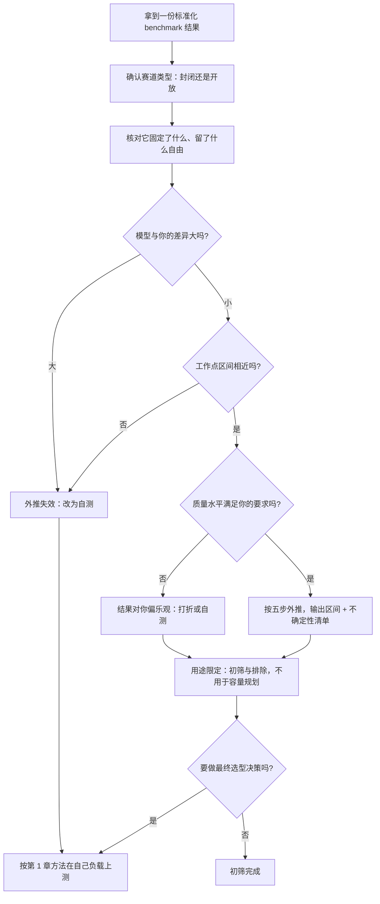

# 标准化 benchmark 套件：能回答与不能回答的问题

> 位置：[InferenceAtlas](../../INDEX.md) > [模块 11](README.md) > 当前文档
> 信息截至：2026-07-29 ｜ 最后核验：2026-07-29 ｜ 内容版本：v0.1
> 时效性等级：中
> 相关主题：[benchmark 方法论](01_inference_benchmarking_methodology.md)｜[吞吐与 goodput](04_throughput_concurrency_and_goodput.md)｜`11_benchmark_case_studies.md`

## 关于本章内容范围的说明

**本章不描述任何具体 benchmark 套件的规则、赛道划分、
提交要求或结果数据。**

受当前环境的网络出口策略限制（详见 [AGENTS.md 第 11 节](../../AGENTS.md)），
本库无法访问 MLPerf 等标准化 benchmark 套件的官方文档、
规则说明或提交结果，**因此无法核验任何一条关于它们的具体陈述**。
在无可靠来源的情况下描述某个套件「有哪些赛道」「用什么负载模式」
「某次提交的结果是多少」，属于本库明确禁止的行为。

**本章因此写的是另一件事**：
**标准化 benchmark 这一类工具在方法论上能回答什么、不能回答什么**，
以及**读者拿到任何一份标准化 benchmark 结果时应当如何解读与外推**。

这个框架不依赖具体套件的细节，
**而且它比任何具体套件的规则都更耐用**——
规则会改版，而「标准化与代表性之间的张力」不会变。

读者若需要某个套件的具体规则与结果，
应直接查阅其官方文档，并按 [第 1 章](01_inference_benchmarking_methodology.md) 的
九项口径清单核对，**同时标注披露级别为 `官方披露`**。

## 本章导读

标准化 benchmark 套件解决的是一个真实的问题：
**在没有共同基准的情况下，任何两家厂商的性能数字都不可比**——
因为工作点、模型、口径全都不同。
标准化通过**固定这些变量**让比较成为可能。

但标准化本身带来了一个不可消除的张力：
**固定的变量越多，比较越公平，与你的实际负载越不像**。
这个张力是结构性的，不是套件设计得好不好的问题。

因此使用标准化 benchmark 的正确姿态是：
**把它当成「排除明显不合格者」的筛子，而不是「预测生产性能」的模型**。
它能可靠地告诉你「这个系统在这个特定负载上能做到什么」，
**不能告诉你「它在你的负载上能做到什么」**。

本章给出：**标准化的三个价值与三个固有限制**、
**从标准化结果外推到自己场景的五步方法**、
以及**「封闭赛道」与「开放赛道」这类分区设计背后的通用逻辑**——
理解这个逻辑比记住某个套件的具体分区更有用。

## 学习目标

读完本章后，读者应能够：

1. 说明标准化 benchmark 的三个价值与三个结构性限制
2. 解释「标准化程度」与「代表性」之间的张力，并说明为什么它无法被消除
3. 从一份标准化结果外推到自己的场景，并说明每一步引入的不确定性
4. 说明封闭与开放两类赛道的分区逻辑，以及各自回答什么问题
5. 判断一份标准化结果在什么情况下不应被用于决策

## 核心结论

- **标准化 benchmark 的价值是「让比较成为可能」，不是「预测生产性能」**；把它当预测模型用是最常见的误用。
- **标准化与代表性存在结构性张力**：固定的变量越多越公平，与真实负载越不像；这个张力无法被消除，只能被声明。
- **封闭赛道回答「同一任务下谁的系统更快」，开放赛道回答「允许改动模型能做到多快」**；两者的结果不可互相比较。
- **外推必须逐项调整并声明不确定性**：模型、长度分布、并发、缓存状态、软件版本，每一项都会改变结论。
- **标准化结果最可靠的用途是排除**：若某系统在标准负载上明显不合格，它在你的负载上通常也不会好。
- **提交结果反映的是「调优到极致的配置」**，而不是「开箱即用的性能」——两者可能差别很大。

## 1. 问题定义、系统边界与工作负载

### 1.1 标准化要解决的问题

[第 1 章](01_inference_benchmarking_methodology.md) 指出：
一份推理性能数字要可比，必须声明九类口径。
**而在跨厂商比较时，即使双方都声明了口径，
只要口径不同，数字仍然不可比**。

**标准化的做法是把这些口径固定下来**：
规定模型、规定数据集、规定负载模式、规定统计口径、
规定质量下限（防止用降低质量换性能）。

**在这些约束下，不同系统的数字第一次变得可以直接比较**。
这是标准化不可替代的价值。

### 1.2 本章的分析对象

**不是某个具体套件**，而是「标准化 benchmark」这一类工具的
共同结构与共同限制。

**理由**：具体套件的规则会随版本变化，
**而结构性的价值与限制不会**。
掌握后者能让读者正确使用任何一个套件，
包括本库无法访问因而无法描述的那些。

## 2. 原理、数学与性能模型

### 2.1 标准化与代表性的张力

设一份 benchmark 固定了变量集合 $F$，
留给参与者自由选择的集合 $V$。

**可比性**随 $|F|$ 增加而提高：
固定的变量越多，剩余的差异越能归因于被测系统本身。

**代表性**随 $|F|$ 增加而下降：
固定的工作点与你的实际工作点重合的概率越低。

$$
\text{可比性} \uparrow \;\;\text{当}\;\; |F| \uparrow, \qquad
\text{代表性} \downarrow \;\;\text{当}\;\; |F| \uparrow
$$

**这个张力无法被消除**，只能通过两种方式缓解：

1. **提供多个负载场景**（覆盖更多的工作点组合）——
   代价是套件复杂度与提交成本上升；
2. **划分赛道**（见 2.3）——
   让不同的 $F$ 服务不同的问题。

**因此看到一份标准化结果时，第一个动作是问：
它固定了什么、留了什么自由**。
**这两个集合决定了结果的适用范围**。

### 2.2 标准化 benchmark 能回答的三类问题

| 问题 | 为什么能回答 |
|---|---|
| **在这个特定负载上，A 与 B 谁更快** | 变量已被固定，差异可归因 |
| **某个系统是否达到了基本水准** | 有共同的下限参照 |
| **某项技术在标准负载上的量级收益** | 可跨提交纵向比较 |

**第二项是标准化最稳健的用途**：
**排除明显不合格者**。
如果一个系统在标准负载上远低于同类，
**它在你的负载上通常也不会好**——
这个方向的推断比反方向可靠得多。

### 2.3 分区（赛道）的通用逻辑

标准化套件通常划分若干赛道，**其分区逻辑是「允许改动什么」**：

| 赛道类型 | 允许改动 | 回答的问题 |
|---|---|---|
| **严格/封闭** | 不允许改模型（或仅允许等价变换） | **同一任务下谁的系统实现更好** |
| **开放** | 允许改模型（不同架构、不同量化等） | **在质量约束下能做到多快** |

**两类结果不可互相比较**：
一个开放赛道的高吞吐可能来自用了更小的模型，
**而这与封闭赛道的「同一模型下更快」是完全不同的成就**。

**混用两类结果是常见的误读**，
而它通常发生在只看数字不看赛道标签的时候。

**对读者的实践含义**：

- 若你不能改模型（模型由业务决定）→ 看封闭类结果；
- 若你可以改模型 → 开放类结果更有参考价值，
  **但必须同时看它的质量约束是什么**。

### 2.4 质量下限的作用

标准化套件通常规定一个质量下限
（例如在给定任务上的准确率不得低于某值）。

**它的作用是防止用降低质量换性能**——
没有这个约束，任何系统都可以通过极端量化或激进近似
把吞吐做得很高。

**读者需要注意的是**：质量下限是一个**下限**而不是**你的要求**。
**一个刚好达到下限的提交，其质量可能远低于你的业务要求**。

**因此外推时必须检查**：
该提交的质量水平是多少、你的要求是多少，
**若你的要求更高，它的性能数字对你就偏乐观**。

### 2.5 「调优到极致」与「开箱即用」

标准化 benchmark 的提交通常经过大量针对性调优：
针对该固定负载的批策略、编译配置、算子选择。

**这意味着提交结果反映的是「这个系统的能力上界」，
而不是「你部署后能得到什么」**。

**两者的差距取决于**：

| 因素 | 影响 |
|---|---|
| 你的负载与标准负载的相似度 | 越像，差距越小 |
| 你的调优投入 | 越多，越接近 |
| 默认配置的合理性 | 因系统而异 |

**这个差距在选型中很重要**：
**一个「峰值能力强但需要大量调优」的系统，
对人力有限的团队可能不如「默认配置就不错」的系统**。
**而这一点在标准化结果里完全看不出来**。

## 3. 实现机制与系统设计

### 3.1 从标准化结果外推到自己场景的五步

**每一步都会引入不确定性，必须被声明而不是忽略**。

**第一步：核对模型**。

若标准负载用的模型与你的不同，
**性能差异可能来自模型规模、注意力变体（是否 GQA）、
是否 MoE、以及词表大小**。
**这一步差异大时，后面的外推基本失效**。

**第二步：核对长度分布**。

标准负载的输入输出长度分布与你的差异，
直接改变 prefill/decode 的比例与 KV 占用。
**按 [第 4 章](04_throughput_concurrency_and_goodput.md) 的口径**，
输出 token 吞吐与总 token 吞吐的换算需要长度比。

**第三步：核对并发与负载模式**。

标准负载是开环还是闭环、
到达过程是什么、并发多少——
**这决定了结果里包含多少排队成分**。
**若标准负载用闭环而你的生产是开环，结果会偏乐观**
（见 [第 1 章](01_inference_benchmarking_methodology.md) 2.2）。

**第四步：核对缓存与状态**。

标准负载的 prompt 重复度决定了前缀缓存命中率。
**若你的生产是多轮对话（命中率高）而标准负载是独立请求（命中率低），
你的实际 prefill 成本会低于标准结果暗示的水平**——
这一次是偏保守的方向。

**第五步：核对软硬件版本与调优程度**。

版本差异与调优投入的差异（见 2.5）。

**外推的输出应当是一个区间加一组假设**，
而不是一个点估计。**形式**：

> 「基于该结果，在我们的场景下预计吞吐在 X 到 Y 之间，
> 主要不确定性来自模型差异与长度分布差异；
> 若我们的缓存命中率高于标准负载，实际可能好于区间上界。」

### 3.2 标准化结果不应被用于决策的四种情况

| 情况 | 为什么 |
|---|---|
| 你的模型与标准负载的模型差异很大 | 外推第一步就失效 |
| 你的工作点在完全不同的区间（如极小批 vs 标准的大批） | 瓶颈类型可能不同 |
| 你的质量要求高于套件的质量下限 | 结果对你偏乐观 |
| 你无力做同等程度的调优 | 结果是能力上界而非可达值 |

**在这四种情况下，正确的做法是自己按 [第 1 章](01_inference_benchmarking_methodology.md)
的方法在自己的负载上测**，
**而不是对标准化结果做大幅度的外推**。

### 3.3 标准化 benchmark 与自测的分工

| 用途 | 用标准化 | 用自测 |
|---|---|---|
| 跨厂商初筛 | **是** | 否（成本太高） |
| 排除明显不合格者 | **是** | — |
| 选型的最终决策 | 否 | **是** |
| 容量规划 | 否 | **是** |
| 回归检测 | 否 | **是** |

**这张表的核心判断是：标准化用于「筛」，自测用于「定」**。

**把标准化结果直接用于容量规划是一个明确的错误**——
容量规划需要的是你自己负载下的 SLO 约束吞吐
（见 [第 4 章](04_throughput_concurrency_and_goodput.md)），
**而标准化结果的工作点几乎一定与之不同**。

### 3.4 读一份标准化结果的检查表

| 项 | 要确认 |
|---|---|
| 赛道类型 | 封闭还是开放？两类不可比 |
| 模型与版本 | 与你的差异 |
| 负载模式 | 开环还是闭环、并发多少 |
| 长度分布 | 输入与输出各是多少 |
| 质量水平 | 该提交达到多少，而不只是下限是多少 |
| 时延约束 | 有没有时延约束下的吞吐？还是纯吞吐 |
| 软硬件配置 | 版本、卡数、是否含特殊调优 |
| 提交方 | 是否为该系统的开发方（调优投入通常最高） |

**最后一行值得注意**：
**由系统开发方提交的结果通常代表该系统的能力上界**，
因为他们最了解如何调优它。

## 4. 性能、成本、能耗与可靠性 trade-off

### 4.1 标准化的成本

参与标准化 benchmark 的成本不低：
适配套件的接口、针对性调优、
以及满足提交的复现性要求。

**这带来一个选择偏差**：
**有能力与动机做这件事的通常是较大的团队或厂商**，
**所以标准化结果的覆盖面本身是有偏的**——
未出现在结果里不等于不好，可能只是没提交。

**读者不应把「未提交」解读为「性能差」**。

### 4.2 优化标准负载与优化真实负载

**针对标准负载的极致调优不一定迁移到真实负载**。
一个针对固定长度、固定批大小优化的配置，
在变长、动态批的生产环境下可能表现平平。

**因此选型时应当关注「在接近你的工作点的场景上的结果」**，
而不是「最高的那个数字」。

### 4.3 能效与成本维度

若套件包含能效赛道，同样需要核对 [第 5 章](05_power_energy_and_cost_benchmarks.md) 的口径：
功耗边界（芯片/板卡/整机）、是否含设施开销、
以及**是否与时延配对**。

**一个不带时延约束的能效数字可以通过增大批任意压低**，
这一点对标准化结果同样成立。

## 5. benchmark、真实案例或公开部署案例

**本章不引用任何具体套件的规则、赛道或结果数据**（原因见开头的说明）。

**读者应自行完成的动作**：

| 步骤 | 内容 |
|---|---|
| 1 | 查阅目标套件的官方文档，记录它固定了哪些变量、留了哪些自由 |
| 2 | 按 3.4 的检查表逐项核对你关心的那条结果 |
| 3 | 按 3.1 的五步做外推，**输出区间而非点估计** |
| 4 | 标注每条引用的披露级别（官方文档为 `官方披露`） |
| 5 | 若落入 3.2 的四种情况之一，改为自测 |

**第 3 步的输出格式建议**：

```text
外推结论：在我们的场景下预计 [指标] 在 X 到 Y 之间
主要不确定性来源（按影响排序）：
  1. 模型差异：...
  2. 长度分布差异：...
  3. 负载模式差异（开环/闭环）：...
  4. 缓存命中率差异：...
  5. 调优程度差异：...
建议：在做最终决策前，按第 1 章的方法在自己的负载上验证
```

> 实验方法论要求见 [如何读推理 benchmark](../00_start_here/03_how_to_read_inference_benchmarks.md)。

## 6. 设计决策框架



**图解读**：

1. **本图展示什么**：标准化结果的使用流程。
   起点是赛道类型与固定/自由变量集合，
   中间是三道适用性检查，
   **终点无论如何都指向「最终决策要自测」**。
2. **核心瓶颈**：瓶颈在 D、F、G 三道检查。
   **跳过它们直接引用数字是最常见的误用**——
   而三道检查中任何一道不通过，外推的可靠性就大幅下降。
3. **图中的 trade-off**：走 K 分支（自测）成本高得多。
   **但把标准化结果用于容量规划的代价更高**：
   容量算错的后果是上线后能力不足，
   而这时再修正已经很被动。
4. **面试如何引用**：可以说
   「标准化 benchmark 我会用来初筛与排除明显不合格者，
   **但最终选型与容量规划一定自测**——
   因为它固定的工作点几乎一定与我的不同」。

## 7. 常见失败模式与排查路径

| 症状 | 根因 | 修正 |
|---|---|---|
| 按标准化结果规划容量，上线后不足 | 工作点不同，且未做外推调整 | 用自测结果做容量规划 |
| 比较两个数字得出错误结论 | 一个来自封闭赛道一个来自开放赛道 | 核对赛道类型 |
| 实际部署远达不到标准化数字 | 结果是调优到极致的配置 | 评估自己的调优投入 |
| 认为未提交的系统性能差 | 提交有成本，覆盖面有偏 | 不把「未提交」当性能证据 |
| 质量不达业务要求 | 只看了套件的质量下限 | 看该提交的实际质量水平 |
| 外推结论过于确定 | 输出了点估计 | 输出区间 + 不确定性清单 |

**排查顺序**：**先核对赛道与固定变量，再核对工作点，最后看质量水平**。

## 8. 关联面试主题

1. 读一份性能报告要核对什么——见 [Q089](../17_interview_prep/07_debug_benchmark_and_reliability_questions.md)
2. 怎么设计可复现的自测——见 [Q090](../17_interview_prep/07_debug_benchmark_and_reliability_questions.md)
3. 判断论文或报告的结论能否迁移——见 [Q096](../17_interview_prep/08_company_paper_and_strategy_questions.md)
4. 推理引擎选型的方法——见 [案例四](../17_interview_prep/09_mock_interview_cases.md)
5. 信息等级与披露纪律——见 [Q100](../17_interview_prep/08_company_paper_and_strategy_questions.md)

## 9. 小结

**本章不描述任何具体 benchmark 套件的规则与结果**——
当前环境无法访问它们的官方文档，
**而在无来源时描述它们属于本库禁止的行为**。
本章给出的是这一类工具的通用使用框架。

**四条核心判断**：

**第一，标准化的价值是让比较成为可能，不是预测生产性能**。
它通过固定口径消除了跨厂商比较的障碍，
**这个价值不可替代**；但把它当成生产性能的预测模型是最常见的误用。

**第二，标准化与代表性的张力是结构性的**。
固定的变量越多越公平、与真实负载越不像。
**这个张力无法消除，只能通过分赛道与多场景缓解**——
所以拿到结果的第一个动作是问「它固定了什么、留了什么自由」。

**第三，封闭与开放两类赛道回答不同的问题，结果不可互相比较**。
开放赛道的高吞吐可能来自更小的模型，
**这与封闭赛道「同一模型下更快」是完全不同的成就**。

**第四，最可靠的用途是排除而不是预测**。
「在标准负载上明显不合格 → 在你的负载上大概率也不好」
这个方向的推断，比反方向可靠得多。

**实践上的分工**：**标准化用于筛，自测用于定**。
选型的最终决策与容量规划都必须基于自己负载上的测量——
**因为标准化结果的工作点几乎一定与你的不同，
且它反映的是调优到极致的能力上界而非开箱即用的水平**。

## 关键术语

| 中文术语 | 英文 | 定义 | 单位/口径 | 关联文档 |
|---|---|---|---|---|
| 固定变量集 | fixed variable set | 套件规定不可改动的部分 | — | 本章 2.1 |
| 封闭赛道 | closed division | 不允许改模型的赛道 | — | 本章 2.3 |
| 开放赛道 | open division | 允许改模型的赛道 | — | 本章 2.3 |
| 质量下限 | quality floor | 提交必须达到的最低质量 | 依任务而定 | 本章 2.4 |
| 能力上界 | peak attainable | 极致调优下可达的性能 | — | 本章 2.5 |
| 外推区间 | extrapolation range | 外推到自己场景时的估计区间 | — | 本章 3.1 |

## 延伸阅读

- [推理 benchmark 方法论](01_inference_benchmarking_methodology.md)
- [吞吐、并发与 goodput](04_throughput_concurrency_and_goodput.md)
- [功耗、能耗与成本基准](05_power_energy_and_cost_benchmarks.md)
- [如何读推理 benchmark](../00_start_here/03_how_to_read_inference_benchmarks.md)
- [面试题组：公司、论文与战略讨论](../17_interview_prep/08_company_paper_and_strategy_questions.md)

## 主要来源

本章为**方法论内容**，由 [第 1 章](01_inference_benchmarking_methodology.md) 的口径分析
与本库的信息等级规范推导而成。

**不含任何具体 benchmark 套件的规则、赛道划分、提交要求或结果数据**。
受当前环境的网络出口策略限制，本库无法访问任何标准化 benchmark 套件的官方文档
（详见 [AGENTS.md 第 11 节](../../AGENTS.md)），
**因此不对任何具体套件做描述**。读者应直接查阅其官方文档并标注 `官方披露`。

| 类别 | 说明 | 披露标签 |
|---|---|---|
| 标准化与代表性的张力、分区逻辑、外推五步 | 方法论，由第 1 章推导 | — |
| 读者自行查阅的套件规则与结果 | 应查官方文档 | `官方披露` |
| 任何具体套件的规则、赛道与结果数据 | **本章未给出** | `待核实` |

## 更新记录

| 日期 | 版本 | 变更 | 核验人 |
|---|---|---|---|
| 2026-07-29 | v0.1 | 初稿：标准化的价值与结构性限制、分区逻辑、外推五步与使用边界 | — |
