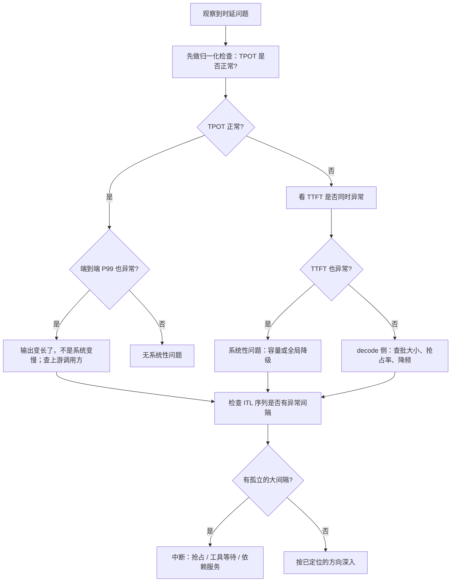

# 时延指标的精确定义与测量陷阱

> 位置：[InferenceAtlas](../../INDEX.md) > [模块 11](README.md) > 当前文档
> 信息截至：2026-07-29 ｜ 最后核验：2026-07-29 ｜ 内容版本：v0.1
> 时效性等级：低
> 相关主题：[benchmark 方法论](01_inference_benchmarking_methodology.md)｜[时延、吞吐与 SLO](../01_foundations_and_metrics/02_latency_throughput_and_slo.md)｜`04_throughput_concurrency_and_goodput.md`

## 本章导读

推理的时延不是一个数，而是**四个定义不同、边界容易混淆的量**：
TTFT、ITL、TPOT、端到端时延。
它们之间有确定的代数关系，但**每一个的「起点」和「终点」在实践中都有歧义**——
TTFT 是从请求到达开始算还是从进入批开始算？
TPOT 是否包含 TTFT？ITL 序列里的异常间隔算不算进 TPOT？

这些歧义不是学术问题。**两个团队用同一套指标名报出的数字可能测的根本不是同一个量**，
而差异往往正好落在「排队时间算不算」这类边界上——
在高负载下这一段可能占端到端时延的大部分。

本章做三件事：**给出四个指标的精确定义与它们的代数关系**、
**列出九个具体的测量陷阱**、
以及**说明为什么归一化时延（TPOT）是判断「系统是否变慢」的正确工具**，
而端到端时延的尾部大多数时候只是反映了「输出更长」。

最后一点是本章最有实用价值的内容：
**把「输出长」误判为「系统慢」是推理时延排查中最常见的一类错误**，
而它只需要一次归一化检查就能排除。

## 学习目标

读完本章后，读者应能够：

1. 精确定义 TTFT、ITL、TPOT 与端到端时延，并写出四者的代数关系
2. 指出每个指标定义中最容易产生歧义的边界，并说明该选哪一个
3. 用归一化时延区分「系统变慢」与「输出变长」
4. 识别九个常见的时延测量陷阱，并说明每一个会导致什么方向的偏差
5. 为流式与非流式两种接口分别设计时延 SLO

## 核心结论

- **四个指标的代数关系是 $T_{\text{e2e}} = \text{TTFT} + \sum \text{ITL}$，而 $\text{TPOT}$ 是 ITL 的平均**；把 TPOT 定义成「端到端除以输出长度」是一个常见但错误的口径。
- **TTFT 必须包含排队时间**，否则它测的是系统内部的处理能力而不是用户感受到的时延——两者在高负载下可以差一个量级。
- **端到端时延的尾部大多反映输出长度而非系统性能**；判断系统是否变慢要看 TPOT。
- **ITL 序列比它的平均值有信息量得多**：异常大的单个间隔指向抢占、工具等待或依赖服务，而这在 TPOT 的平均中被稀释。
- **流式与非流式接口的 SLO 结构不同**：流式下 TTFT 与 TPOT 都是用户可见的，非流式下只有端到端时延可见。
- **被抢占过的请求必须在统计中被标记**，否则它们会污染 P99 的解读，让人误以为是普遍性劣化。

## 1. 问题定义、系统边界与工作负载

### 1.1 本章要解决的问题

**让两个团队报出的「TTFT」是同一个量**。
这需要把每个指标的起点、终点与包含关系写清楚，
并列出实践中产生分歧的具体位置。

**本章不涉及**：具体系统的时延数字（本库无法核验），
时延的优化手段（见模块 03 与 04）。

### 1.2 用户感知与系统内部的区别

一个关键的框架性区分：

| 视角 | 起点 | 用途 |
|---|---|---|
| **用户视角** | 客户端发出请求 | SLO 定义、产品体验 |
| **服务视角** | 请求到达服务入口 | 服务能力评估 |
| **引擎视角** | 请求进入批 | 引擎性能调优 |

**三者相差的部分分别是网络往返与排队时间**，
而**排队时间在高负载下可能占大头**。

**默认应当用服务视角**（从请求到达服务入口开始计），
因为它包含了排队——这是服务能控制的部分。
**引擎视角的数字不应被当作 SLO**，
它排除了排队，因此系统性地偏乐观。

**如果一份报告的 TTFT 不含排队，它测的是引擎而不是服务**。
这是本章要防止的第一类混淆。

### 1.3 流式与非流式

| 接口 | 用户看到什么 | 哪些指标可见 |
|---|---|---|
| 非流式 | 全部生成完后一次返回 | **只有端到端时延** |
| 流式 | token 逐个到达 | **TTFT 与每个 ITL 都可见** |

**这个区别决定了 SLO 的结构**：
非流式接口下优化 TTFT 没有直接的体验价值（用户反正要等全部完成），
**而流式接口下 TTFT 决定「多久开始看到内容」、TPOT 决定「读起来是否流畅」**。

## 2. 原理、数学与性能模型

### 2.1 四个指标的精确定义

设一个请求生成 $N$ 个 token，第 $i$ 个 token 的产出时刻为 $t_i$，
请求到达服务入口的时刻为 $t_0$：

$$
\text{TTFT} = t_1 - t_0
$$

$$
\text{ITL}_i = t_i - t_{i-1}, \quad i = 2, \dots, N
$$

$$
\text{TPOT} = \frac{1}{N-1}\sum_{i=2}^{N} \text{ITL}_i = \frac{t_N - t_1}{N - 1}
$$

$$
T_{\text{e2e}} = t_N - t_0 = \text{TTFT} + \sum_{i=2}^{N}\text{ITL}_i = \text{TTFT} + (N-1)\cdot\text{TPOT}
$$

**四个量的关系由最后一式完全确定**。

**注意分母是 $N-1$ 而不是 $N$**：
第一个 token 的时间已经计入 TTFT，
TPOT 描述的是**后续** token 的平均间隔。
**用 $N$ 做分母会系统性低估 TPOT**，
在输出很短时误差尤其大（$N=2$ 时低估一半）。

**一个常见的错误定义**是

$$
\text{TPOT}_{\text{wrong}} = \frac{T_{\text{e2e}}}{N}
$$

它把 TTFT 摊进了每个 token。当 TTFT 远大于单步时间时
（长 prompt、或高排队），**这个量会显著高于真实的 TPOT**，
从而把「prefill 慢」误报成「decode 慢」。

### 2.2 TTFT 的内部分解

$$
\text{TTFT} = T_{\text{queue}} + T_{\text{prefill}} + T_{\text{first-decode}}
$$

三段的驱动因素完全不同：

| 段 | 驱动因素 | 随什么增长 |
|---|---|---|
| 排队 | 利用率、服务时间方差 | 按 $\rho/(1-\rho)$ 形式，在高负载下急剧恶化 |
| prefill | prompt 长度、缓存命中 | 与未命中的 token 数近似线性 |
| 首次 decode | 批大小、KV 长度 | 约等于一个单步时间 |

**分解的价值在于三段指向完全不同的修正**：
排队主导 → 调准入或扩容；
prefill 主导 → 看输入长度与缓存命中率；
首次 decode 主导（罕见）→ 看批大小。

**不做这个分解就无法回答「TTFT 为什么高」**。

### 2.3 为什么端到端时延的尾部会误导

端到端时延是 $\text{TTFT} + (N-1)\cdot\text{TPOT}$，
**其中 $N$ 是输出长度，而它的分布通常是重尾的**。

设 TPOT 完全稳定（系统健康），只有 $N$ 变化。
则端到端时延的分布**几乎完全由 $N$ 的分布决定**：

$$
T_{\text{e2e}}^{(p)} \approx \text{TTFT} + (N^{(p)} - 1)\cdot\text{TPOT}
$$

**也就是说：端到端时延的 P99 主要反映输出长度的 P99**。

**推论**：如果观察到端到端 P99 是 P50 的很多倍，
**第一件事不是排查系统，而是检查 $N$ 的分布**。
若 $N$ 的 P99 与 P50 之比与时延之比相近，
**那么系统没有变慢，只是长请求本来就慢**。

**这个检查只需要一分钟，但它能避免走完全错误的排查方向**——
它是时延排查的第一个动作。

### 2.4 ITL 序列与它的平均

TPOT 是 ITL 的平均，**而平均会掩盖结构**。
两种 ITL 序列可以有相同的 TPOT 但含义完全不同：

| 形态 | ITL 序列 | 含义 |
|---|---|---|
| 均匀 | 每个都接近 TPOT | 系统稳定 |
| 有尖峰 | 多数很小，少数极大 | **中断**：抢占、工具等待、依赖服务 |

**流式接口下这两者的用户体验差别巨大**：
均匀的输出读起来流畅，
**而一次长停顿会被明显感知，即使平均值相同**。

**因此应当额外监控**：

$$
\text{ITL}_{\max} \quad \text{与} \quad \#\{i : \text{ITL}_i > c \cdot \text{TPOT}\}
$$

即最大间隔与「异常间隔的个数」。
**后者是检测中断的直接信号**，而它在 TPOT 里完全不可见。

### 2.5 归一化：判断系统是否变慢的正确工具

综合上面几点，判断「系统是否变慢」的正确指标是 **TPOT**，
因为它已经对输出长度归一化。

**三种情形的区分**：

| 观察 | 结论 |
|---|---|
| TPOT 正常，端到端 P99 上升 | **输出变长了，系统没变慢**——去查上游 |
| TPOT 上升，TTFT 正常 | decode 侧问题：批变大、抢占、降频 |
| TTFT 上升，TPOT 正常 | prefill 或排队问题 |
| 两者都上升 | 系统性问题：容量不足或全局降级 |

**这张表是时延排查的分诊入口**。

## 3. 实现机制与系统设计

### 3.1 打点的实现要求

要得到上面全部指标，每个请求需要记录：

```text
t_arrive        请求到达服务入口（不是进入批）
t_admit         通过准入控制
t_prefill_start prefill 开始
t_first_token   第一个 token 产出
t_i             每个后续 token 的产出时刻
t_end           最后一个 token 产出 / 请求结束
```

**加上三个必需的标记**：

1. `was_preempted`：是否被抢占过；
2. `cache_hit_len`：前缀缓存命中的 token 数；
3. `batch_size_samples`：该请求所在批的大小序列（或至少均值）。

**没有这三个标记，指标只能描述现象不能解释原因**。

### 3.2 九个测量陷阱

| # | 陷阱 | 偏差方向 | 修正 |
|---|---|---|---|
| 1 | TTFT 从「进入批」而非「到达」开始计 | **偏乐观**（漏掉排队） | 从服务入口计时 |
| 2 | TPOT 用 $N$ 而非 $N-1$ 做分母 | 偏乐观 | 用 $N-1$ |
| 3 | TPOT 定义为端到端除以 $N$ | 偏悲观（混入 TTFT） | 用 ITL 的平均 |
| 4 | 只统计成功请求 | **偏乐观**（自我选择） | 把超时与拒绝计入 |
| 5 | 跨窗口平均分位数 | 方向不定，且无统计意义 | 保留直方图后重算 |
| 6 | 用平均时延而非分位数 | 掩盖尾部 | 用分位数 |
| 7 | 报分位数不报样本量 | 无法判断可信度 | 必须报 $n$ 与窗口 |
| 8 | 被抢占的请求混入普通统计 | 污染 P99 的解读 | 标记并可分开统计 |
| 9 | 流式接口下只测端到端 | 丢失 TTFT 与 ITL 结构 | 逐 token 打点 |

**第 1 条和第 4 条是最严重的两个**，
因为它们都朝乐观方向偏，且偏差在高负载下最大——
**恰好是最需要准确数字的时候**。

### 3.3 客户端侧与服务端侧的差异

服务端测的时延不包含网络往返与客户端处理。
两者之差在跨地域场景下可能不小。

**建议同时采集两侧**：

| 侧 | 用途 |
|---|---|
| 服务端 | 定位系统内部问题、容量规划 |
| 客户端 | **定义面向用户的 SLO** |

**只有服务端数据时，SLO 应当留出网络往返的余量**，
并在文档中说明这一点。

### 3.4 SLO 的定义方式

**流式接口**，两个独立的 SLO：

$$
\text{TTFT}_{p99} \le \tau_1, \qquad \text{TPOT}_{p99} \le \tau_2
$$

**非流式接口**，只需要一个：

$$
T_{\text{e2e},p99} \le \tau_3
$$

**但非流式的端到端 SLO 有一个结构问题**：
它对不同输出长度的请求不公平——
长请求即使系统完全健康也可能违反 SLO。

**两种处理方式**：

1. **按输出长度分档定 SLO**（如 $\le 200$ token 与 $> 200$ token 分开）；
2. **用归一化 SLO**：$\text{TPOT}_{p99} \le \tau_2$ 加上一个绝对上限。

**第二种更合理但对产品方更难解释**，
所以第一种在实践中更常见。

### 3.5 被抢占请求的统计处理

被抢占并重算的请求，其时延必然显著高于正常请求。
**把它们混进 P99 会让人误以为是普遍性劣化**。

**推荐做法**：

1. **标记但不排除**——它们是真实的用户体验；
2. **同时报告排除它们后的分位数**，
   便于区分「普遍劣化」与「少数请求被抢占」；
3. **单独监控抢占率**，它是内存压力的直接信号。

**关键是「标记」而不是「悄悄排除」**——
排除会让报告好看但掩盖了真实问题。

## 4. 性能、成本、能耗与可靠性 trade-off

### 4.1 打点粒度与开销

逐 token 打点在长输出下会产生大量数据。

| 粒度 | 数据量 | 能回答什么 |
|---|---|---|
| 仅端到端 | 最小 | 几乎什么都回答不了 |
| 四段（排队/prefill/首 token/结束） | 小 | 分诊到段 |
| 逐 token | 大 | **ITL 结构、中断检测** |

**推荐分层**：全量采集四段，
**对采样的请求采集逐 token 轨迹**。

**关键是「事故时能临时提高采样率」这个能力要事先具备**——
事故中才去加打点是来不及的。

### 4.2 SLO 的紧与松

| SLO 设置 | 后果 |
|---|---|
| 过紧 | 需要更低的利用率（排队恶化提前），**成本上升** |
| 过松 | 体验差，且失去了作为运维信号的价值 |

**SLO 与利用率的关系是定量的**：
排队时间按 $\rho/(1-\rho)$ 形式恶化，
**所以每收紧一档 SLO，可运行的利用率上限就下降一档，单位成本相应上升**。

**这个交换应该被明确计算并向业务说明**，
而不是把 SLO 当成一个纯技术决定。

### 4.3 TTFT 与 TPOT 的相互交换

两者不是独立的：

- **增大批**：TPOT 恶化，但排队缩短从而 TTFT 可能改善；
- **分块 prefill**：TTFT 略升（长 prompt 被切分），TPOT 改善（减少对 decode 的干扰）；
- **优先调度 prefill**：TTFT 改善，TPOT 恶化。

**因此不能独立地优化两者**。
**SLO 应当同时约束两者**，否则优化会把压力转移到未被约束的那一侧。

## 5. benchmark、真实案例或公开部署案例

**本章不引用任何具体系统的时延数字**。

受当前环境的网络出口策略限制（详见 [AGENTS.md 第 11 节](../../AGENTS.md)），
本库无法核验任何公开的推理时延数据，
**因此不给出任何具体数值**。

**读者应自行采集的时延画像**（一张表，按 [第 1 章](01_inference_benchmarking_methodology.md) 的方法测）：

| 指标 | P50 | P95 | P99 | 样本量 | 备注 |
|---|---|---|---|---|---|
| 排队时间 | 待填 | 待填 | 待填 | 待填 | 高负载下最重要 |
| TTFT | 待填 | 待填 | 待填 | 待填 | 含排队 |
| TPOT | 待填 | 待填 | 待填 | 待填 | **判断系统是否变慢** |
| 端到端 | 待填 | 待填 | 待填 | 待填 | 与输出长度分布对照看 |
| 输出长度 $N$ | 待填 | 待填 | 待填 | 待填 | **解释端到端尾部的关键** |
| ITL 最大值 | 待填 | 待填 | 待填 | 待填 | 中断检测 |
| 抢占率 | — | — | — | 待填 | 内存压力信号 |

**倒数第二行与倒数第三行要一起看**：
如果端到端的 P99/P50 之比与输出长度的 P99/P50 之比接近，
**说明尾部主要来自输出长度而非系统**。

> 实验方法论要求见 [如何读推理 benchmark](../00_start_here/03_how_to_read_inference_benchmarks.md)。

## 6. 设计决策框架



**图解读**：

1. **本图展示什么**：时延问题的分诊树。
   起点是归一化检查（成本极低），
   然后按 TPOT 与 TTFT 的组合分诊，
   最后统一检查 ITL 结构。
2. **核心瓶颈**：瓶颈在第一个判断 B。
   **「先看 TPOT 而不是端到端」这一步最容易被跳过**，
   而跳过它会导致把「输出变长」当成「系统变慢」，
   然后花大量时间排查一个不存在的系统问题。
3. **图中的 trade-off**：最后统一走 ITL 检查这一步会多花时间，
   即使前面已经定位到方向。
   **但孤立的大间隔可能与主线原因无关（例如一个偶发的依赖超时）**，
   遗漏它会让排查不完整。
4. **面试如何引用**：可以说
   「我会先看 TPOT——如果它正常而端到端异常，
   那说明是输出变长而不是系统变慢，
   **这一步只要一分钟但能避免走错方向**」。

## 7. 常见失败模式与排查路径

| 症状 | 根因 | 修正 |
|---|---|---|
| 「P99 是 P50 的 20 倍」，排查系统无果 | 未做归一化，尾部其实来自输出长度 | 看 TPOT 并对照 $N$ 的分布 |
| 报告的 TTFT 很好但用户抱怨慢 | TTFT 未含排队 | 从服务入口计时 |
| TPOT 看起来正常但流式体验卡顿 | 平均掩盖了孤立的大间隔 | 监控 ITL 最大值与异常间隔计数 |
| 短输出请求的 TPOT 异常低 | 分母用了 $N$ 而非 $N-1$ | 修正定义 |
| 优化 TTFT 后 TPOT 恶化 | 两者互相交换，SLO 只约束了一侧 | 同时约束两者 |
| P99 波动剧烈 | 样本量不足 | 报样本量，延长窗口 |
| 时延统计突然变好 | 超时/拒绝请求被排除了 | 把失败请求计入 |

**排查顺序**：**先做归一化检查，再看分段，最后看 ITL 结构**。
**这个顺序能用最小的代价排除最常见的误判**。

## 8. 关联面试主题

1. 四个时延指标的定义与区别——见 [Q001](../17_interview_prep/01_inference_system_design.md)
2. P99 是 P50 的多倍怎么拆解——见 [Q040](../17_interview_prep/03_serving_scheduling_and_slo_questions.md)
3. 线上时延恶化的排查顺序——见 [Q091](../17_interview_prep/07_debug_benchmark_and_reliability_questions.md)
4. 怎么为流式对话产品定义 SLO——见 [Q007](../17_interview_prep/01_inference_system_design.md)
5. 可观测性的最小指标集——见 [Q092](../17_interview_prep/07_debug_benchmark_and_reliability_questions.md)

## 9. 小结

推理的时延是四个量而不是一个，
它们的关系由 $T_{\text{e2e}} = \text{TTFT} + (N-1)\cdot\text{TPOT}$ 完全确定。
本章的三条主线是：

**第一，定义的边界决定了数字的含义**。
TTFT 是否含排队、TPOT 的分母是 $N$ 还是 $N-1$、
统计是否含失败请求——
**这些边界上的选择会让同名的指标测出完全不同的量**，
而且偏差方向多数朝乐观，在高负载下最大。

**第二，端到端时延的尾部主要反映输出长度**。
因为 $N$ 的分布是重尾的，
**所以端到端 P99 与 P50 的比值大部分时候只是 $N$ 的 P99 与 P50 的比值**。
**判断系统是否变慢必须用归一化后的 TPOT**——
这个检查只要一分钟，是时延排查的第一个动作。

**第三，平均掩盖结构**。
TPOT 是 ITL 的平均，
而**一次长停顿与均匀的慢在 TPOT 上可能相同，在用户体验上差别巨大**。
监控 ITL 的最大值与异常间隔计数，是检测中断的唯一途径。

最后，本章不含任何具体系统的时延数字——
当前环境无法核验它们。
第 5 节给出的是读者应自行采集的画像模板，
**其中「输出长度分布」一行是解释端到端尾部的钥匙，却最常被遗漏**。

## 关键术语

| 中文术语 | 英文 | 定义 | 单位/口径 | 关联文档 |
|---|---|---|---|---|
| 首 token 时延 | TTFT | 从请求到达服务入口到第一个 token 产出 | 毫秒 | 本章 2.1 |
| token 间隔 | ITL | 相邻两个 token 产出时刻之差 | 毫秒 | 本章 2.1 |
| 每输出 token 时延 | TPOT | ITL 的平均，分母为 $N-1$ | 毫秒/token | 本章 2.1 |
| 端到端时延 | end-to-end latency | 从到达到最后一个 token 产出 | 毫秒 | 本章 2.1 |
| 归一化检查 | normalization check | 用 TPOT 而非端到端判断系统是否变慢 | — | 本章 2.5 |
| 异常间隔计数 | ITL spike count | 超过若干倍 TPOT 的 ITL 个数 | 次 | 本章 2.4 |

## 延伸阅读

- [benchmark 方法论](01_inference_benchmarking_methodology.md)
- [时延、吞吐与 SLO](../01_foundations_and_metrics/02_latency_throughput_and_slo.md)
- [推理排队论](../01_foundations_and_metrics/03_queueing_theory_for_inference.md)
- [推理指标速查](../01_foundations_and_metrics/09_inference_metrics_cheat_sheet.md)
- [prefill 与 decode](../02_transformer_and_kv_cache/02_prefill_vs_decode.md)
- [服务事故排查手册](../03_serving_engines_and_scheduling/12_serving_incident_playbook.md)

## 主要来源

本章由 [模块 01 第 2–3、9 章](../01_foundations_and_metrics/02_latency_throughput_and_slo.md) 的指标定义
与 [模块 03 第 12 章](../03_serving_engines_and_scheduling/12_serving_incident_playbook.md) 的排查方法推导而成。

**不含任何需要外部核验的时延数字**。
受当前环境的网络出口策略限制，本库无法核验任何公开的推理时延数据
（详见 [AGENTS.md 第 11 节](../../AGENTS.md)）。

| 类别 | 说明 | 披露标签 |
|---|---|---|
| 四个指标的定义与代数关系 | 由模块 01 推导 | — |
| 九个测量陷阱 | 由定义边界与统计口径整理 | — |
| 读者自行采集的时延画像 | 应自行测量 | `独立可复现实验` |
| 任何具体系统的时延数字 | **本章未给出** | `待核实` |

## 更新记录

| 日期 | 版本 | 变更 | 核验人 |
|---|---|---|---|
| 2026-07-29 | v0.1 | 初稿：四指标定义、九个测量陷阱与归一化分诊树 | — |
